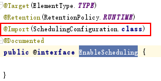
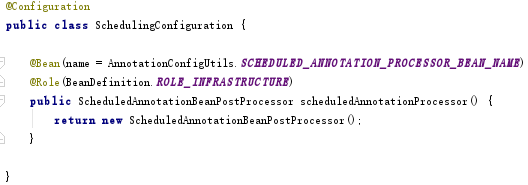
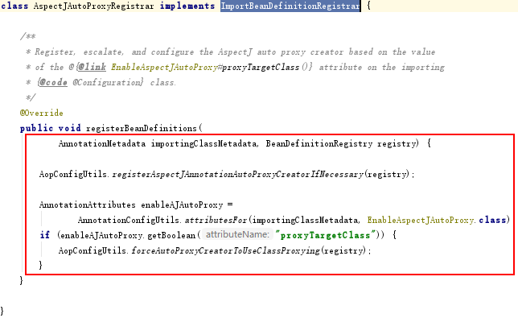

#Spring知识
##1 Spring特性
###1.1 依赖注入（Dependency Injection DI）
Spring的控制反转（Inversion of Control-IOC）与依赖注入（Dependency Inject）是同等概念，依赖注入的实现是IoC  
Spring IoC容器（ApplicationContext）负责创建Bean，通过该容器（上下文）将功能类注入到需要的Bean中  
关于上下文的配置，在Spring的不同版本中有不同侧重：  
1. Spring2.x：基于配置  
2. Spring3.x：基于注解  
3. Spring4.x：基于代码实现  

配置元数据：通过xml配置、注解配置、Java配置。元数据不具备执行能力，通过外界代码对这些元数据进行解析进行有意义操作  
声明Bean注解：  
- @Component组件，没有明确的介绍
- @Service业务了逻辑层使用，service层
- @Repository在数据访问层使用，dao层
- @Controller在表现层使用，MVC层、SpringMVC

注入Bean注解：  
- @Autowired：Spring提供的注解  
- @Inject：JSR-330提供的注解
- @Resource：JSR-250提供的注解
以上注解可以注解在set方法或属性上，在属性上使用代码量会减少  

##2 @Enable*的实现原理
@Enable*来开启某功能，避免大量代码，降低使用难度  
在@Enable*类中都含有一个@Import注解，用于导入配置类，这些自动开启的实现导入了一些自动配置的Bean，
导入配置的方式有三种：  
###2.1 直接导入配置类
以@EnableScheduling为例，导入了SchedulingConfiguration.class  
  
而SchedulingConfiguration的构造如下：  
  
###2.2 条件选择配置类
以@EnableAsync为例，导入了AsyncConfigurationSelector.class，通过条件选择导入配置类  
  
###2.3 动态注册Bean
以EnableAspectJAutoProxy为例，引入了AspectJAutoProxyRegistrar，实现了ImportBeanDefinitionRegistrar接口，在运行时可以自动添加Bean到已有的配置类。
  
AnnotationMetadata：用来获取当前配置类上的注解  
BeanDefinitionRegistry：用来注册Bean  

##3 Spring MVC基础
MVC：数据模型+视图+控制器（Model + View + Controller）  
三层架构：展现层+应用层+数据访问层（Presentation tier + Application tier + Data tier）  
###3.1 SpringMVC常用注解
1. @Controller
在类上使用，表明是controller，是Spring的一个Bean，Dispatcher Servlet自动扫描注解此类，将Web请求映射到注解了@RequestMapping的方法上  
2. @RequestMapping
映射Web请求（访问路径和参数）、处理类和方法。@RequestMapping可以注解到类或者方法上。在方法上路径会继承注解在类上的路径。@RequestMapping支持Servlet的request、response作为参数，也支持对request和response的媒体类型进行配置  
3. @ResponseBody
将返回值放在response体内，而不是返回一个页面。在基于Ajax请求时，可以以此注解返回数据而不是页面。该注解放置在返回值前或方法上  
4. @RequestBody
运行request参数在request体中，而不是在直接链接在地址后面。该注解放置在参数前  
5. @PathVariable
用来接收路径参数，如/news/001，可接收001作为参数，该注解放置在参数前  
6. @RestController
组合注解，组合@Controller、@ResponseBody，当只开发一个和页面交互数据的控制时，需要使用该注解，否则需要使用@Controller和@ResponseBody。定义了@RestController在返回值中就不需要定义@ResponseBody注解  

###3.2 控制器建言（@ControlloerAdvice）
通过@ControllerAdvice将对于控制器的全局配置放置在同一个位置，@Controller类可以使用@ExceptionHandler、@InitBinder、@ModelAttribute注解方法，以上这三个注解对于@RequestMapping的控制器的方法有效  
- @ExceptionHandler：用于全局处理控制器里的异常
- @InitBinder：设置WebDataBinder，WebDataBinder用来自动绑定前台请求参数到Model中
- @ModelAttribute：@ModelAttribute本来的作用是绑定键值对到Model里，此处是让全局的@RequestMapping都能获得在@ControllerAdvice中设置的键值对  

