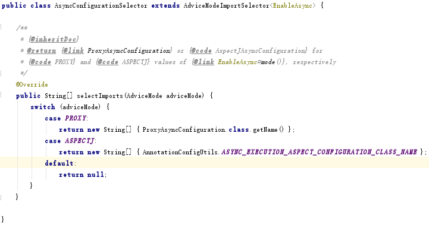

#Spring知识
##1 Spring特性
###1.1 依赖注入（Dependency Injection DI）
Spring的控制反转（Inversion of Control-IOC）与依赖注入（Dependency Inject）是同等概念，依赖注入的实现是IoC  
Spring IoC容器（ApplicationContext）负责创建Bean，通过该容器（上下文）将功能类注入到需要的Bean中  
关于上下文的配置，在Spring的不同版本中有不同侧重：  
1. Spring2.x：基于配置  
2. Spring3.x：基于注解  
3. Spring4.x：基于代码实现  

配置元数据：通过xml配置、注解配置、Java配置。元数据不具备执行能力，通过外界代码对这些元数据进行解析进行有意义操作  
声明Bean注解：  
- @Component组件，没有明确的介绍
- @Service业务了逻辑层使用，service层
- @Repository在数据访问层使用，dao层
- @Controller在表现层使用，MVC层、SpringMVC

注入Bean注解：  
- @Autowired：Spring提供的注解  
- @Inject：JSR-330提供的注解
- @Resource：JSR-250提供的注解
以上注解可以注解在set方法或属性上，在属性上使用代码量会减少  

##2 @Enable*的实现原理
@Enable*来开启某功能，避免大量代码，降低使用难度  
在@Enable*类中都含有一个@Import注解，用于导入配置类，这些自动开启的实现导入了一些自动配置的Bean，
导入配置的方式有三种：  
###2.1 直接导入配置类
以@EnableScheduling为例，导入了SchedulingConfiguration.class  
  
而SchedulingConfiguration的构造如下：  
  
###2.2 条件选择配置类
以@EnableAsync为例，导入了AsyncConfigurationSelector.class，通过条件选择导入配置类  
  
###2.3 动态注册Bean
以EnableAspectJAutoProxy为例，引入了AspectJAutoProxyRegistrar，实现了ImportBeanDefinitionRegistrar接口，在运行时可以自动添加Bean到已有的配置类。
  
AnnotationMetadata：用来获取当前配置类上的注解  
BeanDefinitionRegistry：用来注册Bean  

##3 Spring MVC基础
MVC：数据模型+视图+控制器（Model + View + Controller）  
三层架构：展现层+应用层+数据访问层（Presentation tier + Application tier + Data tier）  

