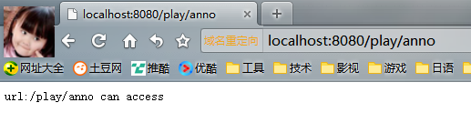
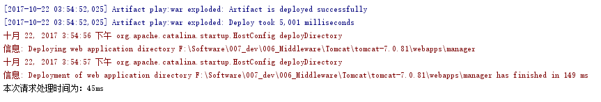
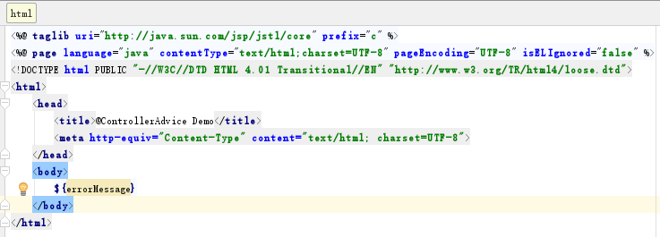

#Spring实操、实例
[TOC]
##1 Spring配置
###1.1 依赖注入
####1.1.1 基于注解配置依赖注入
1. 功能类
FunctionService.java  
将该功能声明为@Service，让它成为由Spring管理的类  
~~~java
package com.wuji1626.spring.annotation_di.service;
import org.springframework.stereotype.Service;
@Service
public class FunctionService {
    public String sayHello(String word){
        return "Hello " + word + " !";
    }
}
~~~
2. 使用功能类
UseFunctionService.java  
■这个类是使用功能类提供服务的类，将它也声明为Service，由Spring进行管理  
■使用@Autowired将FunctionService Bean注入到UseFunctionService中，让UseFunctionService具备FunctionService的功能  
~~~java
package com.wuji1626.spring.annotation_di.service;
import org.springframework.beans.factory.annotation.Autowired;
import org.springframework.stereotype.Service;
@Service
public class UseFunctionService {
    @Autowired
    FunctionService functionService;

    public String SayHello(String word){
        return functionService.sayHello(word);
    }
}
~~~
3. 配置类
DiConfig.java  
■@Configuration.java声明该类是一个配置类  
■@ComponentScan指定自动扫描注解的包的根  
~~~java
package com.wuji1626.spring.annotation_di.config;
import org.springframework.context.annotation.ComponentScan;
import org.springframework.context.annotation.Configuration;
/**
 * Created by Administrator on 2017/9/29.
 */
@Configuration
@ComponentScan("com.wuji1626.spring.annotation_di")
public class DiConfig {
}
~~~
4. 运行类
~~~java
package com.wuji1626.spring.annotation_di;
import com.wuji1626.spring.annotation_di.config.DiConfig;
import com.wuji1626.spring.annotation_di.service.UseFunctionService;
import org.springframework.context.annotation.AnnotationConfigApplicationContext;
/**
 * Created by Administrator on 2017/9/29.
 */
public class Main {
    public static void main(String[] args){
        AnnotationConfigApplicationContext context = new AnnotationConfigApplicationContext(DiConfig.class);

        UseFunctionService useFunctionService = context.getBean(UseFunctionService.class);
        System.out.println(useFunctionService.SayHello("Di"));

        context.close();
    }
}
~~~

####1.1.2 基于Java配置的依赖注入 
1. 功能类Bean
FunctionService.java  
与1.1.1中的区别是该类，没有了@Service的Bean的注解  
~~~java
package com.wuji1626.spring.javaconfig_di.service;
import org.springframework.stereotype.Service;
/**
 * Created by Administrator on 2017/9/28.
 */
public class FunctionService {
    public String sayHello(String word){
        return "Hello " + word + " !";
    }
}
~~~
2.功能使用类
UseFunctionService.java  
该类的逻辑与1.1.1相同，只是将之前@Service与@Autowired注解去掉  
~~~java
package com.wuji1626.spring.javaconfig_di.service;
import org.springframework.beans.factory.annotation.Autowired;
import org.springframework.stereotype.Service;
/**
 * Created by Administrator on 2017/9/29.
 */
public class UseFunctionService {
    FunctionService functionService;
    public void setFunctionService(FunctionService functionService) {
        this.functionService = functionService;
    }
    public String SayHello(String word){
        return functionService.sayHello(word);
    }
}
~~~
3. 配置类
JavaConfig.java  
~~~java
package com.wuji1626.spring.javaconfig_di.config;
import com.wuji1626.spring.javaconfig_di.service.FunctionService;
import com.wuji1626.spring.javaconfig_di.service.UseFunctionService;
import org.springframework.context.annotation.Bean;
/**
 * Created by Administrator on 2017/9/29.
 */
public class JavaConfig {
    @Bean
    public FunctionService functionService(){
        return new FunctionService();
    }
    @Bean
    public UseFunctionService useFunctionService(){
        UseFunctionService useFunctionService = new UseFunctionService();
        useFunctionService.setFunctionService(functionService());
        return useFunctionService;
    }
}
~~~
4. 运行类
Main.java
~~~java
package com.wuji1626.spring.javaconfig_di;
import com.wuji1626.spring.javaconfig_di.config.JavaConfig;
import com.wuji1626.spring.javaconfig_di.service.UseFunctionService;
import org.springframework.context.annotation.AnnotationConfigApplicationContext;
/**
 * Created by Administrator on 2017/9/30.
 */
public class Main {
    public static void main(String[] args){
        AnnotationConfigApplicationContext context = new AnnotationConfigApplicationContext(JavaConfig.class);
        UseFunctionService useFunctionService = context.getBean(UseFunctionService.class);
        System.out.println(useFunctionService.SayHello("java config"));
        context.close();
    }
}
~~~
运行结果：  
  

###1.2 AOP
AOP面向切面编程，相对于OOP面向对象编程。让一组类共享相同的行为。在OOP中通过继承类和实现接口实现，同时增加了耦合度，而且Java的继承都是单继承，阻碍更多行为添加到类上  
Spring支持AspectJ注解式切面：  
1. @Aspect：声明一个切面
2. @After、@Before、@Around定义建言（advice），直接将拦截规则（切点）作为参数
3. @After、@Before、@Around参数的拦截规则为切点（PointCut），为了使切点复用，可使用@PointCut专门定义拦截规则，在@After、@Before、@Around的参数中调用
4. 符合条件的每隔被拦截处为连接点（JoinPoint）

样例：  
1. POM依赖
为使用Aspectj，需要增加Aspectj依赖：  
~~~xml
<dependency>
      <groupId>org.aspectj</groupId>
      <artifactId>aspectjrt</artifactId>
      <version>1.8.5</version>
    </dependency>
    <dependency>
      <groupId>org.aspectj</groupId>
      <artifactId>aspectjweaver</artifactId>
      <version>1.8.5</version>
    </dependency>
~~~
2. 拦截规则注解
~~~java
package com.wuji1626.spring.aop;
import java.lang.annotation.*;
/**
 * Created by Administrator on 2017/10/6.
 */
@Target(ElementType.METHOD)
@Retention(RetentionPolicy.RUNTIME)
@Documented
public @interface Action {
    String name();
}
~~~
3. 使用注解的被拦截类
~~~java
package com.wuji1626.spring.aop.service;
import com.wuji1626.spring.aop.Action;
import org.springframework.stereotype.Service;
/**
 * Created by Administrator on 2017/10/6.
 */
@Service
public class DemoAnnotationService {
    @Action(name="注解式拦截的add操作")
    public void add(){}
}
~~~
4. 使用方法规则被拦截类
~~~java
package com.wuji1626.spring.aop.service;
import org.springframework.stereotype.Service;
/**
 * Created by Administrator on 2017/10/6.
 */
@Service
public class DemoMethodService {
    public void add(){}
}
~~~
5. 切面
~~~java
package com.wuji1626.spring.aop.aspect;
import com.wuji1626.spring.aop.Action;
import org.aspectj.lang.JoinPoint;
import org.aspectj.lang.annotation.After;
import org.aspectj.lang.annotation.Aspect;
import org.aspectj.lang.annotation.Before;
import org.aspectj.lang.annotation.Pointcut;
import org.aspectj.lang.reflect.MethodSignature;
import org.springframework.stereotype.Component;
import java.lang.reflect.Method;
/**
 * Created by Administrator on 2017/10/6.
 */
@Aspect
@Component
public class LogAspect {
    @Pointcut("@com.wuji1626.spring.aop.Action")
    public void annotationPointCut(){};
    @After("annotationPointCut()")
    public void after(JoinPoint joinPoint){
        MethodSignature signature = (MethodSignature) joinPoint.getSignature();
        Method method = signature.getMethod();
        Action action = method.getAnnotation(Action.class);
        System.out.println("注解式拦截" + action.name());
    }
    @Before("execution(*com.wuji1626.spring.aop.service.DemoMethodService.*(..))")
    public void before(JoinPoint joinPoint){
        MethodSignature signature = (MethodSignature) joinPoint.getSignature();
        Method method = signature.getMethod();
        System.out.println("方法规则式拦截" + method.getName());
    }
}
~~~
6. 配置类
通过注解@EnableAspectJAutoProxy开启Spring对AspectJ代理支持  
~~~java
package com.wuji1626.spring.aop.config;
import org.springframework.context.annotation.Configuration;
import org.springframework.context.annotation.EnableAspectJAutoProxy;
import org.springframework.stereotype.Component;
/**
 * Created by Administrator on 2017/10/7.
 */
@Configuration
@Component("com.wuji1626.spring.aop")
@EnableAspectJAutoProxy
public class AopConfig {
}
~~~
7. 运行
~~~java
package com.wuji1626.spring.aop;
import com.wuji1626.spring.aop.config.AopConfig;
import com.wuji1626.spring.aop.service.DemoAnnotationService;
import com.wuji1626.spring.aop.service.DemoMethodService;
import org.springframework.context.annotation.AnnotationConfigApplicationContext;
import org.springframework.test.context.support.AnnotationConfigContextLoader;
/**
 * Created by Administrator on 2017/10/7.
 */
public class Main {
    public static void main(String[] args){
        AnnotationConfigApplicationContext context = new AnnotationConfigApplicationContext(AopConfig.class);
        DemoAnnotationService demoAnnotationService = context.getBean(DemoAnnotationService.class);
        DemoMethodService demoMethodService = context.getBean(DemoMethodService.class);
        demoAnnotationService.add();
        demoMethodService.add();
        context.close();
    }
}
~~~
运行结果：  
  

###1.3 Bean的Scope
Spring的Scope：  
1. Singleton：每个Spring容器中只有一个Bean实例，Spring的默认配置，全容器共享一个实例
2. Prototype：每次调用新建一个Bean实例
3. Request：Web项目中，每个http request新建一个Bean实例
4. Session：Web项目中，每个http session新建一个Bean实例
5. GlobalSession：只在Portal应用中有用，给每个global http session新建一个Bean实例
6. @StepScope：Spring Batch中的选项

Bean Scope案例：  
1. 创建Singleton服务  
~~~java
package com.wuji1626.spring.scope.service;
import org.springframework.stereotype.Service;
/**
 * Created by Administrator on 2017/10/7.
 */
@Service
public class DemoSingletonService {
}
~~~
2. 创建prototype服务
~~~java
package com.wuji1626.spring.scope.service;
import org.springframework.context.annotation.Scope;
import org.springframework.stereotype.Service;
/**
 * Created by Administrator on 2017/10/7.
 */
@Service
@Scope("prototype")
public class DemoPrototypeService {
}
~~~
3. 配置类
~~~java
package com.wuji1626.spring.scope.config;
import org.springframework.context.annotation.ComponentScan;
import org.springframework.context.annotation.Configuration;
/**
 * Created by Administrator on 2017/10/7.
 */
@Configuration
@ComponentScan("com.wuji1626.spring.scope")
public class ScopeConfig {
}
~~~
4. 运行类
~~~java
package com.wuji1626.spring.scope;
import com.wuji1626.spring.scope.config.ScopeConfig;
import com.wuji1626.spring.scope.service.DemoPrototypeService;
import com.wuji1626.spring.scope.service.DemoSingletonService;
import org.springframework.context.annotation.AnnotationConfigApplicationContext;
/**
 * Created by Administrator on 2017/10/7.
 */
public class Main {
    public static void main(String[] args){
        AnnotationConfigApplicationContext context = new AnnotationConfigApplicationContext(ScopeConfig.class);
        DemoSingletonService s1 = context.getBean(DemoSingletonService.class);
        DemoPrototypeService p1 = context.getBean(DemoPrototypeService.class);
        DemoSingletonService s2 = context.getBean(DemoSingletonService.class);
        DemoPrototypeService p2 = context.getBean(DemoPrototypeService.class);
        System.out.println("s1和s2是否相等：" + s1.equals(s2));
        System.out.println("p1和p2是否相等：" + p1.equals(p2));
    }
}
~~~
结果：  
  

###1.4 Spring EL和资源调用
1. POM中增加依赖
需要commons-io引用  
~~~xml
    <dependency>
      <groupId>commons-io</groupId>
      <artifactId>commons-io</artifactId>
      <version>2.3</version>
    </dependency>
~~~
2. 创建test.properties文件及text文件
el.properties  
~~~
book.auther=zhangwenhe
book.name=Che in Action
~~~
el_text.txt 
~~~
This is a text File content.
~~~
3. 创建服务类
~~~java
package com.wuji1626.spring.el.service;
import org.springframework.beans.factory.annotation.Value;
import org.springframework.stereotype.Service;
/**
 * Created by Administrator on 2017/10/7.
 */
@Service
public class DemoService {
    @Value("其他属性")
    private String another;
    public String getAnother() {
        return another;
    }
    public void setAnother(String another) {
        this.another = another;
    }
}
~~~
4. 配置类
~~~java
package com.wuji1626.spring.el.config;
import org.apache.commons.io.IOUtils;
import org.springframework.beans.factory.annotation.Autowired;
import org.springframework.beans.factory.annotation.Value;
import org.springframework.context.annotation.ComponentScan;
import org.springframework.context.annotation.PropertySource;
import org.springframework.context.support.PropertySourcesPlaceholderConfigurer;
import org.springframework.core.env.Environment;
import org.springframework.core.io.Resource;
import org.springframework.stereotype.Component;
import java.io.IOException;
/**
 * Created by Administrator on 2017/10/7.
 */
@Component
@ComponentScan("com.wuji1626.spring.el")
@PropertySource("classpath:el.properties")
public class ElConfig {
    @Value("I Love You")
    private String normal;
    @Value("#{systemProperties['os.name']}")
    private String osName;
    @Value("#{T(java.lang.Math).random()*100.0}")
    private double randomNumber;
    @Value("#{demoService.another}")
    private String fromAnohter;
    @Value("classpath:el_text.txt")
    private Resource testFile;
    @Value("http://www.baidu.com")
    private Resource testUrl;
    @Value("${book.name}")
    private String bookName;
    @Autowired
    private Environment environment;
	// 为保证${book.name}基于配置文件的生效，需要注入PropertySourcesPlaceholderConfigurer
    @Bean //注入配置文件,
    public static PropertySourcesPlaceholderConfigurer propertySourcesPlaceholderConfigurer(){
        return new PropertySourcesPlaceholderConfigurer();
    }
    public void outputResource(){
        System.out.println("正常输出：" + normal);
        System.out.println("系统变量：" + osName);
        System.out.println("数学公式：" + randomNumber);
        System.out.println("从其他类属性：" + fromAnohter);
        try {
            System.out.print("文件输出：");
            System.out.println(IOUtils.toString(testFile.getInputStream()));
            System.out.print("互联网返回：");
            System.out.println(IOUtils.toString(testUrl.getInputStream()));
        } catch (IOException e) {
            e.printStackTrace();
        }
        System.out.println("注入配置文件：" + bookName);
        System.out.println("注入配置文件：" + environment.getProperty("book.author"));
    }
}
~~~
5. 运行类
~~~java
package com.wuji1626.spring.el;
import com.wuji1626.spring.el.config.ElConfig;
import org.springframework.context.annotation.AnnotationConfigApplicationContext;
/**
 * Created by Administrator on 2017/10/7.
 */
public class Main {
    public static void main(String[] args) {
        AnnotationConfigApplicationContext context = new AnnotationConfigApplicationContext(ElConfig.class);
        ElConfig resourceService = context.getBean(ElConfig.class);
        resourceService.outputResource();
        context.close();
    }
}
~~~
结果：  
  

###1.5 Bean初始化与销毁
Bean的生命周期管理：  
1. Java配置：使用@Bean的initMethod、destroyMethod（相当于xml配置中的init-method、destroy-method）
2. 注解方式：利用JSR-250的@PostConstruct、@PreDestroy

案例：
1. 增加JSR-250的支持
~~~xml
    <dependency>
      <groupId>javax.annotation</groupId>
      <artifactId>jsr250-api</artifactId>
      <version>1.0</version>
    </dependency>
~~~
2. 用@Bean形式的Bean
BeanWayService.java
~~~java
package com.wuji1626.spring.bean_lifecycle.service;
/**
 * Created by Administrator on 2017/10/7.
 */
public class BeanWayService {
    public void init(){
        System.out.println("@Bean-init-method");
    }
    public BeanWayService(){
        super();
        System.out.println("初始化构造函数-BeanWayService");
    }
    public void destroy(){
        System.out.println("@Bean-destroy-method");
    }
}
~~~
3. 用JSR250形式的Bean
JSR250WayService.java
~~~java
package com.wuji1626.spring.bean_lifecycle.service;
import javax.annotation.PostConstruct;
import javax.annotation.PreDestroy;
/**
 * Created by Administrator on 2017/10/8.
 */
public class JSR250WayService {
    @PostConstruct
    public void init(){
        System.out.println("jsr250-init-method");
    }
    public JSR250WayService(){
        super();
        System.out.println("初始化构造函数-JSR250WayService");
    }
    @PreDestroy
    public void destroy(){
        System.out.println("jsr250-destroy-method");
    }
}
~~~
4. 配置
~~~java
package com.wuji1626.spring.bean_lifecycle.config;
import com.wuji1626.spring.bean_lifecycle.service.BeanWayService;
import com.wuji1626.spring.bean_lifecycle.service.JSR250WayService;
import org.springframework.context.annotation.Bean;
import org.springframework.context.annotation.ComponentScan;
import org.springframework.context.annotation.Configuration;
/**
 * Created by Administrator on 2017/10/8.
 */
@Configuration
@ComponentScan("com.wuji1626.spring.bean_lifecycle")
public class PrePostConfig {
    @Bean(initMethod = "init", destroyMethod = "destroy")
    BeanWayService beanWayService(){
        return new BeanWayService();
    }
    @Bean
    JSR250WayService jsr250WayService(){
        return new JSR250WayService();
    }
}
~~~
5. 运行类
~~~java
package com.wuji1626.spring.bean_lifecycle;
import com.wuji1626.spring.bean_lifecycle.config.PrePostConfig;
import com.wuji1626.spring.bean_lifecycle.service.BeanWayService;
import com.wuji1626.spring.bean_lifecycle.service.JSR250WayService;
import org.springframework.context.annotation.AnnotationConfigApplicationContext;
import javax.annotation.PreDestroy;
/**
 * Created by Administrator on 2017/10/7.
 */
public class Main {
    public static void main(String[] args) {
        AnnotationConfigApplicationContext context = new AnnotationConfigApplicationContext(PrePostConfig.class);
        BeanWayService beanWayService = context.getBean(BeanWayService.class);
        JSR250WayService jsr250WayService = context.getBean(JSR250WayService.class);
        context.close();
    }
}
~~~
6. 结果
  

###1.6 Profile
Profile：在不同环境下使用不同配置（如：开发环境、生产环境的不同配置）  
使用Profile的方法：  
1. 通过设定Environment的ActiveProfiles来设定当前context需要使用的配置环境。在开发中使用@Profile注解类，达到不同情况下，选择实例化不同的Bean
2. 通过设定jvm的spring.profiles.active参数来设置环境
3. Web项目在Servlet的context parameter中选择环境

案例：
1. DemoBean.java
~~~java
package com.wuji1626.spring.profile.bean;
/**
 * Created by Administrator on 2017/10/8.
 */
public class DemoBean {
    private String content;
    public DemoBean(String content){
        super();
        this.content = content;
    }
    public String getContent() {
        return content;
    }
    public void setContent(String content) {
        this.content = content;
    }
}
~~~
2. 配置类
~~~java
package com.wuji1626.spring.profile.config;
import com.wuji1626.spring.profile.bean.DemoBean;
import org.springframework.context.annotation.Bean;
import org.springframework.context.annotation.Configuration;
import org.springframework.context.annotation.Profile;
/**
 * Created by Administrator on 2017/10/8.
 */
@Configuration
public class ProfileConfig {
    @Bean
    @Profile("dev")
    public DemoBean devDemoBean(){
        return new DemoBean("from development profile");
    }
    @Bean
    @Profile("prod")
    public DemoBean prodDemoBean(){
        return new DemoBean("from production profile");
    }
}
~~~
3. 运行类
~~~java
package com.wuji1626.spring.profile;
import com.wuji1626.spring.profile.bean.DemoBean;
import com.wuji1626.spring.profile.config.ProfileConfig;
import org.springframework.context.annotation.AnnotationConfigApplicationContext;
/**
 * Created by Administrator on 2017/10/8.
 */
public class Main {
    public static void main(String[] args) {
        AnnotationConfigApplicationContext context = new AnnotationConfigApplicationContext();
        context.getEnvironment().setActiveProfiles("prod");
        context.register(ProfileConfig.class);
        context.refresh();
        DemoBean demoBean = context.getBean(DemoBean.class);
        System.out.println(demoBean.getContent());
        context.close();
    }
}
~~~
4. 结果
  
如果将环境改为"dev"，则结果：
  

###1.7 事件
spring的事件，支持Bean与Bean之间消息通信，流程如下：
1. 自定义事件，继承ApplicationEvent
2. 定义事件监听器，实现ApplicationListener
3. 使用容器发布事件

案例：
1. 事件类
DemoEvent.java
~~~java
package com.wuji1626.spring.application_event.event;
import org.springframework.context.ApplicationEvent;
/**
 * Created by Administrator on 2017/10/8.
 */
public class DemoEvent extends ApplicationEvent {
    private static final long serialVersionUID = 1L;
    private String msg;
    /**
     * Create a new ApplicationEvent.
     *
     * @param source the component that published the event (never {@code null})
     */
    public DemoEvent(Object source, String msg) {
        super(source);
        this.msg = msg;
    }
    public String getMsg() {
        return msg;
    }
    public void setMsg(String msg) {
        this.msg = msg;
    }
}
~~~
2. 监听类
DemoListener.java  
~~~java
package com.wuji1626.spring.application_event.event;
import org.springframework.context.ApplicationListener;
import org.springframework.stereotype.Component;
/**
 * Created by Administrator on 2017/10/8.
 */
@Component
public class DemoListener implements ApplicationListener<DemoEvent> {
    public void onApplicationEvent(DemoEvent event) {
        String msg = event.getMsg();
        System.out.println("我（bean-demoListener）接收到了bean-demoPublisher发布的消息：" + msg);
    }
}
~~~
3. 事件发布类
DemoPublisher.java
~~~java
package com.wuji1626.spring.application_event.event;
import org.springframework.beans.factory.annotation.Autowired;
import org.springframework.context.ApplicationContext;
import org.springframework.context.ApplicationEvent;
import org.springframework.stereotype.Component;
/**
 * Created by Administrator on 2017/10/8.
 */
@Component
public class DemoPublisher {
    @Autowired
    ApplicationContext applicationContext;
    public void publish(String msg){
        applicationContext.publishEvent(new DemoEvent(this,msg));
    }
}
~~~
4. 配置类
EventConfig.java  
~~~java
package com.wuji1626.spring.application_event.config;
import org.springframework.context.annotation.ComponentScan;
import org.springframework.context.annotation.Configuration;
/**
 * Created by Administrator on 2017/10/8.
 */
@Configuration
@ComponentScan("com.wuji1626.spring.application_event")
public class EventConfig {
}
~~~
5. 运行类
Main.java  
~~~java
package com.wuji1626.spring.application_event;
import com.wuji1626.spring.application_event.config.EventConfig;
import com.wuji1626.spring.application_event.event.DemoPublisher;
import org.springframework.context.annotation.AnnotationConfigApplicationContext;
/**
 * Created by Administrator on 2017/10/8.
 */
public class Main {
    public static void main(String[] args) {
        AnnotationConfigApplicationContext context = new AnnotationConfigApplicationContext(EventConfig.class);
        DemoPublisher demoPublisher = context.getBean(DemoPublisher.class);
        demoPublisher.publish("hello application event!");
        context.close();
    }
}
~~~
6. 运行结果
  

###1.8 Spring Aware
为了使Bean能使用容器本身的资源，需要Bean意识到容器的存在（引入依赖注入和控制反转的目的就是为了让Java程序意识不到容器的存在，从而降低耦合度），这就是Spring Aware  
Spring提供的Aware接口：  
名称|说明
---|---
BeanNameAware|获得到容器中Bean的名称
BeanFactoryAwre|获取档期bean factory，只有可以调用容器的服务
ApplicationContextAware|当前的application context，这样可以调用容器的服务
MessageSourceAware|获得message source，这样可以获得文本信息
ApplicationEventPublisherAware|应用事件发布器，可以发布事件，如上面的DemoPublisher也可以实现这个借口来发布事件
ResourceLoaderAware|获得资源加载器，可获得外部资源文件
ApplicationContext接口继承了MessageSource、ApplicationEventPublisher、ResourceLoader接口，Bean一旦继承ApplicationContextAware即可获得Spring容器的所有服务，原则上还是用到什么接口，实现什么接口  

案例：
1. 资源
spring_aware.txt
~~~
This words is from resources!
~~~
2. 服务类
AwareService.java
~~~java
package com.wuji1626.spring.aware.service;
import org.apache.commons.io.IOUtils;
import org.springframework.beans.factory.BeanNameAware;
import org.springframework.context.ResourceLoaderAware;
import org.springframework.core.io.Resource;
import org.springframework.core.io.ResourceLoader;
import java.io.IOException;
/**
 * Created by Administrator on 2017/10/8.
 */
@Service
public class AwareService implements BeanNameAware,ResourceLoaderAware {
    private String beanName;
    private ResourceLoader loader;
    public void setBeanName(String name) {
        this.beanName = name;
    }
    public void setResourceLoader(ResourceLoader resourceLoader) {
        this.loader = resourceLoader;
    }
    public void outputResult(){
        System.out.println("Bean的名称为：" + beanName);
        Resource resource = loader.getResource("classpath:spring_aware.txt");
        try {
            System.out.println("ResourceLoader加载文件内容为：" + IOUtils.toString(resource.getInputStream()));
        } catch (IOException e) {
            e.printStackTrace();
        }
    }
}
~~~
3. 配置类
AwareConfig.java
~~~java
package com.wuji1626.spring.aware.config;
import org.springframework.context.annotation.ComponentScan;
import org.springframework.context.annotation.Configuration;
/**
 * Created by Administrator on 2017/10/8.
 */
@Configuration
@ComponentScan("com.wuji1626.spring.aware")
public class AwareConfig {
}
~~~
4. 运行类
Main.java
~~~java
package com.wuji1626.spring.aware;
import com.wuji1626.spring.aware.config.AwareConfig;
import com.wuji1626.spring.aware.service.AwareService;
import org.springframework.context.annotation.AnnotationConfigApplicationContext;
/**
 * Created by Administrator on 2017/10/8.
 */
public class Main {
    public static void main(String[] args) {
        AnnotationConfigApplicationContext context = new AnnotationConfigApplicationContext(AwareConfig.class);
        AwareService awareService = context.getBean(AwareService.class);
        awareService.outputResult();
        context.close();
    }
}
~~~
5. 运行结果
  

###1.9 多线程
Spring通过TaskExecutor来实现多线程和并发编程。使用ThreadPoolTaskExecutor可实现一个基于线程池的TaskExecutor。任务一般是异步的，可以通过@EnableAsync开启对异步任务的支持，并通过在实际执行的Bean的方法中使用@Async注解来声明其是一个异步任务

案例：  
1. 配置类
TaskExecutorConfig.java
~~~java
package com.wuji1626.spring.multi_thread.config;
import org.springframework.scheduling.annotation.AsyncConfigurer;
import org.springframework.scheduling.concurrent.ThreadPoolTaskExecutor;
import java.util.concurrent.Executor;
/**
 * Created by Administrator on 2017/10/8.
 */
@Component
@ComponentScan("com.wuji1626.spring.multi_thread")
@EnableAsync
public class TaskExecutorConfig implements AsyncConfigurer {
    public Executor getAsyncExecutor() {
        ThreadPoolTaskExecutor taskExecutor = new ThreadPoolTaskExecutor();
        taskExecutor.setCorePoolSize(5);
        taskExecutor.setMaxPoolSize(10);
        taskExecutor.setQueueCapacity(25);
        taskExecutor.initialize();
        return taskExecutor;
    }
}
~~~
2. 任务执行类
AsyncTaskService.java
~~~java
package com.wuji1626.spring.multi_thread.service;
import org.springframework.scheduling.annotation.Async;
import org.springframework.stereotype.Service;
/**
 * Created by Administrator on 2017/10/8.
 */
@Service
public class AsynTaskService {
    @Async
    public void executeAsyncTask(Integer i){
        System.out.println("执行异步任务：" + i);
    }
    @Async
    public void executeAsyncTaskPlus(Integer i){
        System.out.println("执行异步任务+1：" + (i + 1));
    }
}
~~~
3. 运行类
Main.java
~~~java
package com.wuji1626.spring.multi_thread;
import com.wuji1626.spring.multi_thread.config.TaskExecutorConfig;
import com.wuji1626.spring.multi_thread.service.AsynTaskService;
import org.springframework.context.annotation.AnnotationConfigApplicationContext;
/**
 * Created by Administrator on 2017/10/8.
 */
public class Main {
    public static void main(String[] args) {
        AnnotationConfigApplicationContext context = new AnnotationConfigApplicationContext(TaskExecutorConfig.class);
        AsynTaskService asynTaskService = context.getBean(AsynTaskService.class);
        for (int i = 0 ; i < 10 ; i++){
            asynTaskService.executeAsyncTask(i);
            asynTaskService.executeAsyncTaskPlus(i);
        }
        context.close();
    }
}
~~~
4. 结果
  

###1.10 计划任务
@EnableScheduling：开启对计划任务的支持，在要执行计划任务的方法上注解@Scheduled，声明一个计划任务。可以支持多种类型的计划任务：cron、fixDelay、fixRat  

案例：  
1. 服务类
服务类中指定计划计划任务的方法  @Scheduled  
ScheduledTaskService.class  
~~~java
package com.wuji1626.spring.scheduled.service;
import org.springframework.scheduling.annotation.Scheduled;
import org.springframework.stereotype.Service;
import java.text.SimpleDateFormat;
import java.util.Date;
/**
 * Created by Administrator on 2017/10/10.
 */
@Service
public class ScheduledTaskService {
    private static final SimpleDateFormat dateFormat = new SimpleDateFormat("HH:mm:ss");
    @Scheduled(fixedRate = 5000)
    public void reportCurrentTime(){
        System.out.println("每隔5秒执行一次" + dateFormat.format(new Date()));
    }
    @Scheduled(cron = "0 0 11 ? * *")
    public void fixTimeExcution(){
        System.out.println("在指定时间" + dateFormat.format(new Date()) + "执行");
    }
}
~~~
2. 配置类
配置类中开启计划任务选项  @EnableScheduling  
TaskSchedulerConfig.class
~~~java
package com.wuji1626.spring.scheduled.config;
import org.springframework.beans.factory.annotation.Configurable;
import org.springframework.context.annotation.ComponentScan;
import org.springframework.context.annotation.Configuration;
import org.springframework.scheduling.annotation.EnableScheduling;
/**
 * Created by Administrator on 2017/10/10.
 */
@Configuration
@ComponentScan("com.wuji1626.spring.scheduled")
@EnableScheduling
public class TaskSchedulerConfig {
}
~~~
3. 运行类
Main.java
~~~java
package com.wuji1626.spring.scheduled;
import com.wuji1626.spring.scheduled.config.TaskSchedulerConfig;
import org.springframework.context.annotation.AnnotationConfigApplicationContext;
/**
 * Created by Administrator on 2017/10/10.
 */
public class Main {
    public static void main(String[] args) {
        AnnotationConfigApplicationContext context = new AnnotationConfigApplicationContext(TaskSchedulerConfig.class);
    }
}
~~~

###1.11 条件注解
@Conditional：满足特定条件创建特定Bean，是Spring Boot的基础，Spring Boot大量使用条件注解  

案例：  
1. 条件类
设定两个条件类的实现：  
WindowsCondition.java
~~~java
package com.wuji1626.spring.condition.condition;
import org.springframework.context.annotation.Condition;
import org.springframework.context.annotation.ConditionContext;
import org.springframework.core.type.AnnotatedTypeMetadata;
/**
 * Created by Administrator on 2017/10/10.
 */
public class WindowsCondition implements Condition {
    public boolean matches(ConditionContext context, AnnotatedTypeMetadata metadata) {
        return context.getEnvironment().getProperty("os.name").contains("Windows");
    }
}
~~~
LinuxCondition.java
~~~java
package com.wuji1626.spring.condition.condition;
import org.springframework.context.annotation.Condition;
import org.springframework.context.annotation.ConditionContext;
import org.springframework.core.type.AnnotatedTypeMetadata;
/**
 * Created by Administrator on 2017/10/10.
 */
public class LinuxCondition implements Condition {
    public boolean matches(ConditionContext context, AnnotatedTypeMetadata metadata) {
        return context.getEnvironment().getProperty("os.name").contains("Linux");
    }
}
~~~
2. 服务类
需要先定义一个
~~~java
package com.wuji1626.spring.condition.service;
/**
 * Created by Administrator on 2017/10/10.
 */
public interface ListService {
    public String showListed();
}
~~~
实现类
~~~java
package com.wuji1626.spring.condition.service.impl;
import com.wuji1626.spring.condition.service.ListService;
/**
 * Created by Administrator on 2017/10/10.
 */
public class WindowsListService implements ListService {
    public String showListed() {
        return "dir";
    }
}
~~~
~~~java
package com.wuji1626.spring.condition.service.impl;
import com.wuji1626.spring.condition.service.ListService;
/**
 * Created by Administrator on 2017/10/10.
 */
public class LinuxListService implements ListService {
    public String showListed() {
        return "ls";
    }
}
~~~
3. 配置类
ConditionConfig.java
~~~java
package com.wuji1626.spring.condition.config;
import com.wuji1626.spring.condition.condition.LinuxCondition;
import com.wuji1626.spring.condition.condition.WindowsCondition;
import com.wuji1626.spring.condition.service.ListService;
import com.wuji1626.spring.condition.service.impl.LinuxListService;
import com.wuji1626.spring.condition.service.impl.WindowsListService;
import org.springframework.context.annotation.Bean;
import org.springframework.context.annotation.ComponentScan;
import org.springframework.context.annotation.Conditional;
import org.springframework.context.annotation.Configuration;
/**
 * Created by Administrator on 2017/10/10.
 */
@Configuration
@ComponentScan("com.wuji1626.spring.condition")
public class ConditionConfig {
    @Bean
    @Conditional(WindowsCondition.class)
    public ListService windowsListService(){
        return new WindowsListService();
    }
    @Bean
    @Conditional(LinuxCondition.class)
    public ListService linuxListService(){
        return new LinuxListService();
    }
}
~~~
4. 运行类
~~~java
package com.wuji1626.spring.condition;
import com.wuji1626.spring.condition.config.ConditionConfig;
import com.wuji1626.spring.condition.service.ListService;
import org.springframework.context.annotation.AnnotationConfigApplicationContext;
/**
 * Created by Administrator on 2017/10/10.
 */
public class Main {
    public static void main(String[] args) {
        AnnotationConfigApplicationContext context = new AnnotationConfigApplicationContext(ConditionConfig.class);
        ListService listService = context.getBean(ListService.class);
        System.out.println(context.getEnvironment().getProperty("os.name") + "系统下的列表命令为：" + listService.showListed());
        context.close();
    }
}
~~~
5. 结果
  

###1.12 组合注解、元注解
元注解：可以注解到别的注解上的注解
组合组件：被元注解注解的注解，组合注解具备元注解的功能。可以将多个注解组合成一个新注解，简化代码  

案例：
1. 组合注解类  
WiselyConfiguration.java  
在注解中直接使用包名`@WiselyConfiguration("com.wuji1626.spring.assembly_annotation")`始终报`org.springframework.beans.factory.NoSuchBeanDefinitionException`异常，可能是由于Spring4.0.8 Configuration、ComponentScan注解中都含有value()方法，有冲突。在组合注解定义时，添加basePackages()属性，在注解时指定该属性，异常解除  
~~~java
package com.wuji1626.spring.assembly_annotation.annotation;
import org.springframework.context.annotation.ComponentScan;
import org.springframework.context.annotation.Configuration;
import java.lang.annotation.*;
/**
 * Created by Administrator on 2017/10/10.
 */
@Target(ElementType.TYPE)
@Retention(RetentionPolicy.RUNTIME)
@Documented
@Configuration
@ComponentScan
public @interface WiselyConfiguration {
    String[] value() default {};
    String[] basePackages() default {};
}
~~~
2. 服务类
DemoService.java
~~~java
package com.wuji1626.spring.assembly_annotation.service;
import org.springframework.stereotype.Service;
/**
 * Created by Administrator on 2017/10/10.
 */
@Service
public class DemoService {
    public void outputResult(){
        System.out.println("仍然可以获得Bean");
    }
}
~~~
3. 配置类
~~~java
package com.wuji1626.spring.assembly_annotation.config;
import com.wuji1626.spring.assembly_annotation.annotation.WiselyConfiguration;
import org.springframework.context.annotation.ComponentScan;
/**
 * Created by Administrator on 2017/10/10.
 */
@WiselyConfiguration(basePackages = "com.wuji1626.spring.assembly_annotation")
public class AnnotationConfig {
}
~~~
4. 运行类
Main.java
~~~java
package com.wuji1626.spring.assembly_annotation;
import com.wuji1626.spring.assembly_annotation.config.AnnotationConfig;
import com.wuji1626.spring.assembly_annotation.service.DemoService;
import org.springframework.context.annotation.AnnotationConfigApplicationContext;
/**
 * Created by Administrator on 2017/10/10.
 */
public class Main {
    public static void main(String[] args) {
        AnnotationConfigApplicationContext context = new AnnotationConfigApplicationContext(AnnotationConfig.class);
        DemoService demoService = context.getBean(DemoService.class);
        demoService.outputResult();
        context.close();
    }
}
~~~
5. 结果
  

##2 Spring MVC配置
###2.1 基本样例
1. pom.xml中添加必要的依赖  
~~~xml
<project xmlns="http://maven.apache.org/POM/4.0.0" xmlns:xsi="http://www.w3.org/2001/XMLSchema-instance"
  xsi:schemaLocation="http://maven.apache.org/POM/4.0.0 http://maven.apache.org/maven-v4_0_0.xsd">
  <modelVersion>4.0.0</modelVersion>
  <groupId>com.wuji1626</groupId>
  <artifactId>play</artifactId>
  <packaging>war</packaging>
  <version>1.0-SNAPSHOT</version>
  <name>play Maven Webapp</name>
  <url>http://maven.apache.org</url>
  <properties>
    <java.version>1.8</java.version>
    <project.build.sourceEncoding>UTF-8</project.build.sourceEncoding>
    <!-- Spring -->
    <org.springframework.version>4.1.5.RELEASE</org.springframework.version>
    <quartz.version>1.8.6</quartz.version>
    <!-- Web -->
    <jsp.version>2.2</jsp.version>
    <jstl.version>1.2</jstl.version>
    <servlet.version>3.1.0</servlet.version>
    <!-- Logging -->
    <logback.version>1.0.13</logback.version>
    <slf4j.version>1.7.5</slf4j.version>

  </properties>
  <dependencies>
    <dependency>
      <groupId>junit</groupId>
      <artifactId>junit</artifactId>
      <version>4.8.1</version>
      <scope>test</scope>
    </dependency>
    <dependency>
      <groupId>javax</groupId>
      <artifactId>javaee-api</artifactId>
      <version>8.0</version>
      <scope>provided</scope>
    </dependency>
    <dependency>
      <groupId>javax.servlet</groupId>
      <artifactId>jstl</artifactId>
      <version>${jstl.version}</version>
    </dependency>
    <dependency>
      <groupId>javax.servlet</groupId>
      <artifactId>javax.servlet-api</artifactId>
      <version>${servlet.version}</version>
      <scope>provided</scope>
    </dependency>
    <dependency>
      <groupId>javax.servlet.jsp</groupId>
      <artifactId>jsp-api</artifactId>
      <version>${jsp.version}</version>
      <scope>provided</scope>
    </dependency>

    <!-- Spring Reference-->
    <dependency>
      <groupId>org.springframework</groupId>
      <artifactId>spring-core</artifactId>
      <version>${org.springframework.version}</version>
    </dependency>
    <dependency>
      <groupId>org.springframework</groupId>
      <artifactId>spring-context</artifactId>
      <version>${org.springframework.version}</version>
    </dependency>
    <dependency>
      <groupId>org.springframework</groupId>
      <artifactId>spring-context-support</artifactId>
      <version>${org.springframework.version}</version>
    </dependency>
    <dependency>
      <groupId>org.springframework</groupId>
      <artifactId>spring-jdbc</artifactId>
      <version>${org.springframework.version}</version>
    </dependency>
    <dependency>
      <groupId>org.springframework</groupId>
      <artifactId>spring-orm</artifactId>
      <version>${org.springframework.version}</version>
    </dependency>
    <dependency>
      <groupId>org.springframework</groupId>
      <artifactId>spring-oxm</artifactId>
      <version>${org.springframework.version}</version>
    </dependency>
    <dependency>
      <groupId>org.springframework</groupId>
      <artifactId>spring-web</artifactId>
      <version>${org.springframework.version}</version>
    </dependency>
    <dependency>
      <groupId>org.springframework</groupId>
      <artifactId>spring-webmvc</artifactId>
      <version>${org.springframework.version}</version>
    </dependency>
    <dependency>
      <groupId>org.springframework</groupId>
      <artifactId>spring-test</artifactId>
      <version>${org.springframework.version}</version>
    </dependency>
    <dependency>
      <groupId>org.springframework</groupId>
      <artifactId>spring-beans</artifactId>
      <version>${org.springframework.version}</version>
    </dependency>
    <dependency>
      <groupId>org.springframework</groupId>
      <artifactId>spring-aop</artifactId>
      <version>${org.springframework.version}</version>
    </dependency>
    <!-- Spring and Transactions -->
    <dependency>
      <groupId>org.springframework</groupId>
      <artifactId>spring-tx</artifactId>
    </dependency>
    <dependency>
      <groupId>javax.annotation</groupId>
      <artifactId>jsr250-api</artifactId>
      <version>1.0</version>
    </dependency>
    <dependency>
      <groupId>org.aspectj</groupId>
      <artifactId>aspectjrt</artifactId>
      <version>1.8.5</version>
    </dependency>
    <dependency>
      <groupId>org.aspectj</groupId>
      <artifactId>aspectjweaver</artifactId>
      <version>1.8.5</version>
    </dependency>
    <dependency>
      <groupId>commons-io</groupId>
      <artifactId>commons-io</artifactId>
      <version>2.3</version>
    </dependency>
    <!-- LogBack and SLF4J -->
    <dependency>
      <groupId>org.slf4j</groupId>
      <artifactId>slf4j-api</artifactId>
      <version>${slf4j.version}</version>
    </dependency>
    <dependency>
      <groupId>log4j</groupId>
      <artifactId>log4j</artifactId>
      <version>1.2.16</version>
    </dependency>
    <dependency>
      <groupId>org.slf4j</groupId>
      <artifactId>jcl-over-slf4j</artifactId>
      <version>${slf4j.version}</version>
    </dependency>
    <dependency>
      <groupId>ch.qos.logback</groupId>
      <artifactId>logback-classic</artifactId>
      <version>${logback.version}</version>
    </dependency>
    <dependency>
      <groupId>ch.qos.logback</groupId>
      <artifactId>logback-core</artifactId>
      <version>${logback.version}</version>
    </dependency>
    <dependency>
      <groupId>ch.qos.logback</groupId>
      <artifactId>logback-access</artifactId>
      <version>${logback.version}</version>
    </dependency>
  </dependencies>
  <build>
    <plugins>
      <plugin>
        <groupId>org.apache.maven.plugins</groupId>
        <artifactId>maven-compiler-plugin</artifactId>
        <version>2.3.2</version>
        <configuration>
          <source>${java.version}</source>
          <target>${java.version}</target>
        </configuration>
      </plugin>
      <plugin>
        <groupId>org.apache.maven.plugins</groupId>
        <artifactId>maven-war-plugin</artifactId>
        <version>2.3</version>
        <configuration>
          <failOnMissingWebXml>false</failOnMissingWebXml>
        </configuration>
      </plugin>
    </plugins>
    <finalName>play</finalName>
  </build>
</project>
~~~
2. 对于logback日志文件的配置
在resources目录下添加logback.xml  
~~~xml
<?xml version="1.0" encoding="UTF-8"?>
<configuration scan="true" scanPeriod="1 seconds">
    <contextListener class="ch.qos.logback.classic.jul.LevelChangePropagator">
        <resetJUL>true</resetJUL>
    </contextListener>

    <jmxConfigurator />
    <appender name="console" class="ch.qos.logback.core.ConsoleAppender">
        <encoder>
            <pattern>logback: %d{HH:mm:ss.SSS} %logger{36} - %msg%n</pattern>
        </encoder>
    </appender>
    <logger name="org.springframe.web" level="DEBUG" />
    <root level="info">
        <appender-ref ref="console"/>
    </root>
</configuration>
~~~
3. jsp页面
在resources目录下添加views目录，在目录下添加index.jsp文件  
~~~html
<%@ page language="java" contentType="text/html; charset=UTF-8" pageEncoding="UTF-8"%>
<!DOCTYPE html PUBLIC "-//W3C//DTD HTML 4.01 Transitional//EN" "http://www.w3.org/TR/html4/loose.dtd">
<html>
    <head>
        <meta http-equiv="Content-Type" content="text/html; charset=UTF-8">
        <title>Insert title here</title>
    </head>
    <body>
        <pre>
            Welcome to Spring MVC world!
        </pre>
    </body>
</html>
~~~
4. SpringMVC配置类
MyMvcConfig.java
在配置类中指明ViewResolver的前缀和后缀，由于resources/views目录在编译后被存储在target/WEB-INF/classes/views/目录下，因此前缀指明`/WEB-INF/classes/views/`目录，后缀自然是.jsp  
~~~java
package com.wuji1626.spring.webmvc;
import org.springframework.context.annotation.Bean;
import org.springframework.context.annotation.ComponentScan;
import org.springframework.context.annotation.Configuration;
import org.springframework.web.servlet.config.annotation.EnableWebMvc;
import org.springframework.web.servlet.view.InternalResourceViewResolver;
import org.springframework.web.servlet.view.JstlView;
/**
 * Created by Administrator on 2017/10/18.
 */
@Configuration
@EnableWebMvc
@ComponentScan("com.wuji1626.spring.webmvc")
public class MyMvcConfig {
    @Bean
    public InternalResourceViewResolver viewResolver(){
        InternalResourceViewResolver viewResolver = new InternalResourceViewResolver();
        viewResolver.setPrefix("/WEB-INF/classes/views/");
        viewResolver.setSuffix(".jsp");
        viewResolver.setViewClass(JstlView.class);
        return viewResolver;
    }
}
~~~
5. Web配置
WebInitializer.java  
~~~java
package com.wuji1626.spring.webmvc;
import org.springframework.web.WebApplicationInitializer;
import org.springframework.web.context.support.AnnotationConfigWebApplicationContext;
import org.springframework.web.servlet.DispatcherServlet;
import javax.servlet.ServletContext;
import javax.servlet.ServletException;
import javax.servlet.ServletRegistration;
/**
 * Created by Administrator on 2017/10/18.
 */
public class WebInitializer implements WebApplicationInitializer {
    @Override
    public void onStartup(ServletContext servletContext) throws ServletException {
        AnnotationConfigWebApplicationContext ctx = new AnnotationConfigWebApplicationContext();
        ctx.register(MyMvcConfig.class);
        ctx.setServletContext(servletContext);

        ServletRegistration.Dynamic servlet = servletContext.addServlet("dispatcher", new DispatcherServlet(ctx));
        servlet.addMapping("/");
        servlet.setLoadOnStartup(1);

    }
}
~~~

###2.2 SpringMVC注解样例
1. 创建一个Demo对象
DemoObj.java  
~~~java
package com.wuji1626.spring.webmvc.domain;
/**
 * Created by Administrator on 2017/10/21.
 */
public class DemoObj {
    private Long id;
    private String name;

    public DemoObj() {
        super();
    }

    public DemoObj(Long id, String name) {
        super();
        this.id = id;
        this.name = name;
    }

    public Long getId() {
        return id;
    }

    public void setId(Long id) {
        this.id = id;
    }

    public String getName() {
        return name;
    }

    public void setName(String name) {
        this.name = name;
    }
}
~~~
2. 注解Controller
DemoAnnController.class  
~~~java
package com.wuji1626.spring.webmvc.controller;
import com.wuji1626.spring.profile.bean.DemoBean;
import com.wuji1626.spring.webmvc.domain.DemoObj;
import org.springframework.stereotype.Controller;
import org.springframework.web.bind.annotation.PathVariable;
import org.springframework.web.bind.annotation.RequestMapping;
import org.springframework.web.bind.annotation.ResponseBody;
import javax.servlet.http.HttpServletRequest;
import javax.ws.rs.Path;
/**
 * Created by Administrator on 2017/10/21.
 */
@Controller
@RequestMapping("anno")
public class DemoAnnController {
    // 未备注路径，使用继承的/anno，produces定制返回response的媒体类型和字符集，若需返回json，则使用application/json
    @RequestMapping(produces = "text/plain;charset=UTF-8")
    public @ResponseBody String index(HttpServletRequest request){
        return "url:" + request.getRequestURI() + " can access";
    }
    // 接收路径参数，方法前需指定@PathVariable注解，访问路径/anno/pathvar/xxx
    @RequestMapping(value = "/pathvar/{str}", produces = "text/plain;charset=UTF-8")
    public @ResponseBody String demoPathVar(@PathVariable String str, HttpServletRequest request){
        return "url:" + request.getRequestURI() + " can access str, str: " + str;
    }
    // 接收常规参数，访问路径/anno/requestParam?id=1
    @RequestMapping(value = "requestParam", produces = "text/plain;charset=UTF-8")
    public @ResponseBody String passRequestParam(Long id, HttpServletRequest request){
        return "url:" + request.getRequestURI() + "can access, id: " +id;
    }
    // 接收参数到对象，访问路径/anno/obj?id=1&name=xxx
    @RequestMapping(value = "/obj", produces = "application/json;charset=UTF-8")
    @ResponseBody
    public String passObj(DemoObj obj, HttpServletRequest request){
        return "url:" + request.getRequestURI() + "can access, obj id: " + obj.getId() + ", obj name:" + obj.getName();
    }
    // 映射不同路径到相同方法，访问路径/anno/name1或/anno/name2
    @RequestMapping(value = {"/name1", "/name2"}, produces = "text/plain;charset=UTF-8")
    public @ResponseBody String remove(HttpServletRequest request){
        return "url:" + request.getRequestURI() + " can access";
    }
}
~~~
结果  
/anno  
  
/anno/pathvar/xxx  
  
/anno/requestParam?id=1  
  
/anno/obj?id=1&name=zhangwh  
  
3. Rest型Controller
DemoRestController.class  
~~~java
package com.wuji1626.spring.webmvc.controller;
import com.wuji1626.spring.webmvc.domain.DemoObj;
import org.springframework.web.bind.annotation.RequestMapping;
import org.springframework.web.bind.annotation.RestController;
/**
 * Created by Administrator on 2017/10/22.
 */
@RestController
@RequestMapping("rest")
public class DemoRestController {
    @RequestMapping(value = "/getjson", produces = {"application/json;charset=UTF-8"})
    public DemoObj getJson(DemoObj obj){
        return new DemoObj(obj.getId()+1, obj.getName()+"yy");
    }
    @RequestMapping(value = "getxml", produces = {"application/xml;charset=UTF-8"})
    public DemoObj getXml(DemoObj obj){
        return new DemoObj(obj.getId()+1, obj.getName()+"yy");
    }
}
~~~
结果
/rest/getjson?id=1&name=zhangwh  
  
/rest/getxml?id=1&name=zhangwh  
  

###2.3 静态资源映射
1. 添加静态资源，在resources目录下添加assets/js，将jquery.js文件拷贝到该目录  
  
2. MyMvcConfigzho添加addResourceHandlers()方法  
~~~java
package com.wuji1626.spring.webmvc;
import org.springframework.context.annotation.Bean;
import org.springframework.context.annotation.ComponentScan;
import org.springframework.context.annotation.Configuration;
import org.springframework.web.servlet.config.annotation.EnableWebMvc;
import org.springframework.web.servlet.config.annotation.ResourceHandlerRegistry;
import org.springframework.web.servlet.config.annotation.WebMvcConfigurationSupport;
import org.springframework.web.servlet.config.annotation.WebMvcConfigurerAdapter;
import org.springframework.web.servlet.view.InternalResourceViewResolver;
import org.springframework.web.servlet.view.JstlView;
/**
 * Created by Administrator on 2017/10/18.
 */
@Configuration
@EnableWebMvc
@ComponentScan("com.wuji1626.spring.webmvc")
public class MyMvcConfig  extends WebMvcConfigurerAdapter{
    @Bean
    public InternalResourceViewResolver viewResolver(){
        InternalResourceViewResolver viewResolver = new InternalResourceViewResolver();
        viewResolver.setPrefix("/WEB-INF/classes/views/");
        viewResolver.setSuffix(".jsp");
        viewResolver.setViewClass(JstlView.class);
        return viewResolver;
    }
    @Override
    public void addResourceHandlers(ResourceHandlerRegistry registry){
        registry.addResourceHandler("/assets/**").addResourceLocations("classpath:/assets/");
    }
}
~~~
结果
  

###2.4 拦截器
拦截器类似Servlet的filter  
1. 创建拦截器
~~~java
package com.wuji1626.spring.webmvc.interceptor;
import org.springframework.web.servlet.ModelAndView;
import org.springframework.web.servlet.handler.HandlerInterceptorAdapter;
import javax.servlet.http.HttpServletRequest;
import javax.servlet.http.HttpServletResponse;
/**
 * Created by Administrator on 2017/10/22.
 */
public class DemoInterceptor extends HandlerInterceptorAdapter{
    @Override
    public boolean preHandle(HttpServletRequest request,
                             HttpServletResponse response, Object handler) throws Exception{
        Long startTime = System.currentTimeMillis();
        request.setAttribute("startTime", startTime);
        return true;
    }
    @Override
    public void postHandle(HttpServletRequest request,
                              HttpServletResponse response, Object handler,
                              ModelAndView modelAndView) throws Exception{
        Long startTime = (Long)request.getAttribute("startTime");
        request.removeAttribute("startTime");
        Long endTime = System.currentTimeMillis();
        System.out.println("本次请求处理时间为：" + new Long(endTime - startTime) + "ms");
        request.setAttribute("handlingTime" ,endTime - startTime);
    }
}
~~~
2. 在配置中增加配置
addPathPatterns（）方法可以过滤请求的模式  
~~~java
    @Bean
    public DemoInterceptor demoInterceptor(){
        return new DemoInterceptor();
    }
    public void addInterceptors(InterceptorRegistry registry){
        registry.addInterceptor(demoInterceptor()).addPathPatterns("/anno/**");
    }
~~~
3. 结果
在路径中输入http://localhost:8080/play/anno/  
日志输出  
  

###2.4 控制器建言
使用@ExceptionHandler处理全局异常，更人性化的将异常输出给用户  
1. 创建控制器建言类
~~~java
package com.wuji1626.spring.webmvc.advice;
import org.springframework.ui.Model;
import org.springframework.web.bind.WebDataBinder;
import org.springframework.web.bind.annotation.ControllerAdvice;
import org.springframework.web.bind.annotation.ExceptionHandler;
import org.springframework.web.bind.annotation.InitBinder;
import org.springframework.web.bind.annotation.ModelAttribute;
import org.springframework.web.context.request.WebRequest;
import org.springframework.web.servlet.ModelAndView;
/**
 * Created by Administrator on 2017/10/22.
 */
@ControllerAdvice
public class ExceptionHandlerAdice {
    @ExceptionHandler(value = Exception.class)
    public ModelAndView exception(Exception exception, WebRequest request){
        ModelAndView modelAndView = new ModelAndView("error");
        modelAndView.addObject("errorMessage", exception.getMessage());
        return modelAndView;
    }
    @ModelAttribute
    public void addAttributes(Model model){
        model.addAttribute("msg", "额外信息");
    }
    @InitBinder
    public void initBinder(WebDataBinder webDataBinder){
        webDataBinder.setDisallowedFields("id");
    }
}
~~~
2. Controller使用类
~~~java
package com.wuji1626.spring.webmvc.controller;
import com.wuji1626.spring.webmvc.domain.DemoObj;
import org.springframework.stereotype.Controller;
import org.springframework.web.bind.annotation.ModelAttribute;
import org.springframework.web.bind.annotation.RequestMapping;
/**
 * Created by Administrator on 2017/10/22.
 */
@Controller
public class AdviceController {
    @RequestMapping("advice")
    public String getSomething(@ModelAttribute("msg") String msg, DemoObj obj){
        throw new IllegalArgumentException("非常抱歉，参数有误/" + "来自@ModelAttribute：" + msg);
    }
}
~~~
3. 结果
在InitBinder中设置了setDisallowedFields()忽略了id字段
  
web.xml中配置的web-app的dtd的版本为2.3。
  
在2.3版本中，isELIgnored默认时true，只有在2.4或以上版本默认才是false。需要在jsp中将该配置设置为false，否则就会在jsp页面中直接输出${errorMessage}  
  
添加isELIgnored=false后，页面显示正常  
  
  
###2.5 ViewController
在很多情况下，在Controller中只需要一个页面跳转，就需要在Controller中定义一个方法：
~~~java
@RequestMapping("/viewController")
public String viewController(){
	return "/viewController";
}
~~~
实际上在SpringMVC的配置类中可以重载addViewControllers()方法实现  
在MyMvcConfig.java中增加如下代码：  
~~~java
    @Override
    public void addViewControllers(ViewControllerRegistry registry){
        registry.addViewController("/viewController").setViewName("/viewController");
    }
~~~
一行代码也实现了上面Controller中定义RequestMapping的效果：  
  

###2.6 路径匹配参数配置
如果在url中想要带“.”，默认情况下，“.”后面的内容将被忽略掉  
  
如果想要接受“.”后的内容，需要在configurePathMath()进行配置  
~~~java
    @Override
    public void configurePathMatch(PathMatchConfigurer configurer){
        configurer.setUseSuffixPatternMatch(false);
    }
~~~
  

###2.7 文件上传
1. 先在pom中引用commons-upload、commons-io
~~~xml
    <dependency>
      <groupId>commons-io</groupId>
      <artifactId>commons-io</artifactId>
      <version>2.3</version>
    </dependency>
    <dependency>
      <groupId>commons-fileupload</groupId>
      <artifactId>commons-fileupload</artifactId>
      <version>1.3.1</version>
    </dependency>
~~~
2. 上传页面
~~~jsp
<%@ page language="java" contentType="text/html; charset=UTF-8" pageEncoding="UTF-8"%>
<!DOCTYPE html PUBLIC "-//W3C//DTD HTML 4.01 Transitional//EN" "http://www.w3.org/TR/html4/loose.dtd">
<html>
<head>
    <meta http-equiv="Content-Type" content="text/html; charset=UTF-8">
    <title>upload page</title>
</head>
<body>

    <form action="upload" enctype="multipart/form-data" method="post">
        <input type="file" name="file" />
        <input type="submit" value="上传" />
    </form>

</body>
</html>
~~~
3. 在MyMvcConfig中添加页面跳转toUpload
~~~java
    @Override
    public void addViewControllers(ViewControllerRegistry registry){
        registry.addViewController("/viewController").setViewName("/viewController");
        registry.addViewController("toUpload").setViewName("upload");
    }
~~~
4. MultipartResolver配置
在MyMvcConfig中，添加Multipart配置，控制上传文件大小  
~~~java
    @Bean
    public MultipartResolver multipartResolver(){
        CommonsMultipartResolver multipartResolver = new CommonsMultipartResolver();
        multipartResolver.setMaxUploadSize(1000000);
        return multipartResolver;
    }
~~~
5. 控制器
UploadController.java  
~~~java
package com.wuji1626.spring.webmvc.controller;
import org.apache.commons.io.FileUtils;
import org.springframework.stereotype.Controller;
import org.springframework.web.bind.annotation.RequestMapping;
import org.springframework.web.bind.annotation.RequestMethod;
import org.springframework.web.bind.annotation.ResponseBody;
import org.springframework.web.multipart.MultipartFile;
import java.io.File;
import java.io.IOException;
/**
 * Created by Administrator on 2017/10/26.
 */
@Controller
public class UploadController {
    @RequestMapping(value="/upload", method = RequestMethod.POST)
    public @ResponseBody String upload(MultipartFile file){
        try {
            FileUtils.writeByteArrayToFile(new File("D:/data/" + file.getOriginalFilename()), file.getBytes());
            return "ok";
        } catch (IOException e) {
            e.printStackTrace();
            return "error";
        }
    }
}
~~~
6. 结果
发现上传文件已经存放到D:/data目录下  

###2.8 自定义HttpMessageConverter
HttpMessageConverter用来处理request、response中的数据。Spring内置多种HttpMessageConverter实现：MappingJackson2HttpMessageConverter、StringHttpMessageConverter等

实例：  
1. 自定义HttpMessageConverter
MyMessageConverter.java  
其中readInternal()方法处理请求数据，writeInternal()处理响应数据  
在构造函数中定义一个心的自定义类型x-wuji1626，在客户端发送的请求中如果contentType是x-wuji1626，将交由自定义HttpMessageConverter处理  
~~~java
package com.wuji1626.spring.webmvc.utils;
import com.wuji1626.spring.webmvc.domain.DemoObj;
import org.springframework.http.HttpInputMessage;
import org.springframework.http.HttpOutputMessage;
import org.springframework.http.MediaType;
import org.springframework.http.converter.AbstractHttpMessageConverter;
import org.springframework.http.converter.HttpMessageNotReadableException;
import org.springframework.http.converter.HttpMessageNotWritableException;
import org.springframework.util.StreamUtils;
import java.io.IOException;
import java.nio.charset.Charset;
/**
 * Created by Administrator on 2017/10/29.
 */
public class MyMessageConverter extends AbstractHttpMessageConverter<DemoObj> {
    public MyMessageConverter(){
        super(new MediaType("application", "x-wuji1626", Charset.forName("UTF-8")));
    }
    @Override
    protected boolean supports(Class<?> aClass) {
        return DemoObj.class.isAssignableFrom(aClass);
    }
    @Override
    protected DemoObj readInternal(Class<? extends DemoObj> aClass, HttpInputMessage httpInputMessage)
            throws IOException, HttpMessageNotReadableException {
        String temp = StreamUtils.copyToString(httpInputMessage.getBody(),Charset.forName("UTF-8"));
        String[] tempAttr = temp.split("-");
        return new DemoObj( new Long(tempAttr[0]),tempAttr[1]);
    }
    @Override
    protected void writeInternal(DemoObj obj, HttpOutputMessage httpOutputMessage) throws IOException, HttpMessageNotWritableException {
        String out = "hello:" + obj.getId() + " - " + obj.getName();
        httpOutputMessage.getBody().write(out.getBytes());
    }
}
~~~
2. MyMvcConfig中创建访问页面
~~~java
registry.addViewController("converter").setViewName("converter");
~~~
3. 注册自定义MessageConverter
在MyMvcConfig中注册自定义的Bean到Converter列表中  
~~~java
    @Override
    public void extendMessageConverters(List<HttpMessageConverter<?>> converterList){
        converterList.add(converter());
    }
    @Bean
    public MyMessageConverter converter(){
        return  new MyMessageConverter();
    }
~~~
4. 控制器
ConverterController.java  
~~~java
package com.wuji1626.spring.webmvc.controller;
import com.wuji1626.spring.webmvc.domain.DemoObj;
import org.springframework.stereotype.Controller;
import org.springframework.web.bind.annotation.RequestBody;
import org.springframework.web.bind.annotation.RequestMapping;
import org.springframework.web.bind.annotation.ResponseBody;
/**
 * Created by Administrator on 2017/10/29.
 */
@Controller
public class ConverterController {
    @RequestMapping(value = "/convert", produces = {"application/x-wuji1626"})
    public @ResponseBody DemoObj convert(@RequestBody DemoObj demoObj){
        return demoObj;
    }
}
~~~
5. jsp页面  
converter.jsp  
主要需要注意：js引用jquery的方法，由于之前在addResourceHandlers()知道你了一个映射地点将`/assets/**`请求映射到classpath下的/assets/目录下，因此在页面中直接指定/assets/js/jquery.js目录下，系统将自动到classpath目录下的assets寻找  
~~~html
<%@ taglib uri="http://java.sun.com/jsp/jstl/core" prefix="c" %>
<%@ page language="java" contentType="text/html;charset=UTF-8" pageEncoding="UTF-8" isELIgnored="false" %>
<!DOCTYPE html PUBLIC "-//W3C//DTD HTML 4.01 Transitional//EN" "http://www.w3.org/TR/html4/loose.dtd">
<html>
<head>
    <title>HttpMessageConverter Demo</title>
    <meta http-equiv="Content-Type" content="text/html; charset=UTF-8">
</head>
<body>

<input type="button" onClick="req();" value="请求" />

</body>
</html>
~~~
6. 运行结果
  
  
  

###2.9 服务器端推送
Server端将客户端的请求保持，并在事件发生时，将消息推送给客户端，客户端收到消息后，再与服务端交互。相比轮询的策略，降低了服务器端请求的数量，降低服务器轮询的压力。该方案基于SSE（Server Send Event服务端发送事件）+Servlet3.0+的异步方法特性实现。

□SSE案例  
1. 创建控制器
SseController.java  
先创建控制器，每5秒向客户端发送消息  
~~~java
package com.wuji1626.spring.webmvc.controller;
import org.springframework.stereotype.Controller;
import org.springframework.web.bind.annotation.RequestMapping;
import org.springframework.web.bind.annotation.ResponseBody;
import java.util.Random;
/**
 * Created by Administrator on 2017/10/29.
 */
@Controller
public class SseController {
    @RequestMapping(value = "/push", produces = "text/event-stream")
    public @ResponseBody String push(){
        Random r = new Random();
        try {
            Thread.sleep(5000);
        } catch (InterruptedException e) {
            e.printStackTrace();
        }
        return "data:Testing 1,2,3" + r.nextInt() + "\n\n";
     }
}
~~~
2. 定义sse页面跳转
~~~java
registry.addViewController("sse").setViewName("sse");
~~~
3. jsp页面
sse.jsp
~~~html
<%@ taglib uri="http://java.sun.com/jsp/jstl/core" prefix="c" %>
<%@ page language="java" contentType="text/html;charset=UTF-8" pageEncoding="UTF-8" isELIgnored="false" %>
<!DOCTYPE html PUBLIC "-//W3C//DTD HTML 4.01 Transitional//EN" "http://www.w3.org/TR/html4/loose.dtd">
<html>
<head>
    <title>@SSE Demo</title>
    <meta http-equiv="Content-Type" content="text/html; charset=UTF-8">
</head>
<body>
    

    
    
</body>
</html>
~~~
4. 结果
  

###2.10 SpringMVC测试
1. 增加JUnit、Spring-test依赖  
~~~xml
    <dependency>
      <groupId>org.springframework</groupId>
      <artifactId>spring-test</artifactId>
      <version>${org.springframework.version}</version>
      <scope>test</scope>
    </dependency>
    <dependency>
      <groupId>junit</groupId>
      <artifactId>junit</artifactId>
      <version>4.11</version>
      <scope>test</scope>
    </dependency>
~~~
2. 编写服务类
TestDemoService.java  
~~~java
package com.wuji1626.spring.webmvc.service;
import org.springframework.stereotype.Service;
/**
 * Created by Administrator on 2017/11/4.
 */
@Service
public class TestDemoService {
    public String saySomething(){
        return "hello";
    }
}
~~~
3. 测试用例
TestControllerIntegrationTests.java  
~~~java
package com.wuji1626.spring.testdemo;
import com.wuji1626.spring.webmvc.MyMvcConfig;
import com.wuji1626.spring.webmvc.service.TestDemoService;
import org.junit.Before;
import org.junit.Test;
import org.junit.runner.RunWith;
import org.springframework.beans.factory.annotation.Autowired;
import org.springframework.mock.web.MockHttpServletRequest;
import org.springframework.mock.web.MockHttpSession;
import org.springframework.test.context.ContextConfiguration;
import org.springframework.test.context.junit4.SpringJUnit4ClassRunner;
import org.springframework.test.context.web.WebAppConfiguration;
import org.springframework.test.web.servlet.MockMvc;
import org.springframework.test.web.servlet.setup.MockMvcBuilders;
import org.springframework.web.context.WebApplicationContext;
import static org.springframework.test.web.servlet.request.MockMvcRequestBuilders.get;
import static org.springframework.test.web.servlet.result.MockMvcResultMatchers.*;
/**
 * Created by Administrator on 2017/11/4.
 */
@RunWith(SpringJUnit4ClassRunner.class)
@ContextConfiguration(classes = {MyMvcConfig.class})
@WebAppConfiguration("src/main/resources")
public class TestControllerIntegrationTests {
    private MockMvc mockMvc;
    @Autowired
    private TestDemoService demoService;
    @Autowired
    WebApplicationContext wac;
    @Autowired
    MockHttpSession session;
    @Autowired
    MockHttpServletRequest request;
    @Before
    public void setup(){
        this.mockMvc = MockMvcBuilders.webAppContextSetup(this.wac).build();
    }
    @Test
    public void testNormalController() throws Exception {
        mockMvc.perform(get("/normal"))
                .andExpect(status().isOk())
                .andExpect(view().name("page"))
                .andExpect(forwardedUrl("/WEB-INF/classes/views/page.jsp"))
                .andExpect(model().attribute("msg", demoService.saySomething()));
    }
    @Test
    public void testRestController() throws Exception {
        mockMvc.perform(get("testRest"))
                .andExpect(status().isOk())
                .andExpect(content().contentType("text/plain;charset=UTF-8"))
                .andExpect(content().string(demoService.saySomething()));
    }
}
~~~
■@WebAppConfiguration：指定用于指定加载的ApplicationContext是一个WebApplicationContext，可以指定上下文配置的地址，默认"src/main/webapp"  
■MockMvc：模拟MVC对象，通过MockMvcBuilders.webAppContextSetup(this.wac).build();初始化  
■可以模拟：session、request  
■@Before在测试开始前进行初始化工作  
■mockMvc.perform()：发起模拟请求  
■andExpect()方法判断返回值  
■status().isOk()：返回状态  
■view().name()：预期view名称  
■forwardedUrl()：预期跳转的真正路径  
■model().attribute([key],[value])：model中的值  
■content()获取页面上下文信息  
此时运行测试用例，结果为404：  
  
4. Controller
NormalController.java  
~~~java
package com.wuji1626.spring.webmvc.controller;
import com.wuji1626.spring.webmvc.service.TestDemoService;
import org.springframework.beans.factory.annotation.Autowired;
import org.springframework.stereotype.Controller;
import org.springframework.ui.Model;
import org.springframework.web.bind.annotation.RequestMapping;
/**
 * Created by Administrator on 2017/11/4.
 */
@Controller
public class NormalController {
    @Autowired
    TestDemoService service;
    @RequestMapping("normal")
    public String testPage(Model model) {
        model.addAttribute("msg", service.saySomething());
        return "page";
    }
}
~~~
MyRestController.java  
~~~java
package com.wuji1626.spring.webmvc.controller;
import com.wuji1626.spring.webmvc.service.TestDemoService;
import org.springframework.beans.factory.annotation.Autowired;
import org.springframework.stereotype.Controller;
import org.springframework.web.bind.annotation.RequestBody;
import org.springframework.web.bind.annotation.RequestMapping;
import org.springframework.web.bind.annotation.ResponseBody;
import org.springframework.web.bind.annotation.RestController
/**
 * Created by Administrator on 2017/11/4.
 */
@RestController
public class MyRestController {
    @Autowired
    TestDemoService service;
    @RequestMapping(value = "testRest", produces = "text/plain;charset=UTF-8")
    public @ResponseBody String testRest(){
        return service.saySomething();
    }
~~~
5. 运行测试用例
  
