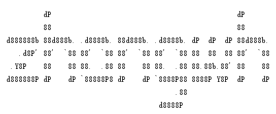
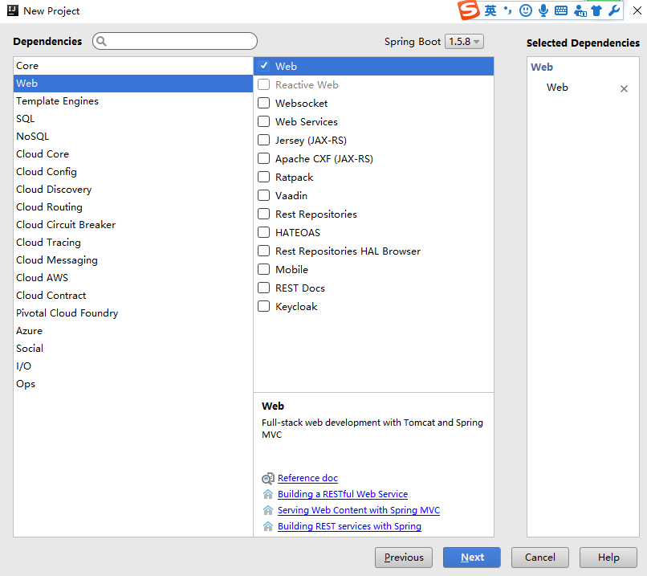
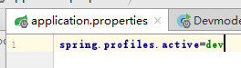
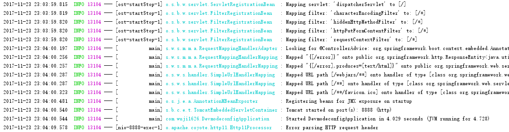
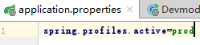
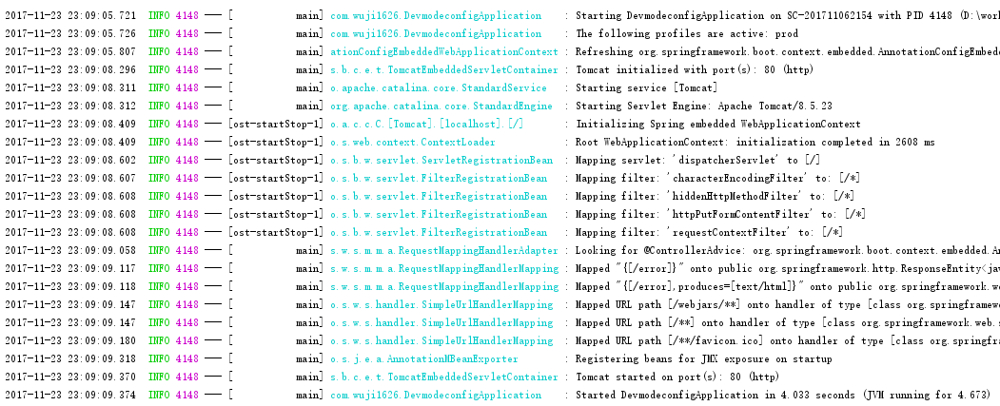

[TOC] 

##1 Spring Boot知识
###1.1 Spring Boot的核心
- 自动配置：Sprin的应用程序常见的应用功能，Spring Boot自动提供相关配置
- 起步依赖：告诉Spring Boot要干什么，它自动引入需要的库
只需要org.springframework.boot:spring-boot-starter-web根据依赖传递把其他所需依赖引入项目。只需要引用相关的起步依赖如：jpa、security  
另外，起步依赖不需关心用哪个版本  
- 命令行界面：Spring Boot的可选特性，只需写代码就能完成完整应用程序，无需传统项目构建  
Spring Boot CLI是Spring Boot非必要组成部分
- Actuator：可以深入运行中的Spring Boot应用程序，观察内部情况
提供在运行时检视应用程序内部情况的能力，如：
■Spring应用程序上下文装配的Bean  
■Spring Boot自动配置做的决策  
■应用程序取到的环境变量、系统属性、配置属性和命令行参数  
■应用程序里线程的当前状态  
■应用程序最近处理过的HTTP请求的追踪情况  

##2 Spring Boot实操入门
###2.1 Spring Boot CLI
在【http://repo.spring.io/snapshot/org/springframework/boot/spring-boot-cli】可以下载到各个版本的Spring Boot CLI  
下载解压后，将Spring Boot CLI的bin目录配置到环境变量中，执行Spring --version测试是否配置成功  
  

###2.2 Spring Initializr
Spring Initializr本质上是个Web应用，能生成Spring Boot项目结构，提供基本的项目结构，以及一个pom  
Spring Initializr的几种用法：  
- 通过Web界面使用
访问【start.spring.io】进入Initializr配置页面，进行配置并选择相应的依赖后便可以下载一个工程骨架  
  
生成的工程下的路径符合maven工程的结构。而且工程的结构都是按照group和artifact生成  
  
在工程的根目录下有pom、maven的脚本mvnw.cmd  
  
如果选择gradle，生成的工程将是gradle风格的，带有build.gradle等文件  
- 通过Spring Tool Suite使用
- 通过IntelliJ IDEA使用
IntelliJ中，新建工程的选项中有Spring Initializr选项  
  
选择Default:https://start.spring.io，下一步  
  
填写项目相关的信息，下一步  
  
选择工程中依赖的jar包  
  
选择工程存放的物理路径，Finish
  
工程创建完成  
- 通过Spring Boot CLI使用
Spring Boot CLI的init命令可以创建项目基线：
■spring init：下载一个demo.zip工程  
■spring init -dweb,jpa,security：工程依赖web、jpa、security包，同样会下载一个demo.zip。其中-d可以换成--dependencies  
■spring init -dweb,jpa,security --build gradle：工程构建类型是gradle，如果不指定默认是maven  
■spring init -dweb,jpa,security --build gradle -p war：最终发布的包是war包，如果不指定默认是打成jar包  
■spring init -dweb,jpa,security --build gradle -p war myapp：最后一个参数说明希望把项目解压到myapp目录  
■spring init -dweb,jpa,security --build gradle -p jar -x：最后一个参数说明要将羡慕解压到当前目录，-x可以替换为--extract  
■spring help init：查看init命令的参数  
■spring init -l：查看init命令的可选项，-l可替换成--list

##3 应用开发
###3.1 创建一个样例工程framework
1. 依赖：web、jpa、H2、thymeleaf，采用gradle构建  
  
2. XXXApplication有两个作用：配置、启动引导  
■@SpringBootApplication：开启组件扫描和自动配置。该注解将@Configuration、@ComponentScan、@EnableAutoConfiguration三个注解组合在一起  
■@Configuration：该类使用Spring基于Java的配置，而不是XML配置  
■@ComponentScan：启用组件扫描，Web控制类和其他组件才能被自动发信并主持为Spring应用程序上下文里的Bean  
■@EnableAutoConfiguration：开启Spring Boot自动配置，可以不用再写大量的配置  
■XXXApplication（在我创建的样例工程中，由于Artifact为framework，因此XXXApplication为FrameworkApplication）：是一个启动类，要运行Spring Boot有多种方式。①可以打成war包，部署；②在main()方法中可以在命令行中把该应用程序当成jar文件运行，向SpringApplication.run()穿衣第一XXXApplication类引用以及一个命令行参数来启动应用程序  
3. XXXApplicationTests测试类
Initializr测试类骨架，可以编写测试用例  
4. 配置应用程序属性  
Initializr生成的工程中有一个application.properties文件，是个空文件。可以在该文件中添加配置。
如添加：server.port=8000  
  
5. 工程试运行  
■build工程  
  
■在编译工程后，Run工程。由于编译完成，在run菜单中可以选择XXXApplication（FrameworkApplication）  
  
在弹出的菜单中，可以找到XXXApplication（FrameworkApplication）  
  
控制台输出正常输出  
  
在浏览器中输入`http://localhost:8080/framework` 由于工程中没有控制类，都是404错误，不过可见容器已经运行  
  

###3.2 代码编写
####3.2.1 编写领域模型  
~~~java
package com.wuji1626.domain;
import javax.persistence.Entity;
import javax.persistence.GeneratedValue;
import javax.persistence.GenerationType;
import javax.persistence.Id;
@Entity
public class Book {
    @Id
    @GeneratedValue(strategy=GenerationType.AUTO)
    private Long id;
    private String reader;
    private String isbn;
    private String title;
    private String author;
    private String description;
    public Long getId() {
        return id;
    }
    public void setId(Long id) {
        this.id = id;
    }
    public String getReader() {
        return reader;
    }
    public void setReader(String reader) {
        this.reader = reader;
    }
    public String getIsbn() {
        return isbn;
    }
    public void setIsbn(String isbn) {
        this.isbn = isbn;
    }
    public String getTitle() {
        return title;
    }
    public void setTitle(String title) {
        this.title = title;
    }
    public String getAuthor() {
        return author;
    }
    public void setAuthor(String author) {
        this.author = author;
    }
    public String getDescription() {
        return description;
    }
    public void setDescription(String description) {
        this.description = description;
    }
}
~~~
####3.2.2 编写仓库接口（Dao）
~~~java
package com.wuji1626.dao;

import com.wuji1626.domain.Book;
import org.springframework.data.jpa.repository.JpaRepository;

import java.util.List;

/**
 * Created by Administrator on 2017/7/17.
 */
public interface ReadingListRepository extends JpaRepository<Book, Long> {
    List<Book> findByReader(String reader);
}

}
~~~
####3.2.3 Web控制器（Controller）
~~~java
package com.wuji1626.controller;

import com.wuji1626.dao.ReadingListRepository;
import com.wuji1626.domain.Book;
import org.springframework.beans.factory.annotation.Autowired;
import org.springframework.stereotype.Controller;
import org.springframework.ui.Model;
import org.springframework.web.bind.annotation.PathVariable;
import org.springframework.web.bind.annotation.RequestMapping;
import org.springframework.web.bind.annotation.RequestMethod;

import java.util.List;

/**
 * Created by Administrator on 2017/7/17.
 */
@Controller
@RequestMapping("/")
public class ReadingListController {
    private ReadingListRepository readingListRepository;
    @Autowired
    public ReadingListController(
            ReadingListRepository readingListRepository) {
        this.readingListRepository = readingListRepository;
    }
    @RequestMapping(value="/{reader}", method= RequestMethod.GET)
    public String readersBooks(
            @PathVariable("reader") String reader,
            Model model) {
        List<Book> readingList =
                readingListRepository.findByReader(reader);
        if (readingList != null) {
            model.addAttribute("books", readingList);
        }
        return "readingList";
    }
    @RequestMapping(value="/{reader}", method=RequestMethod.POST)
    public String addToReadingList(
            @PathVariable("reader") String reader, Book book) {
        book.setReader(reader);
        readingListRepository.save(book);
        return "redirect:/{reader}";
    }
}

~~~
####3.2.4 页面模板
~~~HTML
<html>
<head>
    <title>Reading List</title>
    <link rel="stylesheet" th:href="@{/style.css}"></link>
</head>
<body>
<h2>Your Reading List</h2>

    <dl th:each="book : ${books}">
        <dt class="bookHeadline">
            Title by
            Author
            (ISBN: ISBN)
        </dt>
        <dd class="bookDescription">
Description
            
No description available
        </dd>
    </dl>

    
You have no books in your book list

<h3>Add a book</h3>
<form method="POST">
    <label for="title">Title:</label>
    <input type="text" name="title" size="50"></input> 
    <label for="author">Author:</label>
    <input type="text" name="author" size="50"></input> 
    <label for="isbn">ISBN:</label>
    <input type="text" name="isbn" size="15"></input> 
    <label for="description">Description:</label> 
    <textarea name="description" cols="80" rows="5">
</textarea> 
    <input type="submit"></input>
</form>
</body>
</html>
~~~
####3.2.5 静态资源
静态资源包括css  
~~~css
body {
    background-color: #cccccc;
    font-family: arial,helvetica,sans-serif;
}
.bookHeadline {
    font-size: 12pt;
    font-weight: bold;
}
.bookDescription {
    font-size: 10pt;
}
label {
    font-weight: bold;
}
~~~
####3.2.6 测试运行
上述代码编写完成后，运行应用即可运行。由于controller中未指定的地址为"/"，则在浏览器中按如下方式运行  
  
如浏览器中url所示，111代表用户，表明111 reader有3本书  
###3.3 Spring Boot的运行原理
应用程序加入Spring Boot时，应用中会增加一个spring-boot-autoconfigure的jar包，其中包括了Thymeleaf、JPA、SpringMVC等组件的默认配置。每个配置类都放在Classpath里。Spring 4.0提供条件化配置，在满足某些特定条件前忽略默认配置  
只需要实现Condition接口，覆盖match()方法。当某些特定配置信息存在Classpath下，某些Bean才被创建  
自动配置中使用的条件化注解：  
条件化注解|配置生效条件
---|----
@ConditionalOnBean|配置了某个特定Bean
@ConditionalOnMissingBean|没有配置特定的Bean
@ConditionalOnClass|Classpath里有指定的类
@ConditionalOnMissingClass|Classpath里缺少指定的类
@ConditionalOnExpression|给定的Spring Expression Language（ SpEL）表达式计算结果为true
@ConditionalOnJava|Java的版本匹配特定值或者一个范围值
@ConditionalOnJndi|参数中给定的JNDI位置必须存在一个，如果没有给参数，则要有JNDI InitialContext
@ConditionalOnProperty|指定的配置属性要有一个明确的值
@ConditionalOnResource|Classpath里有指定的资源
@ConditionalOnWebApplication|这是一个Web应用程序
@ConditionalOnNotWebApplication|这不是一个Web应用程序

Spring Boot完成了自动配置Spring的责任  

##4 自定义配置
###4.1 覆盖配置
■如果在工程中增加一个security组件的依赖，编译器将spring security组件
gradle dependencies中增加`compile("org.springframework.boot:spring-boot-starter-security")`  
■运行工程后，在日志中会出现一段随机生成的密码日志  
  
■再次进入样例工程，有一个简陋的输入用户名、密码的对话框，默认的用户名为user、密码为日志输出的密码。  
  
验证后，与之前页面效果一致  
■要自定义安全配置，只需要忽视默认配置，编写自己的配置即可  
自定义配置类：  
~~~java
package com.wuji1626.config;

import com.wuji1626.dao.ReaderRepository;
import org.springframework.beans.factory.annotation.Autowired;
import org.springframework.security.config.annotation.authentication.builders.AuthenticationManagerBuilder;
import org.springframework.security.config.annotation.web.HttpSecurityBuilder;
import org.springframework.security.config.annotation.web.builders.HttpSecurity;
import org.springframework.security.config.annotation.web.configuration.WebSecurityConfiguration;
import org.springframework.security.config.annotation.web.configuration.WebSecurityConfigurerAdapter;
import org.springframework.security.core.userdetails.UserDetails;
import org.springframework.security.core.userdetails.UserDetailsService;
import org.springframework.security.core.userdetails.UsernameNotFoundException;

/**
 * Created by Administrator on 2017/7/23.
 */
public class SecurityConfig extends WebSecurityConfigurerAdapter {
    @Autowired
    private ReaderRepository readerRepository;

    @Override
    protected void configure(HttpSecurity http) throws Exception {
        http
                .authorizeRequests()
                .antMatchers("/")
                .access("hasRole('READER')")
                .antMatchers("/**").permitAll()
                .and()
                .formLogin()
                .loginPage("/login")
                .failureUrl("login?error=true");

    }
    @Override
    protected void configure(AuthenticationManagerBuilder auth) throws Exception{
        auth.userDetailsService(new UserDetailsService() {
            @Override
            public UserDetails loadUserByUsername(String username) throws UsernameNotFoundException {
                return readerRepository.findOne(username);
            }
        });
    }
}
~~~
增加实体类，继承了Security中UserDetails  
~~~java
package com.wuji1626.domain;

import org.springframework.security.core.GrantedAuthority;
import org.springframework.security.core.authority.SimpleGrantedAuthority;
import org.springframework.security.core.userdetails.UserDetails;

import javax.persistence.Entity;
import javax.persistence.Id;
import java.io.Serializable;
import java.util.Arrays;
import java.util.Collection;

/**
 * Created by Administrator on 2017/7/23.
 */
@Entity
public class Reader implements UserDetails {
    private static final long serialVersionUID = 1L;
    @Id
    private String username;
    private String fullname;
    private String password;
    @Override
    public Collection<? extends GrantedAuthority> getAuthorities() {
        return Arrays.asList(new SimpleGrantedAuthority("READER"));
    }

    @Override
    public String getPassword() {
        return null;
    }

    @Override
    public String getUsername() {
        return null;
    }

    @Override
    public boolean isAccountNonExpired() {
        return true;
    }

    @Override
    public boolean isAccountNonLocked() {
        return true;
    }

    @Override
    public boolean isCredentialsNonExpired() {
        return true;
    }

    @Override
    public boolean isEnabled() {
        return true;
    }

    public String getFullname() {
        return fullname;
    }

    public void setFullname(String fullname) {
        this.fullname = fullname;
    }

    public void setUsername(String username) {
        this.username = username;
    }

    public void setPassword(String password) {
        this.password = password;
    }
}

~~~

Dao层的Repository的实现  
~~~java
package com.wuji1626.dao;

import com.wuji1626.domain.Reader;
import org.springframework.data.jpa.repository.JpaRepository;

/**
 * Created by Administrator on 2017/7/23.
 */
public interface ReaderRepository extends JpaRepository<Reader,String> {
}
~~~

■Spring Boot多种设置行为的途径，Spring Boot能从多重属性源获得属性：  
1. 命令行参数  
2. java:comp/env里的JNDI属性  
3. JVM系统属性  
4. 操作系统环境变量  
5. 随机生成的带random.*前缀的属性（在设置其他属性时，可以引用它们，如${random.long}）  
6. 应用程序外的application.properties或application.yml文件  
7. 打包在应用程序内的application.properties或application.yml文件  
8. 通过@PropertySource标注的属性源  
9. 默认属性  

上述的顺序是按照优先级从高到低  

■application.properties或application.yml文件放置的位置：  
1. 外置，在相对应用程序运行目录的/config子目录  
2. 外置，在应用程序运行目录  
3. 内置，在config包内  
4. 内置，在Classpath根目录  

###4.2 排除Logback使用Log4j
在build.gradle中添加：  
~~~
configurations {
	all*.exclude group:'org.springframework.boot',
	module:'spring-boot-starter-logging'
}
~~~
在buidl.gradle的dependencies中添加：  
~~~
compile("org.springframework.boot:spring-boot-starter-log4j")
~~~
重新运行工程，日志输出由Logback改为Log4j，但是由于slf4j没有配置完成报异常与警告  
  
将log4j的依赖改为log4j2：
~~~
compile("org.springframework.boot:spring-boot-starter-log4j2")
~~~
日志输出与logback模式一致  
  

###4.3 Logback日志配置的
■在resources目录下创建logback.xml配置日志的输出格式：  
~~~xml
<configuration>
    <appender name="STDOUT" class="ch.qos.logback.core.ConsoleAppender">
        <encoder>
            <pattern>
                %d{HH:mm:ss.SSS} [%thread] %-5level %logger{36} - %msg%n
            </pattern>
        </encoder>
    </appender>
    <logger name="root" level="INFO"/>
    <root level="INFO">
        <appender-ref ref="STDOUT" />
    </root>
</configuration>
~~~

##5 Spring Boot核心技术
###5.1 基本配置
####5.1.1 入口类和@SpringBootApplication
SpringBoot都包含一个*Application的入口类，其中包括main方法  
@SpringBootApplication是SpringBoot核心注解。组合了@Configuration、@EnableAutoConfiguration、@ComponentScan。

@EnableAutoConfiguration注解负责开启自动配置。通过exclude选项关闭自动配置
eg:@SpringBootApplication(exclude={DataSourceAutoConfiguration.class})

####5.1.2 替换Spring Logo
默认SpringBoot启动时，控制台会显示Spring默认的Logo
  
将自定义的Logo存储为Banner.txt文本，将文本拷贝到resources目录下，运行SpringBoot查看结果：
  

####5.1.3 关闭Banner
SpringBoot1.5.3
~~~java
SpringApplication app = new SpringApplication(SpringbootplayApplication.class);
app.setShowBanner(false);
app.run(args);
~~~
SpringBoot1.5.8
~~~java
SpringApplication app = new SpringApplication(SpringbootplayApplication.class);
app.setBannerMode(Banner.Mode.OFF);
app.run(args);
~~~

####5.1.4 starter pom
名称|描述
---|---
spring-boot-starter|Spring Boot核心starter，包含自动配置、日志、yaml配置文件的支持
spring-boot-starter-actuator|准生产特性，用来监控和管理应用
spring-boot-starter-remote-shell|提供基于ssh协议的监控和管理
spring-boot-starter-amqp|使用spring-rabbit来支持AMQP
spring-boot-starter-aop|使用spring-aop和AspectJ支持面向切面编程
spring-boot-starter-batch|对Spring Batch的支持
spring-boot-starter-cache|对Spring Cache抽象的支持
spring-boot-starter-cloud-connectors|对云平台Cloud Foundry、Heroku提供服务提供简化的连接方式
spring-boot-starter-data-elasticsearch|通过spring-data-elasticsearch对Elasticsearch支持
spring-boot-starter-data-gemfire|通过spring-data-gemfire对分布式存储GemFire支持
spring-boot-starter-data-jpa|对JPA支持，包含spring-data-jpa、spring-orm、Hibernate
spring-boot-starter-data-mongodb|通过spring-data-mongodb对MongoDB进行支持
spring-boot-starter-data-rest|通过spring-data-rest-webmvc将Spring Data repository暴露为REST形式服务
spring-boot-starter-data-solr|通过spring-data-solr对Apache Solr数据检索平台支持
Spring-boot-starter-freemarker|对FreeMarker模板引擎支持
spring-boot-starter-groovy-templates|对Groovy模板引擎支持
spring-boot-starter-hateoas|通过spring-hateoas对基于HATEOAS的REST形式的网络服务的支持
spring-boot-starter-hornetq|通过HornetQ对JMS支持
spring-boot-starter-integration|对系统集成框架spring-integration支持
spring-boot-starter-jdbc|对JDBC数据库支持
spring-boot-starter-jersey|对Jersey REST形式的网络服务的支持
spring-boot-starter-atomikos|通过Atomilos对分布式事物的支持
spring-boot-starter-jta-bitronix|通过Bitronix对分布式事物的支持
spring-boot-starter-mail|对javax.mail支持
spring-boot-starter-mobile|对spring-mobile支持
spring-boot-starter-mustache|对Mustache模板引擎支持
spring-boot-starter-redis|对Redis支持，包含spring-redis
spring-boot-starter-security|对spring-security支持
spring-boot-starter-social-facebook|通过spring-social-facebook对Facebook支持
spring-boot-starter-social-linkedin|通过spring-social-linkedin对LinkedIn支持
spring-boot-starter-social-twitter|通过spring-social-twitter对Twitter支持
spring-boot-starter-test|对常用的测试框架JUnit、Hamcrest和Mockito的支持，包含spring-test模块
spring-boot-starter-thymeleaf|对Thymeleaf模板引擎的支持，包含于Spring整合的配置
spring-boot-starter-velocity|对Velocity模板引擎支持
spring-boot-starter-web|对Web项目开发的支持，包含Tomcat和spring-webmvc
spring-boot-starter-Tomcat|Spring Boot默认的Servlet容器Tomcat
spring-boot-starter-undertow|使用Undertow作为Servlet容器替换Tomcat
spring-boot-starter-logging|Spring Boot默认的日志框架Logback
spring-boot-starter-log4j|支持使用Log4j日志框架
spring-boot-starter-websocket|对WebSocket开发的支持
spring-boot-starter-ws|对Spring Web Services支持

第三方starter pom
名称|地址
---|---
Handlebars|https://github.com/allegro/handlebars-spring-boot-starter
Vaadin|https://github.com/vaadin/spring/tree/master/vaadin-spring-boot-starter
Apache Camel|https://github.com/apache/camel/tree/master/components/camel-spring-boot
WRO4j|https://github.com/sbuettner/spring-boot-autoconfigure-wro4j
Spring Batch高级用法|https://github.com/codecentric/spring-boot-starter-batch-web
HDIV|https://github.com/hdiv/spring-boot-starter-hdiv
Jade Templates(Jade4j)|https://github.com/domix/spring-boot-starter-jade4j

####5.1.5 加载xml配置
@ImportResource({"classpath:some-context.xml","classpath:another-context.xml"})

###5.2 外部配置
####5.2.1 命令行配置
java -jar xxx.jar  
java -jar xxx.jar --server.port=9090  

####5.2.2 常规属性配置
在application.properties中配置属性
~~~
book.author=zhangwh
book.name=Spring Boot
~~~
入口类
~~~java
package com.wuji1626;

import org.springframework.beans.factory.annotation.Value;
import org.springframework.boot.Banner;
import org.springframework.boot.SpringApplication;
import org.springframework.boot.autoconfigure.SpringBootApplication;
import org.springframework.web.bind.annotation.RequestMapping;
import org.springframework.web.bind.annotation.RestController;

@RestController
@SpringBootApplication
public class SpringbootplayApplication {

    @Value("${book.author}")
    private String bookAuthor;
    @Value("${book.name}")
    private String bookName;

    @RequestMapping("/")
    public String index(){
        return "Book name is: " + bookName + " and book author is: " + bookAuthor;
    }
	public static void main(String[] args) {
		SpringApplication app = new SpringApplication(SpringbootplayApplication.class);
		app.setBannerMode(Banner.Mode.OFF);
		app.run(args);
//		SpringApplication.run(SpringbootplayApplication.class, args);
	}
}
~~~
【注意】在配置spring-boot-starter-tomcat时，需要将默认生成的`<scope>provided</scope>`删掉，否则tomcat容器将不会启动  

####5.2.3 类型安全配置
样例工程名：typesafeconfig
在application.properties中增加：
~~~
author.name=zhangwh
author.age=36
~~~

实体类
~~~java
package com.wuji1626.entity;

import org.springframework.boot.context.properties.ConfigurationProperties;
import org.springframework.stereotype.Component;

/**
 * Created by Administrator on 2017/11/20.
 */
@Component
@ConfigurationProperties(prefix = "author")
public class AuthorSettings {
    public String getName() {
        return name;
    }

    public void setName(String name) {
        this.name = name;
    }

    public Long getAge() {
        return age;
    }

    public void setAge(Long age) {
        this.age = age;
    }

    private String name;
    private Long age;

}

~~~
如果在自定义properties中增加属性，需要在@ConfigurationProperties中增加location的配置如：
~~~
@ConfigurationProperties(prefix = "author", locations={"classpath:config/author.properties"})
~~~
入口
~~~java
package com.wuji1626;

import com.wuji1626.entity.AuthorSettings;
import org.springframework.beans.factory.annotation.Autowired;
import org.springframework.boot.SpringApplication;
import org.springframework.boot.autoconfigure.SpringBootApplication;
import org.springframework.web.bind.annotation.RequestMapping;
import org.springframework.web.bind.annotation.RestController;

@RestController
@SpringBootApplication
public class TypesafeconfigApplication {

	@Autowired
	private AuthorSettings authorSettings;
	@RequestMapping("/")
	public String index(){
		return "auther name is " + authorSettings.getName() + " and author age is " + authorSettings.getAge();
	}
	public static void main(String[] args) {
		SpringApplication.run(TypesafeconfigApplication.class, args);
	}
}

~~~

####5.2.4 日志配置
Spring Boot支持Java Util Logging、Log4j、Log4j2、Logback框架，默认支持Logback  
- 配置日志存储位置：logging.file=D:/mylog/log.log
- 配置日志级别：logging.level.org.springframework.web=DEBUG

样例名称：logconfig  
在Spring Boot工程的application.properties文件下，添加日志的相关配置：
~~~
logging.file=D:/mylog/log.log
logging.level.org.springframework.web=DEBUG
~~~

####5.2.5 运行模式配置
可以在配置中对工程模式进行配置。

样例名称：devmodeconfig
在创建工程时，需要注意选择Web模块  
  
分别创建application.properties、application-prod.properties、application-dev.properties  
application-prod.properties内容：  
~~~
server.port=80
~~~

application-dev.properties内容：
~~~
server.port=8888
~~~

application.properties
~~~
spring.profiles.active=dev
~~~
结果：  
在spring.profiles.active=dev时，  
  
  
在spring.profiles.active=prod时，  
  
  

