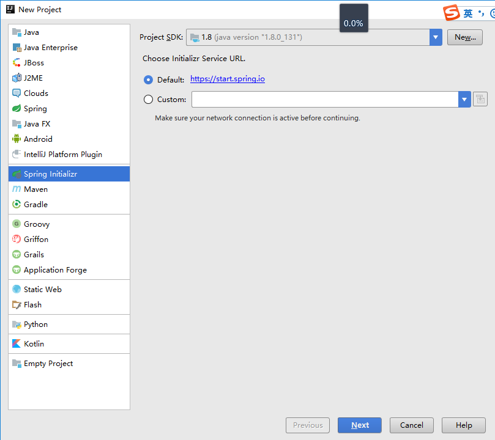
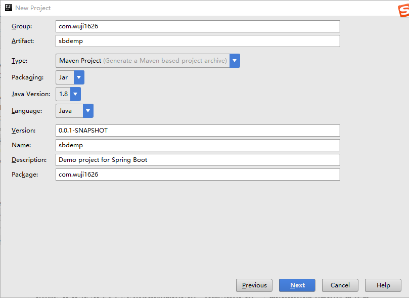
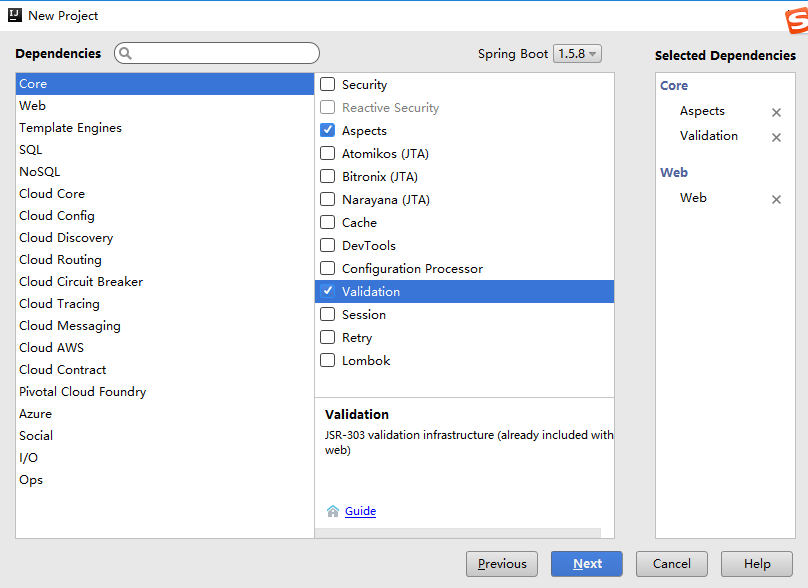
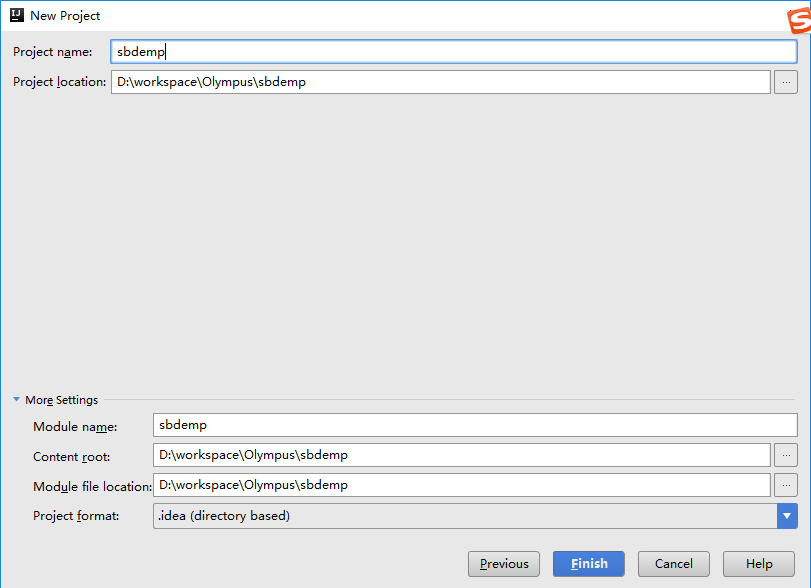

[TOC]
##1 Spring Boot基础
Spring Boot使用“习惯优于配置”理念让项目快速启动，轻量级  

##2 Spring Boot核心功能
1. 独立运行的Spring项目
Spring Boot可以以jar包形式独立预先
2. 内嵌Servlet容器
内嵌Tomcat、Jetty、Undertow，无须war部署项目
3. 提供starter简化Maven配置
一系列starter pom简化Maven依赖加载
4. 自动配置Spring
Spring Boot中大量的默认配置，通过配置可以替换默认的属性  
5. 准生产的应用监控
Spring Boot提供基于http、ssh、telnet对运行时的项目监控  
6. 无代码生成和xml配置
Spring Boot的特性不是通过代码生成实现，而是通过条件注解来实现

##3 Spring Boot的优缺点
###3.1 优点
1. 快速构建项目
2. 对主流开发框架的无配置集成
3. 项目可独立运行，无须外部依赖Servlet容器
4. 提供运行时的应用监控
5. 极大地提高并发、部署效率
6. 与云计算天然集成

###3.2 缺点
1. 数据文档少且不够深入
2. 与Spring框架绑定，不认同Spring将不容易使用

##4 Spring Boot的快速构建
1. http://start.spring.io
在网上配置，生成工程骨架后，下载并使用  
2. Spring Tool Suite
相当于单机版的Spring Boot工程骨架生成器  
3. IntelliJ IDEA
File → New → Project → Spring Initializr
  
定义工程的部分元数据信息  
  
选择部分默认依赖  
  
选择工程输出目录  
  
完成  
4. Spring Boot CLI
5. 手工构建  
