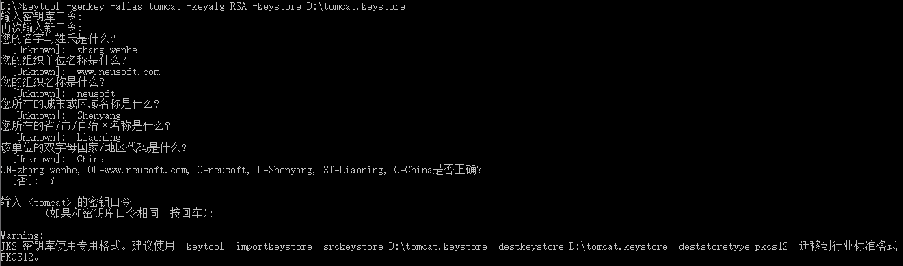
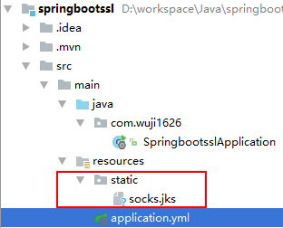
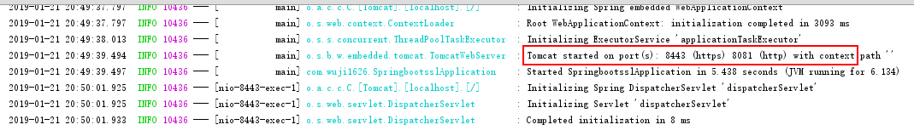

##一、生成密钥
首先在终端执行如下命令，然后在当前路径可以拿到密钥文件。

keytool -genkey -alias your.alias（别名） -keypass yourpass1 -keyalg RSA -keysize 2048 -validity 3650 -keystore D:/keys/keystore.keystore -storepass yourpass2

eg.  
keytool -genkey -alias tomcat -keyalg RSA -keystore /home/gzr/tomcat.keystore  
  

##二、配置密钥
后将密钥文件socks.jks 复制到当前项目的resources/static 静态目录  
  

在application.yml添加如下配置：
>server:
 port: 8080
 ssl:
 key-store: classpath:static/socks.jks  
 key-store-password: 123456
 key-password: 123456
 
需要注意文件存放的路径  

##三、添加重定向
其实有了上面的SSL配置，已经默认实现https的访问了，下面是监听额外的http端口并重定向到当前应用的https端口。 
~~~java
@SpringBootApplication
public class SpringbootsslApplication {
	public static void main(String[] args) {
		SpringApplication.run(SpringbootsslApplication.class);
	}
	@Bean
	public ServletWebServerFactory servletContainer() {
		TomcatServletWebServerFactory tomcat = new TomcatServletWebServerFactory();
		Connector connector = new Connector("org.apache.coyote.http11.Http11NioProtocol");
		connector.setPort(8081);//监听HTTP端口
		connector.setRedirectPort(tomcat.getPort());//转发HTTPS端口
		tomcat.addAdditionalTomcatConnectors(connector);
		return tomcat;
	}
}
~~~

##四、测试https和http重定向
启动SpringBoot看到开启https/http地址  
  

默认监听https：https://localhost:8443  
额外监听http：http://localhost:8081  
重定向到 https://localhost:8443  

##五、总结
1、SpringBoot开启https只需要在配置文件添加SSL证书即可。  
2、SpringBoot开启http重定向需通过ServletWebServerFactory来实现。  
3、生产环境通常并不会像文章里这么做，而是通过https域名来映射到应用主机。例如通过网络管理或者Nginx等方式让 http://www.socks.com 映射到 https://www.socks.com 。  
	