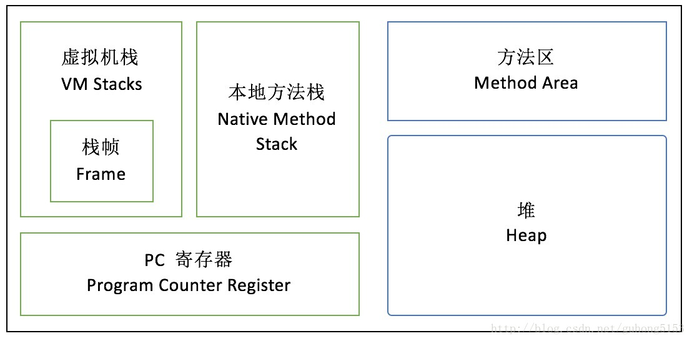
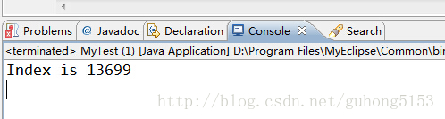
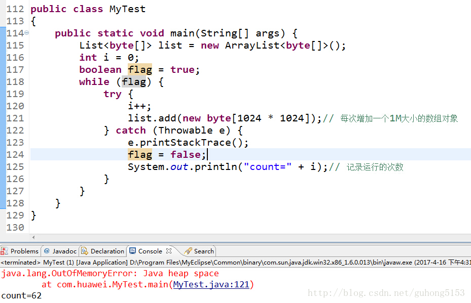
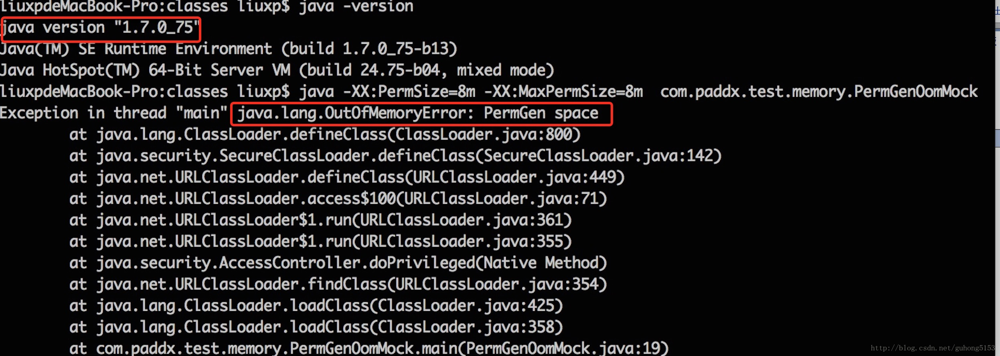

[TOC]
##常见问题
####1 什么是Java虚拟机？为什么Java被称作是“平台无关的编程语言”？
Java虚拟机是一个可以执行Java字节码的虚拟机进程。Java源文件被编译成能被Java虚拟机执行的字节码文件。

Java被设计成允许应用程序可以运行在任意的平台，而不需要程序员为每一个平台单独重写或者是重新编译。Java虚拟机让这个变为可能，因为它知道底层硬件平台的指令长度和其他特性。

####2 JDK和JRE的区别是什么？
Java运行时环境(JRE)是将要执行Java程序的Java虚拟机。它同时也包含了执行applet需要的浏览器插件。Java开发工具包(JDK)是完整的Java软件开发包，包含了JRE，编译器和其他的工具(比如：JavaDoc，Java调试器)，可以让开发者开发、编译、执行Java应用程序。

####3 ”static”关键字是什么意思？Java中是否可以覆盖(override)一个private或者是static的方法？
“static”关键字表明一个成员变量或者是成员方法可以在没有所属的类的实例变量的情况下被访问。

Java中static方法不能被覆盖，因为方法覆盖是基于运行时动态绑定的，而static方法是编译时静态绑定的。static方法跟类的任何实例都不相关，所以概念上不适用。

####4 是否可以在static环境中访问非static变量？
static变量在Java中是属于类的，它在所有的实例中的值是一样的。当类被Java虚拟机载入的时候，会对static变量进行初始化。如果你的代码尝试不用实例来访问非static的变量，编译器会报错，因为这些变量还没有被创建出来，还没有跟任何实例关联上。

####5 Java支持的数据类型有哪些？什么是自动拆装箱？
Java语言支持的8中基本数据类型有：byte、short、int、long、float、double、boolean、char

自动装箱是Java编译器在基本数据类型和对应的对象包装类型之间做的一个转化。比如：把int转化成Integer，double转化成Double，等等。反之就是自动拆箱。

####6 Java中的方法覆盖(Overriding)和方法重载(Overloading)是什么意思？
Java中的方法重载发生在同一个类里面两个或者是多个方法的方法名相同但是参数不同的情况。与此相对，方法覆盖是说子类重新定义了父类的方法。方法覆盖必须有相同的方法名，参数列表和返回类型。覆盖者可能不会限制它所覆盖的方法的访问。

####7 Java中，什么是构造函数？什么是构造函数重载？什么是复制构造函数？
当新对象被创建的时候，构造函数会被调用。每一个类都有构造函数。在程序员没有给类提供构造函数的情况下，Java编译器会为这个类创建一个默认的构造函数。

Java中构造函数重载和方法重载很相似。可以为一个类创建多个构造函数。每一个构造函数必须有它自己唯一的参数列表。

Java不支持像C++中那样的复制构造函数，这个不同点是因为如果你不自己写构造函数的情况下，Java不会创建默认的复制构造函数。

####8 Java支持多继承么？
不支持，Java不支持多继承。每个类都只能继承一个类，但是可以实现多个接口。

####9 接口和抽象类的区别是什么？
Java提供和支持创建抽象类和接口。它们的实现有共同点，不同点在于：
- 接口中所有的方法隐含的都是抽象的。而抽象类则可以同时包含抽象和非抽象的方法。
- 类可以实现很多个接口，但是只能继承一个抽象类
- 类如果要实现一个接口，它必须要实现接口声明的所有方法。但是，类可以不实现抽象类声明的所有方法，当然，在这种情况下，类也必须得声明成是抽象的。
- 抽象类可以在不提供接口方法实现的情况下实现接口。
- Java接口中声明的变量默认都是final的。抽象类可以包含非final的变量。
- Java接口中的成员函数默认是public的。抽象类的成员函数可以是private，protected或者是public。
- 接口是绝对抽象的，不可以被实例化。抽象类也不可以被实例化，但是，如果它包含main方法的话是可以被调用的。
也可以参考JDK8中抽象类和接口的区别

####10 什么是值传递和引用传递？
对象被值传递，意味着传递了对象的一个副本。因此，就算是改变了对象副本，也不会影响源对象的值。

对象被引用传递，意味着传递的并不是实际的对象，而是对象的引用。因此，外部对引用对象所做的改变会反映到所有的对象上。

##线程
####1 进程和线程的区别是什么？
进程是执行着的应用程序，而线程是进程内部的一个执行序列。一个进程可以有多个线程。线程又叫做轻量级进程。

####2 创建线程有几种不同的方式？你喜欢哪一种？为什么？
有三种方式可以用来创建线程：
- 继承Thread类
- 实现Runnable接口
- 应用程序可以使用Executor框架来创建线程池

实现Runnable接口这种方式更受欢迎，因为这不需要继承Thread类。在应用设计中已经继承了别的对象的情况下，这需要多继承（而Java不支持多继承），只能实现接口。同时，线程池也是非常高效的，很容易实现和使用。

####3 概括的解释下线程的几种可用状态
线程在执行过程中，可以处于下面几种状态：
- 就绪(Runnable):线程准备运行，不一定立马就能开始执行。
- 运行中(Running)：进程正在执行线程的代码。
- 等待中(Waiting):线程处于阻塞的状态，等待外部的处理结束。
- 睡眠中(Sleeping)：线程被强制睡眠。I/O阻塞(Blocked on I/O)：等待I/O操作完成。
- 同步阻塞(Blocked on Synchronization)：等待获取锁。
- 死亡(Dead)：线程完成了执行。

####4 同步方法和同步代码块的区别是什么？
在Java语言中，每一个对象有一把锁。线程可以使用synchronized关键字来获取对象上的锁。synchronized关键字可应用在方法级别(粗粒度锁)或者是代码块级别(细粒度锁)。

####5 在监视器(Monitor)内部，是如何做线程同步的？程序应该做哪种级别的同步？
监视器和锁在Java虚拟机中一块使用。监视器监视一块同步代码块，确保一次只有一个线程执行同步代码块。每一个监视器都和一个对象引用相关联。线程在获取锁之前不允许执行同步代码。

####6 什么是死锁(deadlock)？
两个进程都在等待对方执行完毕才能继续往下执行的时候就发生了死锁。结果就是两个进程都陷入了无限的等待中。

####7 如何确保N个线程可以访问N个资源同时又不导致死锁？
使用多线程的时候，一种非常简单的避免死锁的方式就是：指定获取锁的顺序，并强制线程按照指定的顺序获取锁。因此，如果所有的线程都是以同样的顺序加锁和释放锁，就不会出现死锁了。

####8 启动线程方法start()和run()有什么区别？
只有调用了start()方法，才会表现出多线程的特性，不同线程的run()方法里面的代码交替执行。如果只是调用run()方法，那么代码还是同步执行的，必须等待一个线程的run()方法里面的代码全部执行完毕之后，另外一个线程才可以执行其run()方法里面的代码。

####9 什么是活锁、饥饿、无锁、死锁？
死锁、活锁、饥饿是关于多线程是否活跃出现的运行阻塞障碍问题，如果线程出现了这三种情况，即线程不再活跃，不能再正常地执行下去了。

- 死锁
死锁是多线程中最差的一种情况，多个线程相互占用对方的资源的锁，而又相互等对方释放锁，此时若无外力干预，这些线程则一直处理阻塞的假死状态，形成死锁。
举个例子，A同学抢了B同学的钢笔，B同学抢了A同学的书，两个人都相互占用对方的东西，都在让对方先还给自己自己再还，这样一直争执下去等待对方还而又得不到解决，老师知道此事后就让他们相互还给对方，这样在外力的干预下他们才解决，当然这只是个例子没有老师他们也能很好解决，计算机不像人如果发现这种情况没有外力干预还是会一直阻塞下去的。
- 活锁
活锁这个概念大家应该很少有人听说或理解它的概念，而在多线程中这确实存在。活锁恰恰与死锁相反，死锁是大家都拿不到资源都占用着对方的资源，而活锁是拿到资源却又相互释放不执行。当多线程中出现了相互谦让，都主动将资源释放给别的线程使用，这样这个资源在多个线程之间跳动而又得不到执行，这就是活锁。
- 饥饿
我们知道多线程执行中有线程优先级这个东西，优先级高的线程能够插队并优先执行，这样如果优先级高的线程一直抢占优先级低线程的资源，导致低优先级线程无法得到执行，这就是饥饿。当然还有一种饥饿的情况，一个线程一直占着一个资源不放而导致其他线程得不到执行，与死锁不同的是饥饿在以后一段时间内还是能够得到执行的，如那个占用资源的线程结束了并释放了资源。
- 无锁
无锁，即没有对资源进行锁定，即所有的线程都能访问并修改同一个资源，但同时只有一个线程能修改成功。无锁典型的特点就是一个修改操作在一个循环内进行，线程会不断的尝试修改共享资源，如果没有冲突就修改成功并退出否则就会继续下一次循环尝试。所以，如果有多个线程修改同一个值必定会有一个线程能修改成功，而其他修改失败的线程会不断重试直到修改成功。之前的文章我介绍过JDK的CAS原理及应用即是无锁的实现。
可以看出，无锁是一种非常良好的设计，它不会出现线程出现的跳跃性问题，锁使用不当肯定会出现系统性能问题，虽然无锁无法全面代替有锁，但无锁在某些场合下是非常高效的。

####10 Java中用到了什么线程调度算法？
抢占式。一个线程用完CPU之后，操作系统会根据线程优先级、线程饥饿情况等数据算出一个总的优先级并分配下一个时间片给某个线程执行。

##集合
####1 Java集合类框架的基本接口有哪些？
集合类接口指定了一组叫做元素的对象。集合类接口的每一种具体的实现类都可以选择以它自己的方式对元素进行保存和排序。有的集合类允许重复的键，有些不允许。

Java集合类提供了一套设计良好的支持对一组对象进行操作的接口和类。Java集合类里面最基本的接口有：
- Collection：代表一组对象，每一个对象都是它的子元素。
- Set：不包含重复元素的Collection。
- List：有顺序的collection，并且可以包含重复元素。
- Map：可以把键(key)映射到值(value)的对象，键不能重复。

####2 为什么集合类没有实现Cloneable和Serializable接口？
克隆(cloning)或者是序列化(serialization)的语义和含义是跟具体的实现相关的。因此，应该由集合类的具体实现来决定如何被克隆或者是序列化。

####3 什么是迭代器(Iterator)？
Iterator接口提供了很多对集合元素进行迭代的方法。每一个集合类都包含了可以返回迭代器实例的迭代方法。迭代器可以在迭代的过程中删除底层集合的元素。

####4 Iterator和ListIterator的区别是什么？
下面列出了他们的区别：

- Iterator可用来遍历Set和List集合，但是ListIterator只能用来遍历List。
- Iterator对集合只能是前向遍历，ListIterator既可以前向也可以后向。

ListIterator实现了Iterator接口，并包含其他的功能，比如：增加元素，替换元素，获取前一个和后一个元素的索引，等等。

####5 快速失败(fail-fast)和安全失败(fail-safe)的区别是什么？
Iterator的安全失败是基于对底层集合做拷贝，因此，它不受源集合上修改的影响。java.util包下面的所有的集合类都是快速失败的，而java.util.concurrent包下面的所有的类都是安全失败的。快速失败的迭代器会抛出ConcurrentModificationException异常，而安全失败的迭代器永远不会抛出这样的异常。

####6 Java中的HashMap的工作原理是什么？
Java中的HashMap是以键值对(key-value)的形式存储元素的。HashMap需要一个hash函数，它使用hashCode()和equals()方法来向集合/从集合添加和检索元素。当调用put()方法的时候，HashMap会计算key的hash值，然后把键值对存储在集合中合适的索引上。如果key已经存在了，value会被更新成新值。

HashMap的一些重要的特性是它的容量(capacity)，负载因子(load factor)和扩容极限(threshold resizing)。

####7 hashCode()和equals()方法的重要性体现在什么地方？
Java中的HashMap使用hashCode()和equals()方法来确定键值对的索引，当根据键获取值的时候也会用到这两个方法。如果没有正确的实现这两个方法，两个不同的键可能会有相同的hash值，因此，可能会被集合认为是相等的。而且，这两个方法也用来发现重复元素。所以这两个方法的实现对HashMap的精确性和正确性是至关重要的。

####8 HashMap和Hashtable有什么区别？
HashMap和Hashtable都实现了Map接口，因此很多特性非常相似。但是，他们有以下不同点：

- HashMap允许键和值是null，而Hashtable不允许键或者值是null。
- Hashtable是同步的，而HashMap不是。因此，HashMap更适合于单线程环境，而Hashtable适合于多线程环境。
- HashMap提供了可供应用迭代的键的集合，因此，HashMap是快速失败的。另一方面，Hashtable提供了对键的列举(Enumeration)。
- ** 一般认为Hashtable是一个遗留的类。**

####9 数组(Array)和列表(ArrayList)有什么区别？什么时候应该使用Array而不是ArrayList？
下面列出了Array和ArrayList的不同点：

- Array可以包含基本类型和对象类型，ArrayList只能包含对象类型。
- Array大小是固定的，ArrayList的大小是动态变化的。
- ArrayList提供了更多的方法和特性，比如：addAll()，removeAll()，iterator()等等。

对于基本类型数据，集合使用自动装箱来减少编码工作量。但是，当处理固定大小的基本数据类型的时候，这种方式相对比较慢。

####10 ArrayList和LinkedList有什么区别？
ArrayList和LinkedList都实现了List接口，他们有以下的不同点：

- ArrayList是基于索引的数据接口，它的底层是数组。它可以以O(1)时间复杂度对元素进行随机访问。与此对应，LinkedList是以元素列表的形式存储它的数据，每一个元素都和它的前一个和后一个元素链接在一起，在这种情况下，查找某个元素的时间复杂度是O(n)。
- 相对于ArrayList，LinkedList的插入，添加，删除操作速度更快，因为当元素被添加到集合任意位置的时候，不需要像数组那样重新计算大小或者是更新索引。
- LinkedList比ArrayList更占内存，因为LinkedList为每一个节点存储了两个引用，一个指向前一个元素，一个指向下一个元素。

也可以参考ArrayList vs. LinkedList。

####11 Comparable和Comparator接口是干什么的？列出它们的区别
Java提供了只包含一个compareTo()方法的Comparable接口。这个方法可以个给两个对象排序。具体来说，它返回负数，0，正数来表明输入对象小于，等于，大于已经存在的对象。

Java提供了包含compare()和equals()两个方法的Comparator接口。compare()方法用来给两个输入参数排序，返回负数，0，正数表明第一个参数是小于，等于，大于第二个参数。equals()方法需要一个对象作为参数，它用来决定输入参数是否和comparator相等。只有当输入参数也是一个comparator并且输入参数和当前comparator的排序结果是相同的时候，这个方法才返回true。

####12 什么是Java优先级队列(Priority Queue)？
PriorityQueue是一个基于优先级堆的无界队列，它的元素是按照自然顺序(natural order)排序的。在创建的时候，我们可以给它提供一个负责给元素排序的比较器。PriorityQueue不允许null值，因为他们没有自然顺序，或者说他们没有任何的相关联的比较器。最后，PriorityQueue不是线程安全的，入队和出队的时间复杂度是O(log(n))。

####13 你了解大O符号(big-O notation)么？你能给出不同数据结构的例子么？
大O符号描述了当数据结构里面的元素增加的时候，算法的规模或者是性能在最坏的场景下有多么好。

大O符号也可用来描述其他的行为，比如：内存消耗。因为集合类实际上是数据结构，我们一般使用大O符号基于时间，内存和性能来选择最好的实现。大O符号可以对大量数据的性能给出一个很好的说明。

####14 如何权衡是使用无序的数组还是有序的数组？
有序数组最大的好处在于查找的时间复杂度是O(log n)，而无序数组是O(n)。有序数组的缺点是插入操作的时间复杂度是O(n)，因为值大的元素需要往后移动来给新元素腾位置。相反，无序数组的插入时间复杂度是常量O(1)。

####15 Java集合类框架的最佳实践有哪些？
根据应用的需要正确选择要使用的集合的类型对性能非常重要，比如：假如元素的大小是固定的，而且能事先知道，我们就应该用Array而不是ArrayList。

有些集合类允许指定初始容量。因此，如果我们能估计出存储的元素的数目，我们可以设置初始容量来避免重新计算hash值或者是扩容。

为了类型安全，可读性和健壮性的原因总是要使用泛型。同时，使用泛型还可以避免运行时的ClassCastException。

使用JDK提供的不变类(immutable class)作为Map的键可以避免为我们自己的类实现hashCode()和equals()方法。

编程的时候接口优于实现。

底层的集合实际上是空的情况下，返回长度是0的集合或者是数组，不要返回null。

####16 Enumeration接口和Iterator接口的区别有哪些？
Enumeration速度是Iterator的2倍，同时占用更少的内存。但是，Iterator远远比Enumeration安全，因为其他线程不能够修改正在被iterator遍历的集合里面的对象。同时，Iterator允许调用者删除底层集合里面的元素，这对Enumeration来说是不可能的。

>Enumeration接口中定义了一些方法，通过这些方法可以枚举（一次获得一个）对象集合中的元素。
这种传统接口已被迭代器取代，虽然Enumeration 还未被遗弃，但在现代代码中已经被很少使用了。尽管如此，它还是使用在诸如Vector和Properties这些传统类所定义的方法中，除此之外，还用在一些API类，并且在应用程序中也广泛被使用。 下表总结了一些Enumeration声明的方法：
- boolean hasMoreElements( ):测试此枚举是否包含更多的元素
- Object nextElement( ):如果此枚举对象至少还有一个可提供的元素，则返回此枚举的下一个元素

####17 HashSet和TreeSet有什么区别？
HashSet是由一个hash表来实现的，因此，它的元素是无序的。add()，remove()，contains()方法的时间复杂度是O(1)。

另一方面，TreeSet是由一个树形的结构来实现的，它里面的元素是有序的。因此，add()，remove()，contains()方法的时间复杂度是O(logn)。

##GC 垃圾收集器(Garbage Collectors)
####1 Java中垃圾回收有什么目的？什么时候进行垃圾回收？
垃圾回收的目的是识别并且丢弃应用不再使用的对象来释放和重用资源。

####2 System.gc()和Runtime.gc()会做什么事情？
这两个方法用来提示JVM要进行垃圾回收。但是，立即开始还是延迟进行垃圾回收是取决于JVM的。
java.lang.System.gc()只是java.lang.Runtime.getRuntime().gc()的简写，两者的行为没有任何不同。

####3 finalize()方法什么时候被调用？析构函数(finalization)的目的是什么？
在释放对象占用的内存之前，垃圾收集器会调用对象的finalize()方法。一般建议在该方法中释放对象持有的资源。

####4 如果对象的引用被置为null，垃圾收集器是否会立即释放对象占用的内存？
不会，在下一个垃圾回收周期中，这个对象将是可被回收的。

####5 Java堆的结构是什么样子的？什么是堆中的永久代(Perm Gen space)?
JVM的堆是运行时数据区，所有类的实例和数组都是在堆上分配内存。它在JVM启动的时候被创建。对象所占的堆内存是由自动内存管理系统也就是垃圾收集器回收。

堆内存是由存活和死亡的对象组成的。存活的对象是应用可以访问的，不会被垃圾回收。死亡的对象是应用不可访问尚且还没有被垃圾收集器回收掉的对象。一直到垃圾收集器把这些对象回收掉之前，他们会一直占据堆内存空间。

根据 JVM 规范，JVM 内存共分为虚拟机栈、堆、方法区、程序计数器、本地方法栈五个部分，如下图所示：
  
1. 虚拟机栈：每个线程有一个私有的栈，随着线程的创建而创建。栈里面存着的是一种叫“栈帧”的东西，每个方法会创建一个栈帧，栈帧中存放了局部变量表（基本数据类型和对象引用）、操作数栈、方法出口等信息。栈的大小可以固定也可以动态扩展。当栈调用深度大于JVM所允许的范围，会抛出StackOverflowError的错误，不过这个深度范围不是一个恒定的值，可以通过如下的测试程序来测试
~~~java
public class MyTest 
{ 
	private static int index = 0; 
	public static void call() { 
		index++; 
		call(); 
	} 
	public static void main(String[] args) { 
		try { 
		call(); 
		} catch (Throwable e) { 
			System.out.println(“Index is ” + index); 
		} 
	} 
} 
~~~
运行结果：
  
2. 本地方法栈：这部分主要与虚拟机用到的 Native 方法相关，一般情况下， Java 应用程序员并不需要关心这部分的内容
3. PC寄存器：PC 寄存器，也叫程序计数器。JVM支持多个线程同时运行，每个线程都有自己的程序计数器。倘若当前执行的是 JVM 的方法，则该寄存器中保存当前执行指令的地址；倘若执行的是native 方法，则PC寄存器中为空
4. 堆：堆内存是 JVM 所有线程共享的部分，在虚拟机启动的时候就已经创建。所有的对象和数组都在堆上进行分配。这部分空间可通过 GC 进行回收。当申请不到空间时会抛出 OutOfMemoryError。如下的测试程序：
  
5. 方法区：方法区也是所有线程共享。主要用于存储类的信息、常量池、方法数据、方法代码等。方法区逻辑上属于堆的一部分，但是为了与堆进行区分，通常又叫“非堆”。 关于方法区内存溢出的问题会在下文中详细探讨
>永久代（PermGen） 
绝大部分 Java 程序员应该都见过 “java.lang.OutOfMemoryError: PermGen space “这个异常。这里的 “PermGen space”其实指的就是方法区。不过方法区和“PermGen space”又有着本质的区别。前者是 JVM 的规范，而后者则是 JVM 规范的一种实现，并且只有 HotSpot 才有 “PermGen space”，而对于其他类型的虚拟机，如 JRockit（Oracle）、J9（IBM） 并没有“PermGen space”。由于方法区主要存储类的相关信息，所以对于动态生成类的情况比较容易出现永久代的内存溢出。最典型的场景就是，在 jsp 页面比较多的情况，容易出现永久代内存溢出。我们现在通过动态生成类来模拟 “PermGen space”的内存溢出
~~~java
public class MyTest 
{ 
	public static void main(String[] args) { 
		URL url = null; 
		List classLoaderList = new ArrayList(); 
		try { 
			url = new File(“/tmp”).toURI().toURL(); 
			URL[] urls = {url}; 
			while (true){ 
				ClassLoader loader = new URLClassLoader(urls); 
				classLoaderList.add(loader); 
				loader.loadClass(“com.huawei.MyTest”); 
			} 
		} catch (Exception e) { 
			e.printStackTrace(); 
		} 
	} 
}
~~~
运行结果：  
  
>Metaspace（元空间）:其实，移除永久代的工作从JDK1.7就开始了。JDK1.7中，存储在永久代的部分数据就已经转移到了Java Heap或者是 Native Heap。但永久代仍存在于JDK1.7中，并没完全移除，譬如符号引用(Symbols)转移到了native heap；字面量(interned strings)转移到了java heap；类的静态变量(class statics)转移到了java heap。我们可以通过一段程序来比较 JDK 1.6 与 JDK 1.7及 JDK 1.8 的区别，以字符串常量为例：
~~~java
package com.paddx.test.memory; 
import java.util.ArrayList; 
import java.util.List;
public class StringOomMock { 
	static String base = “string”; 
	public static void main(String[] args) { 
		List list = new ArrayList(); 
		for (int i=0;i< Integer.MAX_VALUE;i++){ 
			String str = base + base; 
			base = str; 
			list.add(str.intern()); 
		} 
	} 
} 
~~~
这段程序以2的指数级不断的生成新的字符串，这样可以比较快速的消耗内存。我们通过 JDK 1.6、JDK 1.7 和 JDK 1.8 分别运行：
1.6运行结果：

1.7运行结果：

1.8运行结果：

从上述结果可以看出，JDK 1.6下，会出现“PermGen Space”的内存溢出，而在 JDK 1.7和 JDK 1.8 中，会出现堆内存溢出，并且 JDK 1.8中 PermSize 和 MaxPermGen 已经无效。因此，可以大致验证 JDK 1.7 和 1.8 将字符串常量由永久代转移到堆中，并且 JDK 1.8 中已经不存在永久代的结论。现在我们看看元空间到底是一个什么东西？
元空间的本质和永久代类似，都是对JVM规范中方法区的实现。不过元空间与永久代之间最大的区别在于：元空间并不在虚拟机中，而是使用本地内存。因此，默认情况下，元空间的大小仅受本地内存限制，但可以通过以下参数来指定元空间的大小：
-XX:MetaspaceSize，初始空间大小，达到该值就会触发垃圾收集进行类型卸载，同时GC会对该值进行调整：如果释放了大量的空间，就适当降低该值；如果释放了很少的空间，那么在不超过MaxMetaspaceSize时，适当提高该值。 
-XX:MaxMetaspaceSize，最大空间，默认是没有限制的。
除了上面两个指定大小的选项以外，还有两个与 GC 相关的属性： 
-XX:MinMetaspaceFreeRatio，在GC之后，最小的Metaspace剩余空间容量的百分比，减少为分配空间所导致的垃圾收集 
-XX:MaxMetaspaceFreeRatio，在GC之后，最大的Metaspace剩余空间容量的百分比，减少为释放空间所导致的垃圾收集
现在我们在 JDK 8下重新运行一下代码段 4，不过这次不再指定 PermSize 和 MaxPermSize。而是指定 MetaSpaceSize 和 MaxMetaSpaceSize的大小。输出结果如下：
  
从输出结果，我们可以看出，这次不再出现永久代溢出，而是出现了元空间的溢出。

####6 串行(serial)收集器和吞吐量(throughput)收集器的区别是什么？
吞吐量收集器使用并行版本的新生代垃圾收集器，它用于中等规模和大规模数据的应用程序。而串行收集器对大多数的小应用(在现代处理器上需要大概100M左右的内存)就足够了

####7 在Java中，对象什么时候可以被垃圾回收？
当对象对当前使用这个对象的应用程序变得不可触及的时候，这个对象就可以被回收了。

####8 JVM的永久代中会发生垃圾回收么？
垃圾回收不会发生在永久代，如果永久代满了或者是超过了临界值，会触发完全垃圾回收(Full GC)。如果你仔细查看垃圾收集器的输出信息，就会发现永久代也是被回收的。这就是为什么正确的永久代大小对避免Full GC是非常重要的原因。请参考下Java8：从永久代到元数据区
(译者注：Java8中已经移除了永久代，新加了一个叫做元数据区的native内存区)

##异常处理
####1 Java中的两种异常类型是什么？他们有什么区别？
Java中有两种异常：受检查的(checked)异常和不受检查的(unchecked)异常。不受检查的异常不需要在方法或者是构造函数上声明，就算方法或者是构造函数的执行可能会抛出这样的异常，并且不受检查的异常可以传播到方法或者是构造函数的外面。相反，受检查的异常必须要用throws语句在方法或者是构造函数上声明。这里有Java异常处理的一些小建议。

####2 

44
https://www.toutiao.com/a6576087544235033096/?tt_from=weixin&wxshare_count=1&timestamp=1537456081&app=news_article&iid=44233039234&group_id=6576087544235033096

