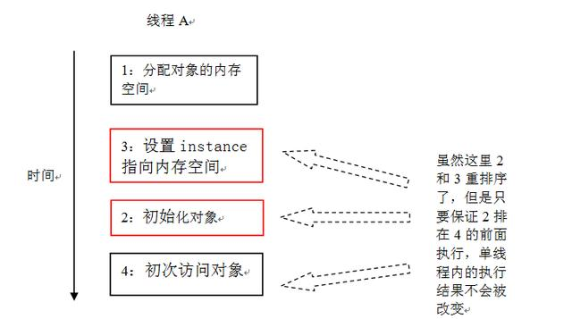
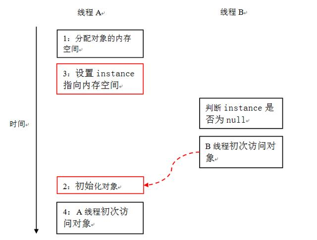
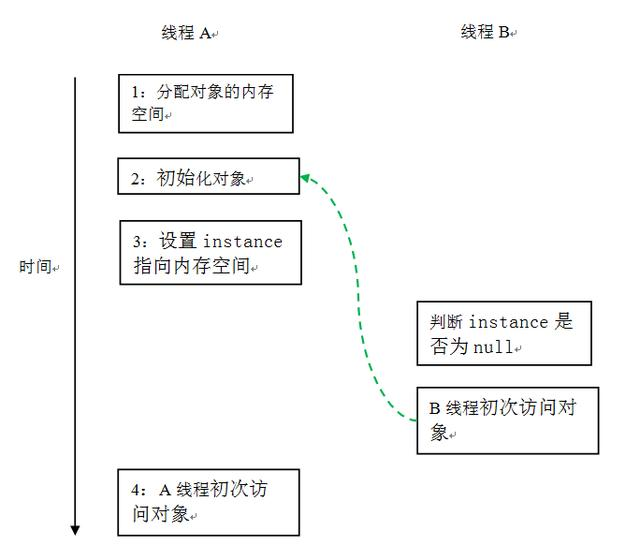
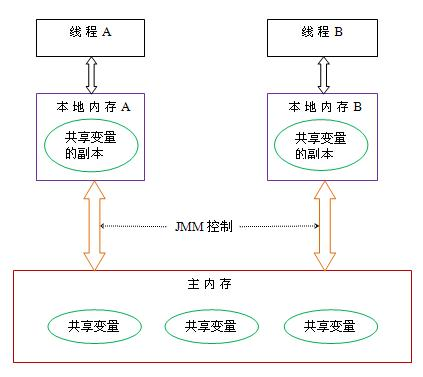

#volatile关键字原理
volatile这个关键字他主要做两个事情，一个是禁止重排序，一个是内存可见性
##1 禁止重排序
重排序的原因始在多核CPU场景下，由于有多个加法器、多个乘法器，可以将加法或乘法并行进行计算，**可以提高计算能力**，但是需要重新排序在单CPU下的计算顺序。
重排序带来的问题：在多线程环境下，两个线程对于执行逻辑有依赖关系，那么这个时候再进行重排序就存在问题。
如：  
>*addr=5;
 val=*data;
 
从表面上看，addr和data是没有什么联系的，完全可以放心的去乱序执行。但是如果这是在某某设备驱动程序中，这两个变量却可能对应到设备的地址端口和数据端口。并且，这个设备规定了，当你需要读写设备上的某个寄存器时，先将寄存器编号设置到地址端口，然后就可以通过对数据端口的读写而操作到对应的寄存器。那么这么一来，对前面那两条指令的乱序执行就可能造成错误。

**所以，重排序在多线程的情况下会有问题。**

volatile就通过禁止重排序来保证多线程下的数据一致性的。

重排序分两种，一种是编译器级别的重排序，一种是指令级别的重排序。编译器就类似与javac这类，会在编译阶段对代码进行重排序。指令级别的重排序就是处理器执行时的指令，举个著名的例子，单例的double check模式，上代码：
~~~java
public class Singleton {
  public static Singleton instance;
    private Singleton(){};
    public static Singleton getInstance(){
      if(instance==null){
        synchronized (Singleton.class) {
          if(instance==null){
            instance=new Singleton();
          }
        } 
      }
    return instance;
   }
}
~~~

其中的关键在于，初始化和赋值操作是分开的。在多线程情况下，由于CPU考虑到提高自身利用率，会进行指令的重排。导致的结果是，可能会出现下面这种危险的情况：

第一步：分配对象的内存空间。
第二步：初始化对象。
第三步：设置instance指向刚分配的内存地址。

单线程的情况下，2和3是可以进行重排序的，如图：
  

但是，多线程并发执行的时候的情况。请看下面的示意图：
  

多线程的情况下，B线程看到的有可能是一个还未被初始化的对象，如果这时候直接去使用的话无疑会发生NPE。  

比较合理的方式是通过volatile来禁止指令重排序：
~~~java
public class SafeDoubleCheckedLocking {
  private volatile static Instance instance;
  public static Instance getInstance() {
    if (instance == null) {
      synchronized (SafeDoubleCheckedLocking.class) {
        if (instance == null)
          instance = new Instance();//instance为volatile，现在没问题了
        }
     }
    return instance;
 }
}
~~~

当声明对象的引用为volatile后，三行伪代码中的2和3之间的重排序，在多线程环境中将会被禁止。执行顺序如图：
  

可见，volatile可以通过禁止指令重排序来处理多线程并发的场景。

##2 内存可见性
先说说JAVA在多线程执行的时候内存模型是什么样的。

线程之间的共享变量存储在主内存（main memory）中，每个线程都有一个私有的本地内存（local memory），本地内存中存储了该线程以读/写共享变量的副本。本地内存是JMM的一个抽象概念，并不真实存在。它涵盖了缓存，写缓冲区，寄存器以及其他的硬件和编译器优化。Java内存模型的抽象示意图如下：
  

所以，如果A想要知道B的事情，必须等待A把本地内存中的数据刷新到主内存之后，B去读主内存，才能知道A线程操作的结果数据。

因为有这个内存模型的存在，每个线程只需要读自己线程内的数据即可，比去读主内存性能要好很多，但同时在多线程的情况下，如果没有很好的数据同步机制，那也会因此而出问题：

初始状态 a=b=0，

假设A线程：  
>a = 1;
c = b;

B线程：
>b = 2;
d = a;

那么很有可能最后的结果c=d=0.

为什么？

当A线程给a赋值的时候，a的数据只存在于A线程的本地内存里，此时可能还没有同步到主内存中；同理，B线程给b赋值的时候也可能没有将b同步到主内存里。这个时候去读取a和b的值的时候，读到的数据就是0.

所以，多线程且多线程之间有数据依赖的情况下，我们需要通过一种机制来保证每一次的操作都刷新到主内存了，这样我们读到的数据都是最新的才是正确的。

volatile可以保证这一点。

volatile通过上面说的禁止重排序（本质上是在变量读写前后都加上一层屏障，在读或者写没有结束的时候不允许其他线程来读写）来保证。
~~~java
class VolatileFeaturesExample {
  volatile long vl = 0L; //使用volatile声明64位的long型变量
  public void set(long l) {
    vl = l; //单个volatile变量的写
  }
  public void getAndIncrement () {
    vl++; //复合（多个）volatile变量的读/写
  }
  public long get() {
    return vl; //单个volatile变量的读
  }
}
~~~
假设有多个线程分别调用上面程序的三个方法，这个程序在语意上和下面程序等价：
~~~java
class VolatileFeaturesExample {
  long vl = 0L; // 64位的long型普通变量
  public synchronized void set(long l) { //对单个的普通 变量的写用同一个监视器同步
    vl = l;
  }
  public void getAndIncrement () { //普通方法调用
    long temp = get(); //调用已同步的读方法
    temp += 1L; //普通写操作
    set(temp); //调用已同步的写方法
  }
  public synchronized long get() { 
    //对单个的普通变量的读用同一个监视器同步
    return vl;
  }
}
~~~
如上面示例程序所示，对一个volatile变量的单个读/写操作，与对一个普通变量的读/写操作使用同一个监视器锁来同步，它们之间的执行效果相同。

volatile变量自身具有下列特性：
- 可见性。对一个volatile变量的读，总是能看到（任意线程）对这个volatile变量最后的写入。
- 原子性：对任意单个volatile变量的读/写具有原子性，但类似于volatile++这种复合操作不具有原子性。

volatile通过内存屏障来保证这种特性，内存屏障则可以理解成一种锁，在有内存屏障的地方，其他线程不能访问或者操作该变量，以达到内存可见性和原子性。