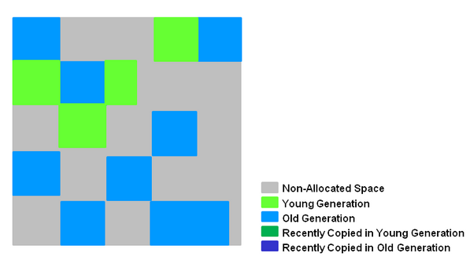
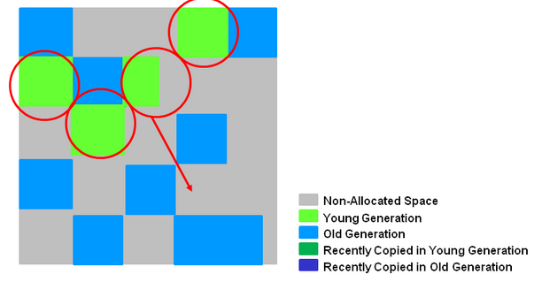
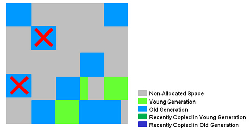
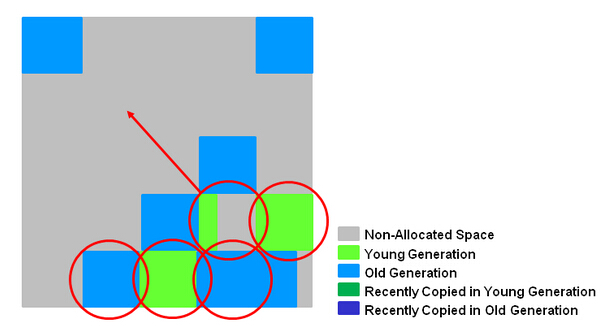
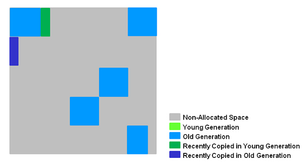

#JVM中G1垃圾回收器详细解析
我们先回顾一下主流Java的垃圾回收器(HotSpot JVM)。本文是针对堆的垃圾回收展开讨论的。  

堆被分解为较小的三个部分。具体分为：新生代、老年代、持久代。  
  

 - 绝大部分新生成的对象都放在Eden区，当Eden区将满，JVM会因申请不到内存，而触发Young GC ,进行Eden区+有对象的Survivor区(设为S0区)垃圾回收，把存活的对象用复制算法拷贝到一个空的Survivor(S1)中，此时Eden区被清空，另外一个Survivor S0也为空。下次触发Young GC回收Eden+S0，将存活对象拷贝到S1中。新生代垃圾回收简单、粗暴、高效。
- 若发现Survivor区满了，则将这些对象拷贝到old区或者Survivor没满但某些对象足够Old,也拷贝到Old区(每次Young GC都会使Survivor区存活对象值+1，直到阈值)。 3.Old区也会进行垃圾收集(Young GC),发生一次 Major GC 至少伴随一次Young GC，一般比Young GC慢十倍以上。
 - JVM在Old区申请不到内存，会进行Full GC。Old区使用一般采用Concurrent-Mark–Sweep策略回收内存。

总结：Java垃圾回收器是一种“自适应的、分代的、停止—复制、标记-清扫”式的垃圾回收器。  

缺点：
- GC过程中会出现STW(Stop-The-World)，若Old区对象太多，STW耗费大量时间。
- CMS收集器对CPU资源很敏感。
- CMS收集器无法处理浮动垃圾，可能出现“Concurrent Mode Failure”失败而导致另一次Full GC的产生。
- CMS导致内存碎片问题。

##G1 收集器
在G1中，堆被划分成 许多个连续的区域(region)。每个区域大小相等，在1M~32M之间。JVM最多支持2000个区域，可推算G1能支持的最大内存为2000*32M=62.5G。区域(region)的大小在JVM初始化的时候决定，也可以用-XX:G1HeapReginSize设置。

在G1中没有物理上的Yong(Eden/Survivor)/Old Generation，它们是逻辑的，使用一些非连续的区域(Region)组成的。

**新生代收集**
G1的新生代收集跟ParNew类似，当新生代占用达到一定比例的时候，开始出发收集。  
  
  
被圈起的绿色部分为新生代的区域(region)，经过Young GC后存活的对象被复制到一个或者多个区域空闲中，这些被填充的区域将是新的新生代；当新生代对象的年龄(逃逸过一次Young GC年龄增加１)已经达到某个阈值(ParNew默认15)，被复制到老年代的区域中。

回收过程是停顿的(STW,Stop-The-Word);回收完成之后根据Young GC的统计信息调整Eden和Survivor的大小，有助于合理利用内存，提高回收效率。

回收的过程多个回收线程并发收集。

**老年代收集**
和CMS类似，G1收集器收集老年代对象会有短暂停顿。

- 标记阶段，首先初始标记(Initial-Mark),这个阶段是停顿的(Stop the World Event)，并且会触发一次普通Mintor GC。对应GC log:GC pause (young) (inital-mark)
- Root Region Scanning，程序运行过程中会回收survivor区(存活到老年代)，这一过程必须在young GC之前完成。
- Concurrent Marking，在整个堆中进行并发标记(和应用程序并发执行)，此过程可能被young GC中断。在并发标记阶段，若发现区域对象中的所有对象都是垃圾，那个这个区域会被立即回收(图中打X)。同时，并发标记过程中，会计算每个区域的对象活性(区域中存活对象的比例)。
  
- Remark, 再标记，会有短暂停顿(STW)。再标记阶段是用来收集 并发标记阶段 产生新的垃圾(并发阶段和应用程序一同运行)；G1中采用了比CMS更快的初始快照算法:snapshot-at-the-beginning (SATB)。
- Copy/Clean up，多线程清除失活对象，会有STW。G1将回收区域的存活对象拷贝到新区域，清除Remember Sets，并发清空回收区域并把它返回到空闲区域链表中。
  
- 复制/清除过程后。回收区域的活性对象已经被集中回收到深蓝色和深绿色区域。
  

**关于Remembered Set概念：**G1收集器中，Region之间的对象引用以及其他收集器中的新生代和老年代之间的对象引用是使用Remembered Set来避免扫描全堆。G1中每个Region都有一个与之对应的Remembered Set，虚拟机发现程序对Reference类型数据进行写操作时，会产生一个Write Barrier暂时中断写操作，检查Reference引用的对象是否处于不同的Region之间(在分代中例子中就是检查是否老年代中的对象引用了新生代的对象)，如果是便通过CardTable把相关引用信息记录到被引用对象所属的Region的Remembered Set中。当内存回收时，在GC根节点的枚举范围加入Remembered Set即可保证不对全局堆扫描也不会有遗漏。

G1虽然保留了CMS关于代的概念，但是代已经不是物理上连续区域，而是一个逻辑的概念。在标记过程中，每个区域的对象活性都被计算，在回收时候，就可以根据用户设置的停顿时间，选择活性较低的区域收集，这样既能保证垃圾回收，又能保证停顿时间，而且也不会降低太多的吞吐量。Remark阶段新算法的运用，以及收集过程中的压缩，都弥补了CMS不足。引用Oracle官网的一句话：“G1 is planned as the long term replacement for the Concurrent Mark-Sweep Collector (CMS)”。

