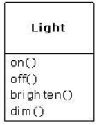

#1:对象简介
##抽象过程
解决问题的复杂程度直接与抽象的种类（抽象了什么）、质量相关。  
面向对象：  
■问题空间的元素同它在解决空间的表述称为“对象”。还有一些对象在问题空间并无对照对象  
■向代码中增加新对象可以处理问题的各种变形
**Smalltalk的五项特征  **Java的基础，描述了纯面向对象的编程方法（Allen Kay）：  
**1）万物节对象**：特殊的变量；用于存储数据。对对象提要求，命令它进行某些操作  
**2）程序就是一组相互之间传递消息，告诉对方该干些什么的对象**：向对象发一个消息，向对象提出要求。消息是调用专属某个对象的方法的请求  
**3）每个对象都利用别的对象来组件它自己的记忆**：程序的复杂性隐藏在对象的简单性之下  
**4）对象都有类型**：对象都是某个类的实例，类（class）就行类型（type）  
**5）所有属于同一类型的对象能接受相同的消息**：多态性的描述，子类可以替换父类，但父类无法替换子类  
对象的简洁定义（Booch）：  
■对象有状态、行为、标识  
##对象有接口
■类：具有相同特征（数据元素）和行为（功能）的对象，类是一种数据类型  
■接口：只负责说明能向这个对象发什么请求。向对象发出请求，就会调用接口，称为：传递一个消息  
  
UML图中描述的类图，如上图所示，其中只显示public部分，因此隐藏了数据，而只显示public的方法和类名称  
##对象会提供服务
■编程的目的是为完成让“对象为用户提供服务”这一任务，而制作或者从现有代码库中找出一组能为解决问题提供最佳服务的对象  
■将对象视为服务提供者的优点：
&nbsp;&nbsp;&nbsp;&nbsp;提高对象的内聚性。在一个对象中塞过多的内容，是设计对象时常犯的错误。每个对象都应该只做一件事，并且做好一件事  
##隐藏实现
将程序员分为：类创建者（class creator）、客户程序员（client programmer，使用类编程的人），能够更好理解问题  
△客户程序员的目的：收集各种类，以便能快速开发应用程序  
△类创建者的目的：创建能够提供服务的类，供客户程序员使用。类定义中只透露一些客户程序员必须知道的东西，其他部分完全隐藏。隐藏的部分都是类最脆弱的部分，容易出现bug的部分  
■访问控制的目的：  
1）禁止客户程序员碰触不该动的东西，只允许他们接触解决问题所必需的接口
2）允许类创建者、维护者在不打扰客户程序员的情况下修改类的内部工作方式。类的内部可以重新优化，只要不改动接口  
■Java的访问控制关键字：public、private、protected  
1）public：后面的东西谁都能用  
2）private：除非类的创建者用这个类的方法进行访问，否则没人能访问。若要直接访问private成员，在编译时就会报错  
3）protected：继承类能访问protected成员，但不能访问private成员  
4）java的【缺省】访问权限，通常称为package访问权限。同属于相同package的类可以访问这个package中其他类的“缺省权限”成员。出了package就是private的  
##复用实现
■最简单的复用代码是使用类创建对象，或将对象放到一个新类中作为“成员对象”  
■用UML表示聚合关系（aggregation），这是一种合成关系（has-a）  
  
■新类中的对象通常都是private，可以在不影响客户代码下，修改这些成员  
■基础没有合成灵活，一味使用继承会导致复杂的设计  
##继承：复用接口
■父类（基类base class，父类parent class，超类superclass）  
■子类（衍生类，派生类derived class，继承类 inherited class，子类subclass、child class）  
  
■继承表达处理消息的相似性
&nbsp;&nbsp;&nbsp;&nbsp;创建基类是为了表达对系统中某些对象的核心思想的理解  
&nbsp;&nbsp;&nbsp;&nbsp;衍生类是为了表达实现核心思想的方式  
典型的继承关系  
  
■类的继承
1）is-a关系  
完全替换（pure substitution）  
2）方法追加（ls-like-a）    
  
2）方法重写（override）  
方法重写很简单，只需要重新定义方法，重新定义的方法要与接口方法具有相同的方法签名。不要在新类里重写方法用于不同的行为  
  
##可凭借多态性相互替换的对象
■编译器不用传统的方式进行函数调用。非OOP编译器的做法成为前绑定（early binding）
&nbsp;&nbsp;&nbsp;&nbsp;编译器会产生函数的调用，连接器负责将这个调用解析成须执行的代码的绝对地址  
■OOP编译器，在运行时，程序才确定代码地址
&nbsp;&nbsp;&nbsp;&nbsp;OOP使用后绑定（late binding）的概念。编译器只保证该方法存在，并检查参数和返回值的类型（不这么做的语言属于弱类型 weakly typed）  
■Java中的后绑定，用一些特殊代码来代替绝对调用。代码用存储在对象中的信息来计算方法的地址。因此每个对象的运行方式会根据这段特殊代码的内容而改变。当向那个对象发送消息时，对象知道如何处理  
■在C++中要使用后绑定的灵活性，需要用virtual关键字，而动态绑定是Java的缺省行为，无需添加额外的关键字就能获得多态性  
■派生类当做基类的过程称为上传（upcast）  
    
**abstract基类和interface**  
■abstract基类不能创建对象，可以用于不想让人创建一个基类对象的情况  
■abstract关键字还用来表示该方法没有实现，abstract方法只能存在于abstract类里。abstract可以不用写方法的实现，只定义方法  
■interface关键字对abstract类的概念深化，不允许实现任何方法，将接口与实现彻底分开。可以继承多个接口，但是不允许继承多个常规/抽象类  
##对象创建，使用和生命周期
OOP只包括数据类型、继承、多态  
Java采用堆空间存储对象，资源回收使用垃圾回收器（garbage collector）  
###Collection迭代器
Java的Collection或称container，容量可以动态扩展，以便有充足的空间装入数据  
■能够操作容器中一组元素的工具“迭代器（iterator）”，功能就是在容器中选取一个元素，并把它交给迭代器用户。这种抽象将容器细节与访问容器的代码隔离开。通过迭代器，容器被抽象成一个简单的线性序列。原始的Java2的迭代器是Enumeration，现在已经变成Iterator  
■挑选容器的原因：  
1）容器提供不同的接口和外部行为  
2）不同容器在进行相同操作时，效率不同  
&nbsp;&nbsp;&nbsp;&nbsp;  eg：
ArrayList：随机访问时间恒定；LinkedList随机访问代价大  
ArryList在序列中箭插入元素效率低；LinkedList效率高  
###单根继承体系  
■C++的多重继承无法确认对象的基类。多重继承限制多，且代价大  
■Java单根继承开发效率高。垃圾回收器的实现也容易，单根继承的类都能收到向对象发送的信息，垃圾回收器很难实现  
###下传与模板/泛型 
■使用容器时，容器内存放的是Object基类，于是放入其中的对象都被上传给Object。在容器中取出对象时，其类型退化为Object，需要进行强制类型转换才能变回存入容器前的内容，这个过程称为下传（downcast）。upcast安全；downcast不安全，可能会报类型转换运行期异常  
&nbsp;&nbsp;&nbsp;&nbsp;解决：采用参数化类型（parameterized type）机制，将容器定制成只能存放某种类型的容器
`List<String> str = new ArrayList<String>();`  
###确保正确地清除
由于Java中的对象只能在堆中创建，因此判断堆中对象是否在被引用即可实现对象的回收  
###垃圾回收器的效率与灵活性
C++允许在栈中创建对象，栈中创建对象自动清理。在堆中创建对象回收的效率要低很多  
Java的GC启动时机及运行时间未知  
##异常处理：与错误打交道
■异常是一种能从错误发生的地方被抛出的对象。异常处理与正常处理是一条平行的执行线路  
■异常处理机制，可以提高程序的健壮性，为程序从错误状态恢复而非退出程序  
■Java的异常处理从底层发起，未实现异常处理的代码无法通过编译  
##并发
■线程是分配处理器时间的单元，即使多CPU、多处理器也不用考虑线程在CPU内核中的分配问题  
■多线程需要注意的就是共享资源，在处理共享资源时需要为资源加锁（程序中需要使用synchorized关键字）  
##Persistence（持久化） 
Java提供轻量级persistence支持，可以将对象保存到磁盘，随时可以恢复使用  
##Java和Internet
Java Applet可以操作本地文件，一般的安全做法是通过签名  
Java在互联网应用中主要体现在服务器端编程  
  

  

