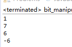

#1 标准输出
>\#!/usr/bin/python  
>\#-*-coding:utf-8-*-
 '''
>Created on 2016年12月3日

>@author: Administrator
>'''
>print("Hello World")
>print("This is a Python program")

在Python对话框中标准输出：  

【注】Python的py文件的第一行以#!开头，称为组织行。告诉系统程序运行时采用哪种编译器

#2 Python的数据类型
Python的基本数据类型有数、字符串
##2.1 数字
Python有四种类型的数：整数、长整数、浮点数、复数
##2.2 字符串
1）使用单引号（'）的字符串，其中的空格、制表符照原样保留  
2）使用双引号（"）的字符串，与单引号完全相同  
3）使用三引号（'''）或（"""）指示一个多行字符串。可以在三引号中自由使用单引号、双引号  

■转义字符  
1）要在字符串中使用单引号，可以使用【\'】转义，也可以使用双引号，在双引号的字符串中自由使用单引号  
trans_single_quotes.py  
>\#!/usr/bin/python       
>\#-*-coding:utf-8-*-     
'''  
>Created on 2016年12月3日  
>@author: Administrator  
>'''  
>print("What's your name?")    
>print('What\'s your name?')      

输出结果：  
   

2）如果需要转义反斜杠（\），无论是单引号、双引号，都需要用【\\】进行转义  
trans_backslash.py  
	\#!/usr/bin/python  
	\#-*-coding:utf-8-*-  
	 ''' 
	Created on 2016年12月3日  
	@author: Administrator  
	'''  
	print("I want to output a backslash -> \\\")  
	print('I want to output a backslash -> \\\')  
输出结果：  
  

3）反斜杠作为行尾延续符号，支持字符串在py文件中换行。打印出来的仍然是一行  
trans_end_of_line.py  
>\#!/usr/bin/python
\#-*-coding:utf-8-*-    
 '''  
Created on 2016年12月3日  
@author: Administrator  
'''  
print("This is the first sentence\  
&nbsp;&nbsp;&nbsp;&nbsp;This is the second sentence")

输出结果：  

■自然字符串  
如果字符串不需要转义处理，需要指定一个自然字符串  
normal_str.py  
>\#!/usr/bin/python  
>\#-*-coding:utf-8-*-  
 '''  
Created on 2016年12月3日  
@author: Administrator  
'''  
print(r'Normal String to deal with \n')  

输出结果：  

■Unicode字符串  
使用u/U表示Unicode字符串，在处理文件时要注意，当文件中含有非英文需要使用unicode字符串  
unicode_str.py  
>\#!/usr/bin/python   
>\#-*-coding:utf-8-*-  
 '''  
Created on 2016年12月3日  
@author: Administrator  
'''  
print(u"这是一个中文Unicode字符串")  

输出结果：  

■字符串不能修改  
■相邻放置的字符串Python会自动连接  
automatic_join.py  
>\#!/usr/bin/python  
\#-*-coding:utf-8-*-  
 '''  
Created on 2016年12月3日  
@author: Administrator  
'''  
print('This is a String' ' which will be join automaticly by Python')   

输出结果：  
  

■在处理正则表达式时，需要注意使用自然字符串，否则需要使用很多的反斜杠（backslash） ，因为正则表达式中大量使用反斜杠（backslash），以'\\l'为例，如果采用自然字符串只需写成r'\l'  
#3 变量
■变量标识符规则：
1）标识符的第一个字符必须是大小写字母或下划线
2）标识符其他部分由大小写字母、下划线、数字组成
3）标识符大小写敏感
4）减号不能出现在标识符中
#4 物理行逻辑行
正常的程序物理行可以通过反斜杠（\）组合成一个逻辑行  
execable.py  
>s = 'This is a String \  
>This continues the String.'  
print s

输出：  
>This is a String This continues the String.

#5 空白
同一层次的语句必须有相同的缩进。这样的一组语句称为块。
#6 运算符
1) + 加
字符串相加，相当于字符串连接  
string_plus.py  
>\#!/usr/bin/python    
\#-*-coding:utf-8-*-  
 '''  
@author: Administrator  
'''  
print 'a' + 'b'  

输出  
  

2) - 减：表示负数，或相减。不支持字符串相减

3) * 乘：乘法运算；字符串乘法，相当于字符串重复若干次
string_multiple.py  
>\#!/usr/bin/python  
\#-*-coding:utf-8-*-  
 '''  
@author: Administrator  
'''  
print 'la'*3 
 
输出  
 

4) ** 幂：返回x的y次幂
5) / 除：x除以y。整数与整数相除，返回整数；浮点数相除，返回浮点数 
division.py  
>\#!/usr/bin/python  
\#-*-coding:utf-8-*-  
 '''  
Created on 2016年12月17日  
@author: Administrator  
'''  
print 4/3  
print 4.0/3  
print 4/3.0  

输出  
   
6) // 取整除：返回整数部分 % 取余
7) << 左移：把一个数的比特向左移一定数目（每个数在内存中都表示为二进制数）
8) >> 右移：把一个数的比特向右移一定数目
bit_shifting.py
>\#!/usr/bin/python    
\#-*-coding:utf-8-*-  
 '''  
Created on 2016年12月17日  
@author: Administrator  
'''  
print 2<<1  
print 2>>1  

输出  
 

9）& 按位与：数的按位与
&nbsp;&nbsp;&nbsp;&nbsp;| 按位或：数的按位或  
&nbsp;&nbsp;&nbsp;&nbsp;^按位异或：数的按位异或  
&nbsp;&nbsp;&nbsp;&nbsp;~按位取反：x的按位取反-(x+1)  
bit_manipulation.py  
>\#!/usr/bin/python  
\#-*-coding:utf-8-*-  
 '''  
Created on 2016年12月17日  
@author: Administrator  
'''  
print 5 & 3  
print 5 | 3  
print 5 ^ 3  
print ~5  

输出  
 

10） < 小于  
&nbsp;&nbsp;&nbsp;&nbsp;> 大于  返回特殊变量true、false（1,0）  
&nbsp;&nbsp;&nbsp;&nbsp;<=小于等于  
&nbsp;&nbsp;&nbsp;&nbsp;>=大于等于  
&nbsp;&nbsp;&nbsp;&nbsp;==等于，在比较字符串时，比较字符串内容  
&nbsp;&nbsp;&nbsp;&nbsp;!= 不等于  
logic_compare.py  
>\#!/usr/bin/python  
\#-*-coding:utf-8-*-  
 '''  
Created on 2016年12月17日  
@author: Administrator  
'''  
print '5>3:'  
 print 5>3  
print '5<3:'  
 print 5<3  
print '5>=3:'  
 print 5>=3  
print '5<=3:'  
print 5<=3  
print '5 == 5:'  
print 5 == 5  
a = 'str'  
b = 'stR'  
print "a(str)==b(stR):"  
print a == b  
print "a(str)!=b(str):"  
print a != b  
print 'a(str)==b(str)'  
b = 'str'  
print a == b  

输出  
 

11）not 布尔非  
&nbsp;&nbsp;&nbsp;&nbsp;and 布尔与  
&nbsp;&nbsp;&nbsp;&nbsp;or 布尔或  
logic.py  
>\#!/usr/bin/python  
\#-*-coding:utf-8-*-  
'''  
Created on 2016年12月17日  
@author: Administrator  
'''  
x = True  
print 'logic not:',not x  
y = False  
print 'logic x and y:', x and y  
print 'logic x or y:', x or y  

输出  
 

#7 运算优先级
优先级由低到高：  
1）lambda表达式  
2）or 布尔或  
3）and 布尔与  
4）not 布尔非  
5）in，not in 成员测试  
6）is，is not 同一性测试  
7）<. <=, >,>=, ==, != 比较  
8）| 按位或  
9）^ 按位异或  
10）& 按位与  
11）<<, >> 移位  
12）+，- 加法、减法  
13）*，/，% 乘法、除法、取余  
14）+x, -x 正负号  
15）~x 按位取反  
16）** 指数  
17）x.attribute 属性参考  
18）x[index] 下标  
19）x[index:index] 寻址段  
20）f(arguments ...) 函数调用  
21）(expression...) 绑定或元祖显示  
22）[expression...] 列表显示  
23）{key:datum} 字典显示  
24） ‘expression’ 字符串转换  
建议使用括号确保正确的运算优先级    
#8 控制流
##8.1 if
statement_if.py  
>\#!/usr/bin/python   
\#-*-coding:utf-8-*-  
'''  
Created on 2016年12月17日  
@author: Administrator  
'''  
number = 23  
guess = int(raw_input('Enter an integer:'))  
if guess == number:  
&nbsp;&nbsp;&nbsp;&nbsp;    print 'Congratulations, you guessed it.'  
&nbsp;&nbsp;&nbsp;&nbsp;    print 'but you do not win any praises!'  
elif guess < number:  
&nbsp;&nbsp;&nbsp;&nbsp;    print 'No, it is a little higher than that.'  
else :  
    print 'No, it is a little lower than that.'  
print 'Done'    

输出：  
  
    
  

##8.2 while
statement_while.py  
>\#!/usr/bin/python  
\#-*-coding:utf-8-*-  
'''  
Created on 2016年12月17日  
@author: Administrator  
'''  
number = 23  
running = True  
while running:  
&nbsp;&nbsp;&nbsp;&nbsp;    guess = int(raw_input('Enter an integer:'))  
&nbsp;&nbsp;&nbsp;&nbsp;    if guess == number:  
&nbsp;&nbsp;&nbsp;&nbsp;&nbsp;&nbsp;&nbsp;&nbsp;        print 'Congratulations, you guessed it.'  
&nbsp;&nbsp;&nbsp;&nbsp;&nbsp;&nbsp;&nbsp;&nbsp;        print 'but you do not win any praises!'  
&nbsp;&nbsp;&nbsp;&nbsp;&nbsp;&nbsp;&nbsp;&nbsp;        running = False  
&nbsp;&nbsp;&nbsp;&nbsp;    elif guess < number:  
&nbsp;&nbsp;&nbsp;&nbsp;&nbsp;&nbsp;&nbsp;&nbsp;        print 'No, it is a little higher than that.'  
&nbsp;&nbsp;&nbsp;&nbsp;    else :  
&nbsp;&nbsp;&nbsp;&nbsp;&nbsp;&nbsp;&nbsp;&nbsp;        print 'No, it is a little lower than that.'  
else:  
&nbsp;&nbsp;&nbsp;&nbsp;    print 'The while loop is over.'  

输出  
  
##8.3 for
statement_for.py  
>\#!/usr/bin/python  
\#-*-coding:utf-8-*-  
'''  
Created on 2016年12月17日  
@author: Administrator  
'''  
for i in range(1,5):  
&nbsp;&nbsp;&nbsp;&nbsp;    print i  
else:  
&nbsp;&nbsp;&nbsp;&nbsp;    print 'The i for loop is over.'  
&nbsp;&nbsp;&nbsp;&nbsp;    for j in range(1,6,2):  
&nbsp;&nbsp;&nbsp;&nbsp;    print j  
else:  
&nbsp;&nbsp;&nbsp;&nbsp;    print 'The j for loop is over'  

输出  
  
其中range函数，返回一个序列的数，  
range(a,b) ：a序列开始，b序列结束，不包括b。默认步长1  
range(a,b,c)：a序列开始，b序列结束，不包括b。步长c  

##8.4 break
statement_break.py  
>\#!/usr/bin/python  
\#-*-coding:utf-8-*-  
'''  
Created on 2016年12月17日  
@author: Administrator  
'''  
while True:  
&nbsp;&nbsp;&nbsp;&nbsp;     s = raw_input('Enter something:')
&nbsp;&nbsp;&nbsp;&nbsp;     if s == 'quit':  
&nbsp;&nbsp;&nbsp;&nbsp; &nbsp;&nbsp;&nbsp;&nbsp;         break  
&nbsp;&nbsp;&nbsp;&nbsp;     print s, 'Length of the string is',len(s)  
print 'Done'  

输出  
  
##8.5 continue
statement_continue.py  
>\#!/usr/bin/python  
\#-*-coding:utf-8-*-  
'''  
Created on 2016年12月17日  
@author: Administrator  
'''  
while True:  
&nbsp;&nbsp;&nbsp;&nbsp;    s = raw_input('Enter something : ')  
&nbsp;&nbsp;&nbsp;&nbsp;    if s == 'quit':  
&nbsp;&nbsp;&nbsp;&nbsp;&nbsp;&nbsp;&nbsp;&nbsp;        break  
&nbsp;&nbsp;&nbsp;&nbsp;    if len(s) < 3:  
&nbsp;&nbsp;&nbsp;&nbsp;&nbsp;&nbsp;&nbsp;&nbsp;        print 'Input is of sufficient length'  
&nbsp;&nbsp;&nbsp;&nbsp;&nbsp;&nbsp;&nbsp;&nbsp;        continue  

输出  
  
#9 函数
##9.1 函数定义
function_create.py  
>\#!/usr/bin/python  
\#-*-coding:utf-8-*-  
'''  
Created on 2016年12月17日  
@author: Administrator  
'''  
def sayHello():  
&nbsp;&nbsp;&nbsp;&nbsp;    print 'Hello World!'  
>
>sayHello()  

输出
  
##9.2 带形参的函数
function_formal_parameter.py  
>\#!/usr/bin/python  
\#-*-coding:utf-8-*-  
'''  
Created on 2016年12月17日  
>
>@author: Administrator  
'''  
def printMax(a,b):  
&nbsp;&nbsp;&nbsp;&nbsp;    if a>b:  
&nbsp;&nbsp;&nbsp;&nbsp;&nbsp;&nbsp;&nbsp;&nbsp;        print a,'is maximum'  
&nbsp;&nbsp;&nbsp;&nbsp;    else:
&nbsp;&nbsp;&nbsp;&nbsp;&nbsp;&nbsp;&nbsp;&nbsp;        print b,'is maximum'  
>
>printMax(5,10)  

输出  
  
局部参数：函数中的参数的作用域都在函数内  
function_local_variable.py  
>\#!/usr/bin/python  
\#-*-coding:utf-8-*-  
'''  
Created on 2016年12月17日  
>
>@author: Administrator  
'''  
def f(x):  
&nbsp;&nbsp;&nbsp;&nbsp;    print 'The value of x is',x  
&nbsp;&nbsp;&nbsp;&nbsp;    x = 2  
&nbsp;&nbsp;&nbsp;&nbsp;    print 'Change local x to',x  
>
>x = 50  
f(x)  
print 'X is still',x  

输出  
  

##9.3 global
在函数体内使用global关键字，可以使用函数体外定义的变量，并且可以修改其值  
function_global_variable.py  
>\#!/usr/bin/python  
\#-*-coding:utf-8-*-  
'''  
Created on 2016年12月17日  
>
@author: Administrator  
'''  
def f():  
&nbsp;&nbsp;&nbsp;&nbsp;    global x  
&nbsp;&nbsp;&nbsp;&nbsp;    print 'The value of x is',x  
&nbsp;&nbsp;&nbsp;&nbsp;    x = 2  
&nbsp;&nbsp;&nbsp;&nbsp;    print 'Change x to',x  
>
x = 50  
f()  
print 'The value of x is',x  

输出  
  

##9.4 默认参数值
function_default_parameter.py  
>\#!/usr/bin/python  
\#-*-coding:utf-8-*-  
'''  
Created on 2016年12月17日  
>
@author: Administrator  
'''  
def say(message, times = 1):  
&nbsp;&nbsp;&nbsp;&nbsp;    print message*times  
>
say('Hello')  
say('Hello',5)  

输出  
  
##9.5 关键参数
当函数有众多参数，为了函数的易用性，只想制定其中一部分参数即使用该函数。  
优点：   
1）不必担心参数的顺序  
2）假设其他参数都有默认值，只给想要的参数赋值  
function_key_parameter.py  
>\#!/usr/bin/python  
\#-*-coding:utf-8-*-  
'''  
Created on 2016年12月17日  
>
@author: Administrator  
'''  
def func(a,b=5,c=10):  
&nbsp;&nbsp;&nbsp;&nbsp;    print 'a is',a,', b is',b,', c is',c  
>
func(3,7)  
func(25,c=24)  
func(c=50,a=100)  

输入  
  
##9.6 return语句
从一个函数返回  
function_return.py  
>\#!/usr/bin/python  
\#-*-coding:utf-8-*-  
'''  
Created on 2016年12月20日  
>
@author: Administrator  
'''  
def maximum(x,y):  
&nbsp;&nbsp;&nbsp;&nbsp;    if x>y:  
&nbsp;&nbsp;&nbsp;&nbsp;&nbsp;&nbsp;&nbsp;&nbsp;        return x  
&nbsp;&nbsp;&nbsp;&nbsp;    else:  
&nbsp;&nbsp;&nbsp;&nbsp;&nbsp;&nbsp;&nbsp;&nbsp;        return y  
>
print maximum(10,30)  

输入  
  
【注】None相当于Null，def的函数默认会返回一个None的返回值  
##9.7 DocStrings
DocString可以输出函数的文档  
function_docstring.py  
>\#!/usr/bin/python  
\#-*-coding:utf-8-*-  
'''  
Created on 2016年12月20日  
>
@author: Administrator  
'''  
def printMax(x,y):  
&nbsp;&nbsp;&nbsp;&nbsp;    ''' Prints the maximum of two numbers  
>
&nbsp;&nbsp;&nbsp;&nbsp;&nbsp;&nbsp;&nbsp;&nbsp;        The two values must be integers .'''  
&nbsp;&nbsp;&nbsp;&nbsp;    x = int(x)  
&nbsp;&nbsp;&nbsp;&nbsp;    y = int(y)  
&nbsp;&nbsp;&nbsp;&nbsp;    if x>y:  
&nbsp;&nbsp;&nbsp;&nbsp;&nbsp;&nbsp;&nbsp;&nbsp;        print x,'is maximum'  
&nbsp;&nbsp;&nbsp;&nbsp;    else:  
&nbsp;&nbsp;&nbsp;&nbsp;&nbsp;&nbsp;&nbsp;&nbsp;        print y,'is maximum'  
printMax(10,15)  
print printMax.__doc__  
print help(printMax)  

输出结果  
  
文档字符串惯例是一个多行字符串，首行以大写字母开始，句号结尾。第二行为空行，第三行开始是详细描述  
#10 模块
##10.1 模块引用
>\#!/usr/bin/python  
\#-*-coding:utf-8-*-  
'''  
Created on 2016年12月20日  
>
@author: Administrator  
'''  
import sys  
>
print 'The command and line arguments are:'  
for i in sys.argv:  
&nbsp;&nbsp;&nbsp;&nbsp;    print i  
>
print '\n\nThe PYTHON PATH is', sys.path, '\n'   

输出  
  
关于Argument输出，在Run Configuration中设置  
  
