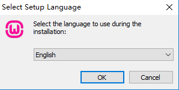
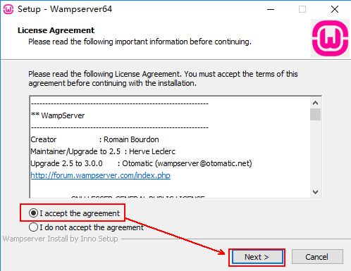
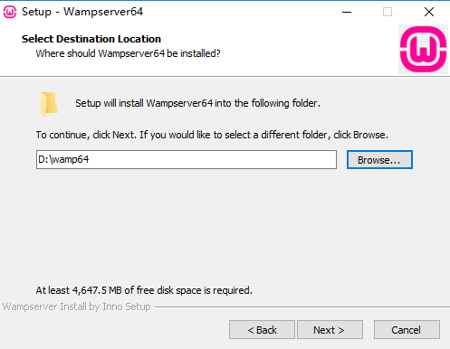
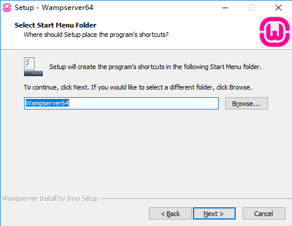
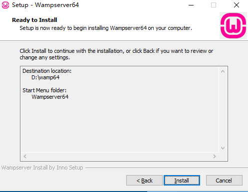
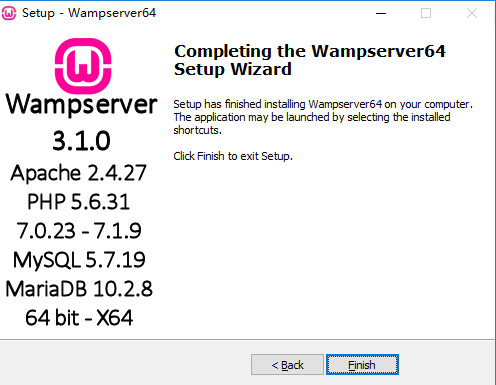

1【PHP还有很多一键式安装的集成开发环境，可以将PHP开发所需的Apache、MySQL、PHP等软件同时安装到本机。
#WampServer3.10
WampServer是一个集成安装包，即在windows系统上一键安装Apache服务器、PHP解析器、MySQL数据库。  
3.10版本对应的各软件的版本：
- Apache 2.4.27
- PHP 5.6.31, 7.0.23, 7.1.9 
- MySQL 5.7.19
- MariaDB 10.2.8
- PhpMyAdmin 4.7.4 
- Adminer 4.3.1 
- PhpSysInfo 3.2.7

##1 安装手顺
1. 双击wampserver3.1.0_x64.exe
2. 选择语言种类，选择英文
  
3. 选择同意安装条款
  
4. 选择安装目录
  
5. 选择开始菜单中WampServer的名称，保持默认即可
  
6. 开始安装
  
7. 在安装过程中会提示安装其他浏览器和其他文本编辑器，都选择否即可  
8. 安装完成
  

