#Ubuntu实操
##Ubuntu 16.04实操
###1 设置网卡
1）查看网卡名称 
Ubuntu 16.04的网卡已不再按照eth0命名网卡，而需要在如下目录进行查询：  
`cd /proc/sys/net/ipv4/conf`   
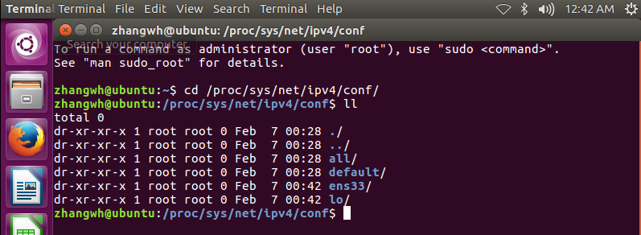   
因此该操作系统的网卡为lo和ens33   
2）设置网卡信息  
`sudo vi /etc/network/interfaces`    
原始内容为：   
`auto lo` 
`iface lo inet loopback` 
修改为： 
`auto lo` 
`iface lo inet loopback` 
`auto ens33` 
`iface ens33 inet static` 
`address 192.168.119.132` 
`netmask 255.255.255.0` 
`gateway 192.168.119.128` 
3）设置DNS信息 
`sudo vi /etc/resolv.conf` 
添加DNS服务器地址： 
`nameserver 202.107.117.11`   
`nameserver 202.96.134.133`    
`nameserver 8.8.8.8`  
3）重启网络服务 
`sudo /etc/init.d/networking restart`  
###Ubuntu 16.04网卡设置问题对应
【问题1】在配置好网络之后，当重启之后，会出现网络无法使用的情况，网络图标显示“device not managed”  
【解决方法】  
sudo vi /etc/NetworkManager/NetworkManager.conf  
将“managed=false”修改为“managed=true”重启network manager：  
sudo service network-manager restart  
即可解决问题。
【问题2】在网卡配置好后，当系统重启之后，报出“connection activation failed”。
【问题原因】由于Ubuntu Desktop版中，在/etc/network/interfaces来进行配置以外，还可以使用network-manager进行可视化配置。默认情况下Desktop版Ubuntu会用network-manager接管网络配置。如果在两处同时配置了IP信息，会产生冲突，产生“connection activation failed”。Server版应该没有这个问题。
【解决方法】删除:  
1）停止服务network-manager  
`sudo service network-manager stop`  
2）移除nm 的状态文件  
`sudo rm /var/lib/NetworkManager/NetworkManager.state`  
3）编辑NetManager.conf配置文件  
`sudo vi /etc/NetworkManager/NetworkManager.conf`    
将“managed=false”修改为“managed=true”  
4）重启network-manager 
`sudo service network-manager restart`  
另一种解决方案，就是在Network-Manager中设置IP，而不在/etc/network/interfaces中进行管理  
[问题3]Ubuntu在运行过程中经常出现wifi掉线的问题,在网上寻找到一个解决方案  
[问题解决]在终端输入命令：sudo nano /etc/modprobe.d/blacklist.conf  
打开配置文件，在最后一行加入：blacklist acer-wmi  

###2 防火墙设置
1）永久关闭防火墙 
`ufw disable ` 
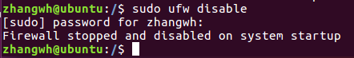

###3 配置Telnet
下载openssh-client和openssh-server：  
`sudo apt-get install openssh-client`  
`sudo apt-get install openssh-server`   
FlashFXP配置客户端：   
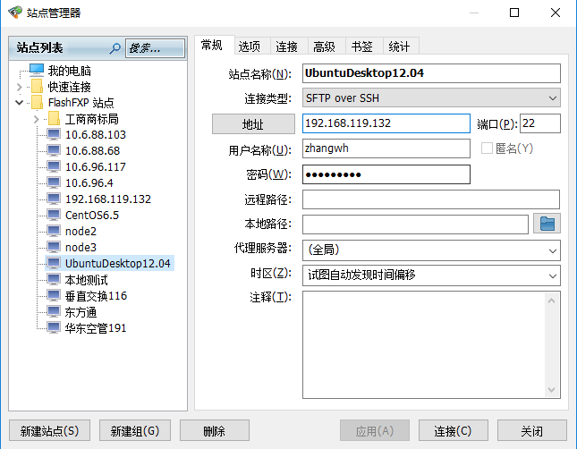  
SecureCRT配置客户端：  
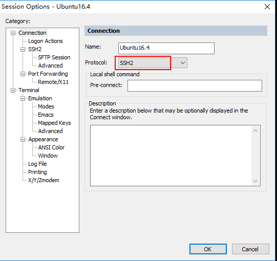  

###4 安装MySQL数据库（联网模式）
1）安装数据库文件，安装时mysql是5.7版   
`sudo apt-get install mysql-server`  
`sudo apt-get install mysql-client`  
`sudo apt-get install libmysqlclient-dev`  
如果中途有问题就执行以下 apt-get update  
2）检验是否安装完成  
`sudo netstat -tap | grep mysql`  
输出结果：  
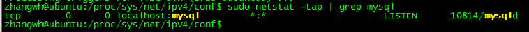  
3）设置远程访问  
编辑mysqld.cnf文件，把其中bind-address = 127.0.0.1注释掉  
`sudo vi /etc/mysql/mysql.conf.d/mysqld.cnf`  
4）在本机上访问mysql
`sudo mysql -uroot -proot`  
进入mysql控制台，执行如下命令，任何IP都可以用root用户，密码root访问mysql数据库  
`grant all on *.* to root@'%' identified by 'root' with grant option;`  
5）刷新权限信息  
`flush privileges;`  
6）重启mysql
`sudo /etc/init.d/mysql restart`  
数据库启动：
`sudo /etc/init.d/mysql start`  
数据库停止：
`sudo /etc/init.d/mysql stop`  
7）数据库客户端配置  
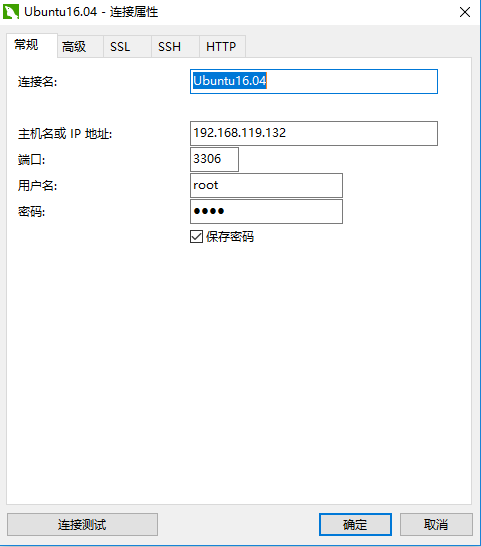  

###5 安装搜狗拼音输入法并设置
在搜狗拼音页面下载搜狗.deb文件并安装  
在[系统设置]中设置[语音支持]  
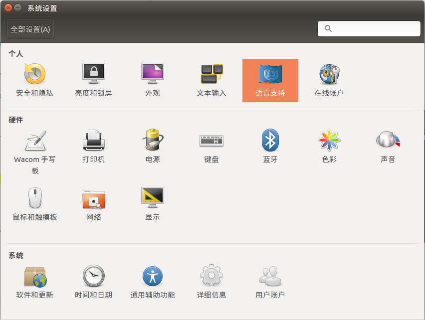  
在语音支持中,选择键盘输入法系统选择[fcitx]
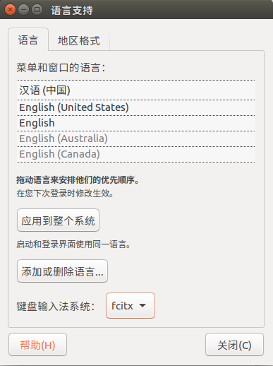  
在[系统设置]中设置[文本输入]  
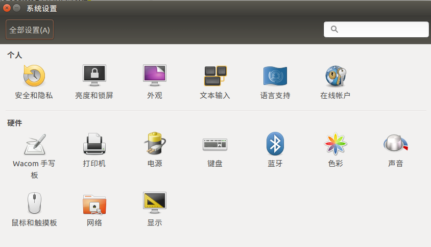  
在文本输入中添加中文输入源  
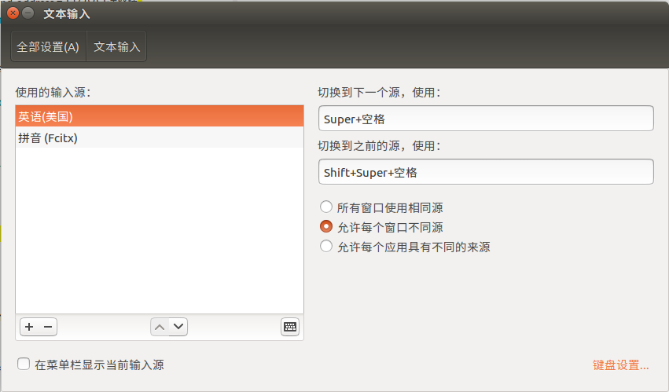  
在fcitx体系中输入法切换可以使用shift  

### 6 Ubuntu16.04 需要卸载的应用  
Ubuntu16.04中绑定很多不必要的应用,需要先卸载掉  
1)卸载libreoffice
`sudo apt-get remove libreoffice-common  `  
2)删除Amazon的链接
`sudo apt-get remove unity-webapps-common `  
3)删掉基本不用的自带软件（用的时候再装也来得及）  
`sudo apt-get remove thunderbird totem rhythmbox empathy brasero simple-scan gnome-mahjongg aisleriot gnome-mines cheese transmission-common gnome-orca webbrowser-app gnome-sudoku  landscape-client-ui-install `  
`sudo apt-get remove onboard deja-dup`  
### 7 Ubuntu16.04 推荐安装的应用 
1)vim  
`sudo apt-get install vim`  
2)安装jdk  
`sudo add-apt-repository ppa:webupd8team/java`    
`sudo apt-get update`    
`sudo apt-get install oracle-java8-installer`  
安装后查看java的版本  
`java -version  `  
3)Sublime Text 3  
`sudo add-apt-repository ppa:webupd8team/sublime-text-3`    
`sudo apt-get update`    
`sudo apt-get install sublime-text`  
4)经典菜单指示器  
`sudo add-apt-repository ppa:diesch/testing`  
`sudo apt-get update`  
`sudo apt-get install classicmenu-indicator`  
5)系统指示器SysPeek  
`sudo add-apt-repository ppa:nilarimogard/webupd8`  
`sudo apt-get update`  
`sudo apt-get install syspeek`  
6)git和vpnc  
`sudo apt-get install vpnc git `  
`sudo apt-get install git-core`  
7)axel  
axel是Linux命令行界面的多线程下载工具，比wget的好处就是可以指定多个线程同时在命令行终端里下载文件  
`sudo apt-get install axel`  
8)openssh-server  
`sudo apt-get install openssh-server `  
9)ExFat文件系统驱动  
Ubuntu默认不支持exFat文件系统的挂载，需要手动安装exfat的支持  
`sudo apt-get install exfat-fuse  `  
10)lnav  
lnav工具是在终端界面看日志的神器  
`sudo apt-get install lnav  `  
11)unrar  
系统默认不带解压缩rar文件的功能，手动安装unrar程序  
`sudo apt-get install unrar `  
装上之后就可以用命令解压缩rar文件了。使用如下命令解压缩文件到当前目录。  
`unrar x test.rar`  

###7 Git使用
由于Ubuntu上没有找到比较适宜的客户端,完全可以使用git命令行完成  
1)设置用户名和邮箱  
设置用户名： sudo git config user.name [username]  
设置用户邮箱：sudo git config user.email [email address]  
查看配置状态   
`sudo git config --list`  
2)创建一个本地repository  
`sudo git init [PJ Name]`  
提交整个工程  
`sudo git add [PJ Name]`  
会递归的将目录下所有文件都提交  
3)提交工程  
`sudo git commit -m "new commit"`  
4)添加远端工程库  
使用下面的命令，将本地的repository提交到GitHub：  
`sudo remote add origin https://github.com/[username]/[PJ Name].git`  
推送文件  
`git push origin master`  
5)前往github首页查看  
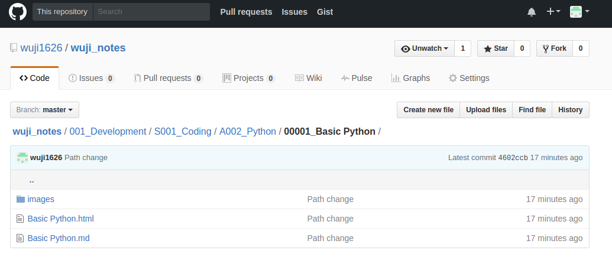  

