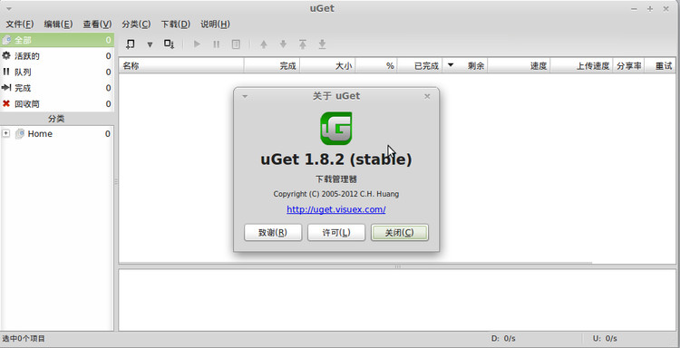
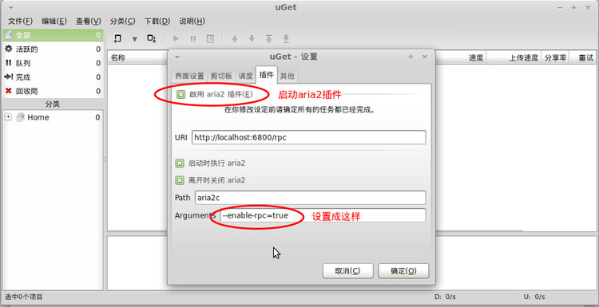
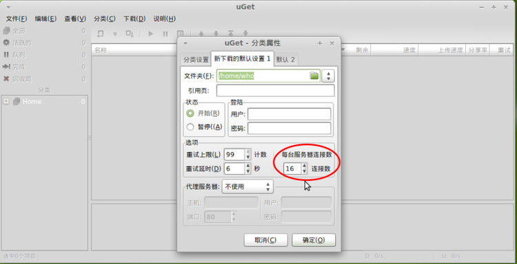
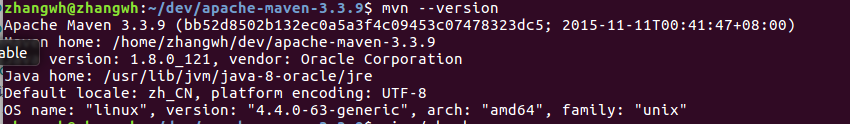
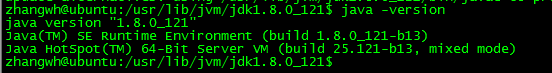
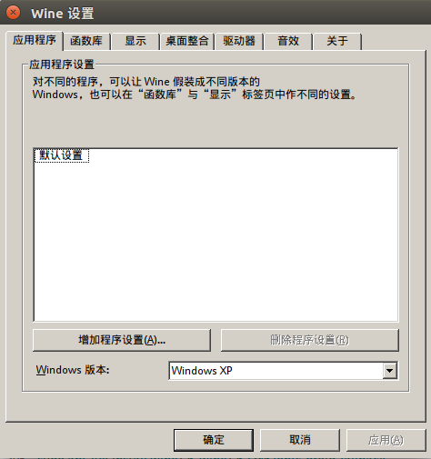

#Ubuntu实操

[TOC]

##Ubuntu 16.04实操
###1 设置网卡
1）查看网卡名称 
Ubuntu 16.04的网卡已不再按照eth0命名网卡，而需要在如下目录进行查询：  
`cd /proc/sys/net/ipv4/conf`   
   
因此该操作系统的网卡为lo和ens33   
2）设置网卡信息  
`sudo vi /etc/network/interfaces`    
原始内容为：   
`auto lo` 
`iface lo inet loopback` 
修改为： 
`auto lo` 
`iface lo inet loopback` 
`auto ens33` 
`iface ens33 inet static` 
`address 192.168.119.132` 
`netmask 255.255.255.0` 
`gateway 192.168.119.128` 
3）设置DNS信息 
`sudo vi /etc/resolv.conf` 
添加DNS服务器地址： 
`nameserver 202.107.117.11`   
`nameserver 202.96.134.133`    
`nameserver 8.8.8.8`  
3）重启网络服务 
`sudo /etc/init.d/networking restart`  
###Ubuntu 16.04网卡设置问题对应
【问题1】在配置好网络之后，当重启之后，会出现网络无法使用的情况，网络图标显示“device not managed”  
【解决方法】  
sudo vi /etc/NetworkManager/NetworkManager.conf  
将“managed=false”修改为“managed=true”重启network manager：  
sudo service network-manager restart  
即可解决问题。
【问题2】在网卡配置好后，当系统重启之后，报出“connection activation failed”。
【问题原因】由于Ubuntu Desktop版中，在/etc/network/interfaces来进行配置以外，还可以使用network-manager进行可视化配置。默认情况下Desktop版Ubuntu会用network-manager接管网络配置。如果在两处同时配置了IP信息，会产生冲突，产生“connection activation failed”。Server版应该没有这个问题。
【解决方法】删除:  
1）停止服务network-manager  
`sudo service network-manager stop`  
2）移除nm 的状态文件  
`sudo rm /var/lib/NetworkManager/NetworkManager.state`  
3）编辑NetManager.conf配置文件  
`sudo vi /etc/NetworkManager/NetworkManager.conf`    
将“managed=false”修改为“managed=true”  
4）重启network-manager 
`sudo service network-manager restart`  
另一种解决方案，就是在Network-Manager中设置IP，而不在/etc/network/interfaces中进行管理  
[问题3]Ubuntu在运行过程中经常出现wifi掉线的问题,在网上寻找到一个解决方案  
[问题解决]在终端输入命令：sudo nano /etc/modprobe.d/blacklist.conf  
打开配置文件，在最后一行加入：blacklist acer-wmi  

###2 防火墙设置
1）永久关闭防火墙 
`ufw disable ` 

###3 配置Telnet
下载openssh-client和openssh-server：  
`sudo apt-get install openssh-client`  
`sudo apt-get install openssh-server`   
FlashFXP配置客户端：   
  
SecureCRT配置客户端：  
  

###4 安装MySQL数据库（联网模式）
1）安装数据库文件，安装时mysql是5.7版   
`sudo apt-get install mysql-server`  
`sudo apt-get install mysql-client`  
`sudo apt-get install libmysqlclient-dev`  
如果中途有问题就执行以下 apt-get update  
2）检验是否安装完成  
`sudo netstat -tap | grep mysql`  
输出结果：  
  
3）设置远程访问  
编辑mysqld.cnf文件，把其中bind-address = 127.0.0.1注释掉  
`sudo vi /etc/mysql/mysql.conf.d/mysqld.cnf`  
4）在本机上访问mysql
`sudo mysql -uroot -proot`  
进入mysql控制台，执行如下命令，任何IP都可以用root用户，密码root访问mysql数据库  
`grant all on *.* to root@'%' identified by 'root' with grant option;`  
5）刷新权限信息  
`flush privileges;`  
6）重启mysql
`sudo /etc/init.d/mysql restart`  
数据库启动：
`sudo /etc/init.d/mysql start`  
数据库停止：
`sudo /etc/init.d/mysql stop`  
7）数据库客户端配置  
  

###5 安装搜狗拼音输入法并设置
在搜狗拼音页面下载搜狗.deb文件并安装  
在[系统设置]中设置[语音支持]  
  
在语音支持中,选择键盘输入法系统选择[fcitx]
  
在[系统设置]中设置[文本输入]  
  
在文本输入中添加中文输入源  
  
在fcitx体系中输入法切换可以使用shift  

### 6 Ubuntu16.04 需要卸载的应用  
Ubuntu16.04中绑定很多不必要的应用,需要先卸载掉  
1)卸载libreoffice
`sudo apt-get remove libreoffice-common  `  
2)删除Amazon的链接
`sudo apt-get remove unity-webapps-common `  
3)删掉基本不用的自带软件（用的时候再装也来得及）  
`sudo apt-get remove thunderbird totem rhythmbox empathy brasero simple-scan gnome-mahjongg aisleriot gnome-mines cheese transmission-common gnome-orca webbrowser-app gnome-sudoku  landscape-client-ui-install `  
`sudo apt-get remove onboard deja-dup`  
### 7 Ubuntu16.04 推荐安装的应用 
1)vim  
`sudo apt-get install vim`  
2)安装jdk  
`sudo add-apt-repository ppa:webupd8team/java`    
`sudo apt-get update`    
`sudo apt-get install oracle-java8-installer`  
安装后查看java的版本  
`java -version  `  
3)Sublime Text 3  
`sudo add-apt-repository ppa:webupd8team/sublime-text-3`    
`sudo apt-get update`    
`sudo apt-get install sublime-text`  
4)经典菜单指示器  
`sudo add-apt-repository ppa:diesch/testing`  
`sudo apt-get update`  
`sudo apt-get install classicmenu-indicator`  
5)系统指示器SysPeek  
`sudo add-apt-repository ppa:nilarimogard/webupd8`  
`sudo apt-get update`  
`sudo apt-get install syspeek`  
6)git和vpnc  
`sudo apt-get install vpnc git `  
`sudo apt-get install git-core`  
7)axel  
axel是Linux命令行界面的多线程下载工具，比wget的好处就是可以指定多个线程同时在命令行终端里下载文件  
`sudo apt-get install axel`  
8)openssh-server  
`sudo apt-get install openssh-server `  
9)ExFat文件系统驱动  
Ubuntu默认不支持exFat文件系统的挂载，需要手动安装exfat的支持  
`sudo apt-get install exfat-fuse  `  
10)lnav  
lnav工具是在终端界面看日志的神器  
`sudo apt-get install lnav  `  
11)unrar  
系统默认不带解压缩rar文件的功能，手动安装unrar程序  
`sudo apt-get install unrar `  
装上之后就可以用命令解压缩rar文件了。使用如下命令解压缩文件到当前目录。  
`unrar x test.rar`  
12）aira2  
Ubuntu环境的下载工具aira2，相当于迅雷，需要与多线程下载工具uget组合使用  
uget下载  
`sudo add-apt-repository ppa:plushuang-tw/uget-stable `  
`sudo apt-get update `  
`sudo apt-get install uget`  
aira2下载  
`sudo add-apt-repository ppa:t-tujikawa/ppa`   
`sudo apt-get update `  
`sudo apt-get install aria2`   
主界面及版本  
  
启用aria2插件  
  
设置下载任务的属性（同时下载几个任务、多少个服务器、保存位置等）  
  
  
13）gnome司令官安装
apt-get install gnome-commander 

###8 Git使用
由于Ubuntu上没有找到比较适宜的客户端,完全可以使用git命令行完成  
1)设置用户名和邮箱  
设置用户名： sudo git config user.name [username]  
设置用户邮箱：sudo git config user.email [email address]  
查看配置状态   
`sudo git config --list`  
2)创建一个本地repository  
`sudo git init [PJ Name]`  
提交整个工程  
`sudo git add [PJ Name]`  
会递归的将目录下所有文件都提交  
3)提交工程  
`sudo git commit -m "new commit"`  
4)添加远端工程库  
使用下面的命令，将本地的repository提交到GitHub：  
`sudo remote add origin https://github.com/[username]/[PJ Name].git`  
推送文件  
`git push origin master`  
5)前往github首页查看  
  
6）获取服务器端最新代码  
`sudo git fetch origin master`  
`sudo git pull origin master`  
###9 开发环境
####9.1 Maven
1）下载maven最新版本  apache-maven-3.3.9-bin.tar.gz  
2）在/dev下解压maven  
tar -xvf apache-maven-3.3.9-bin.tar.gz  
3）设置环境变量  
`vi ~/.bashrc`  
在文件最后追加：  
`\# set maven environment`  
`export M2_HOME=/home/zhangwh/dev/apache-maven-3.3.9`  
`export PATH=$M2_HOME/bin:$PATH`  
使环境变量生效：  
`source ~/.bashrc`  
4）验证maven配置是否成功  
`mvn --version`  
  
####9.2 Python
1）安装Python发布版本及build依赖包  
`sudo apt-get install python2.7 python2.7-dev`  
`sudo apt-get install build-essential libssl-dev libevent-dev libjpeg-dev libxml2-dev libxslt-dev`  
2）安装 pip 和 virtualenv  
pip 是 Python 的包管理工具，建议 Python 的包都用 pip 进行管理。virtualenv是 Python 多版本管理的利器，不同版本的开发调试全靠它了。
`sudo apt-get install python-pip`  

- 安装 python2.7 virtualenv  
`virtualenv --no-site-packages -p /usr/bin/python2.7 ~/.venv/python2.7`  
- 安装 python3.2 virtualenv  
`virtualenv --no-site-packages -p /usr/bin/python3.2 ~/.venv/python3.2`  

####9.3 Subversion
1）安装Subversion客户端  
`sudo apt-get install subversion`  
2）安装带有客户端的repidsvn  
`sudo apt-get install rapidsvn`  

####9.4 JDK
在Sun官网下载最新JDK Linux x64的tar.gz包  
通过SSH上传服务器/tmp目录下  
1）在/usr目录下创建jvm目录  
`sudo mkdir -R /usr/lib/jvm`  
2）将jdk安装文件拷贝到jvm目录下  
`sudo mv /tmp/jdk-8u121-linux-x64.tar.gz /usr/lib/jvm`  
3）解压gz包  
`cd /usr/lib/jvm`  
`sudo tar -zxvf jdk-8u121-linux-x64.tar.gz`  
4）修改环境变量配置  
`sudo vi /etc/profile`  
在文件末尾追加如下代码：  
~~~  
#set java environment  
export JAVA_HOME=/usr/lib/jvm/jdk1.8.0_121  
export JRE_HOME=${JAVA_HOME}/jre  
export CLASSPATH=.:${JAVA_HOME}/lib:${JRE_HOME}/lib  
export PATH=${JAVA_HOME}/bin:$PATH  
~~~  
5）将环境变量配置生效  
`source /etc/profile`
6）配置软连接  
`sudo update-alternatives --install /usr/bin/java java /usr/lib/jvm/jdk1.8.0_121/bin/java 300`   
`sudo update-alternatives --install /usr/bin/javac javac /usr/lib/jvm/jdk1.8.0_121/bin/javac 300`   
配置软连接的目的：软连接相当于windows系统中的快捷键，部分软件可能会从/usr/bin目录下查找Java，因此添加该软连接是以防万一。  
7）测试JDK  
`java -version`  
  

####9.5 MySQL客户端
通过官网上的deb安装mysql-workbench的步骤 
1）wget https://launchpad.net/ubuntu/+archive/primary/+files/libzip1_0.9.3-1_amd64.deb   
2）sudo dpkg -i libzip1_0.9.3-1_amd64.deb/   
3）wget http://launchpadlibrarian.net/94808408/libmysqlclient16_5.1.58-1ubuntu5_amd64.deb   
4）sudo dpkg -i libmysqlclient16_5.1.58-1ubuntu5_amd64.deb   
5）sudo apt-get -f install   
6）sudo apt-get -f install python-paramiko libzip2 libmysqlclient18 mysql-client mysql-common python-pysqlite2 libdbi-perl libdbd-mysql-perl libplrpc-perl libnet-daemon-perl mysql-client   
7）sudo dpkg -i mysql-{common,community-client,client,community-server,server}_*.deb  

###10 使用技巧
####10.1 显示目录中隐藏文件夹  
ubuntu默认会隐藏以[.]开头的文件夹，点击ctrl+h即可显示  
####10.2 解决libzip4依赖问题
http://packages.ubuntu.com/zh-cn/xenial/amd64/libzip4/download中搜索并下载需要下载的依赖包，并用sudo dpkg -i来手工安装  

###11 CAJViewer使用  
CAJViewer是在Windows下运行，在Ubuntu下运行需要利用Wine1.6安装方法如下：
1）执行wine1.6的下载命令
`sudo apt-get install wine1.6  wine1.6-i386 fonts-droid-fallback libgphoto2-6:i386  libxml2:i386 libsane:i386 libtiff5:i386 libxslt1.1:i386 libgd3:i386 libjbig0:i386`  
2）完成wine1.6的配置。实际什么都不需要配置什么，只需指定程序的Windows版本为Windows XP  
  
3）下载绿色版CAJViewer解压，将CAJViewer.exe赋予执行权限  
在cajviewer所在目录下执行执行命令：   
`wine CAJViewer.exe`  
在打开的cajviewer中点击打开，有两个磁盘，C盘，Z盘。C盘相当于是一个虚拟磁盘。而Z盘则是Ubuntu的地址  

