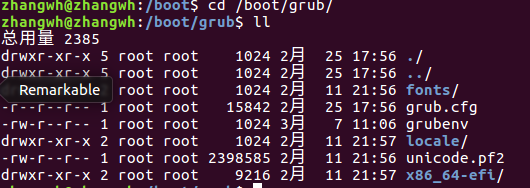
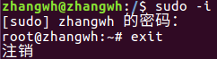

**Ubuntu Linux从入门到精通**  
#Part 01 Ubuntu入门
##Chapter01 Linux与Ubuntu
Ubuntu是Linux分支发行套件  
Unix → Linux → Debian → Ubuntu
###1.1 Unix概述
■Unix（贝尔实验室Ken Thompson & Dennis Richie）与Multics（Multiplexed Information and Computing System）有渊源  
Unics（Uniplexed Information and Computing System）→Unix
■POSIX（Portable Operating System Interface）可移植操作接口：兼容操作系统编写的程序，可以在任何POSIX操作系统上编译执行  
POSIX由IEEE（Institute of Electrical and Electronic Engineering）开发，由ANSI（American National Standards Institute）和ISO（International Standards Organisaion）标准化，是Unix系统基础部分  
■GNU & GPL  
GNU（GNU's Not Unix）  
GPL（General Public License）  
■Linus Torvalds Linux之父  
■Linux的内存模块  

- 进程管理（process management）  
- 定时器（timer）  
- 中断管理（interrupt management）  
- 内存管理（memory management）  
- 模块管理（module management）  
- 虚拟文件系统接口（VFS layer）  
- 文件系统（file system）  
- 设备驱动程序（device driver）  
- 进程间通信（inter-process communication）  
- 网路管理（network management）  
- 系统启动（system init）  

■Linux基本思想：  
①一切都是文件  
②美国软件都有确定的用途同时他们尽可能编写得更好  

■Linux与Unix区别  
Linux是黑客遵循GNU模仿的Unix操作系统。根本差异在于Unix的核心有版权，不可免费使用，Linux内核免费  

■Ubuntu与Debian的渊源  
Ubuntu开发蓝本：Debian  
❀Debian的特点：  
1）自由灵活的升级方式：apt-get/dpkg  通过apt-get进行网络获取软件更新  
2）无与伦比的技术支持  
3）简单便捷的安装过程  
4）软件包高度集成：所有软件都由同一个团体包装，可以在一个站点找到所有的软件，确信开发者解决所有复杂的集成性问题。deb格式超过rpm的优点  
5）源代码：Debian自由软件都符合指导方针（DFSG）。  
6）错误跟踪系统  
7）稳定性及更快、更容易的内存管理  
8）良好的系统安全  
9）缺乏流行商业软件  

■Ubuntu  
1）理念：天下共享的信念，连接起每个人；待人以仁  
2）特色：
	
-  **系统管理**注重安全性，采用sudo对系统相关的命令进行控制
- **发行理念**强调国际化，使用UTF-8统一编码，各个用户都不会看到乱码
- **安装设定**PC几乎都可以安装。可以自由读写FAT32文件系统分区，NTFS只读；可以通过Samba与其他操作系统交换信息和文件  

3）组件  
- main组件：从Ubuntu团队获取的软件包  
- restricted组件：由于重要而被Ubuntu开发者支持的软件。其中包括仅能以二进制形式获取的程序   
- universe（社区维护）组件：受到许可证限制，不被Ubuntu团队支持。用户可以使用Ubuntu的软件包管理系统安装各种程序，同时与main、restricted中被支持的软件包相隔离  
- multiverse（非自由）组件：包括不符合自由软件要求而且不被支持的软件包  
4）默认套件  

- GNOME：桌面环境与附属应用程序  
- GIMP：绘图程序  
- Firefox：浏览器  
- Gaim：即时通信软件  
- Evolution：电子邮件  
- OpenOffice.org：办公软件  
- SCIM输入法平台  
- Synaptic：新立得软件包管理器  
- Totem：多媒体播放器  
- Rhythmbox：音乐播放器  

5）Ubuntu学习路线  
Ubuntu中文官网、Ubuntu官网、Debian中文网站  
##Chaper02 Ubuntu安装与配置
略  

##Chaper03 Ubuntu初体验
###3.1 Grub
Ubuntu通过GRUB加载引导操作系统，既可以是Linux还可以是Windows  
grub信息在/boot/grub目录下  
  
【注】Ubuntu 16.04的配置与Ubuntu 8.04有很大区别，如果后续需要可以深入研究
###3.2 全Shell环境切换
Ubuntu存在6个Shell控制台，可以分别使用Ctrl+Alt+F
1～F6，进行切换。一旦切换到全Shell控制台，可以使用startx命令返回桌面，但是无法显示系统托盘。使用Ctrl+Alt+F7返回

###3.3 常用命令
1）查看目录： ls  
2）创建目录：mkdir  
3）切换目录：cd  
4）复制文件/目录：cp [源文件/目录名] [目标目录/文件名]  
5）删除文件/目录：rm [文件/目录名]  
6）重命名文件/目录：mv [源文件/目录名] [目标目录/文件名]  
7）查找文件/目录：locate [文件或目录名]  

###3.4 root用户与sudo命令
Linux系统的root用户具有系统管理权限。普通用户不具备系统管理权限。sudo为superuser do的简写。  
Ubuntu的默认root账号是停用的，系统相关的指令需要在命令前输入sudo  
sudo工具的默认密码是第一个账号密码，因此安装过程中创建的第一个用户账号具有sudo权限  
启用root终端：  
`sudo -i`  
输入密码后，进入root终端  
`exit`退出终端  
  

###3.5 关机命令
####3.5.1 shutdown
语法：  
shutdown [-cfFhknr (参数名称)] [-t 秒数] [时间] [警告信息]  
参数：  

- -t second：设定在几秒钟后进行关机程序  
- -k：并不真正关机，只发警告给所有用户  
- -f：关机后立即重新启动  
- -h：关机后不重新启动  
- -f [秒数] ：快速关机，重新启动时跳过fsck。发出警告信息和关机信号之间要延迟多少秒。警告信息将提醒用户保存当前进行的工作  
- -F：关机时，强迫进行fsck动作  
- -n：快速关机，不经过init程序  
一般shutdown调用init来失效关机动作，不经过init关机速度快，但不提倡普通用户使用该方式关机  
- -c：取消一个已经运行的shutdown  
如：shutdown -h 11:10 在11点10分关机，这种情况终止关机不需要使用shutdown -c，直接使用Ctrl+C进行终止  
如果使用shutdown -h 11:10&后台运行，则需要使用-c进行取消  
- -h：关机后再执行挂起操作（halt）
- 具体时间，令系统在指定时间关机。时间有两个格式：1）hh：mm；2）+m  
`shutdown -h now`  
`shutdown +5` 在5分钟后关机  
- 警告信息：要传给登录用户的信息  
`shutdown +5 "System will shutdown in 5 minutes"`  

####3.5.2 halt命令
halt命令也用来关闭系统，相当于shutdown -h  
halt命令执行时，先杀死应用进程，执行sync系统调用，文件系统写操作完成后就会停止内核。halt先检测runlevel若返回为0\6，则关闭系统，否则调用shutdown  

