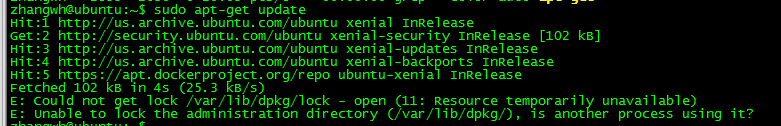

#Ubuntu 常见问题解决
###1 Could not get lock /var/lib/dpkg/lock  
通过终端安装程序sudo apt-get install xxx时出错：  
E: Could not get lock /var/lib/dpkg/lock - open (11: Resource temporarily unavailable)  
E: Unable to lock the administration directory (/var/lib/dpkg/), is another process using it?  
  
【解决】
出现这个问题可能是有另外一个程序正在运行，导致资源被锁不可用。而导致资源被锁的原因可能是上次运行安装或更新时没有正常完成，进而出现此状况，解决的办法其实很简单：  
在终端中敲入以下两句  
sudo rm /var/cache/apt/archives/lock  
sudo rm /var/lib/dpkg/lock  

再试着安装，问题解决。