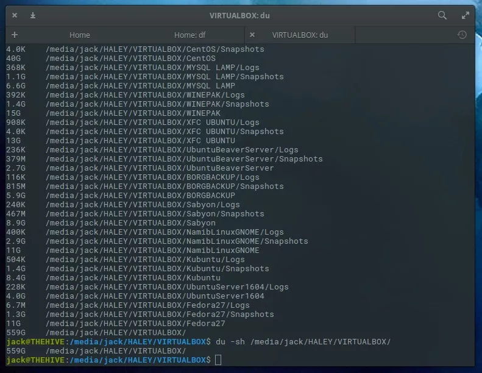

[TOC]

##1 文件操作
###1.1 统计当前文件夹下文件的个数
`ls -l |grep "^-"|wc -l`  
###1.2 统计当前文件夹下目录的个数
`ls -l |grep "^d"|wc -l`  
###1.3 统计当前文件夹下文件的个数，包括子文件夹里的 
`ls -lR|grep "^-"|wc -l`  
###1.4 统计文件夹下目录的个数，包括子文件夹里的  
`ls -lR|grep "^d"|wc -l`  

##2 查看磁盘空间
###2.1 df
`df`命令是最基本的磁盘空间查询工具。它的使用和报告结果非常简单，因此执行此任务的首选命令。此命令有几个选项开关，对于基本的报告，你实际上只需要一个选项。该命令是`df -H`。**-H**选项开关用于将 df 的报告结果以人类可读的格式进行显示。df -H的输出包括：已经使用了的空间量、可用空间、空间使用的百分比，以及每个磁盘连接到系统的挂载点，如图1。  
  
图 1：Elementary OS 系统上 df -H 命令的输出结果

如果你的驱动器列表非常长并且只想查看单个驱动器上使用的空间，该怎么办？对于 df 这没问题。我们来看一下位于 /dev/sda1 的主驱动器已经使用了多少空间。为此，执行如下命令：
`df -H /dev/sda1`
输出将限于该驱动器（图 2）。
  
图 2：一个单独驱动器空间情况

你还可以限制` df `命令结果报告中显示指定的字段。可用的字段包括：
- source — 文件系统的来源（LCTT译注：通常为一个设备，如 /dev/sda1 ）
- size — 块总数
- used — 驱动器已使用的空间
- avail — 可以使用的剩余空间
- pcent — 驱动器已经使用的空间占驱动器总空间的百分比
- target —驱动器的挂载点

让我们显示所有驱动器的输出，仅显示 size ，used ，avail 字段。对此的命令是：
`df -H --output=size,used,avail`
该命令的输出非常简单（ 图 3 ）。
  
图 3：显示我们驱动器的指定输出

这里唯一需要注意的是我们不知道该输出的来源，因此，我们要把 source 加入命令中：  
`df -H --output=source,size,used,avail`  
  
图 4：我们现在知道了磁盘使用情况的来源

###2.2 du
du：disk usage。du 命令与 df 命令完全不同，因为它报告目录而不是驱动器的空间使用情况。 因此，您需要知道要检查的目录的名称。 假设我的计算机上有一个包含虚拟机文件的目录。 那个目录是 /media/jack/HALEY/VIRTUALBOX 。 如果我想知道该特定目录使用了多少空间，我将运行如下命令：  
`du -h /media/jack/HALEY/VIRTUALBOX`
上面命令的输出将显示目录中每个文件占用的空间（图 5）。
  
图 5 在特定目录上运行 du 命令的输出

到目前为止，这个命令并没有那么有用。如果我们想知道特定目录的总使用量怎么办？幸运的是，du 可以处理这项任务。对于同一目录，命令将是：  
`du -sh /media/jack/HALEY/VIRTUALBOX/`  
现在我们知道了上述目录使用存储空间的总和（图 6）。  
  
图 6：我的虚拟机文件使用存储空间的总和是 559GB

您还可以使用此命令查看父项的所有子目录使用了多少空间，如下所示：
`du -h /media/jack/HALEY  `
此命令的输出见（图 7），是一个用于查看各子目录占用的驱动器空间的好方法。
  
图 7：子目录的存储空间使用情况  

du 命令也是一个很好的工具，用于查看使用系统磁盘空间最多的目录列表。执行此任务的方法是将 du 命令的输出通过管道传递给另外两个命令：sort 和 head 。下面的命令用于找出驱动器上占用存储空间最大的前 10 个目录：  
`du -a /media/jack | sort -n -r |head -n 10`  
输出将以从大到小的顺序列出这些目录（图 8）。  
  
图 8：使用驱动器空间最多的 10 个目录  

使用 df 命令，您可以快速查看磁盘上总的空间使用量，使用 du 命令，可以查看特定目录的空间使用情况

