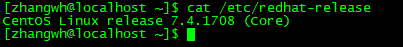
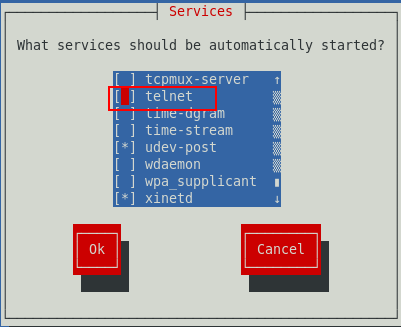
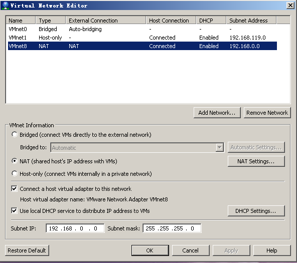
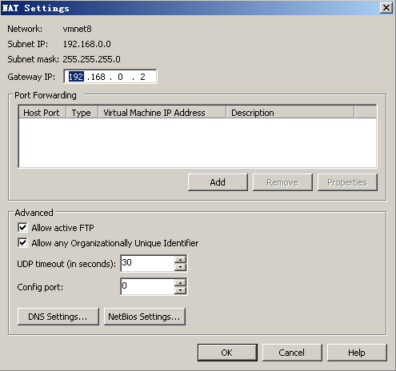
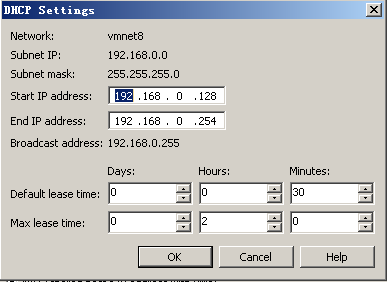

#CentOS实操
[TOC]
##CentOS通用
###1 查看操作系统版本
cat /etc/redhat-release
  

##CentOS6.5
###1 安装Telnet
1）首先判断是否已经有telnet服务
    `rpm –qa |grep telnet`
2）在安装光盘中，Package目录下
- 在安装telnet服务之前需要安装 xinetd，输入root密码后即可安装成功
- 在光盘中安装telnet-server和telnet软件

3）以root身份登录，修改配置文件
`vi /etc/xinetd.d/telnet` 中  
~~~
        service telnet
        {
            ...
            disable        = yes
        }
~~~
将disable设为no
`vi /etc/pam.d/remote`  
将auth required pam_securetty.so行注释掉  
- 配置防火墙端口
  查看防火墙状态 /etc/init.d/iptables status 
  可以直接关闭防火墙 /etc/init.d/iptables stop
- 重启telnet服务
`service xinetd restart`  
- 开启23端口：
`vi /etc/sysconfig/iptables`  
在COMMIT之前添加：  
`-A INPUT -p tcp --dport 23 -j ACCEPT`
然后保存或者执行：  
`/sbin/iptables -I INPUT -p tcp --dport 22 -j ACCEPT`  
`/etc/rc.d/init.d/iptables save`  
重启防火墙  

4）telnet服务  
- 在CentOS光盘中的Package中选择进行安装：
  telnet-0.17-47.el6.x86_64.rpm  
  telnet-server-0.17-47.el6.x86_64.rpm  
- 以root权限执行`ntsysv`命令，在弹出窗口中直接勾选telnet  
  
- 激活telnet服务，只需重启xinetd服务
`service xinetd restart`  

在安装telnet时，rpm -ivh telnet-server-0.17-35.i386.rpm
warning: telnet-server-0.17-35.i386.rpm: Header V3 DSA signature: NOKEY,4f2a6fd2
error: Failed dependencies:
           xinetd is needed by telnet-server-0.17-35.i386
解决方法：
1. 先安装xinetd包
rpm -ivh xinetd-2.3.14-10.el5.x86_64.rpm
此rpm包在光盘介质中可以找到。

2. 再安装telnet包
rpm -ivh telnet-server-0.17-35.i386.rpm

3. 启动xinetd服务
service xinetd start
总之，需要先安装xinetd包即可。

4. 现在可以安装我们需要的rpm包了
rpm -ivh telnet-server-0.17-35.i386.rpm  

###2 FTP服务
1. yum install vsftpd
2. 重启vsftpd： 
`service vsftpd restart`
3. 添加用户
■修改vi /etc/vsftpd/vsftpd.conf
~~~
#chroot_list_enable=YES
# (default follows)
#chroot_list_file=/etc/vsftpd/chroot_list
~~~
改为：
~~~
chroot_list_enable=YES
# (default follows)
chroot_list_file=/tmp/ftpuser
~~~
■增加用户ftpuser，指向目录/tmp/ftpuser,禁止登录SSH权限。  
`useradd -d /tmp/ftpuser -g ftp -s /sbin/nologin ftpuser`  
■修改ftpuser密码  
`passwd ftpuser`
·输入新密码：zwh587587
■编辑文件chroot_list: 
`vi /etc/vsftpd/chroot_list`    内容为ftp用户名,每个用户占一行
■重新启动vsftpd  service vsftpd restart
【问题解决】[右] PASS (hidden)  [右] 500 OOPS: cannot change directory:/tmp/ftpuser  

a）首先通过getsebool -a | grep ftp 查看ftp的配置：
~~~
allow_ftpd_anon_write --> off
allow_ftpd_full_access --> off
allow_ftpd_use_cifs --> off
allow_ftpd_use_nfs --> off
ftp_home_dir --> off
ftpd_connect_db --> off
httpd_enable_ftp_server --> off
tftp_anon_write --> off
[root@bogon tmp]# setsebool -P ftp_home_dir on
[root@bogon tmp]# getsebool -a | grep ftp
allow_ftpd_anon_write --> off
allow_ftpd_full_access --> off
allow_ftpd_use_cifs --> off
allow_ftpd_use_nfs --> off
ftp_home_dir --> on
ftpd_connect_db --> off
httpd_enable_ftp_server --> off
tftp_anon_write --> off
~~~
b）其中ftp_home_dir --> off
   通过命令setsebool -P ftp_home_dir on，将ftp_home_dir设置为on
~~~
[root@bogon tmp]# getsebool -a | grep ftp
allow_ftpd_anon_write --> off
allow_ftpd_full_access --> off
allow_ftpd_use_cifs --> off
allow_ftpd_use_nfs --> off
ftp_home_dir --> on
ftpd_connect_db --> off
httpd_enable_ftp_server --> off
tftp_anon_write --> off
~~~
c）再通过ftp客户端即可访问

###3 安装JDK
1）下载
`http://www.oracle.com/technetwork/cn/java/javase/downloads/jdk7-downloads-1880260-zhs.html`
2）解压并拷贝至/opt目录下
`tar -zxvf jdk-7u15-linux-x64.tar.gz`
`mv jdk1.7.0_15/ /opt`
3）修改环境变量：
`vi /etc/profile `
·在文件最后追加：
~~~
JAVA_HOME=/opt/jdk1.7.0_15
     PATH=$JAVA_HOME/bin:$PATH
     CLASSPATH=.:$JAVA_HOME/lib/dt.jar:$JAVA_HOME/lib/tools.jar
     export JAVA_HOME
     export PATH
     export CLASSPATH
~~~
4）检验jdk是否配置成功：
`java -version`
~~~
java version "1.7.0_15"
Java(TM) SE Runtime Environment (build 1.7.0_15-b03)
Java HotSpot(TM) 64-Bit Server VM (build 23.7-b01, mixed mode)
~~~
5）令profile生效：`source /etc/profile`  

###4 设置固定IP
编辑网卡：
vi /etc/sysconfig/network-scripts/ifcfg-eth0

DEVICE="eth0"
BOOTPROTO="static"
IPADDR=192.168.0.141
NETMASK=255.255.255.0
NETWORK=192.168.0.0
GATEWAY=192.168.0.2
HWADDR="00:0C:29:03:4A:E1"
IPV6INIT="no"
ONBOOT="yes"
TYPE="Ethernet"

重启网卡服务：
service network restart

重启网卡报错：Error: Connection activation failed: Device not managed by NetworkManager
1 chkconfig NetworkManager off
2 chkconfig network on
3 service NetworkManager stop
4 service network start
~~~
DEVICE="eth0"
BOOTPROTO=none
IPADDR=192.168.119.133
NETMASK=255.255.255.0
NETWORK=192.168.119.0
GATEWAY=192.168.119.2
IPV6INIT="no"
ONBOOT="yes"
TYPE="Ethernet"
PREFIX=24
DEFROUTE=yes
IPV4_FAILURE_FATAL=yes
NAME="System eth0"
UUID=5fb06bd0-0bb0-7ffb-45f1-d6edd65f3e03
HWADDR=00:0C:29:9A:85:19
LAST_CONNECT=1440245280
~~~

`ps aux |grep NetworkManager`
root 3193 0.0 0.0 103236 844 pts/0 S+ 18:26 0:00 grep NetworkManager
说明NetworkManager未启动，使用service NetworkManager start启动
  
  
  
  
~~~
DEVICE="eth0"
BOOTPROTO=none
IPADDR=192.168.119.141
NETMASK=255.255.255.0
NETWORK=192.168.119.0
GATEWAY=192.168.119.2
IPV6INIT="no"
ONBOOT="yes"
TYPE="Ethernet"
UUID="73be4e85-3306-43b6-bc7d-2e8418894a35"
HWADDR=00:0C:29:5E:9E:44
PREFIX=24
DNS1=192.168.119.2
DEFROUTE=yes
IPV4_FAILURE_FATAL=yes
NAME="System eth0"
LAST_CONNECT=1393937935
~~~

设置yum.conf中的代理
~~~
timout=120
proxy=http://192.168.1.130:8080
proxy_username=jincy
proxy_password=
~~~

`service iptables stop`
`chkconfig iptables off`
关闭selinux
`/etc/selinux/config：SELINUX=disabled`
`setenforce 0`
`visudo`
`hadoop ALL=(ALL) NOPASSWD: ALL`

##CentOS7.0
###1 安装SSH
1）安装 telnet 避免 ssh 无法登录  
`yum -y install xinetd telnet telnet-server`  
2）允许 root 账号登陆
`vi /etc/securetty`  
末尾添加
`pts/0`  
`pts/1`  
3）关闭firewalld
`systemctl disable firewalld`  
`systemctl stop firewalld`  
4）关闭iptables
如果安装iptables可以将iptables关闭  
`systemctl disable iptables`  
5）注册并启动相关服务：
`systemctl enable telnet.socket`  
`systemctl start telnet.socket`  
`systemctl enable xinetd`  
`systemctl start xinetd`  
开启telnet、xinetd服务后，即可通过ssh客户端访问服务器  

###2 安装iptables
CentOS7.0操作系统默认的防火墙为firewalld，如果想使用iptables，需要手动安装，并且关闭firewalld  
关闭firewalld：  
`systemctl disable firewalld`  
`systemctl stop firewalld`  
手动安装iptables：
`yum install iptables-services`  
注册iptables服务：  
`systemctl enable iptables`  
启停iptables服务：  
`systemctl stop iptables`  
`systemctl start iptables`  
`systemctl restart iptables`  
`systemctl reload iptables`  

###3 安装MySQL
1. 添加MySQL的yum源
`yum localinstall http://dev.mysql.com/get/mysql57-community-release-el7-7.noarch.rpm`  
2. 安装MySQL5.7
之后就开始安装MySQL服务器:  
`yum install mysql-community-server -y`  
3. 数据库配置
完成安装步骤之后，首先配置MySQL的开机自动启动，在这里使用systemctl命令。
`systemctl enable mysqld.service`  
启动mysql服务命令为：  
`systemctl start  mysqld.service`  
停止mysql服务命令为：    
`systemctl stop mysqld.service`  
4. 修改MySQL默认密码  
修改 /etc/my.cnf，在 [mysqld] 小节下添加一行：skip-grant-tables=1  
`vi /etc/my.cnf`  
重启 mysqld 服务：systemctl restart mysqld  
使用 root 用户登录到 mysql：mysql -u root   
切换到mysql数据库，更新 user 表：`use mysql`  
执行如下命令：  
update user set authentication_string = password('root'), password_expired = 'N', password_last_changed = now() where user = 'root';  
在之前的版本中，密码字段的字段名是 password，5.7版本改为了 authentication_string  
退出 mysql，编辑 /etc/my.cnf 文件，删除 skip-grant-tables=1 的内容  
重启 mysqld 服务，再用新密码登录即可  
5. 开启MySQL远程访问权限  
在本机登录mysql切换到mysql数据库  
执行SQL：`update user set host = '%' where user = 'root'`;  
FLUSH PRIVILEGES; 回车使刚才的修改生效，再次远程连接数据库成功  

 
