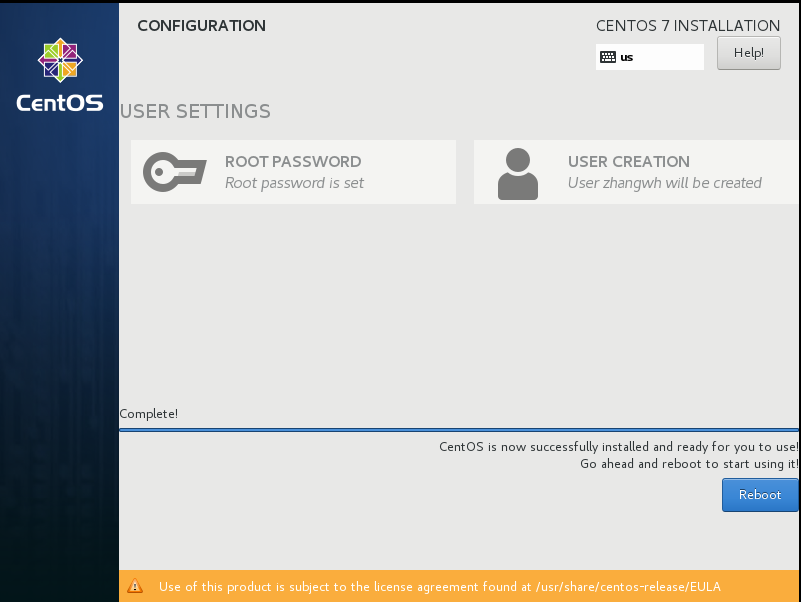
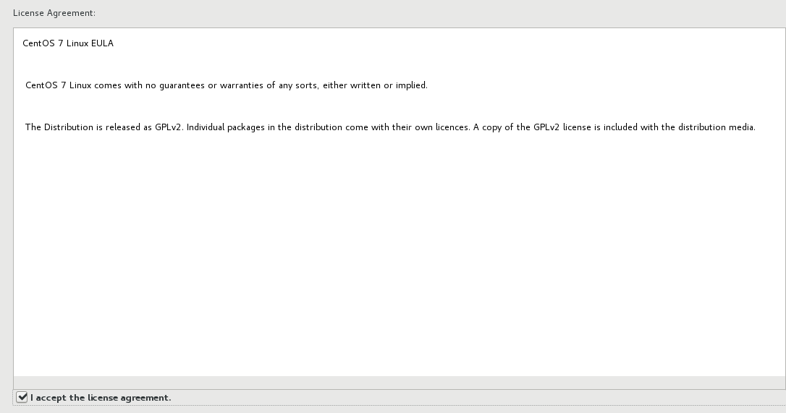

#CentOS 7 安装
CentOS 7在安装上存在一些不同，需要特别介绍
1. 选择语言
  
2. 选择时区
  
选择中国的东八区  
  
3. 选择需要安装的软件
  
默认情况下，CentOS7采用最小安装（Minimal Install），一般需要选择安装GUI的模式。另外，需要安装基本的开发工具
  
4. 安装目标选择
如果不指定安装的目的地（Installation Destination），安装将不能继续，需要进行选择
  
选择为虚拟机分配的磁盘  
  
5. 选择安装目的地后开始进行安装
  
6. 指定root用户密码
  
  
7. 创建非root用户
虽然非root用户并非必须，建议创建非root用户  
  
填写用户名及密码  
  
8. 开始安装
  
9. 完成安装后，重启
  
10. 重启系统后，需要进行一些设置
首先，确认License协议
  
确认
  
其次需要设置网络  
  
  
在弹出的对话框中配置网络地址
  
配置后，点击【Finish Configuration】
