[TOC]

##1 V$ACTIVE_SESSION_HISTORY
Oracle 11g相对10g增加了一些可用列：  
1）标示这条ASH记录是否被刷入了磁盘  
IS_AWR_SAMPLE：dba_hist_active_sess_history中就没有这一列  

2）SQL语句信息  
SQL_OPNAME：SQL_OPCODE的翻译名，SQL语句类型  

3）对于递归SQL，捕获其父SQL的信息  
&nbsp;&nbsp;&nbsp;&nbsp;TOP_LEVEL_SQL_ID      
&nbsp;&nbsp;&nbsp;&nbsp;TOP_LEVEL_SQL_OPCODE  
  
可以通过这个列，找到存过中最消耗资源的SQL，或者DDL递归调用中，最慢得SQL语句
`SELECT sql_id,count(*) FROM v$active_session_history` 
`WHERE TOP_LEVEL_SQL_ID='5w6mc35fa18tk'`  
`GROUP BY sql_id`  
`ORDER BY 2 DESC;`    
	
4）在ASH中捕获执行计划信息，包括这个语句正在执行哪一步操作  
　SQL_PLAN_LINE_ID                                   
　SQL_PLAN_OPERATION                               
　SQL_PLAN_OPTIONS     
 
可以通过这些列，找到SQL语句最慢得地方，就需要优化这个  

~~~sql  
    SELECT A.SQL_PLAN_HASH_VALUE,
           A.SQL_PLAN_LINE_ID,
           A.SQL_PLAN_OPERATION,
           A.SQL_PLAN_OPTIONS,
           B.OWNER || '.' || B.OBJECT_NAME OBJECT_NAME,
           COUNT(*)
      FROM V$ACTIVE_SESSION_HISTORY A, DBA_OBJECTS B
     WHERE A.SQL_ID = '11jpuymjh9vsc'
       AND A.CURRENT_OBJ# = B.OBJECT_ID(+)
     GROUP BY A.SQL_PLAN_HASH_VALUE,
          A.SQL_PLAN_LINE_ID,
          A.SQL_PLAN_OPERATION,
          A.SQL_PLAN_OPTIONS,
          B.OWNER || '.' || B.OBJECT_NAME
     ORDER BY COUNT(*) DESC;  ====
~~~  
5）SQL一次执行的唯一标示符，  SQL_ID, SQL_EXEC_START, SQL_EXEC_ID 三列来标示一次SQL的执行  
可以找到这次SQL的开始执行时间，以及计算出其这次已经执行了多少时间  
　SQL_EXEC_ID                                        
　SQL_EXEC_START
判断一下一个SQL，有没有出现执行的很慢的时候，比如平时1s，有段时间，执行超过12s  
~~~sql  
	SELECT SQL_ID, SQL_EXEC_START, SQL_EXEC_ID, COUNT(*)
      FROM V$ACTIVE_SESSION_HISTORY A
     WHERE A.SQL_ID = '11jpuymjh9vsc'
     GROUP BY SQL_ID, SQL_EXEC_START, SQL_EXEC_ID
     ORDER BY COUNT(*) DESC  
~~~  

6）并行增强，增加了QC_SESSION_SERIAL# 列，并且增加了PX_FLAGS状态列  
　QC_SESSION_SERIAL#                                 
　PX_FLAGS  
QC_SESSION_ID <> SESSION_ID 的，都是并行子进程。增加了QC_SESSION_SERIAL#可以定义到唯一的一个协调者  

7）Blocking增强，11g通过Blocking解决问题已经很容易了  
BLOCKING_INST_ID：11g新增，怪的很，10g的v$session有该列，但是ASH没有  
  BLOCKING_HANGCHAIN_INFO：指出BLOCKING_SESSION是否在hang chain上  
  REMOTE_INSTANCE#：用于集群等待，标明需要请求的数据块应该由那个实例提供。只有cluster类等待才有这个  
  
8）8.当前处理的对象，新增了一个row# ,以前已经有CURRENT_OBJ#，CURRENT_FILE#，CURRENT_BLOCK#了  
CURRENT_ROW#  
可以检查TX等待柱塞的行，通过拼装ROWID可以找到柱塞的行。  
~~~sql  
 SELECT A.SQL_ID,
           A.CURRENT_OBJ#,
           A.CURRENT_FILE#,
           A.CURRENT_BLOCK#,
           A.CURRENT_ROW#,
           COUNT(*)
      FROM dba_hist_active_sess_history A
     WHERE A.EVENT = 'enq: TX - row lock contention'
     GROUP BY A.SQL_ID,
          A.CURRENT_OBJ#,
          A.CURRENT_FILE#,
          A.CURRENT_BLOCK#,
          A.CURRENT_ROW#
     ORDER BY COUNT(*) DESC
~~~
9）CONSUMER_GROUP  
CONSUMER_GROUP_ID，DBA_RSRC_CONSUMER_GROUPS对应  

10）Time Mobel  
TIME_MODEL：后面的IN,按照二进制组合起来的值，在这次采样间隔内，会话做了那些操作  
   IN_CONNECTION_MGMT：connection management call elapsed time  
   IN_PARSE：parse time elapsed  
   IN_HARD_PARSE：hard parse elapsed time  
   IN_SQL_EXECUTION：sql execute elapsed time  
   IN_PLSQL_EXECUTION：PL/SQL execution elapsed time  
   IN_PLSQL_RPC：inbound PL/SQL rpc elapsed time  
   IN_PLSQL_COMPILATION：PL/SQL compilation elapsed time  
   IN_JAVA_EXECUTION：Java execution elapsed time  
   IN_BIND：repeated bind elapsed time  
   IN_CURSOR_CLOSE        
   IN_SEQUENCE_LOAD：sequence load elapsed time  
当AWR中显示某个TM存在问题时，通过这些列，找到TOP 进程或者SQL存在硬解析的SQL，结果应该和v$sql去比较下  
~~~sql  
 SELECT SQL_PLAN_HASH_VALUE, COUNT(*)
          FROM V$ACTIVE_SESSION_HISTORY
         WHERE IN_HARD_PARSE = 'Y'
         GROUP BY SQL_PLAN_HASH_VALUE
         ORDER BY 2 DESC
~~~  
11）REPLAY特性的会话标示  
REPLAY_OVERHEAD        
   IS_REPLAYED            
   DBREPLAY_FILE_ID       
   DBREPLAY_CALL_COUNTER  

12）时间统计  
TM_DELTA_TIME：一次统计间隔  
   TM_DELTA_CPU_TIME：在这个间隔内，CPU时间  
   TM_DELTA_DB_TIME：在这个间隔内，DB时间  
 因为ASH采样的粒度是1秒，但是进程并不是在1s内都ACTIVE的。该统计的粒度是微秒(百万分之一秒)  
   TM_DELTA_TIME - TM_DELTA_DB_TIME = INACTIVE TIME  
   TM_DELTA_DB_ TIME - TM_DELTA_CPU_TIME = WAIT TIME  
   
13）IO网络统计  
 DELTA_TIME                           
   DELTA_READ_IO_REQUESTS               
   DELTA_WRITE_IO_REQUESTS              
   DELTA_READ_IO_BYTES                  
   DELTA_WRITE_IO_BYTES                 
   DELTA_INTERCONNECT_IO_BYTES  
统计时间内，物理读/写/心跳流量高的SQL  
~~~sql  
     SELECT SQL_ID,
               SUM(DELTA_READ_IO_REQUESTS),
               SUM(DELTA_WRITE_IO_REQUESTS),
               SUM(DELTA_READ_IO_BYTES),
               SUM(DELTA_WRITE_IO_BYTES),
               SUM(DELTA_INTERCONNECT_IO_BYTES)
          FROM V$ACTIVE_SESSION_HISTORY
         GROUP BY SQL_ID
         ORDER BY 2 DESC
~~~  

14）PGA/TMP当前使用统计   
　PGA_ALLOCATED        
　TEMP_SPACE_ALLOCATED 
~~~sql  
select * from (
   select sample_time,session_id,sql_id,PGA_ALLOCATED,TEMP_SPACE_ALLOCATED from v$active_session_history 
   where TEMP_SPACE_ALLOCATED is not null
    order by TEMP_SPACE_ALLOCATED desc
   ) where rownum<=20 
~~~  

15）其他  
IS_SQLID_CURRENT：指出该SQL_ID是否是正在执行的，该列具体意义不明
   TOP_LEVEL_CALL#                               
   TOP_LEVEL_CALL_NAME：v$toplevelcall中有对应，具体怎么用不明  
##2 Oracle原理
###2.1 简介
前一段时间去听了一个Oracle 10g课程，这个课程主要是面向ＤＢＡ的管理课程。由于本人的工作方向是面向开发的，数据库管理方面的知识基本是一点儿都没有，所以这个课听的比较郁闷。现在准备趁着自己还没忘了的时候，先把学到的东西整理一下，和大家分享一下我的学习成果。  
既然是讲Oracle 10g咱们就从这"g"说起。它代表的意义就是网格(Grid)。  
Oracle 的网格技术带来的好处：低的成本，高质量的服务，方便的管理。  
Oracle的网格计算技术包括：  
■Automatic Storage Management (ASM)

- Real Application Clusters (RAC)
- Oracle Streams
- Enterprise Manager Grid Control

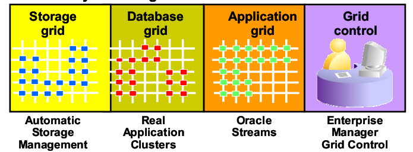  

ASM全称为Automated Storage Management，即自动存储管理，它是Oracle提供的一个卷管理器，用于替代操作系统所提供的LVM，它不仅支持单实例配置，也支持RAC这样的多实例配置。将给Oracle数据库管理员带来极大的方便，ASM可以自动管理磁盘组，并提供数据冗余和优化。特别是对于企业级的大型数据库管理员来说，可以使管理员可以从管理成百上千个数据文件这些琐碎的日常事务中解脱开来，以便处理其它更为重要的事务上去。一个磁盘组是ASM管理的一个逻辑单元，由一组磁盘设备组成。我们可以定义一个磁盘组作为数据库的默认磁盘组，Oracle会自动管理存储，包括创建、删除数据文件等。Oracle会自动将这些文件与一个合适的数据库对象做关联，这样我们在管理这些对象时只需要提供对象的名称，而无需像以前那样提供详细的文件名。ASM允许你在一组独立的磁盘上创建一个单独的磁盘组。这样就实现了单个磁盘组的I/O均衡。同时ASM还实现了条带化(Striping)和磁盘镜像(Mirroring)以提高I/O的性能和数据可靠性。与RAID或LVM不同的是，ASM是在文件级实现的条带化和镜像，这样的实现方式给用户带了很大选择自由度，我们可以在同一个磁盘组中对不同的文件配置不同的存储属性，实现不同的存储方式。  

RAC全称为Real Application Cluster，即真正应用集群，它是Oracle数据库支持网格计算环境的核心技术。它的出现解决了传统数 据库应用中面临的一个重要问题：高性能、高可伸缩性与低价格之间的矛盾。RAC中所有服务器都可以直接访问数据库中的所有数据，其他的数据库在开放系统中都做不到这点， 正是由于这个原因，您可以非常方便地根据需求随时增加服务器来扩充您的系统，无需重新分布数据和应用。Real Application Clusters象一个单一的系统一样工作，任何节点的故障都不会影响其他节点对数据的访问。所以说增加服务器就增加了系统的可靠性。另外一点，对用户来说RAC是一个数据库系统，对它的维护管理如同单机一样简单方便。  

Oracle Streams是一个信息共享的简单解决方案。它提供如下功能：复制，消息队列，数据仓库的装载和简单的 ETL，数据库迁移，应用升级，事件管理和通告  

Enterprise Manager Grid Control是一种集成管理解决方案，用于管理包括主机、数据库、接收器、应用程序服务器、HTTP 服务器和 Web 应用程序作为一个结合单元的完整企业 Oracle 环境。  
###2.2 Oracle数据库的结构

###2.3 Oracle的内存结构
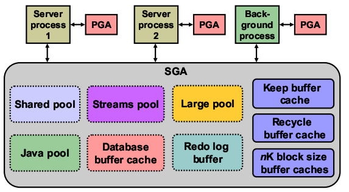  
一个Oracle实例包括的基本内存结构如下：

System Global Area (SGA): 是用于存储数据库信息的内存区，该信息为数据库进程所共享。它包含Oracle 服务器的数据和控制信息, 它是在Oracle 服务器所驻留的计算机的实际内存中得以分配，如果实际内存不够再往虚拟内存中写。在实例启动的时候内存会自动分配，当实例shutdown的时候操作系统会将内存回收的。每一个实例（instance）拥有自己的SGA。  

Program Global Area (PGA): 包含单个服务器进程或单个后台进程的数据和控制信息，与几个进程共享的SGA 正相反PGA 是只被一个进程使用的区域，PGA 在创建进程时分配在终止进程时回收。  

SGA是一个共享的内存区域，包括数据和控制信息，包括以下的内容：  
Database buffer cache:是SGA中的一部分，它存储的是从数据文件中读取的数据块的拷贝，所有的数据库连接都会共享访问这个区域。Database buffer cache 和sql的共享区分在不同的逻辑segment集中（database buffer cache 和 shared pool 是不同的两个内存区域），这样可以降低他们之间的争用情况。  

Redo log buffer:该buffer是循环的一块空间在SGA中，它存储了一些关于数据库的一些改变。这些信息就存储在redo entries，包含在执行INSERT, UPDATE, DELETE, CREATE, ALTER, or DROP 操作时的重构或重做的信息，在恢复的时候，redo entries也许是有必要的。  

Shared pool:这一块区域里面三个主要的部分：library cache,dictionary cache,存储并行执行的信息的buffer，还有一些控制信息。  

Large pool:是一种类似共享池的SGA缓冲池，和共享池不同的是，只有少量类型的对象可以再Large Pool中创建。Large Pool的空间不在共享池中分配，是在数据库启动的时候另外分配的。  

Java pool:所有的Java Virtual Machine(JVM)中的Java程序和数据。  

Streams pool:流池(或者如果没有配置流池，则是共享池中至多10%的空间)会用于缓存流进程在数据库间移动/复制数据时使用的队列消息。这里并不是使用持久的基于磁盘的队列(这些队列有一些附加的开销)，流使用的是内存中的队列。如果这些队列满了，最终还是会写出到磁盘。如果使用内存队列的oracle实例由于某种原因失败了，比如说因为实例错误(软件瘫痪)、掉电或其他原因，就会从重做日志重建这些内存中的队列。  

- Keep buffer cache:拥有的数据保存在缓存中尽可能长的时间
- Recycle buffer cache:数据生命周期短的缓存
- nK block size buffer caches:缓存和数据默认块大小不同的数据块;

###2.4 Buffer Cache
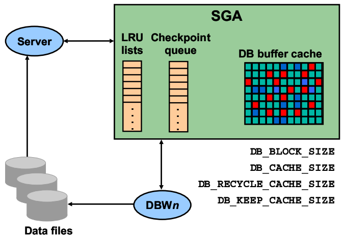  
buffer cache是SGA的一部分，所有的用户都能共享里面的信息。当一个server process访问数据的时候，首先是在buffer cache中查找，如果数据在buffer中存在，我们还需要根据data buffer的状态，来判断是否进行DB Block Gets还是Consistent Gets，如果数据在buffer中不存在，则我们需要在buffer cache中寻找足够的空间来加载我们所需要的数据，如果在buffer cache中我们找不到足够的空间，那么我们就需要触发DBWn进程，去写出脏数据，用来释放我们的buffer空间。  

Oracle通过几个list来对buffer进行管理。其中最为突出的就是LRU List还有Checkpoint queue，这些list上面存放的就是具体指向buffer的指针。  

LRU List主要就是用来维护内存中的buffer，当数据库初始化的时候，所有的buffer都放入LRU List上进行管理。当我们从数据文件中读取数据的时候我们现在要在LRU List上面寻找free的buffer，然后将数据读取到我们所找到的这个free buffer中。只要数据被修改了，那么这个buffer的状态就变为了dirty，那么Oracle就会把这个buffer从LRU List移到Checkpoint Queue中去。在Checkpoint Queue上的buffer都是一些候选的稍后会被DBWn写出到数据文件的buffer，那么这里还有一点需要注意的是:一个buffer要么存在于LRU List上面，要么存在于Checkpoint Queue上面，不可能同时存在于两个List上面。  

我们可以通过编辑参数DB_CACHE_SIZE和对buffer Cache进行配置。DB_CACHE_SIZE初始化参数取代了DB_BLOCK_BUFFERS 初始化参数，DB_BLOCK_BUFFERS使用于早期的版本中。DB_CACHE_SIZE 参数以字节单位指定标准块大小的缓冲区高速缓存的大小。  

为了兼容早期版本的数据库， DB_BLOCK_BUFFERS 参数仍然可以使用，但是它保留一个静态的参数，并且不能与其他动态大小调整的参数组合使用DB_nK_CACHE_SIZE 初始化参数  
&nbsp;&nbsp;&nbsp;&nbsp;非标准块的缓冲区块大小和数量由如下的初始化参数指定:  

- DB_2K_CACHE_SIZE
- DB_4K_CACHE_SIZE
- DB_8K_CACHE_SIZE
- DB_16K_CACHE_SIZE
- DB_32K_CACHE_SIZE

每个参数给相应的块大小指定缓冲区高速缓存的大小，例如:  

- DB_BLOCK_SIZE=4096
- DB_CACHE_SIZE=12M
- DB_2K_CACHE_SIZE=8M
- DB_8K_CACHE_SIZE=4M

在这个例子中，指定标准数据库块大小的参数值是4K。标准块大小的缓冲区高速缓存的大小为12M。另外，2K和8K的高速缓存大小分别配置为8M和4M。  
注意:  
不能使用DB_nK_CACHE_SIZE参数来调整标准块的大小。例如，如果DB_BLOCK_SIZE设置为2K，设置DB_2K_CACHE_SIZE。等于2K是无效的。标准缓存的块大小总是由DB_CACHE_SIZE决定的。  

在Buffer Cache中的buffer有四种状态：  
Pinned: The block is either currently being read into the cache or being written to。 Other sessions wait to access the block。(当前正在更新的内存数据块。)  

Clean: The buffer is now unpinned and is a candidate for immediate aging out if the current contents (data block) are not referenced again。 Either the contents are in sync with disk or the buffer contains a CR snapshot of a block。(buffer的内容与数据文件中的一致。)  

Free/unused: The buffer is empty because the instance just started。 This state is very similar to the clean state， except that the buffer has not been used。(buffer cache中的内存数据块为空。)  

Dirty: The buffer is no longer pinned but the contents (data block) have changed and must be flushed to disk by DBWn before it can be aged out。(buffer cache中的内存数据块的内容被修改，从而导致与数据文件中的数据块的内容不一致。)  
 
名词解释:  
1、DB Block Gets（当前请求的块数目）
　　当前模式块意思就是在操作中正好提取的块数目，而不是在一致性读的情况下而产生的块数。正常的情况下，一个查询提取的块是在查询开始的那个时间点上存在的数据块，当前块是在这个时刻存在的数据块，而不是在这个时间点之前或者之后的数据块数目。  
  
2、Consistent Gets（数据请求总数在回滚段Buffer中的数据一致性读所需要的数据块）
　　这里的概念是在处理你这个操作的时候需要在一致性读状态上处理多少个块，这些块产生的主要原因是因为由于在你查询的过程中，由于其他会话对数据块进行操 作，而对所要查询的块有了修改，但是由于我们的查询是在这些修改之前调用的，所以需要对回滚段中的数据块的前映像进行查询，以保证数据的一致性。这样就产 生了一致性读。  
  
3、Physical Reads（物理读）  
　　就是从磁盘上读取数据块的数量，其产生的主要原因是：  
　　1、 在数据库高速缓存中不存在这些块  
　　2、 全表扫描  
　　3、 磁盘排序  
它们三者之间的关系大致可概括为：  
逻辑读指的是Oracle从内存读到的数据块数量。一般来说是'consistent gets' + 'db block gets'。当在内存中找不到所需的数据块的话就需要从磁盘中获取，于是就产生了'phsical reads'。  
###2.5 Multiple Buffer Pools
数据库的管理可以通过建立多种缓冲池（multiple buffer pools）来提高数据的效率。你指定对象到那种缓冲池是根据如何去访问这个对象来决定了。有三种缓冲池:  

Keep: 这个池用来保存对象在内存中以便这个对象被重复使用。保持这些对象在内存中可以减少I/O操作。这个池的大小要比被缓存的数据的总大小要大，所以在这个池中的缓存不会被过期。可以通过修改 DB_KEEP_CACHE_SIZE参数来配置这个池。  

Recycle: 这个池保存在块只有很小的机会会被保存在内存中。这个池的大小要比被缓存的数据的总大小要小，所以被缓存的数据会经常的过期。可以通过修改 DB_RECYCLE_CACHE_SIZE参数来配置这个池。  

Default: 这个池总是存在，它相当于一个buffer cache 的实例不包括Keep和Recycle，可以通过修改DB_CACHE_SIZE参数来配置这个池。
注意：在内存中Keep pool和Recycle pool并不是Default pool的子集。  
例：
~~~sql
　　CREATE INDEX cust_idx …
　　　　STORAGE (BUFFER_POOL KEEP …);
　　ALTER TABLE oe.customers
　　　　STORAGE (BUFFER_POOL RECYCLE);
　　ALTER INDEX oe.cust_lname_ix
　　　　STORAGE (BUFFER_POOL KEEP);
~~~
###2.6 Shared Pool
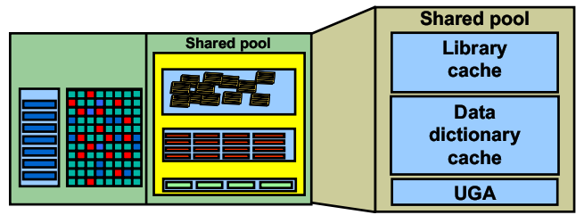  
Shared Pool的大小是通过参数SHARED_POOL_SIZE和决定的。它可以分为库缓存（Library cache），数据字典缓存（Data dictionary cache）和用户全局区域（UGA）所组队成的。  

Library cache存放了最近执行的SQL语句、存储过程、函数、解析树以及执行计划等。  

Data dictionary cache存放了在执行SQL语句过程中，所参照的数据字典的信息，包括SQL语句所涉及的表名、表的列、权限信息等。dictionary cache也叫做row cache，因为这里面的信息都是以数据行的形式存放的，而不是以数据块的形式存放的。  

The User Global Area (UGA) 当shared server模式被使用并且Large pool没有被设定的时候这个区域包括用户的session信息。  

oracle对SQL语句进行了概括和抽象，将SQL语句提炼为两部分，一部分是SQL语句的静态部分，也就是SQL语句本身的关键词、所涉及的表名称以及表的列等。另一部分就是SQL语句的动态部分，也就是SQL语句中的值（即表里的数据）。很明显的，整个数据库中所包含的对象数量是有限的，而其中所包含的数据则是无限的。而正是这无限的数据导致了SQL语句的千变万化，也就是说在数据库运行的过程中，发生的所有SQL语句中，静态部分可以认为数量是有限的，而动态部分则是无限的。而实际上，动态部分对解析的影响相比静态部分对解析的影响来说是微乎其微，也就是说通常情况下，对于相同的静态部分的SQL 语句来说，不同的动态部分所产生的解析结果（执行计划）基本都是一样的。这也就为oracle提高解析SQL语句的效率提供了方向。  

oracle会将用户提交来的SQL语句都缓存在内存中。每次处理新的一条SQL语句时，都会先在内存中查看是否有相同的SQL语句。如果相同则可以减少最重要的解析工作（也就是生成执行计划），从而节省了大量的资源；反之，如果没有找到相同的SQL语句，则必须重新从头到尾进行完整的解析过程。这部分存放SQL语句的内存就叫做共享池（shared pool）。当然，shared pool里不仅仅是SQL语句，还包括管理shared pool的内存结构以及执行计划、控制信息等等内存结构。  

当oracle在shared pool中查找相同的SQL语句的过程中，如果SQL语句使用了绑定变量（bind variable），那么就是比较SQL语句的静态部分，前面我们已经知道，静态部分是有限的，很容易就能够缓存在内存里，从而找到相同的SQL语句的概率很高。如果没有使用绑定变量，则就是比较SQL语句的静态部分和动态部分，而动态部分的变化是无限的，因此这样的SQL语句很难被缓存在shared pool里。毕竟内存是有限的，不可能把所有的动态部分都缓存在shared pool里，即便能够缓存，管理这样一个无限大的shared pool也是不可能完成的任务。不使用绑定变量导致的直接结果就是，找到相同的SQL语句的概率很低，导致必须完整的解析SQL语句，也就导致消耗更多的资源。从这里也可以看出，只有我们使用了绑定变量，才真正遵循了oracle引入shared pool的哲学思想，才能够更有效的利用shared pool。  
###2.7 Large Pool
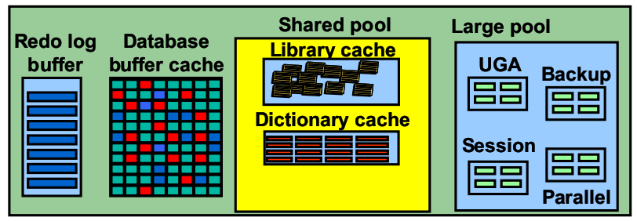  
Large Pool的大小是通过参数LARGE_POOL_SIZE来决定的。它所存储的信息有用户全局区域（UGA），备份和恢复选项（Backup and restore operations）和并行查询信息（Parallel query messaging）Oracle共享进程和Oracle XA接口。  

它是一种类似共享池的SGA缓冲池，和共享池不同的是，只有少量类型的对象可以在Large Pool中创建。Large Pool的空间不在共享池中分配，是在数据库启动的时候另外分配的。Oracle数据库也可以不配置Large Pool。它用来存放临时性的，有生命周期的信息，信息用过之后被释放掉。不用LRU是它和SHARED POOL一个显著的区别。 如果Large Pool空间不足，会出现ORA-4031错误。  

Oracle为什么引入LARGE POOL这个概念呢？当出现象RMAN BACKUP AND RECOVERY等需要大块内存请求（频繁的申请内存块，释放内存块过程）时，将对SHARED POOL造成一定的性能影响，而LARGE POOL是起着这种功能隔离作用的一块区域。例如在SHARED SERVER中增加LARGE POOL可以降低SHARED POOL的活动性使其更有效（当然如果你的系统不涉及使用LARGE POOL的除外）。就是说，这个池会对文件操作产生的I/O有一定的影响。  
#2.8 Java Pool
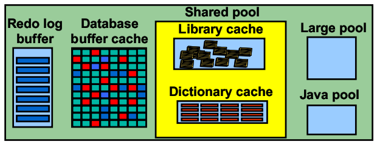  
Java Pool的大小是通过参数JAVA_POOL_SIZE来决定的。它是用来存储内存中所有在JVM内的JAVA代码和数据。

Shared pool被用来存储JVM中的class loader。这个class loader在每个class被读取的时候会占用8KB的内存。Shared pool还会被用来存储数据库中的JAVA代码的编译和在数据中使用的JAVA资源对象。

Java Pool被用来存储OracleJVM分配的所有运行时执行的JAVA状态，包含JAVA方法和类的定义，JAVA对象的调用等。

#2.9 进程结构
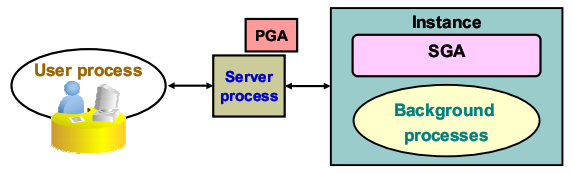  
用户进程（User process）：它开始于用户请进连接一个Oracle数据库的时候，它运行于客户端，它并不和Oracle Server直接交互，而是通过Server Process和Oracle Server进行交互。  

服务进程（Server process）：连接到一个Oracle实例，并且开始于一个用户session的开始。它和Oracle Server运行于同一台机器上，使用PGA执行User Process发出的调用，并向User Process返回结果状态和结果信息。  

后台进程（Background process）开始于一个Oracle实例的启动。

#2.10 后台进程
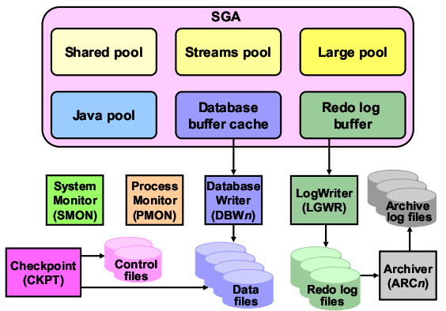  
一个Oracle database server包括一个Oracle database和一个Oracle instance。一个Oracle实例包括了内存结构，System Global Area (SGA)和后台进程。这些共公的后台进程包括：
System Monitor(SMON)：负责数据库崩溃之后的恢复工作，用于维护数据的一致性。他主要完成以下工作：
　　1）实例恢复
　　2）重做已提交的事务
　　3）打开数据库 中国.网管联盟 
　　4）回滚未提交的事务
　　5）合并数据文件中相邻的自由空间
　　6）释放临时段的空间
Process Monitor(PMON)：当某个进程失效时，清除相关的资源。他主要完成以下工作：
　　1）回滚用户的当前事务
　　2）释放相关的锁
　　3）是否其他相关的资源
Database Writer(DBWn)：负责将数据库缓存中标记为修改的块写回磁盘上的数据文件中。他主要完成以下工作：
　　1）发生检查点
　　2）达到脏缓冲区阈值
　　3）没有可用的缓冲区
　　4）超时
　　5）将表空间设置为脱机或只读
　　6）删除或截断表
　　7）备份表空间
Checkpoint(CKPT)：当检查点产生的数据更新所有的数据文件和控制文件。
　　1）使DBWn将SGA中所有被修改的数据库缓冲区的内容写入磁盘，无论事务是否被提交
　　2）用检查点信息更新数据文件头
　　3）用检查点信息更新控制文件
　　他能确保：
　　1）将经常被修改的数据块写入磁盘
　　2）简化实例恢复
LOG Writer（LGWR）
　　LGWR在以下情况将缓冲区中的数据写入磁盘（联机日志文件redo log）：
　　1）事务提交
　　2）三分之一的redo日志缓冲区已满
　　3）Redo日志缓冲区中的内容超过1M
　　4）每三秒钟
　　4）在DBWn写磁盘之前
Archiver（ARCn）
　　是个可选的后台进程
　　当把数据库设置为ARCHIVELOG模式时，能自动归档联机redo日志
　　能够保存所有对数据库所做修改的记录
  
###2.11 文件构成
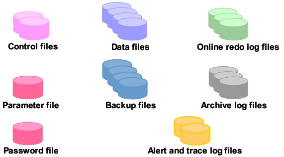  
以下这些文件用于构成一个Oracle数据库
　　控制文件（Control files）：包含一些关于数据自身的数据（比如数据库物理结构信息）这些文件是数据库的重要文件，没有它你无法打开数据库的数据文件。
　　数据文件（Data files）：包含用户或程序存储在数据库中的数据。
　　联机日志文件（Online redo log files）：用户实例的恢复，如果数据库崩溃了并且没有丢失任何数据文件，实例用于恢复这个数据库的信息存储在这个文件中。
　　以下这些文件对于成功运行一个数据库中必要的：
　　参数文件（Parameter file）：它用来定义你是如何配置这个实例的。
　　口令文件（Password file）：它用于存储系统管理员的口令。
　　备份文件（Backup files）：存储数据库的恢复信息。当数据的存储介质损坏或是由于用户的错误导致文件被删除的时候你就会用到它。
　　归档日志文件（Archive log files）：包含那些以前的联机日志文件，使用这些文件并且你有一个数据库的备份的话你可以恢复一些丢失的文件。
　　跟踪文件（Trace files）：每一个服务器或后台进程都会写一些跟踪文件。当一个致命的错误发生的时候，关于这个错误的信息会被写到这个文件中。
　　警告日志文件（Alert log files）：这是一个特殊的跟踪文件。它总中存储警告信息。每一个Oracle数据库有一个告警文件，名字为alterdb_name.log(db_name是数据库的名字），这个日志文件存放位置由参数文件中的参数BACKGROUND_DUMP_DEST的值确定，如果没有设置这个参数，Oracle把它放置在默认的位置：$oracle_home/rdbms/log
  
###2.12 表空间
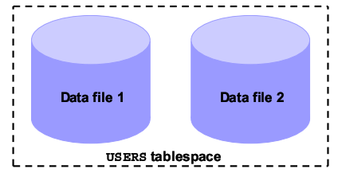  
一个数据库分割的逻辑存储单元被叫做表空间（tablespaces）。每一个数据库被分别存储在一个或多个表空间中。每一个表空间中包含一个或多个数据文件（data files）用来物理存储表空间中的所有逻辑结构的数据。
　　TableSpace没办法跨数据库，TableSpace中的Data File没办法跨TableSpace，Data File中的Table可以跨Data File，但不能跨TableSpace。简单的来说，一个Table里面的数据是有可能因为Oracle的空间分配而分布在同一个TableSpace的不同的Data File中的；因此一个Data File创出来后，是不能随便删除的，这将会造成严重的数据损毁的问题。
　　你能创建大文件表空间，也就是一个表空间只包含一个但非常大的数据文件（高达4亿个数据块）。传统的小文件表空间能包含多个数据文件，但每一个文件不能太大。
　　TableSpace的类型：Permanent、Undo、Temporary
　　●Permanent Tablespace
　　一般我们创建给AP使用的都是Permanent Tablespace。里面对象的生命周期不会随着交易或者用户的session结束而消失。
　　●Undo Tablespace
　　Undo Tablespace是系统用的特殊的Tablespace，用来取代过去的rollback segement的机制，主要的功用是提供用户修改数据未commit之前的read consistency的功能以及rollback交易的功能。也因为undo tablespace主要是取代过去的rollback segement的机制，所以不能存放其他种类的segement。undo tablespace只能是local managed。
　　●Temporary Tablespace
　　Temporary Tablespace也是系统用的特殊的Tablespace。当使用者需要做排序时，有时就会使用Temporary Tablespace，因此里面的Segement的生命周期都很短，可能交易结束或者User的Session结束就会消失。每个系统都必须要有一个预设的Temporary Tablespace（Default Temporary Tablespace），如果没有的话，忘了指定使用哪个Temporary Tablespace的使用者会以SYSTEM tablespace来当作Temporary Tablespace，这样就很糟糕。
　　关于System和Sysaux表空间
　　System和Sysaux是强制性的表空间。它们被创建在数据库建立的时候，并且是必须保持在线状态（online）。System表空间是用来存储核心的功能（例如：数据字典）。辅助性的Sysaux表空间被用于附加的数据库功能（例如：EM）
  
###2.13 物理存储
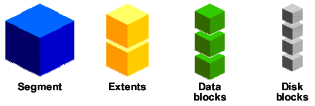  
段(Segments)存在于一个表空间。段相当于一个扩展（Extents）的集合。扩展相当于一个数据块(Data blocks)的集合。数据块会被应射到磁盘块（Disk blocks）。
　　数据库对象，比如表或者索引都会存在在表空间内的段里。每一个段都包含一个或多个扩展。一个扩展包含一些数据块，扩展可以存在于一单独的一个数据文件。数据块是数据库中最小的I/O单位。
　　当一个数据库存储一些数据块到操作系统中时，操作系统就会把他们应射到存储设备的的文件系统或磁盘块中。这种策略可以让数据库无需知道真正数据的物理信息。一个数据文件可以被分隔或者镜像到多个磁盘上。
　　数据块的大小是在建立数据库的时候被设定的。在大多数据的数据库中使用了它的默认大小8K。如果你的数据库支持数据仓库应用有一些大的表或者索引的话，使用大的数据块大小将是一个很好的选择。如果你做的一个交易系统，读写的是随机的那么使用小的数据块是不错的。数据库的最大将决定于你的操作系统。你可以指定表空间不同的数据块大小。
