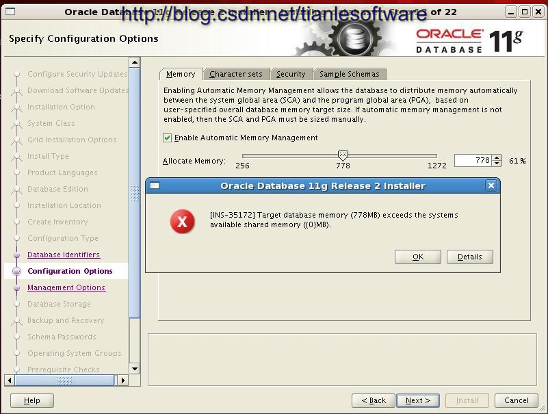
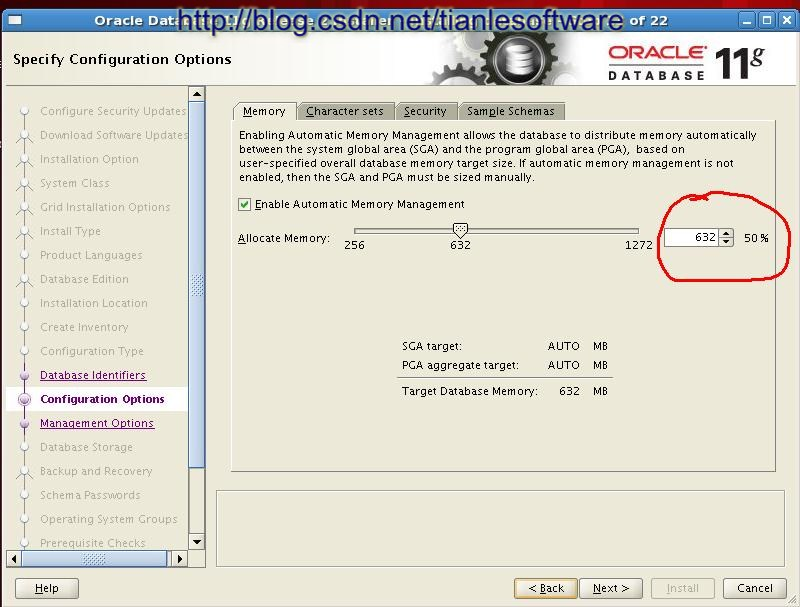

#Oracle问题对应实绩
[TOC] 
##1 ORA-12546：TNS：permission denied
在conn sys/sys as sysdba时，发生ORA-12546：TNS：permission denied  
主要是由于采用root用户连接sqlplus，登录时，根据root用户根本无法识别数据库实例。  
要注意连接数据库前，需要将root用户su 成oracle用户执行：  
[root@host home]$ su oracle  

##2 EXP-00106: 数据库链接口令无效
一个数据库在升级到11.2.0.3.0后，使用11.2.0.1.0的客户端exp导出用户时，报dblink口令无效错误。详细信息如下：  
连接到: Oracle Database 11g Enterprise Edition Release 11.2.0.3.0 - 64bit Production
With the Partitioning, Real Application Clusters, Automatic Storage Management, OLAP,
Data Mining and Real Application Tes  
已导出 ZHS16GBK 字符集和 AL16UTF16 NCHAR 字符集  
即将导出指定的用户...  
. 正在导出 pre-schema 过程对象和操作  
. 正在导出用户 FINGER 的外部函数库名  
. 导出 PUBLIC 类型同义词  
. 正在导出专用类型同义词  
. 正在导出用户 FING 的对象类型定义  
即将导出 FING 的对象...  
. 正在导出数据库链接  
EXP-00106: 数据库链接口令无效  
EXP-00000: 导出终止失败  
2012-09-13星期四  4:30:02.88  
经过检查，这个DBLINK是可以连通的。  
测试发现，数据库服务器端exp，expdp导出均正常。  
换用10g客户端导出也报一样的错误。  
怀疑是客户端版本的问题。  
使用另外一个11.2.0.3.0的客户端exp,正常结束。  
此报错在metalink上未查询到，记录在此。  

##3 EXP－00091 Exporting questionable statistics
因为exp工具所在的环境变量中的NLS_LANG与DB中的NLS_CHARACTERSET不一致。errormessage对产生的dmp文档没有影响。  
1）查看DB的NLS_CHARACTERSET的值  
  select * from nls_database_parameters t where t.parameter='NLS_CHARACTERSET'  
  或者  
  select * from v$nls_parameters  where parameter='NLS_CHARACTERSET';  
2）根据1）中的结果设置操作系统中的环境变量  
   set NLS_LANG=AMERICAN_AMERICA.ZHT16BIG5  
   查看：export NLS_LANG=AMERICAN_AMERICA.ZHT16BIG5  

##4 JDBC运行出现ORA-17410错误
程序通过JDBC访问10.2.0.1数据库时，碰到了一个ORA-17410错误。

详细错误信息为：

net.emedchina.cat.exception.org.OrgException: 1.17410无法从套接字读取更多的数据``SQL: select /*+ first_rows */ * from (select row_.* , rownum rownum_ from(select nvl(deal.temp_flag,0) as temp_flag, b.url,c.member_flag,b.address, b.plat_id, b.used_name, c.code ,c.name ,b.check_flag, b.fa

这个错误信息很难看出是Oracle的错误信息，在网上查询这个错误的相关信息的时候才发现这个错误实际上就是ORA-17410。

ORA-17410: No more data to read from socket.

错误比较奇怪，同样的SQL在sqlplus里面执行不会有任何的问题，如果将失败的SQL的一些查询条件去掉，也不会产生错误。而且同样的程序以前没有碰到过这个错误。怀疑和数据库的版本10.2.0.1有关，这个问题在10.2.0.3中没有出现过。

检查了metalink，发现文档ID 1083922.1描述了这个现象。

这个错误在10.2到11.2的各个版本都可能出现。

对于11.1的版本，可以通过PATCH 8935561来解决，对于10.2版本的JDBC，除了将数据库升级到不发生这个错误的版本外，还可以通过OCI方式进行连接，因为这个错误只在JDBC瘦客户端连接方式中出现。

##5 ORA-14402: 更新分区关键字列将导致分区的更改
分区表分区字段的update操作
默认情况下，oracle的分区表对于分区字段是不允许进行update操作的，如果有对分区字段行进update，就会报错——ORA-14402: 更新分区关键字列将导致分区的更改。但是可以通过打开表的row movement属性来允许对分区字段的update操作。

SQL> alter table test_part enable row movement;
执行上面语句后，再对分区表分区字段进行update操作即可成功
oracle.install.commons.util.exception.DefaultErrorAdvisor
系统环境：Oracle Linux6
数据库版本：Oracle 11g R2 11.2.0.3
现象：执行安装 ./runInstall 后，安装界面出现报错，弹出 主机名：主机名
输出日志具体信息：

OraInstall2013-02-28_03-51-59PM]# cat oraInstall2013-02-28_03-51-59PM.err 
~~~
---# Begin Stacktrace #---------------------------
ID: oracle.install.commons.util.exception.DefaultErrorAdvisor:37
oracle.cluster.verification.VerificationException: WTCCN-GZ-OCLD: WTCCN-GZ-OCLD
at oracle.cluster.verification.ClusterVerification.<init>(ClusterVerification.java:231)
at oracle.cluster.verification.ClusterVerification.getInstance(ClusterVerification.java:333)
at oracle.install.driver.oui.OUISetupDriver.load(OUISetupDriver.java:419)
at oracle.install.ivw.db.driver.DBSetupDriver.load(DBSetupDriver.java:190)
at oracle.install.commons.base.driver.common.Installer.run(Installer.java:299)
at oracle.install.ivw.common.util.OracleInstaller.run(OracleInstaller.java:106)
at oracle.install.ivw.db.driver.DBInstaller.run(DBInstaller.java:136)
at oracle.install.commons.util.Application.startup(Application.java:891)
at oracle.install.commons.flow.FlowApplication.startup(FlowApplication.java:165)
at oracle.install.commons.flow.FlowApplication.startup(FlowApplication.java:182)
at oracle.install.commons.base.driver.common.Installer.startup(Installer.java:348)
at oracle.install.ivw.db.driver.DBInstaller.startup(DBInstaller.java:124)
at oracle.install.ivw.db.driver.DBInstaller.main(DBInstaller.java:155)

---# End Stacktrace #-----------------------------
~~~

解决办法：
vi /etc/hosts
host IP Address	host name

重新执行 ./runInstall

##6 [INS-35172] Target database memory (XXMB) exceeds the systems available shared memory ({0}MB) 
安装Oracle 11gR2数据库，安装过程中报错：  
  
[INS-35172] Target database memory (778MB)exceeds the systems available shared memory ({0}MB).  
经过测试，目前系统最大能通过的内存是：632M. 如下图：  
  
影响这个最大值，即632M是我们的tmpfs 文件的大小。 这个问题和我之前的blog原因类似：
Oracle11gR2 RAC ORA-00845 MEMORY_TARGET not supported on this system 解决方法
http://blog.csdn.net/tianlesoftware/article/details/6013777
 
MOS上的文档[ID 460506.1] 有说明。
 
You are tryingto use the MEMORY_TARGET feature. This feature requires the /dev/shm filesystem to be mounted for at Least <size> bytes.The /dev/shm is either notmounted or is mounted With available space less than this size.
  
[root@gg2 ~]# df -h /dev/shm
Filesystem            Size  Used Avail Use% Mounted on
tmpfs                 636M     0 636M   0% /dev/shm  

这个文件的大小才是真正控制我们 AMM 的大小关键。找到了原因就好处理了。修改tmpfs 的大小，使其大于MEMORY_TARGET的大小就可以了。 
~~~
# umount tmpfs
# mount -t tmpfs shmfs -o size=3G /dev/shm
~~~
让以后每次重启OS 都自动mount，修改文件 /etc/fstab 将tmpfs 修改成以下值：
 tmpfs            /dev/shm        tmpfs  defaults,size=3G        0 0
 
如果直接修改/etc/fstab，通过重启OS 也可以让参数生效。
 
注意：这个size 的大小需要设置为整数。
 
[root@gg2 ~]# df -lh /dev/shm
Filesystem            Size  Used Avail Use% Mounted on
shmfs                 3.0G     0 3.0G   0% /dev/shm

修改之后就可以顺利通过安装了。
问题解决：
有时会遇到/dev/shm 卸载不掉的情况
~~~
# umount /dev/shm
umount: /dev/shm: device is busy.
~~~
用fuser处理
~~~
# fuser -km /dev/shm
# umount /dev/shm
# mount /dev/shm
~~~

##7 ORA-00376: 此时无法读取文件
问题描述：
ORA-00376: 此时无法读取文件 4
ORA-01110: 数据文件 4: 'D:\APP\WJ\ORADATA\ORCL11G\USERS01.DBF'

解决方案：
1. 管理员通过以下SQL判断数据文件状态
`select file#,name,status from v$datafile;`
查看该文件是否处于：OFFLINE状态、或RECOVER状态
2. 如果问题数据文件处于离线状态（OFFLINE），则尝试将文件上线
`alter database datafile 4 online;`
3. 如果问题数据处于恢复状态（RECOVER）状态，则需要恢复该文件
4. 通过下述命令进行RMAN
`rman target /`
5. 尝试recover datafile No;
其中No为问题数据文件的编号
6. 恢复成功后，手动触发检查点更新
`alter system checkpoint GLOBAL;`
7. 再执行步骤2，将文件进行上线处理

