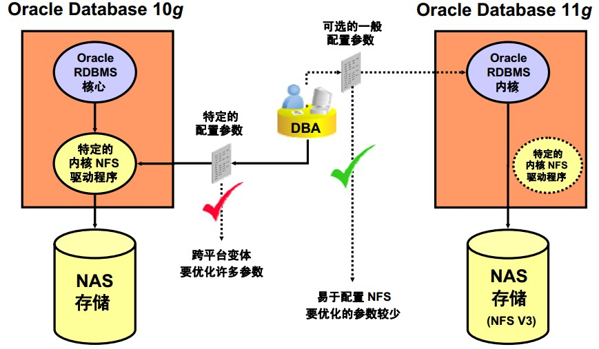
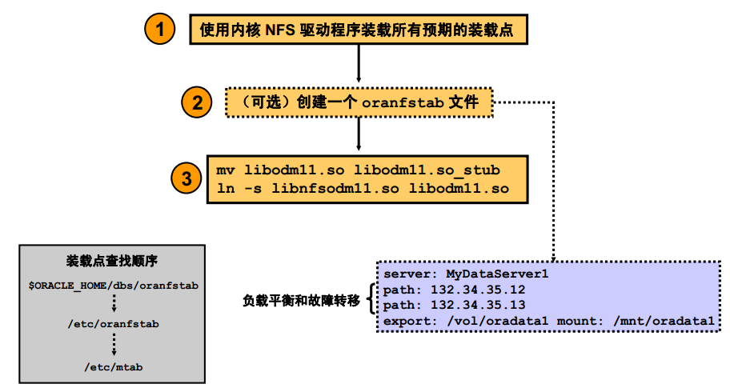
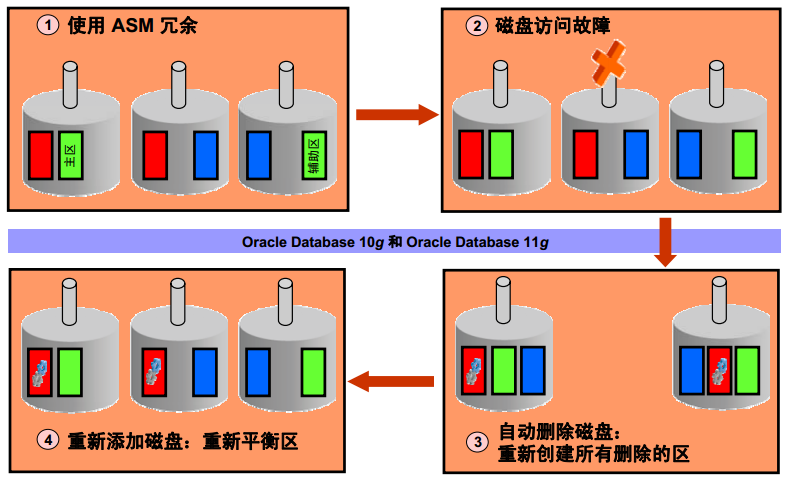
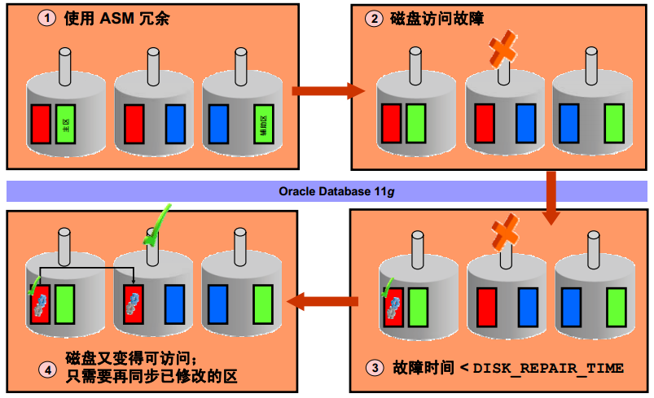
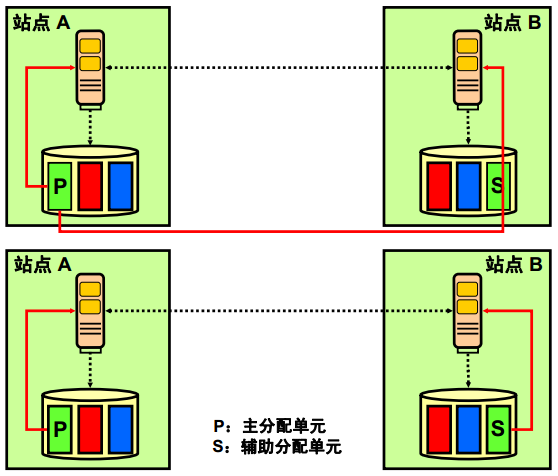
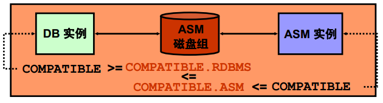
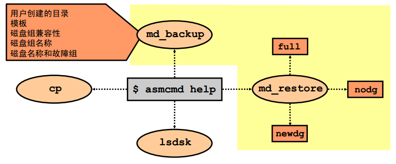
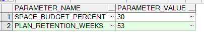

[TOC] 
##1 Oracle 11g新特性
###1.1 Oracle 11g的创新点
1）商业化SQL实施
2）平台可移植性
3）支持客户端/服务器
4）多版本读取一致性
5）支持集群和MPP（大规模并行处理计算机Massive Parallel Processor）
6）支持分布式SQL和事务处理
7）并行操作
8）数据仓库优化
9）多媒体支持
10）对象关系支持
11）内置消息
12）支持分区
13）内置Java虚拟机
14）虚拟专用数据库
15）闪回查询
16）Real Application Cluster
17）Oracle Data Guard
18）XML数据库
19）自助管理数据库
20）自动存储管理
21）网格计算
22）安全企业搜索
23）DB Vault
       数据穹顶：能够限制任何用户访问数据库中的特定区域，包括有管理权限的用户
       保护数据免遭内部威胁
24）Audit Vault
       自动将审计数据合并到一个安全的数据仓库，使得能够更加有效的进行监控和报告
###1.2 Oracle Database 11g重点
1）可管理性
2）可用性
3）性能：
     secureFiles、OLTP、Real Application Cluster优化压缩功能、结果查询高速缓存
4）业务智能和数据仓库
5）安全性
6）信息管理：内容管理XML、Oracle Text Oracle Spatial、多媒体和医学成像
7）应用程序开发
###1.3 管理自动化
1）自学能力：自动SQL优化
2）优化SGA、PGA内存缓冲
3）针对分区、数据库修复、流性能、空间管理的指导
4）ADDM（Oracle自动数据库诊断监视器），监控RAC（Oracle Real Application Clusters）性能
###1.4 10g 与 11g
- 10g：实现数据库易用性管理，重点：性能资源
- 11g：新增、更改管理，故障管理  
###1.5 与11g一起安装的组件
- 单机
1）Oracle Application Express（之前的HTML DB）  
2）Oracle Configuration Manager（之前的CCR Customer Configuration Repository）  
3）Oracle SQL Developer  
4）Oracle Warehouse Builder  
5）Oracle Database Vault  
- 集群  
1）支持Oracle集群注册表OCR和表决磁盘的块设备  
2）支持将XE数据库直接升级至Oracle Database 11g  
3）在显示提示ORACLE_BASE未设置则提出预警  
**10.2中有，但不与11g一起安装：**  
1）SQL*plus  
2）Oracle Workflow  
3）Oracle Data Mining计分引擎  
4）Oracle Enterprise Manager Java  
10g：快速恢复区域数据文件位置比Oracle主目录高一层  
11g：ORACLE_BASE里快速恢复区和数据文件位置的起点  
###1.6 Oracle 11g升级、降级
·DBUA：Database Upgrade Assistant
 增强功能：空间估计、初始化参数、统计信息收集、新建警告
 对于补丁程序版本  catupgrd.sql升级
                             catupgrd.sql降级
 DBUA自动多CPU并行对象重编译
 收集升级过程中的错误，升级后状态工具显示每个组件的错误
·使用升级前信息工具utlulli.sql，从ORACLE_HOME/rdbms/admin目录复制到另外目录
·执行升级：STARTUP UPGRADE，替换9i的STARTUP MIGRATE
 执行降级仍使用：STARTUP MIGRATE
###1.7 Oracle升级方法
1）DBUA：Database Upgrade Assistant
  自动化交互式升级工具
2）STARTUP UPGRADE
3）导入/导出，数据泵：从旧数据库导出，新版本数据库中导入
4）CREATE TABLE AS SELECT...：旧版本数据库导出到新版本数据库表中
###1.8 DBUA
- 优点
1）自动完成所有任务
2）完成版本升级补丁
3）支持RAC、单节点
4）通知用户修复先决条件
5）自动报告假脱机日志中发现的错误
6）完整的升级报告（HTML格式）
7）命令行节目支持ISV，实现自动化操作
- 缺点
对单个升级步骤控制较少
- DBUA主要功能
1）可恢复性：
①执行升级前数据库备份
②升级后恢复
2）运行所有必需脚本执行升级
3）显示组件级别的升级进度
4）配置检查：
①自动初始化参数
②是否有足够资源，检查：
无效用户、账户、角色
无效数据类型
无效对象
不再支持的字符集
资源：SYSTEM表空间、回退字段大小、重做日志大小
缺少升级所需的脚本
运行的监听器，在升级完成时，提供检查概要
③磁盘空间
④SYSAUX表空间
5）配置文件
①在新的ORACLE_HOME中创建init.ora和服务器参数文件
②更新网络配置
③使用OFA兼容位置
④更新Oracle Internet Directory Database
6）Oracle Enterprise Manager：
DBCA中设置和配置Oracle Enterprise Database Control
DBCA中注册Database到EM Grid Control，在EM中进行配置和修改
7）记录和跟踪：
ORACLE_BASE/cfgtoollogs/dbua/<ssid>/upgradeNN
8）压缩停机时间
①禁用归档加快升级速度
②以并行方式重新编译程序包
③升级后无需用户交互
9）安全功能
在已升级的Database中锁定新用户
10）Real Application Clusters
升级所有节点
升级所有配置文件
- 使用DBUA升级过程
1）使用DBUA升级后，以SYSDBA用户登录DBCA分析数据库：
①检查4M以下的重做日志，DBCA删除或新建重做日志
②过时或废弃的初始化参数。
2）移动数据文件
有两个选择：
①Do not Move DB files as Part of Upgrade
②Move DB files during Upgrade
移动数据库文件的选项：
①File System
②ASM（Automatic Storage Management）。如果没有ASM实例，需要在DBCA中创建
3）数据库文件位置
①Use Common Location for All DB files
②Use Redo-Managed File
③Use a Mapping file to Specify Location of DB file
4）恢复批准Recovery Configuration
①指定Flash Recovery Area闪回恢复区
②如果选择Move DB files during Upgrade，必须配置闪回恢复区
5）配置EM
6）网络配置
·DBUA监测到监听，将开启网络配置
·如果有多个listener则开启监听配置选项卡。可以选择：将所有监听注册到DB，也可以将所选的监听注册到DB
·如果有目录服务（Directory Service）开启选项卡，选择是否注册相应的目录
7）编译无效的对象
·指定Degree of Parallelism并行度，要小于CPU数量
·可以选择Turn off Archiece and Flashback logging for the duration of upgrade，减少完成升级所需的时间。
8）数据库备份
·DBUA在Backup Directory字段中指定的目录中，创建所有DB的副本，DBUA会关闭DB进行冷备份。
·DBUA会生成一个db_name_restore.bat/.sh用于恢复数据库
9）升级概要Summary
·升级后的任务
①更新环境变量
②根据需要调整初始化参数
③升级恢复目录
④测试应用程序并优化
⑤升级由DBMS_STAT程序包创建的统计信息表
⑥启用Oracle DB Vault
⑦升级TIMESTAMP数据
⑧将最新的时区用于客户机
·Oracle 11g废弃的功能
①Oracle Ultra Search
②Java开发工具包JDK1.4，建议至少升级为1.5
③CTXXPATH索引：换用XML Index
·重要初始化参数修改
①USER_DUMP_DEST/BACK_GROUP_DUMP_DEST/CORE_DUMP_DEST→DIAGNOSTIC_DEST
②不设置UNDO_MANAGEMENT表示使用Auto模式
③要迁移到自动还原管理步骤：
i）设置UNDO_MANAGEMENT=MANUAL
ii）执行Workload
iii）执行DBMS_UNDO_ADV.RBU_MIGATION函数
iv）基于以前大小结果创建到还原空间
v）设置UNDO_MANAGEMENT=AUTO
④CONTROL_MANAGEMENT_PACK_ACCESS可以指定Server Manageability包下的可用包：
i）DIAGNOSTIC包，包括：AWR、ADDM
ii）TUNING：包括SQL优化指导，SQL访问指导，需要启用TUNING包要DIAGNOSTIC许可证
CONTROL_MANAGEMENT_PACK_ACCESS参数的取值：NONE、DIAGNOSTIC、DIAGNOSTIC+TUNING（默认）
###1.9 Direct NFS
  
·Oracle 11g的Direct NFS客户机使用Oracle Direct Network File System版本3.0
**·实施Oracle Direct NFS优点**
    1）可以完全控制网络文件服务器的输入/输出路径，简化配置管理，出色的可诊断性
    2）避免内核网络文件系统层瓶颈和资源限制
    3）为Oracle提供公用的网络文件系统界面
    4）从多个连接间实现负载均衡提高性能
**·配置**  
  
1）在装载点发现装载条目提供服务
查找装载点的顺序：
①ORACLE_HOME/dbs/oranfstab
②/etc/oranfstab
③/etc/mtab
2）可选择创建一个oranfstab文件  
**·启动Direct NFS**
1）确保内核NFS客户机装载NFS装载点
2）（可选）为使用Direct NFS访问的每个NFS服务器创建oranfstab文件，其中包括：①服务器名②路径③导出④装载
3）使用ODM库libnfsodm10.so启用Direct NFS：
cd $ORALCE_HOME/lib
cp libdm11.so libodm11.so_stub
ln -s libnfsodm11.so libodm11.so  
**·禁用Direct NFS**
1）删除oranfstab文件
2）逆向步骤【启动Direct NFS】中的步骤3
3）删除oranfstab文件中特定的NFS服务器或导出路径
·**监视Direct NFS**
•V$DNFS_SERVERS：显示使用 Direct NFS 访问的服务器表 
•V$DNFS_FILES：显示当前使用 Direct NFS 打开的文件表 
•V$DNFS_CHANNELS：显示 Direct NFS 为其提供文件的服务器的公开网络路径 （或通道）表 
•V$DNFS_STATS：显示 Direct NFS 的性能统计信息表
###1.10 热补丁
·opatch命令用于安装卸载热补丁程序
·opatch检测两个热补丁程序间及热补丁程序与常规补丁程序之间的冲突
·确定补丁是否是热补丁
    opatch query -is_online_patch <patch location>
    opatch query <patch location> -all
**·热补丁的优点**
1）无停机时间，不中断业务
2）安装和卸载速度极快
3）与OPatch集成
△检测冲突
△在补丁程序清单中列出
△在RAC环境工作
4）不改变磁盘上Oracle二进制文件，但热补丁程序在实例关闭、启动时都保持有效。不管关闭时间多长
**·常规补丁与热补丁**
1）常规补丁：①需要停机才能应用；②通过Opatch安装和卸载；③在实例启动和关闭时持续有效；④需要几分钟安装/卸载
2）热补丁：①不需停机；②通过OPatch安装、卸载；③实例启动、停止均有效；④只需几秒钟
**·注意事项**
1）不是所有平台都有热补丁：Linux x86/Linux x86-64/Solaris SPARC64
2）需要消耗一些额外内存
△确切内存数取决于：补丁程序大小；
当前运行的Oracle的进程数
△最小内存数：PageSize（OS的内存页大小）×Oracle进程数
3）在每个Oracle进程安装或卸载热补丁程序前，可能有极短延迟（几秒）
4）并非所有bug修复和诊断程序都可以用作OPatch
5）不能在停机时间使用热补丁
6）如果有停机时间，则应以常规补丁方式安装所有相关bug修复  
###1.11 存储增强
####1.11.1 数据再同步
1）无ASM快速镜像再同步
ASM无法向分配给某个磁盘的区写入时，该磁盘脱机，同时其他磁盘上至少写入一个此区的副本（前提使用ASM冗余）
10g：脱机后，认为脱机磁盘是过时数据，脱机后不久重新分配副本，开销大
  
2）ASM快速镜像再同步
11g：增加DISK_REPAIR_TIME选项，磁盘脱机但不立即删除。一旦磁盘修复后，向脱机的磁盘同步更新。为跟踪更新，每个修改的区使用一个位记录
  
·ALTER DISKGROUP dgroupA SET ATTRIBUTE 'DISK_REPAIR_TIME' = '2D4H30M';
·ALTER DISKGROUP ONLINE DISK：使修复的磁盘恢复联机
    eg：ALTER DISKGROUP dgroupA OFFLINE DISKS IN FAILGROUP contrl2 DROP AFTER 5H;  
·V$ASM_ATTRIBUTE视图查看当前属性
·V$ASM_DISK或V$ASM_DISK_IOSTAT的REPAIR_TIMER列确定ASM删除某个脱机磁盘剩余的时间
·V$ASM_OPERATION中将出现一个与写磁盘再同步操作对应行，其中OPERATION列设置为SYNC
·ALTER DISKGROUP dgroupA OFFLINE DISKS IN FAILGROUP contrl2 DROP AFTER 5H;
·ALTER DISKGROUP dgroupA DROP DISKS IN FAILGROUP contrl2 FORCE;  删除磁盘组，Force选项：强制删除 
####1.11.2 ASM首选镜像读取
  
1）10g：读取ASM主副本，从最靠近故障区读取概率高
2）11g：优化参数：ASM_PREFERED_READ_FAILURE_GROUPS：指定首选镜像读取名称列来配置首选镜像读取
设置
ASM_PREFERRED_READ_FAILURE_GROUPS是动态参数，可以使用ALTER SYSTEM可以随时修改
每个故障组名的命名规则：磁盘组名和一个“.”为前缀
~~~
ASM_PREFERRED_READ_FAILURE_GROUPS=DATA.SITEA   --在第一个实例上
ASM_PREFERRED_READ_FAILURE_GROUPS=DATA.SITEB   --在第二个实例上
~~~
监视
preferred_read 属性如果为Y，则该磁盘为首选故障组
v$asm_disk_iostat：记录每台ASM客户机的磁盘输入/输出统计信息
~~~
SELECT preferred_read FROM v$asm_disk;
SELECT * FROM v$asm_disk_iostat;
~~~
####1.11.3 ASM的高伸缩性、性能增强
1）大小根据文件大小增加。ASM支持1/8/64个分配单元（AU）可变大小区
2）ASM支持可变去大小：
①增加可能的最大文件大小（减少描述文件所需的区指针数）
②减少共享池中内存的使用量（管理共享池中ASM映射所需的内存）
3）出现重要碎片是，不需要执行重新平衡以外的其他管理任务
4）ASM全自动，无需手动干预，自动碎片整理
####1.11.4 ASM强制限制
①63个磁盘组
②10000个ASM磁盘
③每个ASM磁盘4PB
④40EB的存储空间
⑤每个磁盘组1百万个文件
⑥最大文件大小外部冗余140PB，内部冗余42PB，高冗余15PB  
####1.11.5 SYSASM角色
使用SYSASM角色管理ASM实例，避免DBA与存储管理员间重叠，ASM实例中SYSDBA受到限制，用DBA登录ASM实例会在alert.lo文件中写入警告
~~~
CONNECT / AS SYSASM
CREATE USER username IDENTIFIED by passwd;
GRANT SYSASM TO username;
CONNECT username/passwd AS SYSASM;
DROP USER username;
~~~
·V$PWFILE_USERS视图中集成新列，SYSASM指明用户是否是ASM管理员（TRUE/FALSE）
####1.11.6 ASM磁盘兼容性
1）可以单独控制ASM每个磁盘组的兼容性
①ASM兼容性可以使用控制磁盘上ASM元数据结构
②RDBMS兼容性可以控制最低使用者客户机级别
③对异构环境很有用
2）对磁盘组兼容性的设置不可逆
  
3）使用CREATE DISKGROUP、ALTER DISKGROUP设置磁盘兼容性
4）ASM磁盘组属性
名称|属性|值|说明
---|----|---|---
au_size|C|1,2,4,8,16,32,64MB|磁盘组中分配单元的大小
compatible.rdbms|AC|有效的数据库版本|数据库与ASM之间交换的消息的格式
compatible.asm|AC|有效的ASM实例版本|磁盘上ASM元数据结构的格式
disk_repair_time|AC|0 M to 2^32 D|磁盘脱机后删除此磁盘之前的时间量
template.tname.redundancy|A|UNPROTECT,MIRROR,HIGH|指定模板的冗余
template.tname.stripe|A|COARSE,FINE|指定模板的条带化属性
例：  
~~~
CREATE DISKGROUP DATA NORMAL REDUNDANCY DISK '/dev/raw/raw1','/dev/raw/raw2' ATTRIBUTE 'compatible.asm'='11.1';
~~~
####1.11.7 增强磁盘组检查
·ALTER DISKGROUP DATA CHECK;
·CHECK命令验证ASM元数据内部一致性
·ASM显示错误概要，细节在预警日志中
·ALL/DISK/DISK IN FAILGROUP/FILE子句都已废弃
·CHECK执行的操作：
    ■检查磁盘一致性（同CHECK DISK、CHECK DISK IN FAILGROUP）
    ■交叉检查所有文件区映射表的一致性（同CHECK FILE）
    ■检查别名元数据目录和文件的链接是否正确
    ■检查别名目录树的链接是否正确
    ■检查ASM元数据目录确定其不包含无法访问的已分配块
·REPAIR|NOREPAIR子句指示ASM是否尝试修复一致性检查中发现的错误
【注】检查会降低磁盘速度
####1.11.8 适用用于快速重新平衡的受限装载
1）磁盘组只能装载在单个实例上
2）任何数据库客户机或其他ASM实例都不能获得访问权限
3）重新平衡可以继续进行，无锁定开销
~~~
ALTER DISKGROUP data DISMOUNT;
ALTER DISKGROUP data MOUNT RESTRICT;
维护：添加、删除磁盘
ALTER DISKGROUP data DISMOUNT;
ALTER DISKGROUP data MOUNT;
~~~
·RESTRICTED装载磁盘，仅在一个节点上以独占方式进行装载，该节点上的ASM客户机无法使用该磁盘组
·RESTRICTED选项启动ASM实例时，ASM_DISKGROUPS参数中定义索引磁盘组都以RESTRICTED模式装载
####1.11.9 强制装载磁盘组
1）MOUNT使用NOFORCE选项，所有磁盘并可用，是MOUNT的默认选项
2）MOUNT使用FORCE
    ·如果存在仲裁盘，则会使不可用的磁盘脱机
    ·如果索引磁盘都可用，操作失败，所有的磁盘都是ONLINE状态
####1.11.10 强制删除磁盘组
1）任何位置装载了磁盘组，装载都会失败
~~~
DROP DISKGROUP data FORCE INCLUDING CONTENTS;
~~~
·DROP DISKGROUP使用FORCE必须指定INCLUDING CONTENTS子句
####1.11.11 ASMCMD扩展
  
1）ASMCMD扩展包包括ASM元数据备份/还原，通过完全对应的模板、别名重新建立ASM磁盘组。RMAN用于恢复丢失的文件。ASM磁盘组丢失要手动重建
2）ASM元数据备份/还原AMBR有两种模式
    ■备份模式：收集磁盘、故障组配置、模板、别名目录结构转存到文件
    ■还原模式：读取转存文件重建磁盘组及元数据。包括三种模式：full、nodg、newdg。区别是否创建更改磁盘组并配置属性
3）lsdsk列出ASM磁盘信息。两种模式：
    ■连接模式：使用V$、GV$检索磁盘信息
    ■非连接模式：使用ASM磁盘字符串来限制搜索集，检索磁盘头信息
4）cp本地远程实例间复制文件
5）示例

~~~
ASMCMD> md_backup –b jfv_backup_file -g data
Disk group to be backed up: DATA#
Current alias directory path: jfv

ASMCMD> md_restore -b jfv_backup_file -t full -g data
Disk group to be restored: DATA#
ASMCMDAMBR-09358, Option -t newdg specified without any override
options.
Current Diskgroup being restored: DATA
Diskgroup DATA created!
User Alias directory +DATA/jfv
created!
~~~
###1.12 SQL Management Base(SMB)
在Oracle 11g，SMB是SPM的控制端，SMB是数据字典的一部分，SMB存储在sysaux表空间，SMB存储SQL语句日志，Plan Histories，以及SQL Profiles等，SMB允许每周清除一次未使用的SQL Plan & Log，SMB已经配置了自动存储空间管理。
[@more@]1 Disk Space Usage
SMB默认可以使用sysaux表空间的10%，SMB被允许使用sysaux的存储范围是1%-50%，每周有后台进程来测量SMB使用sysaux的空间，如果SMB超过了允许的范围，就会在al*.log中写入一条警告，可以通过dbms_spm的configure过程设置SMB允许使用存储空间的范围。
~~~
BEGIN
DBMS_SPM.CONFIGURE('space_budget_percent', 30);
END;
/
~~~
**Purging Policy**
也可以通过dbms_spm的configure过程设置SMB清除策略：  

~~~
BEGIN
DBMS_SPM.CONFIGURE('plan_retention_weeks', 105);
END;
/
~~~  

**SMB Configuration Parameters**
可以通过DBA_SQL_MANAGEMENT_CONFIG视图来查看配置参数
select parameter_name, parameter_value from dba_sql_management_config;  
  
space_budget_percent：Maximum percent of SYSAUXspace that can be used for SQL management base，default：10
plan_retention_weeks：Number of weeks to retain unused plans before they are purged，default：53  
**创建stage表**
~~~
BEGIN
DBMS_SPM.CREATE_STGTAB_BASELINE(table_name => 'stage1');
END;
/
~~~
dbms_spm提供了多个过程来在数据库之间迁移SQL计划基线：
    ·create_stgtab_baseline创建一个计划基线保存表
    ·pack_stgtab_baseline将基线从数据字典复制到第一步的表中
    ·unpack_stgtab_baseline将基线从保存表中复制到迁移数据库的数据字典中
5 打包需要导出的数据
~~~
DECLARE
my_plans number;
BEGIN
my_plans := DBMS_SPM.PACK_STGTAB_BASELINE(
table_name => 'stage1',
enabled => 'yes',
creator => 'dba1');
END;
/
~~~
6 用exp或expdp导出stage表。
7 用imp或impdb导入stage表
8 把导出的SQL Plan Baselines导入字典中
~~~
DECLARE
my_plans number;
BEGIN
my_plans := DBMS_SPM.UNPACK_STGTAB_BASELINE(
table_name => 'stage1',
fixed => 'yes');
END;
/
~~~  
SMB可以载入旧版本STS（SQL Tuning Set）的记录

###1.13 Automatic Diagnostic Repository（ADR）
在Oracle 11g中引入了自动诊断信息库(ADR)，它提供了一个统一而且一致的机制来存储、格式化并定位所有的数据库诊断信息(易于使用的文件结构)。ADR关联各种组件(比如Oracle RAC、Oracle Clusterware、OCI、Net、进程等)的错误，并自动为严重的错误生成事故和提供事故管理功能。因此，ADR可以显著减少解决事故和问题的时间。

通常在使用传统的初始化参数的时候，比如BACKGROUND_DUMP_DEST、CORE_DUMP_ DEST和USER_DUMP_DEST等，如果想让清理文件的过程自动进行，就必须使用自定义过程去手动清理。用ADR和ADR的命令行界面(ADRCI)，您可以设置控制这些文件保存时间的策略：
~~~
adrci> set control (SHORTP_POLICY = 360 )
adrci> set control (LONGP_POLICY = 4380 )
~~~
使用ADR时，传统的CORE_DUMP_DEST、BACKGROUND_DUMP_DEST和USER_DUMP_DEST位置改变为DIAGNOSTIC_DEST。因此，如果指定了参数DIAGNOSTIC_DEST，由原来的参数设置的位置将被忽略。

使用ADR时的位置变化如下：

原始位置 新位置
~~~
CORE_DUMP_DEST DIAGNOSTIC_DEST/diag/rdbms/<DBNAME>/<INSTANCENAME>/cdump
 BACKGROUND_DUMP_DEST
 (Alert Log text)
 (Alert Log XML) DIAGNOSTIC_DEST/diag/rdbms/<DBNAME>/<INSTANCENAME>/trace
 DIAGNOSTIC_DEST/diag/rdbms/<DBNAME>/<INSTANCENAME>/alert
 BACKGROUND_DUMP_DEST DIAGNOSTIC_DEST/diag/rdbms/<DBNAME>/<INSTANCENAME>/trace
 USER_DUMP_DEST DIAGNOSTIC_DEST/diag/rdbms/<DBNAME>/< INSTANCENAME >/trace
~~~
如下是ADR文件位置的缩略列表：
~~~
DIAGNOSTIC_DEST/diag/rdbms/<DBNAME>/<INSTANCENAME>/trace
DIAGNOSTIC_DEST/diag/rdbms/<DBNAME>/<INSTANCENAME>/alert
DIAGNOSTIC_DEST/diag/rdbms/<DBNAME>/<INSTANCENAME>/cdump
DIAGNOSTIC_DEST/diag/rdbms/<DBNAME>/<INSTANCENAME>/incident
DIAGNOSTIC_DEST/diag/rdbms/<DBNAME>/<INSTANCENAME>/hm
DIAGNOSTIC_DEST/diag/rdbms/<DBNAME>/<INSTANCENAME>/incpkg
DIAGNOSTIC_DEST/diag/rdbms/<DBNAME>/<INSTANCENAME>/ir
DIAGNOSTIC_DEST/diag/rdbms/<DBNAME>/<INSTANCENAME>/lck
DIAGNOSTIC_DEST/diag/rdbms/<DBNAME>/<INSTANCENAME>/metadata
DIAGNOSTIC_DEST/diag/rdbms/<DBNAME>/<INSTANCENAME>/sweep
DIAGNOSTIC_DEST/diag/rdbms/<DBNAME>/<INSTANCENAME>/stage
~~~
在默认情况下，DIAGNOSTIC_DEST 的位置是 $ORACLE_HOME/log
然而，如果在环境变量中设置了ORACLE_BASE，那么DIAGNOSTIC_DEST就会被设置为$ORACLE_BASE。  
ADR可以同时面向多数据库实例  
在oracle 11g中，你不能在目录$ORACLE_BASE/diag/rdbms/$INSTANCE_NAME/$ORACLE_SID/alert中直接读取alert日志。而是读取其中的log.xml文件。该文件不是文本文件。除了所有标准的数据库操作信息外，alert日志里也包含关于事件的信息。你也可以从目录 $ORACLE_BASE/diag/rdbms/$INSTANCE_NAME/$ORACLE_SID/trace中读取以前版本的alert日志
**problems和incidents （问题和事件）**  
围绕着oracle 11g错误诊断结构有两种新的概念：problems和incidents。
problems：
   任何严重错误称之为problems，比如ORA-600错误，ORA-04031错误。所有涉及数据库problems的源数据都存储在ADR中。每一个问题分配一个关键字，以便于标识和描述问题。问题关键字包括oracle错误号和错误变量值。
incidents：
   是一次问题的产生。一个问题可能会产生多次。每一次就是一个事件。每个事件有它自己的事件ID.
比如：

INCIDENT_ID  | PROBLEM_KEY    |      CREATE_TIME
------------  | ------------------ |  ---------------------------
8801       |    ORA 600 [4899]  |     27-MAR-07 06.14.41.04-05:00
当某一个事件产生时。在数据库里做三件事情：
   1）为该事件创建一个告警日志行并分配合适安全告警。
   2）在alert日志里创建相关条目。
   3）收集和存储诊断数据放置在ADR结构中合适子目录中。
不能够禁止自动创建严重错误事件。
事件在ADR中有保留策略:

  事件元数据保留在ADR中默认一年。
  事件文件和dump保留在ADR中默认是一个月。
可以使用事件package configuration更改这些保留策略。后台进程MMON自动清洗过期的ADR数据。
**incident packaging service：**
在oracle 11g中，你可以使用IPS来搜寻关于某一个事件或错误的相关trace file，dump file和告警日志并将其打包成压缩文件。
这个特性称之为（incident packaging service）IPS。
**ADR的结构和位置：**
   初始化参数diagnostic_dest指定了ADR的根目录。即使你忽略了该初始化参数。oracle也会创建ADR。
如果你设置了ORACLE_BASE环境变量，那么diagnostic_dest缺省值是该目录。如果你没有设置ORACLE_BASE变量，该参数值为$ORACLE_HOME/log目录。
   ADR存储所有oracle产品的诊断数据。ADR为每一个oracle产品及其实例分配一个单独的home目录。因此一个ADR目录包含多个home目录。
   每一个ADR的home目录是一个为每一个数据库实例或其它oracle产品或组件存储其诊断文件。其目录结构如下：
   ADR_base/diag/product_type/product_id/instance_id/
   比如一个 diagnostic_dest初始化参数为 /u05/app/oracle。那么一个oracle数据库的sid为prod1的home目录就如下所示：
   /u05/app/oracle/diag/rdbms/prod1/prod1/
  在一个ADR的home目录下有很多子目录：
  alert：一个实例的告警日志文件（xml格式）。
  cdump：core文件。
  hm：健康检查报告。
  incident：每一个事件一个子目录，其中包含所有trace dump文件。
  incpkg：你创建的事件包，用于发给oracle支持所用。
  ir：包含实例事件报告。
  trace：存储回话trace文件。
可以通过视图v$diag_info来查询目录及其位置：
SQL> select name, value from v$diag_info;
NAME                 |                   VALUE
-------------------   |  ---------------------------
Diag Enabled          |  TRUE
ADR Base              | /u01/app/oracle
ADR Home              |  /01/app/oracle/diag/rdbms/prod/prod1
Diag Trace            |  /u01/app/oracle/diag/rdbms/prod/prod1/trace
Diag Alert            |  /u01/app/oracle/diag/rdbms/ prod/prod1/alert
Diag Incident         |  /u01/app/oracle/diag/rdbms/prod/prod1/incident
Diag Cdump            |  /u01/app/oracle/diag/rdbms/ prod/prod1/cdump
Health Monitor        |  /u01/app/oracle/diag/rdbms/ prod/prod1/hm
Default Trace File    |  /u01/app/oracle/diag/rdbms/ prod/prod1/trace/eleven_ora_9417.trc
Active Problem Count    3
Active Incident Count   8
正如你所见，视图v$diag_info中包括问题和事件数量。

adrci接口：
oracle为我们提供了一个挖掘ADR里的诊断数据的接口，叫adrci。这个命令行工具提供很多丰富的功能，比如将问题和事件打包为一个zip文件发给oracle技术支持。这些被压缩的诊断数据包括trace及dump文件，alert log条目以及oracle 11g的健康监视报告。可以使用adrci的交互模式或使用操作系统的脚本批处理执行这些命令。
在oracle用户执行adrci
[oracle@node1 ~]$ adrci
ADRCI: Release 11.1.0.6.0 - Beta on Thu Apr 5 09:23:37 2012
Copyright (c) 1982, 2007, Oracle.  All rights reserved.
ADR base = "/home/oracle"
adrci>
输入帮助：
adrci> help
 HELP [topic]
   Available Topics:
        CREATE REPORT
        ECHO
        EXIT
        HELP
        HOST
        IPS
        PURGE
        RUN
        SET BASE
        SET BROWSER
        SET CONTROL
        SET ECHO
        SET EDITOR
        SET HOMES | HOME | HOMEPATH
        SET TERMOUT
        SHOW ALERT
        SHOW BASE
        SHOW CONTROL
        SHOW HM_RUN
        SHOW HOMES | HOME | HOMEPATH
        SHOW INCDIR
        SHOW INCIDENT
        SHOW PROBLEM
        SHOW REPORT
        SHOW TRACEFILE
        SPOOL
 There are other commands intended to be used directly by Oracle, type
 "HELP EXTENDED" to see the list
adrci>
查看home目录：
adrci> show home
ADR Homes: 
diag/tnslsnr/node1/listener
diag/clients/user_oracle/host_514214572_11
diag/rdbms/rac/rac
adrci>
为了在shell脚本中使用adrci，你可以使用命令行参数exec来调用adrci。比如：
adrci exec="command[; command]..."
例如你想在脚本里使用show homes和show incident，使用如下语法：
adrci exec="show homes; show incident"
[oracle@node1 ~]$ 
[oracle@node1 ~]$ adrci exec="show homes; show incident"
ADR Homes: 
diag/tnslsnr/node1/listener
diag/clients/user_oracle/host_514214572_11
diag/rdbms/rac/rac
ADR Home = /home/oracle/diag/tnslsnr/node1/listener:
*************************************************************************
0 rows fetched
ADR Home = /home/oracle/diag/clients/user_oracle/host_514214572_11:
*************************************************************************
0 rows fetched
ADR Home = /home/oracle/diag/rdbms/rac/rac:
*************************************************************************
0 rows fetched
[oracle@node1 ~]$
每一个命令必须使用分号隔开。
下面这个例子是使用ADR命令行去执行vi alert命令。
adrci exec="set homepath diag/rdbms/rac/rac;set editor vi;show alert"
另外，你还可以使用管道方式来封装一个shell脚本，比如下面这个例子是查看alert日志条目中包含ORA-的相关错误及其错误发生的时间。
adrci << EOF
set homepath diag/rdbms/rac/rac
set editor vi
show alert -p "message_text like '%ORA-%'"
EOF
比如使用如下命令查看所有ORA-错误：
adrci> set homepath diag/rdbms/rac/rac
adrci> set editor vi
adrci> show alert -p "message_text like '%ORA-%'"
ADR Home = /home/oracle/diag/rdbms/rac/rac:
*************************************************************************
Output the results to file: /tmp/alert_10191_1638_rac_1.ado

2012-03-29 20:56:12.266000 +08:00
ORA-1109 signalled during: ALTER DATABASE CLOSE NORMAL...
2012-03-29 20:56:27.810000 +08:00
Errors in file /home/oracle/diag/rdbms/rac/rac/trace/rac_ora_10453.trc:
ORA-00313: ??????? 1 (???? 1) ???
ORA-00312: ???? 1 ?? 1: '/home/oracle/oradata/rac/redo01.log'
ORA-27037: ????????
Linux Error: 2: No such file or directory
Additional information: 3
Errors in file /home/oracle/diag/rdbms/rac/rac/trace/rac_ora_10453.trc:
ORA-00313: ??????? 2 (???? 1) ???
ORA-00312: ???? 2 ?? 1: '/home/oracle/oradata/rac/redo02.log'
ORA-27037: ????????
Linux Error: 2: No such file or directory
Additional information: 3
2012-03-29 20:56:29.286000 +08:00
Errors in file /home/oracle/diag/rdbms/rac/rac/trace/rac_ora_10453.trc:
ORA-00313: ??????? 3 (???? 1) ???
ORA-00312: ???? 3 ?? 1: '/home/oracle/oradata/rac/redo03.log'
ORA-27037: ????????
Linux Error: 2: No such file or directory
Additional information: 3
2012-03-29 21:04:31.458000 +08:00
ORA-1089 : opidrv aborting process J000 ospid (10641_3081467584)
2012-04-03 21:14:42.300000 +08:00
Errors in file /home/oracle/diag/rdbms/rac/rac/trace/rac_j008_6295.trc:
ORA-12012: error on auto execute of job 11689
ORA-01403: no data found

像vi编辑器一样退出后，可以在文件/tmp/alert_10191_1638_rac_1.ado中找到屏幕输出结果。便于分析，可见这个特性和unix中的grep |ORA-  命令是大不相同，因为后者只能输出错误行，但是错误行发生的时间却不能显示，而 show alert则同时显示错误和发生时间。

但是这里要注意：
如果执行如下命令，会让你选择home目录，比如：
adrci> show alert
Choose the alert log from the following homes to view:
1: diag/tnslsnr/node1/listener
2: diag/clients/user_oracle/host_514214572_11
3: diag/rdbms/rac/rac
Q: to quit
Please select option:

这里执行show alert时并没有指定home目录，而是直接在root目录环境下执行show alert命令，因此你需要指定home目录环境或者选择在哪个home目录环境下执行该命令：
而采用下面这种方式，就不需要选择home目录，因为已经明确指定home目录（注意这里set homepath不能指定绝对路径）：
adrci> set homepath diag/rdbms/rac/rac
adrci> show alert -p "message_text like '%ORA-%'"
ADR Home = /home/oracle/diag/rdbms/rac/rac:
*************************************************************************
Output the results to file: /tmp/alert_10511_1638_rac_2.ado
2012-03-29 20:56:12.266000 +08:00
ORA-1109 signalled during: ALTER DATABASE CLOSE NORMAL...
2012-03-29 20:56:27.810000 +08:00
Errors in file /home/oracle/diag/rdbms/rac/rac/trace/rac_ora_10453.trc:
ORA-00313: ??????? 1 (???? 1) ???
ORA-00312: ???? 1 ?? 1: '/home/oracle/oradata/rac/redo01.log'
ORA-27037: ????????
Linux Error: 2: No such file or directory
Additional information: 3
Errors in file /home/oracle/diag/rdbms/rac/rac/trace/rac_ora_10453.trc:
ORA-00313: ??????? 2 (???? 1) ???
ORA-00312: ???? 2 ?? 1: '/home/oracle/oradata/rac/redo02.log'
ORA-27037: ????????
Linux Error: 2: No such file or directory
Additional information: 3
2012-03-29 20:56:29.286000 +08:00
Errors in file /home/oracle/diag/rdbms/rac/rac/trace/rac_ora_10453.trc:
ORA-00313: ??????? 3 (???? 1) ???
ORA-00312: ???? 3 ?? 1: '/home/oracle/oradata/rac/redo03.log'
ORA-27037: ????????
Linux Error: 2: No such file or directory
Additional information: 3
2012-03-29 21:04:31.458000 +08:00
ORA-1089 : opidrv aborting process J000 ospid (10641_3081467584)
2012-04-03 21:14:42.300000 +08:00
Errors in file /home/oracle/diag/rdbms/rac/rac/trace/rac_j008_6295.trc:
ORA-12012: error on auto execute of job 11689
ORA-01403: no data found
~
当然某些命令可以支持当前home目录为多个，比如show tracefile等：
当不指定homepath或指定多个homepath时，那么默认是显示所有当前homepath下的tracefile。如果你单独指定某一个homepath，那么该命令只显示当前homepath的tracefile。
有些命令不支持当前homepath为多个，如前面的show alert，又如下面的命令：
adrci> ips create package;
DIA-48448: This command does not support multiple ADR homes
adrci>
这个时候，你必须设置单个homepath以支持该命令：
drci> set homepath diag/rdbms/rac/rac
adrci> ips create package;
Created package 1 without any contents, correlation level typical
 
你也可以像sqlplus一样将命令显示结果传送到一个文件中，如下所示：
adrci> spool /u01/app/oracle/strip_alert.log
adrci> show alert
adrci> spool  off
 
显示事件：
adrci> show incident
ADR Home = C:\ORCL11\APP\ORACLE\DIAG\diag\rdbms\auxdb\auxdb:
**********************************************************************
0 incident info records fetched
ADR Home = C:\ORCL11\APP\ORACLE\DIAG\diag\rdbms\eleven\eleven:
**********************************************************************
INCIDENT_ID    PROBLEM_KEY                 CREATE_TIME
------------   --------------              ---------------------------
8801           ORA 600 [4899]              17-MAR-07 06.14.41.04-05:00
16417          ORA 7445 [ACCESS_VIOLATION] 17-MAR-07 06.15.46.7905:00
2 incident info records fetched
ADR Home = C:\ORCL11\APP\ORACLE\DIAG\diag\rdbms\orcl11\orcl11:
**********************************************************************
INCIDENT_ID          PROBLEM_KEY             CREATE_TIME
-------------------- --------------------  ---------------------------
113769               ORA 1578 [2] [66598]  27-MAR-07 10.00.10.91-05:00
113770               ORA 1578              27-MAR-07 10.00.11.86-05:00
113771               ORA 1578              27-MAR-07 10.00.12.10-05:00
3 incident info records fetched
adrci>
上面的结果显示分析如下：
数据库auxdb没有打开的事件，数据库eleven有两个打开的事件，数据库orcl11有三个打开的事件。
如果你想下钻到具体某一个事件的详细情况，可是使用如下命令：
adrci> show incident -mode detail -p "incident_id=113769"
...
----------------------------------------------------------
INCIDENT FILES:
   INCIDENT_ID        113769
   OWNER_ID           1
   BFILE              C:\ORCL11\APP\ORACLE\DIAG\diag\rdbms\orcl11\orcl1
                     \incident\incdir_113769/orcl11_j003_4244_i113769.trc
Incident file number: 1
----------------------------------------------------------
1 incident info records fetched
adrci>
show incident命令有两个选项，-p 和-mode。你可是使用-p来界定字段，该字段必须使用双引号界定。下面的命令显示了可以使用的字段名：

adrci> set homepath diag/rdbms/rac/rac
adrci> describe incident
Name                          Type            NULL?      
----------------------------- --------------- -----------
INCIDENT_ID                   number                     
PROBLEM_ID                    number                     
CREATE_TIME                   timestamp                  
CLOSE_TIME                    timestamp                  
STATUS                        number                     
FLAGS                         number                     
FLOOD_CONTROLLED              number                     
ERROR_FACILITY                text(10)                   
ERROR_NUMBER                  number                     
ERROR_ARG1                    text(64)                   
ERROR_ARG2                    text(64)                   
ERROR_ARG3                    text(64)                   
ERROR_ARG4                    text(64)                   
ERROR_ARG5                    text(64)                   
ERROR_ARG6                    text(64)                   
ERROR_ARG7                    text(64)                   
ERROR_ARG8                    text(64)                   
SIGNALLING_COMPONENT          text(64)                   
SIGNALLING_SUBCOMPONENT       text(64)                   
SUSPECT_COMPONENT             text(64)                   
SUSPECT_SUBCOMPONENT          text(64)                   
ECID                          text(64)                   
IMPACT                        number                     
adrci>
除了-p选项外，-mode选项有三个字段可用，分别是detail，basic，brief。后两者显示基本内容，不显示详细内容。
**packaging incidents（打包事件）**
oracle 11g的一个很强有力的工具是打包事件。利用这个打包事件压缩的文件夹提交给oracle的支持来帮助解决分析问题。
一旦你创建一个事件包，将添加一个或多个相关的问题到打包文件中。其中包括trace文件，dump文件等。
缺省情况下，每一个问题的事件包仅仅包括第一个和最后三个事件。事件包包含所有可以用于诊断的事件。也可以指定事件发生的时间或数
量范围来打包。
一旦你创建了事件包，那么你能添加或移除文件。
具体步骤如下：
1：创建一个逻辑包：使用命令是ips create package。该命令可以创建一个空包，也可以能会创建自动包含诊断数据的包。这个命令有很多
变量，你可以选择创建某一特定问题号，事件号，问题关键字，或基于期间的包。
2：添加诊断数据到逻辑包：这是一个可选步骤，如果你在第一步创建的是一个空包，那么你可以使用这一步骤添加诊断文件或数据。
3：产生zip文件：可以增量添加文件到zip文件里。
示例如下：
创建包：
adrci>ips create package
Created package 1 without any contents, correlation level typical
adrci>
添加诊断信息到空包中：
adrci>ips add incident 113769 package 1;
kaged: ADD INCIDENT
Cmd: --- incid 113769
Cmd: --- pkgid 1
adrci>
这一步仍然没有实际的诊断数据，你还需要执行第三部添加诊断元数据到包中。
adrci>ips generate package 4 in /u01/app/oracle/adrci/support
Cmd: GENERATE PACKAGE
Cmd: package id is 4
Cmd: file C:\ORCL11\APP\ORACLE
Cmd: --- mode full
adrci>
这个命令创建一个zip文件在/u01/app/oracle/adrci/目录中。这样创建的压缩文件称之为完全压缩文件。你也可以产生一个增量zip文件。
adrci> ips generate package 5 in /u01/app/oracle/adrci/support incremental
比如会产生以下两个文件：
ORA222_20070304124515_COM_1.zip
ORA222_20070304124515_INC_2.zip
第一个文件是完整zip文件，第二个是增量zip文件。
以下是ips命令的各种变种：
• ips create package                   creates an empty package.
• ips create package problem           creates a package based on a problem ID.
• ips create package problem key       creates a problem key–based package.
• ips create package incident          creates a package based on an incident ID.
• ips create package time              creates a package for a specified time range.
###1.14 SQL Plan Baseline
一、基础概念
Oracle11g开始，提供了一种新的固定执行计划的方法，即SQL plan baseline，中文名SQL执行计划基线（简称基线），可以认为是OUTLINE（大纲）或者SQL PROFILE的改进版本，基本上它的主要作用可以归纳为如下两个：
 
1、稳定给定SQL语句的执行计划，防止执行环境或对象统计信息等等因子的改变对SQL语句的执行计划产生影响！
2、减少数据库中出现SQL语句性能退化的概率，理论上不允许一条语句切换到一个比已经执行过的执行计划慢很多的新的执行计划上！
 
注意：
1、从Oracle的发展角度来看，估计这种方法是Oracle发展和改进的方向，如今outline已经被废弃，sql profile估计在后续的发行版本中也难有改进，因此，对于从11g开始接触Oracle的朋友来说，一定要对sql计划基线有所了解，因为这是以后的主流！
2、SQL执行计划基线保存在数据字典中，查询优化器会自动判断使用他们。
 
Oracle教程：实例故障恢复http://www.linuxidc.com/Linux/2011-08/40857.htm
Linux-6-64下安装Oracle 12C笔记http://www.linuxidc.com/Linux/2013-07/86805.htm
在CentOS6.4下安装Oracle 11gR2(x64)http://www.linuxidc.com/Linux/2014-02/97374.htm
Oracle 11gR2 在VMWare虚拟机中安装步骤http://www.linuxidc.com/Linux/2013-09/89579p2.htm
Debian 下 安装 Oracle 11g XE R2http://www.linuxidc.com/Linux/2014-03/98881.htm

二、工作机制 
从Oracle 11g开始，由于基线的存在，一条语句的解析过程大概如下：
 
1.SQL语句被硬解析后，CBO（优化器）会产生很多个的执行计划，CBO从中选择一个成本最低执行计划。
2.基于SQL语句的文本形成一个哈希值（signature)，通过这个哈希值来检查数据字典中是否存在同样的基线。
3.如果基线存在，优化器会对刚刚产生的执行计划和保存在SQL plan baseline中的执行计划进行比较。
4.如果基线中有与CBO刚产生的执行计划的匹配的SQL执行计划存在，并且被标记为可接受（‘accepted’），则这个CBO生成的执行计划被启用。
5.如果基线中没有匹配的SQ执行计划存在，CBO评估基线中被标记为‘accepted’的的多个执行计划，并选择其中cost最低的执行计划。（注意，一个语句的基线可以有多个执行计划被保存，这是与其他Outline和SQL profiel都不同的地方）
6.如果刚刚硬解析过程中CBO选择的执行计划比保存在基线中的执行计划COST都低，这个新生成的执行计划被标记为‘not-accepted’并保存在基线中。直到这个执行计划被演化且验证后才会被考虑使用，即标记为accepted(演化和验证，可以简单理解为Oracle确认这个执行计划可以带来更好的性能)。
 
Oracle 就是通过上面这种方式来确保SQL语句的性能不会退化（即第一部分中我归纳的第二个主要作用），称为“执行计划保守选择策略”
 
三、基线的一些特点
 
简单归纳如下几个
 
1.通过OPTIMIZER_USE_SQL_PLAN_BASELINE来控制Oracle是否使用基线，默认值为TRUE，即会自动使用基线。
2.11g中默认是不会自动创建基线
3.与OUTLINE和SQL Profile不同，基线中不存在分类的概念
4.与OUTLINE和SQL Profile不同，每个SQL语句可以有多个基线。Oracle根据制定的规则来判断具体是否哪个基线
5.基线针对RAC中所有的实例都生效
6.基线有两个表示，一个为sql_handle，可以理解为表示语句文本的唯一标识，一个为sql_plan_name可以理解为执行计划的唯一标识
7.不能像sql profile一样通过force_matching属性将字面值不一样的SQL语句使用一个基线应用多个语句。
 
三、创建基线的几种方式
 
1、自动捕获基线，通过将optimizer_cature_sql_plan_baselines设置为true，优化器为重复执行两次以上的SQL语句生成并保存基线（可以系统级或会话级修改）
 
2、从SQL调优集合中加载，通过使用包dbms_spm.load_plans_from_sqlset来从SQL调优集合中加载基线
~~~
DECLARE
  l_plans_loaded  PLS_INTEGER;
BEGIN
  l_plans_loaded := DBMS_SPM.load_plans_from_sqlset(
    sqlset_name => 'my_sqlset');
END;
/
~~~  
3、从库缓存中加载，通过包dbms_spm.load_plans_from_cursor_cache函数为一条已经在游标缓存中的语句创建基线
~~~
DECLARE
  l_plans_loaded  PLS_INTEGER;
BEGIN
  l_plans_loaded := DBMS_SPM.load_plans_from_cursor_cache(sql_id => '1fkh93md0802n',plan_hash_value=>null);
END;
~~~
备注：可以有多种方式加载，例如可以根据sql文本进行模糊匹配、SQL语句解析的用户名等等方式，具体见文档
 
四、基线的几种状态
 
一个SQL语句对应的基线，我将它们归纳为三种状态
 
1.accepted（可接受），只有这种状态的基线，优化器才会考虑此基线中的执行计划
2.no-accepted（不可接受），这种状态的基线，优化器在SQL语句解析期间不会考虑。这种状态的基线必须通过演化和验证通过后，转变为accepted状态后，才会被优化器考虑使用
3.fixed为yes（固定），这种状态的基线固有最高优先级！比其他两类基线都要优先考虑
 
五、查看基线
 
1、基本视图：dba_sql_plan_baselines、dba_sql_management_config
 
2、底层视图：sqlobj$data 、 sqlobj$  （保存具体的hint），如下查看基线中保存的执行计划语句：
~~~
select
extractvalue(value(d), '/hint') as outline_hints
from
xmltable('/outline_data/hint'
passing (
select
xmltype(comp_data) as xmlval
from
sqlobj$data sod, sqlobj$ so
where so.signature = sod.signature
and so.plan_id = sod.plan_id
and comp_data is not null
and name like '&baseline_plan_name'
)
) d;
~~~
3、通过函数来查看基线的详细信息：  
~~~
select * from table(dbms_xplan.display_sql_plan_baseline(sql_handle=>'SYS_SQL_11bcd50cd51504e9',plan_name=>'SQL_PLAN_13g6p1maja1790cce5f0e'));
~~~  
六、演化基线
 
为了验证基线中一个处于不可接受状态的执行计划是否比一个处于可接受状态的执行计划具有更高的效率，必须通过演化来验证，需要让优化器以不同的执行计划来执行这条SQL语句，观察不可接受状态的执行计划基线是否会带来更好的性能，如果性能确实更高，这个不可接受状态的基线将会转换为可接受状态。演化的方式有两种：
 
1、手工执行运行
~~~
SELECT DBMS_SPM.evolve_sql_plan_baseline(sql_handle => 'SYS_SQL_xxxxxxxxxxxxx') From dual
~~~  
还有time_limit/verify/commit几个参数，可以参考文档
 
2、调优包实现基线的自动演化，可以理解为，启动一个调度任务，周期性的检查是否有不可接受状态的基线可以被演化
 
七、修改基线
 
可以通过dbms_spm.alter_sql_plan_baseline包来修改基线的一些属性，主要有如下几个属性
 
1.ENABLED ：设置该属性的值为NO告诉Oracle 11g临时禁用某个计划，一个SQL计划必须同时标记为ENABLED和ACCEPTED，否则CBO将忽略它
2.FIXED：设置为YES，那个计划将是优化器唯一的选择[最高优先级]，即使如果某个计划可能拥有更低的成本。这让DBA可以撤销SMB的默认行为，对于转换一个存储概要进入一稳定的SQL计划基线特别有用，注意当一个新计划被添加到被标记为FIXED的SQL计划基线，该新计划不能被利用除非它申明为FIXED状态
3.AUTOPURG：设置这个属性的值为NO告诉Oracle 11g无限期保留它，从而不用担心SMB的自动清除机制
4.plan_name : 改变SQL plan 名字
5.description : 改变SQL plan描述
语法：
~~~
SET SERVEROUTPUT ON
DECLARE
 v_text  PLS_INTEGER;
BEGIN
 v_text  := DBMS_SPM.alter_sql_plan_baseline(sql_handle  => 'SYS_SQL_xxxxxx',plan_name => 'SYS_SQL_PLAN_xxxxxxxxx',
  attribute_name  => 'fixed',attribute_value => 'YES');
  DBMS_OUTPUT.put_line('Plans Altered: ' || v_text  );
END;
/
~~~
!.15 DBMS_SPACE包
DBMS_SPACE.SPACE_USAGE：使现有 SPACE_USAGE 过程超载，以返回有关 LOB 空间 使用情况的信息。它返回 LOB 段中所有 LOB 使用的块中的磁盘空间量。该过程仅可对使 用 ASSM 创建的表空间使用，并且不将属于 BasicFiles 的 LOB 块视为已使用的空间。

最近有朋友问到了DBMS_SPACE包的使用，也看了一下，大部分是关于dbms_space.space_usage的使用，space_usage这个过程的例子已经很多了，我也就不再多说了，除了这个过程外，另外还有两个过程也有着特殊的用处，但使用的人不多，我们也来看看这两个过程有什么用。
这两个过程为：CREATE_INDEX_COST和CREATE_TABLE_COST，分别用户评估创建索引和创建表的存储开销（空间占用情况）。
 
CREATE_INDEX_COST的语法如下：
DBMS_SPACE.CREATE_INDEX_COST (
  ddl            IN   VARCHAR2,
  used_bytes     OUT  NUMBER,
  alloc_bytes    OUT  NUMBER,
  plan_table     IN   VARCHAR2 DEFAULT NULL);
 
下面是相关的测试代码：
1、准备相关表和数据
SQL> set serveroutput on
SQL> create table t(c char(100),d varchar2(200));
表已创建。
 
SQL> begin
 2   for i in 1..5000 loop
 3    insert into t values(i,i);
 4   end loop;
 5   commit;
 6 end;
 7 /
PL/SQL过程已成功完成。
 
2、分析表，注意：没有统计信息，CREATE_INDEX_COST将无法计算索引的存储开销
SQL> analyze table t compute statistics;
表已分析。
 
SQL> declare
 2   v1 number;
 3   v2 number;
 4 begin
 5   DBMS_SPACE.CREATE_INDEX_COST('create index i on t(c)',v1,v2);
 6   dbms_output.put_line(v1/1024||' '||v2/1024);
 7 end;
 8 /
488.28125 640   --计算出的索引将占用488K字节空间，为该索引需要分配640k存储空间
PL/SQL过程已成功完成。
 
3、创建实际索引，确定索引存储空间是否与计算的结果相符
SQL> create index i on t(c);
索引已创建。
 
SQL> select count(*) from user_extents where segment_name='I';
 COUNT(*)
----------
       11
已选择1行。 --11个64k的区，比计算出的大1个区
 
4、再次装载数据
SQL> begin
 2   for i in 1..5000 loop
 3    insert into t values(i,i);
 4   end loop;
 5   commit;
 6 end;
 7 /
PL/SQL过程已成功完成。
 
SQL> declare
 2   v1 number;
 3   v2 number;
 4 begin
 5   DBMS_SPACE.CREATE_INDEX_COST('create index i on t(c)',v1,v2);
 6   dbms_output.put_line(v1/1024||' '||v2/1024);
 7 end;
 8 /
488.28125 640          --没有分析之前，获得得仍然是根据以前分析结果计算的值
PL/SQL过程已成功完成。
 
SQL> analyze table t compute statistics;
表已分析。
~~~
SQL> declare
    v1 number;
    v2 number;
  begin
    DBMS_SPACE.CREATE_INDEX_COST('create index i on t(c)',v1,v2);
    dbms_output.put_line(v1/1024||' '||v2/1024);
  end;
  /
~~~
976.5625 2048                 --分析之后，得到新的结果
PL/SQL过程已成功完成。       
 
5、再次验证，16个64k的区和1个1024k的区，2048k，与估计值相同
SQL> select count(*) from user_extents where segment_name='I';
 COUNT(*)
----------
       17
 
-------------------------------------------------------------
6、换了一个字段进行测试
SQL> declare
 2   v1 number;
 3   v2 number;
 4 begin
 5   DBMS_SPACE.CREATE_INDEX_COST('create index i on t(d)',v1,v2);
 6   dbms_output.put_line(v1/1024||' '||v2/1024);
 7 end;
 8 /
39.0625 192       --计算出的索引将占用39K字节空间，为该索引需要分配192k存储空间
PL/SQL过程已成功完成。
 
7、创建索引，新建的索引比估算的值大1个区
SQL> create index i on t(d);
索引已创建。
 
SQL> select count(*) from user_extents where segment_name='I';
 COUNT(*)
----------
        4
 
SQL> drop index i;
 
8、再次装载数据并分析表
SQL> begin
 2   for i in 1..10000 loop
 3    insert into t values(i,i);
 4   end loop;
 5   commit;
 6 end;
 7 /
PL/SQL过程已成功完成。
 
SQL> analyze table t compute statistics;
表已分析。
 
9、重新计算，得到新的估算值
SQL> declare
 2   v1 number;
 3   v2 number;
 4 begin
 5   DBMS_SPACE.CREATE_INDEX_COST('create index i on t(d)',v1,v2);
 6   dbms_output.put_line(v1/1024||' '||v2/1024);
 7 end;
 8 /
78.125 320
 
PL/SQL过程已成功完成。
 
10、创建索引，新建的索引比估计的大2个区
SQL> create index i on t(d);
索引已创建。
 
SQL> select count(*) from user_extents where segment_name='I';
 COUNT(*)
----------
        7
 
11、顺便测试shink space的效果
SQL> select count(*) from t;
 COUNT(*)
----------
    20000
 
SQL> delete t where rownum<=15000;
已删除15000行。
 
SQL> commit;
提交完成。
 
SQL> alter table t enable row movement;
表已更改。
 
12、在删掉15000行数据后，没有整理空间之前进行统计信息收集
SQL> analyze table t compute statistics;
表已分析。
 
SQL> declare
 2   v1 number;
 3   v2 number;
 4 begin
 5   DBMS_SPACE.CREATE_INDEX_COST('create index i on t(d)',v1,v2);
 6   dbms_output.put_line(v1/1024||' '||v2/1024);
 7 end;
 8 /
24.4140625 128         --基于新收集的统计信息计算，估算的索引需要分配128k存储空间
PL/SQL过程已成功完成。
 
13、收缩表，释放占用的存储空间
SQL> alter table t shrink space;          
表已更改。
 
SQL> analyze table t compute statistics;     
表已分析。
 
SQL> declare
 2   v1 number;
 3   v2 number;
 4 begin
 5   DBMS_SPACE.CREATE_INDEX_COST('create index i on t(d)',v1,v2);
 6   dbms_output.put_line(v1/1024||' '||v2/1024);
 7 end;
 8 /
24.4140625 128  --收缩后重新收集统计信息，与原统计信息一样，因此计算出的大小一样
PL/SQL过程已成功完成。
 
SQL> select count(*) from user_extents where segment_name='I';  
 COUNT(*)
----------
        7
--现有索引并没有收缩，仅仅是表空间进行了收缩，因此现有索引仍保持原大小
 
14、重建索引，对比新的索引大小与计算出的索引大小一样大
SQL> alter index i rebuild;
索引已更改。
 
SQL> select count(*) from user_extents where segment_name='I';
 
 COUNT(*)
----------
        2
--重建索引后新的索引占用空间与计算出的空间一样大
CREATE_TABLE_COST有两种用法，因此包内进行了overload，具体的语法如下：
DBMS_SPACE.CREATE_TABLE_COST (
  tablespace_name   IN VARCHAR2,
  avg_row_size      IN NUMBER,
  row_count         IN NUMBER,
  pct_free          IN NUMBER,
  used_bytes        OUT NUMBER,
  alloc_bytes       OUT NUMBER);
 
DBMS_SPACE.CREATE_TABLE_COST (
  tablespace_name   IN VARCHAR2,
  colinfos          IN CREATE_TABLE_COST_COLUMNS,
  row_count         IN NUMBER,
  pct_free          IN NUMBER,
  used_bytes        OUT NUMBER,
  alloc_bytes       OUT NUMBER);
 
CREATE TYPE create_table_cost_colinfo IS OBJECT (
  COL_TYPE  VARCHAR(200),
  COL_SIZE  NUMBER);
 
下面是关于CREATE_TABLE_COST的测试代码：
1、测试创建一个表所需的存储大小，预计该表平均行长度为100字节，10000行数据
SQL> DECLARE
 2   V1 NUMBER;
 3   V2 NUMBER;
 4 BEGIN
 5   DBMS_SPACE.CREATE_TABLE_COST('USERS', 100, 10000, 10, V1, V2);
 6   DBMS_OUTPUT.PUT_LINE('V1: '||V1/1024/8||' V2: '||V2/1024/8);
 7 END;
 8 /
V1: 143 V2: 256         --估算出该表需要存储空间143块，所需分配空间256块
PL/SQL过程已成功完成。
 
2、创建该表，并插入10000行数据
SQL> CREATE TABLE T1(C CHAR(96));         --96字节的char字段平均行长度为100字节
表已创建。
 
SQL> BEGIN
 2   FOR I IN 1..10000 LOOP
 3    INSERT INTO T1 VALUES(I);
 4   ENDLOOP;
 5   COMMIT;
 6 END;
 7 /
PL/SQL过程已成功完成。
 
3、分析表统计信息
SQL> ANALYZE TABLE T1 COMPUTE STATISTICS;
表已分析。
 
SQL> SELECT BLOCKS,EMPTY_BLOCKS,AVG_ROW_LEN
FROM USER_TABLES WHERE TABLE_NAME='T1';
   BLOCKS EMPTY_BLOCKS AVG_ROW_LEN
---------- ------------ -----------
      180          76        100
--经检查，高水平线之前的块数180块，高水平线之后的空块数76块，总存储空间为256块，与DBMS_SPACE.CREATE_INDEX_COST计算出的总需要存储空间大小相符。
 
4、通过dbms_space.space_usage过程，可以进一步看到表中各个块的使用情况
declare
 unf number;
 unfb number;
 fs1 number;
 fs1b number;
 fs2 number;
 fs2b number;
 fs3 number;
 fs3b number;
 fs4 number;
 fs4b number;
 full number;
 fullb number;
 own dba_tables.owner%type;
 tab dba_tables.table_name%type;
 yesno varchar2(3);
 type parts is table of dba_tab_partitions%rowtype;
 partlist parts;
 type cursor_ref is ref cursor;
 c_cur cursor_ref;
begin
 own:=upper('&owner');
 tab:=upper('&table_name');
 dbms_output.put_line('--------------------------------------------------------------------------------');
 open c_cur for select partitioned from dba_tables
where wner=own and table_name=tab;
 fetch c_cur into yesno;
 close c_cur;
 dbms_output.put_line('Owner:    '||own);
 dbms_output.put_line('Table:    '||tab);
 dbms_output.put_line('------------------------------------------------');
 if yesno='NO' then
   dbms_space.space_usage(own,tab,'TABLE',unf,unfb,fs1,fs1b,fs2,fs2b,fs3,fs3b,fs4,fs4b,full,fullb);
   dbms_output.put_line('unf: '||unf||' fs1: '||fs1||' fs2: '||fs2||' fs3: '||fs3||' fs4: '||fs4||' full: '||full);
 else
   open c_cur for select * from dba_tab_partitions
     where table_owner=own and table_name=tab;
   fetch c_cur bulk collect into partlist;
   close c_cur;   
   for i in partlist.first .. partlist.last   loop
     dbms_space.space_usage(partlist(i).table_owner,partlist(i).table_name,'TABLE PARTITION',unf,unfb,fs1,fs1b,fs2,fs2b,fs3,fs3b,fs4,fs4b,full,fullb,partlist(i).partition_name);
     dbms_output.put_line('Partition: '||partlist(i).partition_name);
     dbms_output.put_line('unf: '||unf||' fs1: '||fs1||' fs2: '||fs2||' fs3: '||fs3||' fs4: '||fs4||' full: '||full);
   end loop;
 end if;
 dbms_output.put_line('--------------------------------------------------------------------------------');
end;
/
 
输入owner的值: HR
原值  22:  own:=upper('&owner');
新值  22:  own:=upper('HR');
输入table_name的值: T1
原值  23:  tab:=upper('&table_name');
新值  23:  tab:=upper('T1');
--------------------------------------------------------------------------------
Owner:    HR
Table:    T1
------------------------------------------------
unf: 0 fs1: 1 fs2: 0 fs3: 0 fs4: 39 full: 140
--------------------------------------------------------------------------------
PL/SQL过程已成功完成。
--经查看，发现该表写满数据的块有140块，3/4满的块有39块，1/4满的块有1块，该表存储空间没有有效利用，可以看到140+39+1=180，这些均为高水平线之下的块。但与DBMS_SPACE.CREATE_INDEX_COST计算出的数据需要143块不符。
 
5、对表进行空间整理并重新分析
SQL> ALTER TABLE T1 MOVE;
表已更改。
 
SQL> ANALYZE TABLE T1 COMPUTE STATISTICS;
表已分析。
 
SQL> SELECT BLOCKS,EMPTY_BLOCKS,AVG_ROW_LEN
FROM USER_TABLES WHERE TABLE_NAME='T1';
   BLOCKS EMPTY_BLOCKS AVG_ROW_LEN
---------- ------------ -----------
      155         101        100
--经检查，高水平线之前的块数155，高水平线之后的空块数101，平均行长度100字节
 
6、通过dbms_space.space_usage过程，可以进一步看到表中各个块的使用情况
declare
 unf number;
 unfb number;
 fs1 number;
 fs1b number;
 fs2 number;
 fs2b number;
 fs3 number;
 fs3b number;
 fs4 number;
 fs4b number;
 full number;
 fullb number;
 own dba_tables.owner%type;
 tab dba_tables.table_name%type;
 yesno varchar2(3);
 type parts is table of dba_tab_partitions%rowtype;
 partlist parts;
 type cursor_ref is ref cursor;
 c_cur cursor_ref;
begin
 own:=upper('&owner');
 tab:=upper('&table_name');
 dbms_output.put_line('--------------------------------------------------------------------------------');
 open c_cur for select partitioned from dba_tables
where wner=own and table_name=tab;
 fetch c_cur into yesno;
 close c_cur;
 dbms_output.put_line('Owner:    '||own);
 dbms_output.put_line('Table:    '||tab);
 dbms_output.put_line('------------------------------------------------');
 if yesno='NO' then
   dbms_space.space_usage(own,tab,'TABLE',unf,unfb,fs1,fs1b,fs2,fs2b,fs3,fs3b,fs4,fs4b,full,fullb);
   dbms_output.put_line('unf: '||unf||' fs1: '||fs1||' fs2: '||fs2||' fs3: '||fs3||' fs4: '||fs4||' full: '||full);
 else
   open c_cur for select * from dba_tab_partitions
     where table_owner=own and table_name=tab;
   fetch c_cur bulk collect into partlist;
   close c_cur;   
   for i in partlist.first .. partlist.last   loop
     dbms_space.space_usage(partlist(i).table_owner,partlist(i).table_name,'TABLE PARTITION',unf,unfb,fs1,fs1b,fs2,fs2b,fs3,fs3b,fs4,fs4b,full,fullb,partlist(i).partition_name);
     dbms_output.put_line('Partition: '||partlist(i).partition_name);
     dbms_output.put_line('unf: '||unf||' fs1: '||fs1||' fs2: '||fs2||' fs3: '||fs3||' fs4: '||fs4||' full: '||full);
   end loop;
 end if;
 dbms_output.put_line('--------------------------------------------------------------------------------');
end;
/
输入owner的值: HR
原值  22:  own:=upper('&owner');
新值  22:  own:=upper('HR');
输入table_name的值: T1
原值  23:  tab:=upper('&table_name');
新值  23:  tab:=upper('T1');
--------------------------------------------------------------------------------
Owner:    HR
Table:    T1
------------------------------------------------
unf: 0 fs1: 0 fs2: 0 fs3: 0 fs4: 0 full: 143
--------------------------------------------------------------------------------
PL/SQL过程已成功完成。
~~~
--经查看，发现该表写满数据的块有143块，与DBMS_SPACE.CREATE_INDEX_COST计算出的数据需要块数完全相同

-- review the parameters
SELECT argument_name, data_type, type_owner, type_name

FROM all_arguments

WHERE object_name = 'CREATE_TABLE_COST'

AND verload = 2

 

-- examine the input parameter type

SELECT text

FROM dba_source

WHERE name = 'CREATE_TABLE_COST_COLUMNS';

 

-- drill down further into the input parameter type

SELECT text

FROM dba_source

WHERE name = 'create_table_cost_colinfo';

 

set serveroutput on 

DECLARE

 ub NUMBER;

 ab NUMBER;

 cl sys.create_table_cost_columns;

BEGIN

 cl := sys.create_table_cost_columns( sys.create_table_cost_colinfo('NUMBER',10),

       sys.create_table_cost_colinfo('VARCHAR2',30),

       sys.create_table_cost_colinfo('VARCHAR2',30),

       sys.create_table_cost_colinfo('DATE',NULL)); 

 DBMS_SPACE.CREATE_TABLE_COST('SYSTEM',cl,100000,0,ub,ab); 

 DBMS_OUTPUT.PUT_LINE('Used Bytes: ' || TO_CHAR(ub));

 DBMS_OUTPUT.PUT_LINE('Alloc Bytes: ' || TO_CHAR(ab));

END;

/
~~~
###1.16 Hot Patching
--online patching 与传统patch 的区别：
1. Online patches are applied and removedfrom a running instance where traditional patches require the instances to beshutdown.
2. Online patches utilize the oradebug interface toinstall and enable the patches where traditional diagnostic patches arelinked into the "oracle" binary.
--online patch 使用oradebug 接口来install和 enable patches。
3. Online patches do not require the "oracle" binary to be relinkedwhere traditional diagnostic patches do.
4. There is additional memory consumption and processstart time penalty for online patches.
--online patch 需要消耗一些额外的内存和时间。
###1.17 optimizer_mode
optimizer_mode 参数值共有以下四个：
第一：CHOOSE
   这个是Oracle的默认值。采用这个值时，Oracle即可以采用基于规则RBO，也可以采用基于代价的CBO，到底使用那个值，取决于当前SQL的被访问的表中是不是有可以使用的统计信息。
     如果有多个被访问的表，其中有一个或多个有统计信息，那么Oralce会对没有统计信息的表进行采样统计（即不全部采样），统计完成后，使用基于代价的优化方法CBO。
    如果所有被访问的表都没有统计信息，Oracle就会采用基于规则的优化方法RBO。
第二：ALL_ROWS
不管是不是有统计信息，全部采用基于成本的优化方法CBO。
第三：FIRST_ROWS_n
            FIRST_ROWS_n后面的n值可以为1,100,1000
           不管是不是有统计信息，全部采用基于成本的优化方法CBO，并以最快的速度，返回前N行记录。
第四：FIRST_ROWS
使用成本和试探法相结合的方法，查找一种可以最快返回前面少数行的方法；这个参数主要用于向后兼容。
第五：RULE
这个参数正好和ALL_ROWS相反，不管是不是统计信息，全部采用基于规则的优化方法。
###1.18 闪回事务又名撤销事务（Backout Transaction）
闪回事务又名撤销事务（Backout Transaction），能够撤销一个或多个事务的修改，其功能由一个名为DBMS_FLASHBACK.TRANSACTION_BACKOUT的存储过程实现。该存储过程的工作原理是自动分析重做日志，挖掘出变更前的值用以构建撤销SQL（Undo SQL），然后执行撤销SQL最后达到撤销事务的目的。为了该功能可以正常使用，至少需要事先启用主键补充日志。另外，为了能够跟踪外键依赖还需要启用外键补充日志。
在继续讨论此功能前，首先应了解一个概念：事务的依赖性。比如，两个事务TX1和TX2，若符合以下3个条件的任意一个就可以认为TX2依赖TX1：
（1）WAW依赖（Write After Write），即在TX1修改了表的某行之后，TX2又修改了同一行。
（2）主键依赖，即在一张拥有主键的表中TX1首先删除了一行，之后TX2又插入了具有相同主键值的另一行。
（3）外建依赖，即由于TX1的修改（insert或update）而产生了新的可被外键参考的字段值，之后TX2修改（insert或update）外键字段时利用了TX1所产生的字段值。
了解事务依赖性有助于解决在撤销事务时遇到的矛盾，以主键依赖为例，试想若直接将事务TX1撤销并且不理会事务TX2，岂不是会出现主键值重复的行！
TRANSACTION_BACKOUT存储过程的OPTIONS参数就是为了解决事务依赖性问题而存在的，在该参数上管理员可以使用4种撤销事务的方案，假设被撤销的事务是TX1，若其具有依赖事务，则称为TX2：
（1）NOCASCADE，TX1不可以被任何其他事务依赖（即TX2不存在），否则撤销操作报错。
（2）CASCADE，将TX1连同TX2一起撤销。
（3）NOCASCADE_FORCE，忽略TX2，直接执行TX1的撤销SQL将TX1撤销，如果没有约束上的冲突，操作将成功，否则约束报错导致撤销操作失败。
（4）NONCONFILICT_ONLY，在不影响TX2的前提下，撤销TX1的修改。与NOCASCADE_FORCE的不同点在于会首先过滤一下TX1的撤销SQL，确保它们不会作用在TX2修改的行上。
###1.19 Oracle ABP(Autotask Background Process) 
 ·ABP相当于自动任务与调度程序之间的中介，其主要作用是将自动任务转换成Autotask作业，供调度程序执行。同样重要的是，ABP还维护所有任务执行的历史记录。ABP将其专用资料档案库存储在sysaux表空间中，您可以通过DBA_AUTOTASK_TASK 查案该资料档案库。
·ABP是在启动维护窗口时，有MMON 启动的，所有实例只需要一个ABP。MMON进程将监视ABP，并在必要时重启ABP.
·ABP可以确定为每项维护任务创建的作业列表，此列表按以下优先级排序：紧急、高级、中级。在每个优先级组中，作业是按执行的首选顺序排列的。
·ABP按照以下方式创建作业：先创建所有紧急优先级的作业，然后创建高优先级的作业，最后创建所有中优先级的作业。
·ABP将作业分配到多个调度程序作业类。这些作业类将作业映射到基于优先级的使用者组。
【注意】使用Oracle DB 11g时，不存在与特定任务永久关联的作业。因此，不能使用DBMS_SCHEDULER过程来控制自动任务的行为，请改而使用DBMS_AUTO_TASK_ADMIN过程
###1.20 Workload
Workload is also referred to as Active Time.
Workload is a measurement of the Oracle instance's net processing time, measured in seconds. Workload is calculated by aggregating the net activity (non-idle time) for all Oracle processes.
###1.21 oracle收集统计信息job停止
Oracle10g增加了一个新的任务，用来自动分析数据库，用于增加CBO执行的正确性。这个任务就是GATHER_STATS_JOB，
任务定义周一到周五的夜晚执行，和周六日全天执行。在oracle11g中job的名称有些不同。
　oracle这个自动收集信息的出发点很好，但是，大部分系统晚上的负载也很高，或者执行计划改变，会引起新的性能问题。
而且oracle这个自动收集信息的job非常耗性能。
 
oracle10g的系统自动job
SQL> select job_name,comments from dba_scheduler_jobs;
 
JOB_NAME                       COMMENTS
------------------------------ --------------------------------------------------------------------------------
AUTO_SPACE_ADVISOR_JOB         auto space advisor maintenance job
GATHER_STATS_JOB               Oracle defined automatic optimizer statistics collection job
FGR$AUTOPURGE_JOB              file group auto-purge job
PURGE_LOG                      purge log job
MGMT_STATS_CONFIG_JOB          OCM Statistics collection job.
MGMT_CONFIG_JOB                Configuration collection job.
RLM$SCHDNEGACTION              
RLM$EVTCLEANUP                 
 
8 rows selected
 
SQL>
oracle11g的自动job
SQL> select job_name,comments from dba_scheduler_jobs;
 
JOB_NAME                       COMMENTS
------------------------------ --------------------------------------------------------------------------------
SM$CLEAN_AUTO_SPLIT_MERGE      auto clean job for auto split merge
RSE$CLEAN_RECOVERABLE_SCRIPT   auto clean job for recoverable script
FGR$AUTOPURGE_JOB              file group auto-purge job
BSLN_MAINTAIN_STATS_JOB        Oracle defined automatic moving window baseline statistics computation job
DRA_REEVALUATE_OPEN_FAILURES   Reevaluate open failures for DRA
HM_CREATE_OFFLINE_DICTIONARY   Create offline dictionary in ADR for DRA name translation
ORA$AUTOTASK_CLEAN             Delete obsolete AUTOTASK repository data
FILE_WATCHER                   File watcher job
PURGE_LOG                      purge log job
MGMT_STATS_CONFIG_JOB          OCM Statistics collection job.
MGMT_CONFIG_JOB                Configuration collection job.
 
11 rows selected
 
SQL>
 
11g中的几个job说明：
 
1. ORA$AUTOTASK_CLEAN
The job is created by the 11g script catmwin.sql which mentions that this job is an autotask repository data ageing job.
It runs the procedure ora$age_autotask_data.
2. HM_CREATE_OFFLINE_DICTIONARY
The job is created by the 11g script catmwin.sql which mentions that this is a job for creation of offline dictionary 
for Database Repair Advisor.
The system job SYS.HM_CREATE_OFFLINE_DICTIONARY executes the dbms_hm.create_offline_dictionary package which creates a LogMiner offline dictionary in the ADR for DRA name translation service. The job for generating the logminer dictionary is scheduled during the maintenance window. This job can be disabled. ‘

3. DRA_REEVALUATE_OPEN_FAILURES
The job is created by the 11g script catmwin.sql which mentions that this is a job for reevaluate open failures for 
Database Repair Advisor. The job executes the procedure dbms_ir.reevaluateopenfailures.
 
4. MGMT_CONFIG_JOB -
comes with the OCM(Oracle Configuration Manager) installation - This is a configuration collection job.
The job is created by the script ocmjb10.sql by running procedure ‘ORACLE_OCM.MGMT_CONFIG.collect_config’.
 
5. MGMT_STATS_CONFIG_JOB
This is an OCM Statistics collection job created in ocmjb10.sql by running ‘ORACLE_OCM.MGMT_CONFIG.collect_stats’.
 
6. BSLN_MAINTAIN_STATS_JOB (替换了10G的GATHER_STATS job)
This job replaces the old GATHER_STATS job. It is a compute statistics job. This job runs the  BSLN_MAINTAIN_STATS_PROG program on the BSLN_MAINTAIN_STATS_SCHED schedule. The program BSLN_MAINTAIN_STATS_PROG will keep the default baseline’s statistics up-to-date.
 
7. XMLDB_NFS_CLEANUP_JOB
The job is created in xdbu102.sql and runs the procedure dbms_xdbutil_int.cleanup_expired_nfsclients.
 
oracle10g，11gjob的工作原理

oracle是通过维护窗口来完成系统的自动job的，系统的维护窗口通过视图dba_scheduler_windows
SQL> select window_name,resource_plan,comments from dba_scheduler_windows;
 
WINDOW_NAME                    RESOURCE_PLAN                  COMMENTS
------------------------------ ------------------------------ --------------------------------------------------------------------------------
MONDAY_WINDOW                  DEFAULT_MAINTENANCE_PLAN       Monday window for maintenance tasks
TUESDAY_WINDOW                 DEFAULT_MAINTENANCE_PLAN       Tuesday window for maintenance tasks
WEDNESDAY_WINDOW               DEFAULT_MAINTENANCE_PLAN       Wednesday window for maintenance tasks
THURSDAY_WINDOW                DEFAULT_MAINTENANCE_PLAN       Thursday window for maintenance tasks
FRIDAY_WINDOW                  DEFAULT_MAINTENANCE_PLAN       Friday window for maintenance tasks
SATURDAY_WINDOW                DEFAULT_MAINTENANCE_PLAN       Saturday window for maintenance tasks
SUNDAY_WINDOW                  DEFAULT_MAINTENANCE_PLAN       Sunday window for maintenance tasks
WEEKNIGHT_WINDOW                                              Weeknight window - for compatibility only
WEEKEND_WINDOW                                                Weekend window - for compatibility only
 
9 rows selected
 
SQL>

维护窗口组有哪些维护组
select * from dba_scheduler_wingroup_members;

select t1.window_name,
       t1.repeat_interval,
       t1.duration,
       t2.window_group_name
  from dba_scheduler_windows t1, dba_scheduler_wingroup_members t2
 where t1.window_name = t2.window_name
   and t2.window_group_name in
       ('MAINTENANCE_WINDOW_GROUP', 'BSLN_MAINTAIN_STATS_SCHED');
    
常用视图：
select  * from dba_scheduler_programs
select * from dba_scheduler_jobs
select * from dba_scheduler_running_jobs
select * from dba_scheduler_job_run_details
select * from dba_scheduler_schedules
select * from dba_scheduler_wingroup_members
select * from DBA_AUTOTASK_CLIENT_JOB;
select * from DBA_AUTOTASK_CLIENT;
select * from DBA_AUTOTASK_JOB_HISTORY;
select * from DBA_AUTOTASK_WINDOW_CLIENTS;
select * from DBA_AUTOTASK_CLIENT_HISTORY;

10g关闭自动收集job
select * from Dba_Scheduler_Jobs where JOB_NAME ='GATHER_STATS_JOB'
所以建议最好关闭自动统计信息收集功能：
exec DBMS_SCHEDULER.DISABLE('GATHER_STATS_JOB');
启动自动统计信息收集功能
exec DBMS_SCHEDULER.ENABLE('GATHER_STATS_JOB');

手工收集统计信息：
SQL> exec dbms_stats.gather_schema_stats('detail',options=>'gather stale',estimate_percent =>10);

--收集没有分析过的表的统计信息
begin
dbms_stats.gather_schema_stats(ownname=>scott,options=>'gather empty');
end;
--重新分析修改量超过10%的表（这些修改包括插入、更新和删除）
begin
dbms_stats.gather_schema_stats(ownname=>scott,options=>'gather stale');
end;

11g关闭自动收集job
The automated maintenance tasks infrastructure (known as AutoTask) schedules tasks to
run automatically in Oracle Scheduler windows known as maintenance windows. By default,
one window is scheduled for each day of the week. Automatic optimizer statistics collection
runs as part of AutoTask and is enabled by default to run in all predefined maintenance windows.

If for some reason automatic optimizer statistics collection is disabled, then you can enable
it using the ENABLE procedure in the DBMS_AUTO_TASK_ADMIN package:
BEGIN
  DBMS_AUTO_TASK_ADMIN.ENABLE(
    client_name => 'auto optimizer stats collection', 
    operation => NULL, 
    window_name => NULL);
END;
/
When you want to disable automatic optimizer statistics collection, you can disable it using the DISABLE procedure in the DBMS_AUTO_TASK_ADMIN package:
BEGIN
  DBMS_AUTO_TASK_ADMIN.DISABLE(
    client_name => 'auto optimizer stats collection', 
    operation => NULL, 
    window_name => NULL);
END;
/
 
手工收集统计信息：
SQL> exec dbms_stats.gather_schema_stats('detail',options=>'gather stale',estimate_percent =>10);
###1.22 Query Result Cache
1. PL/SQL Function Result Cache –针对plsql而言
2. Query Result Cache –顾名思义针对重复执行的sql
我们都知道oracle通常是通过参数来进行控制某个功能的，当然这个也不例外，
首先我们来介绍跟该特性有关的几个参数(包括隐含参数）：
~~~SQL
SQL> SELECT * FROM v$version WHERE rownum <2;
 
BANNER
--------------------------------------------------------------------------------
Oracle DATABASE 11g Enterprise Edition Release 11.2.0.1.0 - Production
 
SQL> SHOW parameter RESULT
 
NAME                                    TYPE        VALUE------------------------------------    ----------- ------------------------------
_client_result_cache_bypass             BOOLEAN     FALSE
_result_cache_auto_execution_threshold  INTEGER     1                                
_result_cache_auto_size_threshold       INTEGER     100
_result_cache_auto_time_distance        INTEGER     300
_result_cache_auto_time_threshold       INTEGER     1000
_result_cache_block_size                INTEGER     1024
_result_cache_global                    BOOLEAN     TRUE
_result_cache_timeout                   INTEGER     10
_xsolapi_sql_result_set_cache_size      INTEGER     32
client_result_cache_lag                 big INTEGER 3000
client_result_cache_size                big INTEGER 0
result_cache_max_result                 INTEGER     5
result_cache_max_size                   big INTEGER 960K
result_cache_mode                       string      MANUAL
result_cache_remote_expiration          INTEGER     0
~~~
几个重要的参数：
result_cache_mode
该参数是最为重要的，其属性有manual和force 两种。
manual是默认属性，也就是说我们要启用该特性，那么必须通过hint来实现，不然oracle的优化器
是无法认知的，那么是什么hint呢？ 如下：
~~~
SQL> SELECT name,version FROM v$sql_hint
  2  WHERE name LIKE '%RESULT%';
~~~
NAME                                     VERSION
---------------------------------------- -------------------------
RESULT_CACHE                             11.1.0.6
NO_RESULT_CACHE                          11.1.0.6
当设置为force时，oracle 优化就能自动识别了，不需要使用hint，相反，如果当设置为force时，同时
你又不想某个sql或应用使用该特性，那么可以使用NO_RESUIT_CACHE  hint来进行避规。
至于说，当启动该特性时，oracle是如何来实现的？这个问题需要进一步研究。
result_cache_max_size
该参数控制着使用该特性的内存大小，当该参数设置为0，那么也就意味着关闭了该特性。
该部分内存是从SGA中分配的，至于分配的比例关系，metalink提供了如下的数据：
0.25% of MEMORY_TARGET or
0.5% of SGA_TARGET or
1% of SHARED_POOL_SIZE
上面的关系应该是一目了然了，如何解释？我暂且不说，给大家留个问题。
result_cache_max_result
该参数是控制单个result所能占据query cache的大小比例，注意是一个百分比。
该参数默认是是5%，取值范围当然是1% ~ 100% 了。
result_cache_remote_expiration
该参数的作用是根据远程数据库对象设置缓存过期的时间，默认值为0.
也就是说，默认情况下，远程数据库对象不会被进行cache的。
_result_cache_global
顾名思义，该参数肯定是针对Rac集群而设计的，这样可以大大的降低经典的gc等待。
下面通过相关的实验操作来进行详细的说明:  
~~~
SQL> CREATE TABLE ht01 AS SELECT owner,object_name,object_id FROM2  dba_objects WHERE object_id <1000;
 
TABLE created.
 
SQL> CREATE INDEX idx_ht01_id ON ht01(object_id);
 
INDEX created.
 
SQL> SET autot traceonly
SQL> SET timing ON
SQL> SELECT owner,object_name FROM ht01 WHERE object_id=888;
 
Elapsed: 00:00:00.20
 
Execution Plan
----------------------------------------------------------
Plan hash VALUE: 2671155529-------------------------------------------------------------------------------------------| Id  | Operation                   | Name        | ROWS  | Bytes | Cost (%CPU)| TIME     |-------------------------------------------------------------------------------------------|   0 | SELECT STATEMENT            |             |     1 |    96 |     2   (0)| 00:00:01 ||   1 |  TABLE ACCESS BY INDEX ROWID| HT01        |     1 |    96 |     2   (0)| 00:00:01 ||*  2 |   INDEX RANGE SCAN          | IDX_HT01_ID |     1 |       |     1   (0)| 00:00:01 |-------------------------------------------------------------------------------------------
 
Predicate Information (IDENTIFIED BY operation id):
---------------------------------------------------2 - access("OBJECT_ID"=888)
 
Note
------ dynamic sampling used FOR this statement (level=2)
 
Statistics
----------------------------------------------------------406  recursive calls
          4  db block gets
         64  consistent gets
          0  physical reads
          0  redo SIZE501  bytes sent via SQL*Net TO client
        415  bytes received via SQL*Net FROM client
          2  SQL*Net roundtrips TO/FROM client
          6  sorts (memory)0  sorts (disk)1  ROWS processed
~~~

~~~
SQL> SELECT /*+ RESULT_CACHE */ owner,object_name
  2  FROM ht01 WHERE object_id=888;
 
Elapsed: 00:00:00.17
 
Execution Plan
----------------------------------------------------------
Plan hash VALUE: 2671155529-----------------------------------------------------------------------------------------------------------| Id  | Operation                    | Name                       | ROWS  | Bytes | Cost (%CPU)| TIME     |-----------------------------------------------------------------------------------------------------------|   0 | SELECT STATEMENT             |                            |     1 |    96 |     2   (0)| 00:00:01 ||   1 |  RESULT CACHE                | 0mn43k8b004mrgacy3snrb9ff7 |       |       |            |          ||   2 |   TABLE ACCESS BY INDEX ROWID| HT01                       |     1 |    96 |     2   (0)| 00:00:01 ||*  3 |    INDEX RANGE SCAN          | IDX_HT01_ID                |     1 |       |     1   (0)| 00:00:01 |-----------------------------------------------------------------------------------------------------------
 
Predicate Information (IDENTIFIED BY operation id):
---------------------------------------------------3 - access("OBJECT_ID"=888)RESULT Cache Information (IDENTIFIED BY operation id):
------------------------------------------------------1 - column-COUNT=2; dependencies=(ROGER.HT01); attributes=(ordered); name="select /*+ RESULT_CACHE */ owner,object_name
from ht01 where object_id=888"
 
Note
------ dynamic sampling used FOR this statement (level=2)
 
Statistics
----------------------------------------------------------7  recursive calls
          0  db block gets
         14  consistent gets
          0  physical reads
          0  redo SIZE493  bytes sent via SQL*Net TO client
        415  bytes received via SQL*Net FROM client
          2  SQL*Net roundtrips TO/FROM client
          0  sorts (memory)0  sorts (disk)1  ROWS processed
~~~
发现第一使用hint解析时，消耗较高，下面我们再次执行，看看结果。
大家注意前面的执行计划，红色部分，这里的意思可以理解为oracle首先在执行
该sql执行之前，会到query cache里面去寻找是否有这个sql语句的信息。
如果没有，那么将进行解析，跟以前的理解完全一样。

~~~
SQL> SELECT owner,object_name FROM ht01 WHERE object_id=888;
 
Elapsed: 00:00:00.02
 
Execution Plan
----------------------------------------------------------
Plan hash VALUE: 2671155529-------------------------------------------------------------------------------------------| Id  | Operation                   | Name        | ROWS  | Bytes | Cost (%CPU)| TIME     |-------------------------------------------------------------------------------------------|   0 | SELECT STATEMENT            |             |     1 |    96 |     2   (0)| 00:00:01 ||   1 |  TABLE ACCESS BY INDEX ROWID| HT01        |     1 |    96 |     2   (0)| 00:00:01 ||*  2 |   INDEX RANGE SCAN          | IDX_HT01_ID |     1 |       |     1   (0)| 00:00:01 |-------------------------------------------------------------------------------------------
 
Predicate Information (IDENTIFIED BY operation id):
---------------------------------------------------2 - access("OBJECT_ID"=888)
 
Note
------ dynamic sampling used FOR this statement (level=2)
 
Statistics
----------------------------------------------------------0  recursive calls
          0  db block gets
          4  consistent gets
          0  physical reads
          0  redo SIZE501  bytes sent via SQL*Net TO client
        415  bytes received via SQL*Net FROM client
          2  SQL*Net roundtrips TO/FROM client
          0  sorts (memory)0  sorts (disk)1  ROWS processed
~~~

~~~
SQL> SELECT /*+ RESULT_CACHE */ owner,object_name
  2  FROM ht01 WHERE object_id=888;
 
Elapsed: 00:00:00.02
 
Execution Plan
----------------------------------------------------------
Plan hash VALUE: 2671155529-----------------------------------------------------------------------------------------------------------| Id  | Operation                    | Name                       | ROWS  | Bytes | Cost (%CPU)| TIME     |-----------------------------------------------------------------------------------------------------------|   0 | SELECT STATEMENT             |                            |     1 |    96 |     2   (0)| 00:00:01 ||   1 |  RESULT CACHE                | 0mn43k8b004mrgacy3snrb9ff7 |       |       |            |          ||   2 |   TABLE ACCESS BY INDEX ROWID| HT01                       |     1 |    96 |     2   (0)| 00:00:01 ||*  3 |    INDEX RANGE SCAN          | IDX_HT01_ID                |     1 |       |     1   (0)| 00:00:01 |-----------------------------------------------------------------------------------------------------------
 
Predicate Information (IDENTIFIED BY operation id):
---------------------------------------------------3 - access("OBJECT_ID"=888)RESULT Cache Information (IDENTIFIED BY operation id):
------------------------------------------------------1 - column-COUNT=2; dependencies=(ROGER.HT01); attributes=(ordered); name="select /*+ RESULT_CACHE */ owner,object_name
from ht01 where object_id=888"
 
Note
------ dynamic sampling used FOR this statement (level=2)
 
Statistics
----------------------------------------------------------0  recursive calls
          0  db block gets
          0  consistent gets
          0  physical reads
          0  redo SIZE493  bytes sent via SQL*Net TO client
        415  bytes received via SQL*Net FROM client
          2  SQL*Net roundtrips TO/FROM client
          0  sorts (memory)0  sorts (disk)1  ROWS processed
~~~

第2次执行，我们发现消耗非常小。这里大家可以跟前面执行的语句，
select owner,object_name from ht01 where object_id=888; 进行对比，即使执行过相同
的sql语句，再次执行，那么也仍然有4个逻辑读，为什么呢？答案就是软解析。
我们可以发现使用了query cache result特性后，逻辑读为0. 效率明显高很多。
这里为什么query cache result这么强大，其他他这里就是发现cache里面已经存在了，
那么连软解析就不用了，直接从cache里面返回结果给客户端。

下面我们将该参数设置为force，来看看情况如何。
~~~
SQL> SHOW USERUSER IS "ROGER"                                                                                                                     
 
SQL> ALTER SESSION SET result_cache_mode = force;
 
SESSION altered.                                                                                                                    
Elapsed: 00:00:00.07                                                                                                                
 
SQL> SELECT owner,object_name FROM ht01 WHERE object_id=666;                                                                        
 
Elapsed: 00:00:00.04                                                                                                                
 
Execution Plan                                                                                                                      
----------------------------------------------------------                                                                          
Plan hash VALUE: 2671155529-----------------------------------------------------------------------------------------------------------                         | Id  | Operation                    | Name                       | ROWS  | Bytes | Cost (%CPU)| TIME     |-----------------------------------------------------------------------------------------------------------                         |   0 | SELECT STATEMENT             |                            |     1 |    96 |     2   (0)| 00:00:01 ||   1 |  RESULT CACHE                | 6u1h1qaku8rv6bp04nj91w3vvh |       |       |            |          ||   2 |   TABLE ACCESS BY INDEX ROWID| HT01                       |     1 |    96 |     2   (0)| 00:00:01 ||*  3 |    INDEX RANGE SCAN          | IDX_HT01_ID                |     1 |       |     1   (0)| 00:00:01 |-----------------------------------------------------------------------------------------------------------                         
 
Predicate Information (IDENTIFIED BY operation id):                                                                                 
---------------------------------------------------                                                                                 3 - access("OBJECT_ID"=666)RESULT Cache Information (IDENTIFIED BY operation id):                                                                              
------------------------------------------------------                                                                              1 - column-COUNT=2; dependencies=(ROGER.HT01); attributes=(ordered); name="select owner,object_name from ht01 where object_id=666"
 
Note                                                                                                                                
-----                                                                                                                               - dynamic sampling used FOR this statement (level=2)                                                                             
 
 
Statistics                                                                                                                          
----------------------------------------------------------                                                                          9  recursive calls                                                                                                        
          0  db block gets                                                                                                          
         14  consistent gets                                                                                                        
          0  physical reads                                                                                                         
          0  redo SIZE493  bytes sent via SQL*Net TO client                                                                                       
        415  bytes received via SQL*Net FROM client                                                                                 
          2  SQL*Net roundtrips TO/FROM client                                                                                      
          0  sorts (memory)0  sorts (disk)1  ROWS processed
~~~

~~~
SQL> SELECT owner,object_name FROM ht01 WHERE object_id=999;                                                                        
 
Elapsed: 00:00:00.02                                                                                                                
 
Execution Plan                                                                                                                      
----------------------------------------------------------                                                                          
Plan hash VALUE: 2671155529-----------------------------------------------------------------------------------------------------------                         | Id  | Operation                    | Name                       | ROWS  | Bytes | Cost (%CPU)| TIME     |-----------------------------------------------------------------------------------------------------------                         |   0 | SELECT STATEMENT             |                            |     1 |    96 |     2   (0)| 00:00:01 ||   1 |  RESULT CACHE                | 4gj5xks5wnjmk752h1fz18jprp |       |       |            |          ||   2 |   TABLE ACCESS BY INDEX ROWID| HT01                       |     1 |    96 |     2   (0)| 00:00:01 ||*  3 |    INDEX RANGE SCAN          | IDX_HT01_ID                |     1 |       |     1   (0)| 00:00:01 |-----------------------------------------------------------------------------------------------------------                         
 
Predicate Information (IDENTIFIED BY operation id):                                                                                 
---------------------------------------------------                                                                                 3 - access("OBJECT_ID"=999)RESULT Cache Information (IDENTIFIED BY operation id):                                                                              
------------------------------------------------------                                                                              1 - column-COUNT=2; dependencies=(ROGER.HT01); attributes=(ordered); name="select owner,object_name from ht01 where object_id=999"
 
Note                                                                                                                                
-----                                                                                                                               - dynamic sampling used FOR this statement (level=2)                                                                             
 
 
Statistics                                                                                                                          
----------------------------------------------------------                                                                          7  recursive calls                                                                                                        
          0  db block gets                                                                                                          
         13  consistent gets                                                                                                        
          0  physical reads                                                                                                         
          0  redo SIZE492  bytes sent via SQL*Net TO client                                                                                       
        415  bytes received via SQL*Net FROM client                                                                                 
          2  SQL*Net roundtrips TO/FROM client                                                                                      
          0  sorts (memory)0  sorts (disk)1  ROWS processed
~~~

~~~
SQL> SELECT /*+ NO_RESULT_CACHE */ owner,object_name
  2  FROM ht01 WHERE object_id=666;
 
Elapsed: 00:00:00.03
 
Execution Plan
----------------------------------------------------------
Plan hash VALUE: 2671155529-------------------------------------------------------------------------------------------| Id  | Operation                   | Name        | ROWS  | Bytes | Cost (%CPU)| TIME     |-------------------------------------------------------------------------------------------|   0 | SELECT STATEMENT            |             |     1 |    96 |     2   (0)| 00:00:01 ||   1 |  TABLE ACCESS BY INDEX ROWID| HT01        |     1 |    96 |     2   (0)| 00:00:01 ||*  2 |   INDEX RANGE SCAN          | IDX_HT01_ID |     1 |       |     1   (0)| 00:00:01 |-------------------------------------------------------------------------------------------
 
Predicate Information (IDENTIFIED BY operation id):
---------------------------------------------------2 - access("OBJECT_ID"=666)
 
Note
------ dynamic sampling used FOR this statement (level=2)
 
Statistics
----------------------------------------------------------7  recursive calls
          0  db block gets
         14  consistent gets
          0  physical reads
          0  redo SIZE501  bytes sent via SQL*Net TO client
        415  bytes received via SQL*Net FROM client
          2  SQL*Net roundtrips TO/FROM client
          0  sorts (memory)0  sorts (disk)1  ROWS processed
~~~

~~~
SQL> SELECT owner,object_name FROM ht01 WHERE object_id=666;
 
Elapsed: 00:00:00.02
 
Execution Plan
----------------------------------------------------------
Plan hash VALUE: 2671155529-----------------------------------------------------------------------------------------------------------| Id  | Operation                    | Name                       | ROWS  | Bytes | Cost (%CPU)| TIME     |-----------------------------------------------------------------------------------------------------------|   0 | SELECT STATEMENT             |                            |     1 |    96 |     2   (0)| 00:00:01 ||   1 |  RESULT CACHE                | 6u1h1qaku8rv6bp04nj91w3vvh |       |       |            |          ||   2 |   TABLE ACCESS BY INDEX ROWID| HT01                       |     1 |    96 |     2   (0)| 00:00:01 ||*  3 |    INDEX RANGE SCAN          | IDX_HT01_ID                |     1 |       |     1   (0)| 00:00:01 |-----------------------------------------------------------------------------------------------------------
 
Predicate Information (IDENTIFIED BY operation id):
---------------------------------------------------3 - access("OBJECT_ID"=666)RESULT Cache Information (IDENTIFIED BY operation id):
------------------------------------------------------1 - column-COUNT=2; dependencies=(ROGER.HT01); attributes=(ordered); name="select owner,object_name from ht01 where object_id=666"
 
Note
------ dynamic sampling used FOR this statement (level=2)
 
Statistics
----------------------------------------------------------0  recursive calls
          0  db block gets
          0  consistent gets
          0  physical reads
          0  redo SIZE493  bytes sent via SQL*Net TO client
        415  bytes received via SQL*Net FROM client
          2  SQL*Net roundtrips TO/FROM client
          0  sorts (memory)0  sorts (disk)1  ROWS processed
~~~

~~~
SQL> SHOW parameter cursor
 
NAME                                 TYPE        VALUE------------------------------------ ----------- ------------------------------
_close_cached_open_cursors           BOOLEAN     FALSE
_cursor_bind_capture_area_size       INTEGER     400
_cursor_bind_capture_interval        INTEGER     900
_cursor_cache_time                   INTEGER     1800
_cursor_db_buffers_pinned            INTEGER     44
_cursor_features_enabled             INTEGER     2
_cursor_plan_enabled                 BOOLEAN     TRUE
_cursor_plan_hash_version            INTEGER     1
_cursor_plan_unparse_enabled         BOOLEAN     TRUE
_cursor_stats_bucket                 INTEGER     15
_cursor_stats_heap                   INTEGER     4
_dump_cursor_heap_sizes              BOOLEAN     FALSE
_fast_cursor_reexecute               BOOLEAN     FALSE
_kks_free_cursor_stat_pct            INTEGER     10
_optimizer_adaptive_cursor_sharing   BOOLEAN     TRUE
_optimizer_extended_cursor_sharing   string      UDO
_optimizer_extended_cursor_sharing_r string      SIMPLE
el
_px_slaves_share_cursors             INTEGER     0
_row_cache_cursors                   INTEGER     20
cursor_sharing                       string      EXACT
cursor_space_for_time                BOOLEAN     FALSE
open_cursors                         INTEGER     300
session_cached_cursors               INTEGER     50
~~~

到这里，或许有人会有点迷惑了，最开始执行的是object_id=888,后面执行是object_id为666，
为啥也能使用该特性且生效呢？因为query cache result特性不仅仅是根据文本来匹配，只要执行计划
或部分执行计划一样，那么就会共享，也就是说就能避免软解析直接返回结果。
这样要简单的提及一下的是，我知道mysql 也有query cache的特性，开始我以为oracle跟mysql这
功能完全一样，现在发现其实不一样，oracle 这里比mysql先进多了，为啥这么说呢？ 因为mysql的
query cache 仅仅是对文本进行匹配，如果这里换成是mysql，那么object_id为666和888的2个sql语句，
是无法进行共享的，除非使用绑定变量。

到最后，可能有朋友为问道，如果使用了该特性，那么想过的几个视图记录的信息岂不是会不断变大吗？
确实是这样的，但是oracle提供了一个新的dbms包，可以对query cache result进行操作。
~~~
SQL> DESC dbms_result_cache
 
PROCEDURE BYPASS
 Argument Name                  TYPE                    IN/OUT DEFAULT?
 ------------------------------ ----------------------- ------ --------
 BYPASS_MODE                    BOOLEAN                 INSESSION                        BOOLEAN                 IN     DEFAULTFUNCTION DELETE_DEPENDENCY RETURNS NUMBER
 Argument Name                  TYPE                    IN/OUT DEFAULT?
 ------------------------------ ----------------------- ------ --------
 OWNER                          VARCHAR2                IN
 NAME                           VARCHAR2                INPROCEDURE DELETE_DEPENDENCY
 Argument Name                  TYPE                    IN/OUT DEFAULT?
 ------------------------------ ----------------------- ------ --------
 OWNER                          VARCHAR2                IN
 NAME                           VARCHAR2                INFUNCTION DELETE_DEPENDENCY RETURNS NUMBER
 Argument Name                  TYPE                    IN/OUT DEFAULT?
 ------------------------------ ----------------------- ------ --------
 OBJECT_ID                      BINARY_INTEGER          INPROCEDURE DELETE_DEPENDENCY
 Argument Name                  TYPE                    IN/OUT DEFAULT?
 ------------------------------ ----------------------- ------ --------
 OBJECT_ID                      BINARY_INTEGER          INFUNCTION FLUSH RETURNS BOOLEAN
 Argument Name                  TYPE                    IN/OUT DEFAULT?
 ------------------------------ ----------------------- ------ --------
 RETAINMEM                      BOOLEAN                 IN     DEFAULT
 RETAINSTA                      BOOLEAN                 IN     DEFAULT
 GLOBAL                         BOOLEAN                 IN     DEFAULTPROCEDURE FLUSH
 Argument Name                  TYPE                    IN/OUT DEFAULT?
 ------------------------------ ----------------------- ------ --------
 RETAINMEM                      BOOLEAN                 IN     DEFAULT
 RETAINSTA                      BOOLEAN                 IN     DEFAULT
 GLOBAL                         BOOLEAN                 IN     DEFAULTFUNCTION INVALIDATE RETURNS NUMBER
 Argument Name                  TYPE                    IN/OUT DEFAULT?
 ------------------------------ ----------------------- ------ --------
 OWNER                          VARCHAR2                IN
 NAME                           VARCHAR2                INPROCEDURE INVALIDATE
 Argument Name                  TYPE                    IN/OUT DEFAULT?
 ------------------------------ ----------------------- ------ --------
 OWNER                          VARCHAR2                IN
 NAME                           VARCHAR2                INFUNCTION INVALIDATE RETURNS NUMBER
 Argument Name                  TYPE                    IN/OUT DEFAULT?
 ------------------------------ ----------------------- ------ --------
 OBJECT_ID                      BINARY_INTEGER          INPROCEDURE INVALIDATE
 Argument Name                  TYPE                    IN/OUT DEFAULT?
 ------------------------------ ----------------------- ------ --------
 OBJECT_ID                      BINARY_INTEGER          INFUNCTION INVALIDATE_OBJECT RETURNS NUMBER
 Argument Name                  TYPE                    IN/OUT DEFAULT?
 ------------------------------ ----------------------- ------ --------
 ID                             BINARY_INTEGER          INPROCEDURE INVALIDATE_OBJECT
 Argument Name                  TYPE                    IN/OUT DEFAULT?
 ------------------------------ ----------------------- ------ --------
 ID                             BINARY_INTEGER          INFUNCTION INVALIDATE_OBJECT RETURNS NUMBER
 Argument Name                  TYPE                    IN/OUT DEFAULT?
 ------------------------------ ----------------------- ------ --------
 CACHE_ID                       VARCHAR2                INPROCEDURE INVALIDATE_OBJECT
 Argument Name                  TYPE                    IN/OUT DEFAULT?
 ------------------------------ ----------------------- ------ --------
 CACHE_ID                       VARCHAR2                INPROCEDURE MEMORY_REPORT
 Argument Name                  TYPE                    IN/OUT DEFAULT?
 ------------------------------ ----------------------- ------ --------
 DETAILED                       BOOLEAN                 IN     DEFAULTFUNCTION STATUS RETURNS VARCHAR2
 
 
SQL> SELECT DBMS_RESULT_CACHE.STATUS FROM dual;
 
STATUS------------------------------
ENABLED
~~~  
另外提及一下的是，如果你不想让某个sql不使用query cache result特性，而这时又无法用过
修改sql语句来加hint 时，那么此时你可以用过如下方式来进行操作：
exec DBMS_RESULT_CACHE.INVALIDATE_OBJECT(‘&CACHE_ID’); 如下例子  

~~~
SQL> EXEC DBMS_RESULT_CACHE.INVALIDATE_OBJECT('&CACHE_ID');
Enter VALUE FOR cache_id: 6u1h1qaku8rv6bp04nj91w3vvh
 
PL/SQL PROCEDURE successfully completed.
Elapsed: 00:00:00.13
 
SQL> SELECT name,STATUS,cache_id FROM v$result_cache_objects;
 
NAME                                                   STATUS    CACHE_ID
------------------------------------------------------ --------- -----------------------------------
ROGER.HT01                                             Published ROGER.HT01
SELECT owner,object_name FROM ht01 WHERE object_id=666 Published 6u1h1qaku8rv6bp04nj91w3vvh
SELECT owner,object_name FROM ht01 WHERE object_id=999 Published 4gj5xks5wnjmk752h1fz18jprp
SELECT /*+ RESULT_CACHE */ owner,object_name           Published 0mn43k8b004mrgacy3snrb9ff7
FROM ht01 WHERE object_id=888SELECT owner,object_name FROM ht01 WHERE object_id=666 Invalid   6u1h1qaku8rv6bp04nj91w3vvh
 
 
SQL> SELECT owner,object_name FROM ht01 WHERE object_id=666;
 
Elapsed: 00:00:00.02
 
Execution Plan
----------------------------------------------------------
Plan hash VALUE: 2671155529-----------------------------------------------------------------------------------------------------------| Id  | Operation                    | Name                       | ROWS  | Bytes | Cost (%CPU)| TIME     |-----------------------------------------------------------------------------------------------------------|   0 | SELECT STATEMENT             |                            |     1 |    96 |     2   (0)| 00:00:01 ||   1 |  RESULT CACHE                | 6u1h1qaku8rv6bp04nj91w3vvh |       |       |            |          ||   2 |   TABLE ACCESS BY INDEX ROWID| HT01                       |     1 |    96 |     2   (0)| 00:00:01 ||*  3 |    INDEX RANGE SCAN          | IDX_HT01_ID                |     1 |       |     1   (0)| 00:00:01 |-----------------------------------------------------------------------------------------------------------
 
Predicate Information (IDENTIFIED BY operation id):
---------------------------------------------------3 - access("OBJECT_ID"=666)RESULT Cache Information (IDENTIFIED BY operation id):
------------------------------------------------------1 - column-COUNT=2; dependencies=(ROGER.HT01); attributes=(ordered); name="select owner,object_name from ht01 where object_id=666"
 
Note
------ dynamic sampling used FOR this statement (level=2)
 
Statistics
----------------------------------------------------------0  recursive calls
          0  db block gets
          4  consistent gets
          0  physical reads
          0  redo SIZE493  bytes sent via SQL*Net TO client
        415  bytes received via SQL*Net FROM client
          2  SQL*Net roundtrips TO/FROM client
          0  sorts (memory)0  sorts (disk)1  ROWS processed
 
SQL> ALTER SESSION SET result_cache_mode = auto;
 
SESSION altered.
Elapsed: 00:00:00.02
 
SQL> SELECT owner,object_name FROM ht01 WHERE object_id=666;
 
Elapsed: 00:00:00.03
 
Execution Plan
----------------------------------------------------------
Plan hash VALUE: 2671155529-------------------------------------------------------------------------------------------| Id  | Operation                   | Name        | ROWS  | Bytes | Cost (%CPU)| TIME     |-------------------------------------------------------------------------------------------|   0 | SELECT STATEMENT            |             |     1 |    96 |     2   (0)| 00:00:01 ||   1 |  TABLE ACCESS BY INDEX ROWID| HT01        |     1 |    96 |     2   (0)| 00:00:01 ||*  2 |   INDEX RANGE SCAN          | IDX_HT01_ID |     1 |       |     1   (0)| 00:00:01 |-------------------------------------------------------------------------------------------
 
Predicate Information (IDENTIFIED BY operation id):
---------------------------------------------------2 - access("OBJECT_ID"=666)
 
Note
------ dynamic sampling used FOR this statement (level=2)
 
Statistics
----------------------------------------------------------9  recursive calls
          0  db block gets
         14  consistent gets
          0  physical reads
          0  redo SIZE501  bytes sent via SQL*Net TO client
        415  bytes received via SQL*Net FROM client
          2  SQL*Net roundtrips TO/FROM client
          0  sorts (memory)0  sorts (disk)1  ROWS processed
~~~

**这里需要注意的是，如果result_cache_mode是设置为force的话，那么经过该过程的操作其实
是不起任何作用的，当该参数设置为auto了就ok了。**  
通过dbms_result_cache.memory_report来查看cache memory的使用情况：
~~~
SQL> EXEC dbms_result_cache.memory_report
 
R e s u l t   C a c h e   M e m o r y   R e p o r t
[Parameters]
Block SIZE          = 1K bytes
Maximum Cache SIZE  = 960K bytes (960 blocks)
Maximum RESULT SIZE = 48K bytes (48 blocks)[Memory]
Total Memory = 107836 bytes [0.112% OF the Shared Pool]... Fixed Memory = 9440 bytes [0.010% OF the Shared Pool]... Dynamic Memory = 98396 bytes [0.102% OF the Shared Pool]....... Overhead = 65628 bytes
....... Cache Memory = 32K bytes (32 blocks)........... Unused Memory = 28 blocks
........... Used Memory = 4 blocks
............... Dependencies = 1 blocks (1 COUNT)............... Results = 3 blocks
................... SQL     = 3 blocks (3 COUNT)
 
PL/SQL PROCEDURE successfully completed.
~~~
通过dbms_result_cache.fulsh来清除已经cache的信息：  
~~~
SQL> BEGIN2    DBMS_RESULT_CACHE.BYPASS(TRUE);
  3    DBMS_RESULT_CACHE.FLUSH;
  4  END;
  5  /  
 
PL/SQL PROCEDURE successfully completed.
 
Elapsed: 00:00:00.02
 
SQL> SET serveroutput ON
SQL> EXEC dbms_result_cache.memory_report;
 
R e s u l t   C a c h e   M e m o r y   R e p o r t
[Parameters]
Block SIZE          = 1K bytes
Maximum Cache SIZE  = 960K bytes (960 blocks)
Maximum RESULT SIZE = 48K bytes (48 blocks)[Memory]
Total Memory = 9440 bytes [0.010% OF the Shared Pool]... Fixed Memory = 9440 bytes [0.010% OF the Shared Pool]... Dynamic Memory = 0 bytes [0.000% OF the Shared Pool]
 
PL/SQL PROCEDURE successfully completed.
 
Elapsed: 00:00:00.13
~~~
另外跟该特性相关的几个新引入的视图也跟大家简单的介绍一下，如下：

~~~
V$RESULT_CACHE_DEPENDENCY
该视图记录了result cache的一些对象，如下
SQL> SELECT * FROM V$RESULT_CACHE_DEPENDENCY;
 
 RESULT_ID  DEPEND_ID  OBJECT_NO
---------- ---------- ----------1          0      73434
result_id其实就是执行计划中的id。 后面的object_no即是对象的object_id。
SQL> SELECT owner,object_id,object_name FROM dba_objects WHERE object_name='HT01';
 
OWNER       OBJECT_ID OBJECT_NAME
---------- ---------- -------------------------
ROGER           73434 HT01
~~~

V$RESULT_CACHE_MEMORY
该视图主要是用来查询query cache的使用情况，如下：
~~~
SQL> SELECT * FROM V$RESULT_CACHE_MEMORY;
 
        ID      CHUNK     OFFSET FRE  OBJECT_ID   POSITION---------- ---------- ---------- --- ---------- ----------0          0          0 NO           0          01          0          1 NO           1          02          0          2 YES
         3          0          3 YES
         4          0          4 YES
         5          0          5 YES
         6          0          6 YES
         7          0          7 YES
         8          0          8 YES
         9          0          9 YES
        10          0         10 YES
        11          0         11 YES
        12          0         12 YES
        13          0         13 YES
        14          0         14 YES
        15          0         15 YES
        16          0         16 YES
        17          0         17 YES
        18          0         18 YES
        19          0         19 YES
        20          0         20 YES
        21          0         21 YES
        22          0         22 YES
        23          0         23 YES
        24          0         24 YES
        25          0         25 YES
        26          0         26 YES
        27          0         27 YES
        28          0         28 YES
        29          0         29 YES
        30          0         30 YES
        31          0         31 YES
 
32 ROWS selected.
~~~  
V$RESULT_CACHE_OBJECTS
该视图主要是记录了关于cache 对象的一些信息，大家可以参考官方文档的说明，
该视图在11gR1和11gR2 中无任何差异，如下查询例子：
~~~
SQL> SELECT id,TYPE,name,OBJECT_NO,CACHE_ID,CACHE_KEY,HASH
  2  FROM V$RESULT_CACHE_OBJECTS;
 
  ID TYPE       NAME                  OBJECT_NO CACHE_ID                     CACHE_KEY                         HASH
---- ---------- -------------------- ---------- ---------------------------- --------------------------- ----------0 Dependency ROGER.HT01                73434 ROGER.HT01                   ROGER.HT01                  14190513661 RESULT     SELECT /*+ RESULT_CA          0 0mn43k8b004mrgacy3snrb9ff7   gq7925h12u7315u1m3t300pb6a  3399706625
                CHE */ owner,object_
                name
                      FROM ht01 WHERE obje
                      ct_id=888
~~~
V$RESULT_CACHE_STATISTICS
该视图主要是记录result cache对象的一些统计信息，是记录的累计值。 
~~~
SQL> SELECT * FROM V$RESULT_CACHE_STATISTICS;
 
        ID NAME                           VALUE---------- ------------------------------ -------1 Block SIZE (Bytes)             10242 Block COUNT Maximum            9603 Block COUNT CURRENT            324 RESULT SIZE Maximum (Blocks)   485 CREATE COUNT Success           16 CREATE COUNT Failure           07 Find COUNT                     18 Invalidation COUNT             09 DELETE COUNT Invalid           010 DELETE COUNT Valid             011 Hash Chain LENGTH              111 ROWS selected.

~~~
到最后，我们再来看看query cache result特性有哪些局限，通俗的将就是在哪些情况下，
该特性将无法使用或将不会生效。 
Result cache is disabled for queries containing:
  Temporary or Dictionary tables
  Nondeterministic PL/SQL functions
  Sequence CURRVAL and NEXTVALSQL functions CURRENT_DATE,SYSDATE,SYS_GUID, and so on
DDL/DML on remote database does not expire cached results
Flashback queries can be cached
Result Cache does not automatically release memory
It grows until maximum size is reached
DBMS_RESULT_CACHE.FLUSH purges memory
Bind variables
   Cached result is parameterized with variable values
   Cached results can only be found for the same variable values
Cached result will not be build if:
   Query is build on a noncurrent version of data(read consistency enforcement)
   Current session has outstanding transaction on tables in query
Result cache is flushed when we flush the shared pool
关于该特性，大家可以参考如下metalink文档或查阅官方文档：
Complete Reference To 11g New Feature : SQL Query Result Cache [Video] [ID 1108133.1]
当你读完这篇文章以后，你或许会跟我一样，大脑中会有了一个很大的疑问：
query cache result特性所占据的这部分内存是如何管理的，虽然说该部分内存是从sga中分配，
那么该部分内存到底存在哪儿呢？cache buffer？还是shared pool中吗？如果是，
那么当执行如下是命令后还有用吗？
~~~
ALTER system FLUSH cache_buffer;
ALTER system FLUSH shared_pool;
~~~
其实从上面红色部分我们可以看出，该部分内存存在shared pool中。至于是如何进行管理的，其结构如何？
将是下一篇文章所要阐述的。
备注：
  1. 由于plsql query cache result其实基本上差不多，只是11.1 和11.2有小小的差异，
所以我这里没有演示plsql query cache result。另外就是既然是新特性，那么就避免不了
有不少的bug，所以在使用该特性时需要做一定的权衡(经查metalink，相关的几个bug影响其实
不大）。
  2. query cache result除了server端之外还有client query cache result，也有一些相关的参数配置，如下：
client_result_cache_size
client_result_cache_lag
如下参数需要加到客户端sqlnet.ora中。
OCI_RESULT_CACHE_MAX_SIZE
OCI_RESULT_CACHE_MAX_RSET_SIZE
OCI_RESULT_CACHE_MAX_RSET_ROWS
 
更为详细的说明或用法以及注意事项，大家请参考官方文档，这里不做说明。 
~~~
SQL> conn roger/roger
Connected.
 
SQL> CREATE TABLE ht02 AS SELECT owner,object_id,object_name FROM dba_objects;
TABLE created.
 
SQL> SELECT COUNT(*) FROM ht02;
 
  COUNT(*)----------71884
 
SQL> CREATE INDEX ht02_id_idx ON ht02(object_id);
INDEX created.
 
SQL> SELECT  owner,COUNT(*) FROM ht02 GROUP BY owner;
 
OWNER                            COUNT(*)------------------------------ ----------
OWBSYS_AUDIT                           12
MDSYS                                1509
ROGER                                   4
PUBLIC                              27696
OUTLN                                   9
CTXSYS                                366
OLAPSYS                               719
FLOWS_FILES                            12
OWBSYS                                  2
SYSTEM                                529
ORACLE_OCM                              8
EXFSYS                                310
APEX_030200                          2406
SCOTT                                   6
DBSNMP                                 57
ORDSYS                               2532
ORDPLUGINS                             10
SYSMAN                               3491
APPQOSSYS                               3
XDB                                   842
ORDDATA                               248
SYS                                 30789
WMSYS                                 316
SI_INFORMTN_SCHEMA                      8
 
SQL> SELECT COUNT(*) FROM ht02 WHERE MOD(object_id,2)=0 AND owner='SYS';
 
  COUNT(*)----------15428
 
SQL> SELECT MAX(object_id) FROM ht02 WHERE MOD(object_id,2)=0 AND owner='SYS';
 
MAX(OBJECT_ID)--------------73410
~~~

~~~
---session 1 (delete)
SQL> SET timing ON
SQL> BEGIN2  FOR i IN 1..100 loop
  3  IF MOD(i,2)=0 THEN4  DELETE FROM ht02 WHERE object_id=i;
END IF;
  5    6  END loop;
  7  END;
  8  /
 
PL/SQL PROCEDURE successfully completed.
 
Elapsed: 00:00:00.19
SQL> BEGIN2  FOR i IN 1..100 loop
IF MOD(i,2)=0 THENDELETE FROM ht02 WHERE  owner='SYS' AND object_id=i;
  3    4    5  END IF;
  6  END loop;
  7  END;
  8  /
 
PL/SQL PROCEDURE successfully completed.
 
Elapsed: 00:00:00.05
~~~

~~~
---session 2
SQL> SHOW USERUSER IS "ROGER"
SQL> SET autot traceonly
SQL> SET LINES 150
SQL> SELECT /*+ RESULT_CACHE */ owner,object_name
  2  FROM ht02 WHERE object_id=73400;
 
no ROWS selected
 
Execution Plan
----------------------------------------------------------
Plan hash VALUE: 796030940-----------------------------------------------------------------------------------------------------------| Id  | Operation                    | Name                       | ROWS  | Bytes | Cost (%CPU)| TIME     |-----------------------------------------------------------------------------------------------------------|   0 | SELECT STATEMENT             |                            |     1 |    96 |     1   (0)| 00:00:01 ||   1 |  RESULT CACHE                | 183x3yt1jbbc42u69x2fv0kh7y |       |       |            |          ||   2 |   TABLE ACCESS BY INDEX ROWID| HT02                       |     1 |    96 |     1   (0)| 00:00:01 ||*  3 |    INDEX RANGE SCAN          | HT02_ID_IDX                |     1 |       |     1   (0)| 00:00:01 |-----------------------------------------------------------------------------------------------------------
 
Predicate Information (IDENTIFIED BY operation id):
---------------------------------------------------3 - access("OBJECT_ID"=73400)RESULT Cache Information (IDENTIFIED BY operation id):
------------------------------------------------------1 - column-COUNT=2; dependencies=(ROGER.HT02); attributes=(ordered); name="select /*+ RESULT_CACHE */ owner,object_name
from ht02 where object_id=73400"
 
Note
------ dynamic sampling used FOR this statement (level=2)
 
Statistics
----------------------------------------------------------9  recursive calls
          0  db block gets
         55  consistent gets
          1  physical reads
          0  redo SIZE350  bytes sent via SQL*Net TO client
        404  bytes received via SQL*Net FROM client
          1  SQL*Net roundtrips TO/FROM client
          0  sorts (memory)0  sorts (disk)0  ROWS processed
 
SQL> /
no ROWS selected
 
Execution Plan
----------------------------------------------------------
Plan hash VALUE: 796030940-----------------------------------------------------------------------------------------------------------| Id  | Operation                    | Name                       | ROWS  | Bytes | Cost (%CPU)| TIME     |-----------------------------------------------------------------------------------------------------------|   0 | SELECT STATEMENT             |                            |     1 |    96 |     1   (0)| 00:00:01 ||   1 |  RESULT CACHE                | 183x3yt1jbbc42u69x2fv0kh7y |       |       |            |          ||   2 |   TABLE ACCESS BY INDEX ROWID| HT02                       |     1 |    96 |     1   (0)| 00:00:01 ||*  3 |    INDEX RANGE SCAN          | HT02_ID_IDX                |     1 |       |     1   (0)| 00:00:01 |-----------------------------------------------------------------------------------------------------------
 
Predicate Information (IDENTIFIED BY operation id):
---------------------------------------------------3 - access("OBJECT_ID"=73400)RESULT Cache Information (IDENTIFIED BY operation id):
------------------------------------------------------1 - column-COUNT=2; dependencies=(ROGER.HT02); attributes=(ordered); name="select /*+ RESULT_CACHE */ owner,object_name
from ht02 where object_id=73400"
 
Note
------ dynamic sampling used FOR this statement (level=2)
 
Statistics
----------------------------------------------------------0  recursive calls
          0  db block gets
          2  consistent gets
          0  physical reads
          0  redo SIZE350  bytes sent via SQL*Net TO client
        404  bytes received via SQL*Net FROM client
          1  SQL*Net roundtrips TO/FROM client
          0  sorts (memory)0  sorts (disk)0  ROWS processed
 
SQL> /
no ROWS selected
 
Execution Plan
----------------------------------------------------------
Plan hash VALUE: 796030940-----------------------------------------------------------------------------------------------------------| Id  | Operation                    | Name                       | ROWS  | Bytes | Cost (%CPU)| TIME     |-----------------------------------------------------------------------------------------------------------|   0 | SELECT STATEMENT             |                            |     1 |    96 |     1   (0)| 00:00:01 ||   1 |  RESULT CACHE                | 183x3yt1jbbc42u69x2fv0kh7y |       |       |            |          ||   2 |   TABLE ACCESS BY INDEX ROWID| HT02                       |     1 |    96 |     1   (0)| 00:00:01 ||*  3 |    INDEX RANGE SCAN          | HT02_ID_IDX                |     1 |       |     1   (0)| 00:00:01 |-----------------------------------------------------------------------------------------------------------
 
Predicate Information (IDENTIFIED BY operation id):
---------------------------------------------------3 - access("OBJECT_ID"=73400)RESULT Cache Information (IDENTIFIED BY operation id):
------------------------------------------------------1 - column-COUNT=2; dependencies=(ROGER.HT02); attributes=(ordered); name="select /*+ RESULT_CACHE */ owner,object_name
from ht02 where object_id=73400"
 
Note
------ dynamic sampling used FOR this statement (level=2)
 
Statistics
----------------------------------------------------------0  recursive calls
          0  db block gets
          2  consistent gets
          0  physical reads
          0  redo SIZE350  bytes sent via SQL*Net TO client
        404  bytes received via SQL*Net FROM client
          1  SQL*Net roundtrips TO/FROM client
          0  sorts (memory)0  sorts (disk)0  ROWS processed
~~~

~~~
--session 3
SQL> SELECT COUNT(*) FROM ht02 WHERE owner='SYS' AND object_id=1001;
 
  COUNT(*)----------4
 
Elapsed: 00:00:00.30
 
SQL>  BEGIN2     FOR i IN 1..100000 loop
  3     IF MOD(i,2)=1 THEN4     UPDATE  ht02 SET owner='killdb.com'  WHERE  owner='SYS' AND object_id=i;
  5     END IF;
  6     END loop;
  7     END;
  8     /
 
PL/SQL PROCEDURE successfully completed.
 
Elapsed: 00:00:12.34
~~~
--session 4
SQL> SET timing ON
SQL> SET LINES 160
SQL> SET autot traceonly
SQL>  SELECT /*+ RESULT_CACHE */ owner,object_name
  2    FROM ht02 WHERE object_id=1001;
 
Elapsed: 00:00:00.24
 
Execution Plan
----------------------------------------------------------
Plan hash VALUE: 796030940-----------------------------------------------------------------------------------------------------------| Id  | Operation                    | Name                       | ROWS  | Bytes | Cost (%CPU)| TIME     |-----------------------------------------------------------------------------------------------------------|   0 | SELECT STATEMENT             |                            |     4 |   144 |     5   (0)| 00:00:01 ||   1 |  RESULT CACHE                | 20kb0gt7yvjj01xngsp2bcwsub |       |       |            |          ||   2 |   TABLE ACCESS BY INDEX ROWID| HT02                       |     4 |   144 |     5   (0)| 00:00:01 ||*  3 |    INDEX RANGE SCAN          | HT02_ID_IDX                |     4 |       |     1   (0)| 00:00:01 |-----------------------------------------------------------------------------------------------------------
 
Predicate Information (IDENTIFIED BY operation id):
---------------------------------------------------3 - access("OBJECT_ID"=1001)RESULT Cache Information (IDENTIFIED BY operation id):
------------------------------------------------------1 - column-COUNT=2; dependencies=(ROGER.HT02); attributes=(ordered); name="select /*+ RESULT_CACHE */ owner,object_name
  from ht02 where object_id=1001"
 
 
 
Statistics
----------------------------------------------------------24  recursive calls
          0  db block gets
        467  consistent gets
          0  physical reads
        280  redo SIZE548  bytes sent via SQL*Net TO client
        415  bytes received via SQL*Net FROM client
          2  SQL*Net roundtrips TO/FROM client
          0  sorts (memory)0  sorts (disk)4  ROWS processed
 
SQL> /
 
Elapsed: 00:00:00.02
 
Execution Plan
----------------------------------------------------------
Plan hash VALUE: 796030940-----------------------------------------------------------------------------------------------------------| Id  | Operation                    | Name                       | ROWS  | Bytes | Cost (%CPU)| TIME     |-----------------------------------------------------------------------------------------------------------|   0 | SELECT STATEMENT             |                            |     4 |   144 |     5   (0)| 00:00:01 ||   1 |  RESULT CACHE                | 20kb0gt7yvjj01xngsp2bcwsub |       |       |            |          ||   2 |   TABLE ACCESS BY INDEX ROWID| HT02                       |     4 |   144 |     5   (0)| 00:00:01 ||*  3 |    INDEX RANGE SCAN          | HT02_ID_IDX                |     4 |       |     1   (0)| 00:00:01 |-----------------------------------------------------------------------------------------------------------
 
Predicate Information (IDENTIFIED BY operation id):
---------------------------------------------------3 - access("OBJECT_ID"=1001)RESULT Cache Information (IDENTIFIED BY operation id):
------------------------------------------------------1 - column-COUNT=2; dependencies=(ROGER.HT02); attributes=(ordered); name="select /*+ RESULT_CACHE */ owner,object_name
  from ht02 where object_id=1001"
 
Statistics
----------------------------------------------------------0  recursive calls
          0  db block gets
        464  consistent gets
          0  physical reads
        256  redo SIZE548  bytes sent via SQL*Net TO client
        415  bytes received via SQL*Net FROM client
          2  SQL*Net roundtrips TO/FROM client
          0  sorts (memory)0  sorts (disk)4  ROWS processed
 
SQL> /
 
Elapsed: 00:00:00.02
 
Execution Plan
----------------------------------------------------------
Plan hash VALUE: 796030940-----------------------------------------------------------------------------------------------------------| Id  | Operation                    | Name                       | ROWS  | Bytes | Cost (%CPU)| TIME     |-----------------------------------------------------------------------------------------------------------|   0 | SELECT STATEMENT             |                            |     4 |   144 |     5   (0)| 00:00:01 ||   1 |  RESULT CACHE                | 20kb0gt7yvjj01xngsp2bcwsub |       |       |            |          ||   2 |   TABLE ACCESS BY INDEX ROWID| HT02                       |     4 |   144 |     5   (0)| 00:00:01 ||*  3 |    INDEX RANGE SCAN          | HT02_ID_IDX                |     4 |       |     1   (0)| 00:00:01 |-----------------------------------------------------------------------------------------------------------
 
Predicate Information (IDENTIFIED BY operation id):
---------------------------------------------------3 - access("OBJECT_ID"=1001)RESULT Cache Information (IDENTIFIED BY operation id):
------------------------------------------------------1 - column-COUNT=2; dependencies=(ROGER.HT02); attributes=(ordered); name="select /*+ RESULT_CACHE */ owner,object_name
  from ht02 where object_id=1001"
 
Statistics
----------------------------------------------------------0  recursive calls
          0  db block gets
        464  consistent gets
          0  physical reads
        300  redo SIZE548  bytes sent via SQL*Net TO client
        415  bytes received via SQL*Net FROM client
          2  SQL*Net roundtrips TO/FROM client
          0  sorts (memory)0  sorts (disk)4  ROWS processed
 
SQL> /
 
Elapsed: 00:00:00.01
 
Execution Plan
----------------------------------------------------------
Plan hash VALUE: 796030940-----------------------------------------------------------------------------------------------------------| Id  | Operation                    | Name                       | ROWS  | Bytes | Cost (%CPU)| TIME     |-----------------------------------------------------------------------------------------------------------|   0 | SELECT STATEMENT             |                            |     4 |   144 |     5   (0)| 00:00:01 ||   1 |  RESULT CACHE                | 20kb0gt7yvjj01xngsp2bcwsub |       |       |            |          ||   2 |   TABLE ACCESS BY INDEX ROWID| HT02                       |     4 |   144 |     5   (0)| 00:00:01 ||*  3 |    INDEX RANGE SCAN          | HT02_ID_IDX                |     4 |       |     1   (0)| 00:00:01 |-----------------------------------------------------------------------------------------------------------
 
Predicate Information (IDENTIFIED BY operation id):
---------------------------------------------------3 - access("OBJECT_ID"=1001)RESULT Cache Information (IDENTIFIED BY operation id):
------------------------------------------------------1 - column-COUNT=2; dependencies=(ROGER.HT02); attributes=(ordered); name="select /*+ RESULT_CACHE */ owner,object_name
  from ht02 where object_id=1001"
 
Statistics
----------------------------------------------------------0  recursive calls
          0  db block gets
        464  consistent gets
          0  physical reads
        300  redo SIZE548  bytes sent via SQL*Net TO client
        415  bytes received via SQL*Net FROM client
          2  SQL*Net roundtrips TO/FROM client
          0  sorts (memory)0  sorts (disk)4  ROWS processed
 
SQL> /
 
Elapsed: 00:00:00.02
 
Execution Plan
----------------------------------------------------------
Plan hash VALUE: 796030940-----------------------------------------------------------------------------------------------------------| Id  | Operation                    | Name                       | ROWS  | Bytes | Cost (%CPU)| TIME     |-----------------------------------------------------------------------------------------------------------|   0 | SELECT STATEMENT             |                            |     4 |   144 |     5   (0)| 00:00:01 ||   1 |  RESULT CACHE                | 20kb0gt7yvjj01xngsp2bcwsub |       |       |            |          ||   2 |   TABLE ACCESS BY INDEX ROWID| HT02                       |     4 |   144 |     5   (0)| 00:00:01 ||*  3 |    INDEX RANGE SCAN          | HT02_ID_IDX                |     4 |       |     1   (0)| 00:00:01 |-----------------------------------------------------------------------------------------------------------
 
Predicate Information (IDENTIFIED BY operation id):
---------------------------------------------------3 - access("OBJECT_ID"=1001)RESULT Cache Information (IDENTIFIED BY operation id):
------------------------------------------------------1 - column-COUNT=2; dependencies=(ROGER.HT02); attributes=(ordered); name="select /*+ RESULT_CACHE */ owner,object_name
  from ht02 where object_id=1001"
 
Statistics
----------------------------------------------------------0  recursive calls
          0  db block gets
          7  consistent gets
          0  physical reads
          0  redo SIZE562  bytes sent via SQL*Net TO client
        415  bytes received via SQL*Net FROM client
          2  SQL*Net roundtrips TO/FROM client
          0  sorts (memory)0  sorts (disk)4  ROWS processed
 
SQL> /
 
Elapsed: 00:00:00.01
 
Execution Plan
----------------------------------------------------------
Plan hash VALUE: 796030940-----------------------------------------------------------------------------------------------------------| Id  | Operation                    | Name                       | ROWS  | Bytes | Cost (%CPU)| TIME     |-----------------------------------------------------------------------------------------------------------|   0 | SELECT STATEMENT             |                            |     4 |   144 |     5   (0)| 00:00:01 ||   1 |  RESULT CACHE                | 20kb0gt7yvjj01xngsp2bcwsub |       |       |            |          ||   2 |   TABLE ACCESS BY INDEX ROWID| HT02                       |     4 |   144 |     5   (0)| 00:00:01 ||*  3 |    INDEX RANGE SCAN          | HT02_ID_IDX                |     4 |       |     1   (0)| 00:00:01 |-----------------------------------------------------------------------------------------------------------
 
Predicate Information (IDENTIFIED BY operation id):
---------------------------------------------------3 - access("OBJECT_ID"=1001)RESULT Cache Information (IDENTIFIED BY operation id):
------------------------------------------------------1 - column-COUNT=2; dependencies=(ROGER.HT02); attributes=(ordered); name="select /*+ RESULT_CACHE */ owner,object_name
  from ht02 where object_id=1001"
 
 
Statistics
----------------------------------------------------------0  recursive calls
          0  db block gets
          7  consistent gets
          0  physical reads
          0  redo SIZE562  bytes sent via SQL*Net TO client
        415  bytes received via SQL*Net FROM client
          2  SQL*Net roundtrips TO/FROM client
          0  sorts (memory)0  sorts (disk)4  ROWS processed
 
 
SQL> conn /AS sysdba
Connected.
 
SQL> ALTER SESSION SET events 'immediate trace name heapdump level 2';
 
SESSION altered.
Elapsed: 00:00:01.41
 
SQL> @ gettrc.SQL
 
TRACE_FILE_NAME
-----------------------------------------------------------------------/oracle/product/diag/rdbms/roger/roger/trace/roger_ora_3732.trc
 
Elapsed: 00:00:00.17
~~~
~~~
[oracle@roger trace]$ cat /oracle/product/diag/rdbms/roger/roger/trace/roger_ora_3732.trc|grep Bucket
 
 Bucket 0 size=16
 Bucket 1 size=20
 Bucket 2 size=24
 Bucket 3 size=28
 Bucket 4 size=32
 Bucket 5 size=36
 Bucket 6 size=40
 Bucket 7 size=44
 Bucket 8 size=48
 Bucket 9 size=52
 Bucket 10 size=56
 Bucket 11 size=60
 Bucket 12 size=64
 Bucket 13 size=68
 Bucket 14 size=72
 Bucket 15 size=76
 Bucket 16 size=80
 Bucket 17 size=84
 Bucket 18 size=88
 Bucket 19 size=92
 Bucket 20 size=96
 Bucket 21 size=100
 Bucket 22 size=104
 Bucket 23 size=108
 Bucket 24 size=112
 Bucket 25 size=116
 Bucket 26 size=120
 Bucket 27 size=124
 Bucket 28 size=128
 Bucket 29 size=132
 Bucket 30 size=136
 Bucket 31 size=140
 Bucket 32 size=144
 Bucket 33 size=148
 Bucket 34 size=152
 Bucket 35 size=156
 Bucket 36 size=160
 Bucket 37 size=164
 Bucket 38 size=168
 Bucket 39 size=172
 Bucket 40 size=176
 Bucket 41 size=180
 Bucket 42 size=184
 Bucket 43 size=188
 Bucket 44 size=192
 Bucket 45 size=196
 Bucket 46 size=200
 Bucket 47 size=204
 Bucket 48 size=208
 Bucket 49 size=212
 Bucket 50 size=216
 Bucket 51 size=220
 Bucket 52 size=224
 Bucket 53 size=228
 Bucket 54 size=232
 Bucket 55 size=236
 Bucket 56 size=240
 Bucket 57 size=244
 Bucket 58 size=248
 Bucket 59 size=252
 Bucket 60 size=256
 Bucket 61 size=260
 Bucket 62 size=264
 Bucket 63 size=268
 Bucket 64 size=272
 Bucket 65 size=276
 Bucket 66 size=280
 Bucket 67 size=284
 Bucket 68 size=288
 Bucket 69 size=292
 Bucket 70 size=296
 Bucket 71 size=300
 Bucket 72 size=304
 Bucket 73 size=308
 Bucket 74 size=312
 Bucket 75 size=316
 Bucket 76 size=320
 Bucket 77 size=324
 Bucket 78 size=328
 Bucket 79 size=332
 Bucket 80 size=336
 Bucket 81 size=340
 Bucket 82 size=344
 Bucket 83 size=348
 Bucket 84 size=352
 Bucket 85 size=356
 Bucket 86 size=360
 Bucket 87 size=364
 Bucket 88 size=368
 Bucket 89 size=372
 Bucket 90 size=376
 Bucket 91 size=380
 Bucket 92 size=384
 Bucket 93 size=388
 Bucket 94 size=392
 Bucket 95 size=396
 Bucket 96 size=400
 Bucket 97 size=404
 Bucket 98 size=408
 Bucket 99 size=412
 Bucket 100 size=416
 Bucket 101 size=420
 Bucket 102 size=424
 Bucket 103 size=428
 Bucket 104 size=432
 Bucket 105 size=436
 Bucket 106 size=440
 Bucket 107 size=444
 Bucket 108 size=448
 Bucket 109 size=452
 Bucket 110 size=456
 Bucket 111 size=460
 Bucket 112 size=464
 Bucket 113 size=468
 Bucket 114 size=472
 Bucket 115 size=476
 Bucket 116 size=480
 Bucket 117 size=484
 Bucket 118 size=488
 Bucket 119 size=492
 Bucket 120 size=496
 Bucket 121 size=500
 Bucket 122 size=504
 Bucket 123 size=508
 Bucket 124 size=512
 Bucket 125 size=516
 Bucket 126 size=520
 Bucket 127 size=524
 Bucket 128 size=528
 Bucket 129 size=532
 Bucket 130 size=536
 Bucket 131 size=540
 Bucket 132 size=544
 Bucket 133 size=548
 Bucket 134 size=552
 Bucket 135 size=556
 Bucket 136 size=560
 Bucket 137 size=564
 Bucket 138 size=568
 Bucket 139 size=572
 Bucket 140 size=576
 Bucket 141 size=580
 Bucket 142 size=584
 Bucket 143 size=588
 Bucket 144 size=592
 Bucket 145 size=596
 Bucket 146 size=600
 Bucket 147 size=604
 Bucket 148 size=608
 Bucket 149 size=612
 Bucket 150 size=616
 Bucket 151 size=620
 Bucket 152 size=624
 Bucket 153 size=628
 Bucket 154 size=632
 Bucket 155 size=636
 Bucket 156 size=640
 Bucket 157 size=644
 Bucket 158 size=648
 Bucket 159 size=652
 Bucket 160 size=656
 Bucket 161 size=660
 Bucket 162 size=664
 Bucket 163 size=668
 Bucket 164 size=672
 Bucket 165 size=676
 Bucket 166 size=680
 Bucket 167 size=684
 Bucket 168 size=688
 Bucket 169 size=692
 Bucket 170 size=696
 Bucket 171 size=700
 Bucket 172 size=704
 Bucket 173 size=708
 Bucket 174 size=712
 Bucket 175 size=716  -- bucket 0~175   以4递增
 Bucket 176 size=724
 Bucket 177 size=732
 Bucket 178 size=740
 Bucket 179 size=748
 Bucket 180 size=756
 Bucket 181 size=764
 Bucket 182 size=772
 Bucket 183 size=780
 Bucket 184 size=788
 Bucket 185 size=796
 Bucket 186 size=804
 Bucket 187 size=812  -- bucket 176~187  以8递增
 Bucket 188 size=876
 Bucket 189 size=940
 Bucket 190 size=1004
 Bucket 191 size=1068
 Bucket 192 size=1072
 Bucket 193 size=1076
 Bucket 194 size=1132
 Bucket 195 size=1196
 Bucket 196 size=1260
 Bucket 197 size=1324
 Bucket 198 size=1388
 Bucket 199 size=1452 
 Bucket 200 size=1516
 Bucket 201 size=1580
 Bucket 202 size=1644
 Bucket 203 size=1708
 Bucket 204 size=1772
 Bucket 205 size=1836
 Bucket 206 size=1900
 Bucket 207 size=1964
 Bucket 208 size=2028
 Bucket 209 size=2092
 Bucket 210 size=2156
 Bucket 211 size=2220
 Bucket 212 size=2284
 Bucket 213 size=2348
 Bucket 214 size=2412
 Bucket 215 size=2476
 Bucket 216 size=2540
 Bucket 217 size=2604
 Bucket 218 size=2668
 Bucket 219 size=2732
 Bucket 220 size=2796
 Bucket 221 size=2860
 Bucket 222 size=2924
 Bucket 223 size=2988
 Bucket 224 size=3052
 Bucket 225 size=3116
 Bucket 226 size=3180
 Bucket 227 size=3244
 Bucket 228 size=3308
 Bucket 229 size=3372
 Bucket 230 size=3436
 Bucket 231 size=3500
 Bucket 232 size=3564
 Bucket 233 size=3628
 Bucket 234 size=3692
 Bucket 235 size=3756
 Bucket 236 size=3820
 Bucket 237 size=3884
 Bucket 238 size=3948
 Bucket 239 size=4012  -- bucket 188~239   以64递增
 Bucket 240 size=4096
 Bucket 241 size=4100
 Bucket 242 size=4108
 Bucket 243 size=8204
 Bucket 244 size=8460
 Bucket 245 size=8464
 Bucket 246 size=8468
 Bucket 247 size=8472
 Bucket 248 size=9296
 Bucket 249 size=9300
 Bucket 250 size=12320
 Bucket 251 size=12324
 Bucket 252 size=16396
 Bucket 253 size=32780
 Bucket 254 size=65548[oracle@roger ~]$ grep -i Result  /oracle/product/diag/rdbms/roger/roger/trace/roger_ora_3732.trc
 
  Chunk 24ab3094 sz=    24576    freeable  "Result Cache   "  ds=0x272758b4
  Chunk 24bf2000 sz=    24576    recreate  "Result Cache   "  latch=(nil)
  Chunk 24c18f9c sz=    32816  R-freeable  "Result Cache   "  ds=0x272758b4
  Chunk 24c20fcc sz=    32816  R-freeable  "Result Cache   "  ds=0x272758b4
~~~
这里对查询sql语句多执行几次
~~~
[oracle@roger ~]$ grep -i Result  /oracle/product/diag/rdbms/roger/roger/trace/roger_ora_3946.trc
 
sword xsoqsqlresultsetcachesize_ [106E3EB0, 106E3EB4) = 000008A7
        RESILVER_TEST_RESULT = 0
result_cache_mode                   = MANUAL
_result_cache_auto_size_threshold   = 100
_result_cache_auto_time_threshold   = 1000
result_cache_mode                   = MANUAL
_result_cache_auto_size_threshold   = 100
_result_cache_auto_time_threshold   = 1000
  Chunk 24ab3094 sz=    24576    freeable  "Result Cache   "  ds=0x272758b4
  Chunk 24bf2000 sz=    24576    recreate  "Result Cache   "  latch=(nil)
  Chunk 24c18f9c sz=    32816  R-freeable  "Result Cache   "  ds=0x272758b4
  Chunk 24c20fcc sz=    32816  R-freeable  "Result Cache   "  ds=0x272758b4
 
[oracle@roger ~]$
~~~

~~~
SQL> SELECT 24576*2+32816*2 FROM dual;
 
24576*2+32816*2---------------114784
 
Elapsed: 00:00:00.06
 
SQL> SELECT * FROM v$sgastat WHERE name LIKE '%Result%';
 
POOL         NAME                            BYTES
------------ -------------------------- ----------
shared pool  RESULT Cache: State Objs         2852
shared pool  RESULT Cache                   114720
shared pool  RESULT Cache: Memory Mgr          124
shared pool  RESULT Cache: Bloom Fltr         2048
shared pool  RESULT Cache: Cache Mgr          4416
 
Elapsed: 00:00:00.15
 
SQL> SELECT ksmchcom, ksmchcls, ksmchsiz FROM x$ksmsp
  2  WHERE ksmchcom LIKE '%Result%';
 
KSMCHCOM         KSMCHCLS   KSMCHSIZ
---------------- -------- ----------RESULT Cache     R-freea       32816RESULT Cache     R-freea       32816RESULT Cache     recr          24576RESULT Cache     freeabl       24576
 
Elapsed: 00:00:00.10
 
SQL> oradebug setmypid
Statement processed.
 
SQL> oradebug dump heapdump_addr 2 656890036;
Statement processed.
 
SQL> oradebug tracefile_name
/oracle/product/diag/rdbms/roger/roger/trace/roger_ora_4201.trc
 
SQL>*** 2011-08-20 07:56:10.092
Processing Oradebug command 'dump heapdump_addr 2 656890036'******************************************************
HEAP DUMP heap name="Result Cache"  DESC=0x272758b4
 extent sz=0x8024 alt=32767 het=32767 rec=0 flg=2 opc=2
 parent=0x200010b4 owner=(nil) nex=(nil) xsz=0x8024 heap=(nil)
 fl2=0x20, nex=(nil)
EXTENT 0 addr=0x24c18fa8
  Chunk 24c18fb0 sz=    32796    perm      "perm           "  alo=32784
Dump OF memory FROM 0x24C18FB0 TO 0x24C20FCC
24C18FB0 5000801D 00000000 24C20FE0 00008010  [...P.......$....]
24C18FC0 00000000 24C18FC0 00000000 00000002  [.......$........]
24C18FD0 24C22630 24C22630 27276A48 27276A48  [0&.$0&.$Hj''Hj'']
24C18FE0 00000002 9B29D2C8 D0E973A6 8006F2E4  [......)..s......]
24C18FF0 00000000 4E4ED8C5 00000055 14086F78  [......NNU...xo..]
24C19000 002F2506 00011EDF 00000002 00070000  [.%/.............]
24C19010 000001FF 24C19BC0 24C19FC0 24C1A3C0  [.......$...$...$]
24C19020 24C1A7C0 24C1ABC0 24C1AFC0 24C1B3C0  [...$...$...$...$]
24C19030 24C1B7C0 24C1BBC0 00000000 00000000  [...$...$........]
24C19040 00000000 00000000 00000000 00000000  [................]
        Repeat 55 times
24C193C0 00000001 24C193C0 00000000 00000003  [.......$........]
24C193D0 27276A50 24C197D0 24C193D8 24C193D8  [Pj''...$...$...$]
24C193E0 00000001 FAA0BF7D CF693355 800558B9  [....}...U3i..X..]
24C193F0 00000000 00000000 00000055 14086F78  [........U...xo..]
24C19400 002F2506 00000000 00000000 00000000  [.%/.............]
24C19410 00000001 00000000 03000002 00000000  [................]
24C19420 00000001 00000000 00000000 00000000  [................]
24C19430 00000000 00000000 00010001 00000000  [................]
24C19440 4315AD84 140FA3F6 B60940FE 2D193D13  [...C.....@...=.-]
24C19450 A4C47F50 F2BD2A87 F93C5839 725A0720  [P....*..9X<. .Zr]
24C19460 00000000 24C19474 0000004C 00011EDF  [....t..$L.......]
24C19470 24C18FC0 656C6573 2F207463 52202B2A  [...$select /*+ R]
24C19480 4C555345 41435F54 20454843 6F202F2A  [ESULT_CACHE */ o]
24C19490 72656E77 6A626F2C 5F746365 656D616E  [wner,object_name]
24C194A0 6F72660A 7468206D 77203230 65726568  [.FROM ht02 WHERE]
24C194B0 6A626F20 5F746365 373D6469 30303433  [ object_id=73400]
24C194C0 00000000 00000000 00000000 00000000  [................]
        Repeat 47 times
24C197C0 00000002 24C197C0 00000000 00000003  [.......$........]
24C197D0 24C193D0 27276A50 24C197D8 24C197D8  [...$Pj''...$...$]
24C197E0 00000001 FAA0BF7D CF693355 80060C27  [....}...U3i.'...]
24C197F0 00000000 00000000 00000055 14086F78  [........U...xo..]
24C19800 003B2A06 00000000 00000000 00000000  [.*;.............]
24C19810 00000000 00000000 03000002 00000000  [................]
24C19820 00000001 00000000 00000000 00000000  [................]
24C19830 00000000 00000000 00010001 00000000  [................]
24C19840 4315AD84 140FA3F6 B60940FE 2D193D13  [...C.....@...=.-]
24C19850 A4C47F50 F2BD2A87 F93C5839 725A0720  [P....*..9X<. .Zr]
24C19860 00000000 24C19874 0000004C 00011EDF  [....t..$L.......]
24C19870 24C18FC0 656C6573 2F207463 52202B2A  [...$select /*+ R]
24C19880 4C555345 41435F54 20454843 6F202F2A  [ESULT_CACHE */ o]
24C19890 72656E77 6A626F2C 5F746365 656D616E  [wner,object_name]
24C198A0 6F72660A 7468206D 77203230 65726568  [.from ht02 where]
24C198B0 6A626F20 5F746365 373D6469 30303433  [ object_id=73400]
24C198C0 00000000 00000000 00000000 00000000  [................]
。。。。。。。。。。
24BF7FF0 00000005 00000006 0001A310 00000000  [................]
Total free space   =    24488
UNPINNED RECREATABLE CHUNKS (lru first):
PERMANENT CHUNKS:
  Chunk 24c18fb0 sz=    32796    perm      "perm           "  alo=32784
Dump of memory from 0x24C18FB0 to 0x24C20FCC
24C18FB0 5000801D 00000000 24C20FE0 00008010  [...P.......$....]
24C18FC0 00000000 24C18FC0 00000000 00000002  [.......$........]
24C18FD0 24C22630 24C22630 27276A48 27276A48  [0&.$0&.$Hj''Hj'']
24C18FE0 00000002 9B29D2C8 D0E973A6 8006F2E4  [......)..s......]
24C18FF0 00000000 4E4ED8C5 00000055 14086F78  [......NNU...xo..]
24C19000 002F2506 00011EDF 00000002 00070000  [.%/.............]
24C19010 000001FF 24C19BC0 24C19FC0 24C1A3C0  [.......$...$...$]
24C19020 24C1A7C0 24C1ABC0 24C1AFC0 24C1B3C0  [...$...$...$...$]
24C19030 24C1B7C0 24C1BBC0 00000000 00000000  [...$...$........]
24C19040 00000000 00000000 00000000 00000000  [................]
        Repeat 55 times
24C193C0 00000001 24C193C0 00000000 00000003  [.......$........]
24C193D0 27276A50 24C197D0 24C193D8 24C193D8  [Pj''...$...$...$]
24C193E0 00000001 FAA0BF7D CF693355 800558B9  [....}...U3i..X..]
24C193F0 00000000 00000000 00000055 14086F78  [........U...xo..]
24C19400 002F2506 00000000 00000000 00000000  [.%/.............]
24C19410 00000001 00000000 03000002 00000000  [................]
24C19420 00000001 00000000 00000000 00000000  [................]
24C19430 00000000 00000000 00010001 00000000  [................]
24C19440 4315AD84 140FA3F6 B60940FE 2D193D13  [...C.....@...=.-]
24C19450 A4C47F50 F2BD2A87 F93C5839 725A0720  [P....*..9X<. .Zr]
24C19460 00000000 24C19474 0000004C 00011EDF  [....t..$L.......]
24C19470 24C18FC0 656C6573 2F207463 52202B2A  [...$select /*+ R]
24C19480 4C555345 41435F54 20454843 6F202F2A  [ESULT_CACHE */ o]
24C19490 72656E77 6A626F2C 5F746365 656D616E  [wner,object_name]
24C194A0 6F72660A 7468206D 77203230 65726568  [.from ht02 where]
24C194B0 6A626F20 5F746365 373D6469 30303433  [ object_id=73400]
24C194C0 00000000 00000000 00000000 00000000  [................]
        Repeat 47 times
24C197C0 00000002 24C197C0 00000000 00000003  [.......$........]
24C197D0 24C193D0 27276A50 24C197D8 24C197D8  [...$Pj''...$...$]
24C197E0 00000001 FAA0BF7D CF693355 80060C27  [....}...U3i.'...]
24C197F0 00000000 00000000 00000055 14086F78  [........U...xo..]
24C19800 003B2A06 00000000 00000000 00000000  [.*;.............]
24C19810 00000000 00000000 03000002 00000000  [................]
24C19820 00000001 00000000 00000000 00000000  [................]
24C19830 00000000 00000000 00010001 00000000  [................]
24C19840 4315AD84 140FA3F6 B60940FE 2D193D13  [...C.....@...=.-]
24C19850 A4C47F50 F2BD2A87 F93C5839 725A0720  [P....*..9X<. .Zr]
24C19860 00000000 24C19874 0000004C 00011EDF  [....t..$L.......]
24C19870 24C18FC0 656C6573 2F207463 52202B2A  [...$select /*+ R]
24C19880 4C555345 41435F54 20454843 6F202F2A  [ESULT_CACHE */ o]
24C19890 72656E77 6A626F2C 5F746365 656D616E  [wner,object_name]
24C198A0 6F72660A 7468206D 77203230 65726568  [.FROM ht02 WHERE]
24C198B0 6A626F20 5F746365 373D6469 30303433  [ object_id=73400]
24C198C0 00000000 00000000 00000000 00000000  [................]
~~~
从上面的的信息我们可以看出，query cache 这部分内存存在shared pool中，
而且其管理方式跟shared pool类似，甚至我们可以认为一样，其内存类型
也分为freeable，recr，R-freea等等。
另外从上面的query cache 查询来看，对于dml操作频繁的表，使用该特性可能没有想象中的那么好。
我们可以看到上面第2个sql的执行计划，按照以前的情况来看，该处的逻辑读应该为0，而此时却为2.
测试update频繁操作的时候，执行sql语句，发现也不是想象中的那么好。
不过我这里测试不太严谨，最好是能准备一个千万级别的表，然后做相关测试，然后记录cpu以及内存等
的消耗变化然后进行对比，那样估计比较有说服力。
当然从前面的测试来看，query cache特性对于OLTP系统可能并不合适，这样看来，该特性到时适合DW。
###1.23 I/O calibration
11g 以前我可以通过orion的工具来测试,I/O子系统的性能,11g之后可以直接使用DBMS_RESOURCE_MANAGER.CALIBRATE_IO测试IO性能，方便了很多。

调用前需要满足的条件

1 拥有SYSDBA权限

2 timed_statistics 参数是true

3 异步I/O是打开状态

检测数据文件是否打开异步的sql

COL NAME FORMAT A50

SELECT NAME,ASYNCH_IO FROM V$DATAFILE F,V$IOSTAT_FILE I

WHERE  F.FILE#=I.FILE_NO

AND    FILETYPE_NAME='DATA FILE';

测试注意事项

1 确定测试实例有较小的I/O请求

2 如果是RAC环境确保所有实例是OPEN状态

存储过程调用参数说明

-- Initiate an I/O calibration
 --
 -- Input arguments:
 --  num_physical_disks   - Approximate number of physical disks in
 --                         the database storage
 --  max_latency          - Maximum tolerable latency in milliseconds for
 --                         database-block-sized IO requests
 --
 -- Output arguments:
 --  max_iops       - Maximum number of I/O requests per second that can be
 --                   sustained.  The I/O requests are randomly-distributed,
 --                   database-block-sized reads.
 --  max_mbps       - Maximum throughput of I/O that can be sustained,
 --                   expressed in megabytes per second. The I/O requests
 --                   are randomly-distributed, 1 megabyte reads.
 --  actual_latency - Average latency of database-block-sized I/O
 --                   requests at "max_iops" rate, expressed in milliseconds.
 --
  PROCEDURE calibrate_io (
   num_physical_disks  IN  PLS_INTEGER DEFAULT 1,
   max_latency         IN  PLS_INTEGER DEFAULT 20,
   max_iops            OUT PLS_INTEGER,
   max_mbps            OUT PLS_INTEGER,
   actual_latency      OUT PLS_INTEGER
   );
测试过程

num_physical_disks用以指定数据库存储所用物理磁盘的近似数；

max_latency指定了客户所能容忍的最大IO 延迟时间，单位为ms;一般我们认为IO平均等待在10ms左右是一种较好的表现

SQL>  set serveroutput on;

SQL> DECLARE

  2  lat  INTEGER;

  3  iops INTEGER;

  4   mbps INTEGER;

  5   BEGIN

  6    -- DBMS_RESOURCE_MANAGER.CALIBRATE_IO (disk_count,max_latency , iops, mbps, lat);

  7     DBMS_RESOURCE_MANAGER.CALIBRATE_IO (2, 10, iops, mbps, lat);

  8 

  9     DBMS_OUTPUT.PUT_LINE ('max_iops = ' || iops);

 10     DBMS_OUTPUT.PUT_LINE ('latency  = ' || lat);

 11     dbms_output.put_line('max_mbps = ' || mbps);

 12   end;

 13   /

max_iops = 754

latency  = 10 

max_mbps = 67    

 

PL/SQL procedure successfully completed.

 

 

可以通过DBA_RSRC_IO_CALIBRATE查询历史信息

SQL> select * from DBA_RSRC_IO_CALIBRATE;

 

START_TIME

---------------------------------------------------------------------------

END_TIME

---------------------------------------------------------------------------

  MAX_IOPS   MAX_MBPS  MAX_PMBPS    LATENCY NUM_PHYSICAL_DISKS

---------- ---------- ---------- ---------- ------------------

09-APR-14 05.11.49.698767 PM

09-APR-14 05.15.23.261156 PM

       754         67         81         15                  2

测试过程中系统监控
###1.24 DBMS_RESOURCE_MANAGER.CALIBRATE_IO
Oracle 11g数据库中提供了DBMS_RESOURCE_MANAGER.CALIBRATE_IO PL/SQL过程用于对当前数据库实例的I/O性能进行测试。 
DBMS_RESOURCE_MANAGER.CALIBRATE_IO的参数如下：
~~~
DBMS_RESOURCE_MANAGER.CALIBRATE_IO (
  num_physical_disks		IN  PLS_INTEGER DEFAULT 1,
  max_latency				 IN  PLS_INTEGER DEFAULT 20,
  max_iops					 OUT PLS_INTEGER,
  max_mbps					 OUT PLS_INTEGER,
  actual_latency			 OUT PLS_INTEGER); 
~~~
可以使用如下方法进行调用测试：
~~~
SET SERVEROUTPUT ON
DECLARE
  lat  INTEGER;
  iops INTEGER;
  mbps INTEGER;
BEGIN
-- DBMS_RESOURCE_MANAGER.CALIBRATE_IO (<DISKS>, <MAX_LATENCY>, iops, mbps, lat);
   DBMS_RESOURCE_MANAGER.CALIBRATE_IO (1, 100, iops, mbps, lat);

  DBMS_OUTPUT.PUT_LINE ('max_iops = ' || iops);
  DBMS_OUTPUT.PUT_LINE ('latency  = ' || lat);
  DBMS_OUTPUT.PUT_LINE ('max_mbps = ' || mbps);
end;
/
~~~
其中num_physical_disks参数根据当前系统中的disk个数进行设置，在虚拟环境中，可能要选取不同的数值进行测试比较，以获得最佳测试效果。
**测试实例**
以下为在虚拟机中的oracle rdbms 11.2.0.4测试的情况，分别选取num_physical_disks为1、2、3、4进行比较。 
测试成绩如下：

num_physical_disks=1
~~~
max_iops = 118latency  = 10max_mbps = 12
~~~
num_physical_disks=2
~~~
max_iops = 126latency  = 9max_mbps = 16
~~~
num_physical_disks=3
~~~
max_iops = 110latency  = 11max_mbps = 16
~~~
num_physical_disks=4
~~~
max_iops = 102latency  = 12max_mbps = 14
~~~
可以看出，在我当前环境中，当num_physical_disks=2，测试可以获取最佳的I/O性能。
**和Oracle Orion比较**
和Oracle orion工具相比，使用DBMS_RESOURCE_MANAGER.CALIBRATE_IO方法进行I/O性能测试，是在真实的oracle实例环境中测试，相对Oracle orion使用程序模拟Oracle的I/O操作更能反映真实情况。

但是DBMS_RESOURCE_MANAGER.CALIBRATE_IO需要首先有Oracle 实例存在，而且测试结果和控制参数过于简单，不便于根据真实系统进行调整。而Oracle orion有比较多的控制参数，可以用来在实施数据库之前对I/O子系统性能进行评估。

**一些研究**
async IO？

把Oracle orion和DBMS_RESOURCE_MANAGER.CALIBRATE_IO两种方法测试出来的性能进行比较，发现DBMS_RESOURCE_MANAGER.CALIBRATE_IO的测试结果要远远低于Oracle orion。

看了一下文档，发现dbf的async IO没开。 
使用alter system set filesystemio_options='asynch' scope=spfile打开async IO，然后重启数据库实例。

重新运行测试，结果如下：
~~~
max_iops = 120latency  = 98max_mbps = 18
~~~
###1.25 SQL Test Case Builder
当你向Oracle Support人员报告一个问题时，收集和重新生成问题出现的情景常常很困难。新的SQL Test Case Builder让你能容易地捕捉到有关SQL问题的信息，并上传给Oracle Support，这样Oracle Support可以重新生成问题并测试它。SQL Test Case Builder收集SQL查询的细节、对象定义、存储代码（如程序包）、初始化参数和优化程序统计数据等信息。它不收集查询使用的实际数据。

可以用Database Control或新DBMS_SQLDIAG程序包访问SQL Test Case Builder。以下是DBMS_SQLDIAG程序包中处理SQL Test Case Builder功能的关键过程：

explain_sql_testcase函数解释SQL测试案例；
get_sql函数导入SQL测试案例；
export_sql_testcase过程将SQL测试案例导出到某个目录；
export_sql_testcase_dir_by_inc函数生成对应于一个意外事件ID的SQL测试案例；
export_sql_testcase_dir_by_txt函数生成对应于一条SQL语句的SQL测试案例。

利用Database Control建立SQL测试案例很容易。注意，只能在与SQL有关的意外事件发生时从Database Control使用SQL Test Case Builder。下面是从Database Control访问SQL Test Case Builder的步骤。

(1) 在Database Control主页上，单击Related Links下的Advisor Central，访问Advisor Central页。单击SQL Advisors，然后再单击链接Click Here to Go to Support Workbench。
(2) 为调查一个特定的问题，单击一个意外事件ID。
(3) 单击Investigate and Resolve部分的Oracle Support。
(4) 单击Generate Additional Dumps and Test Cases。
(5) 对某个意外事件运行SQL Test Case Builder，单击Go To Task列中的图标。

必须为输出提供一个名字和一个保存它的目录。输出由一些命令组成，这些命令用来重新建立测试有问题的SQL查询的环境和对象。
###1.26 Direct NFS
·Oracle使用NFS访问NAS存储。NAS由操作系统级的NFS驱动。这需要进行很多配置，而且各种操作系统之间NTF客户端都各不相同。有超过20多个参数需要配置，管理极不容易。
·Oracle 11g使用Oracle RDBMS内核NFS V3.0协议，有如下优势：
    →避免操作系统内核层面的网络瓶颈
    →为支持NFS的服务器，提供能够适应各种操作系统的Oracle通用的NFS接口
    →为多连接的NFS服务器提供负载均衡，以提高性能
    →由于Oracle NFS实现允许对网络文件服务器的输入/输出路径掌握完整控制权，可以预测数据传输的负载情况
    →便于管理和监控