#1 数据库安装
##1.1 下载达梦数据库安装介质并解压  
`tar -zxf dm7_neoky6_64.tar.gz`  

##1.2 进行达梦数据库安装  
`cd dm7_neoky6_64`  
`sudo mkdir /opt/tmp`  
`sudo mv DMInstall.bin /opt/tmp`  
`cd /opt/tmp`  
`chmod 777 DMInstall.bin`  
`sudo DMInstall.bin`  

##1.3 进入安装界面  
①进入语音时区选择界面  
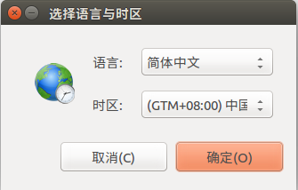  
②进入数据库安装向导，点击开始进行安装  
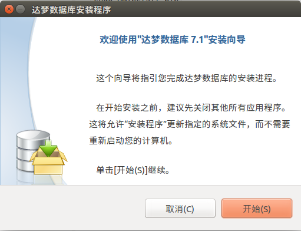  
接受授权进入下一步  
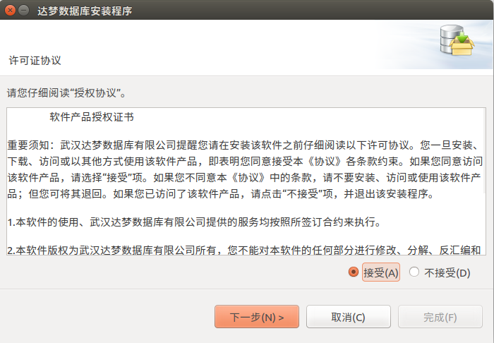  
③显示版本信息  
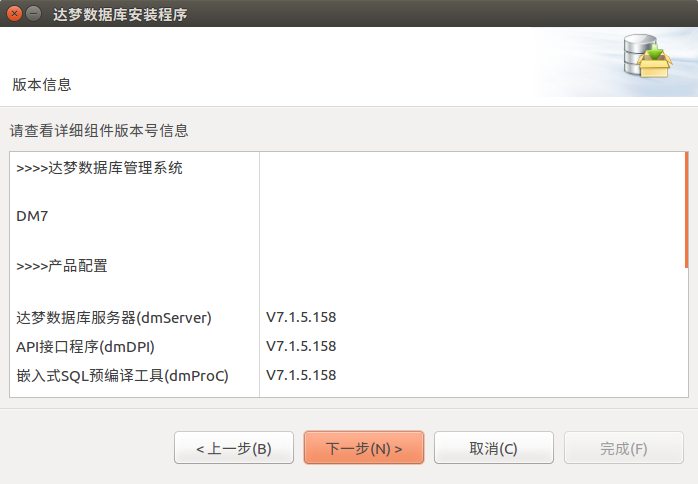  
④开发、试用版不需要输入key，不启用安全模块。直接下一步  
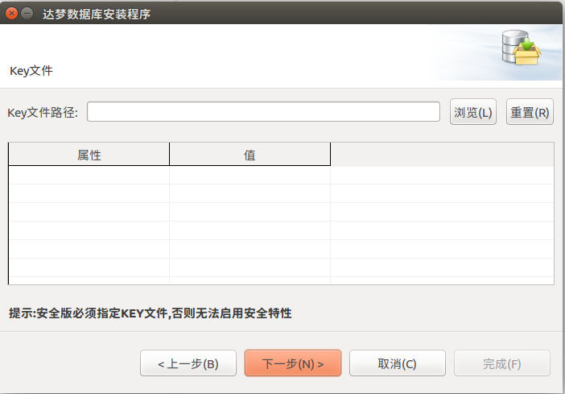  
⑤选择全部组件进行安装  
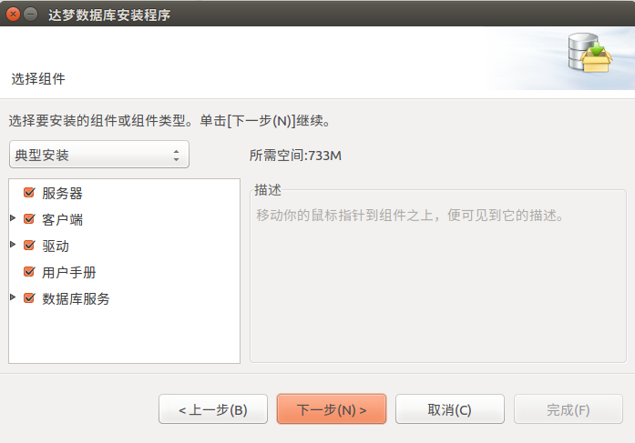  
⑥选择安装路径  
创建dmdbms目录，并将zhangwh指定为group和owner  
`sudo chown -R zhangwh dmdbms/`  
`sudo chgrp -R zhangwh dmdbms/`  
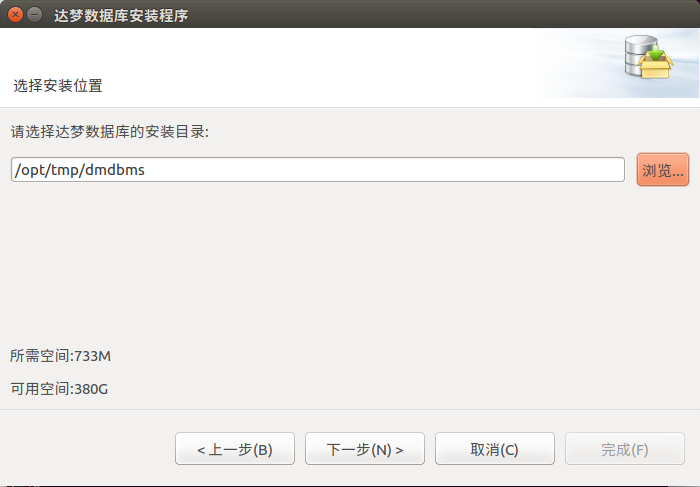  
⑦开始安装  
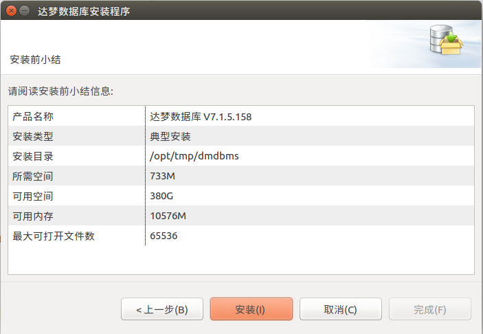  
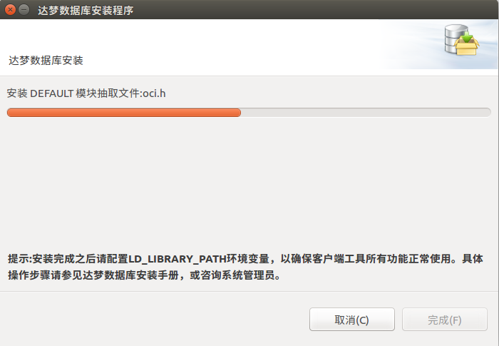  

##1.4 数据库初始化  
①在数据库安装完成后，需要初始化数据库  
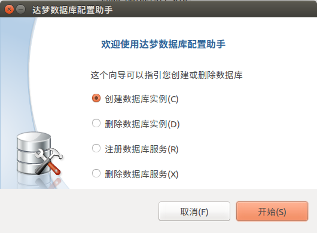  
②选择联机事务处理（OLTP）  
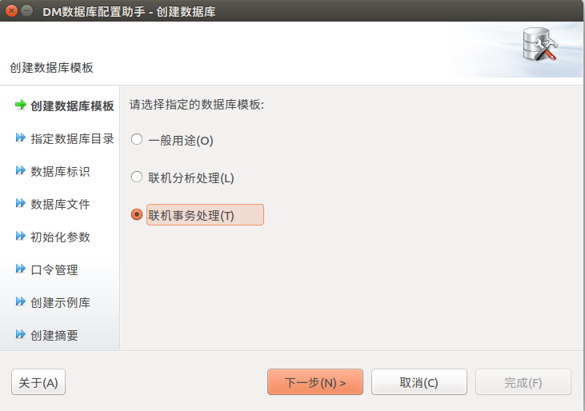  
③指定数据文件存放地址  
  
④指定数据库实例名  
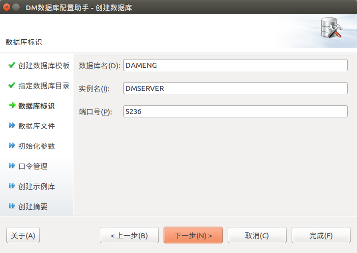  
⑤各种配置文件存放地址  
控制文件存放地址  
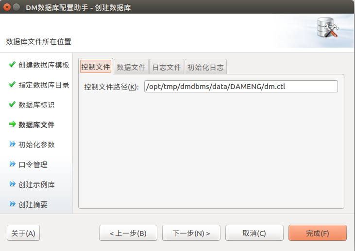  
数据文件存放地址  
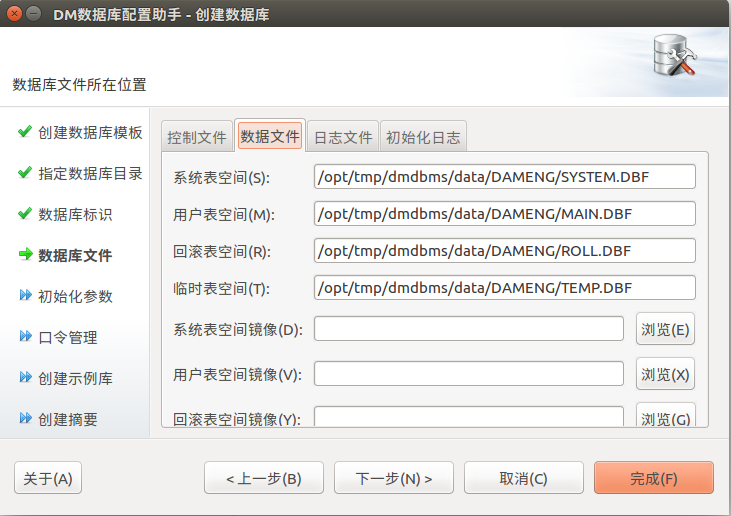  
日志文件存放地址  
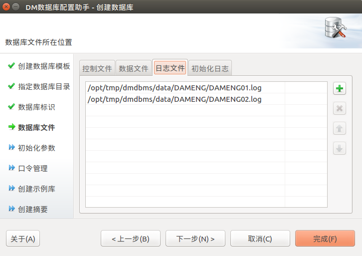  
初始化日志所在位置  
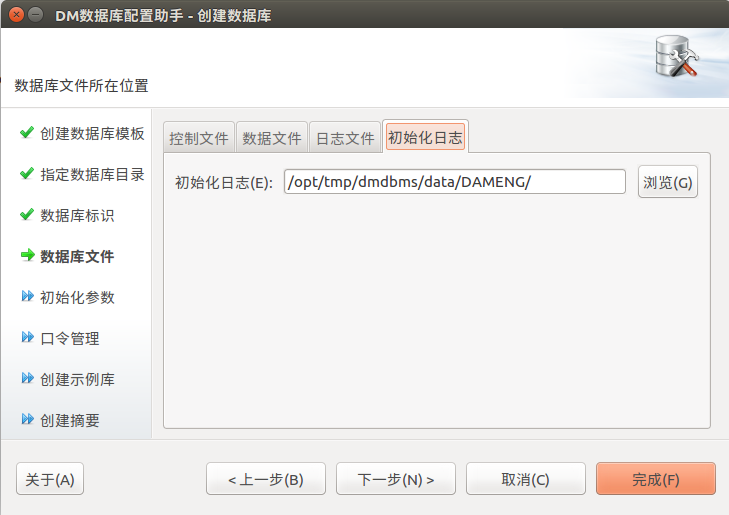  
下一步后，显示初始化参数  
~~~
数据库名:		DAMENG  
实例名:		DMSERVER  
数据库目录:		/opt/tmp/dmdbms/data  
端口:			5236  

控制文件:  
/opt/tmp/dmdbms/data/DAMENG/dm.ctl  
 
数据文件:  
/opt/tmp/dmdbms/data/DAMENG/SYSTEM.DBF  
/opt/tmp/dmdbms/data/DAMENG/ROLL.DBF  
/opt/tmp/dmdbms/data/DAMENG/TEMP.DBF  
/opt/tmp/dmdbms/data/DAMENG/MAIN.DBF  

日志文件:  
/opt/tmp/dmdbms/data/DAMENG/DAMENG01.log  
/opt/tmp/dmdbms/data/DAMENG/DAMENG02.log  

ELOG:  
/opt/tmp/dmdbms/data/DAMENG/  

簇大小:			16页  
页大小:			8K  
日志文件大小:		256M  
时区设置:			+08:00  
页面检查:			不启用  
字符集:			GB18030  
USBKEY-PIN:			
标识符大小写敏感:		是  
VARCHAR以字符为单位:	否  
空格填充模式:		否  
改进的字符串HASH算法:	是  
启用日志文件加密:		否  
启用全库加密:		否  
~~~

⑥管理员密码   
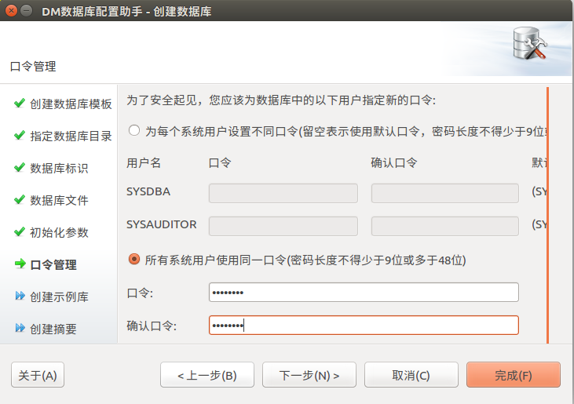  
密码为：dmpassword

⑦不创建实例  
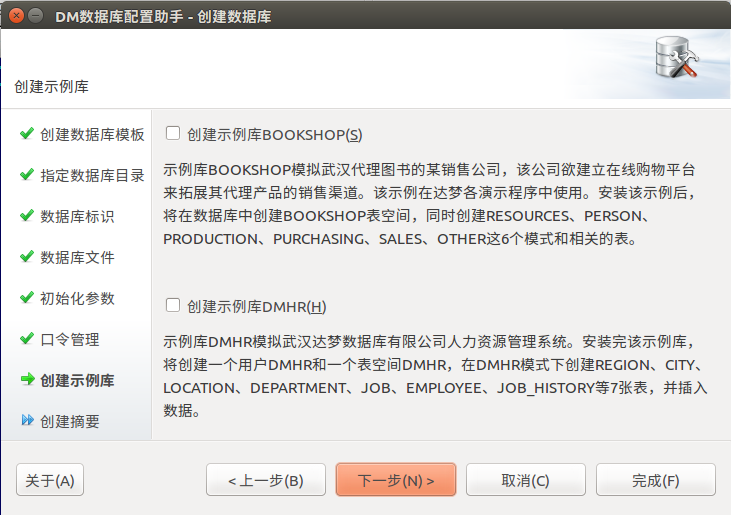  
创建摘要  
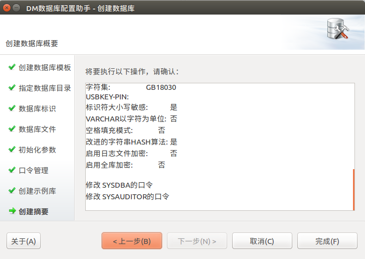  

数据库启动脚本  
`/opt/tmp/dmdbms/bin/dmserver /opt/tmp/dmdbms/data/DAMENG/dm.ini -noconsole`  

##1.5 数据库管理程序
数据库管理客户端存放位置：  
`/opt/tmp/dmdbms/desktop`   
数据库服务查看器：  
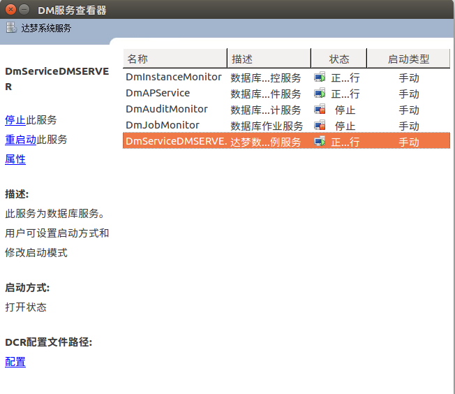  
`/opt/tmp/dmdbms/desktop/client`  
DM管理工具  
登录后即可使用DM管理工具  
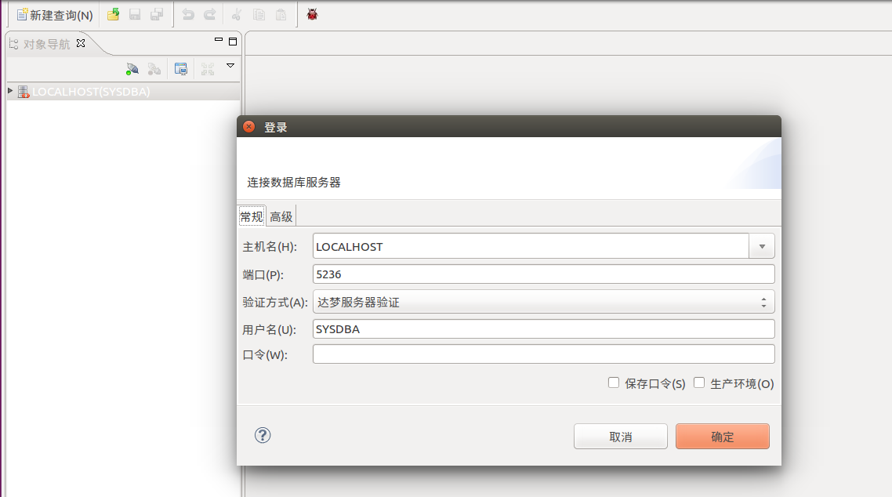  

