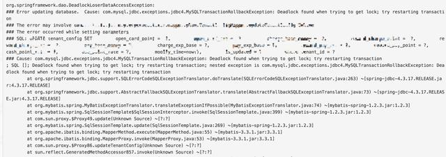
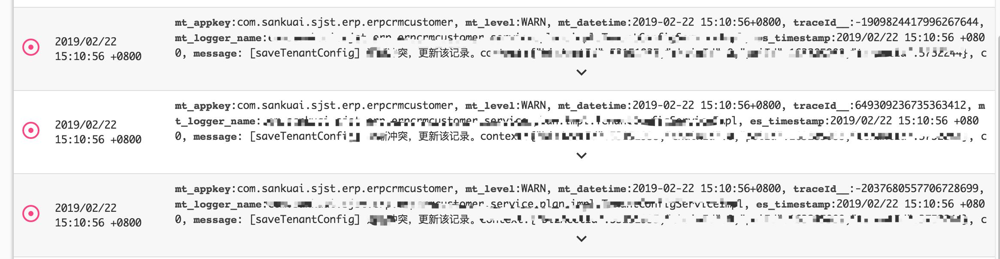
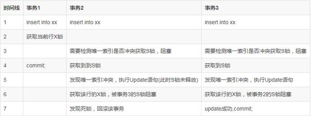
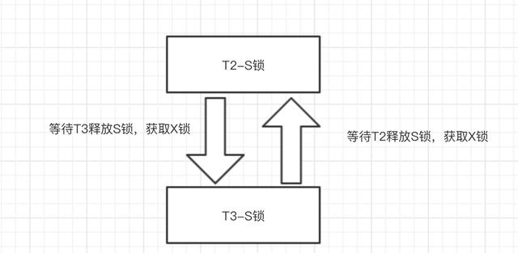

##1 Deadlock问题排查
【问题现象】
  
【问题处理】
1. 查看数据库状态
`SHOW ENGINE INNODB STATUS`
2. 死锁信息如下,sql信息进行了简单处理：

------------------------
LATEST DETECTED DEADLOCK
------------------------
2019-02-22 15:10:56 0x7eec2f468700
*** (1) TRANSACTION:
TRANSACTION 2660206487, ACTIVE 0 sec starting index read
mysql tables in use 1, locked 1
LOCK WAIT 2 lock struct(s), heap size 1136, 1 row lock(s)
MySQL thread id 31261312, OS thread handle 139554322093824, query id 11624975750 10.23.134.92 erp_crm__6f73 updating
/*id:3637ba36*/UPDATE tenant_config SET
 open_card_point = 0
 where tenant_id = 123
*** (1) WAITING FOR THIS LOCK TO BE GRANTED:
RECORD LOCKS space id 1322 page no 534 n bits 960 index uidx_tenant of table `erp_crm_member_plan`.`tenant_config` trx id 2660206487 lock_mode X locks rec but not gap waiting
*** (2) TRANSACTION:
TRANSACTION 2660206486, ACTIVE 0 sec starting index read
mysql tables in use 1, locked 1
3 lock struct(s), heap size 1136, 2 row lock(s)
MySQL thread id 31261311, OS thread handle 139552870532864, query id 11624975758 10.23.134.92 erp_crm__6f73 updating
/*id:3637ba36*/UPDATE tenant_config SET
 open_card_point = 0
 where tenant_id = 123
*** (2) HOLDS THE LOCK(S):
RECORD LOCKS space id 1322 page no 534 n bits 960 index uidx_tenant of table `erp_crm_member_plan`.`tenant_config` trx id 2660206486 lock mode S
*** (2) WAITING FOR THIS LOCK TO BE GRANTED:
RECORD LOCKS space id 1322 page no 534 n bits 960 index uidx_tenant of table `erp_crm_member_plan`.`tenant_config` trx id 2660206486 lock_mode X locks rec but not gap waiting
*** WE ROLL BACK TRANSACTION (1)
------------`

事务1执行Update语句的时候需要获取uidx_tenant这个索引再where条件上的X锁(行锁)，事务2执行同样的Update语句，也在uidx_tenant上面想要获取X锁(行锁)，然后就出现了死锁，回滚了事务。
死锁产生的条件：
1）互斥。  
2）请求与保持条件。  
3）不剥夺条件。  
4）循环等待。从日志上来看事务1和事务2都是取争夺同一行的行锁，和以往的互相循环争夺锁有点不同，怎么看都无法满足循环等待条件。既然从死锁日志中不能进行排查，那么就只能从业务代码和业务日志从排查。这段代码的逻辑如下:
~~~java
public int saveTenantConfig(PoiContext poiContext, TenantConfigDO tenantConfig) {
 try {
 return tenantConfigMapper.saveTenantConfig(poiContext.getTenantId(), poiContext.getPoiId(), tenantConfig);
 } catch (DuplicateKeyException e) {
 LOGGER.warn("[saveTenantConfig] 主键冲突，更新该记录。context:{}, config:{}", poiContext, tenantConfig);
 return tenantConfigMapper.updateTenantConfig(poiContext.getTenantId(), tenantConfig);
 }
 }
~~~
这段代码的意思是保存一个配置文件，如果发生了唯一索引冲突那么就会进行更新，当然这里可能写得不是很规范，其实可以用：
~~~
insert into ... 
on duplicate key update 
~~~
也可以达到同样的效果，但是就算用这个其实也会发生死锁。事务日志：
  
可以看见这里有三条同时发生的日志，说明都发生了唯一索引冲突进入了更新的语句，然后发生的死锁。

表结构：
~~~
CREATE TABLE `tenant_config` (
 `id` bigint(21) NOT NULL AUTO_INCREMENT,
 `tenant_id` int(11) NOT NULL,
 `open_card_point` int(11) DEFAULT NULL,
 PRIMARY KEY (`id`),
 UNIQUE KEY `uidx_tenant` (`tenant_id`)
) ENGINE=InnoDB DEFAULT CHARSET=utf8mb4 ROW_FORMAT=COMPACT
~~~
我们的tenant_id是用来做唯一索引，我们的插入和更新的where条件都是基于唯一索引来操作的。

~~~
UPDATE tenant_config SET
 open_card_point = 0
 where tenant_id = 123
~~~
到了这里感觉插入的时候对唯一索引加锁有关系。

上面我们说有三个事务进入update语句，为了简化说明这里我们只需要两个事务同时进入update语句即可，下面的表格展示了我们整个的发生过程:
  
【注】S锁是共享锁，X锁是互斥锁。一般来说X锁和S，X锁都互斥，S锁和S锁不互斥。

我们从上面的流程中看见发生这个死锁的关键需要获取S锁，为什么我们再插入的时候需要获取S锁呢？因为我们需要检测唯一索引？在RR隔离级别下如果要读取那么就是当前读,那么其实就需要加上S锁。这里发现唯一键已经存在，这个时候执行update就会被两个事务的S锁互相阻塞，从而形成上面的循环等待条件。

  
【注】在MVCC中，当前读和快照读的区别:当前读每次需要加锁（可以使共享锁或者互斥锁）获取到最新的数据，而快照读是读取的是这个事务开始的时候那个快照，这个是通过undo log去进行实现的

这个就是整个死锁的原因，能出现这种死锁的还有一个情况，就是同一时间来三个插入操作，其中先插入的那个事务如果最后回滚了，其余两个事务也会出现这种死锁。

【解决方案】
这里的核心问题是需要把S锁给干掉，这里有三个可供参考的解决方案:

- 将RR隔离级别，降低成RC隔离级别。这里RC隔离级别会用快照读，从而不会加S锁。
- 再插入的时候使用select * for update,加X锁，从而不会加S锁。
- 可以提前加上分布式锁，可以利用Redis,或者ZK等等

第一种方法不太现实，毕竟隔离级别不能轻易的修改。第三种方法又比较麻烦。所以第二种方法是最易实现的

【总结】
排查死锁这种问题的时候有时候光看死锁日志有时候会解决不了问题，需要结合整个的业务日志，代码以及表结构来进行分析，才能得到正确的结果。

