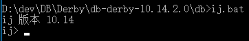
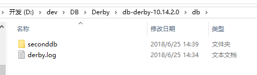

Apache Derby 是一个JAVA编写与平台无关的数据库引擎，它以 Java 类库的形式对外提供服务。  

##Derby连接  
- 将Derby数据库目录配置到环境变量path下
- 数据库存储路径
在Derby目录下创建一个db目录，用于存储数据库相关文件  
`cd /d D:\dev\DB\Derby\db-derby-10.14.2.0\db`  
- 服务启动
Windows环境下，在cmd窗口中执行startNetworkServer.bat  
  
- ij登录  
Windows环境下，在cmd窗口中执行ij.bat  
  
- 创建数据库
`CONNECT 'jdbc:derby://localhost:1527/seconddb;create=true';`  
带用户密码的语法`CONNECT 'jdbc:derby://localhost:1527/seconddb;create=true;user=root;password=123';`  
  
- 连接数据库
`CONNECT 'jdbc:derby://localhost:1527/seconddb;`  
也可以通过如下命令指定本地目录：
`connect 'jdbc:derby://localhost:1527/D:/dev/DB/Derby/db-derby-10.14.2.0/db/seconddb;create=true';`

