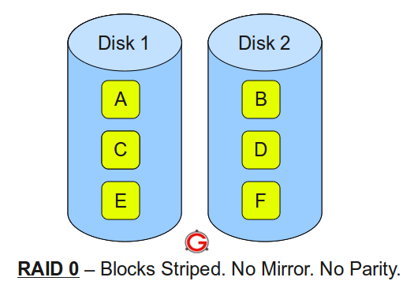
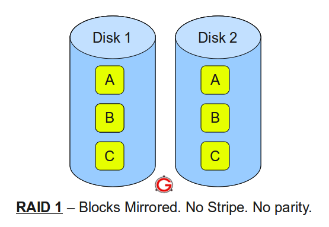
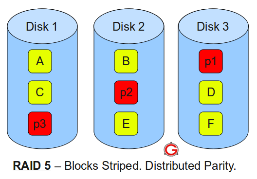
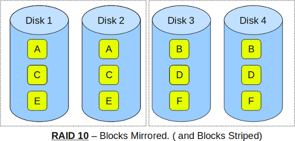

#RAID0 RAID1 RAID5 RAID10区别
RAID(Redundant Array of Independent Disk 独立冗余磁盘阵列)技术是加州大学伯克利分校1987年提出，最初是为了组合小的廉价磁盘来代替大的昂贵磁盘，同时希望磁盘失效时不会使对数据的访问受损 失而开发出一定水平的数据保护技术。RAID就是一种由多块廉价磁盘构成的冗余阵列，在操作系统下是作为一个独立的大型存储设备出现。RAID可以充分发 挥出多块硬盘的优势，可以提升硬盘速度，增大容量，提供容错功能够确保数据安全性，易于管理的优点，在任何一块硬盘出现问题的情况下都可以继续工作，不会 受到损坏硬盘的影响。  

RAID 为 Redundant Array of Indepent Disks (独立磁盘冗余阵列) 的缩写，最常用的四种RAID为 RAID 0、RAID 1、RAID 5、RAID 10，下面以图解的方式解释这四种RAID的特点和区别。  

在后面的图示中，用到以下标识：

- A,B,C,D,E和F 表示数据块
- p1,p2,p3 表示奇偶校验信息块

##RAID 0
  
RAID 0的特点：

- 最少需要两块磁盘
- 数据条带式分布
- 没有冗余，性能最佳(不存储镜像、校验信息)
- 不能应用于对数据安全性要求高的场合

##RAID 1
  
以下为RAID 1的特点：

- 最少需要2块磁盘
- 提供数据块冗余
- 性能好

##RAID 5
  
RAID 5特点：

- 最少3块磁盘
- 数据条带形式分布
- 以奇偶校验作冗余
- 适合多读少写的情景，是性能与数据冗余最佳的折中方案
 
##RAID 10
  
RAID 10(又叫RAID 1+0)特点：

- 最少需要4块磁盘
- 先按RAID 0分成两组，再分别对两组按RAID 1方式镜像
- 兼顾冗余(提供镜像存储)和性能(数据条带形分布)
- 在实际应用中较为常用

RAID 0即Data Stripping（数据分条技术）。整个逻辑盘的数据是被分条（stripped）分布在多个物理磁盘上，可以并行读/写，提供最快的速度，但没有冗余能力。要求至少两个磁盘。我们通过RAID 0可以获得更大的单个逻辑盘的容量，且通过对多个磁盘的同时读取获得更高的存取速度。RAID 0首先考虑的是磁盘的速度和容量，忽略了安全，只要其中一个磁盘出了问题，那么整个阵列的数据都会不保了。

**问：RAID0至少几块盘？**
答：RAID0最少要两块硬盘才能实现。 

RAID 1
RAID 1，又称镜像方式，也就是数据的冗余。在整个镜像过程中，只有一半的磁盘容量是有效的（另一半磁盘容量用来存放同样的数据）。同RAID 0相比，RAID 1首先考虑的是安全性，容量减半、速度不变。

**问：RAID1至少几块盘？**
答：RAID1最少要两块硬盘才能实现。 

RAID 0+1(RAID 10)
为了达到既高速又安全，出现了RAID 10（或者叫RAID 0+1），可以把RAID 10简单地理解成由多个磁盘组成的RAID 0阵列再进行镜像。

**问：RAID0+1至少几块硬盘才能实现？**
答：RAID0+1至少需要4块盘。 

RAID 3和RAID 5
RAID 3和RAID 5都是校验方式。RAID 3的工作方式是用一块磁盘存放校验数据。由于任何数据的改变都要修改相应的数据校验信息，存放数据的磁盘有好几个且并行工作，而存放校验数据的磁盘只有一个，这就带来了校验数据存放时的瓶颈。RAID 5的工作方式是将各个磁盘生成的数据校验切成块，分别存放到组成阵列的各个磁盘中去，这样就缓解了校验数据存放时所产生的瓶颈问题，但是分割数据及控制存放都要付出速度上的代价。

**问：RAID5需要几块硬盘?为什么损失一个盘的容量?**
答：至少3块。
RAID5把数据和相对应的奇偶校验信息存储到组成RAID5的各个磁盘上，并且奇偶校验信息和相对应的数据分别存储于不同的磁盘上，其中任意N-1块磁盘上都存储完整的数据，也就是说有相当于一块磁盘容量的空间用于存储奇偶校验信息。因此当RAID5的一个磁盘发生损坏后，不会影响数据的完整性，从而保证了数据安全。当损坏的磁盘被替换后，RAID还会自动利用剩下奇偶校验信息去重建此磁盘上的数据，来保持RAID5的高可靠性。

类型|读写性能|安全性|磁盘利用率|成本|应用方面
----|------|------|---------|----|------
RAID0|最好（因并行性而提高）|最差（完全无安全保障）|最高（100%）|最低|个人用户
RAID1|读和单个磁盘无分别，写则要写两边|最高（提供数据百分之百备份）|差（50%）|最高|适用于存放重要数据，如服务器和数据存储等领域
RAID5|读：RAID5=RAID0 写：RAID5＜对单个磁盘进行写入操作（多了一个奇偶校验信息写入）|RAID5<RAID1|RAID5>RAID1|RAID5<RAID1|是一种存储性能、数据安全和存储成本兼顾的存储解决方案
RAID10|读：RAID10=RAID0   写：RAID10=RAID1|RAID10 = RAID1|RAID10=RAID1(50%)|RAID10=RAID1|集合了RAID0、RAID1的优点，但是空间上由于使用镜像，而不是类似RAID5的“奇偶校验信息”，磁盘利用率一样是50%
