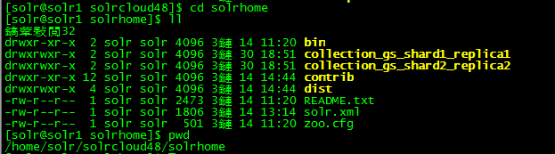

#Solr Admin管理Collection
##1 Solr Cloud中删除Collection
1）在Url中删除Collection  
`http://192.168.1.75:8585/solr/admin/collections?action=DELETE&name=collection_gs`
2）在SolrCloud的各个节点上删除在Solr home下Collection产生的以collection名称开头的目录  
  
如图，删除collectin_gs_shard1_replica1及collectin_gs_shard1_replica2  
` rm -rf collection_gs_shard*`  
【注意】需要同时删除SolrCloud各个集群节点上的文件夹  
在重新创建Collection时，如果不能及时删除之前创建的collection core就会出现如下错误：  
>Could not create a new core in /home/solr/solrcloud48/solrhome/collection_gs_shard1_replica2/as another core is already defined there

##2 创建Collection
1）将Solr的配置文件上传到Zookeeper
在SolrCloud的文件夹下创建一个Collection相关配置的目录，该目录可以在Solr的安装包中找到样例
java -classpath .:/home/solr/solrcloud48/tomcat7/webapps/solr/WEB-INF/lib/* org.apache.solr.cloud.ZkCLI -zkhost 192.168.1.75:1181,192.168.1.78:1181,192.168.1.76:1181 -cmd upconfig -confdir /home/solr/solrcloud48/collection_gs/conf -confname collection_gs_conf

2）将配置文件关联到Solr
java -classpath .:/home/solr/solrcloud48/tomcat7/webapps/solr/WEB-INF/lib/* org.apache.solr.cloud.ZkCLI -zkhost 192.168.1.75:1181,192.168.1.78:1181,192.168.1.76:1181 org.apache.solr.cloud.ZkCLI -cmd linkconfig -collection collection_gs -confname collection_gs_conf

3)创建collection
`curl 'http://192.168.1.76:8585/solr/admin/collections?action=CREATE&name=collection_gs&numShards=16&replicationFactor=2&maxShardsPerNode=50'`
也可在浏览器中执行如下命令：  
`http://192.168.1.76:8585/solr/admin/collections?action=CREATE&name=collection_gs&numShards=16&replicationFactor=2&maxShardsPerNode=50`  

