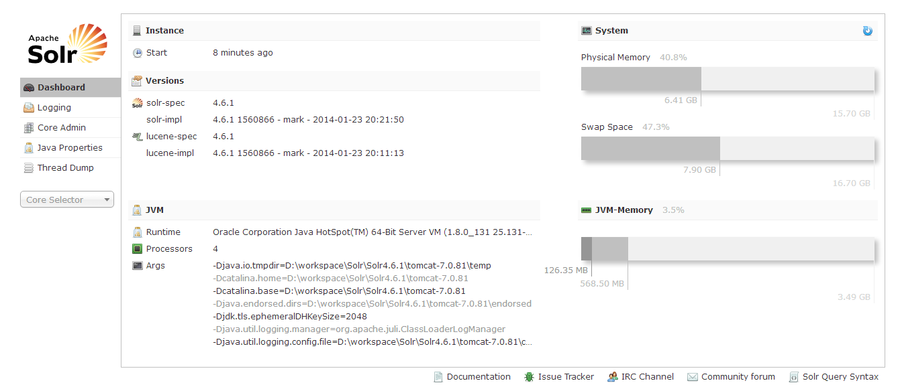
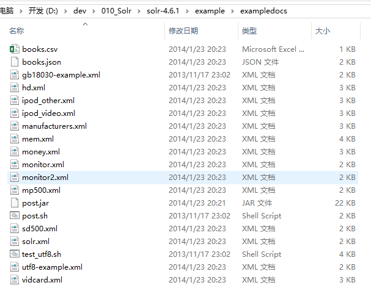

#Solr部署实施（4.6.1）
[TOC]

##1 Solr单机环境搭建
1）编辑tomcat-users.xml
~~~xml
 <role rolename="manager-gui"/>
 <role rolename="admin-gui"/>
 <user username="admin" password="admin" roles="admin-gui"/>
 <user username="tomcat" password="tomcat" roles="manager-gui"/>
~~~

2）启动Tomcat，在Tomcat的conf目录下生成Catalina/localhost目录

3）修改conf\server.xml，添加URIEncoding="UTF-8"
~~~xml
<Connector port="8080" protocol="HTTP/1.1"
           connectionTimeout="20000"
           redirectPort="8443"
           URIEncoding="UTF-8"	/>
~~~

4）下载Solr4.6.1，解压Solr4.6.1。目录结构如下：
  
将dist目录下solr-4.6.1.war拷贝到solr的部署位置，并且改名为solr.war  

5）在conf\Catalina\localhost下添加solr.xml，指向Solr服务的地址，内容如下：
~~~xml
<?xml version="1.0" encoding="UTF-8"?>
<Context docBase="D:\workspace\Solr\Solr4.6.1\solr.war" debug="0" crossContext="true" >
   <Environment name="solr/home" type="java.lang.String" value="D:\workspace\Solr\Solr4.6.1\solrconf" override="true" />
</Context>
~~~
solr.xml中配置项说明：
- docBase：solr.war实际存放位置
- solr/home：solr存放配置文件的位置，如：schema.xml、solrconf.xml等配置存放的位置。一般情况下都从solr的sample目录下拷贝solr文件夹即可

6）尝试运行tomcat  
运行tomcat后，solr并未正常运行，这由于solr.war包依赖的jar包并没有正常导入。需要手工从，solr4.6.1的解压目录中找到【example\lib\ext】将其中的jar包拷贝到tomcat的webapps目录下生成的solr文件夹下的【WEB-INF\lib】目录下；  
由于已经拷贝log4j.jar需要将相关的log4j.properties也拷贝到solr文件夹下的【classes】下，如果没有classes可以手工生成一个，将【example\resources】的log4j.properties拷贝到classes下。内容如下。一般情况下只需要修改solr.log属性，将其指向想要存放日志的目录。  
~~~
#  Logging level
solr.log=D:/workspace/Solr/Solr4.6.1/logs
log4j.rootLogger=INFO, file, CONSOLE

log4j.appender.CONSOLE=org.apache.log4j.ConsoleAppender

log4j.appender.CONSOLE.layout=org.apache.log4j.PatternLayout
log4j.appender.CONSOLE.layout.ConversionPattern=%-4r [%t] %-5p %c %x \u2013 %m%n

#- size rotation with log cleanup.
log4j.appender.file=org.apache.log4j.RollingFileAppender
log4j.appender.file.MaxFileSize=4MB
log4j.appender.file.MaxBackupIndex=9

#- File to log to and log format
log4j.appender.file.File=${solr.log}/solr.log
log4j.appender.file.layout=org.apache.log4j.PatternLayout
log4j.appender.file.layout.ConversionPattern=%-5p - %d{yyyy-MM-dd HH:mm:ss.SSS}; %C; %m\n

log4j.logger.org.apache.zookeeper=WARN
log4j.logger.org.apache.hadoop=WARN

# set to INFO to enable infostream log messages
log4j.logger.org.apache.solr.update.LoggingInfoStream=OFF

~~~

7）再次运行tomcat，solr启动成功  
  

##2 数据初始化
1）修改solr的schema.xml将不必要的字段、数据类型均去掉  
如果solr/home的配置是从sample目录下拷贝而来，schema.xml在【collection1\conf】目录下  

注意：  
- 保留`<uniqueKey>id</uniqueKey>`，该字段相当于主键  

2）通过post.jar工具导入数据  
在solr解压目录下【example\exampledocs】有post.jar以及相关的数据文件。  
  

通过以下命令，能够快速导入数据到solr下：
`java -Durl=http://localhost:8080/solr/collection1/update -jar post.jar -Dcommit=yes D:\hd.xml`  

说明：  
- hd.xml在【example\exampledocs】目录下，与schema.xml匹配  
- post.jar默认情况下，使用xml格式上传数据  

  

