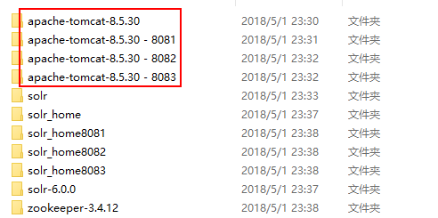
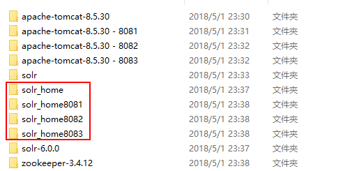
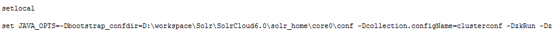
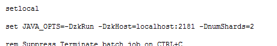
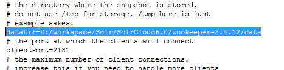
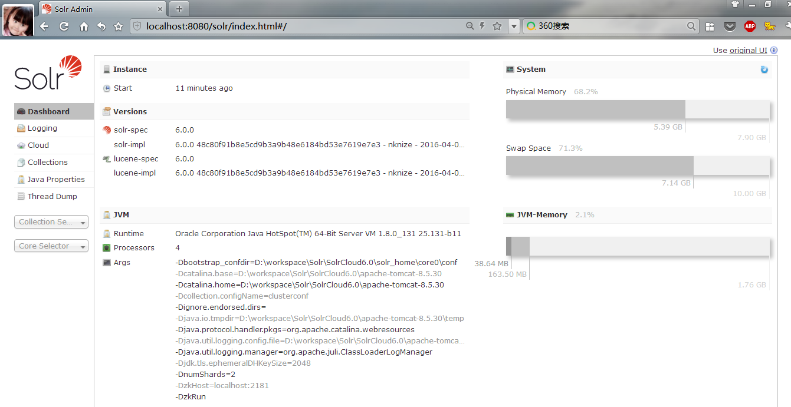
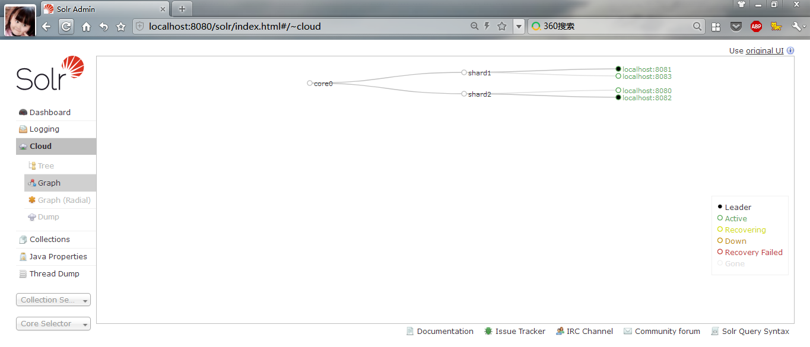
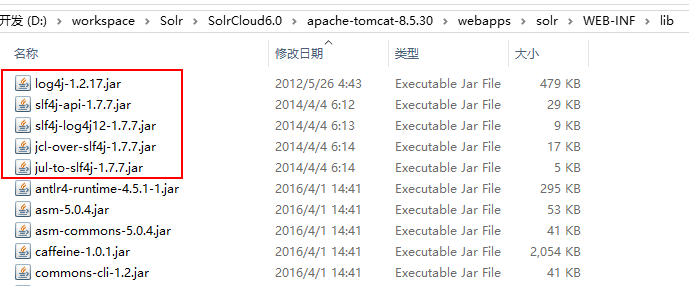

[TOC]

##Solr6.0部署SolrCloud
###1 环境准备
下载如下版本的软件备用
- Solr 6.0
- Tomcat 8.5
- Java 1.8+
- zookeeper-3.4.12.tar.gz

###2 创建Tomcat集群环境
####2.1 Tomcat下部署solr Web工程
复制Tomcat三份，形成如下结构：  
  
在Solr6.0的解压包中寻找solr控制台的Web工程。Solr6.x版本后，已经不提供专门的war包，需要自行在解压包中寻找solr的Web工程。其路径为：  
[solr-6.0.0\server\solr-webapp\webapp]  
将webapp下的文件拷贝到solr文件夹下，形成一个solr工程。拷贝到Tomcat的webapp目录下  

####2.2 构建solr_home
为使solr正常工作，需要将solr解压目录下[solr-6.0.0\server\solr]目录下的内容拷贝到solr_home下，由于有4个Tomcat的solr工程，需要拷贝4个solr_home，结构如下：
  

####2.3 修改webapp中web项目solr的配置
修改webapp目录下的solr的web.xml
增加入口，将不同Tomcat目录下的web工程指向不同的solr_home
~~~xml
    <env-entry>
       <env-entry-name>solr/home</env-entry-name>
       <env-entry-value>D:/workspace/Solr/SolrCloud6.0/solr_home</env-entry-value>
       <env-entry-type>java.lang.String</env-entry-type>
    </env-entry>
~~~
具体Tomcat与solr_home对应关系如下：
Tomcat|Solr Home
-----|------
apache-tomcat-8.5.30|solr_home
apache-tomcat-8.5.30 - 8081|solr_home8081
apache-tomcat-8.5.30 - 8082|solr_home8082
apache-tomcat-8.5.30 - 8083|solr_home8083

####2.4 修改Tomcat的端口
由于Tomcat数量众多，需要确保各端口都不能冲突，需要修改Tomcat的server.xml，具体端口配置情况如下：
Tomcat|SHUTDOWN|Connector|AJP
-----|-------|-----------|----
apache-tomcat-8.5.30|8005|8080|8009
apache-tomcat-8.5.30 - 8081|8105|8081|8109
apache-tomcat-8.5.30 - 8082|8205|8082|8209
apache-tomcat-8.5.30 - 8083|8305|8083|8309

####2.4 修改Tomcat的Catalina.bat的启动脚本  
在Tomcat的Catalina.bat启动脚本中增加指定solr_home及Zookeeper的脚本
  
以下是leader节点的启动脚本增加如下脚本：  
~~~
set JAVA_OPTS=-Dbootstrap_confdir=D:\workspace\Solr\SolrCloud6.0\solr_home\core0\conf -Dcollection.configName=clusterconf -DzkRun -DzkHost=localhost:2181 -DnumShards=2
~~~
- **Dbootstrap_confdir**：ZooKeeper需要准备一份集群配置的副本，这个参数是告诉SolrCloud这些配置是放在哪里，同时作为整个集群共用的配置文件。 
- **Dcollection.configName**：指定你的配置文件上传到zookeeper后的名字，建议和你所上传的核心名字一致，这样容易识别。 
- **DzkRun**：在Solr中启动一个内嵌的zooKeeper服务器，该服务会管理集群的相关配置。 
- **DzkHost**：跟上面参数的含义一样，允许配置一个ip和端口来指定用哪个Zookeeper服务器进行协调。 
- **DnumShards=2**：配置需要把你的数据分开到多少个shard中 

其他follower节点的启动脚本增加如下脚本：  
  
~~~
set JAVA_OPTS=-DzkRun -DzkHost=localhost:2181 -DnumShards=2
~~~

###3 ZooKeeper配置
在ZooKeeper的的conf目录下，修改zoo.cfg，增加dataDir属性，指向本地目录
  

###4 SolrCloud的启动
1. 启动ZooKeeper
zookeeper-3.4.12\bin下双击：zkServer.cmd，运行Zookeeper  
2. 分别启动各Tomcat  
apache-tomcat-8.5.30\bin下双击：startup.bat，运行Tomcat。8081、8082、8083的Tomcat也一样。
3. 访问http://localhost:8080/solr/index.html验证集群构建情况
6.x版本SolrCloud与4.x版本的SolrCloud不同，http://localhost:8080/solr/访问将出现系统404异常
  
  

###5 问题对应
####5.1 Tomcat启动异常
在Tomcat启动时，会没有任何日志输出的情况启动失败，这是因为solr默认需要log4j、slf4j对日志进行输出，缺少这些jar包工程可能会出错  
【对应】需要将[solr-6.0.0\server\lib\ext]目录下的jar文件，拷贝到Tomcat的webapp下solr web工程的lib包下。
- jcl-over-slf4j-1.7.7.jar
- jul-to-slf4j-1.7.7.jar
- log4j-1.2.17.jar
- slf4j-api-1.7.7.jar
- slf4j-log4j12-1.7.7.jar

  

