>这篇文章是关于Elasticsearch性能指标的4部分系列的第1部分。在这篇文章中，我们将介绍Elasticsearch如何工作，并探索您应该监控的关键指标。第2部分解释了如何收集Elasticsearch的性能指标，第3部分将介绍如何使用Datadog来监视Elasticsearch，第4部分将讨论如何解决五个常见的Elasticsearch问题。  

##1 什么是Elasticsearch？
Elasticsearch是一个开源的分布式文档存储和搜索引擎，可以实时存储和检索数据结构。由Shay Banon开发并在2010年发布，它非常依赖Apache Lucene，它是一种用Java编写的全文搜索引擎。

Elasticsearch以结构化JSON文档的形式表示数据，可以通过RESTful API或者PHP，Python和Ruby等语言的Web客户端来访问并做全文搜索。今天，许多公司，包括维基百科，eBay，GitHub和Datadog都使用它来即时存储，搜索和分析大量的数据。

##2 Elasticsearch的Elements
在开始探索性能指标之前，让我们来看看Elasticsearch的工作原理。在Elasticsearch中，群集由一个或多个节点组成，如下所示：
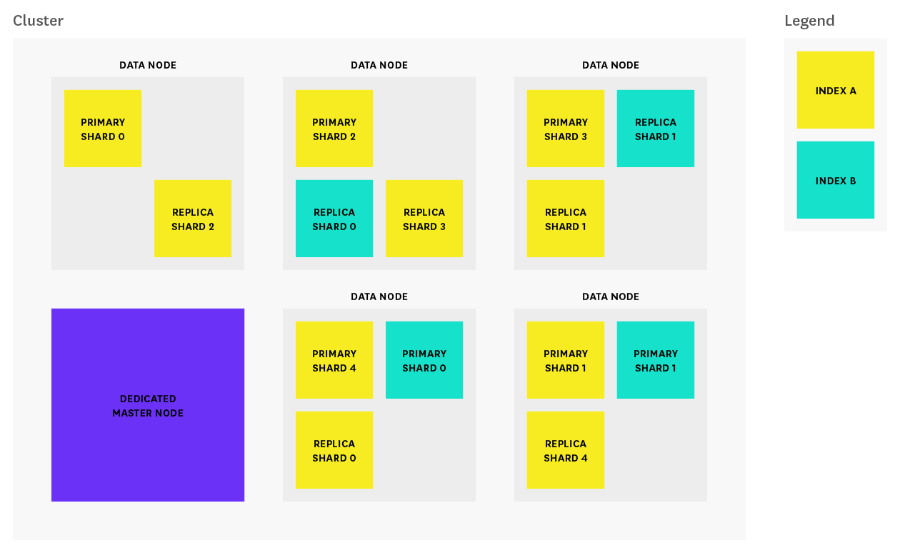
每个节点是Elasticsearch的单一运行实例，其elasticsearch.yml配置文件指定它属于哪个集群（cluster.name）以及它可以是什么类型的节点。配置文件中设置的任何属性（包括集群名称）也可以通过命令行参数指定。上图中的集群由一个专用主​​节点和五个数据节点组成。  

Elasticsearch中最常见的三种节点有：
- **Master备选节点：**默认情况下，除非另有说明，否则每个节点均为master备选节点。每个集群都会自动从所有主资源节点中选择一个主节点。如果当前主节点遇到故障（例如停电，硬件故障或内存不足错误），则在符合资格的主节点间选举出新的主节点。主节点负责协调集群任务，如跨节点分发shards，以及创建和删除索引。任何符合主要条件的节点也可以用作数据节点。然而，在较大的集群中，用户可能会启动不存储任何数据的专用主节点（通过添加）node.data: false到配置文件），以提高可靠性。在使用率高的场景下，将master role从data node上移开，可以帮助确保总是有足够的资源分配给那些只能由master node处理的任务。（避免高负载的data node去处理master node的任务）
- **数据节点：**默认情况下，每个节点都是数据节点，并且以分片（shards）的形式存储数据并执行与索引，搜索和聚合数据相关的操作。在较大的集群中，您可以选择通过添加node.master: false配置文件来创建专用数据节点，确保这些节点具有足够的资源来处理与数据相关的请求，而不需要承担与集群相关的管理任务的额外工作负载。
-** 客户端节点：**如果设置node.master和node.data false，则该节点为client node，其目的是作为一个负载平衡器，可以帮助优化路径索引和搜索请求。客户端节点有助于承担部分搜索工作负载，以便数据和主节点可以专注于其核心任务。根据用例，客户机节点可能不是必需的，因为数据节点能够自己处理请求路由。但是，如果您的搜索/索引工作负载足够重，以至于需要专用客户机节点来帮助处理路由请求，那么将客户端节点添加到集群就很有意义。

##3 Elasticsearch如何组织数据
在Elasticsearch中，相关数据通常存储在相同的索引中，每个索引包含一组JSON格式的相关文档。Elasticsearch的全文搜索秘诀是Lucene的倒排索引。索引文档时，Elasticsearch会自动为每个字段进行分词，然后创建一个反向索引; 反向索引将分词器分出来的词（terms）映射到包含这些术语的文档。

索引被存储在一个或多个主分片，和零个或多个副本分片中，并且每个分片是一个完整的Lucene实例，就像一个迷你的搜索引擎。
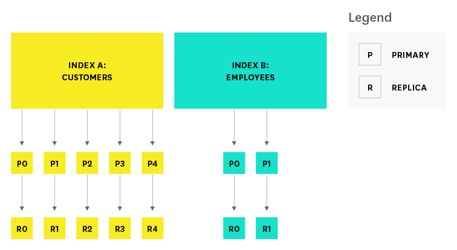  

创建索引时，可以指定主分片数，以及每个主分片的副本数。默认值为每个索引五个主分片，每个主要数据为一个副本。创建索引后，无法更改主碎片数量，因此请仔细选择，否则您可能需要稍后重建索引。而副本数则可以根据需要稍后更新。为了防止数据丢失，主节点确保每个副本分片不会与主分片分配在相同的节点上。

##4 Elasticsearch的关键性能指标  
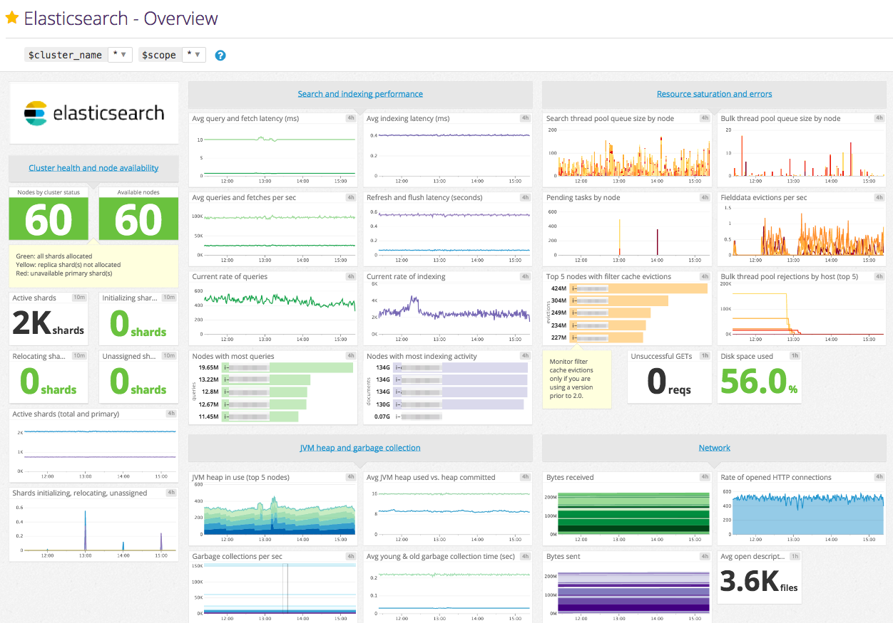  

Elasticsearch提供了大量的指标，可以帮助您检测到问题的迹象，并在遇到诸如不可靠节点，内存不足错误以及长时间垃圾收集时间等问题时采取行动。要监测的几个关键领域是：
- 搜索和索引性能
- 内存和垃圾收集
- 主机级别的系统和网络指标
- 集群健康和节点可用性
- 资源饱和度和错误

本文引用了Monitoring 101系列的标准术语，它为度量、收集和警报提供了一个框架。

所有这些指标都可以通过Elasticsearch的API以及Elastic的Marvel和通用监控服务（如Datadog）等单一目的监控工具访问。有关如何使用所有这些方法收集这些指标的详细信息，请参阅本系列的第2部分。

##5 搜索效果指标
搜索请求是Elasticsearch中的两个主要请求类型之一。（另一个是索引请求）。这些请求有时类似于传统数据库系统中的读写请求。Elasticsearch提供了与搜索过程的两个主要阶段（查询和获取）相对应的度量。下图显示了从开始到结束的搜索请求的路径。
1. 客户端向节点2发送搜索请求。  
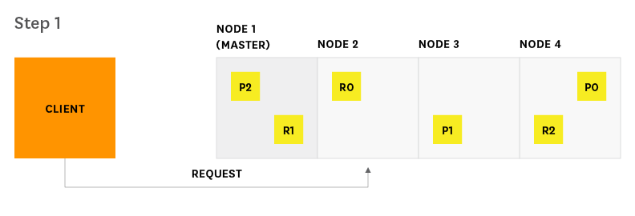  
2. 节点2（协调节点）将查询发送到索引中每个分片（主分片或副本）  
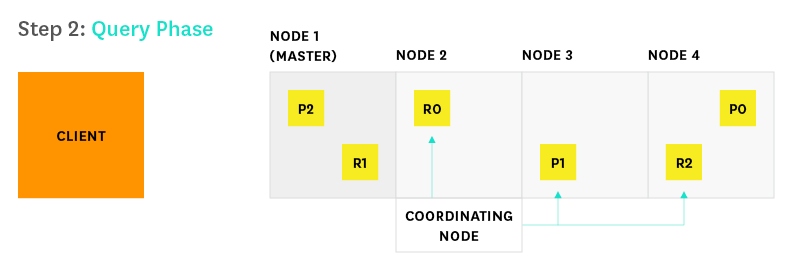  
3. 每个接收到请求的分片本地执行查询（每个分片都是一个lucene实例）并将结果传递给节点2.节点2将其排序并编译成全局优先级队列  
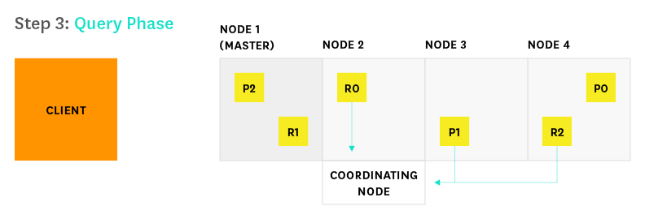  
4. 每个接收到请求的分片本地执行查询（每个分片都是一个lucene实例）并将结果传递给节点2.节点2将其排序并编译成全局优先级队列。  
  
5. 每个分片加载文档并将其返回到节点2  
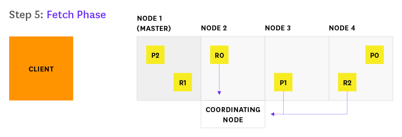  
6. 节点2将搜索结果传递给客户端  
  

如果您使用Elasticsearch主要用于搜索，或者如果搜索是面向客户的主要功能，那么，您应该监视查询延迟并在超过阈值时采取行动。因此监视关于查询和提取的相关指标，对于帮助您确定搜索性能随时间的变化情况是很重要的。例如，您可能希望跟踪查询请求的尖峰和长期增长，以便您可以准备好调整配置以优化来获得更好的性能和可靠性。  

度量描述|名称|公制型
---|---|---
查询总数|indices.search.query_total|吞吐量
查询总时间|indices.search.query_time_in_millis|性能
当前正在进行的查询数量|indices.search.query_current|吞吐量
提取总数|indices.search.fetch_total|吞吐量
花费在提取上的总时间|indices.search.fetch_time_in_millis|性能
当前正在进行的提取数|indices.search.fetch_current|吞吐量

搜索性能指标的要点：
- **Query load：**监视当前正在进行的查询数量可以让您了解群集在任何特定时刻处理的请求数量，任何异常的尖峰或陡峭都可能指出潜在的问题。另外，您可能还想监视搜索线程池队列的大小，稍后我们将在本文中进一步解释。
- **Query latency：**虽然Elasticsearch没有明确提供此度量标准，但是监视工具可以帮助您使用可用的度量来计算平均查询延迟，方法是以定期的时间间隔对总查询次数和总经过时间进行抽样。如果延迟超过阈值，请设置警报，如果触发，请查找潜在的资源瓶颈，或调查是否需要优化查询。
- **Fetch latency：**搜索过程的第二部分，即提取阶段通常比查询阶段花费的时间少得多。如果您注意到这一指标不断增加，这可能是因为缓慢的磁盘，文档的额外加工（比如，高亮显示搜索结果中的相关文本等）或请求太多结果。

##6 索引性能指标
索引请求类似于传统数据库系统中的写入请求。如果您的Elasticsearch工作量很重，那么监控和分析elasticsearch更新索引的效率是非常重要的。在了解指标之前，让我们来探索Elasticsearch更新索引的过程。当新信息添加到索引中或现有信息被更新或删除时，索引中的每个分片将通过两个进程进行更新：refresh(更新到内存中)和flush（更新到硬盘上）。

###6.1 索引refresh
新索引的文档不能立即被搜索到。首先，它们被写入一个内存中的缓冲区，它们等待下一次索引刷新，默认情况下每秒刷新一次。刷新过程（使新索引的文档可搜索）：从内存缓冲区（in-memory buffer）中创建新的内存段（segment），然后清空缓冲区，如下所示。
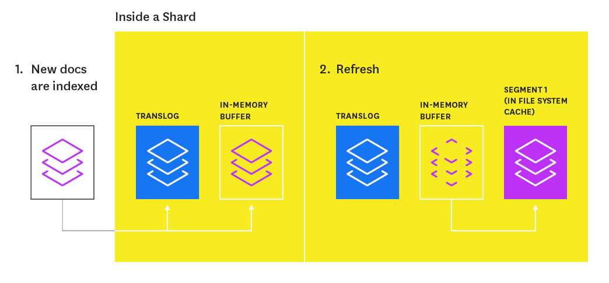

索引的分片（shard）由多个片段(segment)组成。segment是Lucene的核心数据结构，其本质上是一个用于存储索引（index）增量的集合。这些段是在每次刷新时创建的，随后在后台合并，以确保资源的有效使用（每个段实际上是以文件的形式存储在磁盘上，使用文件句柄，内存和CPU）。

分段可以看作是将词（terms）映射到包含这些术语的文档的小型倒排索引。每次搜索索引时，必须搜索每个分片的primary或replica版本，依次搜索该分片中的每个片段(segment)。
分段是不可变的，因此更新文档意味着：
- 在刷新过程中将信息写入新的段
- 将旧信息标记为已删除

当过时的段与其他段合并时，旧信息最终被删除。

###6.2 索引flush
在将新建索引的文档添加到内存缓冲区的同时，它们也会被写入到分片的translog：一个持久化的，顺序写的，只能追加的事务日志。每隔30分钟，或者每当translog达到最大大小（默认为512MB）时，将触发flush。在flush期间，刷新内存缓冲区中的所有文档（存储在新的段中），然后将所有内存中的段都提交到磁盘，并且清除translog。

translog有助于防止节点发生故障时的数据丢失。它旨在帮助分片恢复在flush间隔之间可能已经丢失的数据。日志每5秒提交一次磁盘或每次成功的索引，删除，更新或批量请求（以先到者为准）也会触发提交。

Flush过程如下图所示：
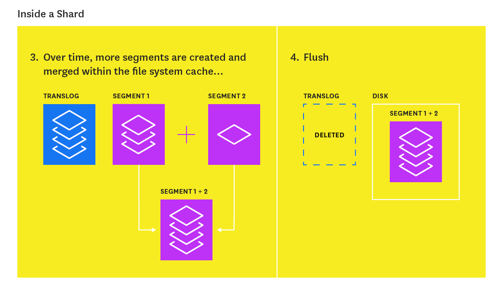
Elasticsearch提供了许多指标，可用于评估索引性能并优化更新索引的方式。  

度量描述|	名称|公制型
---|---|---
索引的文件总数|indices.indexing.index_total|吞吐量
索引文档总时间|indices.indexing.index_time_in_millis|性能
目前索引的文件数量|indices.indexing.index_current|吞吐量
索引刷新总数|	indices.refresh.total|吞吐量
刷新指数的总时间|indices.refresh.total_time_in_millis|性能
索引刷新总数到磁盘|indices.flush.total|吞吐量
将索引刷新到磁盘上的总时间|	indices.flush.total_time_in_millis|	性能

##7 索引要观看的性能指标
**索引延迟：** Elasticsearch不会直接暴露此特定指标，但监控工具可以帮助您从可用index_total和index_time_in_millis指标计算平均索引延迟。如果您注意到延迟增加，您可能是一次尝试索引太多的文档了（Elasticsearch的官方文档建议从5到15兆字节的批量索引大小开始，并从那里缓慢增加）。

如果您计划索引大量文档，并且不需要立即可用于搜索的新信息，则可以通过减少刷新频率来优化搜索性能的索引性能，直到完成索引。该指数设置API，您可以暂时禁用的刷新间隔：
~~~
curl -XPUT <nameofhost>:9200/<name_of_index>/_settings -d '{
     "index" : {
     "refresh_interval" : "-1"
     } 
}'
~~~
完成索引后，您可以恢复为默认值“1s”。本系列的第4部分将对此和其他索引性能提示进行更详细的说明。

**Flush延迟：**由于在刷新成功完成之前，数据不会立即持久化，因此如果性能开始下降，则可能会跟踪flush延迟并采取措施。如果您看到该指标稳步增加，则意味着是磁盘较慢的问题; 此问题可能升级，最终导致您无法向索引添加新信息。您可以尝试在flush的settings中降低index.translog.flush_threshold_size。此设置确定translog到达多大时会触发flush。但是，如果你的Elasticsearch的写操作很频繁，你应该使用类似iostat或Datadog代理的工具，以保持紧密的对磁盘IO的指标的关注，必要时，考虑升级您的磁盘。

##8 内存使用和垃圾回收
在运行Elasticsearch时，内存是您要密切监控的关键资源之一。Elasticsearch和Lucene以两种方式利用节点上的所有可用RAM：JVM堆和文件系统缓存。Elasticsearch运行在Java虚拟机（JVM）中，这意味着JVM垃圾回收的持续时间和频率将是其他重要的监视区域。

JVM堆：一个Goldilocks故事

Elasticsearch强调了JVM堆大小的重要性，这是相当“正确”的 - 您不希望将其设置得太大或太小，原因如下。一般来说，Elasticsearch的经验法则是将少于50％的可用RAM分配给JVM堆，而不会超过32 GB。

您分配给Elasticsearch的堆内存越少，Lucene就可以使用更多的RAM，这很大程度上依赖于文件系统缓存来提供快速请求（文件系统会在RAM上申请缓存）。但是，您也不想将堆大小设置得太小，因为这样应用程序会面临因频繁垃圾回收的而不间断暂停的问题，并且还可能会因此内存不足错误或吞吐量降低。请参阅本指南，由Elasticsearch的核心工程师之一撰写，以查找确定正确堆大小的提示。

Elasticsearch的默认安装设置的JVM堆大小为1 GB，对于大多数用例来说，这是一个太小的堆栈。您可以将所需的堆大小导出为环境变量并重新启动Elasticsearch：
~~~
export ES_HEAP_SIZE=10g
~~~
另一个选项是在每次启动Elasticsearch时，在命令行上设置JVM堆大小（具有相同的最小和最大大小以防止调整大小）
~~~
ES_HEAP_SIZE="10g" ./bin/elasticsearch  
~~~
在这两个示例中，我们将堆大小设置为10 GB。要验证您的更新是否成功，请运行：
~~~
curl -XGET http://<nameofhost>:9200/_cat/nodes?h=heap.max
~~~
输出应显示正确更新的最大堆值。

##9 垃圾收集
Elasticsearch依靠垃圾收集过程来释放堆内存。如果您想了解有关JVM垃圾收集的更多信息，请参阅本指南。

因为垃圾收集也会消耗系统资源（为了释放资源！），您应该注意其频率和持续时间，以查看是否需要调整堆大小。将堆设置得太大可能导致垃圾收集时间长; 这些过度的停顿是危险的，因为它们可能导致您的群集错误地将节点注册为已经掉线状态。

度量描述|	名称|公制型
---|---|----
年轻代垃圾收集总数|jvm.gc.collectors.young.collection_count（jvm.gc.collectors.ParNew.collection_count在0.90.10之前）|其他
花费在年轻代垃圾收集上的总时间|jvm.gc.collectors.young.collection_time_in_millis（jvm.gc.collectors.ParNew.collection_time_in_millis在0.90.10之前）|其他
年老代垃圾收集总数|jvm.gc.collectors.old.collection_count（jvm.gc.collectors.ConcurrentMarkSweep.collection_count在0.90.10之前）|其他
花在年老代垃圾收集上的总时间|收集上的总时间	jvm.gc.collectors.old.collection_time_in_millis（jvm.gc.collectors.ConcurrentMarkSweep.collection_time_in_millis在0.90.10之前）|其他
当前正在使用的JVM堆的百分比|jvm.mem.heap_used_percent|资源：利用
配置的JVM堆的数量|jvm.mem.heap_committed_in_bytes|资源：利用

##10 需要关注的JVM指标
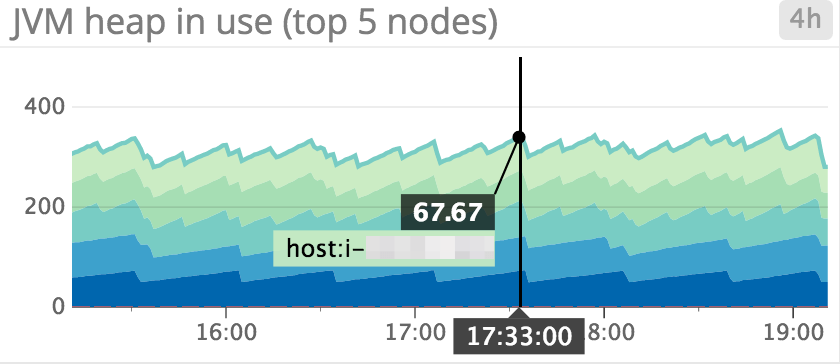
- **正在使用的JVM堆：**Elasticsearch被设置为每当JVM堆使用率达到75％时，启动垃圾收集。如上所示，它被用于监视哪些节点有高堆使用量，并设置一个警报，以确定是否有任何节点始终使用超过85％的堆内存; 这表明垃圾收集率跟不上垃圾的生产率。要解决这个问题，您可以增加堆大小（只要它低于上述建议的准则），或者通过添加更多节点来扩展集群。（如果超过75%的使用率才做垃圾回收，在过大的堆内存时，每次垃圾回收的时间会很长；而过小的堆内存，则可能会造成频繁的垃圾回收，并且回收速度赶不上生产速度，因此得在堆内存的大小上作一个权衡）

- **JVM堆使用与JVM堆大小的设置：**与已设置的内存（保证可用的数量）相比，了解当前使用的JVM堆的大小是有帮助的。正在使用的堆内存量通常会垃圾累积时上升和在垃圾收集时下降。如果模式随着时间的推移开始向上偏移，这意味着垃圾收集速度跟不上创建对象的速度，这可能导致垃圾收集时间慢，最终导致OutOfMemoryErrors。

- **垃圾收集时间和频率：**年轻代和年老代垃圾收集器都会经历“stop the world”的阶段，因为此时JVM会停止执行程序以收集无用的对象。在此期间，节点无法完成任何任务。由于主节点每30秒检查一次其他节点的状态，如果任何节点的垃圾收集时间超过30秒，则会导致主节点相信节点发生故障。

##11 内存使用情况
如上所述，Elasticsearch非常会利用任何尚未分配给JVM堆的RAM。像Kafka一样，Elasticsearch被设计为依靠操作系统的文件系统缓存来快速可靠地提供请求。

许多变量决定了Elasticsearch是否能成功读取文件系统缓存。如果段文件最近被Elasticsearch写入磁盘，那么它已经在缓存中。但是，如果节点已被关闭并重新启动，则首次查询某个段时，该信息很可能必须从磁盘读取。这就是是为什么您需要确保群集保持稳定并且节点不会崩溃的重要原因之一。

一般来说，监视节点上的内存使用情况非常重要，同时给Elasticsearch尽可能多的RAM，这样就可以利用文件系统缓存的速度，而不会耗尽空间。

##12 主机级网络和系统指标
名称|公制型
---|----
可用磁盘空间|资源：利用
I / O利用率|资源：利用
CPU使用率|资源：利用
网络字节发送/接收|资源：利用
打开文件描述符|资源：利用

虽然Elasticsearch通过API提供许多特定于应用程序的指标，但您也应该从每个节点收集和监控几个主机级别的度量。

#13 需要报警的系统指标
**磁盘空间：**如果您的Elasticsearch集群是重写入的，此度量特别重要。您不想耗尽磁盘空间，因为这样您将无法插入或更新任何内容，并且节点将失败。如果节点上不到20％可用，则可能需要使用“ curator”等工具来删除该节点上驻留的占用太多有价值磁盘空间的某些索引。

如果删除索引不是一个选项，另一个选择是添加更多节点，并让主节点自动重新分配新节点上的分片（尽管您应该注意到，这为繁忙的主节点创建了额外的工作）。另外，请记住，具有分析字段的文档（需要文本分析的字段，会执行标记化，分词，删除标点符号等操作）比具有未分析字段（精确值）的文档占用更多的磁盘空间。

##14 需要监控的系统指标
**I / O利用率：**由于段的创建，查询和合并，Elasticsearch对磁盘进行了大量写入和读取。对于具有不断遇到重度I / O活动的节点的写入繁重的群集，Elasticsearch建议使用SSD来提升性能。  
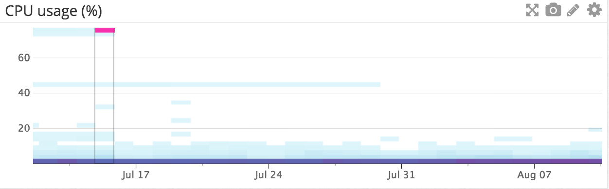

**节点的CPU利用率：**可以在每个节点类型的热图（如上所示）中可视化CPU使用情况。例如，您可以创建三个不同的图表来表示集群中的每组节点（例如，数据节点，主节点，客户端节点），以查看是否有一种类型的节点与其他类型的节点相比较活动超载。如果看到CPU使用率增加，这通常是由于繁重的搜索或索引工作负载引起的。设置通知以确定节点的CPU使用率是否持续增加，如果需要，可以添加更多节点来重新分配负载。

**发送/接收的网络字节：**节点之间的通信是平衡集群的关键组件。您将需要监控网络，以确保其健康，并满足您对集群的需求（例如，分段在节点之间复制或重新平衡）。Elasticsearch提供有关集群通信的传输指标，但您也可以查看发送和接收的字节数，以查看网络接收的流量。

**打开文件描述符：**文件描述符用于节点到节点的通信，客户端连接和文件操作。如果此号码达到您系统的最大容量，那么新的连接和文件操作将不可能，直到旧的关闭。如果超过80％的可用文件描述符被使用，您可能需要增加系统的最大文件描述符数量。大多数Linux系统每个进程只允许1024个文件描述符。在生产中使用Elasticsearch时，您应该将操作系统文件描述符的数量重新设置得更大，如64,000。

**HTTP连接**
度量描述|	名称|公制型
---|---|---
当前打开的HTTP连接数|http.current_open|资源：利用
一段时间内打开的HTTP连接总数|http.total_opened|资源：利用

任何语言都可以给ES发送请求，但Java将使用RESTful API通过HTTP与Elasticsearch进行通信。如果打开的HTTP连接总数不断增加，可能表示您的HTTP客户端没有正确建立持久连接。重新建立连接会在您的请求响应时间内增加额外的毫秒甚至几秒钟。确保您的客户端配置正确，以避免对性能造成负面影响，或使用已正确配置HTTP连接的官方Elasticsearch客户端。

##15 集群健康和节点可用性
度量描述|名称|	公制型
群集状态（绿色，黄色，红色）|cluster.health.status|其他
节点数量|	cluster.health.number_of_nodes|	资源：可用性
正在初始化的分片数|cluster.health.initializing_shards|资源：可用性
未分配分片数|cluster.health.unassigned_shards|	资源：可用性

**集群状态：**如果集群状态为黄色，则至少有一个分片未创建副本或丢失。搜索结果仍将完成，但如果更多的碎片消失，您可能会丢失数据。

**红色**集群状态指示至少一个主碎片丢失，并且你缺少数据，这意味着搜索将返回部分的结果。您也将被阻止索引到该分片。如果状态为黄色超过5分钟，或者状态在过去一分钟为红色，请考虑设置一个提醒。

**正在初始化和未分配的分片：**当您首次创建索引或重新启动节点时，其分片将在转换到“启动”或“未分配”状态之前暂时处于“初始化”状态，因为主节点尝试将分片分配给集群中的节点。如果您看到分片仍处于正在初始化或未分配状态太长时间，则可能是您的集群不稳定的警告信号。

##16 资源饱和度和错误
Elasticsearch节点使用线程池来管理线程如何消耗内存和CPU。由于线程池设置是根据处理器数量自动配置的，所以调整它们通常没有意义。但是，最好关注队列的添加和拒绝，以了解您的节点是否无法跟上; 如果是这样，您可能需要添加更多节点来处理所有并发请求。Fielddata和过滤器高速缓存的使用是另一个要监控的领域，因为缓存的eviction(从缓存中移除，比如根据RLU)可能指向低效的查询或内存压力的迹象。

##17 线程池入队和拒绝
每个节点维护许多类型的线程池; 您要监视的确切位置将取决于您对Elasticsearch的具体用途。一般来说，监控最重要的是搜索，索引，合并和bulk，它们与请求类型（搜索，索引，合并和批量操作）相对应。

每个线程池的队列的大小表示节点当前处于可用等待服务的请求数。队列允许节点跟踪并最终服务这些请求，而不是丢弃它们。一旦线程池中的任务达到最大队列大小，线程池将拒绝新的任务（根据线程池的类型而异）。

度量描述|名称|	公制型
---|---|----
线程池中的排队线程数|thread_pool.bulk.queue, thread_pool.index.queue, thread_pool.search.queue, thread_pool.merge.queue|资源：饱和度
线程池的被拒绝线程数|thread_pool.bulk.rejected, thread_pool.index.rejected, thread_pool.search.rejected, thread_pool.merge.rejected|资源：错误

##18 资源指标
**线程池队列：线程池不应设置过大**，因为它们占用资源，并且如果节点关闭，还会增加丢失请求的风险。如果您看到排队和拒绝的线程数量稳步增加，您可能希望尝试减慢请求速率（如果可能），增加节点上的处理器数量或增加群集中的节点数量。如下面的截图所示，查询负载峰值与搜索线程池队列大小的峰值相关，因为节点尝试跟上查询请求的速率。
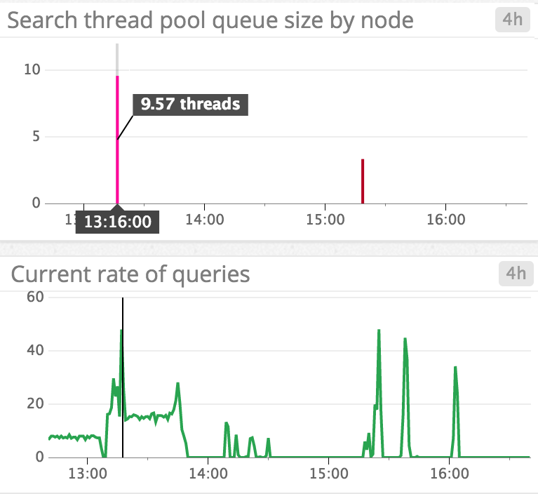  
**批量拒绝和批量入队：**批量操作是一次发送许多请求的更有效的方式。通常，如果要执行许多操作（创建索引或添加，更新或删除文档），则应尝试发送bulk请求，而不是许多单独的请求。

批量拒绝（bulk rejection）通常与在一个bulk请求中尝试索引太多文档有关。根据Elasticsearch的文档，批量拒绝不一定要担心。但是，您应该尝试实施线性或指数退避策略，以有效地处理批量拒绝。  

##19 缓存使用率指标
每个查询请求都会被发送到索引中的每个分片，然后再尝试去命中分片上的段。Elasticsearch以每个段为基础来缓存查询，以加快响应时间。另一方面，如果您的缓存过多地堆积在堆上，那么它们可能会减慢速度，而不是加快速度！

在Elasticsearch中，文档中的每个字段可以以两种形式存储：作为精确值（keyword）或全文(text)。对于keyword，如时间戳或年份，会按照它的值原原本本的存储。如果一个字段存储为全文(text)，这意味着它被分词 - 基本上它被分解成令牌，并且根据分析器的类型，可以删除标题符和停止词如“是”或“该”。分析器将该字段转换为归一化格式，使其能够匹配更广泛的查询。

例如，假设你有一个索引包含一个类型location; 该类型的每个文档都包含一个字段city，它被存储为一个分析的字符串。你索引两个文件：一个在city中存储“圣 路易斯“，另一个为”圣 保罗”。每个字符串将被转化为小写版本并转换成标记，而不用标点符号。这些术语存储在反向索引中，看起来像这样：

术语|文档1|文档2
---|---|---
ST|X|X
路易斯|X|  
保罗|  |X

分析的好处是您可以搜索“st”，结果将显示两个文档都包含该术语。如果您将该city字段存储为一个keyword，那么您将不得不搜索确切的术语“圣 路易斯“或”圣 保罗“，以便看到结果文件。

Elasticsearch使用两种主要类型的缓存来更快地提供搜索请求：fielddata和filter。

##20 Fielddata缓存
在field上排序或聚合时使用fielddata缓存，这个过程基本上必须把倒排索引再倒置过来，以文档顺序为每个field创建每个字段值的数组。例如，如果我们想在上述示例中找到任意包含词（term）“st”的文档中的唯一术语列表，我们将：

1. 扫描倒排索引以查看哪些文档包含该术语（在本例中为Doc1和Doc2）
2. 对于在步骤1中找到的每个文档，通过索引中的每个术语从该文档中收集令牌，创建如下所示的结构：  
文件|	Field（city）
---|---
文档1|圣, 路易斯
文档2|圣, 保罗
3. 现在，倒排索引已经被“反向”，从每个文档（st，路易斯和保罗）中编译出独特的令牌。编译这样的fielddata可能会消耗大量堆内存，尤其是大量的文档和术语。所有字段值都将加载到内存中。

对于1.3之前的版本，fielddata缓存大小是无限制的。从1.3版开始，Elasticsearch添加了一个fielddata断路器，如果查询尝试加载将需要超过60％的堆的fielddata，则会触发。

##21 filter cache
filter cache也使用JVM堆。在2.0之前的版本中，Elasticsearch自动缓存过滤的查询，最大值为堆的10％，并且将最近最少使用的数据逐出。从版本2.0开始，Elasticsearch会根据频率和段大小自动开始优化其过滤器缓存（缓存仅发生在索引中少于10,000个文档或小于总文档3％的段）。因此，过滤器缓存指标仅适用于使用2.0之前版本的Elasticsearch用户。

例如，过滤器查询可以仅返回year字段中的值在2000-2005范围内的文档。在首次执行过滤器查询过程中，Elasticsearch将创建一个文档与过滤器匹配的位组（如果文档匹配则为1，否则为0）。使用相同过滤器后续执行查询将重用此信息。无论何时添加或更新新文档，也会更新位组。如果您在2.0之前使用Elasticsearch版本，那么您应该关注过滤器缓存以及驱逐指标（更多关于以下内容）。

度量描述|名称|公制型
fielddata缓存的大小（字节）|indices.fielddata.memory_size_in_bytes|	资源：利用
来自fielddata缓存的驱逐次数|indices.fielddata.evictions|	资源：饱和度
过滤器高速缓存的大小（字节）（仅版本2.x）|indices.filter_cache.memory_size_in_bytes|	资源：利用
来自过滤器缓存的驱逐次数（仅版本2.x）|	indices.filter_cache.evictions|	资源：饱和度

##22 要监视的缓存指标
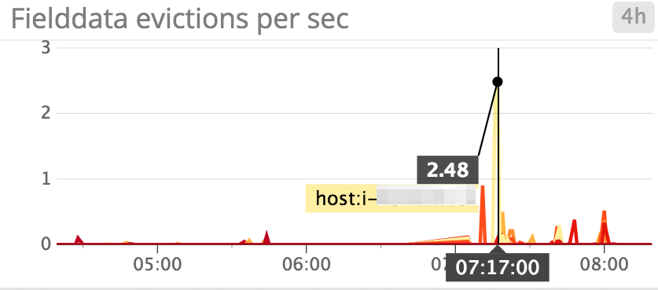  
**Fielddata缓存驱逐：**理想情况下，您希望限制fielddate cache的驱逐（eviction）的数量，因为它们是I / O密集型的。如果您看到很多驱逐，而且目前无法增加内存，Elasticsearch建议临时fielddate cache到堆的20%; 你可以在你的config/elasticsearch.yml文件中这样做。当fielddata达到堆的20％时，它将驱逐最近最少使用的fielddata，然后允许您将新的fielddata加载到缓存中。

Elasticsearch还建议尽可能使用doc value，因为它们与fielddata的用途相同。但是，由于它们存储在磁盘上，它们不依赖于JVM堆。虽然doc值不能用于analyzed string fields，但是当在其他类型的字段上进行聚合或排序时，它们会保存fielddata的用法。在版本2.0和更高版本中，doc values在文档索引期间自动构建，这减少了许多对fielddata/堆的使用。但是，如果您使用1.0和2.0之间的版本，还可以从此功能中受益 - 只需记住在索引中创建新字段时启用它们。

**Filter cache evictions：**如前所述，filter cache驱逐指标仅在2.0版之前使用Elasticsearch版本时可用。每个段维护自己的单独过滤器高速缓存。由于驱逐是在大的segment比在小segment上成本更高的操作，因此没有明确的方法来评估每次驱逐的严重程度。但是，如果您看到越来越频繁的eviction，这可能表明您没有使用过滤器来获得最大的利益 - 您可能正在不停的创建新的过滤器，并频繁地排除旧的过滤器，从而打破了使用缓存的目的。您可能需要考虑调整您的查询（例如，使用bool查询而不是和/或/不过滤器）。  

##23 待处理任务
度量描述|名称|公制型
---|---|----
待处理任务数|pending_task_total|资源：饱和度
挂起的紧急任务数量|pending_tasks_priority_urgent|资源：饱和度
待处理高优先级任务数|	pending_tasks_priority_high|资源：饱和度

待处理的任务只能由主节点处理。这些任务包括创建索引并将分片分配给节点。待处理的任务按优先顺序处理 - urgent先处理，然后是high。当操作的次数发生得比主节点处理更快时，它们开始累积。如果不断增加，您需要关注这一指标。待处理任务的数量是您的群集运行平稳的良好指示。如果您的主节点很忙，并且未完成的任务数量不会减少，则可能会导致不稳定的集群。

##24 不成功的GET请求
度量描述|名称|公制型
---|---|----
丢失的文件的GET请求总数|indices.get.missing_total|工作：错误
花费在文档丢失的GET请求上的总时间|indices.get.missing_time_in_millis|工作：错误
GET请求比正常的搜索请求更简单 - 它根据其ID来检索文档。get-by-ID请求不成功意味着找不到文档ID。你通常不应该对这种类型的请求有任何担心，但是当发生GET请求失败时，还是请注意一下。

##25 结论
在这篇文章中，我们介绍了当您扩展和扩展集群时，需要监视的一些Elasticsearch最重要的领域：
- 搜索和索引性能
- 内存和垃圾收集
- 主机级系统和网络指标
- 集群健康和节点可用性
- 资源饱和度和错误

当您监视Elasticsearch指标以及节点级系统指标时，您将发现哪些区域对于特定用例最有意义。阅读我们系列的第2部分，了解如何开始收集和可视化最重要的Elasticsearch指标。