[TOC]

##1 常用快捷键
1. 删除光标所在行：Ctrl+Y  
2. 代码提示（Content Provider）：Ctrl + Alt + 空格  
Eclipse代码提示Content Assist：Alt + /
3. 文件重命名：Shift + F6
4. 生成Setter、Getter代码：Alt+Insert  
该热键还可以生成构造方法、equals、toString、重写方法、代理方法、Autowired等  
5. 生成main方法：psvm
6. 生成System.out.println()：sout
7. 代码修正：Alt + Enter

##2 刷新gradlle工程
gradle连接maven repository失败后，需要重新刷新。在Intellij中可以通过：View → Tool Windows → gradle view查看  
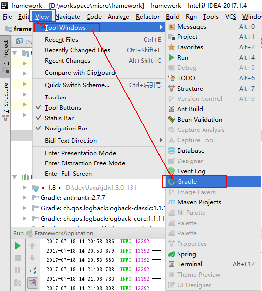  
在下图中点击刷新按钮，可以重新刷新Gradle依赖  
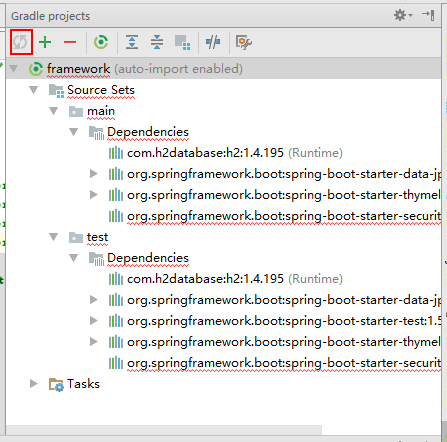  

##3 将Web工程部署到Tomcat
要将Web工程部署到Tomcat，在IntelliJ的运行按钮栏中选择【Edit Configurations】  
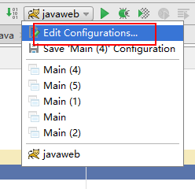  
点击弹出的【Run/Debug Configurations】对话框中点击  
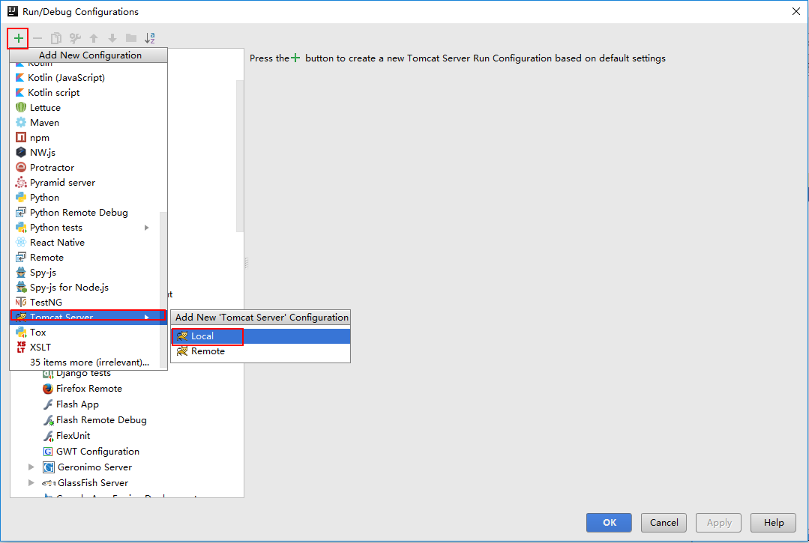  
在Tomcat的配置页面中输入Tomcat的名称，配置Tomcat的安装目录  
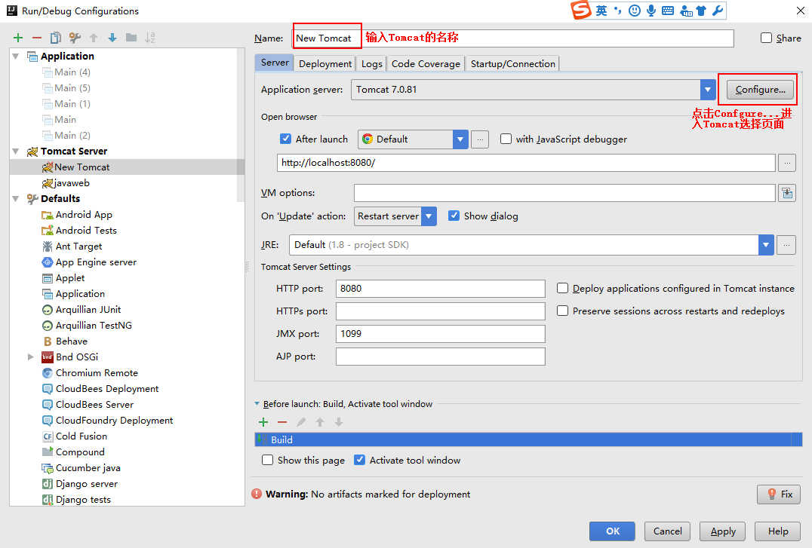  
编辑Tomcat的安装目录
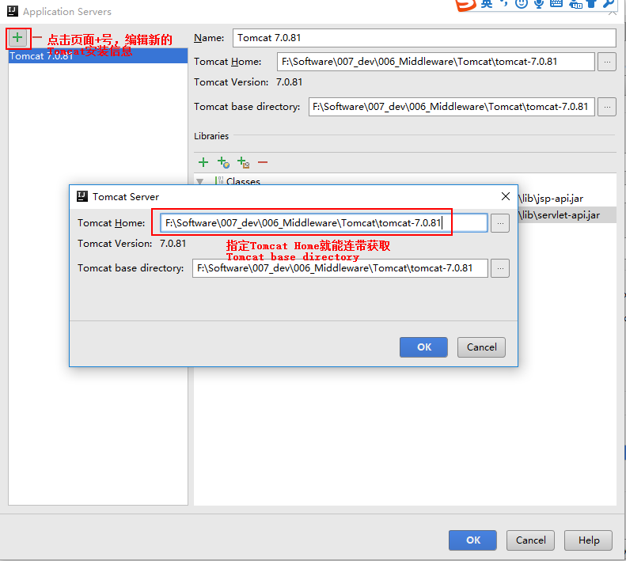  
完成Server页签的配置后，进行Deployment页签的配置。点击添加新的Artifact  
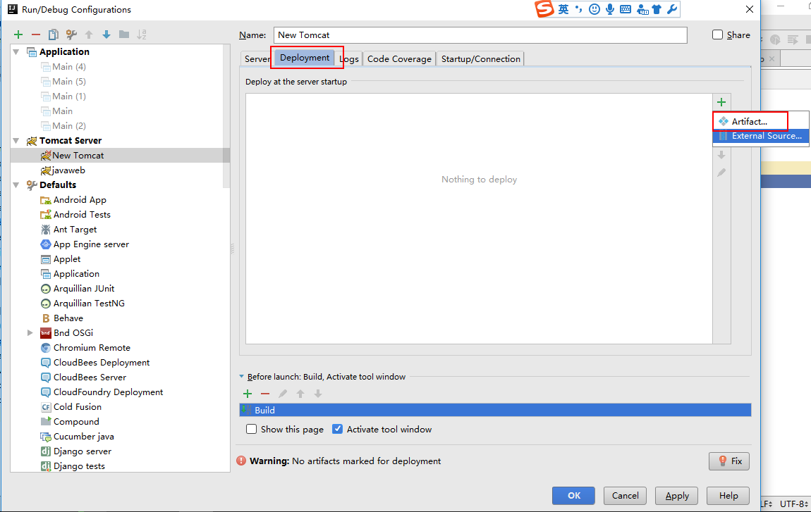  
选择Artifact，并添加参数exploded
- war模式这种可以称之为是发布模式，看名字也知道，这是先打成war包，再发布；
- war exploded模式是直接把文件夹、jsp页面 、classes等等移到Tomcat 部署文件夹里面，进行加载部署。因此这种方式支持热部署，一般在开发的时候也是用这种方式。

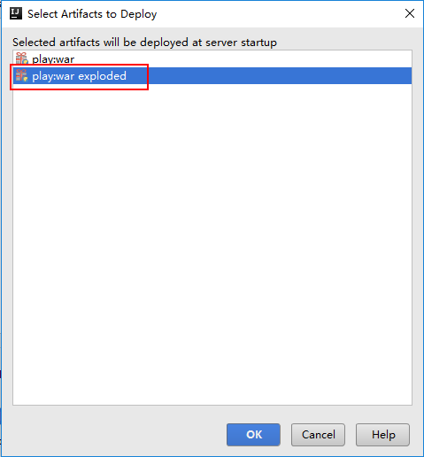  
配置工程的二级域名
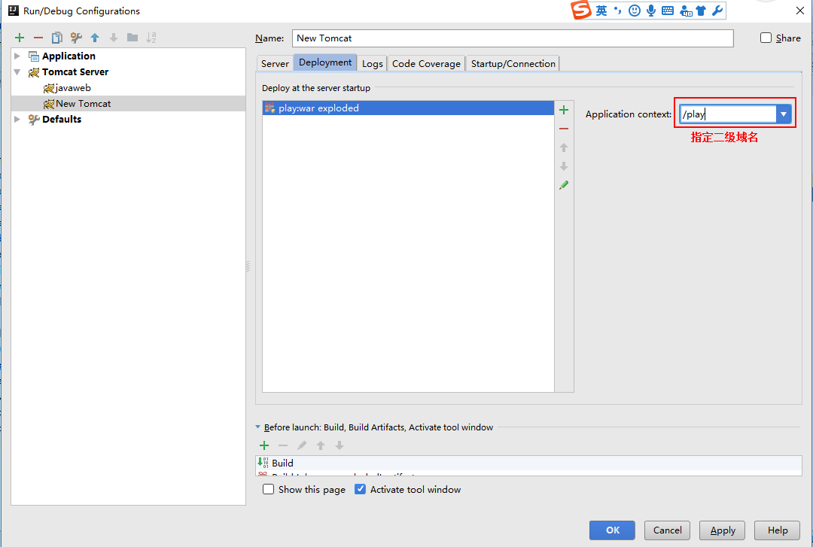  
配置完Tomcat后，只需要选择配置好的Tomcat就可以运行  
  

##4 刷新Maven依赖
在IntelliJ的工程中有一个Maven Projects视图  
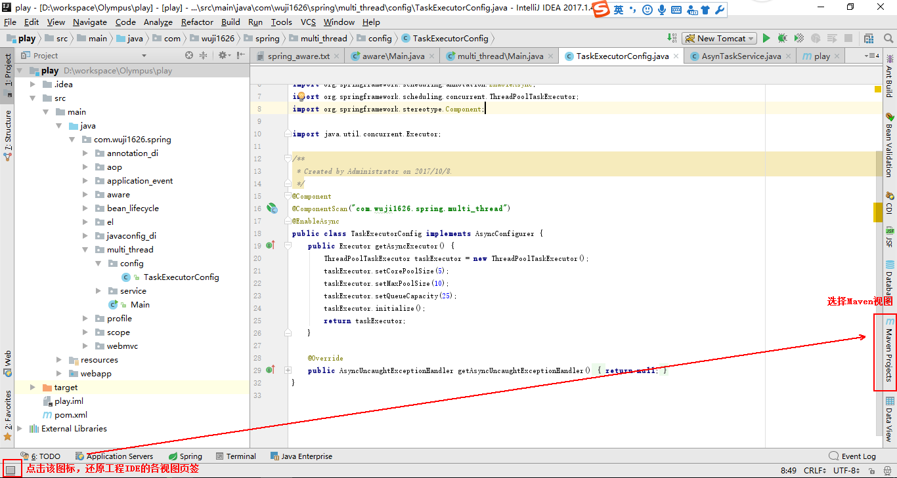  
在视图中选择刷新Maven依赖  
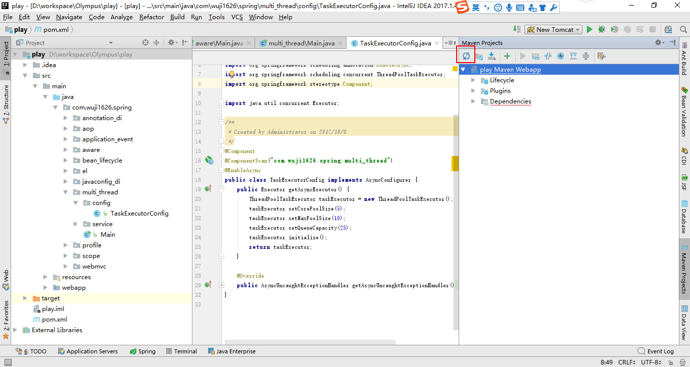  

