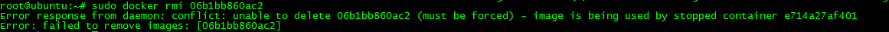
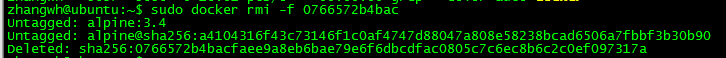

#Docker实操
##1 Docker安装
###1.1 Ubuntu 16.04环境下安装Docker的先决条件
####1 Ubuntu更新
`sudo apt-get update`  
####2 添加CA源
`sudo apt-get install apt-transport-https ca-certificates`  
####3 添加GPG Key(一种加密手段)  
`sudo apt-key adv --keyserver hkp://p80.pool.sks-keyservers.net:80 --recv-keys 58118E89F3A912897C070ADBF76221572C52609D` 

输出结果：    
>zhangwh@ubuntu:~$ sudo apt-key adv --keyserver hkp://p80.pool.sks-keyservers.net:80 --recv-keys 58118E89F3A912897C070ADBF76221572C52609D  
Executing: /tmp/tmp.WsMfRUnwxs/gpg.1.sh --keyserver  
hkp://p80.pool.sks-keyservers.net:80  
--recv-keys  
58118E89F3A912897C070ADBF76221572C52609D  
gpg: requesting key 2C52609D from hkp server p80.pool.sks-keyservers.net  
gpg: key 2C52609D: public key "Docker Release Tool (releasedocker)   <docker@docker.com>" imported  
gpg: Total number processed: 1  
gpg:               imported: 1  (RSA: 1)  

####4 创建Docker源
`sudo vi /etc/apt/sources.list.d/docker.list`  
添加Ubuntu16.04LST的入口  
`deb https://apt.dockerproject.org/repo ubuntu-xenial main`  
####5 再次更新源
`sudo apt-get update`  
####6 更新Docker
以防万一，清除过时的源  
`sudo apt-get purge lxc-docker`  
验证下APT是从正确的库源下载应用的  
`sudo apt-cache policy docker-engine`  
  
####7 安装 linux-image-extra  
###1.2 Docker安装
####1 更新源
`sudo apt-get update`  
####2 在线安装docker
`sudo apt-get install docker-engine`  
####3 开启docker的守护进程（Docker服务开启）
`sudo service docker start`  
####4 测试Docker是否安装成功
国际惯例，用一个Hello world的来测试安装成功  
`sudo docker run hello-world`  

####5 查看正在运行的容器
`sudo docker ps -ls`  
  

##2 Docker操作
###2.1 镜像获取
执行命令：  
`sudo docker pull ubuntu:12.04`  
###2.2 镜像操作  
####2.2.1 查看Docker中的镜像
执行命令：  
`sudo docker images`  
返回结果：   
  
####2.2.2 为本地仓库添加新标签
`sudo docker tag ubuntu:12.04 ubuntu1:ubuntu`  
其中参数规则：  
`sudo docker tag [repository:tag] [new_repository:new_tag] `  
  
####2.2.3 获取镜像的详细信息
docker 通过Image ID获取镜像的详细信息，images中列出的列表都只是镜像的别名。只有IMAGE ID是镜像的唯一标识  
`sudo docker inspect d14ec39e4d58`  
其中image id可以指明开头的若干的字符即可，如：sudo docker inspect d14e   
`root@ubuntu:~# sudo docker inspect d14ec39e4d58`    
`[  `  
`{  `  
&nbsp;&nbsp;&nbsp;&nbsp;`"Id":`         &nbsp;&nbsp;&nbsp;&nbsp;`"d14ec39e4d58d793cbca2bfb9aef7eb2f03855d954ba3cbaad67ad420587100d",`     
&nbsp;&nbsp;&nbsp;&nbsp;`"RepoTags": [`    
&nbsp;&nbsp;&nbsp;&nbsp;&nbsp;&nbsp;&nbsp;&nbsp;`"ubuntu:12.04",`    
&nbsp;&nbsp;&nbsp;&nbsp;&nbsp;&nbsp;&nbsp;&nbsp;`"ubuntu:latest",`    
&nbsp;&nbsp;&nbsp;&nbsp;&nbsp;&nbsp;&nbsp;&nbsp;`"ubuntu:ubuntu",`    
&nbsp;&nbsp;&nbsp;&nbsp;&nbsp;&nbsp;&nbsp;&nbsp;`"ubuntu1:ubuntu"`  
&nbsp;&nbsp;&nbsp;&nbsp;`], `    
&nbsp;&nbsp;&nbsp;&nbsp;`"RepoDigests": [],`    
&nbsp;&nbsp;&nbsp;&nbsp;`"Parent":   "c79682de3f158b24aa8f49d53e274296acbc90b0535c0675d029c6a0e1ef6dd2",`  
&nbsp;&nbsp;&nbsp;&nbsp;`"Comment": "",`    
&nbsp;&nbsp;&nbsp;&nbsp;`"Created":   "2016-12-15T17:44:38.756153941Z",`    
&nbsp;&nbsp;&nbsp;&nbsp;`"Container":   "0d97ebafac8eb656b0a3a1034a7932311d1c6993baf093058f1f3520e961ee59",`    
&nbsp;&nbsp;&nbsp;&nbsp;`"ContainerConfig": {`  
&nbsp;&nbsp;&nbsp;&nbsp;&nbsp;&nbsp;&nbsp;&nbsp;`"Hostname": "90a56af49c64",`  
&nbsp;&nbsp;&nbsp;&nbsp;&nbsp;&nbsp;&nbsp;&nbsp;`"Domainname": "",`    
&nbsp;&nbsp;&nbsp;&nbsp;&nbsp;&nbsp;&nbsp;&nbsp;`"User": "",`    
&nbsp;&nbsp;&nbsp;&nbsp;&nbsp;&nbsp;&nbsp;&nbsp;`"AttachStdin": false,`    
&nbsp;&nbsp;&nbsp;&nbsp;&nbsp;&nbsp;&nbsp;&nbsp;`"AttachStdout": false,`    
&nbsp;&nbsp;&nbsp;&nbsp;&nbsp;&nbsp;&nbsp;&nbsp;`"AttachStderr": false,`    
&nbsp;&nbsp;&nbsp;&nbsp;&nbsp;&nbsp;&nbsp;&nbsp;`"Tty": false,`  
&nbsp;&nbsp;&nbsp;&nbsp;&nbsp;&nbsp;&nbsp;&nbsp;`"OpenStdin": false,`  
&nbsp;&nbsp;&nbsp;&nbsp;&nbsp;&nbsp;&nbsp;&nbsp;`"StdinOnce": false,`  
&nbsp;&nbsp;&nbsp;&nbsp;&nbsp;&nbsp;&nbsp;&nbsp;`"Env": [`  
&nbsp;&nbsp;&nbsp;&nbsp;&nbsp;&nbsp;&nbsp;&nbsp;&nbsp;&nbsp;&nbsp;&nbsp;`"PATH=/usr/local/sbin:/usr/local/bin:/usr/sbin:/usr/bin:/sbin:/bin"`  
&nbsp;&nbsp;&nbsp;&nbsp;&nbsp;&nbsp;&nbsp;&nbsp;`],`  
&nbsp;&nbsp;&nbsp;&nbsp;&nbsp;&nbsp;&nbsp;&nbsp;`"Cmd": [`  
&nbsp;&nbsp;&nbsp;&nbsp;&nbsp;&nbsp;&nbsp;&nbsp;&nbsp;&nbsp;&nbsp;&nbsp;`"/bin/sh",`  
&nbsp;&nbsp;&nbsp;&nbsp;&nbsp;&nbsp;&nbsp;&nbsp;&nbsp;&nbsp;&nbsp;&nbsp;`"-c",`  
&nbsp;&nbsp;&nbsp;&nbsp;&nbsp;&nbsp;&nbsp;&nbsp;&nbsp;&nbsp;&nbsp;&nbsp;`"#(nop) ",`  
&nbsp;&nbsp;&nbsp;&nbsp;&nbsp;&nbsp;&nbsp;&nbsp;&nbsp;&nbsp;&nbsp;&nbsp;`"CMD [\"/bin/bash\"]"`  
&nbsp;&nbsp;&nbsp;&nbsp;&nbsp;&nbsp;&nbsp;&nbsp;`],`  
&nbsp;&nbsp;&nbsp;&nbsp;&nbsp;&nbsp;&nbsp;&nbsp;`"Image": "sha256:f44e7585542f2ce3e285073897347cbcee6c06286247f2f5497b0e2cac4d18e1",`  
&nbsp;&nbsp;&nbsp;&nbsp;&nbsp;&nbsp;&nbsp;&nbsp;`"Volumes": null,`  
&nbsp;&nbsp;&nbsp;&nbsp;&nbsp;&nbsp;&nbsp;&nbsp;`"WorkingDir": "",`  
&nbsp;&nbsp;&nbsp;&nbsp;&nbsp;&nbsp;&nbsp;&nbsp;`"Entrypoint": null,`  
&nbsp;&nbsp;&nbsp;&nbsp;&nbsp;&nbsp;&nbsp;&nbsp;`"OnBuild": null,`  
&nbsp;&nbsp;&nbsp;&nbsp;&nbsp;&nbsp;&nbsp;&nbsp;`"Labels": {}`  
&nbsp;&nbsp;&nbsp;&nbsp;`},`  
&nbsp;&nbsp;&nbsp;&nbsp;`"DockerVersion": "1.12.3",`  
&nbsp;&nbsp;&nbsp;&nbsp;`"Author": "",`  
&nbsp;&nbsp;&nbsp;&nbsp;`"Config": {`  
&nbsp;&nbsp;&nbsp;&nbsp;&nbsp;&nbsp;&nbsp;&nbsp;`"Hostname": "90a56af49c64",`  
&nbsp;&nbsp;&nbsp;&nbsp;&nbsp;&nbsp;&nbsp;&nbsp;`"Domainname": "",`  
&nbsp;&nbsp;&nbsp;&nbsp;&nbsp;&nbsp;&nbsp;&nbsp;`"User": "",`  
&nbsp;&nbsp;&nbsp;&nbsp;&nbsp;&nbsp;&nbsp;&nbsp;`"AttachStdin": false,`  
&nbsp;&nbsp;&nbsp;&nbsp;&nbsp;&nbsp;&nbsp;&nbsp;`"AttachStdout": false,`  
&nbsp;&nbsp;&nbsp;&nbsp;&nbsp;&nbsp;&nbsp;&nbsp;`"AttachStderr": false,`  
&nbsp;&nbsp;&nbsp;&nbsp;&nbsp;&nbsp;&nbsp;&nbsp;`"Tty": false,`  
&nbsp;&nbsp;&nbsp;&nbsp;&nbsp;&nbsp;&nbsp;&nbsp;`"OpenStdin": false,`  
&nbsp;&nbsp;&nbsp;&nbsp;&nbsp;&nbsp;&nbsp;&nbsp;`"StdinOnce": false,`  
&nbsp;&nbsp;&nbsp;&nbsp;&nbsp;&nbsp;&nbsp;&nbsp;`"Env": [`  
&nbsp;&nbsp;&nbsp;&nbsp;&nbsp;&nbsp;&nbsp;&nbsp;&nbsp;&nbsp;&nbsp;&nbsp;`"PATH=/usr/local/sbin:/usr/local/bin:/usr/sbin:/usr/bin:/sbin:/bin"`  
&nbsp;&nbsp;&nbsp;&nbsp;&nbsp;&nbsp;&nbsp;&nbsp;`],`  
&nbsp;&nbsp;&nbsp;&nbsp;&nbsp;&nbsp;&nbsp;&nbsp;`"Cmd": [`  
&nbsp;&nbsp;&nbsp;&nbsp;&nbsp;&nbsp;&nbsp;&nbsp;&nbsp;&nbsp;&nbsp;&nbsp;`"/bin/bash"`  
&nbsp;&nbsp;&nbsp;&nbsp;&nbsp;&nbsp;&nbsp;&nbsp;`],`  
    &nbsp;&nbsp;&nbsp;&nbsp;&nbsp;&nbsp;&nbsp;&nbsp;`"Image":"sha256:f44e7585542f2ce3e285073897347cbcee6c06286247f2f5497b0e2cac4d18e1",`    
&nbsp;&nbsp;&nbsp;&nbsp;&nbsp;&nbsp;&nbsp;&nbsp;`"Volumes": null,`  
&nbsp;&nbsp;&nbsp;&nbsp;&nbsp;&nbsp;&nbsp;&nbsp;`"WorkingDir": "",`  
&nbsp;&nbsp;&nbsp;&nbsp;&nbsp;&nbsp;&nbsp;&nbsp;`"Entrypoint": null,`  
&nbsp;&nbsp;&nbsp;&nbsp;&nbsp;&nbsp;&nbsp;&nbsp;`"OnBuild": null,`  
&nbsp;&nbsp;&nbsp;&nbsp;&nbsp;&nbsp;&nbsp;&nbsp;`"Labels": {}`  
&nbsp;&nbsp;&nbsp;&nbsp;`},`  
&nbsp;&nbsp;&nbsp;&nbsp;`"Architecture": "amd64",`  
&nbsp;&nbsp;&nbsp;&nbsp;`"Os": "linux",`  
&nbsp;&nbsp;&nbsp;&nbsp;`"Size": 0,`  
&nbsp;&nbsp;&nbsp;&nbsp;`"VirtualSize": 103575798,`  
&nbsp;&nbsp;&nbsp;&nbsp;`"GraphDriver": {`  
&nbsp;&nbsp;&nbsp;&nbsp;&nbsp;&nbsp;&nbsp;&nbsp;`"Name": "aufs",`  
&nbsp;&nbsp;&nbsp;&nbsp;&nbsp;&nbsp;&nbsp;&nbsp;`"Data": null`  
&nbsp;&nbsp;&nbsp;&nbsp;`}`  
`}`  
`]`  
查找特定的字段  
`sudo docker inspect -f {{.GraphDriver.Name}}  d14e`  
结果  
  
`sudo docker inspect -f {{.Config}}  d14e`  
结果  
  
####2.2.4 镜像搜索
通过docker的search命令，可以搜索docker的远程镜像库，列出关键字相关的镜像  
`sudo docker search mysql`  
  
####2.2.5 删除Docker镜像
删除镜像时，如果本地同一个Image id包括多个tag的镜像时，只删除镜像，当删除最后一个镜像时才将镜像文件删除  
`sudo docker rmi ubuntu1:ubuntu`  
结果  
  
`sudo docker rmi ubuntu:latest`  
结果  
  
删除前  
  
删除后  
  
**■按照image id删除镜像**  
删除镜像时，docker首先断开并删除所有tag，然后删除镜像  
`sudo docker rmi 1eb8a4da372d`  
删除前  
  
删除后  
  
如果容器处于运行状态，将无法删除该镜像  
运行容器：  
`sudo docker run ubuntu:14.04 echo 'hello! I am here!'`  
运行结果  
  
查看容器状态  
`sudo docker ps -a `  
运行结果  

1）通过image id删除  
`sudo docker rmi <IMAGE ID>`  
eg.`sudo docker rmi dd03817a34ff`  
当镜像被容器使用时，不管容器是否运行，镜像也无法删除  
   
需要强行删除（增加-f参数即可）:  
`sudo docker rmi -f <IMAGE ID>`  
强行删除后的结果与正常删除一样  
  

