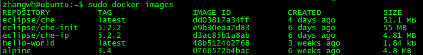
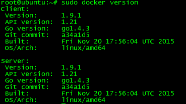
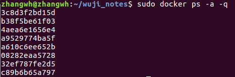
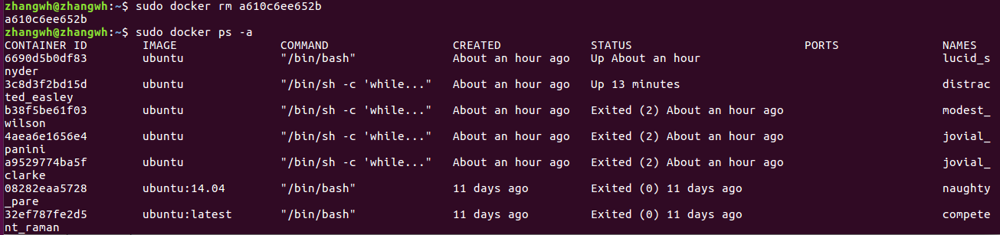

#Docker实操

[TOC]

##1 Docker安装
###1.1 Ubuntu 16.04环境下安装Docker的先决条件
####1 Ubuntu更新
`sudo apt-get update`  
####2 添加CA源
`sudo apt-get install apt-transport-https ca-certificates`  
####3 添加GPG Key(一种加密手段)  
`sudo apt-key adv --keyserver hkp://p80.pool.sks-keyservers.net:80 --recv-keys 58118E89F3A912897C070ADBF76221572C52609D` 

输出结果：    
>zhangwh@ubuntu:~$ sudo apt-key adv --keyserver hkp://p80.pool.sks-keyservers.net:80 --recv-keys 58118E89F3A912897C070ADBF76221572C52609D  
Executing: /tmp/tmp.WsMfRUnwxs/gpg.1.sh --keyserver  
hkp://p80.pool.sks-keyservers.net:80  
--recv-keys  
58118E89F3A912897C070ADBF76221572C52609D  
gpg: requesting key 2C52609D from hkp server p80.pool.sks-keyservers.net  
gpg: key 2C52609D: public key "Docker Release Tool (releasedocker)   <docker@docker.com>" imported  
gpg: Total number processed: 1  
gpg:               imported: 1  (RSA: 1)  

####4 创建Docker源
`sudo vi /etc/apt/sources.list.d/docker.list`  
添加Ubuntu16.04LST的入口  
`deb https://apt.dockerproject.org/repo ubuntu-xenial main`  
####5 再次更新源
`sudo apt-get update`  
####6 更新Docker
以防万一，清除过时的源  
`sudo apt-get purge lxc-docker`  
验证下APT是从正确的库源下载应用的  
`sudo apt-cache policy docker-engine`  
  
####7 安装 linux-image-extra  
###1.2 Docker安装
####1 更新源
`sudo apt-get update`  
####2 在线安装docker
`sudo apt-get install docker-engine`  
####3 开启docker的守护进程（Docker服务开启）
`sudo service docker start`  
####4 测试Docker是否安装成功
国际惯例，用一个Hello world的来测试安装成功  
`sudo docker run hello-world`  

####5 查看正在运行的容器
`sudo docker ps -ls`  
  

##2 镜像
###2.1 镜像获取
执行命令：  
`sudo docker pull ubuntu:12.04`  
###2.2 镜像操作  
####2.2.1 查看Docker中的镜像
执行命令：  
`sudo docker images`  
返回结果：   
  
####2.2.2 为本地仓库添加新标签
`sudo docker tag ubuntu:12.04 ubuntu1:ubuntu`  
其中参数规则：  
`sudo docker tag [repository:tag] [new_repository:new_tag] `  
  
####2.2.3 获取镜像的详细信息
docker 通过Image ID获取镜像的详细信息，images中列出的列表都只是镜像的别名。只有IMAGE ID是镜像的唯一标识  
`sudo docker inspect d14ec39e4d58`  
其中image id可以指明开头的若干的字符即可，如：sudo docker inspect d14e   
`root@ubuntu:~# sudo docker inspect d14ec39e4d58`    
`[  `  
`{  `  
&nbsp;&nbsp;&nbsp;&nbsp;`"Id":`         &nbsp;&nbsp;&nbsp;&nbsp;`"d14ec39e4d58d793cbca2bfb9aef7eb2f03855d954ba3cbaad67ad420587100d",`     
&nbsp;&nbsp;&nbsp;&nbsp;`"RepoTags": [`    
&nbsp;&nbsp;&nbsp;&nbsp;&nbsp;&nbsp;&nbsp;&nbsp;`"ubuntu:12.04",`    
&nbsp;&nbsp;&nbsp;&nbsp;&nbsp;&nbsp;&nbsp;&nbsp;`"ubuntu:latest",`    
&nbsp;&nbsp;&nbsp;&nbsp;&nbsp;&nbsp;&nbsp;&nbsp;`"ubuntu:ubuntu",`    
&nbsp;&nbsp;&nbsp;&nbsp;&nbsp;&nbsp;&nbsp;&nbsp;`"ubuntu1:ubuntu"`  
&nbsp;&nbsp;&nbsp;&nbsp;`], `    
&nbsp;&nbsp;&nbsp;&nbsp;`"RepoDigests": [],`    
&nbsp;&nbsp;&nbsp;&nbsp;`"Parent":   "c79682de3f158b24aa8f49d53e274296acbc90b0535c0675d029c6a0e1ef6dd2",`  
&nbsp;&nbsp;&nbsp;&nbsp;`"Comment": "",`    
&nbsp;&nbsp;&nbsp;&nbsp;`"Created":   "2016-12-15T17:44:38.756153941Z",`    
&nbsp;&nbsp;&nbsp;&nbsp;`"Container":   "0d97ebafac8eb656b0a3a1034a7932311d1c6993baf093058f1f3520e961ee59",`    
&nbsp;&nbsp;&nbsp;&nbsp;`"ContainerConfig": {`  
&nbsp;&nbsp;&nbsp;&nbsp;&nbsp;&nbsp;&nbsp;&nbsp;`"Hostname": "90a56af49c64",`  
&nbsp;&nbsp;&nbsp;&nbsp;&nbsp;&nbsp;&nbsp;&nbsp;`"Domainname": "",`    
&nbsp;&nbsp;&nbsp;&nbsp;&nbsp;&nbsp;&nbsp;&nbsp;`"User": "",`    
&nbsp;&nbsp;&nbsp;&nbsp;&nbsp;&nbsp;&nbsp;&nbsp;`"AttachStdin": false,`    
&nbsp;&nbsp;&nbsp;&nbsp;&nbsp;&nbsp;&nbsp;&nbsp;`"AttachStdout": false,`    
&nbsp;&nbsp;&nbsp;&nbsp;&nbsp;&nbsp;&nbsp;&nbsp;`"AttachStderr": false,`    
&nbsp;&nbsp;&nbsp;&nbsp;&nbsp;&nbsp;&nbsp;&nbsp;`"Tty": false,`  
&nbsp;&nbsp;&nbsp;&nbsp;&nbsp;&nbsp;&nbsp;&nbsp;`"OpenStdin": false,`  
&nbsp;&nbsp;&nbsp;&nbsp;&nbsp;&nbsp;&nbsp;&nbsp;`"StdinOnce": false,`  
&nbsp;&nbsp;&nbsp;&nbsp;&nbsp;&nbsp;&nbsp;&nbsp;`"Env": [`  
&nbsp;&nbsp;&nbsp;&nbsp;&nbsp;&nbsp;&nbsp;&nbsp;&nbsp;&nbsp;&nbsp;&nbsp;`"PATH=/usr/local/sbin:/usr/local/bin:/usr/sbin:/usr/bin:/sbin:/bin"`  
&nbsp;&nbsp;&nbsp;&nbsp;&nbsp;&nbsp;&nbsp;&nbsp;`],`  
&nbsp;&nbsp;&nbsp;&nbsp;&nbsp;&nbsp;&nbsp;&nbsp;`"Cmd": [`  
&nbsp;&nbsp;&nbsp;&nbsp;&nbsp;&nbsp;&nbsp;&nbsp;&nbsp;&nbsp;&nbsp;&nbsp;`"/bin/sh",`  
&nbsp;&nbsp;&nbsp;&nbsp;&nbsp;&nbsp;&nbsp;&nbsp;&nbsp;&nbsp;&nbsp;&nbsp;`"-c",`  
&nbsp;&nbsp;&nbsp;&nbsp;&nbsp;&nbsp;&nbsp;&nbsp;&nbsp;&nbsp;&nbsp;&nbsp;`"#(nop) ",`  
&nbsp;&nbsp;&nbsp;&nbsp;&nbsp;&nbsp;&nbsp;&nbsp;&nbsp;&nbsp;&nbsp;&nbsp;`"CMD [\"/bin/bash\"]"`  
&nbsp;&nbsp;&nbsp;&nbsp;&nbsp;&nbsp;&nbsp;&nbsp;`],`  
&nbsp;&nbsp;&nbsp;&nbsp;&nbsp;&nbsp;&nbsp;&nbsp;`"Image": "sha256:f44e7585542f2ce3e285073897347cbcee6c06286247f2f5497b0e2cac4d18e1",`  
&nbsp;&nbsp;&nbsp;&nbsp;&nbsp;&nbsp;&nbsp;&nbsp;`"Volumes": null,`  
&nbsp;&nbsp;&nbsp;&nbsp;&nbsp;&nbsp;&nbsp;&nbsp;`"WorkingDir": "",`  
&nbsp;&nbsp;&nbsp;&nbsp;&nbsp;&nbsp;&nbsp;&nbsp;`"Entrypoint": null,`  
&nbsp;&nbsp;&nbsp;&nbsp;&nbsp;&nbsp;&nbsp;&nbsp;`"OnBuild": null,`  
&nbsp;&nbsp;&nbsp;&nbsp;&nbsp;&nbsp;&nbsp;&nbsp;`"Labels": {}`  
&nbsp;&nbsp;&nbsp;&nbsp;`},`  
&nbsp;&nbsp;&nbsp;&nbsp;`"DockerVersion": "1.12.3",`  
&nbsp;&nbsp;&nbsp;&nbsp;`"Author": "",`  
&nbsp;&nbsp;&nbsp;&nbsp;`"Config": {`  
&nbsp;&nbsp;&nbsp;&nbsp;&nbsp;&nbsp;&nbsp;&nbsp;`"Hostname": "90a56af49c64",`  
&nbsp;&nbsp;&nbsp;&nbsp;&nbsp;&nbsp;&nbsp;&nbsp;`"Domainname": "",`  
&nbsp;&nbsp;&nbsp;&nbsp;&nbsp;&nbsp;&nbsp;&nbsp;`"User": "",`  
&nbsp;&nbsp;&nbsp;&nbsp;&nbsp;&nbsp;&nbsp;&nbsp;`"AttachStdin": false,`  
&nbsp;&nbsp;&nbsp;&nbsp;&nbsp;&nbsp;&nbsp;&nbsp;`"AttachStdout": false,`  
&nbsp;&nbsp;&nbsp;&nbsp;&nbsp;&nbsp;&nbsp;&nbsp;`"AttachStderr": false,`  
&nbsp;&nbsp;&nbsp;&nbsp;&nbsp;&nbsp;&nbsp;&nbsp;`"Tty": false,`  
&nbsp;&nbsp;&nbsp;&nbsp;&nbsp;&nbsp;&nbsp;&nbsp;`"OpenStdin": false,`  
&nbsp;&nbsp;&nbsp;&nbsp;&nbsp;&nbsp;&nbsp;&nbsp;`"StdinOnce": false,`  
&nbsp;&nbsp;&nbsp;&nbsp;&nbsp;&nbsp;&nbsp;&nbsp;`"Env": [`  
&nbsp;&nbsp;&nbsp;&nbsp;&nbsp;&nbsp;&nbsp;&nbsp;&nbsp;&nbsp;&nbsp;&nbsp;`"PATH=/usr/local/sbin:/usr/local/bin:/usr/sbin:/usr/bin:/sbin:/bin"`  
&nbsp;&nbsp;&nbsp;&nbsp;&nbsp;&nbsp;&nbsp;&nbsp;`],`  
&nbsp;&nbsp;&nbsp;&nbsp;&nbsp;&nbsp;&nbsp;&nbsp;`"Cmd": [`  
&nbsp;&nbsp;&nbsp;&nbsp;&nbsp;&nbsp;&nbsp;&nbsp;&nbsp;&nbsp;&nbsp;&nbsp;`"/bin/bash"`  
&nbsp;&nbsp;&nbsp;&nbsp;&nbsp;&nbsp;&nbsp;&nbsp;`],`  
    &nbsp;&nbsp;&nbsp;&nbsp;&nbsp;&nbsp;&nbsp;&nbsp;`"Image":"sha256:f44e7585542f2ce3e285073897347cbcee6c06286247f2f5497b0e2cac4d18e1",`    
&nbsp;&nbsp;&nbsp;&nbsp;&nbsp;&nbsp;&nbsp;&nbsp;`"Volumes": null,`  
&nbsp;&nbsp;&nbsp;&nbsp;&nbsp;&nbsp;&nbsp;&nbsp;`"WorkingDir": "",`  
&nbsp;&nbsp;&nbsp;&nbsp;&nbsp;&nbsp;&nbsp;&nbsp;`"Entrypoint": null,`  
&nbsp;&nbsp;&nbsp;&nbsp;&nbsp;&nbsp;&nbsp;&nbsp;`"OnBuild": null,`  
&nbsp;&nbsp;&nbsp;&nbsp;&nbsp;&nbsp;&nbsp;&nbsp;`"Labels": {}`  
&nbsp;&nbsp;&nbsp;&nbsp;`},`  
&nbsp;&nbsp;&nbsp;&nbsp;`"Architecture": "amd64",`  
&nbsp;&nbsp;&nbsp;&nbsp;`"Os": "linux",`  
&nbsp;&nbsp;&nbsp;&nbsp;`"Size": 0,`  
&nbsp;&nbsp;&nbsp;&nbsp;`"VirtualSize": 103575798,`  
&nbsp;&nbsp;&nbsp;&nbsp;`"GraphDriver": {`  
&nbsp;&nbsp;&nbsp;&nbsp;&nbsp;&nbsp;&nbsp;&nbsp;`"Name": "aufs",`  
&nbsp;&nbsp;&nbsp;&nbsp;&nbsp;&nbsp;&nbsp;&nbsp;`"Data": null`  
&nbsp;&nbsp;&nbsp;&nbsp;`}`  
`}`  
`]`  
查找特定的字段  
`sudo docker inspect -f {{.GraphDriver.Name}}  d14e`  
结果  
  
`sudo docker inspect -f {{.Config}}  d14e`  
结果  
  
####2.2.4 镜像搜索
通过docker的search命令，可以搜索docker的远程镜像库，列出关键字相关的镜像  
`sudo docker search mysql`  
  
####2.2.5 删除Docker镜像
删除镜像时，如果本地同一个Image id包括多个tag的镜像时，只删除镜像，当删除最后一个镜像时才将镜像文件删除  
`sudo docker rmi ubuntu1:ubuntu`  
结果  
  
`sudo docker rmi ubuntu:latest`  
结果  
  
删除前  
  
删除后  
  
**■按照image id删除镜像**  
删除镜像时，docker首先断开并删除所有tag，然后删除镜像  
`sudo docker rmi 1eb8a4da372d`  
删除前  
  
删除后  
  
如果容器处于运行状态，将无法删除该镜像  
运行容器：  
`sudo docker run ubuntu:14.04 echo 'hello! I am here!'`  
运行结果  
  
查看容器状态  
`sudo docker ps -a `  
运行结果  
  

此时删除镜像将不成功  
sudo docker rmi 06b1bb860ac2  
显示容器正在运行，不能删除  
  
删除时需要添加-f参数  
sudo docker rmi -f 06b1bb860ac2  
显示已经删除，但是可能会有遗留问题（貌似1.9.1已经解决）  
  
容器状态中还有该容器运行的信息  
  
正确做法是先删除容器  
sudo docker rm e714  
  
之后再删除镜像  
####2.2.6 查看Docker版本
`sudo docker version`  
结果  
  

###2.3 创建镜像
####2.3.1 基于已有镜像的容器创建
1）运行容器  
`sudo docker run -ti ubuntu:Olympus /bin/bash`  
  
2）在容器中创建一个文件  
`touch test`  
`ls -al`  
查看结果  
  
3）退出容器  
`exit`  
  
4）提交容器变化  
`sudo docker commit -m "Add a new file" -a "wuji1626" ed3011395d43 olympus`  
可以添加如下选项：  
-m，--message=""：提交信息  
-a，--author=""：作者信息  
-p，--pause=true：提交时暂停容器运行  
命令中还要包含如下信息：  
ed3011395d43是当时的容器ID；  
olympus是新镜像名称，名称只能用小写字母和数字命名  
  
运行成功，会返回一个长字符串，为容器的ID（69756d7f8699c36bb8bdeafc0a93cc6ae4e4701222561a00586bfa80049a9d68）  
5）查看镜像列表  
`sudo docker images`  
  
###2.4 镜像保存导入
镜像可以保存成文件以便导出导入  
1）保存镜像  
`sudo docker save -o /tmp/olympus20161218.tar olympus:latest`  
可以看到在操作系统的/tmp目录增加了一个tar包  
  
2）导入镜像  
首先将之前保存的镜像删除  
`sudo docker load < /tmp/olympus20161218.tar` 
或者  
`sudo docker load --input /tmp/olympus20161218.tar`   
导入前  
  
导入后  
  
###2.5 镜像上传服务器
docker默认情况下会将容器提交到DockerHub上  
1）首先需要在docker hub上注册用户  
https://hub.docker.com/  
  
注册并验证邮箱后，就可以看到自己的镜像库  
  
2)需要先登录dockerHub  
`sudo docker login`  
  
如果不先登录直接push docker镜像将会报以下错误:  
  
3)提交镜像  
`sudo docker push <REPOSITORY:TAG>`  
eg:  
`sudo docker push wuji1626/hello-world:lastest`  
  
4)登录docker hub查看docker镜像提交情况  
  
##3 容器
容器是镜像的一个运行实例,与镜像不同,容器带有可写文件层。Docker容器是独立运行的一组应用以及必需的运行环境  
###3.1 创建容器

1）新建容器  
`sudo docker create -it ubuntu:latest`  
  
创建容器后可以通过如下命令查看容器状态  
`sudo docker ps -a`  
  
create命令创建的容器处于停止状态，可以使用docker start启动  
  
2）创建容器并启动  
docker run命令相当于先create再start  
run命令执行时，docker后台执行如下操作：
■检查本地是否存在指定镜像，如不存在从公有仓库下载  
■利用镜像创建并启动一个容器  
■分配一个文件系统，并在只读的镜像层外面挂着一个可读写层  
■从宿主机配置的网桥接口中桥接一个虚拟接口到容器中去  
■从地址池配置一个IP地址给容器  
■执行用户指定的应用程序  
■执行完毕后容器被终止
3）启动容器后并执行应用  
如下命令在启动容器后执行一个应用程序/bin/bash  
`sudo docker run -t -i ubuntu:14.04 /bin/bash`  
选项：  
-t：让Docker分配一个为终端（pseudo-tty）并绑定到容器标准输入上  
-i：让容器的标准输入保持打开  
如下图所示，容器运行后，进入bash控制台  
  

2）守护态运行  
守护态（Daemonized）：后台运行的容器   
-d：让容器以守护进程状态运行  
`sudo docker run -d ubuntu /bin/sh -c "while true; do echo hello world; sleep 1; done"`
  
容器启动后可以通过ps命令查看容器信息  
`sudo docker ps`  
  
获取容器的输出信息，可以使用logs命令  
`sudo docker logs 3c8d`  
  

###3.2 终止容器
使用docker stop命令终止容器  
1）容器终止  
docker stop [-t|---time[=10]] 先想容器发送SIGTERM信号，等待一段时间后（默认10秒），再发送SiGKiLL信号终止容器  
`sudo docker stop 3c8d`  
  
docker kill命令会直接发送SIGKILL信号强制终止容器  
2）查看终止状态的容器  
docker ps -a -q可以查看处于终止状态的容器ID   
`docker ps -a -q`  
   
3）启动容器  
`sudo docker start 3c8d`  
  
4）容器重启  
`sudo docker restart 3c8d`  
  

###3.3 进入容器
首先启动一个容器  
`sudo docker run -idt ubuntu`
从图上看到，新启动的容器名“6690d5b0df83 ”  
  

1）attach命令  
通过容器列表，查询到容器的名称为“lucid_snyder”  
`sudo docker attach lucid_snyder`  
  
使用attach命令attach到同一个容器时，所有窗口都会同步显示。当窗口因命令阻塞时，其他窗口也无法执行操作了  

2）exec命令  
docker1.3后增加了一个exec，可以直接在容器内运行命令
`sudo docker exec -ti 6690d5b0df83 /bin/bash`
  

3）nsenter工具  
nsenter工具在util-linux包2.23版本后包含。需要手动进行安装  
`cd /tmp`  
`curl https://www.kernel.org/pub/linux/utils/util-linux/v2.24/util-linux-2.24.tar.gz | tar -zxf-; cd util-linux-2.24;`  
`./configure --without-ncurses`  
`make nsenter && sudo cp nsenter /usr/local/bin`  
nsenter安装成功后，需要使用容器的进程ID（PID），获取docker进程的ID的方法如下：  
`PID=$(docker inspect --format "{{ .State.Pid }}" <container>)`  
eg.  
`PID=$(sudo docker inspect -f '{{.State.Pid}}' 6690d5b0df83)`  
通过PID可以连接到容器  
`nsenter --target $PID --mount --uts --ipc --net --pid`  
  
进入容器后，可以查看容器中运行的进程ps -ef
  
进入另一个容器后，可以看到容器中运行的运行进程  
   
可以看到pid为1的循环进程  

###3.4 删除容器
使用docker rm命令删除处于终止状态的容器，格式如下：  
`docker rm [OPTIONS] cONTAINER [CONTAINER...]`  
选项：  
■-f, --force=false强行终止并删除一个运行中的容器  
■-l,--link=false删除容器的连接，但保留容器  
■-v,--volumes=false删除容器挂载的数据卷  
删除容器前，要查看处于终止状态的容器详情：  
`sudo docker ps -a`  
  
删除容器：  
`sudo docker rm a610c6ee652b`  
  
删除运行的容器时，如果不加选项会报错，需要通过-f选项强行删除  
`sudo docker rm -f 3c8d3f2bd15d`  
   

###3.5 导入导出容器
1）导出  
使用docker export命令可以导出容器  
`sudo docker export CONTAINER`  
eg.  
`sudo docker export 3c8d3f2bd15d`  
  
2）导入  
通过docker import命令导入容器快照  
`cat test_for_run.tar | sudo docker import - ubuntu:circulation`  
  
通过import命令导入的容器快照，实际上导入到本地镜像库，而docker load命令是导入一个镜像文件  
两者区别在于，容器镜像快照将忽略历史记录及元数据信息，而镜像存储文件将完整记录历史和元数据，因此体积要大。容器快照在导入时可以重新指定镜像标签等元数据信息  

#4 仓库（Repository）
仓库：集中存放镜像的地方  
注册服务器（Registry）存放仓库的具体服务器，每个服务器上可以有多个仓库，每个仓库下有多个镜像  
eg：
dl.dockerpool.com/ubuntu  
其中dl.dockerpool.com是注册服务器地址，ubuntu是仓库名  
##4.1 Docker Hub
Docker官网维护的公共仓库https://hub.docker.com  
■Docker官网镜像的分类：  
- 基础镜像，如CentOS这样的镜像  
- 用户自定义镜像  如：user_name/image_name  

查找通过-s N参数可以指定仅显示评价为N星以上的镜像

##4.2 Docker Pool
Docker Pool时国内专业Docker社区
■镜像下载
`sudo docker pull dl.dockerpool.com:5000/ubuntu:12.04`  

##4.3 创建和使用私有仓库
###1 使用registry镜像创建私有仓库
`sudo docker run -d -p 5000:5000 registry`  
自动下载并启动一个registry容器，创建本地私有仓库服务。默认情况下，会将仓库创建在容器的/tmp/resitry目录下，可以通过-v参数将镜像文件存放在本地指定路径上  
`sudo docker run -d -p 5000:5000 -v /opt/data/registry:/tmp/registry registry`  
启动的私有仓库服务，监听端口为5000  
本地docker image如下：  
  
将标记改为10.0.2.2:5000/test
`sudo docker tag ubuntu:test 192.168.119.132:5000/test`  
  
上传标记的镜像  
`sudo docker push 192.168.119.132:5000/test `  

###2 问题对应
在上传镜像时出现：  
  

这个问题是由于客户端采用https，docker registry未采用https服务所致。一种处理方式是把客户对地址“192.168.119.132:5000”请求改为http  
在”/etc/docker/“目录下，创建”daemon.json“文件。在文件中写入：  
`{ "insecure-registries":["192.168.119.132:5000"] }`  
重启docker服务  
`systemctl restart docker.service`  

再次上传
  

###3 镜像下载
将本地仓库删除  
`sudo docker rmi 10.0.2.2:5000/test`
`sudo docker rmi 192.168.119.132:5000/test:latest`
`sudo docker rmi ubuntu:12.04 `
`sudo docker rmi ubuntu:test`
从本地仓库pull镜像  
`sudo docker pull 192.168.119.132:5000/test`   

  

#5 数据管理
Docker管理数据的两种方式：  
■数据卷（Data Volumnes）  
■数据卷容器（Data Volumne Dontainers）  
##5.1 数据卷
数据卷是一个可供容器使用的特殊目录，它绕过文件系统。具有如下特性：
■数据卷可以在容器间共享重用  
■对数据卷的修改立即生效  
■对数据卷的更新，不会影响镜像  
■卷会一直存在，直到没有容器使用  
容器卷类似Linux对目录进行mount操作  
###1 在容器内创建数据卷
`sudo docker run -d -P --name web -v /webapp ubuntu:12.04 python app.py`
参数：  
--name:创建容器名，例Web  
-v：创建一个数据卷挂载到容器的/webapp目录  
-P：允许外部访问容器需要暴露的端口  
###2 挂载一个主机目录作为数据卷
`sudo docker run -d -P --name web -v /src/webapp:/opt/webapp ubuntu:12.04 python app.py`
-v /src/webapp:/opt/webapp：加载主机的/src/webapp目录到容器的/opt/webapp目录  
默认情况，挂载的数据卷为读写权限（wr），可以指定为ro  
`sudo docker run -d -P --name web -v /src/webapp:/opt/webapp:ro ubuntu:12.04 python app.py`
###3 挂载一个本地主机文件作为数据卷
-v也可以从主机挂载单个文件到容器作为数据卷  
`sudo docker run --rm -it -v ~/.bash_history:/.bash_history ubtuntu /bin/bash`  
上述命令在主机中可以记录在docker上执行的命令历史  

##5.2 数据卷容器
如果用户需要在容器间共享一些持续更新的数据，最简单的方式是使用数据卷容器。数据卷容器其实就是一个普通容器，专门用它提供数据卷供其他容器挂载
1）创建一个数据卷容器dbdata
`sudo docker run -it -v /dbdata --name dbdata ubuntu:12.04`  

  
2）其他容器使用--volumes-from来挂载dbdata容器中的数据卷
`sudo docker run -it --volumes-from dbdata --name db1 ubuntu:12.04`
3）在db1容器内创建文件test、hello.txt  
4）进入dbdata容器
`sudo docker exec -it bd1210a3cd0a /bin/bash`  
查看dbdata目录下，也存在test、hello.txt两个文件  
  
**【注】**  
1）使用--volumes-from参数所挂载数据卷的容器自身不需要保持运行状态  
2）如果删除挂载的容器，数据卷不会被自动删除。需要显式使用docker rm -V命令指定同时删除关联的容器  
##5.3 数据卷容器备份与还原
1）备份  
`sudo docker run --volumes-from dbdata -v $(pwd):/backup --name db2 ubuntu:12.04 tar cvf /backup/backup.tar /dbdata`  
创建一个db2容器，使用--volumes-from dbdata参数来让db2挂载dbdata容器的数据卷，使用-v $(pwd):/backup参数来挂载本地当前目录到db2容器的/backup目录。  
db2容器启动后，使用了tar cvf /backup/backup.tar /dbdata命令来将dbdata下内容备份为容器内的/backup/backup.tar，宿主机当前目录下的backup.tar  
  
  
2）还原  
·创建一个数据卷容器dbdata2  
`sudo docker run -v /dbdata --name dbdata2 ubuntu:12.04 /bin/bash`  
·创建新容器，挂载dbdata2容器，解压备份文件  
`sudo docker run --volumes-from dbdata2 -v $(pwd):/backup ubuntu:12.04 tar xvf /backup/backup.tar`  

#6 网络配置
Docker提供映射容器端口到宿主机和容器互联机制来为容器提供网络服务  
##6.1 端口映射实现访问容器
###1 从外部访问容器应用
启动容器时，不指定参数，在容器外部无法通过网络来访问容器内的网络应用和服务  
使用-P或-p命令指定端口映射。当使用-P时，Docker随机映射一个30000~49900的主机端口至容器内部开发的网络端口  
- 使用-P启动一个容器  
`sudo docker run -d -P training/webapp python app.py`  
查看当前运行的docker容器  
`sudo docker ps`
  
将主机端口32768映射给容器的5000端口  
在浏览器中使用http:[主机地址]:32768/即可访问到docker中的web应用  
  
- 使用-p可以指定要映射的端口，在一个指定端口上只可以绑定一个容器。支持的格式有：ip:hostPort:containerPort | ip::containerPort | hostPort:containerPort

###2 映射所有接口地址
使用hostPort:contianerPort格式将本地的5000端口映射到容器的5000端口
`sudo docker run -d -p 5000:5000 training/webapp python app.py`
多次使用-p命令可以绑定多个端口  
`sudo docker run -d -p 5000:5000 -p 3000:80 training/webapp python app.py`

###3 

  