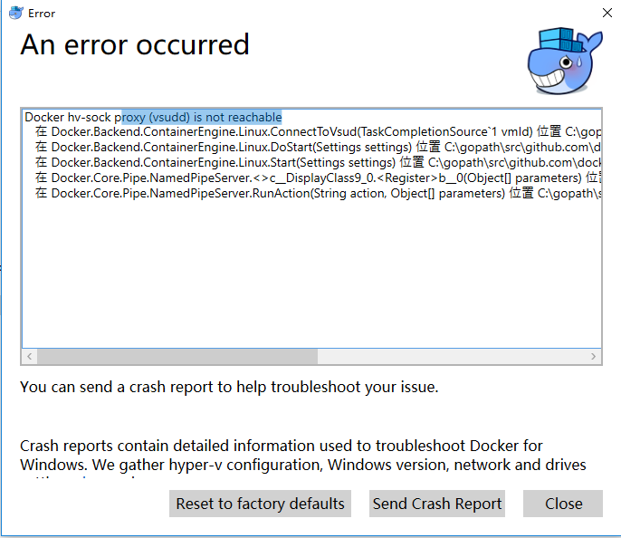

[TOC]

##1 dpkg: error processing package apport-gtk 
在安装apt-transport-https、ca-certificates时，出现下述问题：  
  
- sudo mv /var/lib/dpkg/info /var/lib/dpkg/info_old //现将info文件夹更名
- sudo mkdir /var/lib/dpkg/info //再新建一个新的info文件夹
- sudo apt-get update, apt-get -f install 
- sudo mv /var/lib/dpkg/info/* /var/lib/dpkg/info_old //执行完上一步操作后会在新的info文件夹下生成一些文件，现将这些文件全部移到info_old文件夹下  
- sudo rm -rf /var/lib/dpkg/info //把自己新建的info文件夹删掉
- sudo mv /var/lib/dpkg/info_old /var/lib/dpkg/info //把以前的info文件夹重新改回名字

##2 Docker hv-sock proxy (vsudd) is not reachable
在Docker for Windows启动时，经过很长时间等待后出现以下错误  
  
翻墙之后才查到有人指导：用管理员身份运行Docker for Windows的exe文件就可以正常启动  

