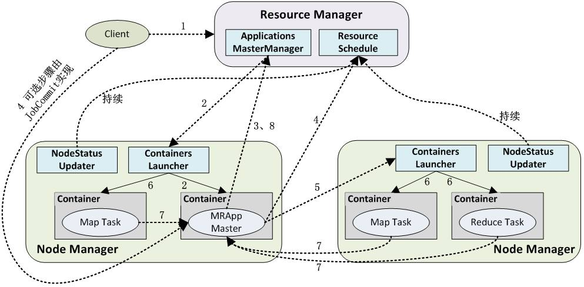

#理解Hadoop YARN架构

[TOC]

##1 介绍
YARN（Yet Another Resource Negotiator）是一个通用的资源管理平台，可为各类计算框架提供资源的管理和调度。 
其核心出发点是为了分离资源管理与作业调度/监控，实现分离的做法是拥有一个全局的资源管理器（ResourceManager，RM），以及每个应用程序对应一个的应用管理器（ApplicationMaster，AM），应用程序由一个作业（Job）或者Job的有向无环图（DAG）组成。

YARN可以将多种计算框架(如离线处理MapReduce、在线处理的Storm、迭代式计算框架Spark、流式处理框架S4等) 部署到一个公共集群中，共享集群的资源。并提供如下功能：

- **资源的统一管理和调度：** 
集群中所有节点的资源(内存、CPU、磁盘、网络等)抽象为Container。计算框架需要资源进行运算任务时需要向YARN申请Container， YARN按照特定的策略对资源进行调度进行Container的分配。
- **资源隔离： **
YARN使用了轻量级资源隔离机制Cgroups进行资源隔离以避免相互干扰，一旦Container使用的资源量超过事先定义的上限值，就将其杀死。

YARN是对Mapreduce V1重构得到的，有时候也成为MapReduce V2。  
YARN可以看成一个**云操作系统**，由一个ResourceManager和多个NodeManager组成， 它负责管理所有NodeManger上多维度资源， 并以Container(启动一个Container相当于启动一个进程)方式分配给应用程序启动ApplicationMaster(相当于主进程中运行逻辑) 或运行ApplicationMaster切分的各Task(相当于子进程中运行逻辑)。  

##2 YARN体系架构
YARN架构如下图所示：  
  
YARN总体上是Master/Slave结构，主要由ResourceManager、NodeManager、 ApplicationMaster和Container等几个组件构成。  

**■ResourceManager(RM) **
负责对各NM上的资源进行统一管理和调度。将AM分配空闲的Container运行并监控其运行状态。对AM申请的资源请求分配相应的空闲Container。主要由两个组件构成：调度器和应用程序管理器：  

1. **调度器(Scheduler)**：调度器根据容量、队列等限制条件（如每个队列分配一定的资源，最多执行一定数量的作业等），将系统中的资源分配给各个正在运行的应用程序。调度器仅根据各个应用程序的资源需求进行资源分配，而资源分配单位是Container，从而限定每个任务使用的资源量。Shceduler不负责监控或者跟踪应用程序的状态，也不负责任务因为各种原因而需要的重启（由ApplicationMaster负责）。总之，调度器根据应用程序的资源要求，以及集群机器的资源情况，为应用程序分配封装在Container中的资源。 调度器是可插拔的，例如CapacityScheduler、FairScheduler。具体看下文的调度算法。 

1. **应用程序管理器(Applications Manager)**：应用程序管理器负责管理整个系统中所有应用程序，包括应用程序提交、与调度器协商资源以启动AM、监控AM运行状态并在失败时重新启动等，跟踪分给的Container的进度、状态也是其职责。  

**■NodeManager (NM)**  
NM是每个节点上的资源和任务管理器。它会定时地向RM汇报本节点上的资源使用情况和各个Container的运行状态；同时会接收并处理来自AM的Container 启动/停止等请求。  

**■ApplicationMaster (AM)**
用户提交的应用程序均包含一个AM，负责应用的监控，跟踪应用执行状态，重启失败任务等。ApplicationMaster是应用框架，它负责向ResourceManager协调资源，并且与NodeManager协同工作完成Task的执行和监控。MapReduce就是原生支持的一种框架，可以在YARN上运行Mapreduce作业。有很多分布式应用都开发了对应的应用程序框架，用于在YARN上运行任务，例如Spark，Storm等。如果需要，我们也可以自己写一个符合规范的YARN application。  

**■Container**  
Container是YARN中的资源抽象，它封装了某个节点上的多维度资源，如内存、CPU、磁盘、网络等，当AM向RM申请资源时，RM为AM返回的资源便是用Container 表示的。 YARN会为每个任务分配一个Container且该任务只能使用该Container中描述的资源。  

##3 YARN应用工作流程
如下图所示用户向YARN中提交一个应用程序后，YARN将分两个阶段运行该应用程序：

- 启动AM ，如下步骤1~3；
- 由AM创建应用程序为它申请资源并监控它的整个运行过程，直到运行完成，如下步骤4~7。  

  

YARN应用工作流程图

1、用户向YARN中提交应用程序，其中包括AM程序、启动AM的命令、命令参数、用户程序等；事实上，需要准确描述运行ApplicationMaster的unix进程的所有信息。提交工作通常由YarnClient来完成。

2、RM为该应用程序分配第一个Container，并与对应的NM通信，要求它在这个Container中启动AM；

3、AM首先向RM注册，这样用户可以直接通过RM査看应用程序的运行状态，运行状态通过 AMRMClientAsync.CallbackHandler的getProgress() 方法来传递给RM。 然后它将为各个任务申请资源，并监控它的运行状态，直到运行结束，即重复步骤4〜7；

4、AM采用轮询的方式通过RPC协议向RM申请和领取资源；资源的协调通过 AMRMClientAsync异步完成,相应的处理方法封装在AMRMClientAsync.CallbackHandler中。

5、—旦AM申请到资源后，便与对应的NM通信，要求它启动任务；通常需要指定一个ContainerLaunchContext，提供Container启动时需要的信息。

6、NM为任务设置好运行环境(包括环境变量、JAR包、二进制程序等)后，将任务启动命令写到一个脚本中，并通过运行该脚本启动任务；

7、各个任务通过某个RPC协议向AM汇报自己的状态和进度，以让AM随时掌握各个任务的运行状态，从而可以在任务失败时重新启动任务；ApplicationMaster与NM的通信通过NMClientAsync object来完成，容器的所有事件通过NMClientAsync.CallbackHandler来处理。例如启动、状态更新、停止等。

8、应用程序运行完成后，AM向RM注销并关闭自己。

##4 YARN资源调度模型
YARN提供了一个资源管理平台能够将集群中的资源统一进行管理。所有节点上的多维度资源都会根据申请抽象为一个个Container。

YARN采用了双层资源调度模型：

- RM中的资源调度器将资源分配给各个AM：资源分配过程是异步的。资源调度器将资源分配给一个应用程序后，它不会立刻push给对应的AM，而是暂时放到一个缓冲区中，等待AM通过周期性的心跳主动来取；

- AM领取到资源后再进一步分配给它内部的各个任务：不属于YARN平台的范畴，由用户自行实现。

也就是说，ResourceManager分配集群资源的时候，以抽象的Container形式分配给各应用程序，至于应用程序的子任务如何使用这些资源，由应用程序自行决定。

YARN目前采用的资源分配算法有三种。但真实的调度器实现中还对算法做了一定程度的优化。

1、 Capacity Scheduler：该调度器用于在共享、多租户（multi-tenant）的集群环境中运行Hadoop应用，对运营尽可能友好的同时最大化吞吐量和效用。 
该调度器保证共享集群的各个组织能够得到容量的保证，同时可以超额使用集群中暂时没有人使用的资源。Capacity Scheduler为了实现这些目标，抽象了queue的概念，queue通常由管理员配置。为了进一步细分容量的使用，调度器支持层级化的queue（hierarchical queues），使得在特定组织内部，可以进一步有效利用集群资源。

Capacity调度器支持的一些特性如下：

- 层级队列（Hierarchical Queues）
- 容量保证
- 安全性：每个队列都有队列的访问权限控制（ACL）
- 弹性： 空闲资源可以额外分配给任何需要的队列
- 多租户
- 基于资源的调度（resouce-based scheduling): 对资源敏感的应用程序，可以有效地控制资源情况
- 支持用户（组）到queue的映射：基于用户组提交作业到对应queue。
- 运营支持：支持运行时配置队列的容量，ACL等。也可以在运行时停止queue阻止进一步往queue提交作业。

要使用该调度器，在conf/yarn-site.xml配置如下：
~~~xml  
<property>
	<name>yarn.resourcemanager.scheduler.class</name>
	<value>org.apache.hadoop.yarn.server.resourcemanager.scheduler.capacity.CapacityScheduler</value>
</property>
~~~  

队列的配置通过/etc/hadoop/capacity-scheduler.xml来完成。更多关于此调度器的信息，参考:
[http://hadoop.apache.org/docs/current/hadoop-yarn/hadoop-yarn-site/CapacityScheduler.html](http://http://hadoop.apache.org/docs/current/hadoop-yarn/hadoop-yarn-site/CapacityScheduler.html)

2、Fair Scheduler：公平调度FAIR，该算法的思想是尽可能地公平调度，即已分配资源量少的优先级高。也就是说，在考虑如何分配资源时，调度器尽可能使得每个应用程序都能够得到大致相当的资源。默认情况下，公平性只通过内存来衡量，但是可以配置成内存和CPU。 
这种策略使得运行时间短的应用能够尽快结束，而不至于在等待资源时被饿死。另外，也可以为应用程序配置优先级，优先级用于决定资源使用量的占比。

要使用Fair Scheduler，在conf/yarn-site.xml中如下配置：
~~~xml  
<property>
	<name>yarn.resourcemanager.scheduler.class</name>
	<value>org.apache.hadoop.yarn.server.resourcemanager.scheduler.fair.FairScheduler</value>
</property>
~~~  

进一步信息请移步官方文档:
[http://hadoop.apache.org/docs/current/hadoop-yarn/hadoop-yarn-site/FairScheduler.html](http://hadoop.apache.org/docs/current/hadoop-yarn/hadoop-yarn-site/FairScheduler.html)  

##5 实现一个简单的Application框架
前面的部分介绍了在YARN上运行应用的整个流程，理解流程最好的方式，是去实现一个简单的YARN application。

主要接口

涉及到的核心接口如下：

- Client<->RM: 
YarnClient,封装了ApplicationClientProtocol协议。
- AM<->RM: 
AMRMClientAsync,AMRMClientAsync.CallbackHandler，封装了ApplicationMasterProtocol协议。
- AM<->NM: 
NMClientAsync,NMClientAsync.CallbackHandler，封装了ContainerManagementProtocol协议。

以下这三个客户端分别封装底层的三个协议，在特殊情况下，可以直接使用底层协议实现功能。
实现一个简单Application
首先使用配置conf初始化一个YARN客户端：
~~~ini  
YarnClient yarnClient = YarnClient.createYarnClient();
yarnClient.init(conf);
yarnClient.start();
~~~  
初始化后，创建一个application：
~~~java  
YarnClientApplication app = yarnClient.createApplication();
GetNewApplicationResponse appResponse = app.getNewApplicationResponse();
~~~  
返回的Response中包含了一些集群信息，例如资源的最大最小容量，你要根据这些信息确保你的应用在申请资源的时候设置合理的值。

提交作业的核心是定义好ApplicationSubmissionContext：
~~~ini  
ApplicationSubmissionContext appContext = app.getApplicationSubmissionContext();
ApplicationId appId = appContext.getApplicationId();

appContext.setKeepContainersAcrossApplicationAttempts(keepContainers);
appContext.setApplicationName(appName);

//为Application Master设置本地资源 例如jar包，本地文件等
Map<String, LocalResource> localResources = new HashMap<String, LocalResource>();

LOG.info("Copy App Master jar from local filesystem and add to local environment");
// 复制application master的jar包到本地环境（运行AM的container）
// Create a local resource to point to the destination jar path
FileSystem fs = FileSystem.get(conf);
addToLocalResources(fs, appMasterJar, appMasterJarPath, appId.toString(),
    localResources, null);

// Set the log4j properties if needed
if (!log4jPropFile.isEmpty()) {
  addToLocalResources(fs, log4jPropFile, log4jPath, appId.toString(),
      localResources, null);
}

// The shell script has to be made available on the final container(s)
// where it will be executed.
// To do this, we need to first copy into the filesystem that is visible
// to the yarn framework.
// We do not need to set this as a local resource for the application
// master as the application master does not need it.
String hdfsShellScriptLocation = "";
long hdfsShellScriptLen = 0;
long hdfsShellScriptTimestamp = 0;
if (!shellScriptPath.isEmpty()) {
  Path shellSrc = new Path(shellScriptPath);
  String shellPathSuffix =
      appName + "/" + appId.toString() + "/" + SCRIPT_PATH;
  Path shellDst =
      new Path(fs.getHomeDirectory(), shellPathSuffix);
  fs.copyFromLocalFile(false, true, shellSrc, shellDst);
  hdfsShellScriptLocation = shellDst.toUri().toString();
  FileStatus shellFileStatus = fs.getFileStatus(shellDst);
  hdfsShellScriptLen = shellFileStatus.getLen();
  hdfsShellScriptTimestamp = shellFileStatus.getModificationTime();
}

if (!shellCommand.isEmpty()) {
  addToLocalResources(fs, null, shellCommandPath, appId.toString(),
      localResources, shellCommand);
}

if (shellArgs.length > 0) {
  addToLocalResources(fs, null, shellArgsPath, appId.toString(),
      localResources, StringUtils.join(shellArgs, " "));
}

// 设置AM运行的环境变量
LOG.info("Set the environment for the application master");
Map<String, String> env = new HashMap<String, String>();

// put location of shell script into env
// using the env info, the application master will create the correct local resource for the
// eventual containers that will be launched to execute the shell scripts
env.put(DSConstants.DISTRIBUTEDSHELLSCRIPTLOCATION, hdfsShellScriptLocation);
env.put(DSConstants.DISTRIBUTEDSHELLSCRIPTTIMESTAMP, Long.toString(hdfsShellScriptTimestamp));
env.put(DSConstants.DISTRIBUTEDSHELLSCRIPTLEN, Long.toString(hdfsShellScriptLen));

// Add AppMaster.jar location to classpath
// At some point we should not be required to add
// the hadoop specific classpaths to the env.
// It should be provided out of the box.
// For now setting all required classpaths including
// the classpath to "." for the application jar
StringBuilder classPathEnv = new StringBuilder(Environment.CLASSPATH.$$())
  .append(ApplicationConstants.CLASS_PATH_SEPARATOR).append("./*");
for (String c : conf.getStrings(
    YarnConfiguration.YARN_APPLICATION_CLASSPATH,
    YarnConfiguration.DEFAULT_YARN_CROSS_PLATFORM_APPLICATION_CLASSPATH)) {
  classPathEnv.append(ApplicationConstants.CLASS_PATH_SEPARATOR);
  classPathEnv.append(c.trim());
}
classPathEnv.append(ApplicationConstants.CLASS_PATH_SEPARATOR).append(
  "./log4j.properties");

// Set the necessary command to execute the application master
Vector<CharSequence> vargs = new Vector<CharSequence>(30);
// Set java executable command
LOG.info("Setting up app master command");
vargs.add(Environment.JAVA_HOME.$$() + "/bin/java");
// Set Xmx based on am memory size
vargs.add("-Xmx" + amMemory + "m");
// 设置application maser的Main类
vargs.add(appMasterMainClass);
// Set params for Application Master
vargs.add("--container_memory " + String.valueOf(containerMemory));
vargs.add("--container_vcores " + String.valueOf(containerVirtualCores));
vargs.add("--num_containers " + String.valueOf(numContainers));
vargs.add("--priority " + String.valueOf(shellCmdPriority));

for (Map.Entry<String, String> entry : shellEnv.entrySet()) {
  vargs.add("--shell_env " + entry.getKey() + "=" + entry.getValue());
}
if (debugFlag) {
  vargs.add("--debug");
}

vargs.add("1>" + ApplicationConstants.LOG_DIR_EXPANSION_VAR + "/AppMaster.stdout");
vargs.add("2>" + ApplicationConstants.LOG_DIR_EXPANSION_VAR + "/AppMaster.stderr");

// Get final commmand
StringBuilder command = new StringBuilder();
for (CharSequence str : vargs) {
  command.append(str).append(" ");
}

LOG.info("Completed setting up app master command " + command.toString());
List<String> commands = new ArrayList<String>();
commands.add(command.toString());

// Set up the container launch context for the application master
ContainerLaunchContext amContainer = ContainerLaunchContext.newInstance(
  localResources, env, commands, null, null, null);

// Set up resource type requirements
// For now, both memory and vcores are supported, so we set memory and
// vcores requirements
Resource capability = Resource.newInstance(amMemory, amVCores);
appContext.setResource(capability);

// Service data is a binary blob that can be passed to the application
// Not needed in this scenario
// amContainer.setServiceData(serviceData);

// Setup security tokens
if (UserGroupInformation.isSecurityEnabled()) {
  // Note: Credentials class is marked as LimitedPrivate for HDFS and MapReduce
  Credentials credentials = new Credentials();
  String tokenRenewer = conf.get(YarnConfiguration.RM_PRINCIPAL);
  if (tokenRenewer == null | | tokenRenewer.length() == 0) {
    throw new IOException(
      "Can't get Master Kerberos principal for the RM to use as renewer");
  }

  // For now, only getting tokens for the default file-system.
  final Token<?> tokens[] =
      fs.addDelegationTokens(tokenRenewer, credentials);
  if (tokens != null) {
    for (Token<?> token : tokens) {
      LOG.info("Got dt for " + fs.getUri() + "; " + token);
    }
  }
  DataOutputBuffer dob = new DataOutputBuffer();
  credentials.writeTokenStorageToStream(dob);
  ByteBuffer fsTokens = ByteBuffer.wrap(dob.getData(), 0, dob.getLength());
  amContainer.setTokens(fsTokens);
}

appContext.setAMContainerSpec(amContainer);
~~~  
设置好Context之后，提交作业：  
~~~java  
// 设置application master的优先级
Priority pri = Priority.newInstance(amPriority);
appContext.setPriority(pri);

// 设置应用程序要提交到RM的哪个队列queue
appContext.setQueue(amQueue);

yarnClient.submitApplication(appContext);
~~~   

提交之后，可以有多种方式与RM保持通信：  
~~~java  
// 获取appId对应的状态报告
ApplicationReport report = yarnClient.getApplicationReport(appId);
~~~  

也可以杀死应用程序：
~~~java  
yarnClient.killApplication(appId);
~~~  

实现ApplicationMaster的关键步骤

实现AM，其实就是实现应用程序运行中的主要步骤，就是上面介绍的8个步骤。

当RM分配一个Container并且启动了AM之后，AM可以获取到一些参数，例如container id，作业提交信息以及container的宿主信息等。与RM的所有交互都必须使用ApplicationAttempId，这个值可以从ContainerId获取：

~~~java  
Map<String, String> envs = System.getenv();
String containerIdString =
    envs.get(ApplicationConstants.AM_CONTAINER_ID_ENV);
if (containerIdString == null) {
  // container id should always be set in the env by the framework
  throw new IllegalArgumentException(
      "ContainerId not set in the environment");
}
ContainerId containerId = ConverterUtils.toContainerId(containerIdString);
ApplicationAttemptId appAttemptID = containerId.getApplicationAttemptId();
~~~  

AM初始化之后，我们可以启动两个客户端，一个与RM通信，一个与NM通信，并且为客户端设置自己的回调处理方法：

~~~java  
AMRMClientAsync.CallbackHandler allocListener = new RMCallbackHandler();
amRMClient = AMRMClientAsync.createAMRMClientAsync(1000, allocListener);
amRMClient.init(conf);
amRMClient.start();

containerListener = createNMCallbackHandler();
nmClientAsync = new NMClientAsyncImpl(containerListener);
nmClientAsync.init(conf);
nmClientAsync.start();
~~~  

AM需要向ResourceManager发送心跳以免RM认为我们挂掉，超期时间通过 YarnConfiguration.RM_AM_EXPIRY_INTERVAL_MS设置，默认为YarnConfiguration.DEFAULT_RM_AM_EXPIRY_INTERVAL_MS。为了发送心跳，首先得向RM注册自己：  

~~~java  
// Register self with ResourceManager
// This will start heartbeating to the RM
appMasterHostname = NetUtils.getHostname();
RegisterApplicationMasterResponse response = amRMClient
    .registerApplicationMaster(appMasterHostname, appMasterRpcPort, appMasterTrackingUrl);
~~~  

返回结果中包含资源的最大容量，可以用来check我们的资源请求是否合理。

~~~java  
// Dump out information about cluster capability as seen by the
// resource manager
int maxMem = response.getMaximumResourceCapability().getMemory();
LOG.info("Max mem capabililty of resources in this cluster " + maxMem);

int maxVCores = response.getMaximumResourceCapability().getVirtualCores();
LOG.info("Max vcores capabililty of resources in this cluster " + maxVCores);

// A resource ask cannot exceed the max.
if (containerMemory > maxMem) {
  LOG.info("Container memory specified above max threshold of cluster."
      + " Using max value." + ", specified=" + containerMemory + ", max="
      + maxMem);
  containerMemory = maxMem;
}

if (containerVirtualCores > maxVCores) {
  LOG.info("Container virtual cores specified above max threshold of  cluster."
    + " Using max value." + ", specified=" + containerVirtualCores + ", max="
    + maxVCores);
  containerVirtualCores = maxVCores;
}
List<Container> previousAMRunningContainers =
    response.getContainersFromPreviousAttempts();
LOG.info("Received " + previousAMRunningContainers.size()
        + " previous AM's running containers on AM registration.");
~~~  

接着我们可以根据需要向RM申请资源了：

~~~java  
List<Container> previousAMRunningContainers =
    response.getContainersFromPreviousAttempts();
List<Container> previousAMRunningContainers =
    response.getContainersFromPreviousAttempts();
LOG.info("Received " + previousAMRunningContainers.size()
    + " previous AM's running containers on AM registration.");

int numTotalContainersToRequest =
    numTotalContainers - previousAMRunningContainers.size();
// Setup ask for containers from RM
// Send request for containers to RM
// Until we get our fully allocated quota, we keep on polling RM for
// containers
// Keep looping until all the containers are launched and shell script
// executed on them ( regardless of success/failure).
for (int i = 0; i < numTotalContainersToRequest; ++i) {
  ContainerRequest containerAsk = setupContainerAskForRM();
  amRMClient.addContainerRequest(containerAsk);
}
~~~  

setupContainerAskForRM方法中，需要设置资源容量以及优先级：

~~~java  
private ContainerRequest setupContainerAskForRM() {
  // setup requirements for hosts
  // using * as any host will do for the distributed shell app
  // set the priority for the request
  Priority pri = Priority.newInstance(requestPriority);

  // Set up resource type requirements
  // For now, memory and CPU are supported so we set memory and cpu requirements
  Resource capability = Resource.newInstance(containerMemory,
    containerVirtualCores);

  ContainerRequest request = new ContainerRequest(capability, null, null,
      pri);
  LOG.info("Requested container ask: " + request.toString());
  return request;
}
~~~  

资源申请提交后，由于分配时异步的，因此需要设置好回调，通过实现AMRMClientAsync.CallbackHandler来完成：

~~~java  
@Override
public void onContainersAllocated(List<Container> allocatedContainers) {
  LOG.info("Got response from RM for container ask, allocatedCnt="
      + allocatedContainers.size());
  numAllocatedContainers.addAndGet(allocatedContainers.size());
  for (Container allocatedContainer : allocatedContainers) {
    LaunchContainerRunnable runnableLaunchContainer =
        new LaunchContainerRunnable(allocatedContainer, containerListener);
    Thread launchThread = new Thread(runnableLaunchContainer);

    // launch and start the container on a separate thread to keep
    // the main thread unblocked
    // as all containers may not be allocated at one go.
    launchThreads.add(launchThread);
    launchThread.start();
  }
}
~~~  

同时也要通过心跳发送进度：

~~~java  
@Override
public float getProgress() {
  // set progress to deliver to RM on next heartbeat
  float progress = (float) numCompletedContainers.get()
      / numTotalContainers;
  return progress;
}
~~~  

上面的Container启动线程在NM上启动container，在启动之前，需要准备好ContainerLaunchContext：  

~~~java  
// Set the necessary command to execute on the allocated container
Vector<CharSequence> vargs = new Vector<CharSequence>(5);

// Set executable command
vargs.add(shellCommand);
// Set shell script path
if (!scriptPath.isEmpty()) {
  vargs.add(Shell.WINDOWS ? ExecBatScripStringtPath
    : ExecShellStringPath);
}

// Set args for the shell command if any
vargs.add(shellArgs);
// Add log redirect params
vargs.add("1>" + ApplicationConstants.LOG_DIR_EXPANSION_VAR + "/stdout");
vargs.add("2>" + ApplicationConstants.LOG_DIR_EXPANSION_VAR + "/stderr");

// Get final commmand
StringBuilder command = new StringBuilder();
for (CharSequence str : vargs) {
  command.append(str).append(" ");
}

List<String> commands = new ArrayList<String>();
commands.add(command.toString());

// Set up ContainerLaunchContext, setting local resource, environment,
// command and token for constructor.

// Note for tokens: Set up tokens for the container too. Today, for normal
// shell commands, the container in distribute-shell doesn't need any
// tokens. We are populating them mainly for NodeManagers to be able to
// download anyfiles in the distributed file-system. The tokens are
// otherwise also useful in cases, for e.g., when one is running a
// "hadoop dfs" command inside the distributed shell.
ContainerLaunchContext ctx = ContainerLaunchContext.newInstance(
  localResources, shellEnv, commands, null, allTokens.duplicate(), null);
containerListener.addContainer(container.getId(), container);
~~~  

准备好之后，通过NMClientAsync启动：

~~~java  
nmClientAsync.startContainerAsync(container, ctx);
~~~  

NMClientAsync及其相应的Callback，会处理容器发布的各种事件，例如启动、停止，状态更新等。

当ApplicationMaster确认自己的任务完成后，向RM注销并关闭客户端：

~~~java  
try {
  amRMClient.unregisterApplicationMaster(appStatus, appMessage, null);
} catch (YarnException ex) {
  LOG.error("Failed to unregister application", ex);
} catch (IOException e) {
  LOG.error("Failed to unregister application", e);
}

amRMClient.stop();
~~~  

--EOF--