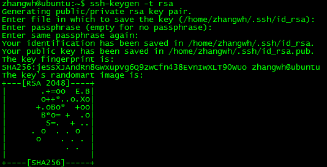

#Hadoop实战
[TOC]
##0 集群基本信息
两台Ubuntu虚拟机：
Ubuntu01：192.168.211.133  
Ubuntu02：193.168.211.134  
##1 Hadoop环境搭建
1. JDK1.6以上
2. 配置SSH免登录  
分别在Ubuntu01、Ubuntu02执行：
`ssh-keygen -t rsa`  
Ubuntu01结果：  
  
Ubuntu02结果：  
  
>ssh-keygen解读：
>-t：区分大小写，密钥类型，rsa：rsa密钥认证
  

分别在两台主机上将生成的id_rsa.pub添加到认证文件：  
`cat ~/.ssh/id_rsa.pub >>  ~/.ssh/authorized_keys`
验证ssh免登录，可以输入如下命令，如果不提示输入密码说明已经成功：  
`ssh localhost`  
  

分别将Ubuntu01和Ubuntu02的id_rsa.pub文件拷贝到对方服务器，再将文件添加到认证文件，执行如下ssh登录命令，确认是否实现面密码登录  
  
  
