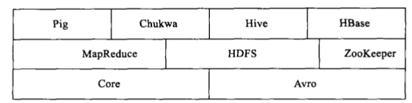
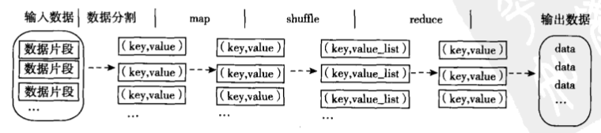
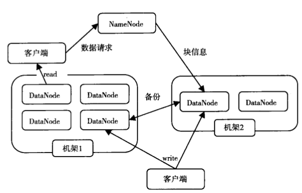

#Hadoop基础知识
[TOC]

##1 关系数据库 VS MapReduce
|传统关系数据库|MapReduce
---|----|-----
数据大小|GB|PB
访问|交互式和批处理|批处理
更新|多次读写|一次写入多次读取
结构|静态模式|动态模式
完整性|高|低
横向扩展|非线性|线性

##2 Hadoop生态圈
  
- Common：一组分布式文件系统和通用I/O组件与接口（序列化、Java RPC、持久化数据结构）
- Avro：一种支持高效、跨语言的RPC以及永久存储数据的序列化系统
- MapReduce：分布式数据处理模型和执行环境，运行于大型商用机集群
- HDFS：分布式文件系统，运行于大型商用机集群
- Pig：一种数据流语言和运行环境，用以检索非常大的数据集。pig运行在MapReduce和HDFS集群上，**能够支持高并发**
- Hive：一个分布式、按列存储的数据仓库。Hive管理HDFS中存储的数据，并提供基于SQL的查询语言（由运行时引擎翻译成MapReduce作业）用以查询数据
- HBase：分布式、按列存储数据库。使用HDFS作为底层存储，同时支持MapReduce的批量计算和点查询（随机读取）  
- ZooKeeper：分布式、可用性高的协调服务。提供分布式锁之类的基本服务用于构建分布式应用
- Sqoop：在数据库和HDFS之间高效传输数据的工具

##3 MapReduce
MapReduce的核心假设：可以进行高速的流式读写操作  
MapReduce的核心特征：数据本地化（data locality）  
  
无共享（Shared-nothing）框架：各任务之间彼此独立，不共享任何数据或者资源。因此，程序员无需考虑系统的部分失效（任务失效）问题，也不需考虑任务的执行顺序，框架自身的实现能够检测到失败的map或reduce任务，并让正常运行的机器重新执行这些失败的任务。
>MapReducer本身控制着mapper输出结果传递给reducer过程；这种情况下，重新运行reducer比重新运行mapper更需要格外小心，因此reducer需要获取必要的mapper输出结果，如果没有获得必要的输出结果，必须再次运行相关mapper重新生成输出结果

MapReduce谷歌工程师开发，用于构建搜索引擎索引。很多传统算法都可以使用MapReduce来表达  
MapReduce服务于只需数分钟或数小时即可完成的作业，并且运行于内部通过高速网络连接的单一数据中心内，并且该DC内的计算机需要由可靠的、定制的硬件构成  
>如果使用消息传递接口（Message Passing Interface， MPI）进行调用的程序必须显式管理自身检查点和恢复机制，虽然更多控制权交给了程序员，编程的难度也显著增大  

吸取MapReduce思路的RMDBS：Aster DATA、GreenPlum  
MapReduce的高级查询语言：Pig、Hive更接近传统的数据库编程方式  

##4 HDFS
###4.1 设计目标
- 检测和快速恢复硬件故障
- 流式数据访问
HDFS使应用程序流式访问数据集。适合批处理，而不重视用户交互处理。重视吞吐量，不重视访问反应速度  
- 简化一致性模型
大部分文件操作场景为：一次写入，多次读取。文件一旦经过创建、写入、关闭后就不需要修改，从而简化数据一致性问题和高吞吐量数据访问问题  
- 通信协议
建立在TCP/IP上。Client到NameNode，使用Client Protocal（客户端协议）；DataNode 到 NameNode，使用DataNode Protocal  

###4.2 体系结构
采用master/slave结构，一个HDFS集群由一个NameNode和若干DataNode组成。其中NameNode作为主服务器，管理文件系统的命名空间和客户端对文件的访问操作；DataNode管理存储的数据。HDFS存储用户的文件形式的数据。  

HDFS内部，文件被分成若干个数据块，这些数据块分别存储在一组DataNode上。
- NameNode执行文件系统的命名空间操作，如：打开、关闭、重命名文件或目录等，它也负责数据块到具体DataNode的映射。NameNode是所有HDFS元数据的管理者，用户数据永远不会经过NameNode  
- DataNode负责处理文件系统客户端的文件读写请求，并在NameNode的统一调度下进行数据块的创建、删除、复制等工作  

P40
