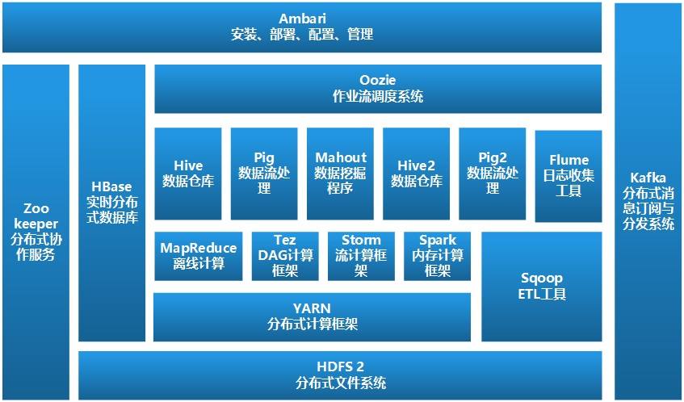
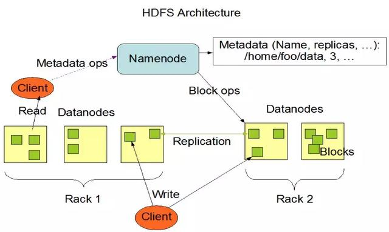
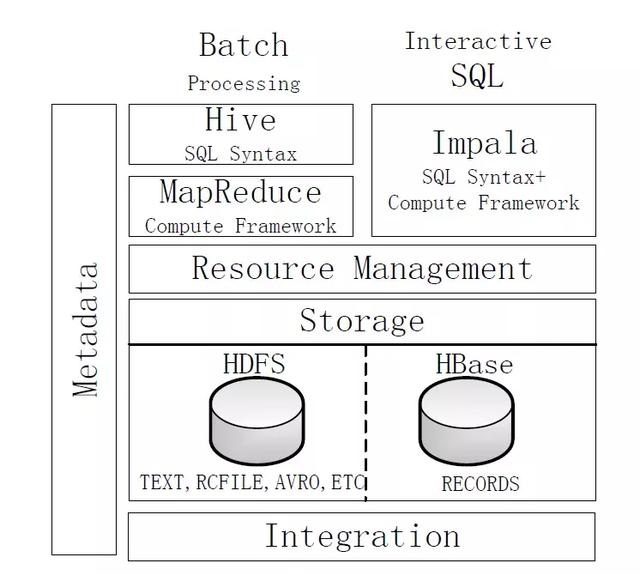
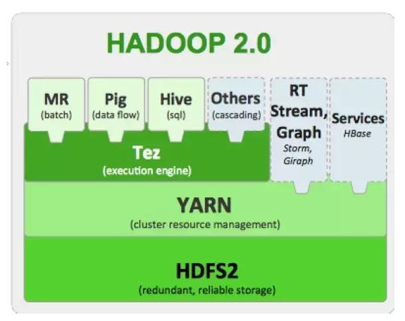
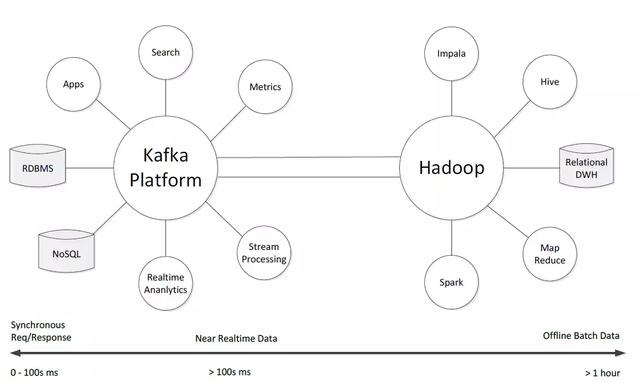
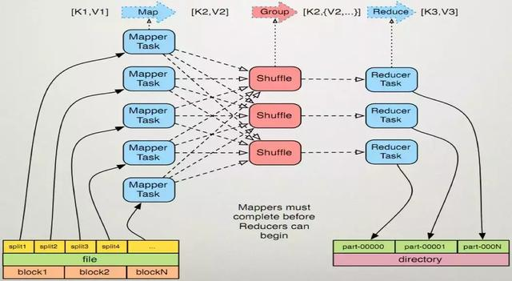

#Hadoop基础知识
[TOC]

##1 关系数据库 VS MapReduce
|传统关系数据库|MapReduce
---|----|-----
数据大小|GB|PB
访问|交互式和批处理|批处理
更新|多次读写|一次写入多次读取
结构|静态模式|动态模式
完整性|高|低
横向扩展|非线性|线性

##2 Hadoop生态圈
Hadoop2.x的生态系统如下图所示：
  
- HDFS：分布式文件系统
- MapReduce：分布式并行编程模型，多用于离线计算
- YARN：资源管理与调度框架
- Tez：运行在YARN框架下的，下一代Hadoop查询处理框架  
- Hive：基于Hadoop的数据仓库
- HBase：基于Hadoop的NoSQL（Key-Value）数据库  
- Pig：基于Hadoop的大规模数据分析平台，提供类SQL查询语言Pig Latin  
- Sqoop：传统关系数据库与Hadoop数据迁移工具  
- Oozie：Hadoop工作流引擎  
- Zookeeper：提供分布式协作服务  
- Flume：分布式日志收集系统  
- Ambari：Hadoop快速部署工具，支持Apache Hadoop的供应、管理与监控  
- Kafka：高吞吐量分布式发布订阅消息系统，可以处理消费者关注的网站中的动作  

Hadoop1.x的生态系统如下图所示：  
  
- Common：一组分布式文件系统和通用I/O组件与接口（序列化、Java RPC、持久化数据结构）
- Avro：一种支持高效、跨语言的RPC以及永久存储数据的序列化系统
- MapReduce：分布式数据处理模型和执行环境，运行于大型商用机集群
- HDFS：分布式文件系统，运行于大型商用机集群
- Pig：一种数据流语言和运行环境，用以检索非常大的数据集。pig运行在MapReduce和HDFS集群上，**能够支持高并发**
- Hive：一个分布式、按列存储的数据仓库。Hive管理HDFS中存储的数据，并提供基于SQL的查询语言（由运行时引擎翻译成MapReduce作业）用以查询数据
- HBase：分布式、按列存储数据库。使用HDFS作为底层存储，同时支持MapReduce的批量计算和点查询（随机读取）  
- ZooKeeper：分布式、可用性高的协调服务。提供分布式锁之类的基本服务用于构建分布式应用
- Sqoop：在数据库和HDFS之间高效传输数据的工具

大数据计算模式极其代表产品
大数据计算模式|解决问题|代表产品
-----|------|-------
批处理计算|针对大规模数据的批量处理|MapReduce、Spark等
流计算|针对流数据的实时计算|Storm、S4、Flume、Streams、Puma、DStream、SuperMario、银河数据处理平台
图计算|针对大规模图结构数据的处理|Pregel、GraphX、Giraph、PowerGraph、Hama、GoldenOrb等
查询分析计算|大规模数据的存储管理和查询分析|Dremel、Hive、Cassandra、Impala等

##3 MapReduce
MapReduce的核心假设：可以进行高速的流式读写操作  
MapReduce的核心特征：数据本地化（data locality）  
  
无共享（Shared-nothing）框架：各任务之间彼此独立，不共享任何数据或者资源。因此，程序员无需考虑系统的部分失效（任务失效）问题，也不需考虑任务的执行顺序，框架自身的实现能够检测到失败的map或reduce任务，并让正常运行的机器重新执行这些失败的任务。
>MapReducer本身控制着mapper输出结果传递给reducer过程；这种情况下，重新运行reducer比重新运行mapper更需要格外小心，因此reducer需要获取必要的mapper输出结果，如果没有获得必要的输出结果，必须再次运行相关mapper重新生成输出结果

MapReduce谷歌工程师开发，用于构建搜索引擎索引。很多传统算法都可以使用MapReduce来表达  
MapReduce服务于只需数分钟或数小时即可完成的作业，并且运行于内部通过高速网络连接的单一数据中心内，并且该DC内的计算机需要由可靠的、定制的硬件构成  
>如果使用消息传递接口（Message Passing Interface， MPI）进行调用的程序必须显式管理自身检查点和恢复机制，虽然更多控制权交给了程序员，编程的难度也显著增大  

吸取MapReduce思路的RMDBS：Aster DATA、GreenPlum  
MapReduce的高级查询语言：Pig、Hive更接近传统的数据库编程方式  

###3.1 MapReduce体系结构
- JobTracker：单独运行在主节点。负责调度构成一个作业的所有任务，这些任务分布在不同的从节点上。主节点监控它们执行情况，并且重新执行之前失败的任务
- TaskTracker：运行在每个集群节点。从节点仅负责由主节点派发的任务

Job提交时，JobTracker接收到提交作业和配置信息后，将配置信息等分发给从节点，同时调度任务并监控TaskTracker执行  
MapReduce的数据流图如下。该过程就是将大数据集分解为成百上千个小数据集，每个数据集分别由集群中的一个节点进行处理并生成中间结果，然后这些中间结果又由大量的节点合并，形成最终结果。MapReduce框架下并行程序的三个主要函数：map、reduce、main，用户仅需要根据任务编写map、reduce函数  
  

##4 HDFS
HDFS（Hadoop Distributed File System，Hadoop分布式文件系统），它是一个高度容错性的系统，适合部署在廉价的机器上。HDFS能提供高吞吐量的数据访问，适合那些有着超大数据集（large data set）的应用程序。
###4.1 设计目标
- 检测和快速恢复硬件故障
- 流式数据访问
HDFS使应用程序流式访问数据集。适合批处理，而不重视用户交互处理。重视吞吐量，不重视访问反应速度  
- 简化一致性模型
大部分文件操作场景为：一次写入，多次读取。文件一旦经过创建、写入、关闭后就不需要修改，从而简化数据一致性问题和高吞吐量数据访问问题  
- 通信协议
建立在TCP/IP上。Client到NameNode，使用Client Protocal（客户端协议）；DataNode 到 NameNode，使用DataNode Protocal  

###4.2 体系结构
采用master/slave结构，一个HDFS集群由一个NameNode和若干DataNode组成。其中NameNode作为主服务器，管理文件系统的命名空间和客户端对文件的访问操作；DataNode管理存储的数据。HDFS存储用户的文件形式的数据。  

HDFS内部，文件被分成若干个数据块，这些数据块分别存储在一组DataNode上。
- NameNode执行文件系统的命名空间操作，如：打开、关闭、重命名文件或目录等，它也负责数据块到具体DataNode的映射。NameNode是所有HDFS元数据的管理者，用户数据永远不会经过NameNode  
- DataNode负责处理文件系统客户端的文件读写请求，并在NameNode的统一调度下进行数据块的创建、删除、复制等工作  

###4.3 HDFS特性
- 对于整个集群有单一的命名空间
- 数据一致性。适合一次写入多次读取的模型，客户端在文件没有被成功创建前无法看到文件存在
- 文件被分成多个文件块，每个文件块被分配存储到数据节点，而且根据配置由复制文件块来保证数据的安全性
  
  
  

###4.4 HDFS数据管理亮点
- 文件块的放置：一个Block默认有3个备份，一份放在NameNode指定DataNode上，另一份放在与指定DataNode不在同一台机器上的DataNode上，最后一份放在与指定DataNode在同一Rack上的DataNode上。
采用此种配置主要考虑：同一Rack失败的情况，以及不同Rack间的数据拷贝性能问题
- 心跳检测：检测DataNode健康状况，如发现问题采取数据备份的方式来保证数据的安全性  
- 数据复制：
  □ 场景：DataNode失败、需要平衡DataNode的存储利用率和平台DataNOde数据交互压力等情况  
  □ 可以用HDFS的balancer命令配置Thredhold来平衡每个DataNode磁盘利用率。执行balancer命令时，先计算DataNode磁盘的利用率的平均值，然后判断如果某DataNode利用率超过这个平均值，将会把这个DataNode的block转移到利用率低的DataNode上，对于新节点十分有用  
- 数据校验：采用CRC32数据校验。在写入文件Block时，除写入数据还写入校验信息，读取时需要校验后再读入
- 单NameNode：如果失败，任务处理信息将会记录在本地文件系统和远端文件系统
- 数据管道性写入：当客户端要写入文件到DataNode，客户端先读取一个Block，然后写到第一个DataNode上，接着由第一个DataNode将其传递到备份的DataNode上，直到所有需要写入这个Block的DataNode都成功写入后，客户端才会开始写下一个Block
- 安全模式：分布式文件系统启动时会有安全模式（系统运行期间也可以通过命令进入安全模式），当分布式文件系统处于安全模式时，文件系统中的内容不允许修改也不允许删除，直到安全模式结束。安全模式主要为了系统启动时检查各DataNode上的数据块的有效性，同时根据策略进行必要的复制或删除部分数据块。实际操作过程中，若系统启动时修改、删除文件会出现安全模式不允许修改的错误提示，需要等待一会儿即可  

###4.5 HDFS关键概念
####4.5.1 块（Block）
− HDFS有自己的管理单位，称为数据块。
− 它的大小是根据硬件特性和一些指标推算出来的，如一个指标就是减小寻址开销，典型的大小是64MB。
− 当一个文件在HDFS上进行存储时，它会按照数据块大小被分成多个块，而且一个文件的每个块会尽可能地存储于不同的DataNode中。

####4.5.2 名称节点（NameNode）
− 管理者，是一个中心服务器。
− 负责管理文件系统的命名空间（NameSpace），命名空间信息在命名空间镜像（fsimage）和编辑日志（edits）中永久保存。
	- fsimage中保存的是命名空间的元数据信息；
	- edits保存的是对命名空间的所有操作。
- 它还记录着文件系统中各文件对应数据块到具体DataNode节点的映射，但这些信息是系统启动时从各个DataNode获取的，不会永久保存在名称节点。
− 提供对命名空间的基本操作，如打开、关闭、重命名文件或目录。

####4.5.3 数据节点（DataNode）
− 工作者。
− 负责管理它所在节点上的存储。
− 处理客户端的读写请求，在NameNode的统一调度下进行数据块的创建、读取、删除和复制，并定时向NameNode发送它所存储的块的列表。

####4.5.4 命名空间（NameSpace）
− HDFS支持传统的层次型文件组织结构。

####4.5.5 元数据（Metadata）
− 用来描述目录或文件基本信息的结构。

####4.5.6 副本
− 在HDFS中，对一个数据块的存储就称为存储了一个副本，副本的个数是可以配置的，默认为3。

##5 HBase
HBase是一个高可靠、高性能、面向列、可伸缩的分布式数据库，是谷歌BigTable的开源实现，主要用来存储非结构化和半结构化的松散数据。HBase的目标是处理非常庞大的表，可以通过水平扩展的方式，利用廉价计算机集群处理由超过10亿行数据和数百万列元素组成的数据表

HBase可以直接使用本地文件系统或者Hadoop作为数据存储方式，不过为了提高数据可靠性和系统的健壮性，发挥HBase处理大数据量等功能，需要使用Hadoop作为文件系统。与Hadoop一样，HBase目标主要依靠横向扩展，通过不断增加廉价的商用服务器来增加计算和存储能力。

###5.1 HBase数据管理
HBase是一个稀疏的、长期存储的（落盘）、多维度的排序映射表。这张表的索引是行关键字、列关键字、时间戳  
每个值是一个不解释的字符数组（字符串），数据都是字符串，没有类型。用户在表格中存储数据，每一行都有一个可排序的主见和任意多列。由于是稀疏存储，所以同一张表中，每一行数据都可以有截然不同的列。列名字的格式`<family>:<label>`，它是由字符串组成的，每张表有一个family集合，这个集合是固定不变的，相当于表的结构，只能通过改变表结构来改变表的family集合，但是label值相对于每一行来说都是可以改变的  
HBase将同一个family中的数据存储在同一个目录下，而HBase的写操作是锁行的，每一行都是一个原子元素，都可以加锁。所有数据库的更新都有一个时间戳标记，每次更新都会生成一个新版本，而HBase会保留一定数量的版本，版本数可以设定。客户端可以选择获取距离某个时间点最近的版本，或一次获取所有版本
###5.2 体系结构
- HBaseMaster：HBase主服务器，与Bigtable的主服务器类似
- HRegionServer：HBase域服务器，与Bigtable的Tablet服务器类似
- HBaseClient：HBase客户端，由org.apache.hadoop.HBase.client.HTable定义

###5.3 HBaseMaster
HBase主服务器只部署一台，通过Leader Election Algorithm确保只有唯一的主服务器活跃，Zookeeper保存主服务器的服务器地址信息。主服务器瘫痪，再通过Leader Election Algorithm算法选举新的主服务器  

- **元表（Meta Table）**：包含了所有用户域的基本信息，域信息包括起始关键字、结束关键字、域是否在线、域所在的域服务器地址等。元表随着用户域的增长而增长  
- **根表（Root Table）**：被定义存储单一域信息，并指向元表中的所有域。根表也包含每个元域的信息和元域所在的域服务器地址  

根表、元表中的每行大约为1KB。域默认大小为256MB，根于可映射2.6×15个元域。元域可以映射相应数量的用户域。根域可以映射6.9×1010个用户域，大约可以存储1.9×1010字节数据

###5.4 HRegionServer
HBase域服务器功能：
- 服务于主服务器分配的域
- 处理客户端的读写请求
- 缓冲区回写
- 压缩和分割域

每个域只能由一台域，它会从HDFS文件系统读取日志和所有存储文件  
- **写入请求**，首先写HLog，同一域中的请求记录在同一HLog文件中。一旦写入HLog中，它将被缓存在存储缓存区（MemCache），每个HStore对应一个存储缓存区。  
- **读请求**先检测存储缓存区中是否命中，未命中再去查相关映射文件  
当HLog达到一定阈值，缓存区写入磁盘，形成映射文件，并在HLog中标记（相当于检查点，之前的部分相当于已经归档）  
- 映射文件数量达到一定阈值，域服务器将最近常写入的映射文件轻度合并压缩  
域服务器还会周期性的对所有映射文件进行压缩，形成单一映射文件  
映射文件大小达到一定阈值（默认256MB），域服务器要对域进行分割，域被均分为2个子域。（由父域到子域，父域下线，在元域中记录新子域）

###5.5 HBaseClient
负责查找用户域所在的域服务器地址  
客户端与服务端交换数据查找根域的位置（两者唯一交流）  
通信过程：  

##6 Hive
Hive与传统数据库对比  
对比内容|Hive|传统数据库
-----|------|------
数据插入|支持批量导入|支持单条和批量导入
数据更新|不支持|支持
索引|支持|支持
分区|支持|支持
执行延迟|高|低
扩展性|好|有限

Hive是一个构建于Hadoop顶层的数据仓库工具，由Facebook公司开发，并在2008年8月开源。Hive在某种程度上可以看作是用户编程接口，其本身并不存储和处理数据，而是依赖HDFS来存储数据，依赖MapReduce来处理数据。Hive定义了简单的类似SQL的查询语言——HiveQL，它与大部分SQL语法兼容，但是，并不完全支持SQL标准，比如，HiveSQL不支持更新操作，也不支持索引和事务，它的子查询和连接操作也存在很多局限。

HiveQL语句可以快速实现简单的MapReduce任务，这样用户通过编写的HiveQL语句就可以运行MapReduce任务，不必编写复杂的MapReduce应用程序。对于Java开发工程师而言，就不必花费大量精力在记忆常见的数据运算与底层的MapReduce Java API的对应关系上；对于DBA来说，可以很容易把原来构建在关系数据库上的数据仓库应用程序移植到Hadoop平台上。所以说，Hive是一个可以有效、合理、直观地组织和使用数据的分析工具。
Hive数据管理按层次分为：元数据存储、数据存储、数据交换  

###6.1 元数据存储
Hive元数据存储在RDBMS中，有三种模式连接到数据库：  
- Single User Mode：连接到内存数据库Derby，用于UnitTest  
- Multi User Mode：通过网络连接到数据库  
- Remote Server Mode：用于非Java客户端访问元数据库，服务器端启动一个MetaStoreServer，客户端利用Thrift协议访问元数据库  

###6.2 数据存储
无专门数据存储格式，无数据索引。用户可以自由组织Hive表，建表时，只需指定数据的列分隔符，行分隔符  
Hive数据存储有四种模型：  
- Table：传统表的概念，在HDFS中都有相应的目录。数据将搬运到Hive的表中，直接访问  
- External Table：HDFS中已存在的数据。数据加载与创建表同时完成，数据实际存储在HDFS的路径中，不搬运到数据仓库  
- Partition：数据库中Partition列的密集索引。对应于表下的一个目录  
- Bucket：对指定列计算hash，根据hash切分数据

###6.3 数据交换
- 用户接口：客户端、Web界面、数据库接口  
- 元数据存储：关系数据库中，MySQL或Derby中  
- 解析器、编译器、优化器、执行器  
- Hadoop：用HDFS进行存储，利用MapReduce计算  

##7 Impala
Hive 作为现有比较流行的数据仓库分析工具之一，得到了广泛的应用，但是由于Hive采用MapReduce 来完成批量数据处理，因此，实时性不好，查询延迟较高。Impala 作为新一代开源大数据分析引擎，支持实时计算，它提供了与Hive 类似的功能，并在性能上比Hive高出3~30 倍。Impala 发展势头迅猛，甚至有可能会超过Hive 的使用率而成为Hadoop 上最流行的实时计算平台。
  

Hive 与Impala 的不同点总结如下：

1. Hive 比较适合进行长时间的批处理查询分析，而Impala 适合进行实时交互式SQL 查询。
2. Hive 依赖于MapReduce 计算框架，执行计划组合成管道型的MapReduce 任务模式进行执行，而Impala 则把执行计划表现为一棵完整的执行计划树，可以更自然地分发执行计划到各个Impalad执行查询。
3. Hive在执行过程中，如果内存放不下所有数据，则会使用外存，以保证查询能顺序执行完成，而Impala在遇到内存放不下数据时，不会利用外存，所以，Impala目前处理查询时会受到一定的限制。

Hive与Impala的相同点总结如下：

1. Hive与Impala使用相同的存储数据池，都支持把数据存储于HDFS和HBase中，其中，HDFS支持存储TEXT、RCFILE、PARQUET、AVRO、ETC等格式的数据，HBase存储表中记录。
2. Hive与Impala使用相同的元数据。
3. Hive与Impala中对SQL的解释处理比较相似，都是通过词法分析生成执行计划。

总的来说，Impala的目的不在于替换现有的MapReduce工具，把Hive与Impala配合使用效果最佳，可以先使用Hive进行数据转换处理，之后再使用Impala在Hive处理后的结果数据集上进行快速的数据分析。

##8 Pig
Pig 是Hadoop 生态系统的一个组件，提供了类似SQL 的Pig Latin 语言（包含Filter、GroupBy、Join、OrderBy 等操作，同时也支持用户自定义函数），允许用户通过编写简单的脚本来实现复杂的数据分析，而不需要编写复杂的MapReduce 应用程序，Pig 会自动把用户编写的脚本转换成MapReduce 作业在Hadoop 集群上运行，而且具备对生成的MapReduce程序进行自动优化的功能，所以，用户在编写Pig 程序的时候，不需要关心程序的运行效率，这就大大减少了用户编程时间。因此，通过配合使用Pig 和Hadoop，在处理海量数据时就可以实现事半功倍的效果，比使用Java、C++等语言编写MapReduce 程序的难度要小很多，并且用更少的代码量实现了相同的数据处理分析功能。Pig 可以加载数据、表达转换数据以及存储最终结果，因此，在企业实际应用中，Pig通常用于ETL（Extraction、Transformation、Loading）过程，即来自各个不同数据源的数据被收集过来以后，采用Pig 进行统一加工处理，然后加载到数据仓库Hive 中，由Hive 实现对海量数据的分析。需要特别指出的是，每种数据分析工具都有一定的局限性，Pig 的设计和MapReduce 一样，都是面向批处理的，因此，Pig 并不适合所有的数据处理任务，特别是当需要查询大数据集中的一小部分数据时，Pig 仍然需要对整个或绝大部分数据集进行扫描，因此，实现性能不会很好。

##9 Tez
  
Tez 是Apache 开源的支持DAG 作业的计算框架，通过DAG 作业的方式运行MapReduce 作业，提供了程序运行的整体处理逻辑，就可以去除工作流当中多余的Map 阶段，减少不必要的操作，提升数据处理的性能。Hortonworks把Tez 应用到数据仓库Hive 的优化中，使得性能提升了约100 倍。如上图所示，可以让Tez 框架运行在YARN 框架之上，然后让MapReduce、Pig 和Hive 等计算框架运行在Tez框架之上，从而借助于Tez 框架实现对MapReduce、Pig 和Hive 等的性能优化，更好地解决现有MapReduce 框架在迭代计算（如PageRank 计算）和交互式计算方面存在的问题。

Tez在解决Hive、Pig延迟大、性能低等问题的思路，是和那些支持实时交互式查询分析的产品（如Impala、Dremel和Drill等）是不同的。Impala、Dremel和Drill的解决问题思路是抛弃MapReduce计算框架，不再将类似SQL语句的HiveQL或者Pig语句翻译成MapReduce程序，而是采用与商用并行关系数据库类似的分布式查询引擎，可以直接从HDFS或者HBase中用SQL语句查询数据，而不需要把SQL语句转化成MapReduce任务来执行，从而大大降低了延迟，很好地满足了实时查询的要求。但是，Tez则不同，比如，针对Hive数据仓库进行优化的“Tez+Hive”解决方案，仍采用MapReduce计算框架，但是对DAG的作业依赖关系进行了裁剪，并将多个小作业合并成一个大作业，这样，不仅计算量减少了，而且写HDFS次数也会大大减少。

##10 Kafka
Kafka是由LinkedIn公司开发的一种高吞吐量的分布式发布订阅消息系统，用户通过Kafka系统可以发布大量的消息，同时也能实时订阅消费消息。

在大数据时代涌现的新的日志收集处理系统（Flume、Scribe等）往往更擅长批量离线处理，而不能较好地支持实时在线处理。相对而言，Kafka可以同时满足在线实时处理和批量离线处理。

Kafka设计的初衷是构建一个可以处理海量日志、用户行为和网站运营统计等的数据处理框架

最近几年，Kafka在大数据生态系统中开始扮演越来越重要的作用，在Uber、Twitter、Netflix、LinkedIn、Yahoo、Cisco、Goldman Sachs等公司得到了大量的应用。目前，在很多公司的大数据平台中，Kafka通常扮演数据交换枢纽的角色。

在公司的大数据生态系统中，可以把Kafka作为数据交换枢纽，不同类型的分布式系统（关系数据库、NoSQL数据库、流处理系统、批处理系统等），可以统一接入到Kafka，实现和Hadoop各个组件之间的不同类型数据的实时高效交换，较好地满足各种企业应用需求。
  

##11 Sqoop
Sqoop是一款开源的工具，主要用于在Hadoop(Hive)与传统的数据库(mysql、postgresql...)间进行数据的传递，可以将一个关系型数据库（例如 ： MySQL ,Oracle ,Postgres等）中的数据导进到Hadoop的HDFS中，也可以将HDFS的数据导进到关系型数据库中。

##12 MapReduce
###12.1 Mapreduce简介
MapReduce是一种分布式计算模型，由Google提出，主要用于搜索领域，解决海量数据的计算问题.

MapReduce由两个阶段组成：Map和Reduce，用户只需要实现map()和reduce()两个函数，即可实现分布式计算，非常简单。

这两个函数的形参是key、value对，表示函数的输入信息。

MapReduce在多于10PB数据时趋向于变慢。

###12.2 Mapreduce原理架构图
  
执行步骤：

**1. map任务处理**
1.1 读取输入文件内容，解析成key、value对。对输入文件的每一行，解析成key、value对。每一个键值对调用一次map函数。
1.2 写自己的逻辑，对输入的key、value处理，转换成新的key、value输出。
1.3 对输出的key、value进行分区。
1.4 对不同分区的数据，按照key进行排序、分组。相同key的value放到一个集合中。
1.5 (可选)分组后的数据进行归约。

**2.reduce任务处理**
2.1 对多个map任务的输出，按照不同的分区，通过网络copy到不同的reduce节点。
2.2 对多个map任务的输出进行合并、排序。写reduce函数自己的逻辑，对输入的key、values处理，转换成新的key、value输出。
2.3 把reduce的输出保存到文件中。

