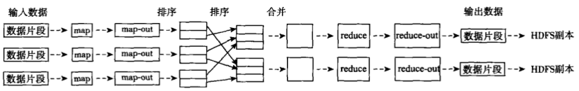
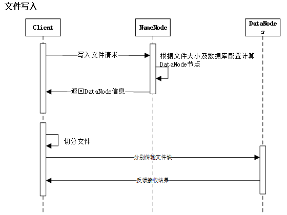
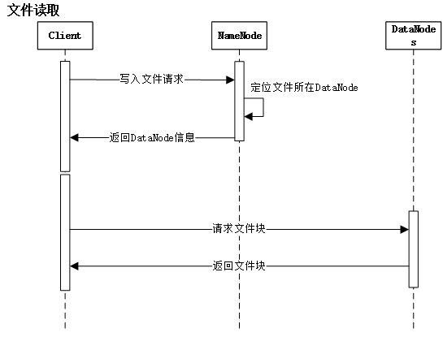
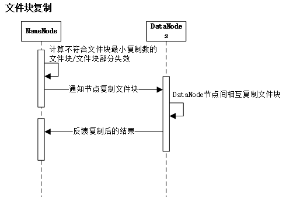

#Hadoop基础知识
[TOC]

##1 关系数据库 VS MapReduce
|传统关系数据库|MapReduce
---|----|-----
数据大小|GB|PB
访问|交互式和批处理|批处理
更新|多次读写|一次写入多次读取
结构|静态模式|动态模式
完整性|高|低
横向扩展|非线性|线性

##2 Hadoop生态圈
  
- Common：一组分布式文件系统和通用I/O组件与接口（序列化、Java RPC、持久化数据结构）
- Avro：一种支持高效、跨语言的RPC以及永久存储数据的序列化系统
- MapReduce：分布式数据处理模型和执行环境，运行于大型商用机集群
- HDFS：分布式文件系统，运行于大型商用机集群
- Pig：一种数据流语言和运行环境，用以检索非常大的数据集。pig运行在MapReduce和HDFS集群上，**能够支持高并发**
- Hive：一个分布式、按列存储的数据仓库。Hive管理HDFS中存储的数据，并提供基于SQL的查询语言（由运行时引擎翻译成MapReduce作业）用以查询数据
- HBase：分布式、按列存储数据库。使用HDFS作为底层存储，同时支持MapReduce的批量计算和点查询（随机读取）  
- ZooKeeper：分布式、可用性高的协调服务。提供分布式锁之类的基本服务用于构建分布式应用
- Sqoop：在数据库和HDFS之间高效传输数据的工具

##3 MapReduce
MapReduce的核心假设：可以进行高速的流式读写操作  
MapReduce的核心特征：数据本地化（data locality）  
  
无共享（Shared-nothing）框架：各任务之间彼此独立，不共享任何数据或者资源。因此，程序员无需考虑系统的部分失效（任务失效）问题，也不需考虑任务的执行顺序，框架自身的实现能够检测到失败的map或reduce任务，并让正常运行的机器重新执行这些失败的任务。
>MapReducer本身控制着mapper输出结果传递给reducer过程；这种情况下，重新运行reducer比重新运行mapper更需要格外小心，因此reducer需要获取必要的mapper输出结果，如果没有获得必要的输出结果，必须再次运行相关mapper重新生成输出结果

MapReduce谷歌工程师开发，用于构建搜索引擎索引。很多传统算法都可以使用MapReduce来表达  
MapReduce服务于只需数分钟或数小时即可完成的作业，并且运行于内部通过高速网络连接的单一数据中心内，并且该DC内的计算机需要由可靠的、定制的硬件构成  
>如果使用消息传递接口（Message Passing Interface， MPI）进行调用的程序必须显式管理自身检查点和恢复机制，虽然更多控制权交给了程序员，编程的难度也显著增大  

吸取MapReduce思路的RMDBS：Aster DATA、GreenPlum  
MapReduce的高级查询语言：Pig、Hive更接近传统的数据库编程方式  

###3.1 MapReduce体系结构
- JobTracker：单独运行在主节点。负责调度构成一个作业的所有任务，这些任务分布在不同的从节点上。主节点监控它们执行情况，并且重新执行之前失败的任务
- TaskTracker：运行在每个集群节点。从节点仅负责由主节点派发的任务

Job提交时，JobTracker接收到提交作业和配置信息后，将配置信息等分发给从节点，同时调度任务并监控TaskTracker执行  
MapReduce的数据流图如下。该过程就是将大数据集分解为成百上千个小数据集，每个数据集分别由集群中的一个节点进行处理并生成中间结果，然后这些中间结果又由大量的节点合并，形成最终结果。MapReduce框架下并行程序的三个主要函数：map、reduce、main，用户仅需要根据任务编写map、reduce函数  
  

##4 HDFS
###4.1 设计目标
- 检测和快速恢复硬件故障
- 流式数据访问
HDFS使应用程序流式访问数据集。适合批处理，而不重视用户交互处理。重视吞吐量，不重视访问反应速度  
- 简化一致性模型
大部分文件操作场景为：一次写入，多次读取。文件一旦经过创建、写入、关闭后就不需要修改，从而简化数据一致性问题和高吞吐量数据访问问题  
- 通信协议
建立在TCP/IP上。Client到NameNode，使用Client Protocal（客户端协议）；DataNode 到 NameNode，使用DataNode Protocal  

###4.2 体系结构
采用master/slave结构，一个HDFS集群由一个NameNode和若干DataNode组成。其中NameNode作为主服务器，管理文件系统的命名空间和客户端对文件的访问操作；DataNode管理存储的数据。HDFS存储用户的文件形式的数据。  

HDFS内部，文件被分成若干个数据块，这些数据块分别存储在一组DataNode上。
- NameNode执行文件系统的命名空间操作，如：打开、关闭、重命名文件或目录等，它也负责数据块到具体DataNode的映射。NameNode是所有HDFS元数据的管理者，用户数据永远不会经过NameNode  
- DataNode负责处理文件系统客户端的文件读写请求，并在NameNode的统一调度下进行数据块的创建、删除、复制等工作  

###4.3 HDFS特性
- 对于整个集群有单一的命名空间
- 数据一致性。适合一次写入多次读取的模型，客户端在文件没有被成功创建前无法看到文件存在
- 文件被分成多个文件块，每个文件块被分配存储到数据节点，而且根据配置由复制文件块来保证数据的安全性
  
  
  

###4.4 HDFS数据管理亮点
- 文件块的放置：一个Block默认有3个备份，一份放在NameNode指定DataNode上，另一份放在与指定DataNode不在同一台机器上的DataNode上，最后一份放在与指定DataNode在同一Rack上的DataNode上。
采用此种配置主要考虑：同一Rack失败的情况，以及不同Rack间的数据拷贝性能问题
- 心跳检测：检测DataNode健康状况，如发现问题采取数据备份的方式来保证数据的安全性  
- 数据复制：
  □ 场景：DataNode失败、需要平衡DataNode的存储利用率和平台DataNOde数据交互压力等情况  
  □ 可以用HDFS的balancer命令配置Thredhold来平衡每个DataNode磁盘利用率。执行balancer命令时，先计算DataNode磁盘的利用率的平均值，然后判断如果某DataNode利用率超过这个平均值，将会把这个DataNode的block转移到利用率低的DataNode上，对于新节点十分有用  
- 数据校验：采用CRC32数据校验。在写入文件Block时，除写入数据还写入校验信息，读取时需要校验后再读入
- 单NameNode：如果失败，任务处理信息将会记录在本地文件系统和远端文件系统
- 数据管道性写入：当客户端要写入文件到DataNode，客户端先读取一个Block，然后写到第一个DataNode上，接着由第一个DataNode将其传递到备份的DataNode上，直到所有需要写入这个Block的DataNode都成功写入后，客户端才会开始写下一个Block
- 安全模式：分布式文件系统启动时会有安全模式（系统运行期间也可以通过命令进入安全模式），当分布式文件系统处于安全模式时，文件系统中的内容不允许修改也不允许删除，直到安全模式结束。安全模式主要为了系统启动时检查各DataNode上的数据块的有效性，同时根据策略进行必要的复制或删除部分数据块。实际操作过程中，若系统启动时修改、删除文件会出现安全模式不允许修改的错误提示，需要等待一会儿即可  

##5 HBase
###5.1 HBase数据管理
HBase是一个稀疏的、长期存储的（落盘）、多维度的排序映射表。这张表的索引是行关键字、列关键字、时间戳  
每个值是一个不解释的字符数组（字符串），数据都是字符串，没有类型。用户在表格中存储数据，每一行都有一个可排序的主见和任意多列。由于是稀疏存储，所以同一张表中，每一行数据都可以有截然不同的列。列名字的格式`<family>:<label>`，它是由字符串组成的，每张表有一个family集合，这个集合是固定不变的，相当于表的结构，只能通过改变表结构来改变表的family集合，但是label值相对于每一行来说都是可以改变的  
HBase将同一个family中的数据存储在同一个目录下，而HBase的写操作是锁行的，每一行都是一个原子元素，都可以加锁。所有数据库的更新都有一个时间戳标记，每次更新都会生成一个新版本，而HBase会保留一定数量的版本，版本数可以设定。客户端可以选择获取距离某个时间点最近的版本，或一次获取所有版本
###5.2 体系结构
- HBaseMaster：HBase主服务器，与Bigtable的主服务器类似
- HRegionServer：HBase域服务器，与Bigtable的Tablet服务器类似
- HBaseClient：HBase客户端，由org.apache.hadoop.HBase.client.HTable定义

###5.3 HBaseMaster
HBase主服务器只部署一台，通过Leader Election Algorithm确保只有唯一的主服务器活跃，Zookeeper保存主服务器的服务器地址信息。主服务器瘫痪，再通过Leader Election Algorithm算法选举新的主服务器  

- **元表（Meta Table）**：包含了所有用户域的基本信息，域信息包括起始关键字、结束关键字、域是否在线、域所在的域服务器地址等。元表随着用户域的增长而增长  
- **根表（Root Table）**：被定义存储单一域信息，并指向元表中的所有域。根表也包含每个元域的信息和元域所在的域服务器地址  

根表、元表中的每行大约为1KB。域默认大小为256MB，根于可映射2.6×105个元域。元域可以映射相应数量的用户域。根域可以映射6.9×1010个用户域，大约可以存储1.9×1010字节数据

###5.4 HRegionServer
HBase域服务器功能：
- 服务于主服务器分配的域
- 处理客户端的读写请求
- 缓冲区回写
- 压缩和分割域

每个域只能由一台域

P40
