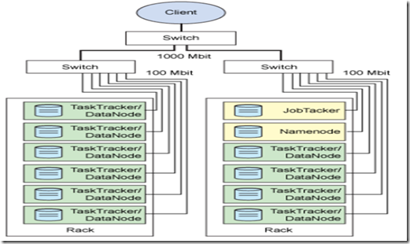
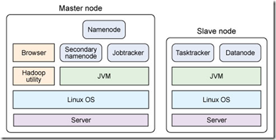
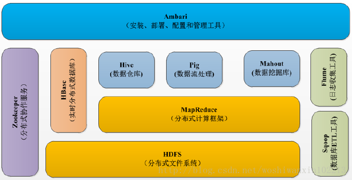
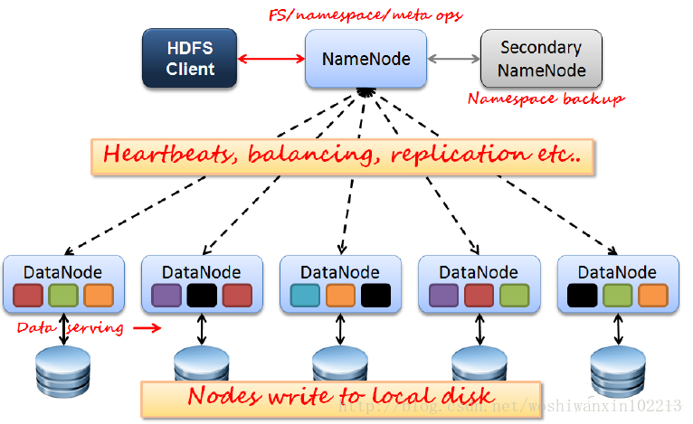
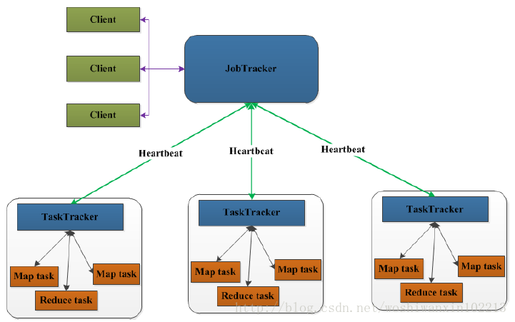
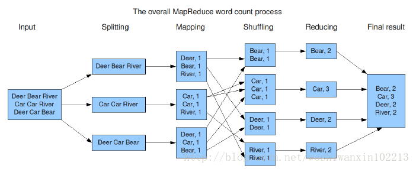
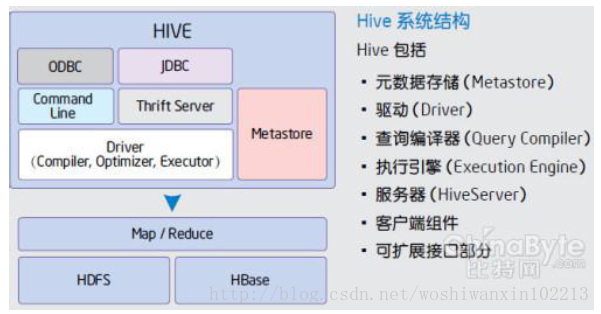
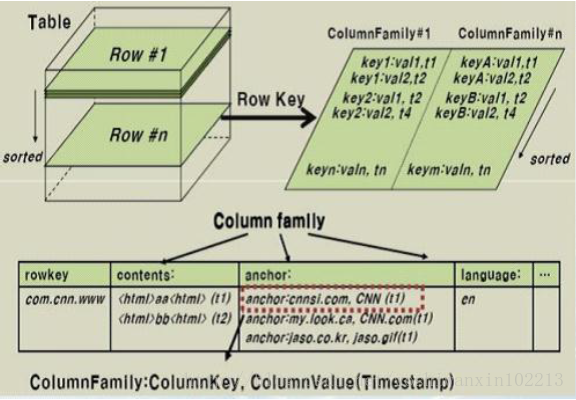

[TOC]
##Hadoop项目简介
###1. Hadoop是什么
Hadoop是一个适合大数据的分布式存储与计算平台。  
作者：Doug Cutting，他还创作了Lucene、Nutch  
Hadoop的产生受Google三篇论文的启发  

###2. Hadoop核心项目
- HDFS: Hadoop Distributed File System 分布式文件系统
- MapReduce：并行计算框架

###3. Hadoop架构
####3.1 HDFS架构
#####1）主从结构
- 主节点，只有一个: namenode
- 从节点，有很多个: datanodes

#####2）namenode负责：管理
- 接收用户操作请求，可以实现对文件系统的操作(一般的操作方式有两种，命令行方式和Java API方式)
- 维护文件系统的目录结构(用来对文件进行分类管理)。
- 管理文件与block之间关系(文件被划分成了Block，Block属于哪个文件)，block与datanode之间对应关系。

#####3）datanode负责：存储
- 存储文件
- 文件被分成block(block一般是以128M来划分，但每个Block块所占用的空间是文件实际的空间）存储在磁盘上，将大数据划分成相对较小的block块，这样可以充分利用磁盘空间，方便管理。
- 为保证数据安全，文件会有多个副本(就好比配钥匙，都是为了预防丢失)，这些副本会一块一块复制，分别存储在不同的DataNode上。

####3.2 MapReduce架构
#####1）主从结构
- 主节点，只有一个: JobTracker
- 从节点，有很多个: TaskTrackers

#####2）JobTracker
- 接收客户提交的计算任务
- 把计算任务分给TaskTrackers执行
- 监控TaskTracker的执行情况

#####3）TaskTrackers
- 执行JobTracker分配的计算任务  

###4 Hadoop的特点
1. 扩容能力（Scalable）：能可靠地（reliably）存储和处理千兆字节（PB）数据。
2. 成本低（Economical）：可以通过普通机器组成的服务器群来分发以及处理数据。这些服务器群总计可达数千个节点。
3. 高效率（Efficient）：通过分发数据，hadoop可以在数据所在的节点上并行地处理它们，这使得处理非常的快速。
4. 可靠性（Reliable）：hadoop能自动地维护数据的多份副本，并且在任务失败后能自动地重新部署计算任务。

###5 Hadoop集群的物理分布
  
图1 Hadoop集群的物理分布  
这里是一个由两个机架组成的集群，图中有两种颜色绿色和黄色，不难看出黄色为主节点（Master），NameNode和JobTracker都独占一个服务器，只有一个是唯一，绿色为从节点(Slave)有多个。而上面所说的JobTracker、NameNode，DataNode，TaskTracker本质都是Java进程，这些进程进行相互调用来实现各自的功能，而主节点与从节点一般运行在不同的java虚拟机之中，那么他们之间的通信就是跨虚拟机的通信。  

这些机群上放的都是服务器，服务器本质上就是物理硬件，服务器是主节点还是从节点，主要看是跑的是什么角色或进程，如果上面跑的是Tomcat他就是WEB服务器，跑的是数据库就是数据库服务器，所以当服务器上跑的是NameNode或JobTracker是就是主节点，跑的是DataNode或TaskTracker就是从节点。  

为了实现高速通信，我们一般都使用局域网，在内网中可使用千兆网卡、高频交换机、光纤等。  

###6 Hadoop机群的单节点物理结构
  
图2 Hadoop机群的单节点物理结构  

##Hadoop生态圈
###1. Hadoop生态系统概况
Hadoop是一个能够对大量数据进行分布式处理的软件框架。具有可靠、高效、可伸缩的特点。Hadoop的核心是HDFS和Mapreduce，hadoop2.0还包括YARN。下图为hadoop的生态系统：  
  
图 3 Hadoop生态圈  

###2 HDFS（Hadoop分布式文件系统）  
源自于Google的GFS论文，发表于2003年10月，HDFS是GFS克隆版。是Hadoop体系中数据存储管理的基础。它是一个高度容错的系统，能检测和应对硬件故障，用于在低成本的通用硬件上运行。HDFS简化了文件的一致性模型，通过流式数据访问，提供高吞吐量应用程序数据访问功能，适合带有大型数据集的应用程序。  
  
图4  

**Client：**切分文件；访问HDFS；与NameNode交互，获取文件位置信息；与DataNode交互，读取和写入数据。

**NameNode：**Master节点，在hadoop1.X中只有一个，管理HDFS的名称空间和数据块映射信息，配置副本策略，处理客户端请求。

**DataNode：**Slave节点，存储实际的数据，汇报存储信息给NameNode。

**Secondary NameNode：**辅助NameNode，分担其工作量；定期合并fsimage和fsedits，推送给NameNode；紧急情况下，可辅助恢复NameNode，但Secondary NameNode并非NameNode的热备。

###3 Mapreduce（分布式计算框架）
源自于google的MapReduce论文，发表于2004年12月，Hadoop MapReduce是google MapReduce 克隆版。MapReduce是一种分布式计算模型，用以进行大数据量的计算。其中Map，对数据集上的独立元素进行指定的操作，生成键-值对形式中间结果。Reduce，则对中间结果中相同“键”的所有“值”进行规约，以得到最终结果。MapReduce这样的功能划分，非常适合在大量计算机组成的分布式并行环境里进行数据处理。  
  

**JobTracker：**Master节点，只有一个，管理所有作业，作业/任务的监控、错误处理等；将任务分解成一系列任务，并分派给TaskTracker。

**TaskTracker：**Slave节点，运行Map Task和Reduce Task；并与JobTracker交互，汇报任务状态。

**Map Task：**解析每条数据记录，传递给用户编写的map(),并执行，将输出结果写入本地磁盘(如果为map-only作业，直接写入HDFS)。

**Reducer Task：**从Map Task的执行结果中，远程读取输入数据，对数据进行排序，将数据按照分组传递给用户编写的reduce函数执行。

Mapreduce处理流程，以wordCount为例：  
  

###4 Hive（基于Hadoop的数据仓库）
由facebook开源，最初用于解决海量结构化的日志数据统计问题。Hive定义了一种类似SQL的查询语言(HQL), 将SQL转化为MapReduce任务在Hadoop上执行。通常用于离线分析。  
  

###5 Hbase（分布式列存数据库）
源自Google的Bigtable论文，发表于2006年11月，HBase是Google Bigtable克隆版。HBase是一个针对结构化数据的可伸缩、高可靠、高性能、分布式和面向列的动态模式数据库。 和传统关系数据库不同，HBase采用了BigTable的数据模型：增强的稀疏排序映射表（Key/Value），其中，键由行关键字、列关键字和时间 戳构成。HBase提供了对大规模数据的随机、实时读写访问，同时，HBase中保存的数据可以使用MapReduce来处理，它将数据存储和并行计算完 美地结合在一起。
数据模型：Schema–>Table–>Column Family–>Column–>RowKey–>TimeStamp–>Value  
  

###6 Zookeeper（分布式协作服务）
源自Google的Chubby论文，发表于2006年11月，Zookeeper是Chubby克隆版。解决分布式环境下的数据管理问题：统一命名，状态同步，集群管理，配置同步等。  

###7 Sqoop（数据同步工具）
Sqoop是SQL-to-Hadoop的缩写，主要用于传统数据库和Hadoop之前传输数据。数据的导入和导出本质上是Mapreduce程序，充分利用了MR的并行化和容错性。  

###8 Pig（基于Hadoop的数据流系统）
由yahoo!开源，设计动机是提供一种基于MapReduce的ad-hoc(计算在query时发生)数据分析工具，定义了一种数据流语言—Pig Latin，将脚本转换为MapReduce任务在Hadoop上执行。通常用于进行离线分析。

###9 Mahout（数据挖掘算法库）
Mahout起源于2008年，最初是Apache Lucent的子项目，它在极短的时间内取得了长足的发展，现在是Apache的顶级项目。Mahout 的主要目标是创建一些可扩展的机器学习领域经典算法的实现，旨在帮助开发人员更加方便快捷地创建智能应用程序。Mahout现在已经包含了聚类、分类、推 荐引擎（协同过滤）和频繁集挖掘等广泛使用的数据挖掘方法。除了算法，Mahout还包含数据的输入/输出工具、与其他存储系统（如数据库、 MongoDB 或Cassandra）集成等数据挖掘支持架构。

###10 Flume（日志收集工具）
Cloudera开源的日志收集系统，具有分布式、高可靠、高容错、易于定制和扩展的特点。它将数据从产生、传输、处理并最终写入目标的路径的过程抽象为数据流，在具体的数据流中，数据源支持在Flume中定制数据发送方，从而支持收集各种不同协 议数据。同时，Flume数据流提供对日志数据进行简单处理的能力，如过滤、格式转换等。此外，Flume还具有能够将日志写往各种数据目标（可定制）的能力。总的来说，Flume是一个可扩展、适合复杂环境的海量日志收集系统。  

##使用eclipse查看hadoop源码
- Hadoop源码放在hadoop目录中的SRC中；
- 将其导入到Eclipse；
- 导入jar包（ant中的lib目录，hadoop目录，hadoop lib目录）

