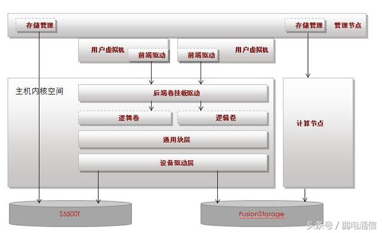

#存储

##1 存储虚拟化
存储虚拟化的概念：

- 存储虚拟化是在存储设备上加入一个逻辑层，通过逻辑层访问存储资源
- 对管理员来说，可以很方便的调整存储资源，提高存储利用率
- 对终端用户来说，集中的存储设备可以提供更好的性能和易用性

存储虚拟化的实现方式：

- - 裸设备+逻辑卷
- 存储设备虚拟化
- 主机存储虚拟化+文件系统

存储虚拟化的原理：
  

裸设备+逻辑卷的结构：
  

存储设备虚拟化的结构：
  

存储虚拟化+文件系统的结构：
  
