#1 Che实操
##1.1 Che Workspace模型
###1.1.1 Che的的workspace
Che的workspace包括：  
- runtime、IDEW  
- 基于Restful的服务端  
- 基于浏览器的IDE  
- 语言、框架、工具的插件  
- 支持插件开发装配的SDK  

Che的开发runtime作为workspace的依赖，runtime作为workspace的组成部分随时随地运行。与传统IDE不同，传统IDE的runtime是通过手动在workspace绑定运行环境  
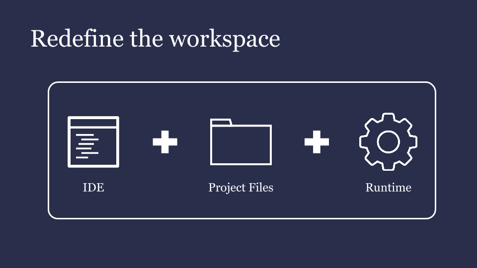  
workspace相互独立同时管理包含其中的各组件的生命周期。通过Docker将不同的workspace定义成不同的机器 
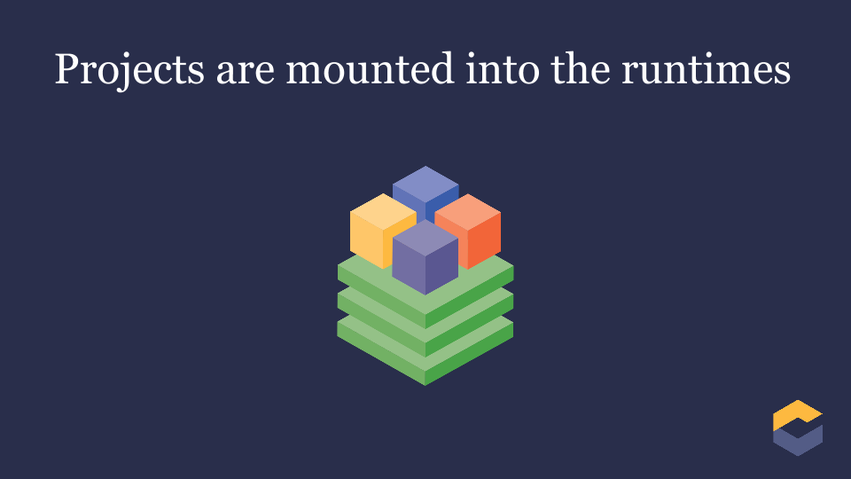  
一个workspace中，可以包含0..n个工程，每个工程可以包含0..1个统一版本库。每个工程被载入workspace，该工程在workspace和长期存储中皆有效。每个工程都有一个类型，如maven、Java等。选定一个工程类型后，适应工程类型的plugin特性将被切换。不同类型的工程，也有一些独特的模块以适应自己的类型和行为。  
  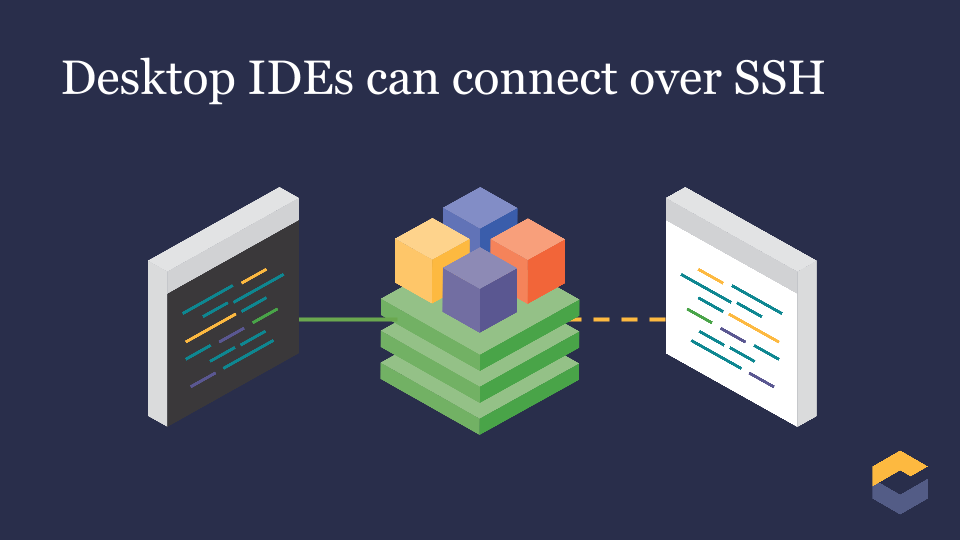  
默认情况下，workspace被定义为SSH server。允许远程客户端或者桌面IDE通过SSH挂载到workspace。可以通过带工程和runtime并且包含Che的IDE如IntelliJ、Eclipse通过SSH挂载。workspace以Che服务器为宿主。Che服务器是一个轻量级workspace的管理器。一个Che服务器可以管理大量，服务器和workspace可以运行在相同服务器也可以分别运行，都在Docker的守护进程中进行管理。由于Workspace都包括自己的runtime，因此它们也可以分别运行。Che服务器默认也是一个Docker容器，甚至可以通过Swarm进行集群化配置。    
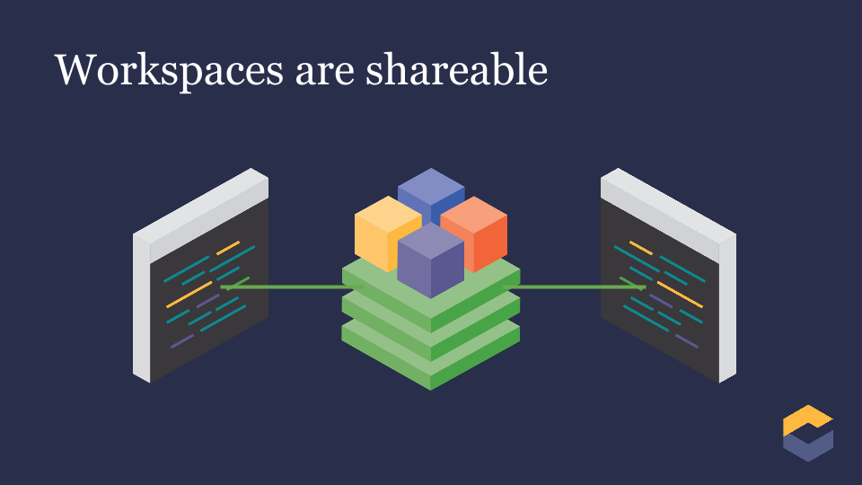  
workspace有独立的runtime，因此可以协作、共享。可以通过多用户同时访问同一个workspace。每个工作空间都有自己URL允许多用户访问。多用户访问时采用“最后写胜利”原则（last-write-win）。2016年末，Che通过操作转换完成了多光标编辑。工作空间通过JSON数据格式定义工程、runtime、IDE以及其他便于Che创建副本的必要信息。这种数据结构可以使工作空间顺利的迁移到其他的Che服务器，工作空间已经不在依赖电脑。工作空间包含自身的内部状态快照，这些快照存储在注册表中（此注册表非Windows注册表），这样通过原始的模板就可以创建工作空间的副本或者在用户开始使用workspace后所提交的参数修改。  
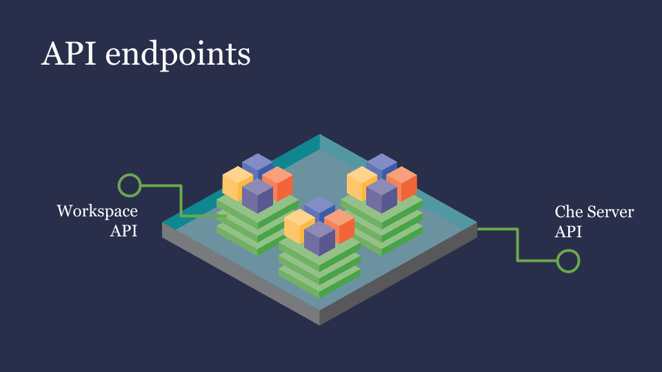 
每一个Che服务器都内嵌了RESTFul API接口。在用户面板中Web应用和浏览器IDE中都可以调用API接口可以完成各种操作。通过各种服务来完成各种炫酷的设置。服务器和各工作空间的API可以通过管理员和用户部署的插件动态改变。 
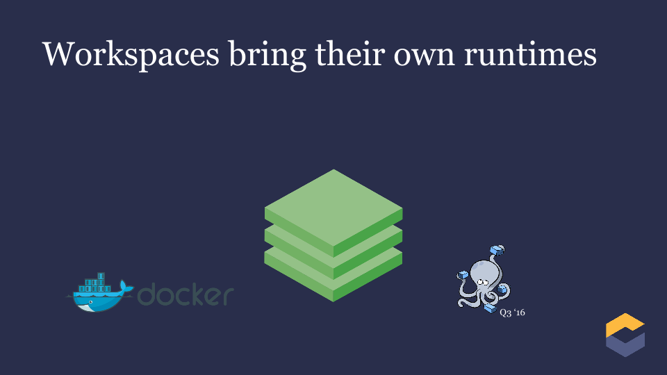 
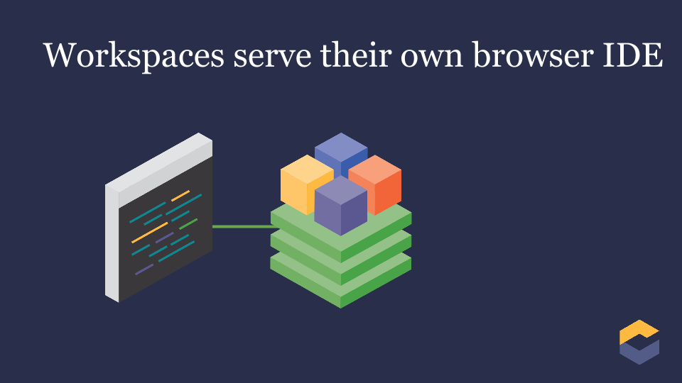 
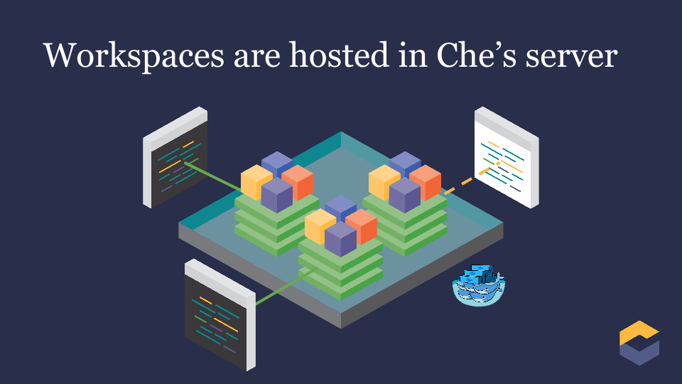 
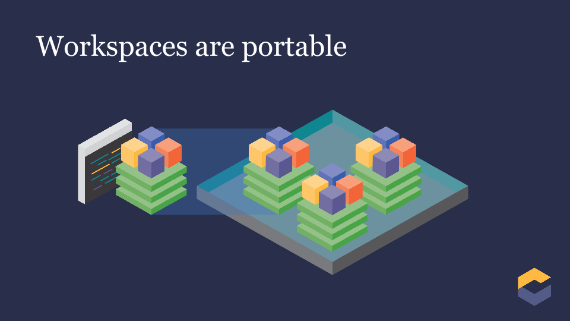 
 
###1.1.2 用户
Che有三种类型用户： 

- 开发者：IDE的使用者，当Che服务器运行时,可以在桌面、服务器甚至是嵌入式设备上使用特定语言进行编程。开发者可以使用桌面IDE或者直接使用浏览器嵌入的IDE，通过SSH连接到Che服务器上的工作空间
- 产品拥有者：Che提供API接口管理环境、工作空间、工程、模板、栈、用户行为的智能感知（如：编辑、语法分析、编译、打包、debug等）
- 插件提供者：Che提供的SDK创建插件来修改浏览器IDE或Che服务器。ISV或者工具提供者可以增加新的项目类型、编程语言、工具扩展以及应用。Che插件可以是客户端授权也可以是服务器端授权

###1.1.3 逻辑架构
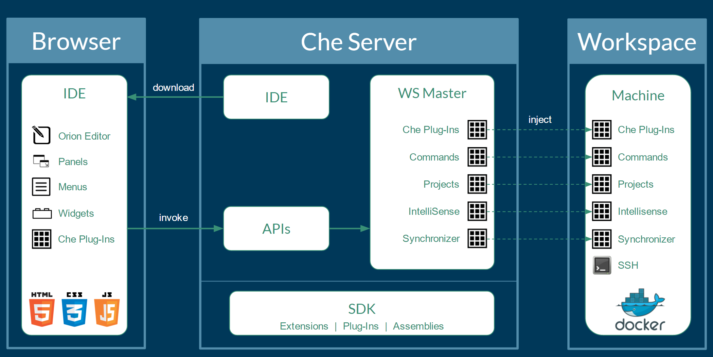 
Che工作空间服务器运行在Tomcat上。一旦Che Server启动，IDE通过浏览器以Web应用的形式运行。浏览器从Che Server下载IDE页面。Web应用提供如向导、面板、编辑器、菜单、工具条、对话框等UI组件。 
用户通过与Web应用交互可以创建workspace、工程、环境、与代码相关的制品以及Debug。IDE通过RESTFul API和workspace管理器进行交互 
Che Server控制workspace的生命周期。workspace是程序员可以工作的独立空间。Che Server在workspace中注入一系列服务，如：工程、源代码、Che插件、SSH守护进程、语言服务（如JDT内核可以智能感知Java语言工程）。工作空间包括同步器，定时向Che服务器的长期存储同步工程文件，具体方式因本地Che服务器还是远程Che服务器而异。 
Che定义了workspace的概念，这一概念与工程、环境以及命令结合。工程是代码的最小功能单元，由一系列文件夹、文件、模块组成。每个工程与外部的git、subversion库一一对应。一个workspace可以包含0~N个项目。项目必须包含一个项目类型，根据不同的项目类型，Che赋予项目不同的行为。如果项目为maven类型，Che将在workspace中安装maven和java插件。 
Machine（主机）是提供一些列软件和资源，是运行workspace中项目的运行时单元。一个主机绑定到workspace上的项目。Che利用主机同步项目文件。主机由一系列方法组成，这些方法包含一系列软件，这些软件可以由主机运行。Che的主机的默认实现是Docker，可以通过Docker的文件定义不同类型的runtime。另一个概念：栈（stack）通过额外的元信息定义一系列方法。Che提供默认的方法和栈，用户可以定义自己的方法。每个主机的生命周期有workspace管理。workspace加载后，主机也随之运行。Che可以暗黄额外的软件到主机，以便满足需求，如智能感知功能。如果Java工程类型下，Che激活Java插件，Che安装一个代理到主机以运行JDT服务，随后通过工程同步器同步到主机中 
###1.1.4 扩展
Che提供SDK授权开发新扩展，打包扩展到插件，插件可以分组成集合。集合可以单独运行在新服务器或者安装到客户机。有很多方面可以通过Che进行修改。 
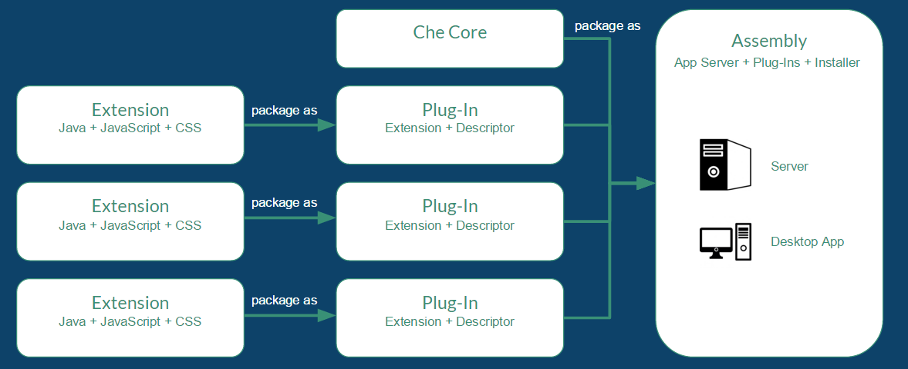 

|类型|描述|
|:--|:--|
|IDE扩展|修改客户端的外观、面板、编辑器、向导菜单、工具条以及弹出窗口。IDE扩展用Java实现，通过在Che服务器上部署war包部署到JavaScript的Web应用实现|
|Che服务器扩展 (又称workspace master)|添加或修改Che服务器核心API来管理workspace、环境以及主机。Che服务器扩展通过Java实现，打包成Jar文件|
|workspace扩展 (又称workspace代理)|创建/修改工程明细，这些明细在workspace主机上运行并且访问本地工程文件。定义主机行为、代码模板、指令、智能感知。用Java编写的Che的扩展是workspace的代理扩展，这种扩展部署到主机上。通过Eclipse运行JDT核心服务在本地进行智能感知远程workspace操作|
每个扩展都独立打包，它们将分别部署到集合中。IDE扩展将同GWT生成跨浏览器JavaScript。这个应用将被打包成war包部署到Che服务器端 
workspace主节点扩展（workspace master extension）是部署在Che服务器上的服务。一旦部署，它们将成为管理服务，可以控制用户、身份及workspace 
workspace代理扩展（workspace agent extension）被Che核心库所编译在嵌入在Che服务器上的workspace主机上部署。Che服务器将代理扩展植入主机，有远端的workspace主节点控制。这个嵌入的服务器是代理扩展的宿主，为Che服务器和主机上的工程提供桥接通信
###1.1.5 主机（machine）
使用桌面IDE进行开发时，workspace利用localhost作为执行build、运行以及debug的环境；在云IDE上，localhost不可用，workspace服务器必须构建所需的环境。这个环境需要与其他workspace分开并且具有扩展性。Che使用Docker创建包含环境所需软件的容器。每个workspace都至少制定一个运行环境，用户还可以额外指定workspace所需的环境。每个容器可以安装不同的软件。Che根据不同的工程类型安装软件。如，Java工程需要安装JDK、Git、Maven。用户使用workspace时，Che加载容器中的源代码。开发者在容器中完成自动补全以及执行mvn clean install等命令。用户可以创建自定义Docker文件以达到将配置写入镜像的目标；扩展开发者可以注册关联项目类型的Docker文件模板。Che可以管理无限个环境，这些环境还可以让用户灵活的进行定制
###1.1.6 构成
Che包含大量语言的扩展插件、build系统、源代码工具、底层基础设施如Java、Maven、Ant、Git、Subversion、JavaScript、AngularJs。社区开发成果也有许多纳入到Che的主力库中。Che可以安装到任何支持Docker1.8+或者Java1.8的操作系统。开源协议为EPL 1.0。

