#1 Che实操
##1.1 创建SaaS账号
在如下url下，创建SaaS用户 
https://codenvy.io/site/login 
创建用户 
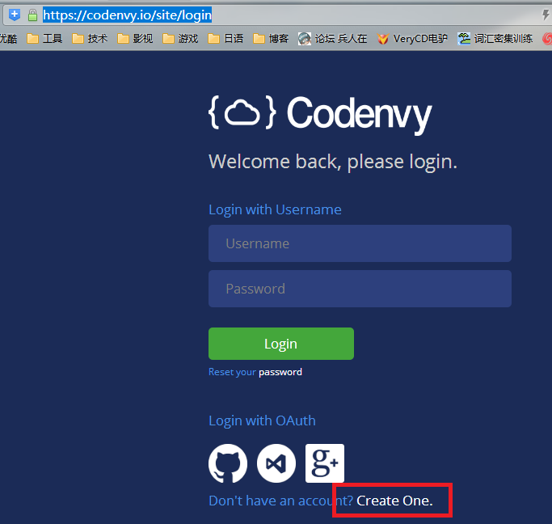  
输入用户信息 
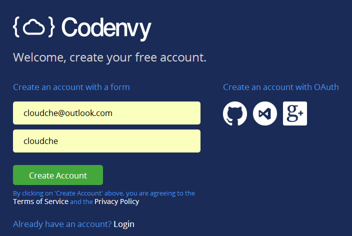 
经过邮件认证后，输入用户信息 
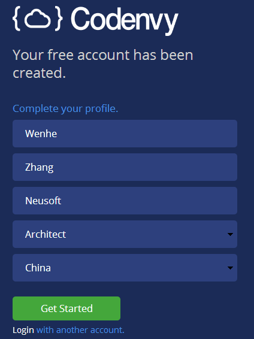 
 
##1.2 创建Workspace
创建用户后，进入dashboard创建workspace 
https://codenvy.io/dashboard/#/create-project 
 
添加workspace的名称 
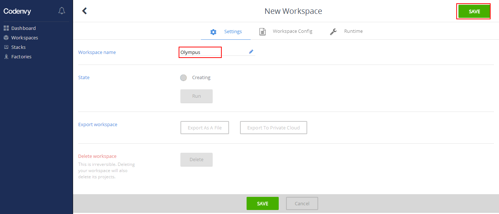 
设定Runtime为Java 
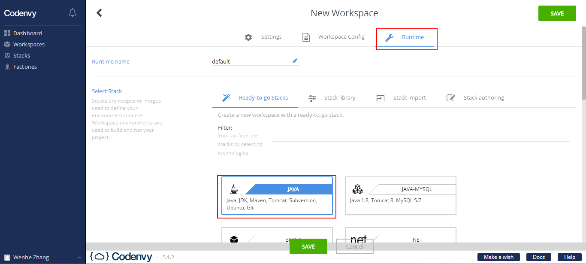 
后台创建控制台输出 
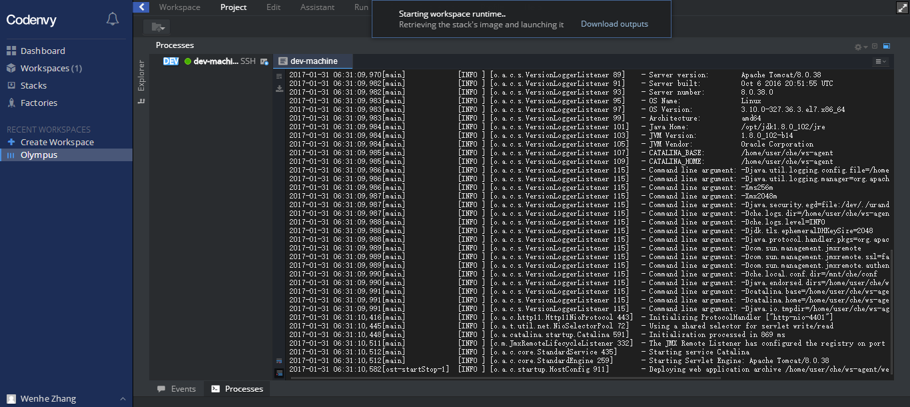 
创建工程，输入工程名称 
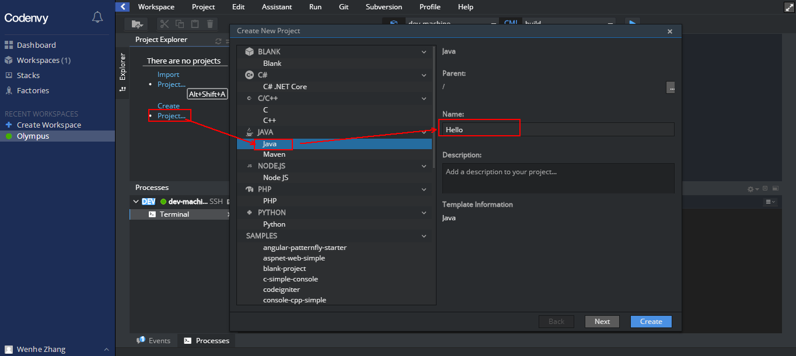 
创建Package及Class 
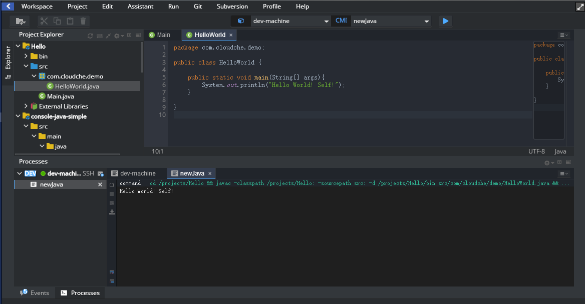 
程序的运行 
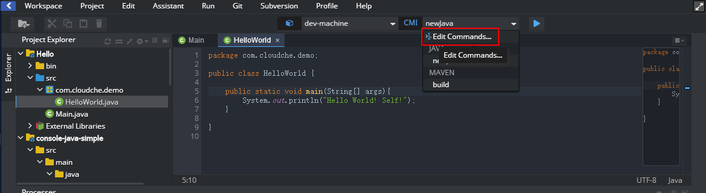 
编辑执行脚本，在Main class中选择带有main方法的class  
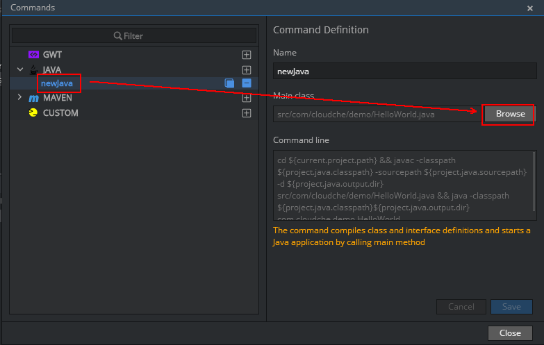  
产生的脚本如下：  
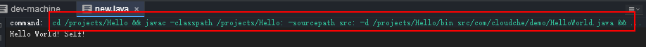  

