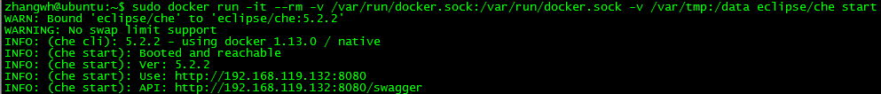

#1 本地环境搭建
以下介绍通过Docker在本地搭建、运行、管理Che服务器的过程的方法
##1.0 前提条件
要求一个Che内部服务，至少需要：
■硬件  
- 1 core  
- 256MB内存  
- 300MB磁盘空间  

■软件  
- Docker 1.12.5以上，最旧Docker版本1.11  

Che CLI：Docker镜像管理Che的Docker镜像以及Che在配置或者运行时所需的支持工具。CLI提供离线包，在离线情况下运行Che  
建议使用最新版本的Che Docker镜像，因为之前遇到的问题可能在新版本的docker中已经被解决  

##1.1 获取帮助
在安装过程中发现的问题可以在：  
https://github.com/eclipse/che/issues  根据以下命令的输出到      
https://github.com/eclipse/che/blob/master/CONTRIBUTING.md  上跟进问题   
`docker run eclipse/che info`  
`docker run eclipse/che info –bundle`  
可以参考如下文档： 
https://github.com/codenvy/che-docs/pulls  
https://github.com/codenvy/che-docs/issues  

##1.2 Che Docker镜像获取并运行
~~~
# Interactive help  
sudo docker run -it eclipse/che start  
# Or, full start syntax where <path> is a local directory  
sudo docker run -it --rm -v /var/run/docker.sock:/var/run/docker.sock -v <path>:/data eclipse/che start  
~~~

在本地运行Docker的语法  
~~~
sudo docker run -it --rm -v /var/run/docker.sock:/var/run/docker.sock -v /var/tmp:/data eclipse/che start  
~~~
如：
~~~
sudu docker run -it --rm -v /var/run/docker.sock:/var/run/docker.sock -v /c/tmp:/data eclipse/che start
~~~

对于Che镜像的各种操作：
- 关闭Che  
~~~
docker run <DOCKER_OPTIONS> eclipse/che stop
~~~
- 重启Che  
~~~
docker run <DOCKER_OPTIONS> eclipse/che restart
~~~
- 安装特定的Che版本启动  
~~~
docker run <DOCKER_OPTIONS> eclipse/che:<version> start
~~~
- 获取帮助  
~~~
docker run eclipse/che
~~~

##1.3 参数配置
1. 端口
-e CHE_PORT=&lt;port>  
Che默认使用8080端口对外提供服务。Che在运行前会验证该端口是否可用
内部端口：在Che仅供本地开发环境使用时，通过内部端口即可访问  
外部端口：在Che需要通过外部网络访问时远程访问时，需要使用外部网络，需要与其他应用的端口区别，并在防火墙开放  
端口|服务|备注
---|---|----
8080|Tomcat端口| 
8000|服务器Debug端口|用户开放Che扩展时，需要配置一个端口连接远程调试器到Che服务器
32768~65535|Docker及Che代理|用户在workspace中运行server需要绑定这个范围内的端口。这个范围可以进一步被限制  
2. 版本  
使用如下命令查看所有che的版本：  
`sudo docker run eclipse/che version`  
下载时镜像的模式：  
`eclipse/che:<version>`  
可以添加变量控制镜像的选择：  
&nbsp;&nbsp;&nbsp;&nbsp;■latest：最新稳定版  
&nbsp;&nbsp;&nbsp;&nbsp;■5.0.0-latest：5.x版本的最新稳定版  

##1.4 通过浏览器访问本地Che
访问以下url，即可访问本地的Che IDE      
http://&lt;local ip>:8080/

#2 Che的网络请求
Che平台启动workspace时，在不同的Docker的分布式网络上。主要的通信过程如下：  
1. 浏览器 → Che服务器  
2. Che服务器 → Docker守护进程  
3. Che服务器 → Workspace  
4. Workspace → Che服务器  
5. 浏览器 → Workspace  

Che通过算法创建协议、IP地址、端口，为每个节点创建连接  
运行Che，但是workspace并没有立即启动，很可能的原因为：  
1. Che → Workspace失败，需要设定che.env配置文件中的CHE_DOCKER_IP  
2. 浏览器 → Workspace，需要设置che.env配置文件中的CHE_DOCKER_IP_EXTERNAL
3. 防火墙限制了端口  

安装Che之后，需要在mount的:/data路径下创建一个che.env文件。可以配置各种变量，创建并配置适当的通信。配置完成配置文件的编辑后，需要重启Che令修改生效  
1. 浏览器 → Che服务器  
■默认访问地址：`http://localhost:${SERVER_PORT}/wsmaster/api`  
■可以配置CHE_API配置默认的访问地址  
2. Che服务器 → Docker守护进程  
■CHE_DOCKER_DAEMON__URL配置Docker守护进程地址  
■DOCKER_HOST系统变量  
■`unix:///var/run/docker.sock`使用Unix Socket通信  
3. Che服务器 → Workspace连接  
■如果`CHE_DOCKER_SERVER__EVALUATION__STRATEGY`为default：  
&nbsp;&nbsp;&nbsp;&nbsp;△使用CHE_DOCKER_IP  
&nbsp;&nbsp;&nbsp;&nbsp;△使用Unix Socket进行通信，使用localhost  
&nbsp;&nbsp;&nbsp;&nbsp;△使用DOCKER_HOST  
■如果`CHE_DOCKER_SERVER__EVALUATION__STRATEGY`为docker-local：  
&nbsp;&nbsp;&nbsp;&nbsp;△使用workspace容器的ip地址将使用docker的网络及暴露的端口  
&nbsp;&nbsp;&nbsp;&nbsp;△如果写ip地址，通过unix socket进行访问，然后使用localhost及暴露的端口  
&nbsp;&nbsp;&nbsp;&nbsp;△使用DOCKER_HOST及发布的端口  
4. 浏览器 → Workspace连接  
■如果`CHE_DOCKER_SERVER__EVALUATION__STRATEGY`为default：  
&nbsp;&nbsp;&nbsp;&nbsp;△使用CHE_DOCKER_IP_EXTERNAL属性
&nbsp;&nbsp;&nbsp;&nbsp;△设置CHE_DOCKER_IP属性
&nbsp;&nbsp;&nbsp;&nbsp;△通过使用localhost，使用Unix Socket  
&nbsp;&nbsp;&nbsp;&nbsp;△使用DOCKER_HOST
■如果`CHE_DOCKER_SERVER__EVALUATION__STRATEGY`为docker-local：  
&nbsp;&nbsp;&nbsp;&nbsp;△设置CHE_DOCKER_IP_EXTERNAL属性  
&nbsp;&nbsp;&nbsp;&nbsp;△使用workspace容器ip地址，使用docker的网络  
&nbsp;&nbsp;&nbsp;&nbsp;△如果没有指定地址，使用localhost，则通过服务器的Unix socket  
&nbsp;&nbsp;&nbsp;&nbsp;△设置DOCKER_HOST属性  
5. Workspace代理 → Che服务器  
&nbsp;&nbsp;&nbsp;&nbsp;默认情况下，`http://che-host:${SERVER_PORT}/wsmaster/api`，che-host是服务器的IP地址  
&nbsp;&nbsp;&nbsp;&nbsp;设置`CHE_WORKSPACE_CHE__SERVER__ENDPOINT`属性
&nbsp;&nbsp;&nbsp;&nbsp;如果docker0接口unreachable，则che-host地址为172.17.42.1或者192.168.99.1  
&nbsp;&nbsp;&nbsp;&nbsp;如果以上都不可达，输出连接异常  

