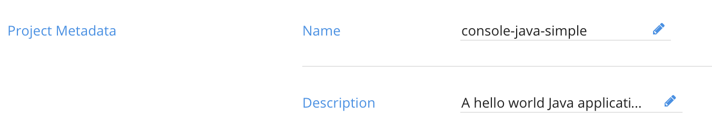
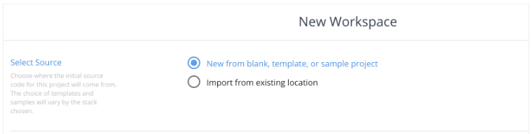
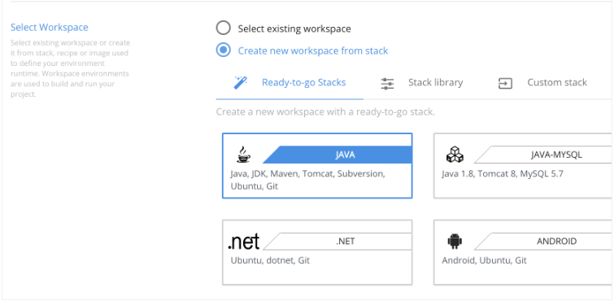
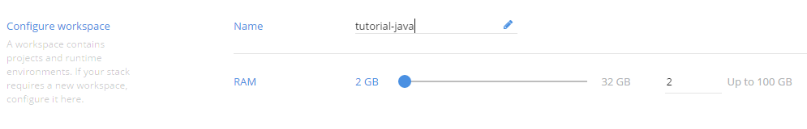
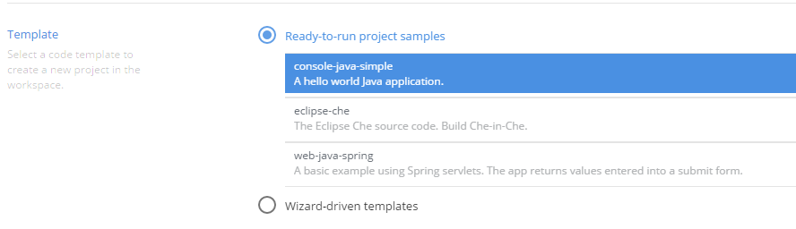
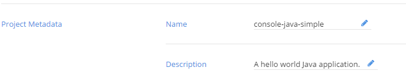
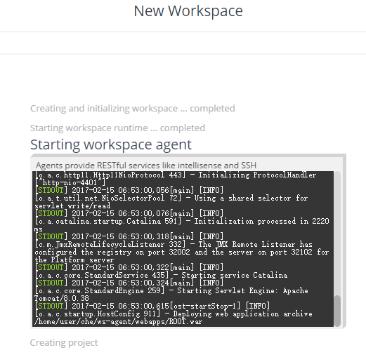
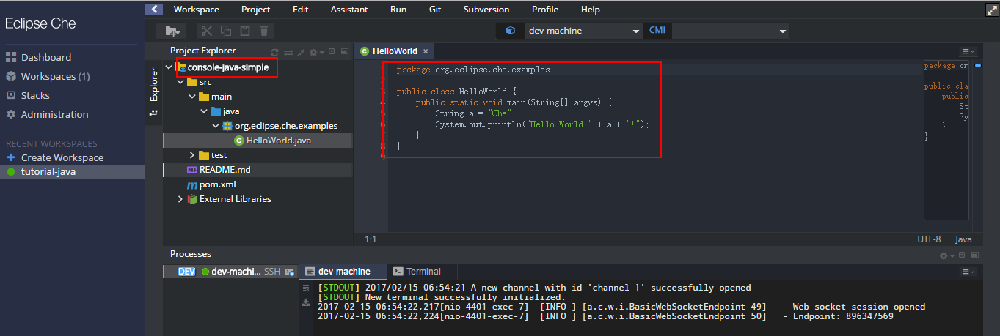

#1 Java+Maven In Che
##1.1 指定元数据  
在选择创建workspace时，首先需要指定工程的元数据，主要是工程的名称、描述  
  
##1.2 选择代码  
在workspace中，可以选择代码的来源。空工程中可以不包含代码，代码可以来自于模板、样例工程、从其他位置导出的代码。选择第一个选项，新建的项目的一些选项可以预先设定。如果已经有代码的来源URL，可以选择第二个选项。Che提供从Git、GitHub、Zip等来源导入工程的方式。  
  
##1.3 选择栈  
当工程建立在workspace中，workspace会提供一个Docker的运行时（runtime）。栈是一系列脚本或镜像用于定义运行工程的workspace runtime环境。有三种方式选择栈。  
  
- Redy-To-Go栈（一站式栈）：环境保护全套工具集，用于优化特定类型的工程。如果选择Java工程，则workspace中附带安装Ubuntu git、java-jdk、maven、tomcat等  
- Stack Library（栈库）：提供细粒度的栈，用于构建工程所需的特殊技术栈。如：Ubuntu和Debian栈只是操作系统及Che的安装工具的最小级  
- Custom Stack（定制栈）：用户可以定制自己的栈。用户可以直接上传自己的脚本  

##1.4 配置workspace空间
为workspace提供一个名称，指定该workspace的内存大小  
  
##1.5 设置向导
模板是一组可以导入Che的代码、配置、命令

1）直接运行项目样例（Ready-to-run project sample）：样例中包含可以编译的代码树及内嵌的命令。可用的模板根据所选择的栈过滤  
2）基于向导的工程配置（Wizard-driven project configration）：开启工程配置向导，通过向导设置一些配置参数。这个参数只在所选择的一些栈中可以设置向导

##1.6 工程元数据
可以为工程指定名称及描述信息。名称为工程的根目录名  
  

设置以上的元数据后，开始创建workspace  
  
workspace创建完成后，可以看到工程中默认生成一个console-java-sample工程，工程中包含一个含main方法的类    
  
#2 在Che中运行Che
##2.1 概念

##2.2 手顺
1）引入两个环境变量  

>\# This will create a che.properties value
export CHE_PROPERTY_machine_server_extra_volume=/var/run/docker.sock:/var/run/docker.sock

>\# Set CHE_DATA_FOLDER to a directory that you will remember.  
>\# This value will be needed inside of the workspace  
>export CHE_DATA_FOLDER=/Users/tyler/data
