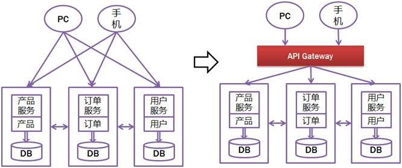
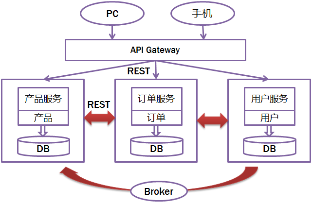
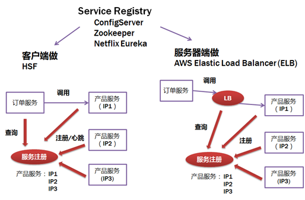
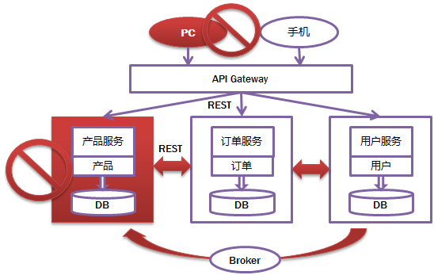
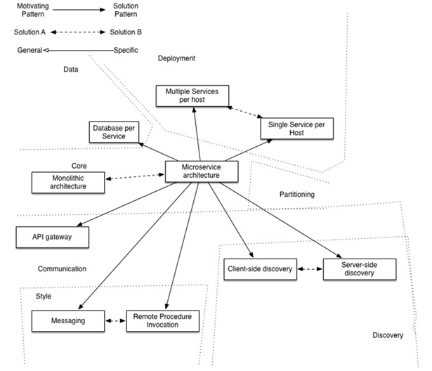

[TOC]

# 英文
##Microservices
>**a definition of this new architectural term**
>The term "Microservice Architecture" has sprung up over the last few years to describe a particular way of designing software applications as suites of independently deployable services. While there is no precise definition of this architectural style, there are certain common characteristics around organization around business capability, automated deployment, intelligence in the endpoints, and decentralized control of languages and data.

[microservices](https://martinfowler.com/articles/microservices.html)  
25 March 2014  
  
**James Lewis**  
James Lewis is a Principal Consultant at ThoughtWorks and member of the Technology Advisory Board. James' interest in building applications out of small collaborating services stems from a background in integrating enterprise systems at scale. He's built a number of systems using microservices and has been an active participant in the growing community for a couple of years.  
  
Martin Fowler is an author, speaker, and general loud-mouth on software development. He's long been puzzled by the problem of how to componentize software systems, having heard more vague claims than he's happy with. He hopes that microservices will live up to the early promise its advocates have found.  

"Microservices" - yet another new term on the crowded streets of software architecture. Although our natural inclination is to pass such things by with a contemptuous glance, this bit of terminology describes a style of software systems that we are finding more and more appealing. We've seen many projects use this style in the last few years, and results so far have been positive, so much so that for many of our colleagues this is becoming the default style for building enterprise applications. Sadly, however, there's not much information that outlines what the microservice style is and how to do it.  

In short, the microservice architectural style [1] is an approach to developing a single application as a suite of small services, each running in its own process and communicating with lightweight mechanisms, often an HTTP resource API. These services are built around business capabilities and independently deployable by fully automated deployment machinery. There is a bare minimum of centralized management of these services, which may be written in different programming languages and use different data storage   technologies.  

My Microservices Resource Guide provides links to the best articles, videos, books, and podcasts about microservices.  

To start explaining the microservice style it's useful to compare it to the monolithic style: a monolithic application built as a single unit. Enterprise Applications are often built in three main parts: a client-side user interface (consisting of HTML pages and javascript running in a browser on the user's machine) a database (consisting of many tables inserted into a common, and usually relational, database management system), and a server-side application. The server-side application will handle HTTP requests, execute domain logic, retrieve and update data from the database, and select and populate HTML views to be sent to the browser. This server-side application is a monolith - a single logical executable[2]. Any changes to the system involve building and deploying a new version of the server-side application.  

Such a monolithic server is a natural way to approach building such a system. All your logic for handling a request runs in a single process, allowing you to use the basic features of your language to divide up the application into classes, functions, and namespaces. With some care, you can run and test the application on a developer's laptop, and use a deployment pipeline to ensure that changes are properly tested and deployed into production. You can horizontally scale the monolith by running many instances behind a load-balancer.  

Monolithic applications can be successful, but increasingly people are feeling frustrations with them - especially as more applications are being deployed to the cloud . Change cycles are tied together - a change made to a small part of the application, requires the entire monolith to be rebuilt and deployed. Over time it's often hard to keep a good modular structure, making it harder to keep changes that ought to only affect one module within that module. Scaling requires scaling of the entire application rather than parts of it that require greater resource.  

  
*Figure 1: Monoliths and Microservices*

These frustrations have led to the microservice architectural style: building applications as suites of services. As well as the fact that services are independently deployable and scalable, each service also provides a firm module boundary, even allowing for different services to be written in different programming languages. They can also be managed by different teams .  

We do not claim that the microservice style is novel or innovative, its roots go back at least to the design principles of Unix. But we do think that not enough people consider a microservice architecture and that many software developments would be better off if they used it.  

###Characteristics of a Microservice Architecture
We cannot say there is a formal definition of the microservices architectural style, but we can attempt to describe what we see as common characteristics for architectures that fit the label. As with any definition that outlines common characteristics, not all microservice architectures have all the characteristics, but we do expect that most microservice architectures exhibit most characteristics. While we authors have been active members of this rather loose community, our intention is to attempt a description of what we see in our own work and in similar efforts by teams we know of. In particular we are not laying down some definition to conform to.  
####Componentization via Services
For as long as we've been involved in the software industry, there's been a desire to build systems by plugging together components, much in the way we see things are made in the physical world. During the last couple of decades we've seen considerable progress with large compendiums of common libraries that are part of most language platforms.

When talking about components we run into the difficult definition of what makes a component. Our definition is that a component is a unit of software that is independently replaceable and upgradeable.

Microservice architectures will use libraries, but their primary way of componentizing their own software is by breaking down into services. We define libraries as components that are linked into a program and called using in-memory function calls, while services are out-of-process components who communicate with a mechanism such as a web service request, or remote procedure call. (This is a different concept to that of a service object in many OO programs [3].)

One main reason for using services as components (rather than libraries) is that services are independently deployable. If you have an application [4] that consists of a multiple libraries in a single process, a change to any single component results in having to redeploy the entire application. But if that application is decomposed into multiple services, you can expect many single service changes to only require that service to be redeployed. That's not an absolute, some changes will change service interfaces resulting in some coordination, but the aim of a good microservice architecture is to minimize these through cohesive service boundaries and evolution mechanisms in the service contracts.

Another consequence of using services as components is a more explicit component interface. Most languages do not have a good mechanism for defining an explicit Published Interface. Often it's only documentation and discipline that prevents clients breaking a component's encapsulation, leading to overly-tight coupling between components. Services make it easier to avoid this by using explicit remote call mechanisms.

Using services like this does have downsides. Remote calls are more expensive than in-process calls, and thus remote APIs need to be coarser-grained, which is often more awkward to use. If you need to change the allocation of responsibilities between components, such movements of behavior are harder to do when you're crossing process boundaries.

At a first approximation, we can observe that services map to runtime processes, but that is only a first approximation. A service may consist of multiple processes that will always be developed and deployed together, such as an application process and a database that's only used by that service.  

####Organized around Business Capabilities
When looking to split a large application into parts, often management focuses on the technology layer, leading to UI teams, server-side logic teams, and database teams. When teams are separated along these lines, even simple changes can lead to a cross-team project taking time and budgetary approval. A smart team will optimise around this and plump for the lesser of two evils - just force the logic into whichever application they have access to. Logic everywhere in other words. This is an example of Conway's Law[5] in action.  

>Any organization that designs a system (defined broadly) will produce a design whose structure is a copy of the organization's communication structure.

>-- Melvyn Conway, 1967  

  
*Figure 2: Conway's Law in action*  

The microservice approach to division is different, splitting up into services organized around **business capability**. Such services take a broad-stack implementation of software for that business area, including user-interface, persistant storage, and any external collaborations. Consequently the teams are cross-functional, including the full range of skills required for the development: user-experience, database, and project management.  

  
*Figure 3: Service boundaries reinforced by team boundaries*  

One company organised in this way is www.comparethemarket.com. Cross functional teams are responsible for building and operating each product and each product is split out into a number of individual services communicating via a message bus.

Large monolithic applications can always be modularized around business capabilities too, although that's not the common case. Certainly we would urge a large team building a monolithic application to divide itself along business lines. The main issue we have seen here, is that they tend to be organised around too many contexts. If the monolith spans many of these modular boundaries it can be difficult for individual members of a team to fit them into their short-term memory. Additionally we see that the modular lines require a great deal of discipline to enforce. The necessarily more explicit separation required by service components makes it easier to keep the team boundaries clear.  

####Products not Projects
Most application development efforts that we see use a project model: where the aim is to deliver some piece of software which is then considered to be completed. On completion the software is handed over to a maintenance organization and the project team that built it is disbanded.

Microservice proponents tend to avoid this model, preferring instead the notion that a team should own a product over its full lifetime. A common inspiration for this is Amazon's notion of "you build, you run it" where a development team takes full responsibility for the software in production. This brings developers into day-to-day contact with how their software behaves in production and increases contact with their users, as they have to take on at least some of the support burden.

The product mentality, ties in with the linkage to business capabilities. Rather than looking at the software as a set of functionality to be completed, there is an on-going relationship where the question is how can software assist its users to enhance the business capability.

There's no reason why this same approach can't be taken with monolithic applications, but the smaller granularity of services can make it easier to create the personal relationships between service developers and their users.  

####Smart endpoints and dumb pipes
When building communication structures between different processes, we've seen many products and approaches that stress putting significant smarts into the communication mechanism itself. A good example of this is the Enterprise Service Bus (ESB), where ESB products often include sophisticated facilities for message routing, choreography, transformation, and applying business rules.

Microservices and SOA

When we've talked about microservices a common question is whether this is just Service Oriented Architecture (SOA) that we saw a decade ago. There is merit to this point, because the microservice style is very similar to what some advocates of SOA have been in favor of. The problem, however, is that SOA means too many different things, and that most of the time that we come across something called "SOA" it's significantly different to the style we're describing here, usually due to a focus on ESBs used to integrate monolithic applications.

In particular we have seen so many botched implementations of service orientation - from the tendency to hide complexity away in ESB's [6], to failed multi-year initiatives that cost millions and deliver no value, to centralised governance models that actively inhibit change, that it is sometimes difficult to see past these problems.

Certainly, many of the techniques in use in the microservice community have grown from the experiences of developers integrating services in large organisations. The Tolerant Reader pattern is an example of this. Efforts to use the web have contributed, using simple protocols is another approach derived from these experiences - a reaction away from central standards that have reached a complexity that is, frankly, breathtaking. (Any time you need an ontology to manage your ontologies you know you are in deep trouble.)

This common manifestation of SOA has led some microservice advocates to reject the SOA label entirely, although others consider microservices to be one form of SOA [7], perhaps service orientation done right. Either way, the fact that SOA means such different things means it's valuable to have a term that more crisply defines this architectural style.

The microservice community favours an alternative approach: smart endpoints and dumb pipes. Applications built from microservices aim to be as decoupled and as cohesive as possible - they own their own domain logic and act more as filters in the classical Unix sense - receiving a request, applying logic as appropriate and producing a response. These are choreographed using simple RESTish protocols rather than complex protocols such as WS-Choreography or BPEL or orchestration by a central tool.

The two protocols used most commonly are HTTP request-response with resource API's and lightweight messaging[8]. The best expression of the first is  

>Be of the web, not behind the web

>-- Ian Robinson  

Microservice teams use the principles and protocols that the world wide web (and to a large extent, Unix) is built on. Often used resources can be cached with very little effort on the part of developers or operations folk.

The second approach in common use is messaging over a lightweight message bus. The infrastructure chosen is typically dumb (dumb as in acts as a message router only) - simple implementations such as RabbitMQ or ZeroMQ don't do much more than provide a reliable asynchronous fabric - the smarts still live in the end points that are producing and consuming messages; in the services.

In a monolith, the components are executing in-process and communication between them is via either method invocation or function call. The biggest issue in changing a monolith into microservices lies in changing the communication pattern. A naive conversion from in-memory method calls to RPC leads to chatty communications which don't perform well. Instead you need to replace the fine-grained communication with a coarser -grained approach.  

####Decentralized Governance
One of the consequences of centralised governance is the tendency to standardise on single technology platforms. Experience shows that this approach is constricting - not every problem is a nail and not every solution a hammer. We prefer using the right tool for the job and while monolithic applications can take advantage of different languages to a certain extent, it isn't that common.

Splitting the monolith's components out into services we have a choice when building each of them. You want to use Node.js to standup a simple reports page? Go for it. C++ for a particularly gnarly near-real-time component? Fine. You want to swap in a different flavour of database that better suits the read behaviour of one component? We have the technology to rebuild him.

Of course, just because you can do something, doesn't mean you should - but partitioning your system in this way means you have the option.

Teams building microservices prefer a different approach to standards too. Rather than use a set of defined standards written down somewhere on paper they prefer the idea of producing useful tools that other developers can use to solve similar problems to the ones they are facing. These tools are usually harvested from implementations and shared with a wider group, sometimes, but not exclusively using an internal open source model. Now that git and github have become the de facto version control system of choice, open source practices are becoming more and more common in-house .

Netflix is a good example of an organisation that follows this philosophy. Sharing useful and, above all, battle-tested code as libraries encourages other developers to solve similar problems in similar ways yet leaves the door open to picking a different approach if required. Shared libraries tend to be focused on common problems of data storage, inter-process communication and as we discuss further below, infrastructure automation.

For the microservice community, overheads are particularly unattractive. That isn't to say that the community doesn't value service contracts. Quite the opposite, since there tend to be many more of them. It's just that they are looking at different ways of managing those contracts. Patterns like Tolerant Reader and Consumer-Driven Contracts are often applied to microservices. These aid service contracts in evolving independently. Executing consumer driven contracts as part of your build increases confidence and provides fast feedback on whether your services are functioning. Indeed we know of a team in Australia who drive the build of new services with consumer driven contracts. They use simple tools that allow them to define the contract for a service. This becomes part of the automated build before code for the new service is even written. The service is then built out only to the point where it satisfies the contract - an elegant approach to avoid the 'YAGNI'[9] dilemma when building new software. These techniques and the tooling growing up around them, limit the need for central contract management by decreasing the temporal coupling between services.

Many languages, many options

The growth of JVM as a platform is just the latest example of mixing languages within a common platform. It's been common practice to shell-out to a higher level language to take advantage of higher level abstractions for decades. As is dropping down to the metal and writing performance sensitive code in a lower level one. However, many monoliths don't need this level of performance optimisation nor are DSL's and higher level abstractions that common (to our dismay). Instead monoliths are usually single language and the tendency is to limit the number of technologies in use [10].

Perhaps the apogee of decentralised governance is the build it / run it ethos popularised by Amazon. Teams are responsible for all aspects of the software they build including operating the software 24/7. Devolution of this level of responsibility is definitely not the norm but we do see more and more companies pushing responsibility to the development teams. Netflix is another organisation that has adopted this ethos[11]. Being woken up at 3am every night by your pager is certainly a powerful incentive to focus on quality when writing your code. These ideas are about as far away from the traditional centralized governance model as it is possible to be.  

####Decentralized Data Management
Decentralization of data management presents in a number of different ways. At the most abstract level, it means that the conceptual model of the world will differ between systems. This is a common issue when integrating across a large enterprise, the sales view of a customer will differ from the support view. Some things that are called customers in the sales view may not appear at all in the support view. Those that do may have different attributes and (worse) common attributes with subtly different semantics.  

This issue is common between applications, but can also occur within applications, particular when that application is divided into separate components. A useful way of thinking about this is the Domain-Driven Design notion of Bounded Context. DDD divides a complex domain up into multiple bounded contexts and maps out the relationships between them. This process is useful for both monolithic and microservice architectures, but there is a natural correlation between service and context boundaries that helps clarify, and as we describe in the section on business capabilities, reinforce the separations.  

As well as decentralizing decisions about conceptual models, microservices also decentralize data storage decisions. While monolithic applications prefer a single logical database for persistant data, enterprises often prefer a single database across a range of applications - many of these decisions driven through vendor's commercial models around licensing. Microservices prefer letting each service manage its own database, either different instances of the same database technology, or entirely different database systems - an approach called Polyglot Persistence. You can use polyglot persistence in a monolith, but it appears more frequently with microservices.  

  
Decentralizing responsibility for data across microservices has implications for managing updates. The common approach to dealing with updates has been to use transactions to guarantee consistency when updating multiple resources. This approach is often used within monoliths.

Using transactions like this helps with consistency, but imposes significant temporal coupling, which is problematic across multiple services. Distributed transactions are notoriously difficult to implement and as a consequence microservice architectures emphasize transactionless coordination between services, with explicit recognition that consistency may only be eventual consistency and problems are dealt with by compensating operations.

Choosing to manage inconsistencies in this way is a new challenge for many development teams, but it is one that often matches business practice. Often businesses handle a degree of inconsistency in order to respond quickly to demand, while having some kind of reversal process to deal with mistakes. The trade-off is worth it as long as the cost of fixing mistakes is less than the cost of lost business under greater consistency.  

####Infrastructure Automation
Infrastructure automation techniques have evolved enormously over the last few years - the evolution of the cloud and AWS in particular has reduced the operational complexity of building, deploying and operating microservices.

Many of the products or systems being build with microservices are being built by teams with extensive experience of Continuous Delivery and it's precursor, Continuous Integration. Teams building software this way make extensive use of infrastructure automation techniques. This is illustrated in the build pipeline shown below.  

  
*Figure 5: basic build pipeline*  
Since this isn't an article on Continuous Delivery we will call attention to just a couple of key features here. We want as much confidence as possible that our software is working, so we run lots of automated tests. Promotion of working software 'up' the pipeline means we automate deployment to each new environment.  

A monolithic application will be built, tested and pushed through these environments quite happlily. It turns out that once you have invested in automating the path to production for a monolith, then deploying more applications doesn't seem so scary any more. Remember, one of the aims of CD is to make deployment boring, so whether its one or three applications, as long as its still boring it doesn't matter[12].  

Another area where we see teams using extensive infrastructure automation is when managing microservices in production. In contrast to our assertion above that as long as deployment is boring there isn't that much difference between monoliths and microservices, the operational landscape for each can be strikingly different.  

  
*Figure 6: Module deployment often differs*  

####Design for failure
A consequence of using services as components, is that applications need to be designed so that they can tolerate the failure of services. Any service call could fail due to unavailability of the supplier, the client has to respond to this as gracefully as possible. This is a disadvantage compared to a monolithic design as it introduces additional complexity to handle it. The consequence is that microservice teams constantly reflect on how service failures affect the user experience. Netflix's Simian Army induces failures of services and even datacenters during the working day to test both the application's resilience and monitoring.  

This kind of automated testing in production would be enough to give most operation groups the kind of shivers usually preceding a week off work. This isn't to say that monolithic architectural styles aren't capable of sophisticated monitoring setups - it's just less common in our experience.

Since services can fail at any time, it's important to be able to detect the failures quickly and, if possible, automatically restore service. Microservice applications put a lot of emphasis on real-time monitoring of the application, checking both architectural elements (how many requests per second is the database getting) and business relevant metrics (such as how many orders per minute are received). Semantic monitoring can provide an early warning system of something going wrong that triggers development teams to follow up and investigate.  

This is particularly important to a microservices architecture because the microservice preference towards choreography and event collaboration leads to emergent behavior. While many pundits praise the value of serendipitous emergence, the truth is that emergent behavior can sometimes be a bad thing. Monitoring is vital to spot bad emergent behavior quickly so it can be fixed.  

Monoliths can be built to be as transparent as a microservice - in fact, they should be. The difference is that you absolutely need to know when services running in different processes are disconnected. With libraries within the same process this kind of transparency is less likely to be useful.

Microservice teams would expect to see sophisticated monitoring and logging setups for each individual service such as dashboards showing up/down status and a variety of operational and business relevant metrics. Details on circuit breaker status, current throughput and latency are other examples we often encounter in the wild.  

####Evolutionary Design
Microservice practitioners, usually have come from an evolutionary design background and see service decomposition as a further tool to enable application developers to control changes in their application without slowing down change. Change control doesn't necessarily mean change reduction - with the right attitudes and tools you can make frequent, fast, and well-controlled changes to software.

Whenever you try to break a software system into components, you're faced with the decision of how to divide up the pieces - what are the principles on which we decide to slice up our application? The key property of a component is the notion of independent replacement and upgradeability[13] - which implies we look for points where we can imagine rewriting a component without affecting its collaborators. Indeed many microservice groups take this further by explicitly expecting many services to be scrapped rather than evolved in the longer term.

The Guardian website is a good example of an application that was designed and built as a monolith, but has been evolving in a microservice direction. The monolith still is the core of the website, but they prefer to add new features by building microservices that use the monolith's API. This approach is particularly handy for features that are inherently temporary, such as specialized pages to handle a sporting event. Such a part of the website can quickly be put together using rapid development languages, and removed once the event is over. We've seen similar approaches at a financial institution where new services are added for a market opportunity and discarded after a few months or even weeks.

This emphasis on replaceability is a special case of a more general principle of modular design, which is to drive modularity through the pattern of change [14]. You want to keep things that change at the same time in the same module. Parts of a system that change rarely should be in different services to those that are currently undergoing lots of churn. If you find yourself repeatedly changing two services together, that's a sign that they should be merged.

Putting components into services adds an opportunity for more granular release planning. With a monolith any changes require a full build and deployment of the entire application. With microservices, however, you only need to redeploy the service(s) you modified. This can simplify and speed up the release process. The downside is that you have to worry about changes to one service breaking its consumers. The traditional integration approach is to try to deal with this problem using versioning, but the preference in the microservice world is to only use versioning as a last resort. We can avoid a lot of versioning by designing services to be as tolerant as possible to changes in their suppliers.  

###Are Microservices the Future?
Our main aim in writing this article is to explain the major ideas and principles of microservices. By taking the time to do this we clearly think that the microservices architectural style is an important idea - one worth serious consideration for enterprise applications. We have recently built several systems using the style and know of others who have used and favor this approach.

Those we know about who are in some way pioneering the architectural style include Amazon, Netflix, The Guardian, the UK Government Digital Service, realestate.com.au, Forward and comparethemarket.com. The conference circuit in 2013 was full of examples of companies that are moving to something that would class as microservices - including Travis CI. In addition there are plenty of organizations that have long been doing what we would class as microservices, but without ever using the name. (Often this is labelled as SOA - although, as we've said, SOA comes in many contradictory forms. [15])

Despite these positive experiences, however, we aren't arguing that we are certain that microservices are the future direction for software architectures. While our experiences so far are positive compared to monolithic applications, we're conscious of the fact that not enough time has passed for us to make a full judgement.  

Often the true consequences of your architectural decisions are only evident several years after you made them. We have seen projects where a good team, with a strong desire for modularity, has built a monolithic architecture that has decayed over the years. Many people believe that such decay is less likely with microservices, since the service boundaries are explicit and hard to patch around. Yet until we see enough systems with enough age, we can't truly assess how microservice architectures mature.

There are certainly reasons why one might expect microservices to mature poorly. In any effort at componentization, success depends on how well the software fits into components. It's hard to figure out exactly where the component boundaries should lie. Evolutionary design recognizes the difficulties of getting boundaries right and thus the importance of it being easy to refactor them. But when your components are services with remote communications, then refactoring is much harder than with in-process libraries. Moving code is difficult across service boundaries, any interface changes need to be coordinated between participants, layers of backwards compatibility need to be added, and testing is made more complicated.  

Another issue is If the components do not compose cleanly, then all you are doing is shifting complexity from inside a component to the connections between components. Not just does this just move complexity around, it moves it to a place that's less explicit and harder to control. It's easy to think things are better when you are looking at the inside of a small, simple component, while missing messy connections between services.

Finally, there is the factor of team skill. New techniques tend to be adopted by more skillful teams. But a technique that is more effective for a more skillful team isn't necessarily going to work for less skillful teams. We've seen plenty of cases of less skillful teams building messy monolithic architectures, but it takes time to see what happens when this kind of mess occurs with microservices. A poor team will always create a poor system - it's very hard to tell if microservices reduce the mess in this case or make it worse.

One reasonable argument we've heard is that you shouldn't start with a microservices architecture. Instead begin with a monolith, keep it modular, and split it into microservices once the monolith becomes a problem. (Although this advice isn't ideal, since a good in-process interface is usually not a good service interface.)

So we write this with cautious optimism. So far, we've seen enough about the microservice style to feel that it can be a worthwhile road to tread. We can't say for sure where we'll end up, but one of the challenges of software development is that you can only make decisions based on the imperfect information that you currently have to hand.

###Footnotes  
1: The term "microservice" was discussed at a workshop of software architects near Venice in May, 2011 to describe what the participants saw as a common architectural style that many of them had been recently exploring. In May 2012, the same group decided on "microservices" as the most appropriate name. James presented some of these ideas as a case study in March 2012 at 33rd Degree in Krakow in Microservices - Java, the Unix Way as did Fred George about the same time. Adrian Cockcroft at Netflix, describing this approach as "fine grained SOA" was pioneering the style at web scale as were many of the others mentioned in this article - Joe Walnes, Dan North, Evan Botcher and Graham Tackley.

2: The term monolith has been in use by the Unix community for some time. It appears in The Art of Unix Programming to describe systems that get too big.

3: Many object-oriented designers, including ourselves, use the term service object in the Domain-Driven Design sense for an object that carries out a significant process that isn't tied to an entity. This is a different concept to how we're using "service" in this article. Sadly the term service has both meanings and we have to live with the polyseme.

4: We consider an application to be a social construction that binds together a code base, group of functionality, and body of funding.

5: The original paper can be found on Melvyn Conway's website here

6: We can't resist mentioning Jim Webber's statement that ESB stands for "Egregious Spaghetti Box".

7: Netflix makes the link explicit - until recently referring to their architectural style as fine-grained SOA.

8: At extremes of scale, organisations often move to binary protocols - protobufs for example. Systems using these still exhibit the characteristic of smart endpoints, dumb pipes - and trade off transparency for scale. Most web properties and certainly the vast majority of enterprises don't need to make this tradeoff - transparency can be a big win.

9: "YAGNI" or "You Aren't Going To Need It" is an XP principle and exhortation to not add features until you know you need them.

10: It's a little disengenuous of us to claim that monoliths are single language - in order to build systems on todays web, you probably need to know JavaScript and XHTML, CSS, your server side language of choice, SQL and an ORM dialect. Hardly single language, but you know what we mean.

11: Adrian Cockcroft specifically mentions "developer self-service" and "Developers run what they wrote"(sic) in this excellent presentation delivered at Flowcon in November, 2013.

12: We are being a little disengenuous here. Obviously deploying more services, in more complex topologies is more difficult than deploying a single monolith. Fortunately, patterns reduce this complexity - investment in tooling is still a must though.

13: In fact, Dan North refers to this style as Replaceable Component Architecture rather than microservices. Since this seems to talk to a subset of the characteristics we prefer the latter.

14: Kent Beck highlights this as one his design principles in Implementation Patterns.

15: And SOA is hardly the root of this history. I remember people saying "we've been doing this for years" when the SOA term appeared at the beginning of the century. One argument was that this style sees its roots as the way COBOL programs communicated via data files in the earliest days of enterprise computing. In another direction, one could argue that microservices are the same thing as the Erlang programming model, but applied to an enterprise application context.

##微服务学习和认识
###1.什么是微服务
微服务架构风格：是一类将单一应用程序作为由众多小型服务构成之套件加以开发的方式，其中各项服务都拥有自己的进程并利用轻量化机制（通常为HTTP源API）实现通信。这些服务围绕业务功能建立而成，且凭借自动化部署机制实现独立部署。这些服务匹配一套最低限度的中央式管理机制，且各服务可通过不同编程语言编写而成并使用不同的数据存储技术

###2.微服务的目
有效的拆分应用，实现敏捷开发和部署

###3.微服务的优点
- 开发简单
- 技术栈灵活
- 服务独立无依赖
- 独立部署、按需扩展
- 可用性高

###4.微服务的缺点
- 多服务运维难度
- 系统部署依赖
- 服务间通信成本
- 数据一致性
- 系统集成测试
- 重复工作
- 性能监控

###5.客户端如何访问这些服务
原来的Monolithic方式开发，所有的服务都是本地的，UI可以直接调用，现在按功能拆分成独立的服务，跑在独立的一般都在独立的虚拟机上的Java进程中。客户端UI如何访问他的？后台有N个服务，前台就需要记住管理N个服务，一个服务下线/更新/升级，前台就要重新部署，这明显不服务我们 拆分的理念，特别当前台是移动应用的时候，通常业务变化的节奏更快。另外，N个小服务的调用也是一个不小的网络开销。还有一般微服务在系统内部，通常是无状态的，用户登录信息和权限管理最好有一个统一的地方维护管理（OAuth）。

所以，一般在后台N个服务和UI之间一般会一个代理或者叫API Gateway，他的作用包括：
- 提供统一服务入口，让微服务对前台透明
- 聚合后台的服务，节省流量，提升性能
- 提供安全，过滤，流控等API管理功能

我的理解其实这个API Gateway可以有很多广义的实现办法，可以是一个软硬一体的盒子，也可以是一个简单的MVC框架，甚至是一个Node.js的服务端。他们最重要的作 用是为前台（通常是移动应用）提供后台服务的聚合，提供一个统一的服务出口，解除他们之间的耦合，不过API Gateway也有可能成为单点故障点或者性能的瓶颈。

一般用过Taobao Open Platform的就能很容易的体会，TAO就是这个API Gateway。
  

###6.服务之间如何通信
因为所有的微服务都是独立的Java进程跑在独立的虚拟机上，所以服务间的通行就是IPC（inter process communication），已经有很多成熟的方案。现在基本最通用的有两种方式。这几种方式，展开来讲都可以写本书，而且大家一般都比较熟悉细节了，就不展开讲了
- 同步调用
- REST（JAX-RS，Spring Boot）
- RPC（Thrift, Dubbo）
- 异步消息调用(Kafka, Notify, MetaQ)

  

一般同步调用比较简单，一致性强，但是容易出调用问题，性能体验上也会差些，特别是调用层次多的时候。RESTful和RPC的比较也是一个很有意思的话题。一般REST基于HTTP，更容易实现，更容易被接受，服务端实现技术也更灵活些，各个语言都能支持，同时能跨客户端，对客户端没有特殊的要求，只要封装了HTTP的SDK就能调用，所以相对使用的广一些。RPC也有自己的优点，传输协议更高效，安全更可控，特别在一个公司内部，如果有统一个 的开发规范和统一的服务框架时，他的开发效率优势更明显些。就看各自的技术积累实际条件，自己的选择了。

而异步消息的方式在分布式系统中有特别广泛的应用，他既能减低调用服务之间的耦合，又能成为调用之间的缓冲，确保消息积压不会冲垮被调用方，同时能保证调用方的服务体验，继续干自己该干的活，不至于被后台性能拖慢。不过需要付出的代价是一致性的减弱，需要接受数据最终一致性；还有就是后台服务一般要 实现幂等性，因为消息发送出于性能的考虑一般会有重复（保证消息的被收到且仅收到一次对性能是很大的考验）；最后就是必须引入一个独立的broker，如 果公司内部没有技术积累，对broker分布式管理也是一个很大的挑战。

###7.这么多服务，怎么找?
在微服务架构中，一般每一个服务都是有多个拷贝，来做负载均衡。一个服务随时可能下线，也可能应对临时访问压力增加新的服务节点。服务之间如何相互 感知？服务如何管理？这就是服务发现的问题了。一般有两类做法，也各有优缺点。基本都是通过zookeeper等类似技术做服务注册信息的分布式管理。当 服务上线时，服务提供者将自己的服务信息注册到ZK（或类似框架），并通过心跳维持长链接，实时更新链接信息。服务调用者通过ZK寻址，根据可定制算法， 找到一个服务，还可以将服务信息缓存在本地以提高性能。当服务下线时，ZK会发通知给服务客户端。

- 客户端做：优点是架构简单，扩展灵活，只对服务注册器依赖。缺点是客户端要维护所有调用服务的地址，有技术难度，一般大公司都有成熟的内部框架支持，比如Dubbo。
- 服务端做：优点是简单，所有服务对于前台调用方透明，一般在小公司在云服务上部署的应用采用的比较多。

  

###8.这么多服务，服务挂了怎么办？
前面提到，Monolithic方式开发一个很大的风险是，把所有鸡蛋放在一个篮子里，一荣俱荣，一损俱损。而分布式最大的特性就是网络是不可靠 的。通过微服务拆分能降低这个风险，不过如果没有特别的保障，结局肯定是噩梦。我们刚遇到一个线上故障就是一个很不起眼的SQL计数功能，在访问量上升时，导致数据库load彪高，影响了所在应用的性能，从而影响所有调用这个应用服务的前台应用。所以当我们的系统是由一系列的服务调用链组成的时候，我们 必须确保任一环节出问题都不至于影响整体链路。相应的手段有很多：
- 重试机制
- 限流
- 熔断机制
- 负载均衡
- 降级（本地缓存）

这些方法基本上都很明确通用，就不详细说明了。比如Netflix的Hystrix：https://github.com/Netflix/Hystrix
  

###9.WHY - 微服务的应用
[http://microservices.io/patterns/microservices.html](http://microservices.io/patterns/microservices.html)以上链接有一个图非常好的总结微服务架构需要考虑的问题，包括：
- API Gateway
- 服务间调用
- 服务发现
- 服务容错
- 服务部署
- 数据调用

  

