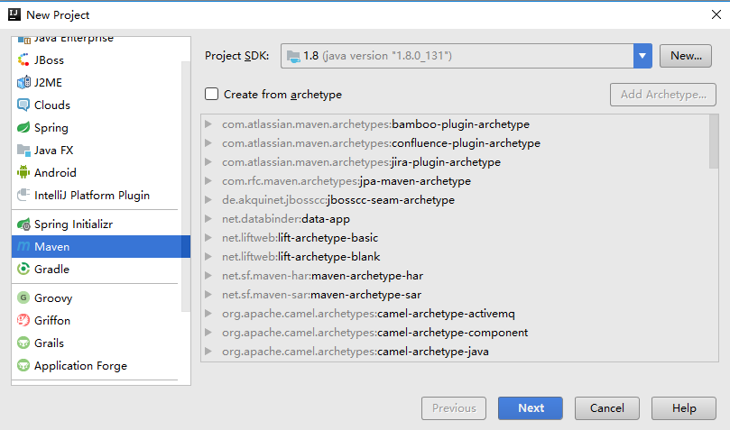
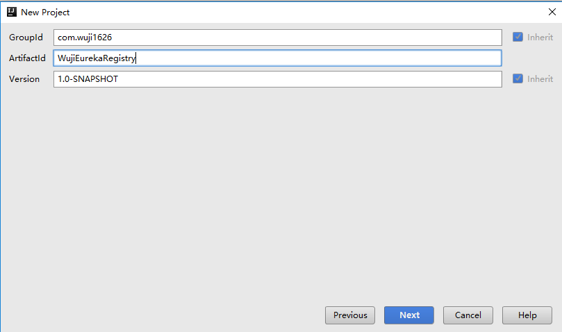
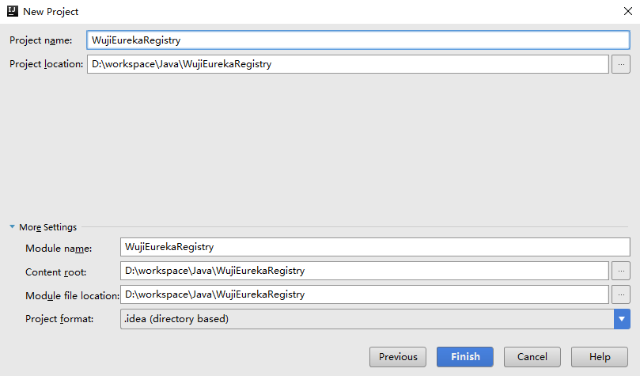
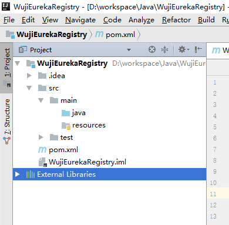
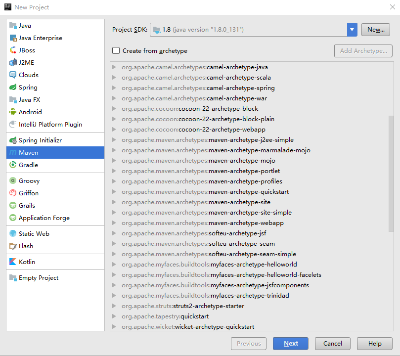
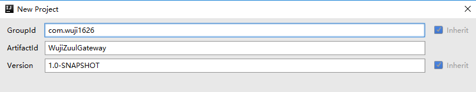
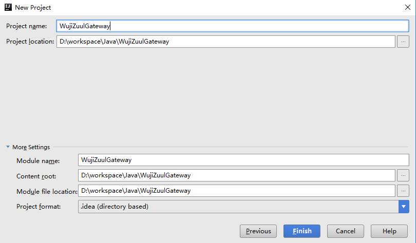
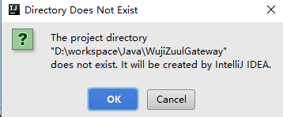
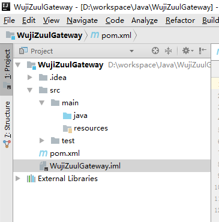

#Spring Cloud实操

##1 Eureka实操
1. 构建Maven工程
  
2. 编辑项目坐标
  
该样例工程的坐标信息：  
GroupId：com.wuji1626  
ArtifactId：WujiEurekaRegistry  
Version：1.0-SNAPSHOT  
3. 文件存储
  
4. 工程结构
  
5. 添加依赖配置
	- 设置工程spring boot版本为1.5.15
	~~~xml
    <parent>
    	<groupId>org.springframework.boot</groupId>
    	<artifactId>spring-boot-starter-parent</artifactId>
    	<version>1.5.15.RELEASE</version>
	</parent>
    ~~~
	- 环境变量设置
	设置编码类型为UTF-8，java版本为1.8，Spring Cloud的版本为Edgware.SR3
    ~~~xml
    <properties>
    	<project.build.sourceEncoding>UTF-8</project.build.sourceEncoding>
    	<project.reporting.outputEncoding>UTF-8</project.reporting.outputEncoding>
    	<java.version>1.8</java.version>
    	<spring-cloud.version>Edgware.SR3</spring-cloud.version>
	</properties>
    ~~~

##2 Zuul实操
1. 构建Maven工程
  
构建项目时，不使用模板，仅选择SDK为JDK1.8即可  
2. 编辑项目坐标
  
该样例工程的坐标信息：  
GroupId：com.wuji1626  
ArtifactId：WujiZuulGateway  
Version：1.0-SNAPSHOT  
3. 文件存储
  
  
4. 工程结构
  
5. 添加依赖
	- 引入将网关作为服务组件注册到注册中心（Eureka），因此首先需要集成Eureka客户端  
	~~~xml
    <dependency>
        <groupId>org.springframework.cloud</groupId>
        <artifactId>spring-cloud-starter-eureka</artifactId>
        <version>1.4.5.RELEASE</version>
    </dependency>
    ~~~
	- 引入Zuul组件支持
	~~~xml
    <dependency>
        <groupId>org.springframework.cloud</groupId>
        <artifactId>spring-cloud-starter-zuul</artifactId>
        <version>1.4.5.RELEASE</version>
    </dependency>
    ~~~
	- 引入Spring Boot的Web功能
	~~~ xml
    <dependency>
        <groupId>org.springframework.boot</groupId>
        <artifactId>spring-boot-starter-web</artifactId>
        <version>1.5.15.RELEASE</version>
    </dependency>
    <dependency>
        <groupId>org.springframework.boot</groupId>
        <artifactId>spring-boot-starter-test</artifactId>
        <version>1.5.15.RELEASE</version>
        <scope>test</scope>
    </dependency>
    ~~~
	- 引入Maven插件
	~~~xml
    <build>
        <plugins>
            <plugin>
                <groupId>org.springframework.boot</groupId>
                <artifactId>spring-boot-maven-plugin</artifactId>
            </plugin>
        </plugins>
    </build>
    ~~~
    