#Spring Cloud实操

##1 Eureka实操
###1.1 创建Eureka服务端
1. 创建工程
利用Spring Initializr创建一个Spring Cloud Eureka工程
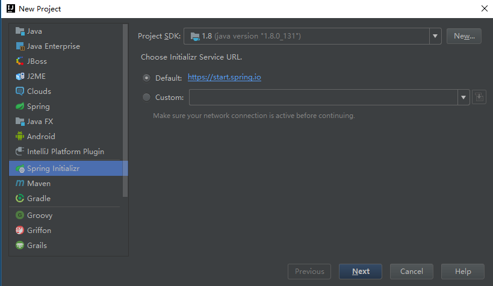  
由于Initializr的工程模板从https://start.spring.io获取，点击下一步后，需要从网络获取工程模板  
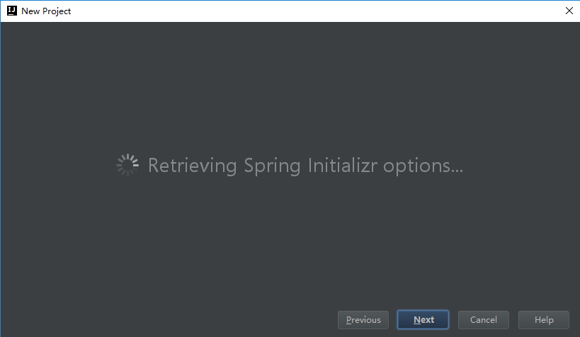  
填写工程信息如下，在指定Group、Artifact信息后，部分信息自动生成：
Group id：com.wuji1626
Artifact id：wuji-eureka-server
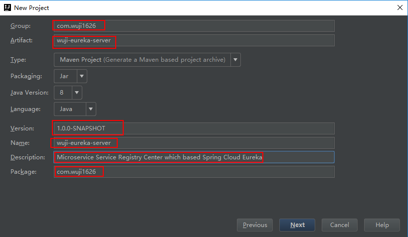  
选择项目依赖，首先选择Spring Boot版本，这里选择当前默认的2.0.5，在依赖中选择：Cloud Discovery（服务发现），在服务发现中选择Eureka Server组件
选择工程生成目录：  
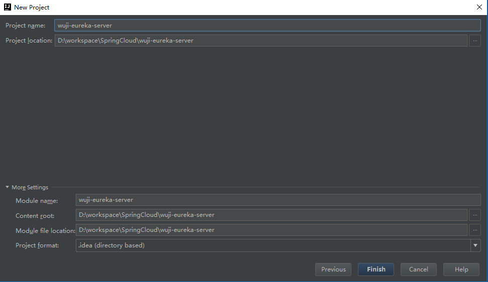  
之后直接生成工程，过程目录结构及依赖关系如下：  
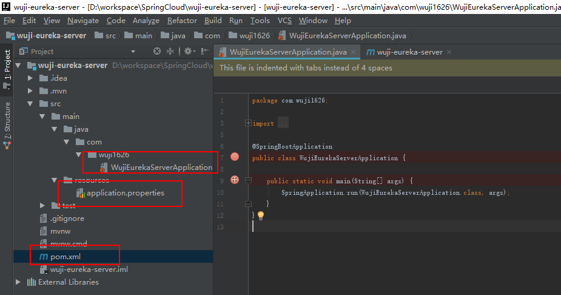  
所有POM文件内容皆由工程模板直接生成：
~~~xml
<?xml version="1.0" encoding="UTF-8"?>
<project xmlns="http://maven.apache.org/POM/4.0.0" xmlns:xsi="http://www.w3.org/2001/XMLSchema-instance"
	xsi:schemaLocation="http://maven.apache.org/POM/4.0.0 http://maven.apache.org/xsd/maven-4.0.0.xsd">
	<modelVersion>4.0.0</modelVersion>

	<groupId>com.wuji1626</groupId>
	<artifactId>wuji-eureka-server</artifactId>
	<version>0.0.1-SNAPSHOT</version>
	<packaging>jar</packaging>

	<name>wuji-eureka-server</name>
	<description>Microservice Service Registry Center which based Spring Cloud Eureka</description>

	<parent>
		<groupId>org.springframework.boot</groupId>
		<artifactId>spring-boot-starter-parent</artifactId>
		<version>2.0.5.RELEASE</version>
		<relativePath/> <!-- lookup parent from repository -->
	</parent>

	<properties>
		<project.build.sourceEncoding>UTF-8</project.build.sourceEncoding>
		<project.reporting.outputEncoding>UTF-8</project.reporting.outputEncoding>
		<java.version>1.8</java.version>
		<spring-cloud.version>Finchley.SR1</spring-cloud.version>
	</properties>

	<dependencies>
		<dependency>
			<groupId>org.springframework.cloud</groupId>
			<artifactId>spring-cloud-starter-netflix-eureka-server</artifactId>
		</dependency>

		<dependency>
			<groupId>org.springframework.boot</groupId>
			<artifactId>spring-boot-starter-test</artifactId>
			<scope>test</scope>
		</dependency>
	</dependencies>

	<dependencyManagement>
		<dependencies>
			<dependency>
				<groupId>org.springframework.cloud</groupId>
				<artifactId>spring-cloud-dependencies</artifactId>
				<version>${spring-cloud.version}</version>
				<type>pom</type>
				<scope>import</scope>
			</dependency>
		</dependencies>
	</dependencyManagement>

	<build>
		<plugins>
			<plugin>
				<groupId>org.springframework.boot</groupId>
				<artifactId>spring-boot-maven-plugin</artifactId>
			</plugin>
		</plugins>
	</build>
</project>
~~~
2. 工程运行
在随模板默认生成的WujiEurekaServerApplication.java中，需要手动添加@EnableEurekaServer，配置EurekaServer默认配置选项。
~~~java
package com.wuji1626;
import org.springframework.boot.SpringApplication;
import org.springframework.boot.autoconfigure.SpringBootApplication;
import org.springframework.cloud.netflix.eureka.server.EnableEurekaServer;
@SpringBootApplication
@EnableEurekaServer
public class WujiEurekaServerApplication {
	public static void main(String[] args) {
		SpringApplication.run(WujiEurekaServerApplication.class, args);
	}
}
~~~
在随模板生成的application.properties文件中添加如下配置：
~~~
server.port=8081
spring.application.name=wuji-service
eureka.instance.hostname=localhost
eureka.client.registerWithEureka=false
eureka.client.fetchRegistry=false
eureka.client.serviceUrl.defaultZone=http://${eureka.instance.hostname}:${server.port}/eureka/
~~~
eureka.client.registerWithEureka ：表示是否将自己注册到Eureka Server，默认为true。由于当前这个应用就是Eureka Server，故而设为false  
eureka.client.fetchRegistry ：表示是否从Eureka Server获取注册信息，默认为true。因为这是一个单点的Eureka Server，不需要同步其他的Eureka Server节点的数据，故而设为false。  
3. 在IDE中运行，以如下ULR进行访问，即可看到Eureka的页面：  
`http://localhost:8081/`  
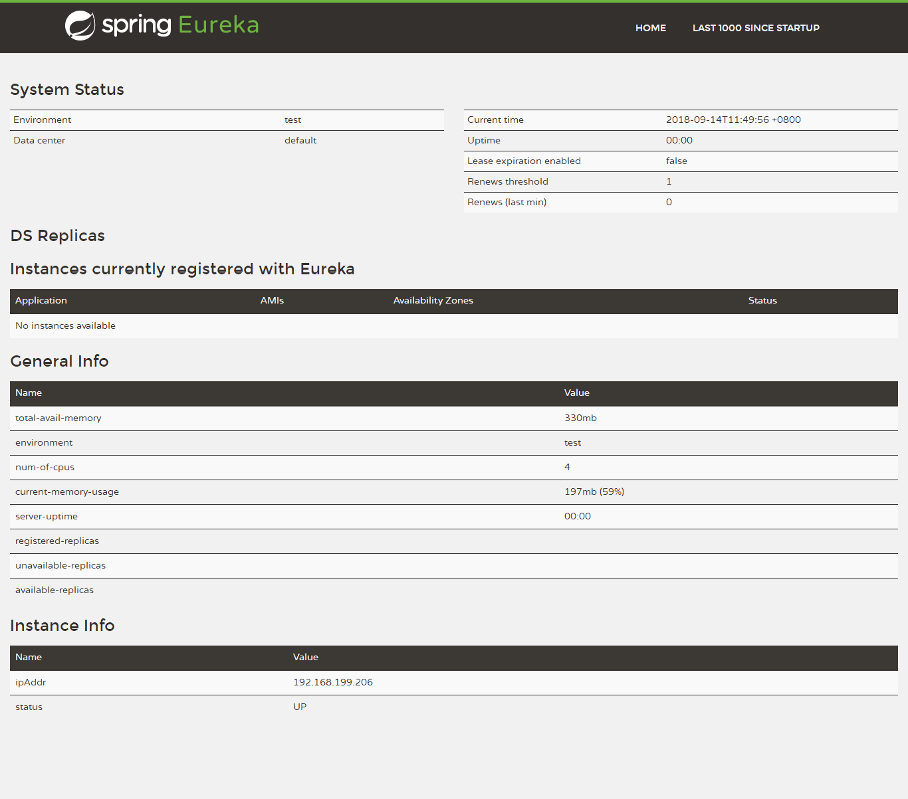  
4. 通过如下maven命令，将Spring Cloud工程生成jar包
`mvn clean`  
`mvn package`  
生成的jar默认会在target目录下。通过java -jar命令运行jar包  
`java -jar D:\workspace\SpringCloud\wuji-eureka-server\target\wuji-eureka-server-0.0.1-SNAPSHOT.jar`

###1.2 通过Eureka体系管理的微服务构建
1. 仍使用Spring Initializr创建新Spring Cloud工程
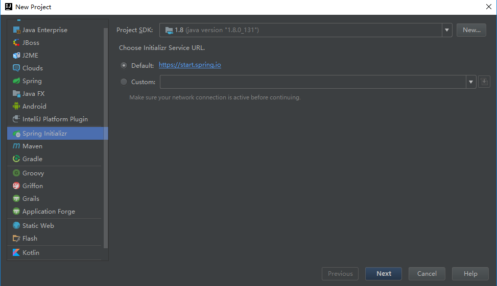  
2. 配置工程的坐标信息  
Group Id：com.wuji1626  
Artifact Id：wuji-eureka-provider-hello  
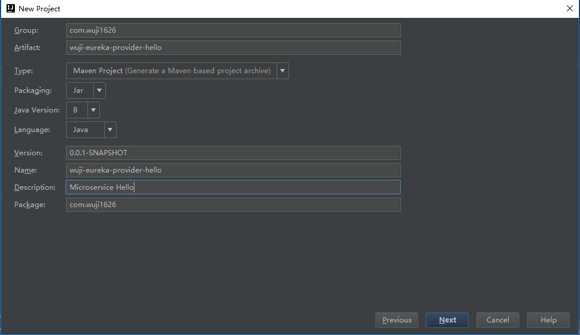  
3. 在工程模板中选择Eureka Discovery为微服务客户端  
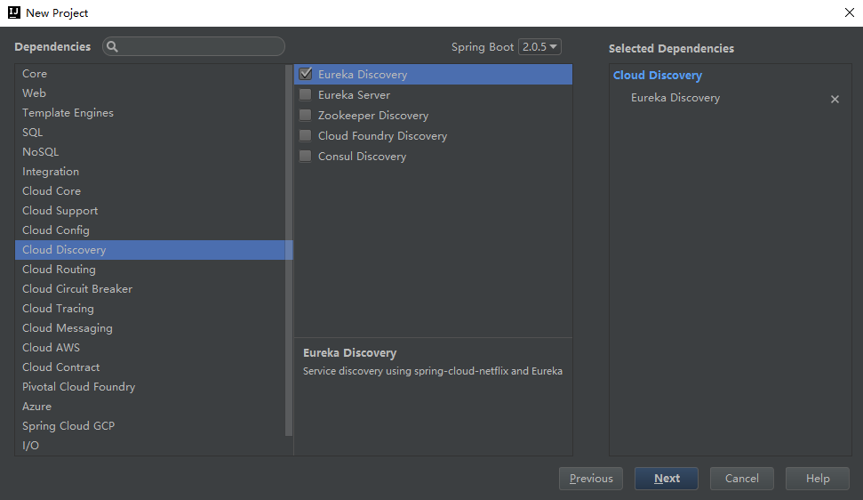  
4. 选择工程的位置，完成工程的创建  
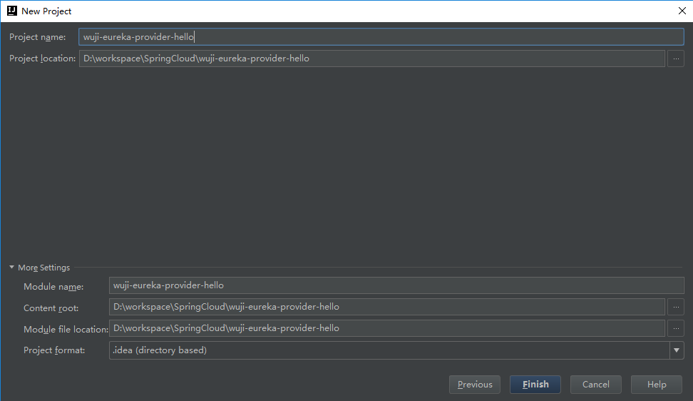  
5. 工程的结构如下：  
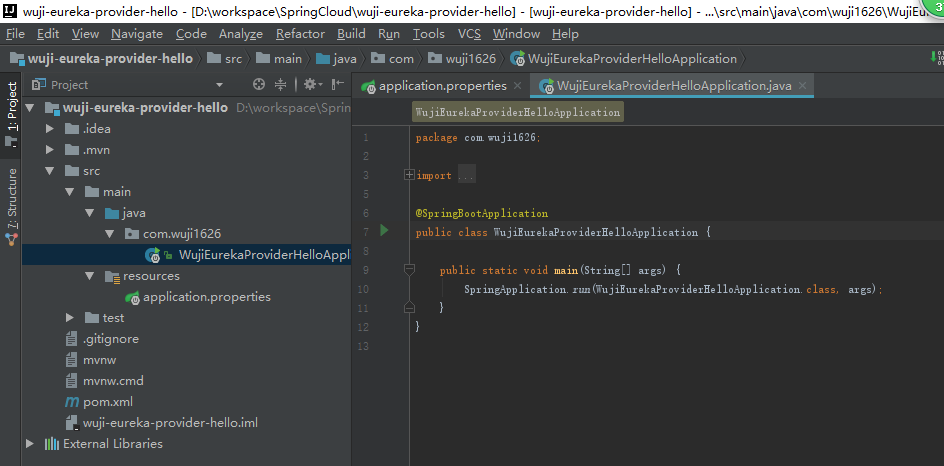  
6. 在maven的pom依赖中增加：
~~~xml
		<dependency>
			<groupId>org.springframework.boot</groupId>
			<artifactId>spring-boot-starter-web</artifactId>
		</dependency>
        <dependency>
			<groupId>org.springframework.boot</groupId>
			<artifactId>spring-boot-starter-actuator</artifactId>
		</dependency>
~~~
工程的全部依赖为：
~~~xml
<?xml version="1.0" encoding="UTF-8"?>
<project xmlns="http://maven.apache.org/POM/4.0.0" xmlns:xsi="http://www.w3.org/2001/XMLSchema-instance"
	xsi:schemaLocation="http://maven.apache.org/POM/4.0.0 http://maven.apache.org/xsd/maven-4.0.0.xsd">
	<modelVersion>4.0.0</modelVersion>
	<groupId>com.wuji1626</groupId>
	<artifactId>wuji-eureka-provider-hello</artifactId>
	<version>0.0.1-SNAPSHOT</version>
	<packaging>jar</packaging>
	<name>wuji-eureka-provider-hello</name>
	<description>Microservice Hello</description>
	<parent>
		<groupId>org.springframework.boot</groupId>
		<artifactId>spring-boot-starter-parent</artifactId>
		<version>2.0.5.RELEASE</version>
		<relativePath/> <!-- lookup parent from repository -->
	</parent>
	<properties>
		<project.build.sourceEncoding>UTF-8</project.build.sourceEncoding>
		<project.reporting.outputEncoding>UTF-8</project.reporting.outputEncoding>
		<java.version>1.8</java.version>
		<spring-cloud.version>Finchley.SR1</spring-cloud.version>
	</properties>
	<dependencies>
		<dependency>
			<groupId>org.springframework.cloud</groupId>
			<artifactId>spring-cloud-starter-netflix-eureka-client</artifactId>
		</dependency>
		<dependency>
			<groupId>org.springframework.boot</groupId>
			<artifactId>spring-boot-starter-web</artifactId>
		</dependency>
		<dependency>
			<groupId>org.springframework.boot</groupId>
			<artifactId>spring-boot-starter-test</artifactId>
			<scope>test</scope>
		</dependency>
		<dependency>
			<groupId>org.springframework.boot</groupId>
			<artifactId>spring-boot-starter-actuator</artifactId>
		</dependency>
	</dependencies>
	<dependencyManagement>
		<dependencies>
			<dependency>
				<groupId>org.springframework.cloud</groupId>
				<artifactId>spring-cloud-dependencies</artifactId>
				<version>${spring-cloud.version}</version>
				<type>pom</type>
				<scope>import</scope>
			</dependency>
		</dependencies>
	</dependencyManagement>
	<build>
		<plugins>
			<plugin>
				<groupId>org.springframework.boot</groupId>
				<artifactId>spring-boot-maven-plugin</artifactId>
			</plugin>
		</plugins>
	</build>
</project>
~~~
7. 修改生成的WujiEurekaProviderHelloApplication.java  
在工程中增加@EnableDiscoveryClient注解，将该服务注册到Eureka注册中心  
~~~java
@SpringBootApplication
@EnableDiscoveryClient
public class WujiEurekaProviderHelloApplication {

	public static void main(String[] args) {
		new SpringApplicationBuilder(WujiEurekaProviderHelloApplication.class).web(WebApplicationType.SERVLET).run();
	}
}
~~~
8. 修改Application.properties
spring.application.name用于指定服务名称  
server.port该服务的端口  
eureka.client.serviceUrl.defaultZone指定eureka注册中心地址  
~~~
spring.application.name=eureka-provider-hello
server.port=8082
eureka.client.serviceUrl.defaultZone=http://localhost:8081/eureka/
~~~
9. 在工程下创建Controller类  
~~~java
@RestController
public class HelloController {
    private final Logger logger = Logger.getLogger("Hello Service");

    @Value("${server.port}")
    private String port;

    @RequestMapping(value="hello", method = RequestMethod.GET)
    public String index(){
        logger.info("/hello is called, port: " + port);
        return "hello world! Port:" + port;
    }
}
~~~
10. 同样通过maven命令将工程打包
`mvn clean`  
`mvn package -Dmaven.test.skip=true`  
`java -jar D:\workspace\SpringCloud\wuji-eureka-provider-hello\target\wuji-eureka-provider-hello-0.0.1-SNAPSHOT.jar`  
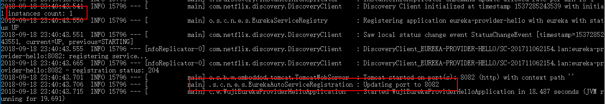  
11. 在Eureka注册页面查看服务的注册状态  
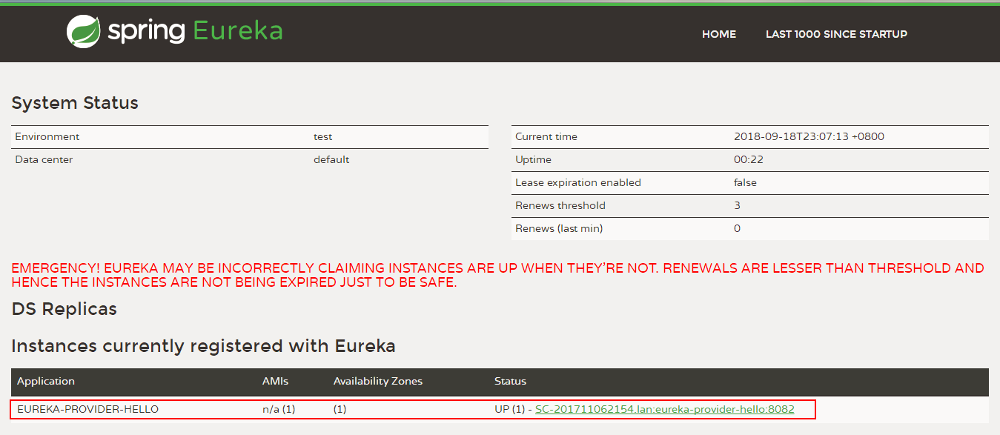  
通过localhost:8082/hello可以访问到该服务  
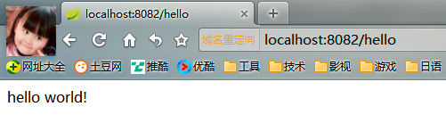  
12. 注意事项
	■ 如果服务在启动时报Cannot execute request on any known server，说明Eureka Server没有启动，在启用@EnableDiscoveryClient或者@EnableEurekaClient该客户端会自动去寻找Eureka Server，如果找不到就会报这个错
    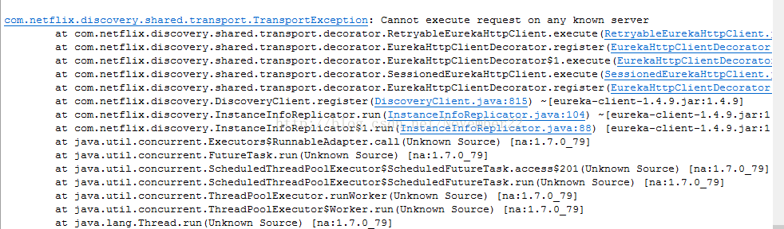

##2 Zuul实操
1. 构建Maven工程
  
构建项目时，不使用模板，仅选择SDK为JDK1.8即可  
2. 编辑项目坐标
  
该样例工程的坐标信息：  
GroupId：com.wuji1626  
ArtifactId：WujiZuulGateway  
Version：1.0-SNAPSHOT  
3. 文件存储
  
  
4. 工程结构
  
5. 添加依赖
	- 引入将网关作为服务组件注册到注册中心（Eureka），因此首先需要集成Eureka客户端  
	~~~xml
    <dependency>
        <groupId>org.springframework.cloud</groupId>
        <artifactId>spring-cloud-starter-eureka</artifactId>
        <version>1.4.5.RELEASE</version>
    </dependency>
    ~~~
	- 引入Zuul组件支持
	~~~xml
    <dependency>
        <groupId>org.springframework.cloud</groupId>
        <artifactId>spring-cloud-starter-zuul</artifactId>
        <version>1.4.5.RELEASE</version>
    </dependency>
    ~~~
	- 引入Spring Boot的Web功能
	~~~ xml
    <dependency>
        <groupId>org.springframework.boot</groupId>
        <artifactId>spring-boot-starter-web</artifactId>
        <version>1.5.15.RELEASE</version>
    </dependency>
    <dependency>
        <groupId>org.springframework.boot</groupId>
        <artifactId>spring-boot-starter-test</artifactId>
        <version>1.5.15.RELEASE</version>
        <scope>test</scope>
    </dependency>
    ~~~
	- 引入Maven插件
	~~~xml
    <build>
        <plugins>
            <plugin>
                <groupId>org.springframework.boot</groupId>
                <artifactId>spring-boot-maven-plugin</artifactId>
            </plugin>
        </plugins>
    </build>
    ~~~
    