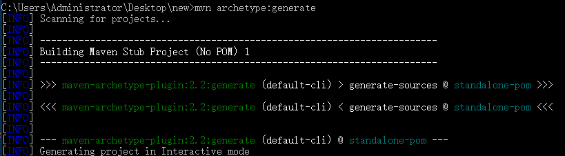
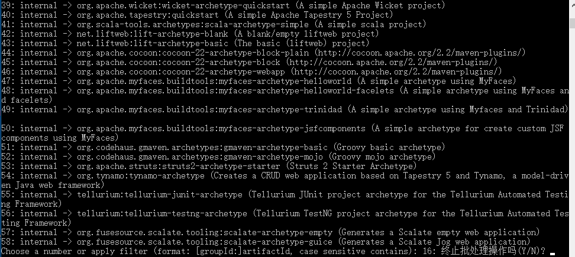
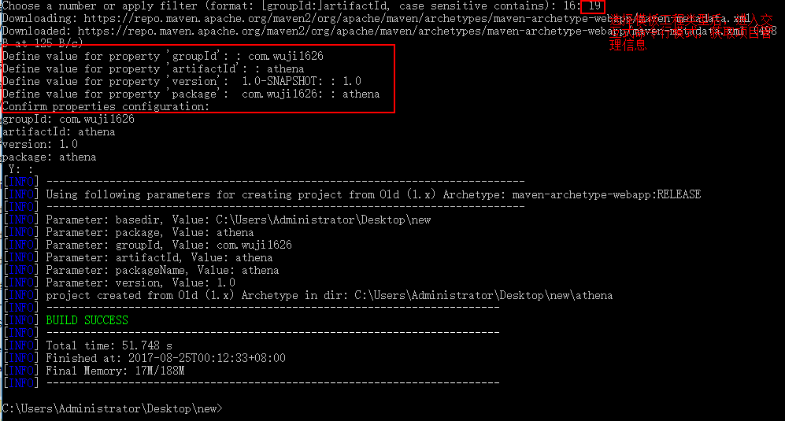

[TOC]

##1 Maven简介
###1.1 Maven简介
Maven的功能：Java平台项目构建、依赖管理、项目信息管理  
Maven可用于构建（Build）工程  
Maven可以处理第三方开源类库的依赖，当类库版本不一致、版本冲突、依赖臃肿等问题。基于坐标解决每个构件（artifact），通过坐标可以找到任何Java类库（jar包）  
Maven管理项目信息，包括：项目描述、开发者列表、版本控制系统地址、许可证、缺陷管理系统地址等。通过一些插件，可以获得项目文档、测试报告、静态分析报告、源码版本日志等信息  
Maven提供免费的中央仓库，可以找到任何流行的开源类库。通过衍生工具Nexus还能对仓库进行快速搜索。  
Maven对项目目录结构、测试用例命名方式都有既定规则（约定），约定由于配置（Convention Over Configuration）  
###1.2 使用Maven的必要性
IDE无法一键完成编译、测试、代码生成等工作  
很难在各个项目中完成统一配置

Maven不仅上构建工具，还是一个依赖管理工具和项目信息管理工具  
项目信息管理：将原本分散在项目各个角落的信息集中管理，包括：项目描述、开发者列表、版本控制系统地址、许可证、缺陷管理系统地址等。
##2 Maven的安装和配置
在Maven的bin目录下有mvn和mvnDebug两个脚本，mvnDebug可以通过MAVEN_DEBUG_OPTION配置，开启debug模式，调试Maven本身  
- `mvn help:system`：通过该命令，获取系统中所有java系统属性和环境变量，在执行该命令时，Maven会从中心库中下载maven-help-plugin放到本地仓库中
- 设置HTTP代理
在setting.xml中进行如下配置：
~~~
<proxies>  
   <proxy>  
     <id>myProxy</id>  
     <active>true</active>  
     <protocol>http</protocol>  
     <host>123.123.123.123</host>  
     <port>8080</port>  
     <username>XXXXX</username>  
     <password>XXXXX</password>  
     <nonProxyHosts>*.XXX.com|XXX.org</nonProxyHosts>  
   </proxy>  
</proxies>
~~~
1. proxies中可以配置多个proxy，但是默认第一个proxy生效。
2. active中的TRUE表示该代理目前生效状态。
3. http协议、主机地址、端口不在赘述。
4. 用户名密码按需配置即可。
5. nonProxyHost表示不需要代理访问的地址。中间的竖线分隔多个地址，此处可以使用星号作为通配符号
- Maven最佳实践
	1. 设置MAVEN_OPTS环境变量：通常设置值为`-Xms128m -Xmx512m`  
	2. 配置用户返settings.xml：在~/.m目录下的settings.xml配置不会影响到系统中其他用户的配置，推荐使用在~/.m目录下的settings.xml进行配置
	3. Eclipse内嵌的Maven不要使用：①内嵌的maven不稳定；②出Eclipse中使用maven命令外，在命令行窗口也经常执行maven命令，不一样的maven版本，构建的行为也不同，这是开发者不希望看到的  

##3 maven使用
###3.1 mvn命令
####3.1.1 编译
`mvn clean compile`:clean告诉Maven清理输出目录target，compile告诉Maven编译项目主代码  
- Maven先执行clean:clean任务，删除target目录
- Maven再执行compiler:compile任务，编译项目主代码

####3.1.2 打包
`mvn clean package`：将程序打包，默认使用jar:jar任务将主代码打包成jar，命名为artifact name-version-SNAP-SHOT.jar。其中artifact name、version都是pom中设置的参数。如果需要修改最终输出的jar名称，可以修改pom文件中的finalName

####3.1.3 测试
`mvn clean test`：maven在执行test命令时，实际执行了：clean:clean、resources:resources、compiler:compile、resources:testResources、compiler:testCompile  
如果JUnit是4.0，需要java的编译等级为JDK1.5以上，因此在编译时需要在编译插件的配置中添加编译目标的控制
~~~
<plugin>
    <groupId>org.apache.maven.plugins</groupId>
    <artifactId>maven-compiler-plugin</artifactId>
    <version>3.1</version>
    <configuration>
        <source>1.6</source> <!-- 源代码使用的开发版本 -->
        <target>1.6</target> <!-- 需要生成的目标class文件的编译版本 -->
        <!-- 一般而言，target与source是保持一致的，但是，有时候为了让程序能在其他版本的jdk中运行(对于低版本目标jdk，源代码中需要没有使用低版本jdk中不支持的语法)，会存在target不同于source的情况 -->
    
        <!-- 这下面的是可选项 -->
        <meminitial>128m</meminitial>
        <maxmem>512m</maxmem>
        <fork>true</fork> <!-- fork is enable,用于明确表示编译版本配置的可用 --> 
        <compilerVersion>1.3</compilerVersion>
        
        <!-- 这个选项用来传递编译器自身不包含但是却支持的参数选项 -->
        <compilerArgument>-verbose -bootclasspath ${java.home}\lib\rt.jar</compilerArgument>
        
    </configuration>
</plugin>
~~~
####3.1.4 安装（install）
`mvn clean install`：将编译打包后的jar包安装到本地仓库  

####3.1.5 生成可运行jar包
插件中可以指定mainClass
~~~
            <plugin>
                <groupId>org.apache.maven.plugins</groupId>
                <artifactId>maven-shade-plugin</artifactId>
                <version>1.2.1</version>
                <executions>
                    <execution>
                        <phase>package</phase>
                        <goals>
                            <goal>shade</goal>
                        </goals>
                        <configuration>
                            <transformers>
                                <transformer implementation="org.apache.maven.plugins.shade.resource.ManifestResourceTransformer">
                                    <mainClass>com.juvenxu.mvnbook.helloworld.HelloWorld</mainClass>
                                </transformer>
                            </transformers>
                        </configuration>
                    </execution>
                </executions>
            </plugin>
~~~

####3.1.5 archetype生成模板工程
`mvn archetype:generate`：下载maven最新的稳定版本archetype插件。Maven2.0时需要指定插件版本，否则会因为不稳定而执行失败  
指定参数细节的archetype插件语法：
mvn org.apache.maven.plugins(groupId):maven-archetype-plugin(artifectId):[version]:[goal(如：generate、install等)]  
执行完generate命令时，进入交互窗口，需要分别输入项目的：groupId、artifactId、version、package信息  
在执行`mvn archetype:generate`时，命令行卡死在【Generating project in Interactive mode】   
  
由于默认情况下需要从远程服务器抓取archetype列表，时间非常长，如卡死一般。这时需要在generate执行时需指定`-DarchetypeCatalog=internal`参数，则出现选项列表，选择数字可以生成相应模板工程  
  
` mvn archetype:generate -DarchetypeCatalog=internal`  
选择相应的模板后，进入交互，输入关键的工程管理属性，完成工程搭建  
  

###3.2 POM
####3.2.1 scope
scope指明依赖的范围，如：test：表示只对测试有效，即：在测试代码中可以import JUnit，在主代码中import JUnit代码，就会报错  

    
