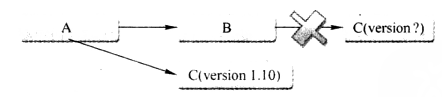

[TOC]

##1 Maven简介
###1.1 Maven简介
Maven的功能：Java平台项目构建、依赖管理、项目信息管理  
Maven可用于构建（Build）工程  
Maven可以处理第三方开源类库的依赖，当类库版本不一致、版本冲突、依赖臃肿等问题。基于坐标解决每个构件（artifact），通过坐标可以找到任何Java类库（jar包）  
Maven管理项目信息，包括：项目描述、开发者列表、版本控制系统地址、许可证、缺陷管理系统地址等。通过一些插件，可以获得项目文档、测试报告、静态分析报告、源码版本日志等信息  
Maven提供免费的中央仓库，可以找到任何流行的开源类库。通过衍生工具Nexus还能对仓库进行快速搜索。  
Maven对项目目录结构、测试用例命名方式都有既定规则（约定），约定由于配置（Convention Over Configuration）  
###1.2 使用Maven的必要性
IDE无法一键完成编译、测试、代码生成等工作  
很难在各个项目中完成统一配置

Maven不仅是构建工具，还是一个依赖管理工具和项目信息管理工具  
项目信息管理：将原本分散在项目各个角落的信息集中管理，包括：项目描述、开发者列表、版本控制系统地址、许可证、缺陷管理系统地址等。
##2 Maven的安装和配置
在Maven的bin目录下有mvn和mvnDebug两个脚本，mvnDebug可以通过MAVEN_DEBUG_OPTION配置，开启debug模式，调试Maven本身  
- `mvn help:system`：通过该命令，获取系统中所有java系统属性和环境变量，在执行该命令时，Maven会从中心库中下载maven-help-plugin放到本地仓库中
- 设置HTTP代理
在setting.xml中进行如下配置：
~~~
<proxies>  
   <proxy>  
     <id>myProxy</id>  
     <active>true</active>  
     <protocol>http</protocol>  
     <host>123.123.123.123</host>  
     <port>8080</port>  
     <username>XXXXX</username>  
     <password>XXXXX</password>  
     <nonProxyHosts>*.XXX.com|XXX.org</nonProxyHosts>  
   </proxy>  
</proxies>
~~~
1. proxies中可以配置多个proxy，但是默认第一个proxy生效。
2. active中的TRUE表示该代理目前生效状态。
3. http协议、主机地址、端口不在赘述。
4. 用户名密码按需配置即可。
5. nonProxyHost表示不需要代理访问的地址。中间的竖线分隔多个地址，此处可以使用星号作为通配符号
- Maven最佳实践
	1. 设置MAVEN_OPTS环境变量：通常设置值为`-Xms128m -Xmx512m`  
	2. 配置用户返settings.xml：在~/.m目录下的settings.xml配置不会影响到系统中其他用户的配置，推荐使用在~/.m目录下的settings.xml进行配置
	3. Eclipse内嵌的Maven不要使用：①内嵌的maven不稳定；②出Eclipse中使用maven命令外，在命令行窗口也经常执行maven命令，不一样的maven版本，构建的行为也不同，这是开发者不希望看到的  

##3 maven使用
###3.1 mvn命令
####3.1.1 编译
`mvn clean compile`:clean告诉Maven清理输出目录target，compile告诉Maven编译项目主代码  
- Maven先执行clean:clean任务，删除target目录
- Maven再执行compiler:compile任务，编译项目主代码

####3.1.2 打包
`mvn clean package`：将程序打包，默认使用jar:jar任务将主代码打包成jar，命名为artifact name-version-SNAP-SHOT.jar。其中artifact name、version都是pom中设置的参数。如果需要修改最终输出的jar名称，可以修改pom文件中的finalName

####3.1.3 测试
`mvn clean test`：maven在执行test命令时，实际执行了：clean:clean、resources:resources、compiler:compile、resources:testResources、compiler:testCompile  
如果JUnit是4.0，需要java的编译等级为JDK1.5以上，因此在编译时需要在编译插件的配置中添加编译目标的控制
~~~
<plugin>
    <groupId>org.apache.maven.plugins</groupId>
    <artifactId>maven-compiler-plugin</artifactId>
    <version>3.1</version>
    <configuration>
        <source>1.6</source> <!-- 源代码使用的开发版本 -->
        <target>1.6</target> <!-- 需要生成的目标class文件的编译版本 -->
        <!-- 一般而言，target与source是保持一致的，但是，有时候为了让程序能在其他版本的jdk中运行(对于低版本目标jdk，源代码中需要没有使用低版本jdk中不支持的语法)，会存在target不同于source的情况 -->
    
        <!-- 这下面的是可选项 -->
        <meminitial>128m</meminitial>
        <maxmem>512m</maxmem>
        <fork>true</fork> <!-- fork is enable,用于明确表示编译版本配置的可用 --> 
        <compilerVersion>1.3</compilerVersion>
        
        <!-- 这个选项用来传递编译器自身不包含但是却支持的参数选项 -->
        <compilerArgument>-verbose -bootclasspath ${java.home}\lib\rt.jar</compilerArgument>
        
    </configuration>
</plugin>
~~~
####3.1.4 安装（install）
`mvn clean install`：将编译打包后的jar包安装到本地仓库  

####3.1.5 生成可运行jar包
插件中可以指定mainClass
~~~
            <plugin>
                <groupId>org.apache.maven.plugins</groupId>
                <artifactId>maven-shade-plugin</artifactId>
                <version>1.2.1</version>
                <executions>
                    <execution>
                        <phase>package</phase>
                        <goals>
                            <goal>shade</goal>
                        </goals>
                        <configuration>
                            <transformers>
                                <transformer implementation="org.apache.maven.plugins.shade.resource.ManifestResourceTransformer">
                                    <mainClass>com.juvenxu.mvnbook.helloworld.HelloWorld</mainClass>
                                </transformer>
                            </transformers>
                        </configuration>
                    </execution>
                </executions>
            </plugin>
~~~

####3.1.5 archetype生成模板工程
`mvn archetype:generate`：下载maven最新的稳定版本archetype插件。Maven2.0时需要指定插件版本，否则会因为不稳定而执行失败  
指定参数细节的archetype插件语法：
mvn org.apache.maven.plugins(groupId):maven-archetype-plugin(artifectId):[version]:[goal(如：generate、install等)]  
执行完generate命令时，进入交互窗口，需要分别输入项目的：groupId、artifactId、version、package信息  
在执行`mvn archetype:generate`时，命令行卡死在【Generating project in Interactive mode】   
  
由于默认情况下需要从远程服务器抓取archetype列表，时间非常长，如卡死一般。这时需要在generate执行时需指定`-DarchetypeCatalog=internal`参数，则出现选项列表，选择数字可以生成相应模板工程  
  
` mvn archetype:generate -DarchetypeCatalog=internal`  
选择相应的模板后，进入交互，输入关键的工程管理属性，完成工程搭建  
  

###3.2 POM
Maven中的依赖都需要一个坐标指定各组件的信息，是各组件被引入的秩序  
- **groupId**：当前Maven项目所隶属的实际项目，Maven项目不一定与实际项目一一对应，一个实际项目可能对应多个Maven项目。  
Maven项目实际上不应该只隶属于组织或公司，因为组织或公司会有很多实际项目，如果groupId定义到组织基本，后续的artifactId只能定义到Maven项目（模块）级别，实际项目的层次将难以定义  
通常groupId与包名相似，与域名反向一一对应  
- **artifactId**：Maven项目模块，通常推荐实际项目名作为前缀。如：nexus-indexer，nexus是实际项目前缀，indexer是模块  
Maven默认情况下，会以artifactId为生成的构件名，为避免生成的组件命名重复都是core、util，最好加上实际项目前缀  
- **version**：版本
- **package**：Maven项目的打包方式。采用不同的打包方式会影响到使用不同的打包命令  
packaging不定义时，默认使用jar包方式  
- classifier：帮助定义构建输出的附属构件。如最终构件出nexus-indexeer-2.0.0.jar，附属的构件有：nexus-indexeer-2.0.0-javadoc.jar、nexus-indexeer-2.0.0-sources.jar等。不能直接定义  
- type：依赖的类型，对应于项目坐标定义的packaging。大部分情况，不必声明，默认jar  
- scope指明依赖的范围，如：test：表示只对测试有效，即：在测试代码中可以import JUnit，在主代码中import JUnit代码，就会报错  
- optional：标记依赖是否可选  
- exclusions：用来排除传递性依赖  

构件的一般生成规则：**artifactId-version[-classifier].packaging**  

####3.2.1 scope
Maven编译的主代码和测试代码，分别有一套classpath。有些jar只需要在测试的classpath下，而有些jar只需要在实际运行的classpath下  
Maven有三种依赖范围：  
- compile：编译依赖范围，默认的依赖范围。对于编译、测试、运行三种classpath都有效
- test：测试依赖范围，只对于测试classpath有效。在编译主代码或运行项目时无法使用此类依赖  
- provided：已提供依赖范围。编译、测试classpath有效，在运行时无效。如：servlet-api，编译和测试项目时需要该依赖，运行项目时，由于容器已经提供，不需要Maven重复引入  
- runtime：运行时依赖范围。测试运行classpath有效，在编译主代码时无效。如：jdbc驱动，主代码编译时只需提供JDK的jdbc接口，只有在执行测试或运行时才需要实现上述jdbc驱动  
- system：系统依赖范围。与三种classpath的关系，和provided依赖范围完全一致。使用system范围的依赖必须通过systemPath显示指定依赖玩具的路径。此类依赖不是通过Maven仓库解析的，而且往往与本机系统绑定，可能造成构建不可移植，需要慎用。systemPath元素可以引用环境变量
- import（Maven2.0.9以上）：导入依赖范围。不会对三种classpath产生影响
  
    
####3.2.2 传递性依赖
如spring-core实际还依赖common-logging。有了依赖传递机制，就不需要考虑一个jar包还依赖了什么，也不用担心引入多余的依赖。
依赖范围的传递性：  
  
>上表，左侧列为第一知己依赖范围，第一行表示第二直接依赖范围，中间交叉点表示传递依赖范围  

当传递依赖的版本不一致时需要**依赖调解**（Dependency Mediation）。
原则1：路径最近者优先  
A→B→C→X（1.0），A→D→X（2.0），其中1.0长度3,2.0长度2  
原则2：第一生命者优先  
####3.2.3 可选依赖
B可选X，可选Y实现某些互斥特性，就需要可选依赖实现。如持久化层的隔离，有MySQL实现，PostgreSQL实现，在依赖时就可以使用`<opional>true</optional>`  
~~~XML
<dependencies>
	<dependency>
    	<groupId>mysql</groupId>
        <artifactId>mysql-connector-java</artifactId>
        <version>5.1.10</version>
        <optional>true</optional>
    </dependency>
    <dependency>
    	<groupId>postgresql</groupId>
        <artifactId>postgresql</artifactId>
        <version>8.4-701.jdbc3</version>
        <optional>true</optional>
    </dependency>
</dependencies>
~~~
如上述依赖关系，就是B的依赖。  
可选依赖关系不能传递，如果A引用B，持久化层依赖MySQL、PostgreSQL都不能传递，需要显式再次依赖声明  
一般可选依赖不提倡使用，根据单一职责原则，应该分别有两个版本，分别按照底层持久化层不同，开发两个版本  
####3.2.4 排除依赖
传递性依赖会给项目隐式引入很多依赖  
exclusions可以包含一个或多个exclusion子元素，可以排除一个或多个传递性依赖。exclusion只需groupId、artifactId，不需要指定version元素，因为只需要定位一个依赖关系。Maven解析后的依赖中，不可能出现groupId、artifactId相同，但是version不同的两个依赖
  
####3.2.5 归类依赖
~~~XML
<properties>
	<org.springframework.version>4.0.8.RELEASE</org.springframework.version>
</properties>
<dependencies>
	    <dependency>  
        <groupId>org.springframework</groupId>  
        <artifactId>spring-core</artifactId>  
        <version>${org.springframework.version}</version>  
    </dependency>
    <dependency>  
        <groupId>org.springframework</groupId>  
        <artifactId>spring-context</artifactId>  
        <version>${org.springframework.version}</version>  
    </dependency>
    <dependency>  
        <groupId>org.springframework</groupId>  
        <artifactId>spring-context-support</artifactId>  
        <version>${org.springframework.version}</version>  
    </dependency> 
    <dependency>  
        <groupId>org.springframework</groupId>  
        <artifactId>spring-jdbc</artifactId>  
        <version>${org.springframework.version}</version>  
    </dependency>
    <dependency>  
        <groupId>org.springframework</groupId>  
        <artifactId>spring-orm</artifactId>  
        <version>${org.springframework.version}</version>  
    </dependency>
    <dependency>  
        <groupId>org.springframework</groupId>  
        <artifactId>spring-oxm</artifactId>  
        <version>${org.springframework.version}</version>  
    </dependency>
    <dependency>  
        <groupId>org.springframework</groupId>  
        <artifactId>spring-web</artifactId>  
        <version>${org.springframework.version}</version>  
    </dependency>
    <dependency>  
        <groupId>org.springframework</groupId>  
        <artifactId>spring-webmvc</artifactId>  
        <version>${org.springframework.version}</version>  
    </dependency>
</dependencies>
~~~
####3.2.6 优化依赖
- 查看当前工程已解析依赖：`mvn dependency:list`  
- 查看当前工程依赖树：`mvn dependency:tree`  
- 分析当前工程的依赖情况：`mvn dependency:analyze`  
使用该分析命令，输出的依赖报告中：
Used undeclared dependencies，意为使用到的，但没有显示声明的依赖；
Unused declared dependencies，项目中未使用，但显示声明。analyze只会分析主代码、测试代码需要的依赖，隐式的依赖不做分析

###3.3 Repository
仓库分类：本地仓库、远程仓库  
  
####3.3.1 本地仓库
Maven的settings中可以设定本地仓库的存放位置  
~~~XML
<settings>
	<localRepository>D:\java\repository\</localRepository>
</settings>
~~~
mvn clean install：改命令中，install插件的install目标将项目构建输出文件安装到本地仓库
####3.3.2 远程仓库
Maven必须知道至少一个可用的远程仓库，才能下载需要的构建。Maven的安装文件自带中央仓库配置，在$M2_HOME/lib/maven-model-builder-3.0.jar中的org/apache/maven/model/pom-4.0.0.xml中有如下配置：
~~~XML
<repositories>
	<repository>  
    	<id>central</id>  
        <name>Maven Repository Switchboard</name>  
        <url>http://repo1.maven.org/maven2</url>  
        <snapshots>  
                <enabled>false</enabled>  
        </snapshots>  
    </repository>
</repositories>
~~~
所有Maven工程的pom都继承这个pom，其中id central是该仓库的唯一标识。snapshot为false，是从该仓库不下载快照版本的构件  
Maven工程的pom.xml中可以显式设置repository，如果id指明central中央仓库将被覆盖  
release、snapshot还有另外两个元素：  
updatePolicy：用来配置Maven从远程仓库检查更新的频率，默认是daily，表示每天检查一次。其他选项：never、always（每次检查）、interval：X——每隔X分钟检查一次更新（X为任意整数）  
checksumPolicy：检查检验和文件的策略。默认warn：构建时输出警告信息；fail：遇到教研和错误就让构建失败；ignore完全忽略校验和错误  
■仓库认证  
<settings>
	...
    <servers>
    	<server>
        	<id>my-proj</id>
            <username>repo-user</username>
            <password>repo-pwd</password>
        </server>
    </servers>
    ...
</settings>
■部署至远程仓库
Maven除能对项目进行编译、测试、打包外，还能将项目生成的构件部署到仓库中  
<project>
	...
    <distributionManagement>
    	<repository>
        	<id>proj-release</id>
            <name>Proj Release Repository</name>
            <url>http://127.0.0.1/content/repositories/proj-release</url>
        </repository>
        <snapshotRepository>
        	<id>proj-snapshots</id>
            <name>Proj Snapshot Repository</name>
            <url>http://127.0.0.1/content/repositories/proj-snapshots</url>
        </snapshotRepository>
    </distributionManagement>
    ...
</project>
distributionManagement包含repository、snapshotRepository子元素，分别表示发布版本构件仓库、快照版本仓库  
远程库往往需要认证  
`mvn clean deploy`将会将项目构建输出的构件部署到配置对应的远程仓库
####3.3.3 镜像
~~~XML
<settings>
	...
    <mirrors>
    	<mirror>
        	<id>maven.net.cn</id>
            <name>one of the central mirrors in China</name>
            <url>http://maven.net.cn/content/groups/public/</url>
            <mirrorOf>central</mirrorOf>
        </mirror>
    </mirrors
    ...
</settings>  
~~~  
mirrorOf值为central，表示配置为中央仓库的镜像，任何对于中央仓库的请求都会转至该镜像，用户也可以使用同样的方法配置其他仓库的镜像  
mirrorOf值为*，表示该配置是所有Maven仓库的镜像，任何远程仓库都被转至该镜像地址  
mirrorOf值为external:*，匹配所有远程仓库，使用localhost除外，使用file://协议除外  
mirrorOf值为repo1，repo2，匹配仓库repo1，repo2，用逗号分隔多个远程参控股  
mirrorOf值为*,!repo1，匹配所有远程仓库，repo1除外  

###3.4 仓库搜索
http://repository.sonatype.org/  
http://mvnrepository.com/  

